# Benchmark of `typescript-json`
> CPU: AMD Ryzen 7 5800H with Radeon Graphics
> Memory: 64,928 MB
> NodeJS version: v16.6.0
> TypeScript-JSON version: 3.3.12


## is
 Components | typescript-json | io-ts | class-validator | zod | ajv 
------------|-----------------|-------|-----------------|-----|-----
object (hierarchical) | 109854.2795232936 | 9039.522058823528 | 58.27067669172932 | 395.855472901169 | 86310.66545123063
object (recursive) | 80738.98431665423 | 4809.428467419003 | 39.66368122829464 | 69.23783287419651 | Failed
object (union, explicit) | 17086.15649183147 | 3271.8195266272187 | 16.328727794724564 | 34.571062740076826 | 1197.5418596366228
object (union, implicit) | 15526.170291190563 | 3241.9504932067744 | 16.750720461095103 | 54.02384500745156 | Failed
array (recursive) | 6923.586816424231 | 511.4648474512033 | 3.7615196539401916 | 8.90207715133531 | Failed
array (union, explicit) | 4047.1213788045475 | 381.12391930835736 | 7.293809612867028 | 2.822201317027281 | Failed
array (union, implicit) | 4031.3718210506777 | 456.0561299852289 | 8.767123287671234 | 3.777861730260673 | Failed
ultimate union | 682.3529411764705 | Failed | Failed | Failed | Failed


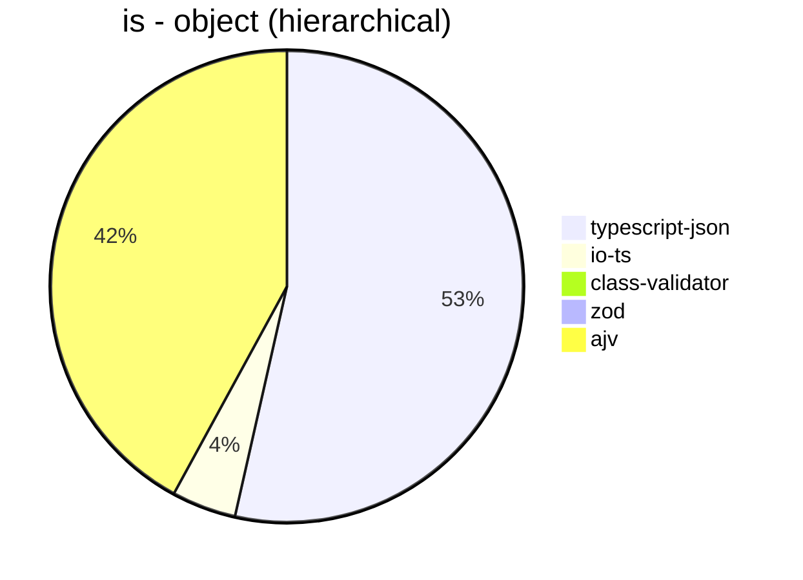


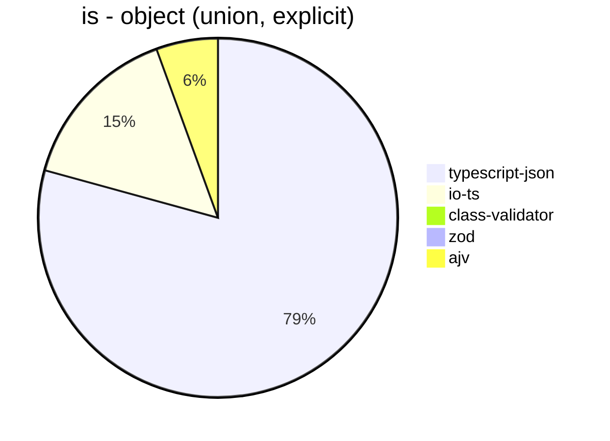


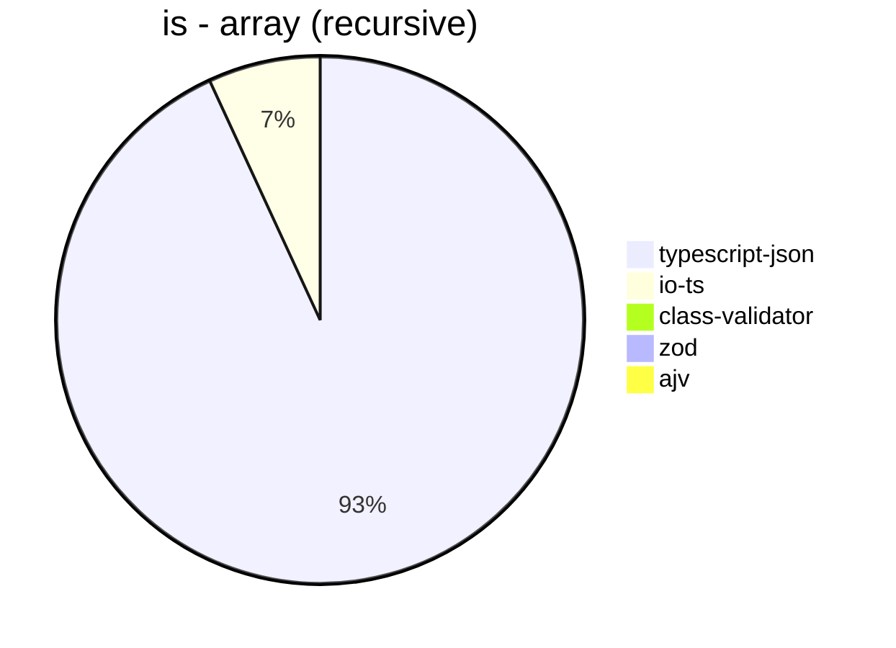


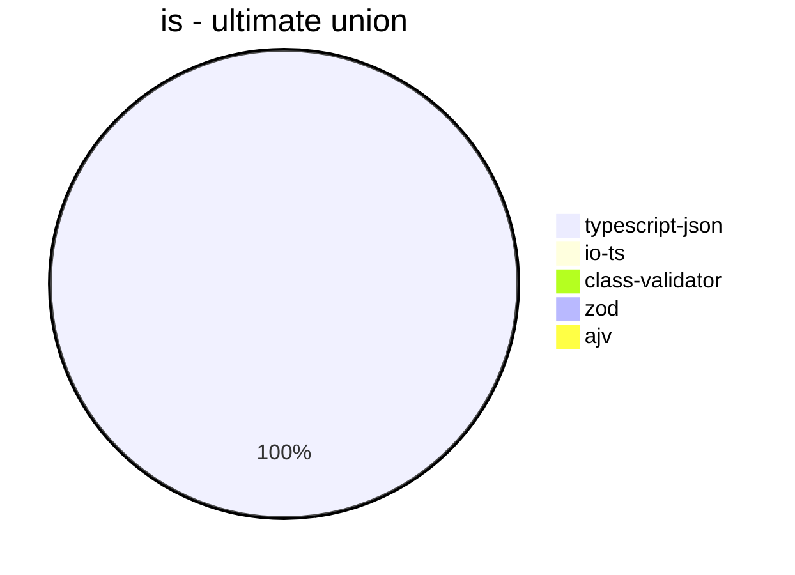


## assert
 Components | typescript-json | class-validator | io-ts | zod 
------------|-----------------|-----------------|-------|-----
object (hierarchical) | 22726.51394068549 | 61.11010667148798 | 3907.6241134751776 | 410.6429349800218
object (recursive) | 32424.466931694977 | 39.605767475816755 | 1688.0671117959253 | 71.54993392486314
object (union, explicit) | 4944.8635057471265 | 16.414607156030986 | 1177.683013503909 | 33.64785472672245
object (union, implicit) | 4664.796380090497 | 17.299107142857142 | 897.3980439195424 | 53.044452745610755
array (recursive) | 1708.4982099114377 | 3.7871615224389323 | 178.1045751633987 | 9.123740733700817
array (union, explicit) | 2133.600291226793 | 6.933041415800036 | 88.6122299523984 | 2.9363185905670766
array (union, implicit) | 1939.1083725987678 | 8.987081070960494 | 116.8903803131991 | 3.79003221527383
ultimate union | 276.2520193861066 | Failed | Failed | Failed


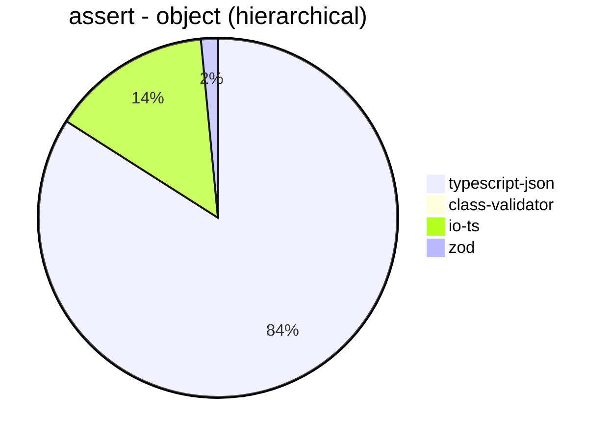


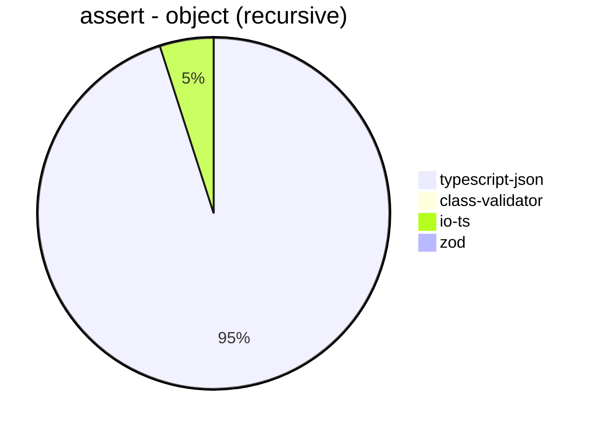


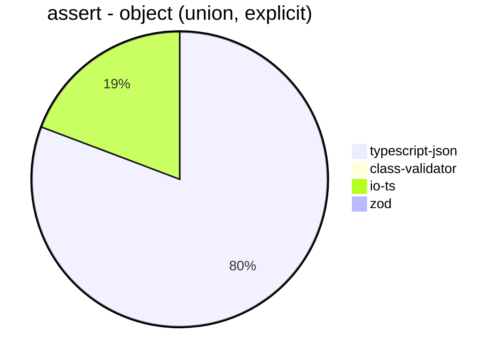


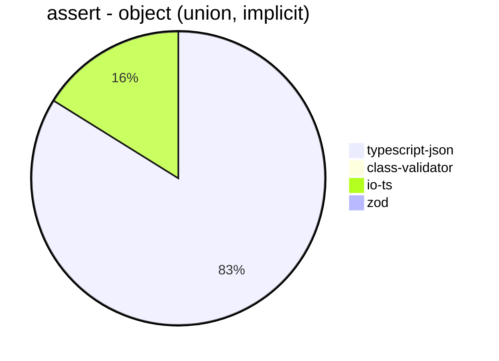


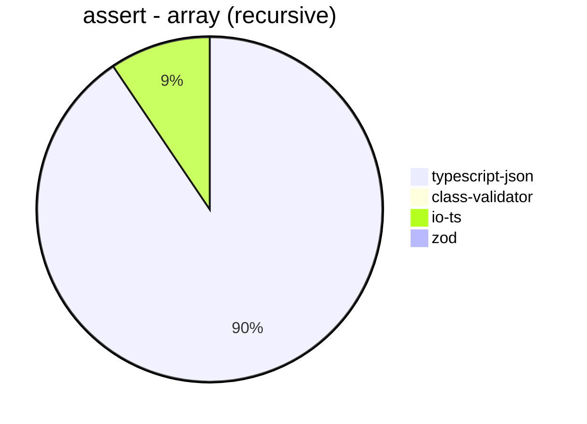


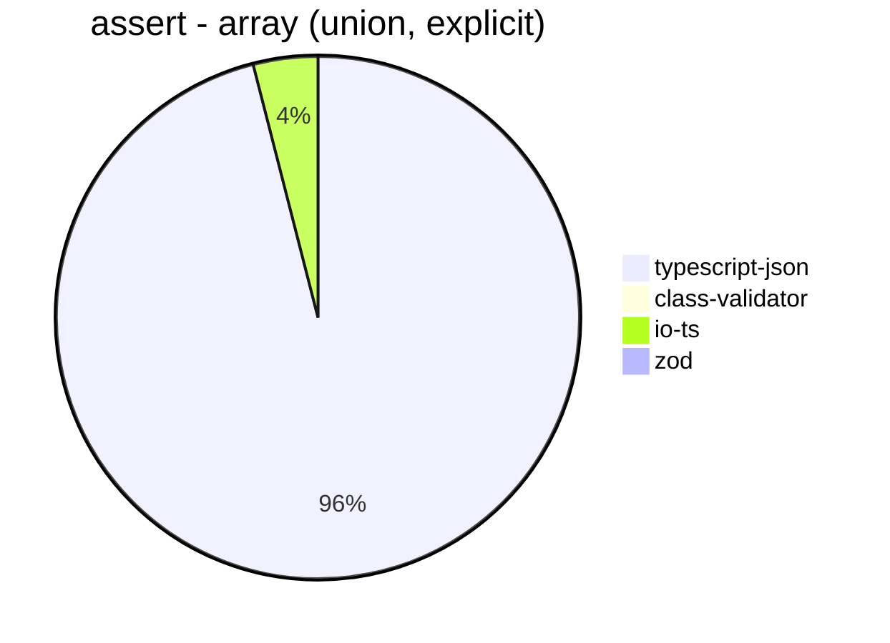


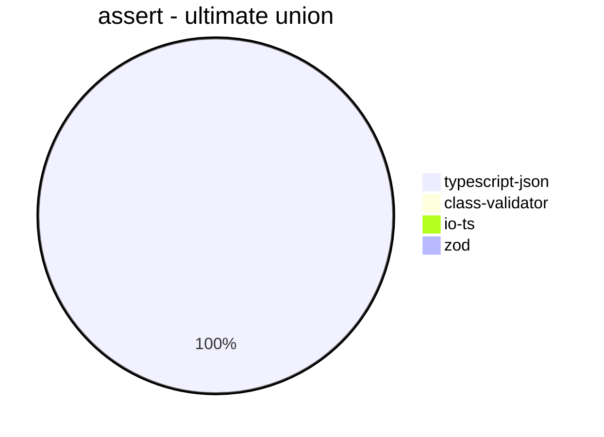


## valiadate
 Components | typescript-json | class-validator | io-ts | zod 
------------|-----------------|-----------------|-------|-----
object (hierarchical) | 18051.118792068402 | 62.31831395348838 | 3829.905503057254 | 420.6586826347305
object (recursive) | 18327.50225428314 | 40.14869888475837 | 1810.3986772000735 | 72.57304429783224
object (union, explicit) | 4140.604949587534 | 16.64228237015362 | 1223.2902033271719 | 35.309422040512914
object (union, implicit) | 4275.874769797422 | 17.143899325186943 | 932.9484075246787 | 53.80917159763313
array (recursive) | 1098.946576373213 | 3.541472506989748 | 180.78265662318574 | 9.146341463414634
array (union, explicit) | 1848.2370047255545 | 7.112894400875434 | 87.56797299831238 | 2.8382213812677386
array (union, implicit) | 1620.610145441646 | 8.93355667225014 | 117.7546169317974 | 3.748125937031484
ultimate union | 165.9933251361321 | Failed | Failed | Failed


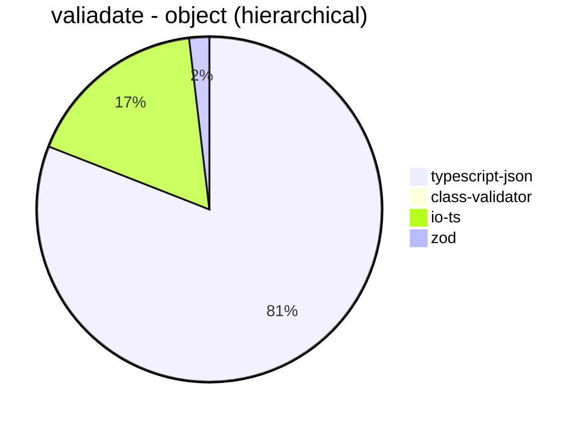


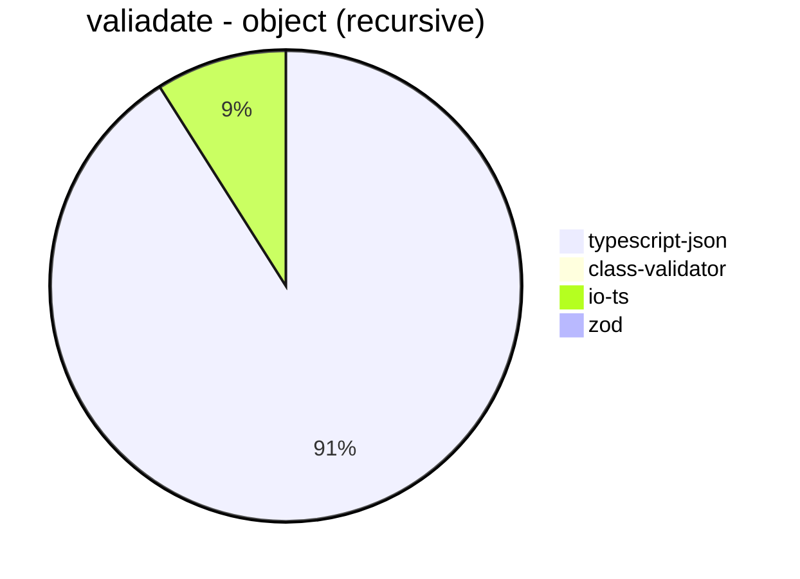


```mermaid
pie title valiadate - array (recursive)
  "typescript-json": 1098.946576373213
  "class-validator": 3.541472506989748
  "io-ts": 180.78265662318574
  "zod": 9.146341463414634
```


```mermaid
pie title valiadate - array (union, explicit)
  "typescript-json": 1848.2370047255545
  "class-validator": 7.112894400875434
  "io-ts": 87.56797299831238
  "zod": 2.8382213812677386
```


```mermaid
pie title valiadate - array (union, implicit)
  "typescript-json": 1620.610145441646
  "class-validator": 8.93355667225014
  "io-ts": 117.7546169317974
  "zod": 3.748125937031484
```


```mermaid
pie title valiadate - ultimate union
  "typescript-json": 165.9933251361321
  "class-validator": 0
  "io-ts": 0
  "zod": 0
```


## optimizer
 Components | typescript-json | fast-json-stringify | JSON.stringify() 
------------|-----------------|---------------------|------------------
object (simple) | 141675.90579710147 | 30.093014772934527 | 4131.353616323557
object (hierarchical) | 4520.73559767311 | 11.428571428571429 | 1172.509225092251
object (recursive) | 5158.805317792752 | 69.51393852751966 | 936.0755975541967
object (union) | 1933.3453108156666 | 1.08010801080108 | 493.0190389845875
array (hierarchical) | 91.27565982404691 | 10.16260162601626 | 25.113293051359516
array (recursive) | 249.36617167692864 | 35.62247521116416 | 71.28195558872925
array (union) | 329.5886936039137 | 2.8403711418291993 | 167.34542761940023
ultimate union | 131.5018315018315 | 0.16725204883759826 | 132.08955223880596


```mermaid
pie title optimizer - object (simple)
  "typescript-json": 141675.90579710147
  "fast-json-stringify": 30.093014772934527
  "JSON.stringify()": 4131.353616323557
```


```mermaid
pie title optimizer - object (hierarchical)
  "typescript-json": 4520.73559767311
  "fast-json-stringify": 11.428571428571429
  "JSON.stringify()": 1172.509225092251
```


```mermaid
pie title optimizer - object (recursive)
  "typescript-json": 5158.805317792752
  "fast-json-stringify": 69.51393852751966
  "JSON.stringify()": 936.0755975541967
```


```mermaid
pie title optimizer - object (union)
  "typescript-json": 1933.3453108156666
  "fast-json-stringify": 1.08010801080108
  "JSON.stringify()": 493.0190389845875
```


```mermaid
pie title optimizer - array (hierarchical)
  "typescript-json": 91.27565982404691
  "fast-json-stringify": 10.16260162601626
  "JSON.stringify()": 25.113293051359516
```


```mermaid
pie title optimizer - array (recursive)
  "typescript-json": 249.36617167692864
  "fast-json-stringify": 35.62247521116416
  "JSON.stringify()": 71.28195558872925
```


```mermaid
pie title optimizer - array (union)
  "typescript-json": 329.5886936039137
  "fast-json-stringify": 2.8403711418291993
  "JSON.stringify()": 167.34542761940023
```


```mermaid
pie title optimizer - ultimate union
  "typescript-json": 131.5018315018315
  "fast-json-stringify": 0.16725204883759826
  "JSON.stringify()": 132.08955223880596
```


## stringify
 Components | typescript-json | fast-json-stringify | JSON.stringify() 
------------|-----------------|---------------------|------------------
object (simple) | 134672.70422024996 | 29692.998533724338 | 4151.340282948622
object (hierarchical) | 4888.361911711054 | 4270.440251572327 | 1145.607922244636
object (recursive) | 5524.712002972873 | 942.5810119386015 | 926.6862170087976
object (union) | 2139.92297817715 | 1527.2201121360101 | 537.8787878787879
array (hierarchical) | 124.5617272559513 | 163.62993101008314 | 33.50177802732547
array (recursive) | 255.36992840095465 | 70.13278473910603 | 68.61475864619938
array (union) | 334.534967555876 | 155.77607189664857 | 164.45672191528547
ultimate union | 132.0754716981132 | 68.00563777307963 | 128.8756070227867


```mermaid
pie title stringify - object (simple)
  "typescript-json": 134672.70422024996
  "fast-json-stringify": 29692.998533724338
  "JSON.stringify()": 4151.340282948622
```


```mermaid
pie title stringify - object (hierarchical)
  "typescript-json": 4888.361911711054
  "fast-json-stringify": 4270.440251572327
  "JSON.stringify()": 1145.607922244636
```


```mermaid
pie title stringify - object (recursive)
  "typescript-json": 5524.712002972873
  "fast-json-stringify": 942.5810119386015
  "JSON.stringify()": 926.6862170087976
```


```mermaid
pie title stringify - object (union)
  "typescript-json": 2139.92297817715
  "fast-json-stringify": 1527.2201121360101
  "JSON.stringify()": 537.8787878787879
```


```mermaid
pie title stringify - array (hierarchical)
  "typescript-json": 124.5617272559513
  "fast-json-stringify": 163.62993101008314
  "JSON.stringify()": 33.50177802732547
```


```mermaid
pie title stringify - array (recursive)
  "typescript-json": 255.36992840095465
  "fast-json-stringify": 70.13278473910603
  "JSON.stringify()": 68.61475864619938
```


```mermaid
pie title stringify - array (union)
  "typescript-json": 334.534967555876
  "fast-json-stringify": 155.77607189664857
  "JSON.stringify()": 164.45672191528547
```


```mermaid
pie title stringify - ultimate union
  "typescript-json": 132.0754716981132
  "fast-json-stringify": 68.00563777307963
  "JSON.stringify()": 128.8756070227867
```


