# Benchmark of `typescript-json`
> CPU: AMD Ryzen 7 5800H with Radeon Graphics
> Memory: 64,928 MB
> NodeJS version: v16.6.0
> TypeScript-JSON version: 3.3.15


## is
 Components | typescript-json | typebox | ajv | io-ts | zod | class-validator 
------------|-----------------|---------|-----|-------|-----|-----------------
object (hierarchical) | 110306.1374494671 | 180245.68885592435 | 49012.13904726871 | 8414.384811975175 | 391.5453915453915 | 59.48434622467772
object (recursive) | 76441.87307900922 | 80826.46460912956 | 34979.91234477721 | 4716.241560390097 | 67.98970966556413 | 35.89650145772595
object (union, explicit) | 12777.55511022044 | 12844.944231120862 | 8044.581234844246 | 3233.333333333333 | 34.552845528455286 | 15.81754644105205
object (union, implicit) | 12088.612163869337 | Failed | Failed | Failed | 19.988685649632284 | 13.979496738117428
array (recursive) | 7138.827433628318 | 7170.536875348319 | 2192.2583012291325 | 495.5522609340252 | 8.598130841121495 | 3.1669150521609537
array (union, explicit) | 2400.073475385746 | 2084.895052473763 | 823.625476320087 | 375.99394168875426 | 3.0041306796845664 | 7.160354249104955
array (union, implicit) | 1724.5693563009975 | Failed | Failed | Failed | 1.8754688672168043 | 4.404477885850615
ultimate union | 568.0948040109389 | Failed | Failed | Failed | 0.3577177606868181 | Failed


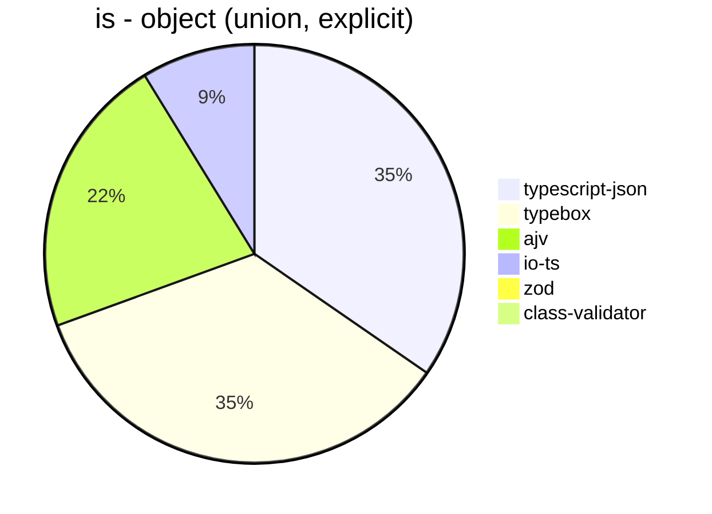


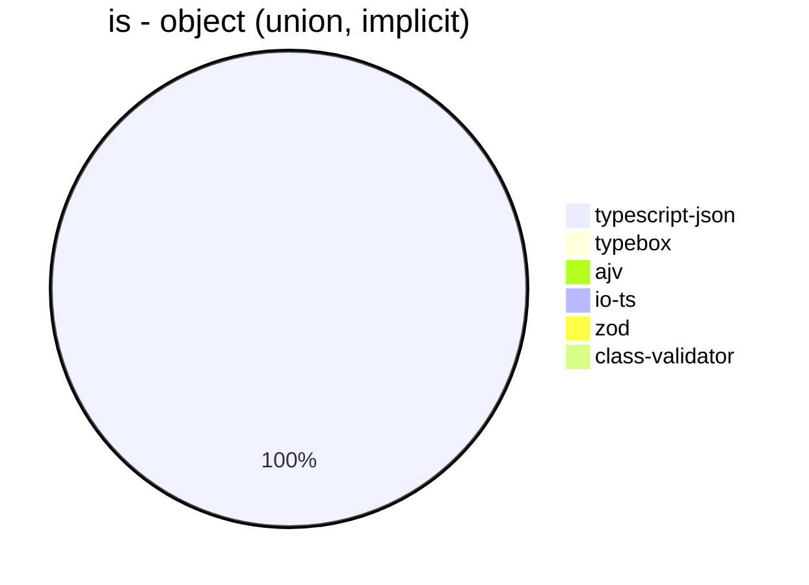


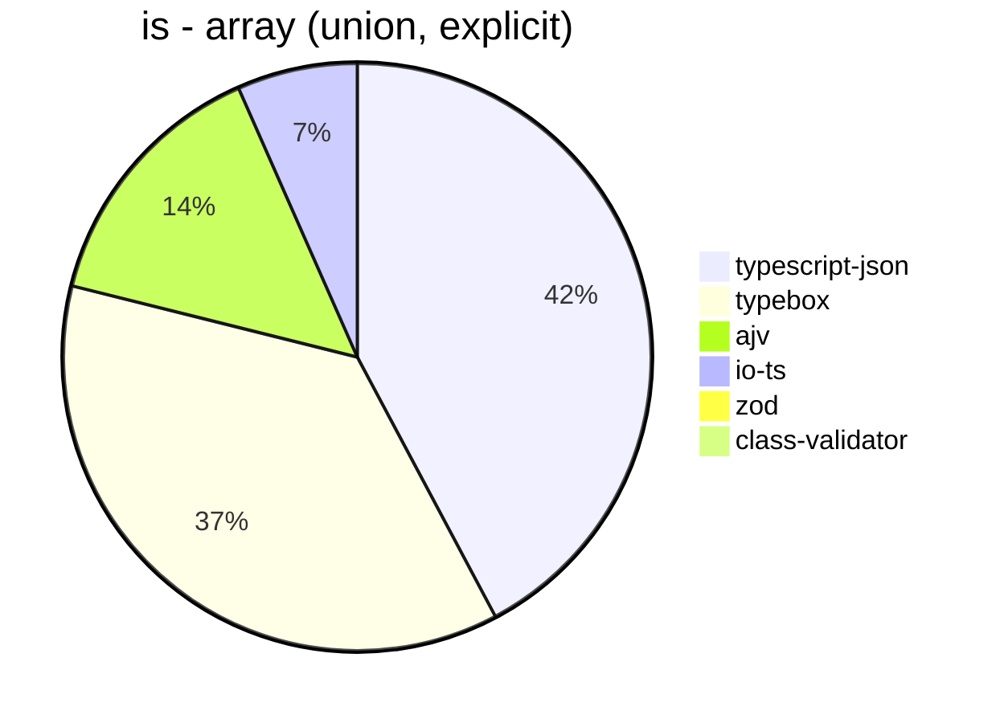


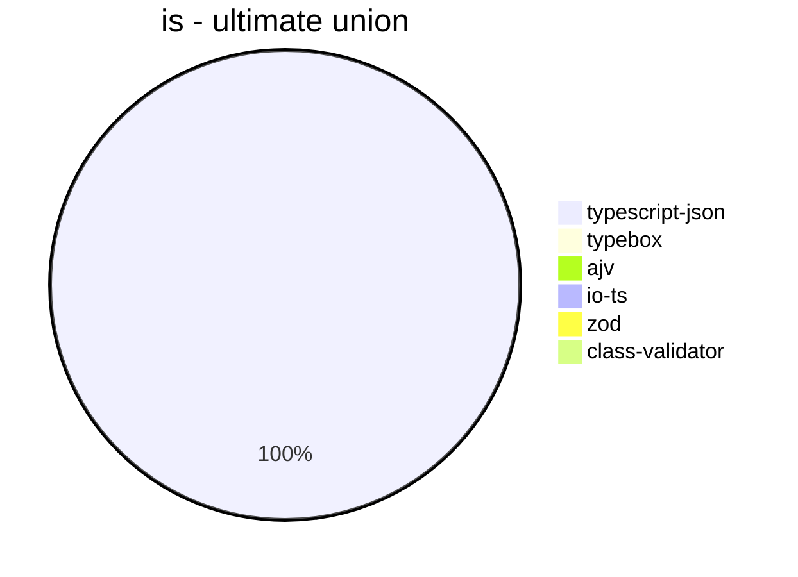


## assert
 Components | typescript-json | typebox | io-ts | zod | class-validator 
------------|-----------------|---------|-------|-----|-----------------
object (hierarchical) | 21915.05435784043 | 877.0477668563545 | 4018.6312488470758 | 397.2005089983639 | 58.11997757428518
object (recursive) | 31921.877865395192 | 394.2110177404295 | 1709.717534197904 | 71.42857142857143 | 36.177599122967294
object (union, explicit) | 4816.814640333394 | 171.7522382605518 | 1241.2264499445882 | 32.558958113340374 | 15.861027190332326
object (union, implicit) | 4575.900982890426 | Failed | Failed | 17.843583902809417 | 13.86065422287932
array (recursive) | 1519.6408529741864 | 40.376106194690266 | 171.36020614761642 | 9.108159392789375 | 3.2172596517789556
array (union, explicit) | 2116.136034732272 | 20.635500365230094 | 81.98509361934194 | 2.844141069397042 | 6.707759245830312
array (union, implicit) | 1246.984598255706 | Failed | Failed | 1.8839487565938207 | 4.901960784313725
ultimate union | 255.60298826040557 | Failed | Failed | 0.3620564808110065 | Failed


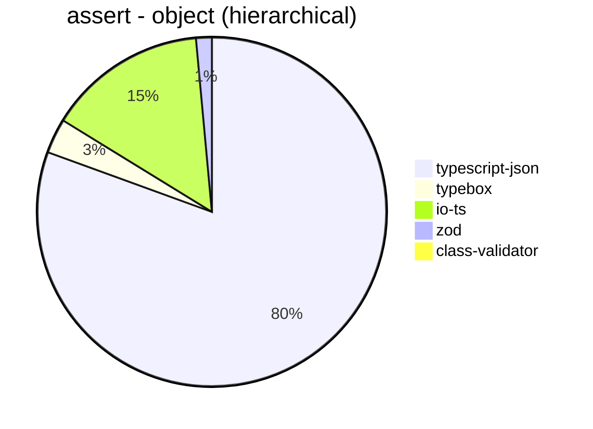


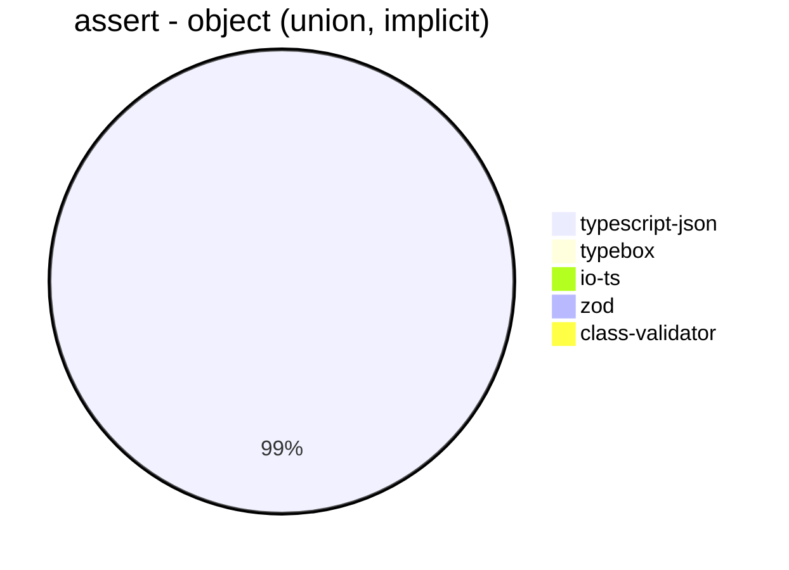


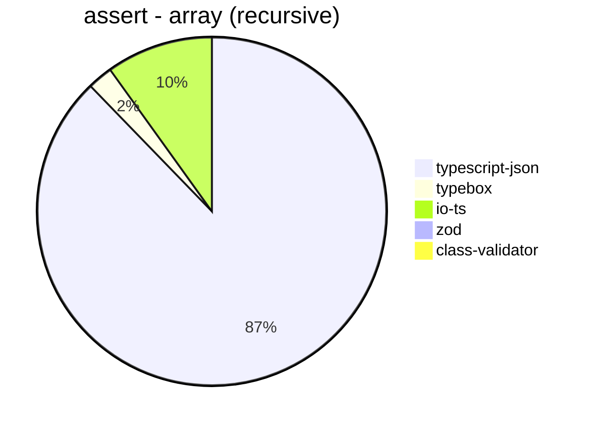


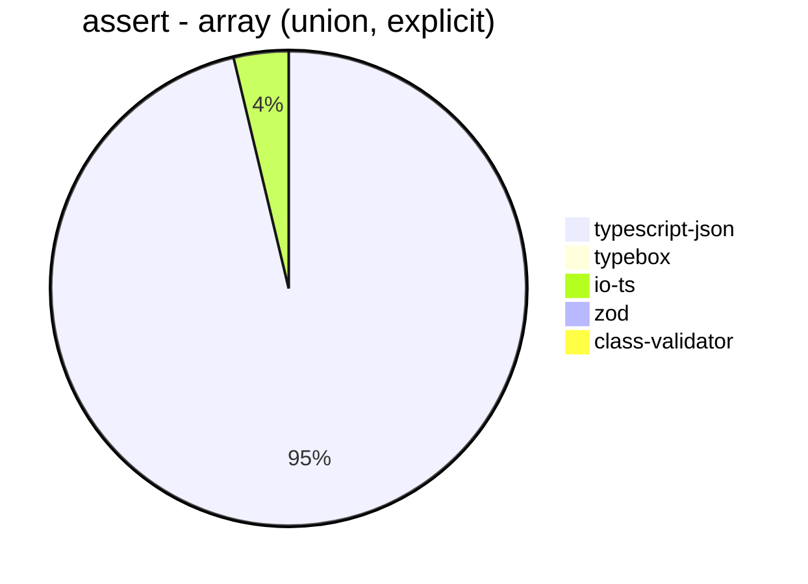


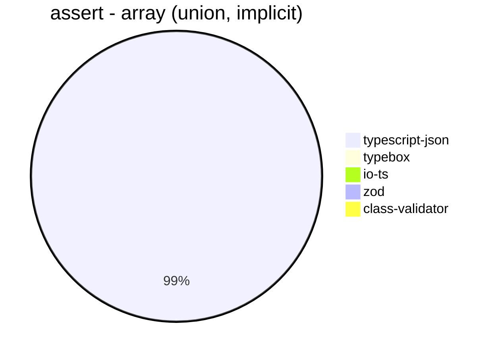


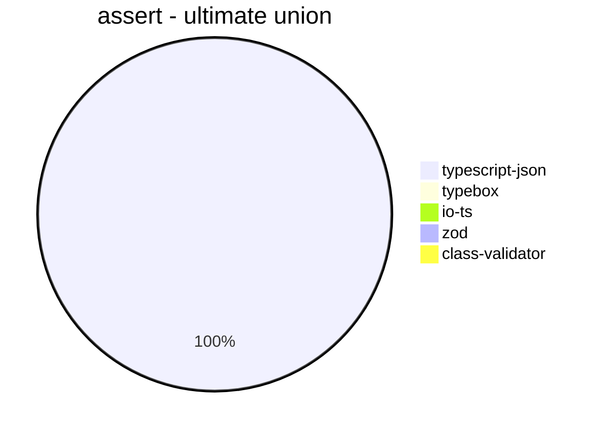


## valiadate
 Components | typescript-json | typebox | io-ts | zod | class-validator 
------------|-----------------|---------|-------|-----|-----------------
object (hierarchical) | 16757.603350937898 | 953.997403079206 | 3938.4245562130177 | 416.9019386410691 | 57.89571349044349
object (recursive) | 17295.875343721356 | 397.9284369114878 | 1728.7441860465117 | 68.90060240963855 | 36.2497627633327
object (union, explicit) | 3924.483882651213 | 170.1556629092861 | 1213.2958801498128 | 33.64352183249821 | 15.350877192982455
object (union, implicit) | 3592.0955882352937 | Failed | Failed | 18.774890953916177 | 13.822336896424622
array (recursive) | 999.0725282878872 | 41.899441340782126 | 173.4487203093353 | 8.722032612817596 | 3.593720446377908
array (union, explicit) | 1821.161901293025 | 22.142316426949282 | 86.70081578448112 | 3.0069535801541067 | 6.860745410717597
array (union, implicit) | 860.9440495717149 | Failed | Failed | 1.8726591760299627 | 4.709871891484552
ultimate union | 150.9765968678515 | Failed | Failed | 0.36101083032490977 | Failed


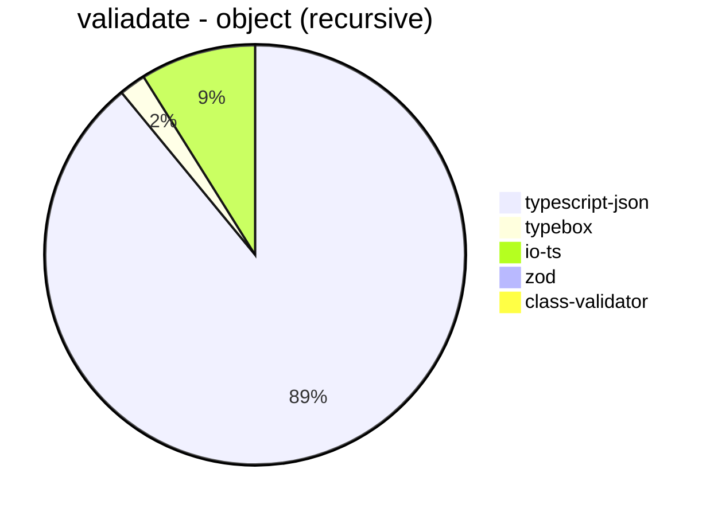


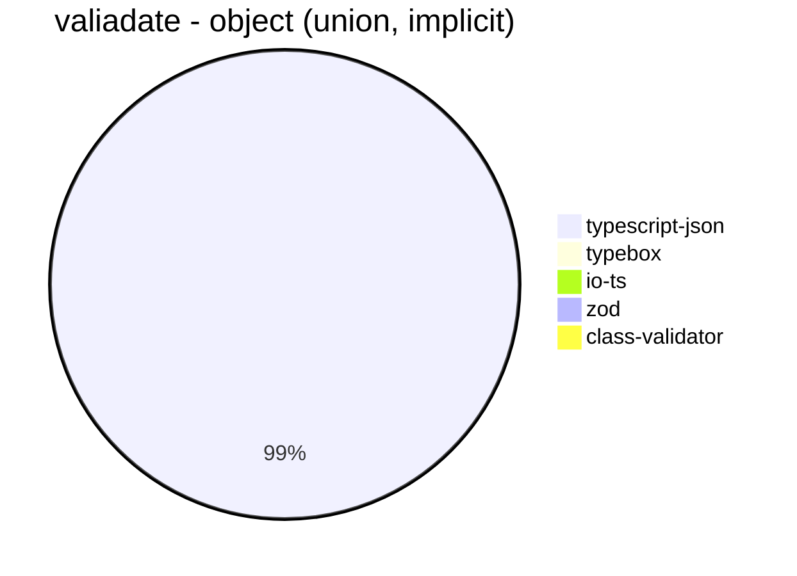


```mermaid
pie title valiadate - array (recursive)
  "typescript-json": 999.0725282878872
  "typebox": 41.899441340782126
  "io-ts": 173.4487203093353
  "zod": 8.722032612817596
  "class-validator": 3.593720446377908
```


```mermaid
pie title valiadate - array (union, explicit)
  "typescript-json": 1821.161901293025
  "typebox": 22.142316426949282
  "io-ts": 86.70081578448112
  "zod": 3.0069535801541067
  "class-validator": 6.860745410717597
```


```mermaid
pie title valiadate - array (union, implicit)
  "typescript-json": 860.9440495717149
  "typebox": 0
  "io-ts": 0
  "zod": 1.8726591760299627
  "class-validator": 4.709871891484552
```


```mermaid
pie title valiadate - ultimate union
  "typescript-json": 150.9765968678515
  "typebox": 0
  "io-ts": 0
  "zod": 0.36101083032490977
  "class-validator": 0
```


## optimizer
 Components | typescript-json | typebox | ajv 
------------|-----------------|---------|-----
object (hierarchical) | 99313.18979554911 | 229.14806215395606 | 4.9654194006029435
object (recursive) | 78163.31797235024 | 841.5409776485553 | 9.357798165137615
object (union) | 12931.38151875572 | 92.66202463845742 | 4.420703628660895
array (hierarchical) | 5890.360559234731 | 1056.9059732428866 | 6.497122702803045
array (recursive) | 5439.906441165887 | 863.0637210151542 | 9.289617486338797
array (union) | 4023.8816610229906 | 252.7213352685051 | 6.306807642366908
ultimate union | 565.0496141124586 | 12.275395837039671 | 0.8992805755395684


```mermaid
pie title optimizer - object (hierarchical)
  "typescript-json": 99313.18979554911
  "typebox": 229.14806215395606
  "ajv": 4.9654194006029435
```


```mermaid
pie title optimizer - object (recursive)
  "typescript-json": 78163.31797235024
  "typebox": 841.5409776485553
  "ajv": 9.357798165137615
```


```mermaid
pie title optimizer - object (union)
  "typescript-json": 12931.38151875572
  "typebox": 92.66202463845742
  "ajv": 4.420703628660895
```


```mermaid
pie title optimizer - array (hierarchical)
  "typescript-json": 5890.360559234731
  "typebox": 1056.9059732428866
  "ajv": 6.497122702803045
```


```mermaid
pie title optimizer - array (recursive)
  "typescript-json": 5439.906441165887
  "typebox": 863.0637210151542
  "ajv": 9.289617486338797
```


```mermaid
pie title optimizer - array (union)
  "typescript-json": 4023.8816610229906
  "typebox": 252.7213352685051
  "ajv": 6.306807642366908
```


```mermaid
pie title optimizer - ultimate union
  "typescript-json": 565.0496141124586
  "typebox": 12.275395837039671
  "ajv": 0.8992805755395684
```


## stringify
 Components | TSON.stringify() | TSON.assertStringify() | TSON.isStringify() | JSON.stringify() | fast-json-stringify 
------------|------------------|------------------------|--------------------|------------------|---------------------
object (simple) | 151983.7294332724 | 38940.69492450428 | 38147.54098360655 | 4034.8432055749126 | 30842.805100182148
object (hierarchical) | 5153.425655976676 | 3953.919491525424 | 4653.364774170143 | 1141.2514050206069 | 4734.979727239219
object (recursive) | 5616.626461310076 | 4936.222097167511 | 5145.34567229178 | 821.8630833484657 | 856.6059011464012
object (union) | 1459.6273291925465 | 1021.8648355619805 | 1282.7832292595895 | 381.9623755071929 | 1396.1753563052498
array (hierarchical) | 275.07163323782237 | 221.8342216504319 | 257.5337720817458 | 75.11649580615098 | 398.25796886582657
array (recursive) | 256.0774995430451 | 227.88800296680884 | 243.17343173431735 | 74.55250046133973 | 76.05421686746988
array (union) | 338.25116948542643 | 290.4684391390848 | 305.36130536130537 | 163.25390915860015 | 160.2004826434008


```mermaid
pie title stringify - object (simple)
  "TSON.stringify()": 151983.7294332724
  "TSON.assertStringify()": 38940.69492450428
  "TSON.isStringify()": 38147.54098360655
  "JSON.stringify()": 4034.8432055749126
  "fast-json-stringify": 30842.805100182148
```


```mermaid
pie title stringify - object (hierarchical)
  "TSON.stringify()": 5153.425655976676
  "TSON.assertStringify()": 3953.919491525424
  "TSON.isStringify()": 4653.364774170143
  "JSON.stringify()": 1141.2514050206069
  "fast-json-stringify": 4734.979727239219
```


```mermaid
pie title stringify - object (recursive)
  "TSON.stringify()": 5616.626461310076
  "TSON.assertStringify()": 4936.222097167511
  "TSON.isStringify()": 5145.34567229178
  "JSON.stringify()": 821.8630833484657
  "fast-json-stringify": 856.6059011464012
```


```mermaid
pie title stringify - object (union)
  "TSON.stringify()": 1459.6273291925465
  "TSON.assertStringify()": 1021.8648355619805
  "TSON.isStringify()": 1282.7832292595895
  "JSON.stringify()": 381.9623755071929
  "fast-json-stringify": 1396.1753563052498
```


```mermaid
pie title stringify - array (hierarchical)
  "TSON.stringify()": 275.07163323782237
  "TSON.assertStringify()": 221.8342216504319
  "TSON.isStringify()": 257.5337720817458
  "JSON.stringify()": 75.11649580615098
  "fast-json-stringify": 398.25796886582657
```


```mermaid
pie title stringify - array (recursive)
  "TSON.stringify()": 256.0774995430451
  "TSON.assertStringify()": 227.88800296680884
  "TSON.isStringify()": 243.17343173431735
  "JSON.stringify()": 74.55250046133973
  "fast-json-stringify": 76.05421686746988
```


```mermaid
pie title stringify - array (union)
  "TSON.stringify()": 338.25116948542643
  "TSON.assertStringify()": 290.4684391390848
  "TSON.isStringify()": 305.36130536130537
  "JSON.stringify()": 163.25390915860015
  "fast-json-stringify": 160.2004826434008
```


