# Benchmark of `typescript-json`
> CPU: AMD Ryzen 7 5800H with Radeon Graphics
> Memory: 64,928 MB
> NodeJS version: v16.6.0
> TypeScript-JSON version: 3.3.12


## is
 Components | typescript-json | typebox | ajv | io-ts | class-validator | zod 
------------|-----------------|---------|-----|-------|-----------------|-----
object (hierarchical) | 108668.81088035287 | 178011.28021486124 | 79833.88581952118 | 8797.093649085038 | 54.710206872969735 | 398.03043867502237
object (recursive) | 74203.32458442695 | 81845.89983489268 | Failed | 4838.11475409836 | 37.32039559619332 | 70.17219033512313
object (union, explicit) | 14598.135964912279 | 13130.628126737076 | 1201.3988522238164 | 3177.8420386770285 | 14.922721620181205 | 35.546360729734815
object (union, implicit) | 14827.103664150249 | 78396.14830813535 | 4143.194192377496 | Failed | 15.32846715328467 | 45.854732208363906
array (recursive) | 7189.754022563344 | 7075.851684547337 | Failed | 489.6803652968037 | 3.181733108740408 | 8.88804841149773
array (union, explicit) | 4033.308931185944 | 2055.6586270871985 | Failed | 386.13861386138615 | 6.873490618614156 | 2.8079371022089106
array (union, implicit) | 3887.912482065997 | 2398.627341866073 | Failed | 465.70193572636725 | 8.304748149485468 | 3.7664783427495294
ultimate union | 570.6628551009469 | 274.05710257314064 | Failed | Failed | Failed | 0.35069261792039275


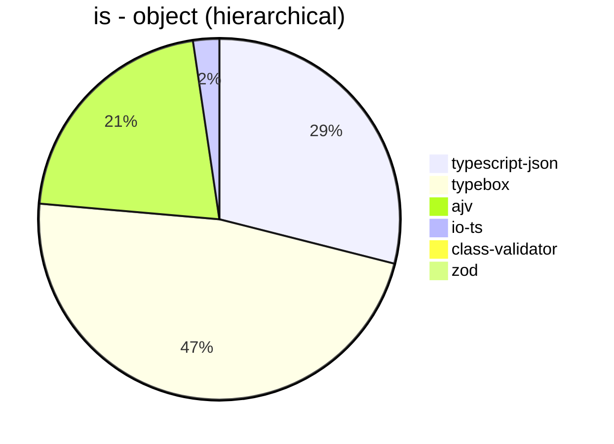


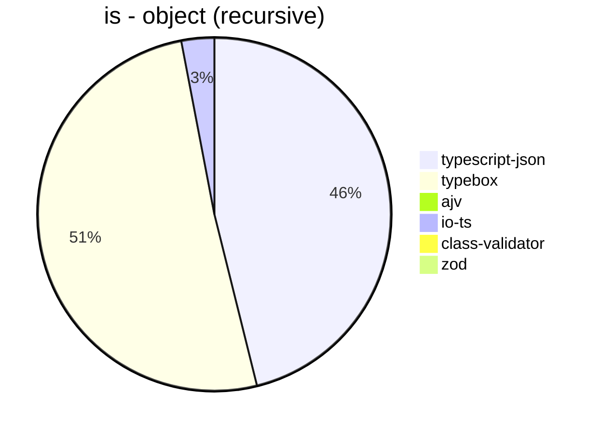


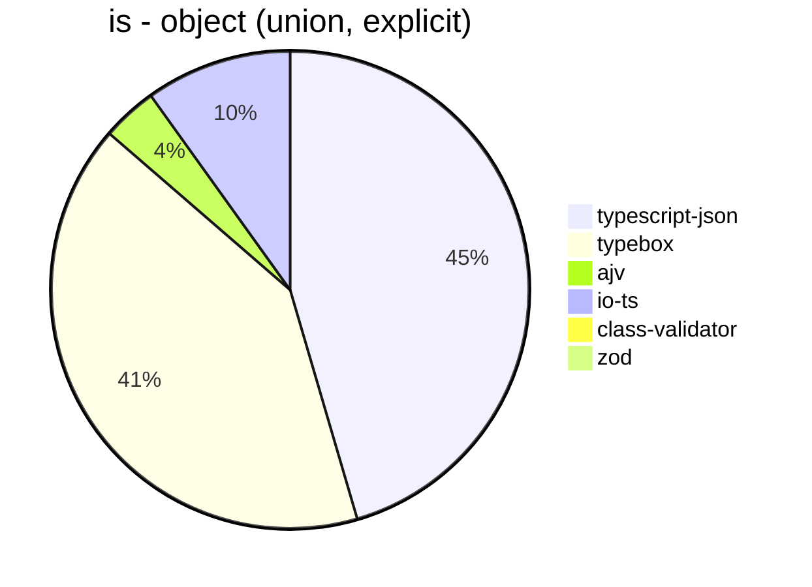


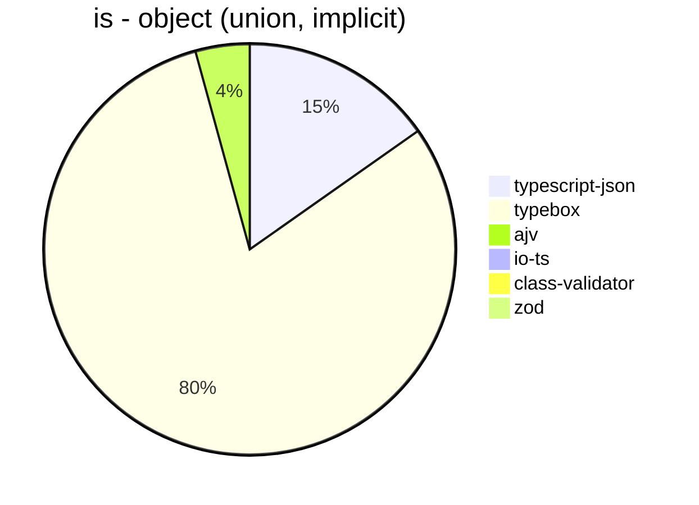


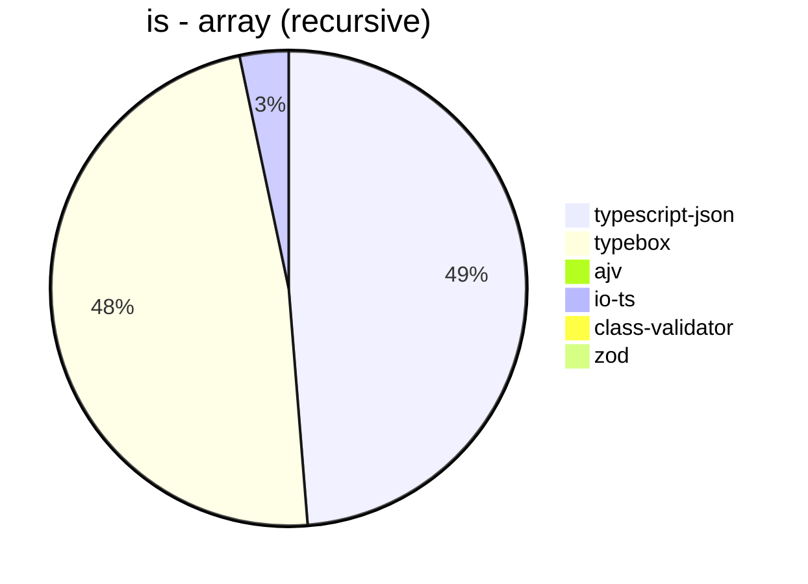


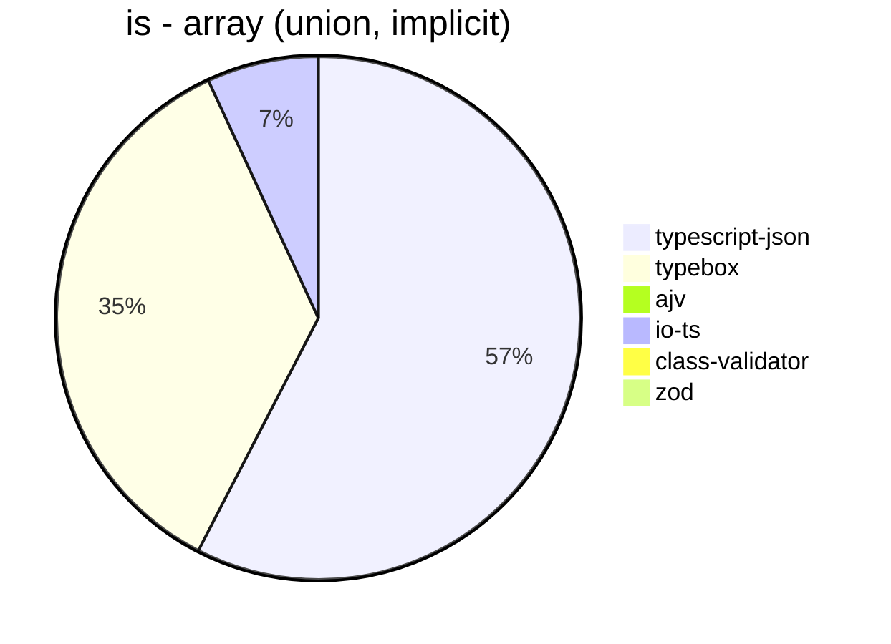


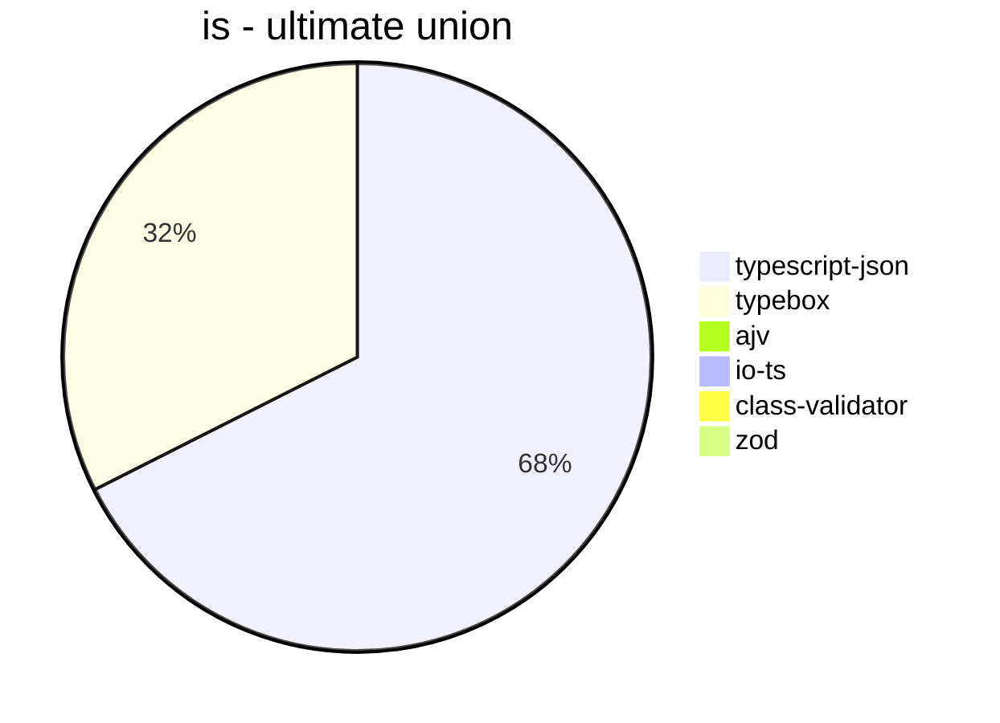


## assert
 Components | typescript-json | typebox | io-ts | zod | class-validator 
------------|-----------------|---------|-------|-----|-----------------
object (hierarchical) | 22103.972798854687 | 910.1103273648038 | 3977.028258887876 | 396.7032967032967 | 55.913978494623656
object (recursive) | 33045.546372819095 | 391.3586859489377 | 1880.9829451677974 | 72.1299093655589 | 37.05732018985031
object (union, explicit) | 4945.706371191136 | 175.7847533632287 | 1290.1314571375672 | 34.43900670654341 | 15.651201788708775
object (union, implicit) | 5072.73045916579 | 149.06490649064907 | 537.934763020364 | 47.36053912392363 | 16.092814371257486
array (recursive) | 1515.6480117820322 | 38.74675565443085 | 171.59441320515145 | 8.911642017444064 | 3.3796470146451374
array (union, explicit) | 2166.4262531554273 | 20.062009848623017 | 81.03638368246968 | 2.8232636928289105 | 6.878601970626511
array (union, implicit) | 1776.3743106208858 | 26.392428103385512 | 112.14611872146119 | 3.782863627766219 | 8.707173954192694
ultimate union | 258.5804132973944 | 4.31111909466499 | Failed | 0.35448422545196734 | Failed


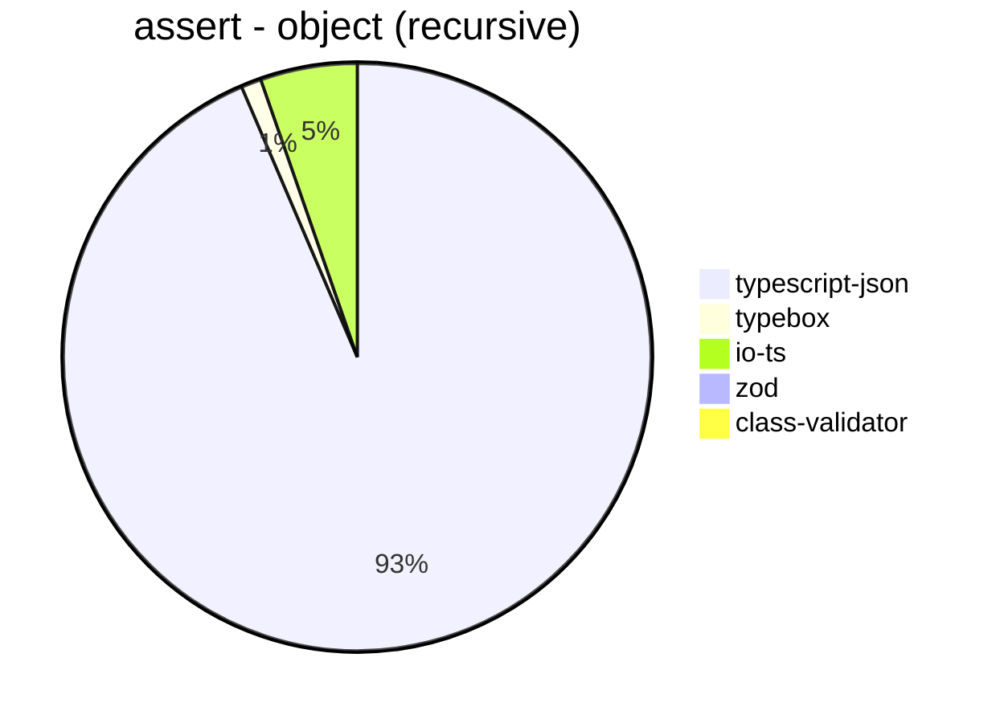


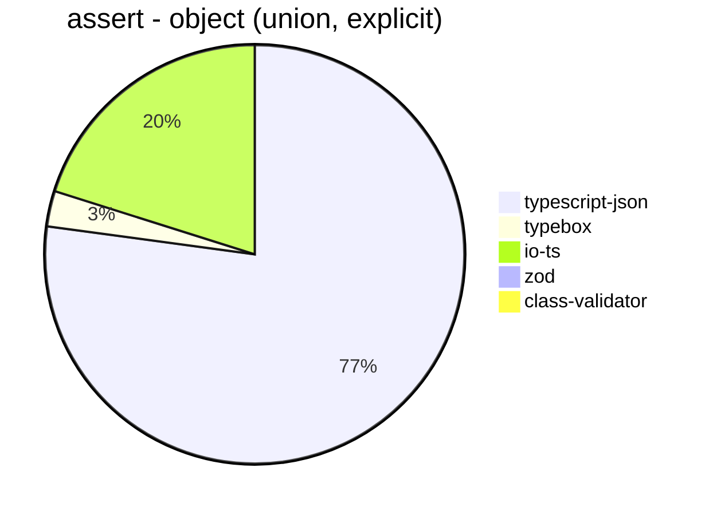


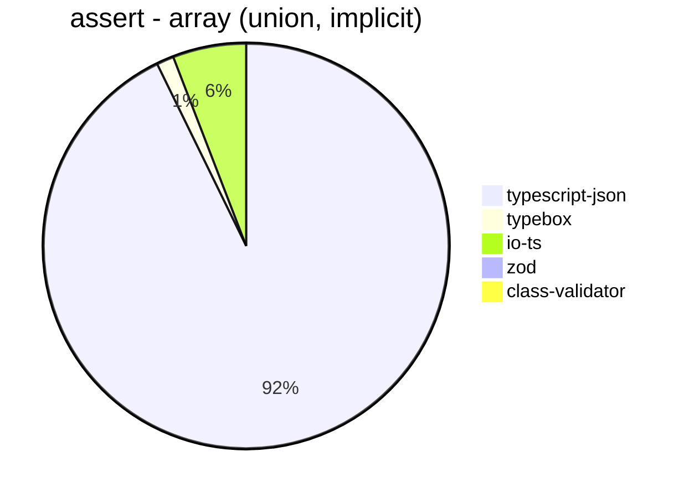


## valiadate
 Components | typescript-json | typebox | io-ts | zod | class-validator 
------------|-----------------|---------|-------|-----|-----------------
object (hierarchical) | 17343.93967261357 | 882.4173817783458 | 3804.4005220958416 | 418.2919901533801 | 57.63268283786249
object (recursive) | 18035.985902429977 | 379.25898342952894 | 1734.0866290018835 | 69.34915631374004 | 35.5475763016158
object (union, explicit) | 3935.862691960253 | 161.79615110477548 | 1160.6440741434187 | 33.86205667438959 | 15.501014947407272
object (union, implicit) | 3994.123048668503 | 147.72319827895302 | 536.226553880103 | 46.992481203007515 | 15.496809480401094
array (recursive) | 1010.034665207079 | 39.05523526129812 | 179.40389759266336 | 8.781763826606875 | 3.373945641986879
array (union, explicit) | 1775.7855494407954 | 21.25237191650854 | 84.68502451904942 | 2.832326283987915 | 6.842981320510449
array (union, implicit) | 1661.1734878667148 | 28.003784295175024 | 111.86254798025955 | 3.770739064856712 | 8.334843268708099
ultimate union | 149.82578397212544 | 4.540295119182748 | Failed | 0.357653791130186 | Failed


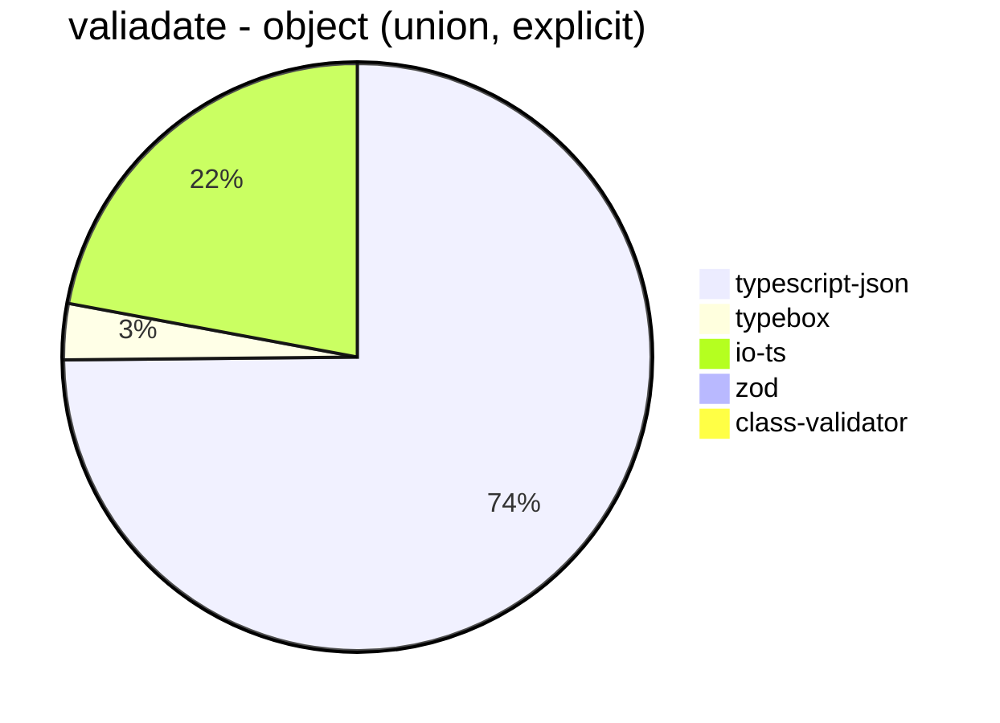


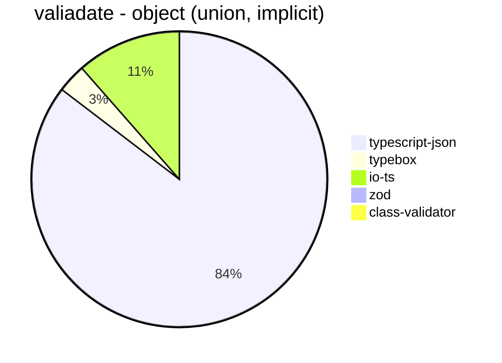


```mermaid
pie title valiadate - array (recursive)
  "typescript-json": 1010.034665207079
  "typebox": 39.05523526129812
  "io-ts": 179.40389759266336
  "zod": 8.781763826606875
  "class-validator": 3.373945641986879
```


```mermaid
pie title valiadate - array (union, explicit)
  "typescript-json": 1775.7855494407954
  "typebox": 21.25237191650854
  "io-ts": 84.68502451904942
  "zod": 2.832326283987915
  "class-validator": 6.842981320510449
```


```mermaid
pie title valiadate - array (union, implicit)
  "typescript-json": 1661.1734878667148
  "typebox": 28.003784295175024
  "io-ts": 111.86254798025955
  "zod": 3.770739064856712
  "class-validator": 8.334843268708099
```


```mermaid
pie title valiadate - ultimate union
  "typescript-json": 149.82578397212544
  "typebox": 4.540295119182748
  "io-ts": 0
  "zod": 0.357653791130186
  "class-validator": 0
```


## optimizer
 Components | typescript-json | ajv | typebox 
------------|-----------------|-----|---------
object (hierarchical) | 102648.71412597838 | 4.833512352309344 | 226.69797687861274
object (recursive) | 78020.26155829802 | 9.097525473071324 | 850.2896451846487
object (union) | 14447.605329492257 | 4.5191612436731745 | 162.8457059679767
array (hierarchical) | 2542.462265866521 | 6.271277548826375 | 1043.5931307793924
array (recursive) | 5728.682170542636 | 9.25240562546262 | 842.0297651066882
array (union) | 3969.1391445587437 | 6.379876048122494 | 257.2358900144718
ultimate union | 592.4521487901769 | 0.9046499004885109 | 11.726501894281075


```mermaid
pie title optimizer - object (hierarchical)
  "typescript-json": 102648.71412597838
  "ajv": 4.833512352309344
  "typebox": 226.69797687861274
```


```mermaid
pie title optimizer - object (recursive)
  "typescript-json": 78020.26155829802
  "ajv": 9.097525473071324
  "typebox": 850.2896451846487
```


```mermaid
pie title optimizer - object (union)
  "typescript-json": 14447.605329492257
  "ajv": 4.5191612436731745
  "typebox": 162.8457059679767
```


```mermaid
pie title optimizer - array (hierarchical)
  "typescript-json": 2542.462265866521
  "ajv": 6.271277548826375
  "typebox": 1043.5931307793924
```


```mermaid
pie title optimizer - array (recursive)
  "typescript-json": 5728.682170542636
  "ajv": 9.25240562546262
  "typebox": 842.0297651066882
```


```mermaid
pie title optimizer - array (union)
  "typescript-json": 3969.1391445587437
  "ajv": 6.379876048122494
  "typebox": 257.2358900144718
```


```mermaid
pie title optimizer - ultimate union
  "typescript-json": 592.4521487901769
  "ajv": 0.9046499004885109
  "typebox": 11.726501894281075
```


## stringify
 Components | typescript-json | fast-json-stringify | JSON.stringify() 
------------|-----------------|---------------------|------------------
object (simple) | 141226.56390034058 | 30505.722070844688 | 4152.803224624405
object (hierarchical) | 5028.77435804043 | 4680.163447251114 | 1183.4109972041006
object (recursive) | 5135.818416682045 | 924.0052800301717 | 910.5174668410237
object (union) | 2029.918404351768 | 1408.8669950738915 | 468.84218289085544
array (hierarchical) | 188.43487778183143 | 268.8860435339309 | 48.87078859681599
array (recursive) | 238.11239193083574 | 67.1417854463616 | 65.57377049180327
array (union) | 326.1141936638626 | 149.66740576496673 | 163.8758231420508
ultimate union | 118.78260869565217 | 59.244126659857 | 124.5578104636008


```mermaid
pie title stringify - object (simple)
  "typescript-json": 141226.56390034058
  "fast-json-stringify": 30505.722070844688
  "JSON.stringify()": 4152.803224624405
```


```mermaid
pie title stringify - object (hierarchical)
  "typescript-json": 5028.77435804043
  "fast-json-stringify": 4680.163447251114
  "JSON.stringify()": 1183.4109972041006
```


```mermaid
pie title stringify - object (recursive)
  "typescript-json": 5135.818416682045
  "fast-json-stringify": 924.0052800301717
  "JSON.stringify()": 910.5174668410237
```


```mermaid
pie title stringify - object (union)
  "typescript-json": 2029.918404351768
  "fast-json-stringify": 1408.8669950738915
  "JSON.stringify()": 468.84218289085544
```


```mermaid
pie title stringify - array (hierarchical)
  "typescript-json": 188.43487778183143
  "fast-json-stringify": 268.8860435339309
  "JSON.stringify()": 48.87078859681599
```


```mermaid
pie title stringify - array (recursive)
  "typescript-json": 238.11239193083574
  "fast-json-stringify": 67.1417854463616
  "JSON.stringify()": 65.57377049180327
```


```mermaid
pie title stringify - array (union)
  "typescript-json": 326.1141936638626
  "fast-json-stringify": 149.66740576496673
  "JSON.stringify()": 163.8758231420508
```


```mermaid
pie title stringify - ultimate union
  "typescript-json": 118.78260869565217
  "fast-json-stringify": 59.244126659857
  "JSON.stringify()": 124.5578104636008
```


