# Benchmark of `typescript-json`
> CPU: AMD Ryzen 7 5800H with Radeon Graphics
> Memory: 64,928 MB
> NodeJS version: v16.6.0
> TypeScript-JSON version: 3.3.18

## is
 Components | typescript-json | typebox | ajv | io-ts | zod | class-validator 
------------|-----------------|---------|-----|-------|-----|-----------------
object (simple) | 993954.0271493213 | 1620604.0637012632 | 488649.94425863994 | 37188.770919560906 | 3846.083954206796 | 169.38519447929735
object (hierarchical) | 145056.86098654708 | 185680.4469273743 | 46200.639204545456 | 9092.705713259074 | 413.3589788424549 | 58.06098228957458
object (recursive) | 92691.88026528052 | 85382.7821910216 | 41502.33897085283 | 5743.129556926528 | 69.7803212110024 | 36.13807982740021
object (union, explicit) | 18273.704052780395 | 13713.31828442438 | 8009.368923457663 | 3229.5719844357973 | 33.91351157365871 | 81.64383561643837
object (union, implicit) | 16006.030701754386 | Failed | Failed | Failed | 18.619934282584886 | 54.754517247672936
array (recursive) | 7359.597493829504 | 7249.484536082475 | 2239.626369678462 | 524.2290748898678 | 8.93189430591738 | 3.276897870016384
array (union, explicit) | 4064.023281193161 | 1930.0738007380075 | 820.1202843083652 | 370.07134810364255 | 2.8011204481792715 | 29.461756373937675
array (union, implicit) | 1697.5769721260704 | Failed | Failed | Failed | 2.182214948172395 | 20.643481495257582
ultimate union | 610.5856675154602 | Failed | Failed | Failed | 0.490115994118608 | Failed

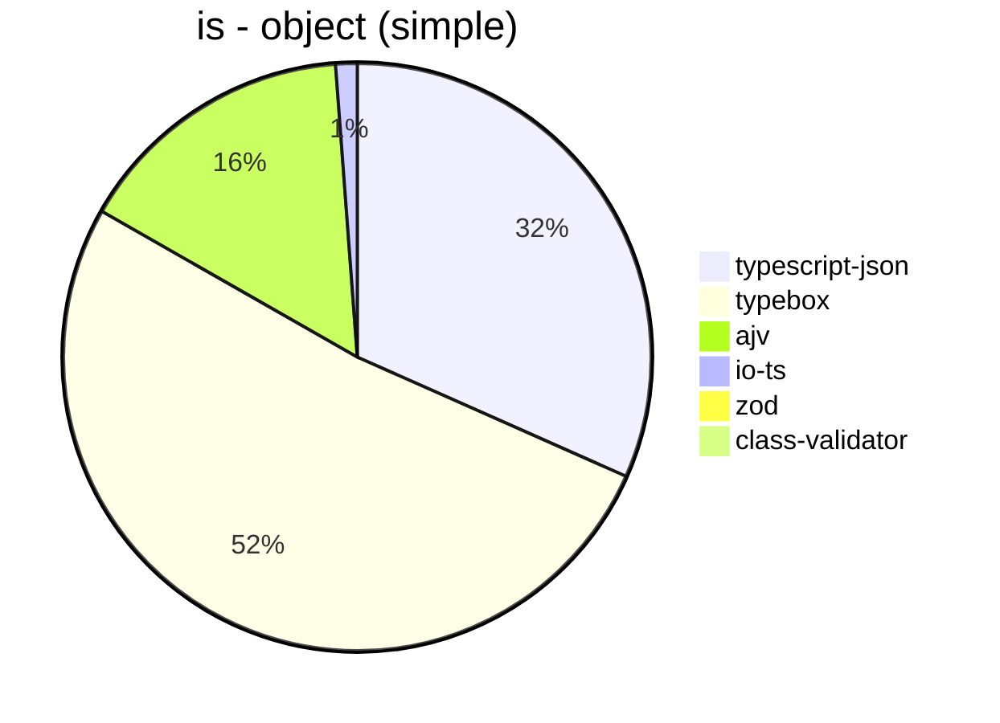
```mermaid
pie title is - object (simple)
  "typescript-json": 993954.0271493213
  "typebox": 1620604.0637012632
  "ajv": 488649.94425863994
  "io-ts": 37188.770919560906
  "zod": 3846.083954206796
  "class-validator": 169.38519447929735
```

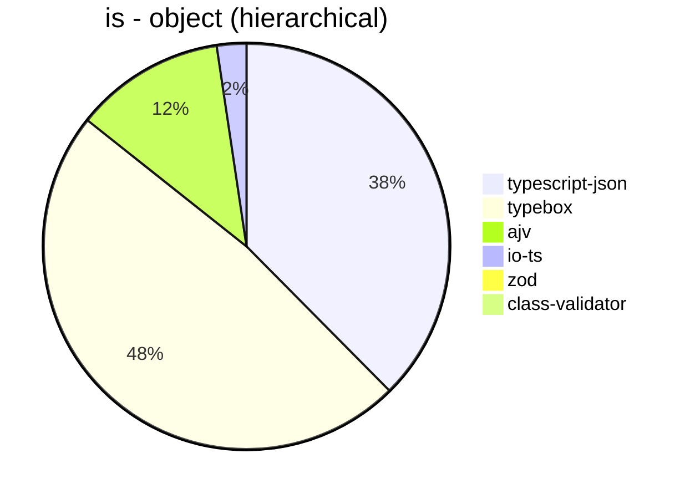
```mermaid
pie title is - object (hierarchical)
  "typescript-json": 145056.86098654708
  "typebox": 185680.4469273743
  "ajv": 46200.639204545456
  "io-ts": 9092.705713259074
  "zod": 413.3589788424549
  "class-validator": 58.06098228957458
```

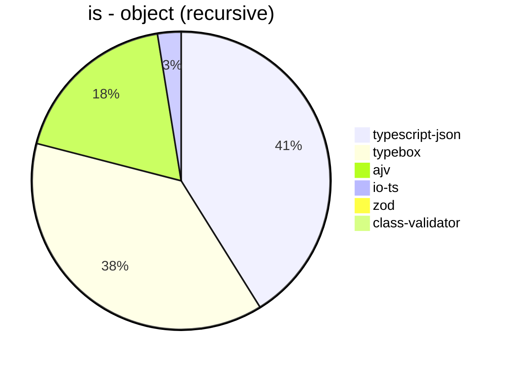
```mermaid
pie title is - object (recursive)
  "typescript-json": 92691.88026528052
  "typebox": 85382.7821910216
  "ajv": 41502.33897085283
  "io-ts": 5743.129556926528
  "zod": 69.7803212110024
  "class-validator": 36.13807982740021
```

```mermaid
pie title is - object (union, explicit)
  "typescript-json": 18273.704052780395
  "typebox": 13713.31828442438
  "ajv": 8009.368923457663
  "io-ts": 3229.5719844357973
  "zod": 33.91351157365871
  "class-validator": 81.64383561643837
```

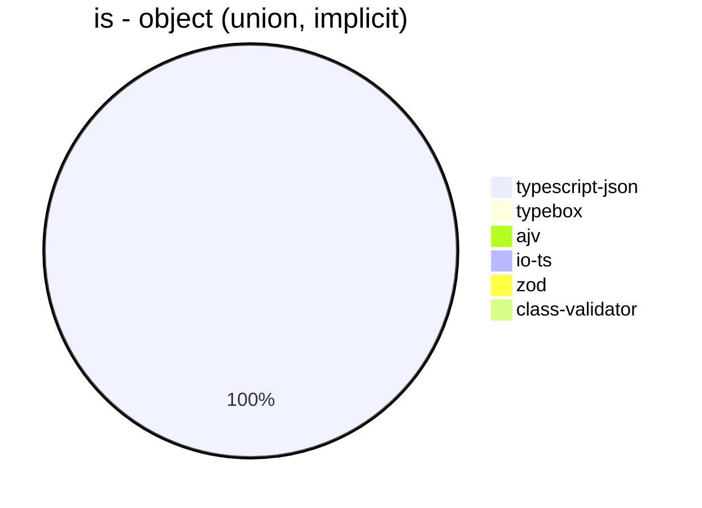
```mermaid
pie title is - object (union, implicit)
  "typescript-json": 16006.030701754386
  "typebox": 0
  "ajv": 0
  "io-ts": 0
  "zod": 18.619934282584886
  "class-validator": 54.754517247672936
```

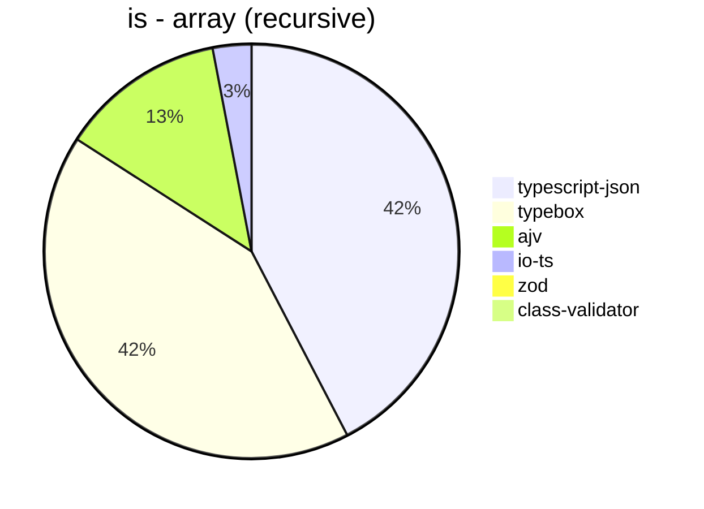
```mermaid
pie title is - array (recursive)
  "typescript-json": 7359.597493829504
  "typebox": 7249.484536082475
  "ajv": 2239.626369678462
  "io-ts": 524.2290748898678
  "zod": 8.93189430591738
  "class-validator": 3.276897870016384
```

```mermaid
pie title is - array (union, explicit)
  "typescript-json": 4064.023281193161
  "typebox": 1930.0738007380075
  "ajv": 820.1202843083652
  "io-ts": 370.07134810364255
  "zod": 2.8011204481792715
  "class-validator": 29.461756373937675
```

```mermaid
pie title is - array (union, implicit)
  "typescript-json": 1697.5769721260704
  "typebox": 0
  "ajv": 0
  "io-ts": 0
  "zod": 2.182214948172395
  "class-validator": 20.643481495257582
```

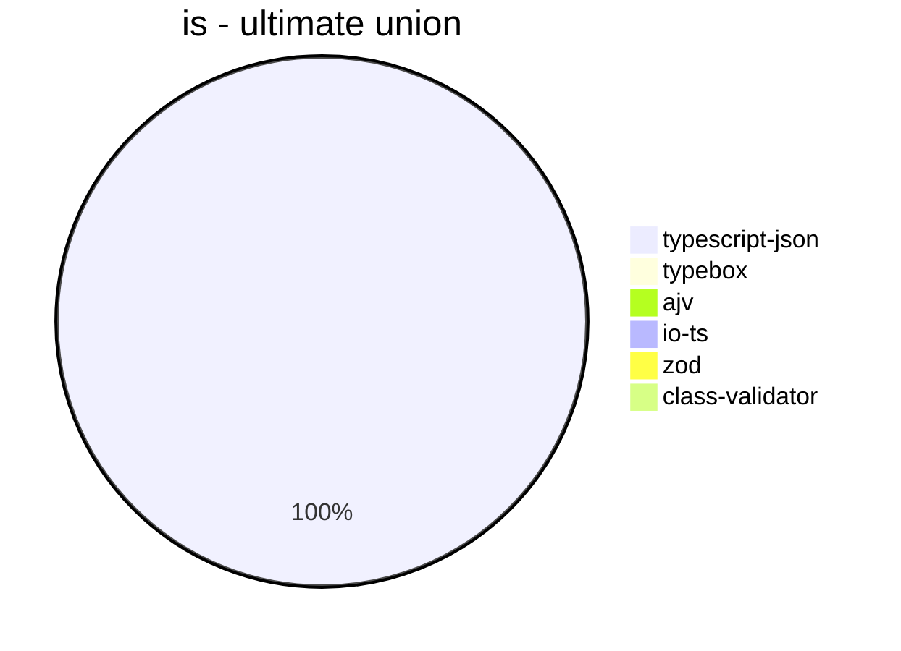
```mermaid
pie title is - ultimate union
  "typescript-json": 610.5856675154602
  "typebox": 0
  "ajv": 0
  "io-ts": 0
  "zod": 0.490115994118608
  "class-validator": 0
```

## assertType (iterate)
 Components | typescript-json | typebox | io-ts | zod | class-validator 
------------|-----------------|---------|-------|-----|-----------------
object (simple) | 327958.7573647563 | 3374.1841914430743 | 17483.97142333761 | 3508.6486486486483 | 177.54762345108193
object (hierarchical) | 57443.54403025392 | 864.4349916774552 | 3923.0339172568024 | 408.4117321527393 | 57.22835234711053
object (recursive) | 41895.66585110101 | 362.88504883546204 | 1748.6863562239537 | 73.30933888994127 | 36.75515129014294
object (union, explicit) | 7178.5909339158925 | 146.95009242144175 | 1233.3149476006618 | 33.61040838453198 | 80.21390374331551
object (union, implicit) | 6306.3625022277665 | Failed | Failed | 18.66163996229972 | 55.25581395348837
array (recursive) | 2658.0339230348354 | 38.368860055607044 | 171.68011738811447 | 9.080590238365495 | 3.3088235294117645
array (union, explicit) | 2414.6739130434785 | 18.42546063651591 | 81.68593808280492 | 2.749770852428964 | 28.687017285766828
array (union, implicit) | 1280.0658978583197 | Failed | Failed | 2.247191011235955 | 21.046643913538112
ultimate union | 271.58240554845776 | Failed | Failed | 0.501002004008016 | Failed

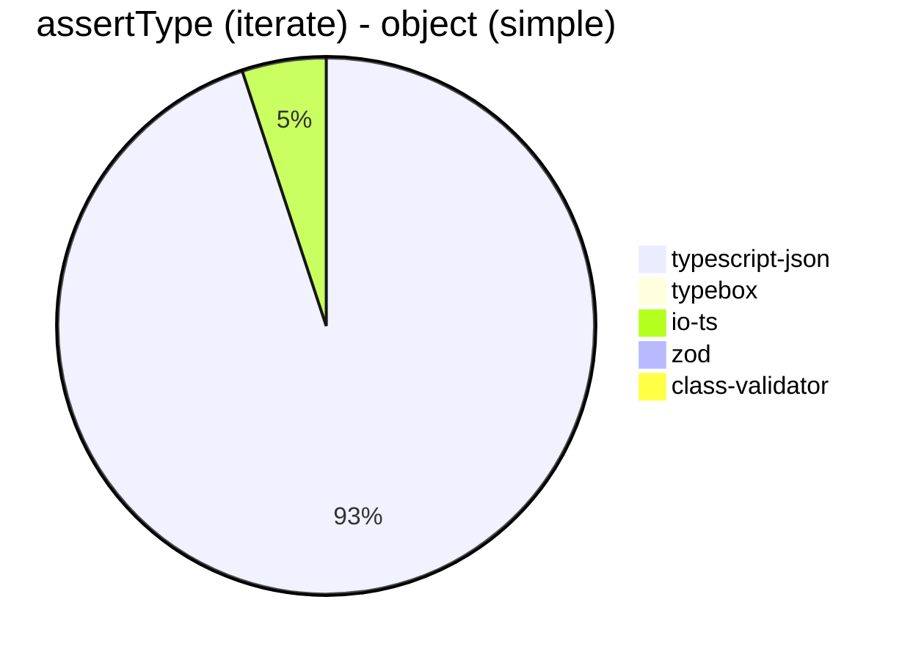
```mermaid
pie title assertType (iterate) - object (simple)
  "typescript-json": 327958.7573647563
  "typebox": 3374.1841914430743
  "io-ts": 17483.97142333761
  "zod": 3508.6486486486483
  "class-validator": 177.54762345108193
```

```mermaid
pie title assertType (iterate) - object (hierarchical)
  "typescript-json": 57443.54403025392
  "typebox": 864.4349916774552
  "io-ts": 3923.0339172568024
  "zod": 408.4117321527393
  "class-validator": 57.22835234711053
```

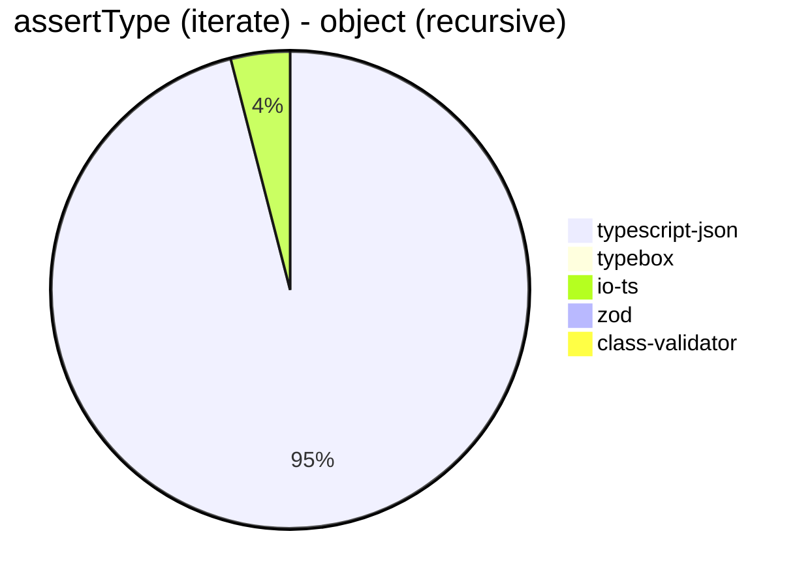
```mermaid
pie title assertType (iterate) - object (recursive)
  "typescript-json": 41895.66585110101
  "typebox": 362.88504883546204
  "io-ts": 1748.6863562239537
  "zod": 73.30933888994127
  "class-validator": 36.75515129014294
```

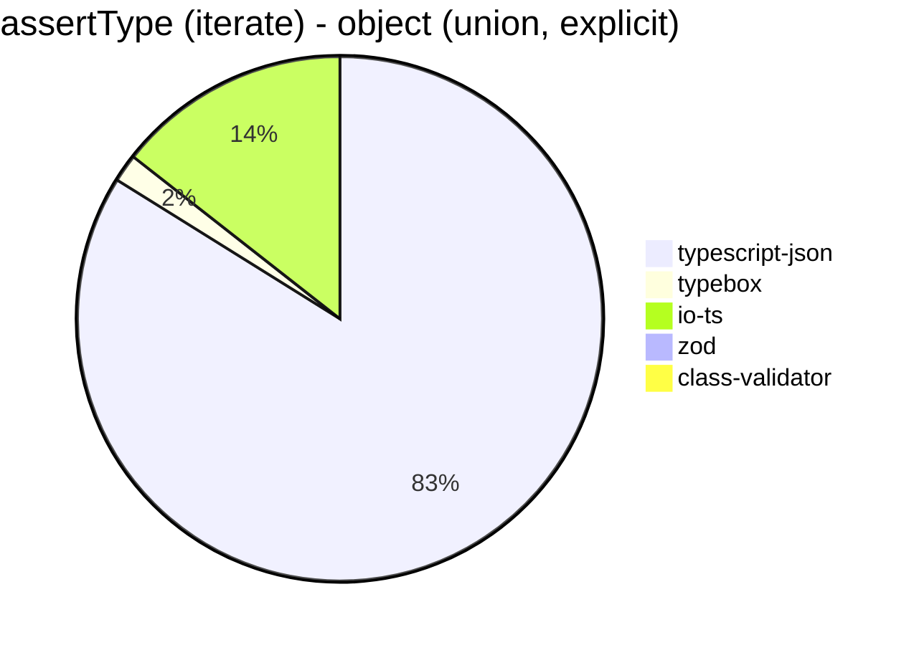
```mermaid
pie title assertType (iterate) - object (union, explicit)
  "typescript-json": 7178.5909339158925
  "typebox": 146.95009242144175
  "io-ts": 1233.3149476006618
  "zod": 33.61040838453198
  "class-validator": 80.21390374331551
```

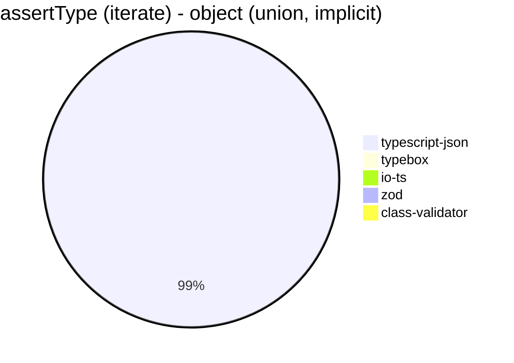
```mermaid
pie title assertType (iterate) - object (union, implicit)
  "typescript-json": 6306.3625022277665
  "typebox": 0
  "io-ts": 0
  "zod": 18.66163996229972
  "class-validator": 55.25581395348837
```

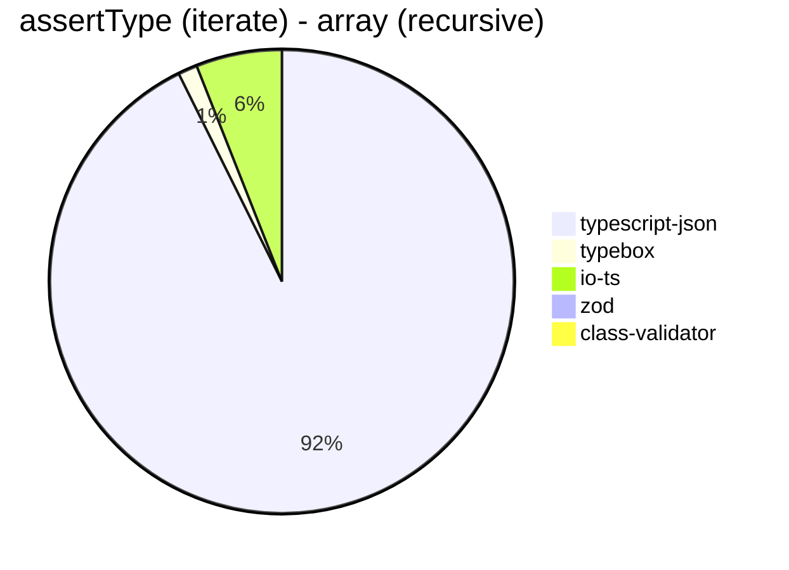
```mermaid
pie title assertType (iterate) - array (recursive)
  "typescript-json": 2658.0339230348354
  "typebox": 38.368860055607044
  "io-ts": 171.68011738811447
  "zod": 9.080590238365495
  "class-validator": 3.3088235294117645
```

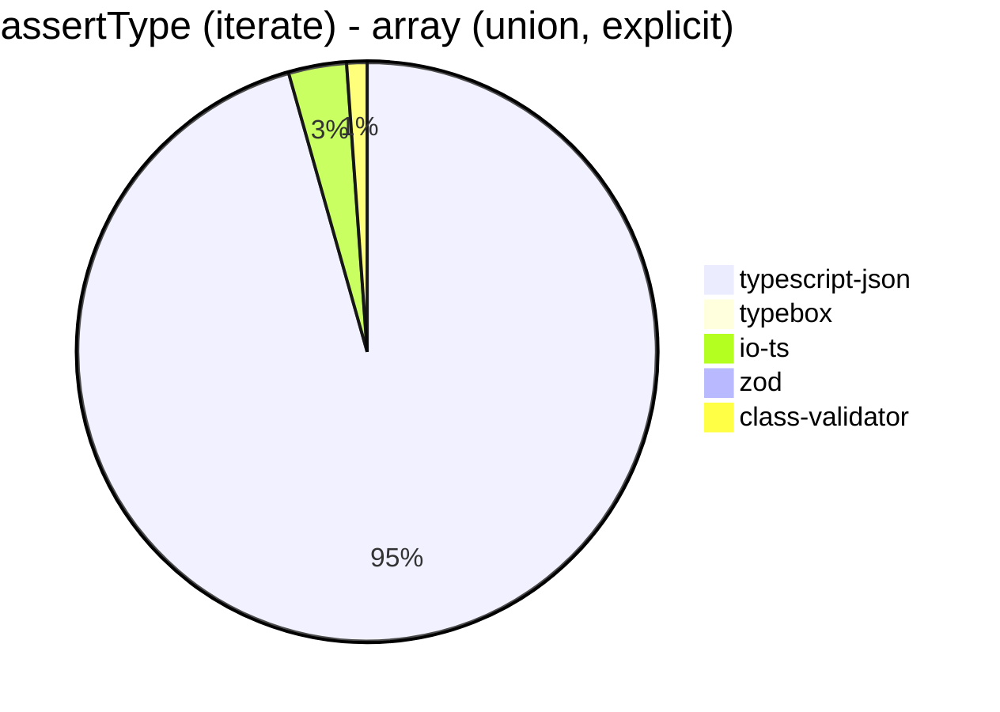
```mermaid
pie title assertType (iterate) - array (union, explicit)
  "typescript-json": 2414.6739130434785
  "typebox": 18.42546063651591
  "io-ts": 81.68593808280492
  "zod": 2.749770852428964
  "class-validator": 28.687017285766828
```

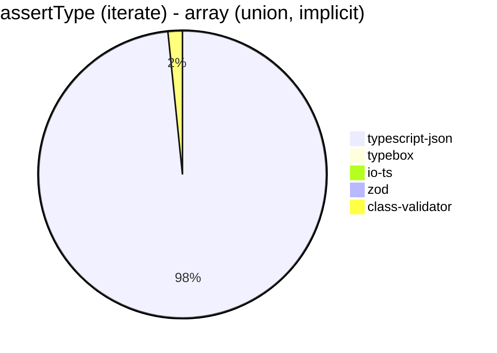
```mermaid
pie title assertType (iterate) - array (union, implicit)
  "typescript-json": 1280.0658978583197
  "typebox": 0
  "io-ts": 0
  "zod": 2.247191011235955
  "class-validator": 21.046643913538112
```

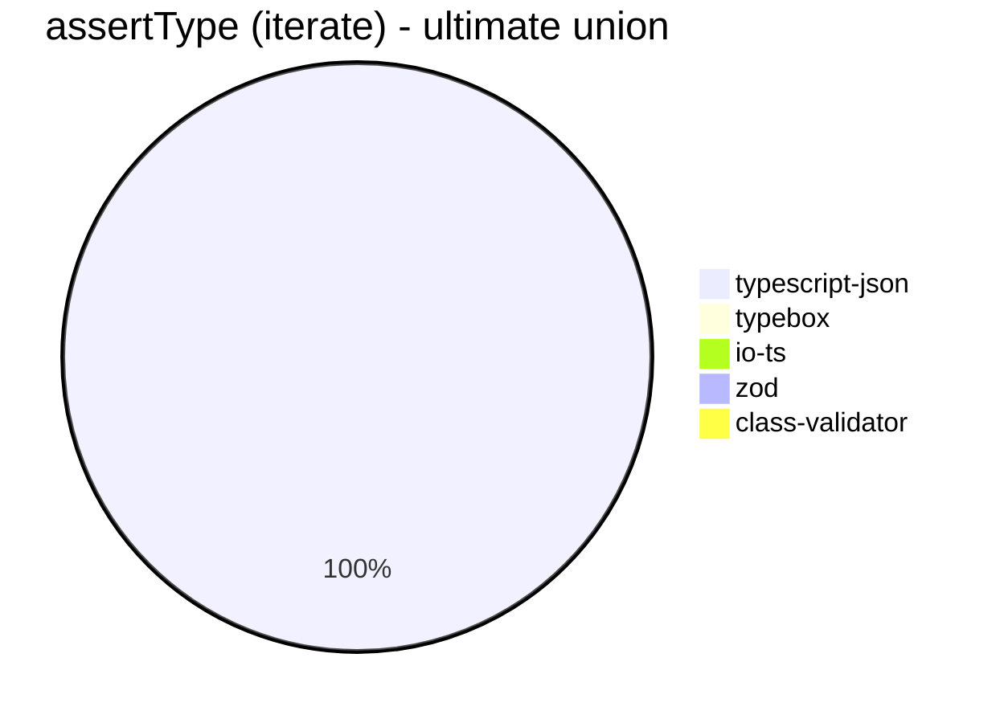
```mermaid
pie title assertType (iterate) - ultimate union
  "typescript-json": 271.58240554845776
  "typebox": 0
  "io-ts": 0
  "zod": 0.501002004008016
  "class-validator": 0
```

## assertType (throw)
 Components | typescript-json | typebox | io-ts | zod | class-validator 
------------|-----------------|---------|-------|-----|-----------------
object (simple) | 548.5735595748648 | 28.271112722000726 | 128.79640044994377 | 32.88129295931637 | 1.833180568285976
object (hierarchical) | 327.5425262395947 | 7.842422031734452 | 35.52729992520568 | 4.366812227074235 | 0.7332722273143905
object (recursive) | 47.03367183324425 | Failed | Failed | 0.18001800180018002 | 0.5558643690939411
object (union, explicit) | 57.65732993815933 | 1.4828544949026878 | 11.559598256585181 | 0.36357025995273584 | 0.9206407659731173
object (union, implicit) | 48.5631138595853 | Failed | Failed | 0.181257930034439 | 0.5589714924538849
array (recursive) | 20.397397573413045 | 0.36529680365296807 | 1.8789928598271326 | 0.16385384237260364 | 0.12507817385866166
array (union, explicit) | 4.797933198007013 | 0.1784121320249777 | 0.7311277645768598 | 0.12110936175366356 | 0.3590019745108598
array (union, implicit) | 1.8467220683287164 | Failed | Failed | 0.09520182787509521 | 0.18315018315018314
ultimate union | 2.7267769496455188 | Failed | Failed | 0.027536830510808206 | Failed

```mermaid
pie title assertType (throw) - object (simple)
  "typescript-json": 548.5735595748648
  "typebox": 28.271112722000726
  "io-ts": 128.79640044994377
  "zod": 32.88129295931637
  "class-validator": 1.833180568285976
```

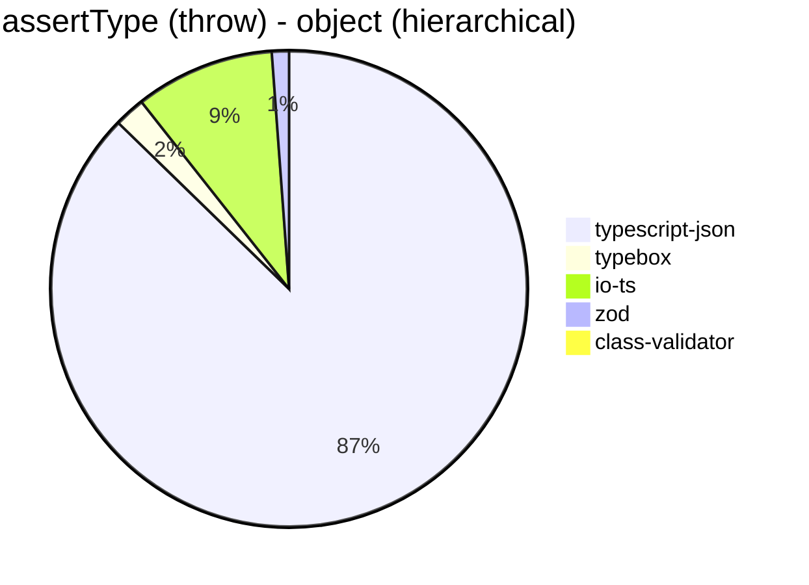
```mermaid
pie title assertType (throw) - object (hierarchical)
  "typescript-json": 327.5425262395947
  "typebox": 7.842422031734452
  "io-ts": 35.52729992520568
  "zod": 4.366812227074235
  "class-validator": 0.7332722273143905
```

```mermaid
pie title assertType (throw) - object (recursive)
  "typescript-json": 47.03367183324425
  "typebox": 0
  "io-ts": 0
  "zod": 0.18001800180018002
  "class-validator": 0.5558643690939411
```

```mermaid
pie title assertType (throw) - object (union, explicit)
  "typescript-json": 57.65732993815933
  "typebox": 1.4828544949026878
  "io-ts": 11.559598256585181
  "zod": 0.36357025995273584
  "class-validator": 0.9206407659731173
```

```mermaid
pie title assertType (throw) - object (union, implicit)
  "typescript-json": 48.5631138595853
  "typebox": 0
  "io-ts": 0
  "zod": 0.181257930034439
  "class-validator": 0.5589714924538849
```

```mermaid
pie title assertType (throw) - array (recursive)
  "typescript-json": 20.397397573413045
  "typebox": 0.36529680365296807
  "io-ts": 1.8789928598271326
  "zod": 0.16385384237260364
  "class-validator": 0.12507817385866166
```

```mermaid
pie title assertType (throw) - array (union, explicit)
  "typescript-json": 4.797933198007013
  "typebox": 0.1784121320249777
  "io-ts": 0.7311277645768598
  "zod": 0.12110936175366356
  "class-validator": 0.3590019745108598
```

```mermaid
pie title assertType (throw) - array (union, implicit)
  "typescript-json": 1.8467220683287164
  "typebox": 0
  "io-ts": 0
  "zod": 0.09520182787509521
  "class-validator": 0.18315018315018314
```

```mermaid
pie title assertType (throw) - ultimate union
  "class-validator": 0
  "typescript-json": 2.7267769496455188
  "typebox": 0
  "io-ts": 0
  "zod": 0.027536830510808206
```

## validate
 Components | typescript-json | typebox | io-ts | zod | class-validator 
------------|-----------------|---------|-------|-----|-----------------
object (simple) | 101943.0791470907 | 2969.1969196919695 | 15367.76007497657 | 3451.4978601997145 | 172.01586729174178
object (hierarchical) | 31582.429308198465 | 841.2787436904094 | 3755.4560716284277 | 416.07476635514024 | 57.25190839694657
object (recursive) | 27229.490022172948 | 374.5123537061118 | 1803.903345724907 | 74.13695529145444 | 37.578288100208766
object (union, explicit) | 5408.57297883885 | 146.10934875909686 | 1234.276144398958 | 35.958904109589035 | 78.87676623144338
object (union, implicit) | 4504.324324324324 | 136.64364383050213 | 342.2590986234207 | 19.19096895578551 | 53.84336475707034
array (recursive) | 1602.3285428415502 | 40.96339844490802 | 189.73679227419052 | 9.679256025811348 | 3.350083752093802
array (union, explicit) | 1975.0812567713976 | 19.05117669032499 | 85.90554109334325 | 3.321646060158701 | 28.296652487516184
array (union, implicit) | 958.1708613966679 | 13.561876059521566 | 62.3347185493011 | 2.213613724405091 | 21.02272727272727
ultimate union | 179.84084880636604 | Failed | Failed | 0.5099439061703213 | Failed

```mermaid
pie title validate - object (simple)
  "typescript-json": 101943.0791470907
  "typebox": 2969.1969196919695
  "io-ts": 15367.76007497657
  "zod": 3451.4978601997145
  "class-validator": 172.01586729174178
```

```mermaid
pie title validate - object (hierarchical)
  "typescript-json": 31582.429308198465
  "typebox": 841.2787436904094
  "io-ts": 3755.4560716284277
  "zod": 416.07476635514024
  "class-validator": 57.25190839694657
```

```mermaid
pie title validate - object (recursive)
  "typescript-json": 27229.490022172948
  "typebox": 374.5123537061118
  "io-ts": 1803.903345724907
  "zod": 74.13695529145444
  "class-validator": 37.578288100208766
```

```mermaid
pie title validate - object (union, explicit)
  "typescript-json": 5408.57297883885
  "typebox": 146.10934875909686
  "io-ts": 1234.276144398958
  "zod": 35.958904109589035
  "class-validator": 78.87676623144338
```

```mermaid
pie title validate - object (union, implicit)
  "typescript-json": 4504.324324324324
  "typebox": 136.64364383050213
  "io-ts": 342.2590986234207
  "zod": 19.19096895578551
  "class-validator": 53.84336475707034
```

```mermaid
pie title validate - array (recursive)
  "typescript-json": 1602.3285428415502
  "typebox": 40.96339844490802
  "io-ts": 189.73679227419052
  "zod": 9.679256025811348
  "class-validator": 3.350083752093802
```

```mermaid
pie title validate - array (union, explicit)
  "typescript-json": 1975.0812567713976
  "typebox": 19.05117669032499
  "io-ts": 85.90554109334325
  "zod": 3.321646060158701
  "class-validator": 28.296652487516184
```

```mermaid
pie title validate - array (union, implicit)
  "typescript-json": 958.1708613966679
  "typebox": 13.561876059521566
  "io-ts": 62.3347185493011
  "zod": 2.213613724405091
  "class-validator": 21.02272727272727
```

```mermaid
pie title validate - ultimate union
  "typescript-json": 179.84084880636604
  "typebox": 0
  "io-ts": 0
  "zod": 0.5099439061703213
  "class-validator": 0
```

## equals
 Components | typescript-json | typebox 
------------|-----------------|---------
object (simple) | 28148.521989906272 | 64189.692585895114
object (hierarchical) | 9011.066027296201 | 18946.6787989081
object (recursive) | 6890.031209840279 | 11811.087190527449
object (union, explicit) | 2997.2722313147847 | 3363.202545068929
object (union, implicit) | 1967.4931129476581 | 2272.1518987341774
array (recursive) | 541.8700713481037 | 1088.2842865074958
array (union, explicit) | 771.1956521739131 | 715.8029664896538
array (union, implicit) | 474.46730345334316 | 430.6722689075631
ultimate union | 330.8583846432452 | 203.42501297353397

```mermaid
pie title equals - object (simple)
  "typescript-json": 28148.521989906272
  "typebox": 64189.692585895114
```

```mermaid
pie title equals - object (hierarchical)
  "typescript-json": 9011.066027296201
  "typebox": 18946.6787989081
```

```mermaid
pie title equals - object (recursive)
  "typescript-json": 6890.031209840279
  "typebox": 11811.087190527449
```

```mermaid
pie title equals - object (union, explicit)
  "typescript-json": 2997.2722313147847
  "typebox": 3363.202545068929
```

```mermaid
pie title equals - object (union, implicit)
  "typescript-json": 1967.4931129476581
  "typebox": 2272.1518987341774
```

```mermaid
pie title equals - array (recursive)
  "typescript-json": 541.8700713481037
  "typebox": 1088.2842865074958
```

```mermaid
pie title equals - array (union, explicit)
  "typescript-json": 771.1956521739131
  "typebox": 715.8029664896538
```

```mermaid
pie title equals - array (union, implicit)
  "typescript-json": 474.46730345334316
  "typebox": 430.6722689075631
```

```mermaid
pie title equals - ultimate union
  "typescript-json": 330.8583846432452
  "typebox": 203.42501297353397
```

## assertEquals (iterate)
 Components | typescript-json | typebox 
------------|-----------------|---------
object (simple) | 33298.29075537585 | 2567.0886075949365
object (hierarchical) | 7749.091569767443 | 710.5119329568228
object (recursive) | 6717.764250138351 | 330.15695067264573
object (union, explicit) | 2442.477876106195 | 112.02185792349727
object (union, implicit) | 1935.287610619469 | 80.94435075885329
array (recursive) | 540.1588702559576 | 35.240621447518
array (union, explicit) | 422.3247232472325 | 16.304347826086953
array (union, implicit) | 262.76165993389645 | 7.250418293363079
ultimate union | 221.86495176848877 | 4.479283314669653

```mermaid
pie title assertEquals (iterate) - object (simple)
  "typescript-json": 33298.29075537585
  "typebox": 2567.0886075949365
```

```mermaid
pie title assertEquals (iterate) - object (hierarchical)
  "typescript-json": 7749.091569767443
  "typebox": 710.5119329568228
```

```mermaid
pie title assertEquals (iterate) - object (recursive)
  "typescript-json": 6717.764250138351
  "typebox": 330.15695067264573
```

```mermaid
pie title assertEquals (iterate) - object (union, explicit)
  "typescript-json": 2442.477876106195
  "typebox": 112.02185792349727
```

```mermaid
pie title assertEquals (iterate) - object (union, implicit)
  "typescript-json": 1935.287610619469
  "typebox": 80.94435075885329
```

```mermaid
pie title assertEquals (iterate) - array (recursive)
  "typescript-json": 540.1588702559576
  "typebox": 35.240621447518
```

```mermaid
pie title assertEquals (iterate) - array (union, explicit)
  "typescript-json": 422.3247232472325
  "typebox": 16.304347826086953
```

```mermaid
pie title assertEquals (iterate) - array (union, implicit)
  "typescript-json": 262.76165993389645
  "typebox": 7.250418293363079
```

```mermaid
pie title assertEquals (iterate) - ultimate union
  "typescript-json": 221.86495176848877
  "typebox": 4.479283314669653
```

## assertEquals (throw)
 Components | typescript-json | typebox 
------------|-----------------|---------
object (simple) | 181.78512997636793 | 22.857142857142858
object (hierarchical) | 65.93607305936074 | 6.361323155216286
object (recursive) | 49.7266795979545 | 3.144072498612909
object (union, explicit) | 24.171397180003662 | 1.1074197120708749
object (union, implicit) | 17.375231053604434 | 0.7352941176470588
array (recursive) | 5.012066085019492 | 0.35823034210997673
array (union, explicit) | 2.195389681668496 | 0.17458100558659218
array (union, implicit) | 1.0834236186348862 | 0.1528350909368791
ultimate union | 2.1513087128002866 | 0.13367196898810318

```mermaid
pie title assertEquals (throw) - object (simple)
  "typescript-json": 181.78512997636793
  "typebox": 22.857142857142858
```

```mermaid
pie title assertEquals (throw) - object (hierarchical)
  "typescript-json": 65.93607305936074
  "typebox": 6.361323155216286
```

```mermaid
pie title assertEquals (throw) - object (recursive)
  "typescript-json": 49.7266795979545
  "typebox": 3.144072498612909
```

```mermaid
pie title assertEquals (throw) - object (union, explicit)
  "typescript-json": 24.171397180003662
  "typebox": 1.1074197120708749
```

```mermaid
pie title assertEquals (throw) - object (union, implicit)
  "typescript-json": 17.375231053604434
  "typebox": 0.7352941176470588
```

```mermaid
pie title assertEquals (throw) - array (recursive)
  "typescript-json": 5.012066085019492
  "typebox": 0.35823034210997673
```

```mermaid
pie title assertEquals (throw) - array (union, explicit)
  "typescript-json": 2.195389681668496
  "typebox": 0.17458100558659218
```

```mermaid
pie title assertEquals (throw) - array (union, implicit)
  "typescript-json": 1.0834236186348862
  "typebox": 0.1528350909368791
```

```mermaid
pie title assertEquals (throw) - ultimate union
  "typescript-json": 2.1513087128002866
  "typebox": 0.13367196898810318
```

## validateEquals
 Components | typescript-json | typebox 
------------|-----------------|---------
object (simple) | 17348.015225666124 | 2492.4017790956264
object (hierarchical) | 7043.861258946596 | 685.6205576817933
object (recursive) | 4666.727206683618 | 312.95569265283234
object (union, explicit) | 1604.5627376425855 | 112.99220087502377
object (union, implicit) | 1197.6348324672997 | 75.99118942731276
array (recursive) | 378.64622288706056 | 31.16883116883117
array (union, explicit) | 350.5079825834543 | 15.590200445434299
array (union, implicit) | 220.54168132254662 | 7.325319308790384
ultimate union | 138.84555382215288 | 4.478447471543198

```mermaid
pie title validateEquals - object (simple)
  "typescript-json": 17348.015225666124
  "typebox": 2492.4017790956264
```

```mermaid
pie title validateEquals - object (hierarchical)
  "typescript-json": 7043.861258946596
  "typebox": 685.6205576817933
```

```mermaid
pie title validateEquals - object (recursive)
  "typescript-json": 4666.727206683618
  "typebox": 312.95569265283234
```

```mermaid
pie title validateEquals - object (union, explicit)
  "typescript-json": 1604.5627376425855
  "typebox": 112.99220087502377
```

```mermaid
pie title validateEquals - object (union, implicit)
  "typescript-json": 1197.6348324672997
  "typebox": 75.99118942731276
```

```mermaid
pie title validateEquals - array (recursive)
  "typescript-json": 378.64622288706056
  "typebox": 31.16883116883117
```

```mermaid
pie title validateEquals - array (union, explicit)
  "typescript-json": 350.5079825834543
  "typebox": 15.590200445434299
```

```mermaid
pie title validateEquals - array (union, implicit)
  "typescript-json": 220.54168132254662
  "typebox": 7.325319308790384
```

```mermaid
pie title validateEquals - ultimate union
  "typescript-json": 138.84555382215288
  "typebox": 4.478447471543198
```

## optimizer
 Components | typescript-json | typebox | ajv 
------------|-----------------|---------|-----
object (hierarchical) | 134279.86589024175 | 199.15176101788677 | 4.834377797672337
object (recursive) | 81074.44124008651 | 772.0057720057721 | 8.96778916544656
object (union) | 18572.46245702913 | 99.72093023255815 | 4.23963133640553
array (hierarchical) | 2691.5870683321086 | 960.8064820048991 | 6.483882919599852
array (recursive) | 7022.3701238676285 | 787.710531186378 | 9.062326613648974
array (union) | 4145.032632342277 | 244.5883441258094 | 6.197593875318994
ultimate union | 601.5797207935342 | 11.601796407185628 | 0.9017132551848512

```mermaid
pie title optimizer - object (hierarchical)
  "typescript-json": 134279.86589024175
  "typebox": 199.15176101788677
  "ajv": 4.834377797672337
```

```mermaid
pie title optimizer - object (recursive)
  "typescript-json": 81074.44124008651
  "typebox": 772.0057720057721
  "ajv": 8.96778916544656
```

```mermaid
pie title optimizer - object (union)
  "typescript-json": 18572.46245702913
  "typebox": 99.72093023255815
  "ajv": 4.23963133640553
```

```mermaid
pie title optimizer - array (hierarchical)
  "typescript-json": 2691.5870683321086
  "typebox": 960.8064820048991
  "ajv": 6.483882919599852
```

```mermaid
pie title optimizer - array (recursive)
  "typescript-json": 7022.3701238676285
  "typebox": 787.710531186378
  "ajv": 9.062326613648974
```

```mermaid
pie title optimizer - array (union)
  "typescript-json": 4145.032632342277
  "typebox": 244.5883441258094
  "ajv": 6.197593875318994
```

```mermaid
pie title optimizer - ultimate union
  "typescript-json": 601.5797207935342
  "typebox": 11.601796407185628
  "ajv": 0.9017132551848512
```

## stringify
 Components | TSON.stringify() | TSON.assertStringify() | TSON.isStringify() | JSON.stringify() | fast-json-stringify 
------------|------------------|------------------------|--------------------|------------------|---------------------
object (simple) | 44933.61298559183 | 39241.625480505216 | 39465.54866934014 | 4426.985321791494 | 29565.07766470273
object (hierarchical) | 5119.207772795216 | 4399.383052077663 | 4655.883993307307 | 1221.9079939668175 | 4473.930240920532
object (recursive) | 5312.418300653594 | 4933.247041420118 | 5000.180212650927 | 921.5428033866415 | 924.6447270007479
object (union) | 1321.1665772052245 | 1080.5441202792197 | 1243.2432432432433 | 335.9144542772861 | 1380.237877401647
array (hierarchical) | 87.71929824561403 | 79.75460122699387 | 86.65191740412979 | 23.225075528700906 | 116.99215185252783
array (recursive) | 254.40348647176322 | 236.79791005784662 | 244.93120926864592 | 77.08177044261066 | 75.50274223034735
array (union) | 331.59409859661747 | 291.0557184750733 | 303.0248791838196 | 158.79433927586842 | 155.22388059701493

```mermaid
pie title stringify - object (simple)
  "TSON.stringify()": 44933.61298559183
  "TSON.assertStringify()": 39241.625480505216
  "TSON.isStringify()": 39465.54866934014
  "JSON.stringify()": 4426.985321791494
  "fast-json-stringify": 29565.07766470273
```

```mermaid
pie title stringify - object (hierarchical)
  "TSON.stringify()": 5119.207772795216
  "TSON.assertStringify()": 4399.383052077663
  "TSON.isStringify()": 4655.883993307307
  "JSON.stringify()": 1221.9079939668175
  "fast-json-stringify": 4473.930240920532
```

```mermaid
pie title stringify - object (recursive)
  "TSON.stringify()": 5312.418300653594
  "TSON.assertStringify()": 4933.247041420118
  "TSON.isStringify()": 5000.180212650927
  "JSON.stringify()": 921.5428033866415
  "fast-json-stringify": 924.6447270007479
```

```mermaid
pie title stringify - object (union)
  "TSON.stringify()": 1321.1665772052245
  "TSON.assertStringify()": 1080.5441202792197
  "TSON.isStringify()": 1243.2432432432433
  "JSON.stringify()": 335.9144542772861
  "fast-json-stringify": 1380.237877401647
```

```mermaid
pie title stringify - array (hierarchical)
  "TSON.stringify()": 87.71929824561403
  "TSON.assertStringify()": 79.75460122699387
  "TSON.isStringify()": 86.65191740412979
  "JSON.stringify()": 23.225075528700906
  "fast-json-stringify": 116.99215185252783
```

```mermaid
pie title stringify - array (recursive)
  "TSON.stringify()": 254.40348647176322
  "TSON.assertStringify()": 236.79791005784662
  "TSON.isStringify()": 244.93120926864592
  "JSON.stringify()": 77.08177044261066
  "fast-json-stringify": 75.50274223034735
```

```mermaid
pie title stringify - array (union)
  "TSON.stringify()": 331.59409859661747
  "TSON.assertStringify()": 291.0557184750733
  "TSON.isStringify()": 303.0248791838196
  "JSON.stringify()": 158.79433927586842
  "fast-json-stringify": 155.22388059701493
```

> Total elapsed time: 1,750,423 ms
