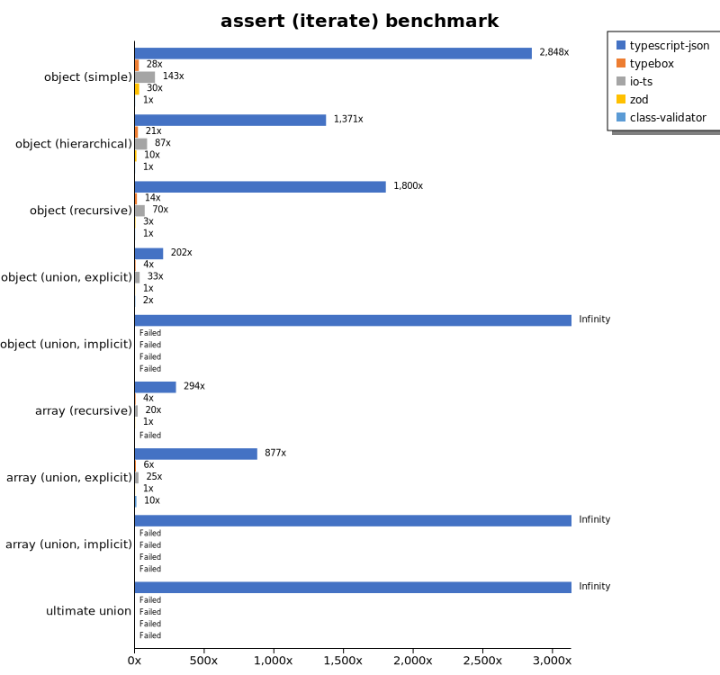
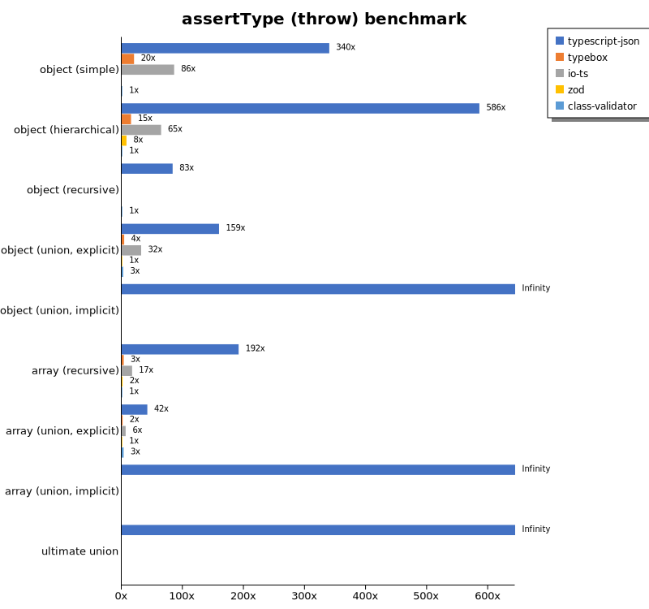

# Benchmark of `typescript-json`
> - CPU: AMD Ryzen 7 5800H with Radeon Graphics
> - Memory: 64,928 MB
> - TypeScript-JSON version: 3.3.20

## is

 Components | typescript-json | typebox | ajv | io-ts | zod | class-validator 
------------|-----------------|---------|-----|-------|-----|-----------------
object (simple) | 1034232.9450915141 | 1619258.7082728592 | 479763.97178513295 | 37795.6570155902 | 3938.359933957072 | 132.54943880277924
object (hierarchical) | 154766.96329254727 | 190875.6936736959 | 52230.47722342733 | 9802.793296089385 | 454.8617469327962 | 44.58945078847199
object (recursive) | 89910.35963499731 | 84767.26481783578 | 41269.12181303117 | 5686.777456647399 | 71.3224368499257 | 28.38427947598253
object (union, explicit) | 19366.364665911664 | 13153.636363636364 | 8382.722799343905 | 3324.981577008106 | 35.53581343697945 | 82.15451577801959
object (union, implicit) | 16842.62295081967 | Failed | Failed | Failed | Failed | Failed
array (recursive) | 7514.188422247447 | 7289.214776313347 | 2233.6601307189544 | 517.2987974098057 | 9.446193739581403 | 2.7711065952336966
array (union, explicit) | 4124.593128390597 | 1936.1585030269675 | 846.0423836261546 | 366.2628145386766 | 3.3222591362126246 | 29.217199558985662
array (union, implicit) | 1727.5675675675677 | Failed | Failed | Failed | Failed | Failed
ultimate union | 635.01695520257 | Failed | Failed | Failed | Failed | Failed

## assertType (iterate)

 Components | typescript-json | typebox | io-ts | zod | class-validator 
------------|-----------------|---------|-------|-----|-----------------
object (simple) | 360784.75577026303 | 3458.1254454739847 | 17602.766798418972 | 3592.791823561054 | 136.16236162361622
object (hierarchical) | 62495.4044117647 | 845.4746136865342 | 4063.2141540729817 | 424.390243902439 | 45.26218951241951
object (recursive) | 47264.24397370343 | 370.8228530362918 | 1831.2243806808056 | 72.35519824593459 | 29.539859875023673
object (union, explicit) | 7067.640692640693 | 146.46098003629766 | 1173.4072022160665 | 35.53299492385787 | 82.19178082191782
object (union, implicit) | 6643.36299255493 | Failed | Failed | Failed | Failed
array (recursive) | 2532.4955116696588 | 37.17403366007028 | 167.6535899333827 | 9.626274065685164 | Failed
array (union, explicit) | 2302.287282708143 | 18.69158878504673 | 83.79272326350606 | 2.742230347349177 | 28.566196667277055
array (union, implicit) | 1079.4545454545455 | Failed | Failed | Failed | Failed
ultimate union | 274.04361816231676 | Failed | Failed | Failed | Failed

## assertType (throw)

 Components | typescript-json | typebox | io-ts | zod | class-validator 
------------|-----------------|---------|-------|-----|-----------------
object (simple) | 50118.074477747505 | 2979.445596831982 | 12660.345789180146 | Failed | 147.43826022852932
object (hierarchical) | 32415.902140672784 | 846.979107848673 | 3574.0878629932986 | 433.30821401657875 | 55.34034311012728
object (recursive) | 4664.145506933189 | Failed | Failed | Failed | 55.907566157286624
object (union, explicit) | 5789.1862370289455 | 149.30944382232175 | 1158.3744777819977 | 36.32401017072285 | 91.8105031215571
object (union, implicit) | 4957.938070520852 | Failed | Failed | Failed | Failed
array (recursive) | 2103.93814062219 | 36.86635944700461 | 187.30099269526127 | 16.49892756970797 | 10.986596352450011
array (union, explicit) | 474.27946005107617 | 17.77777777777778 | 73.39449541284402 | 11.296882060551287 | 36.081544290095614
array (union, implicit) | 182.2157434402332 | Failed | Failed | Failed | Failed
ultimate union | 271.6407098877218 | Failed | Failed | Failed | Failed

## validate

 Components | typescript-json | typebox | io-ts | zod | class-validator 
------------|-----------------|---------|-------|-----|-----------------
object (simple) | 106594.10594829146 | 2971.386647101981 | 14717.450027012426 | 3403.7634408602153 | 138.51288707583905
object (hierarchical) | 33482.98068077277 | 825.3823743627095 | 3796.714208340856 | 431.71144091677627 | 45.34428064937489
object (recursive) | 26170.529801324505 | 365.31365313653134 | 1770.1044147279722 | 73.2394366197183 | 29.015740565143183
object (union, explicit) | 5279.54871060172 | 140.9056886227545 | 1183.3795013850415 | 35.87018409565382 | 81.66268162589662
object (union, implicit) | 4368.695965417868 | 133.32072617246595 | 338.0359105899597 | 19.803847604677483 | Failed
array (recursive) | 1625.1611714864616 | 40.85492717987516 | 189.06131718395156 | 9.666413949962093 | 2.790178571428571
array (union, explicit) | 2076.542757736678 | 19.871309613928844 | 87.56274400446179 | 3.337041156840934 | 28.921023359288096
array (union, implicit) | 1005.7091882247992 | 13.688212927756654 | 63.67392937640872 | 2.094972067039106 | Failed
ultimate union | 183.47639484978544 | Failed | Failed | Failed | Failed

## equals

 Components | typescript-json | typebox 
------------|-----------------|---------
object (simple) | 27898.117386489477 | 64824.653090646956
object (hierarchical) | 8819.68403849646 | 20990.989299793502
object (recursive) | 7033.516483516483 | 11871.651986338307
object (union, explicit) | 3049.7329158224347 | 3480.0215982721384
object (union, implicit) | 1939.9179889463362 | 2358.693733451015
array (recursive) | 555.8060879368658 | 1107.8270388615217
array (union, explicit) | 774.9510763209394 | 741.8596237337193
array (union, implicit) | 480.5692391899289 | 457.3366654766155
ultimate union | 329.17570498915404 | 207.910395519776

## assertEquals (iterate)

 Components | typescript-json | typebox 
------------|-----------------|---------
object (simple) | 28694.78123352662 | 2467.7508778414344
object (hierarchical) | 8055.565676808163 | 720.3373945641987
object (recursive) | 6749.448123620308 | 327.4041133963313
object (union, explicit) | 2626.940133037694 | 111.86627479794268
object (union, implicit) | 1992.9915160457397 | 79.82012366498033
array (recursive) | 569.8905109489051 | 34.51527725386647
array (union, explicit) | 426.70061840669337 | 16.977928692699493
array (union, implicit) | 262.8838211528102 | 7.250418293363079
ultimate union | 231.10386079390972 | 4.499437570303712

## assertEquals (throw)

 Components | typescript-json | typebox 
------------|-----------------|---------
object (simple) | 19376.391982182628 | 2370.887704466091
object (hierarchical) | 6971.597196606419 | 679.1483113069016
object (recursive) | 5389.329488103821 | 319.7893152746426
object (union, explicit) | 2458.7155963302753 | 111.87768040275965
object (union, implicit) | 1772.4724181587992 | 91.50805270863836
array (recursive) | 556.6895527927259 | 36.04902667627974
array (union, explicit) | 241.05321713332097 | 17.70224818551956
array (union, implicit) | 105.09721492380453 | 15.797788309636651
ultimate union | 237.83388218075373 | 13.646288209606986

## validateEquals

 Components | typescript-json | typebox 
------------|-----------------|---------
object (simple) | 18527.99101291893 | 2410.1399236779935
object (hierarchical) | 6778.541226215644 | 688.8929484837413
object (recursive) | 4827.721661054994 | 318.46664209362325
object (union, explicit) | 1653.4492123845735 | 111.15269461077844
object (union, implicit) | 1241.6562555773694 | 79.69639468690703
array (recursive) | 379.6363636363636 | 32.77777777777778
array (union, explicit) | 357.58431926540703 | 16.455456780783052
array (union, implicit) | 240.49497847919656 | 7.371007371007371
ultimate union | 144.57831325301203 | 4.507888805409467

## optimizer

 Components | typescript-json | typebox | ajv 
------------|-----------------|---------|-----
object (hierarchical) | 114577.31407169609 | 201.80722891566265 | 4.962779156327543
object (recursive) | 86467.37928492443 | 801.9680196801968 | 9.461966604823749
object (union) | 19104.314002828854 | 101.25184094256258 | 4.532269760696157
array (hierarchical) | 8185.459678842421 | 962.4751939383005 | 6.850583225328643
array (recursive) | 7302.996042962125 | 810.4230978754313 | 9.831726224238988
array (union) | 4171.171171171171 | 256.3626230726361 | 6.643292120317402
ultimate union | 633.7573911485397 | 12.120115774240233 | 0.9144111192392099

## stringify

 Components | TSON.stringify() | TSON.assertStringify() | TSON.isStringify() | JSON.stringify() | fast-json-stringify 
------------|------------------|------------------------|--------------------|------------------|---------------------
object (simple) | 46782.88372093023 | 38352.73531037023 | 40266.230223677034 | 4524.043922756531 | 31192.161820480404
object (hierarchical) | 5522.846441947566 | 4475.631447883316 | 4915.746114959745 | 1163.7426900584794 | 4880.30888030888
object (recursive) | 5410.164368033251 | 5050.308584252852 | 5184.018929741536 | 831.1011904761904 | 854.8477489258361
object (union) | 1462.834126693519 | 1145.9343026386646 | 1316.2041181736795 | 389.7474557105164 | 1356.899336084694
array (hierarchical) | 71.97661673364998 | 64.40677966101694 | 70.76418019332483 | 20.120345994734866 | 92.01141226818831
array (recursive) | 254.7930478408887 | 241.68679175181126 | 249.9553651133726 | 76.77867467617796 | 74.76979742173113
array (union) | 333.3333333333333 | 294.10729991204926 | 310.77147016011645 | 173.22688451541032 | 162.0183486238532

