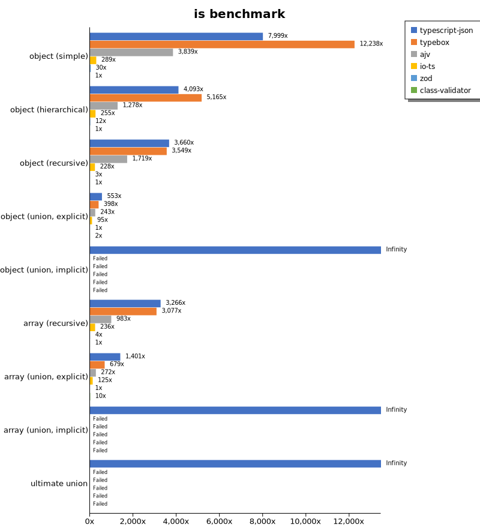
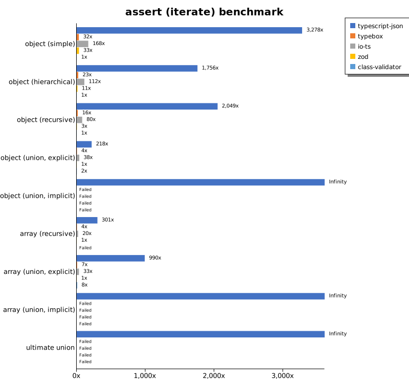
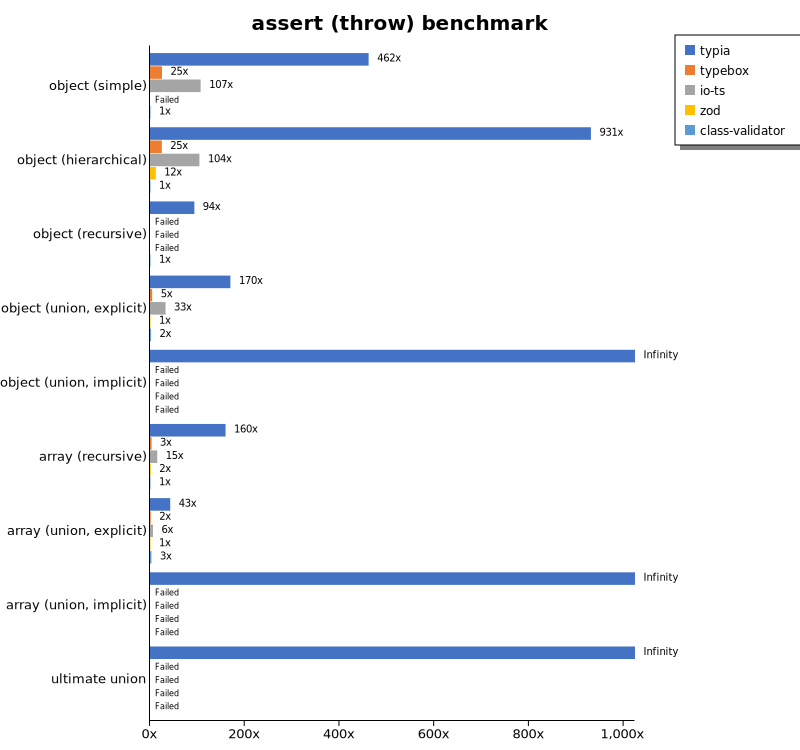
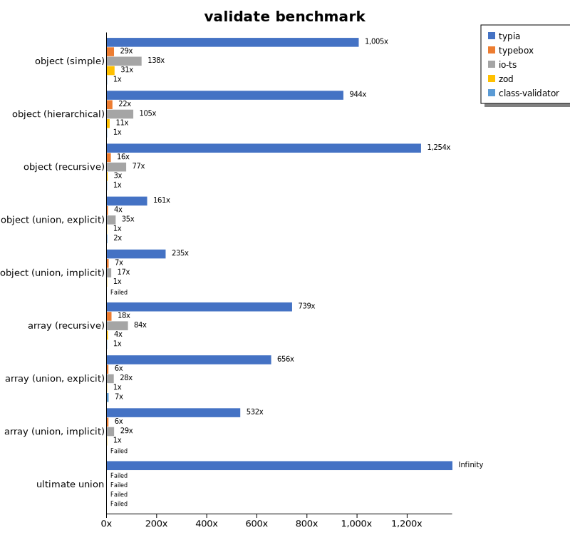
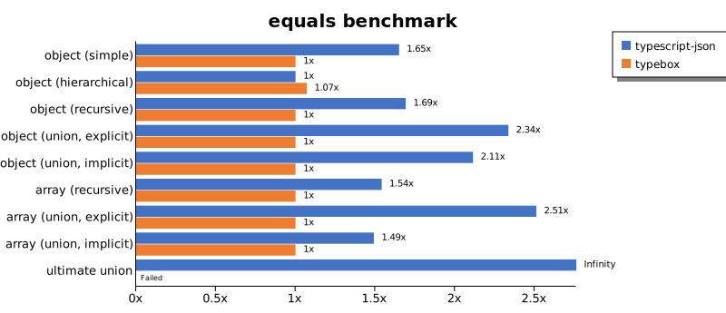
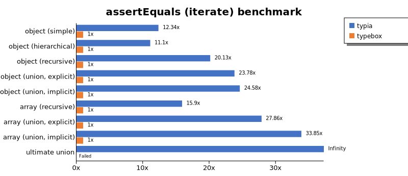
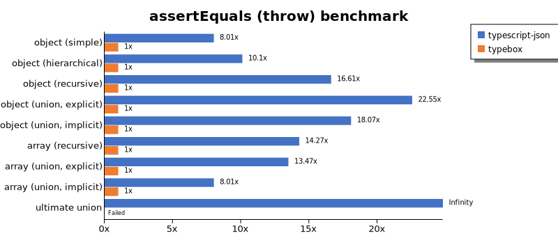
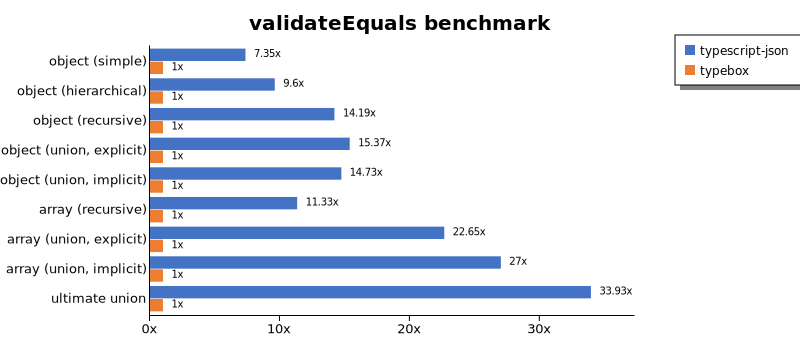
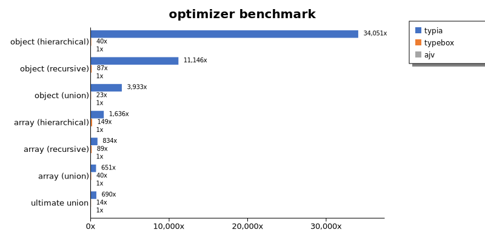
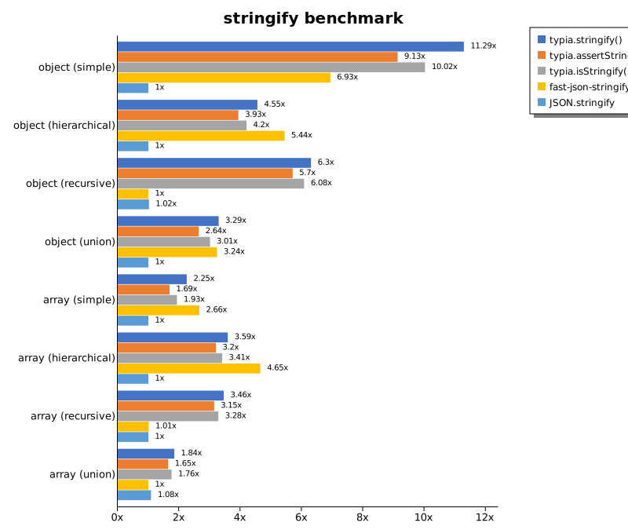

# Benchmark of `typescript-json`
> - CPU: AMD Ryzen 7 5800H with Radeon Graphics
> - Memory: 64,928 MB
> - OS: win32
> - TypeScript-JSON version: 3.3.29

## is

 Components | typescript-json | typebox | ajv | io-ts | zod | class-validator 
------------|-----------------|---------|-----|-------|-----|-----------------
object (simple) | 2015257.1531401833 | 1116310.2678571427 | 503226.8098500278 | 37787.033683448026 | 4029.0070658237264 | 131.15929044974018
object (hierarchical) | 194270.92958787657 | 190459.22668132675 | 50200.75147611379 | 9131.474103585657 | 441.66070150322116 | 37.26027397260274
object (recursive) | 103625.81110310022 | 85871.6203788854 | 44084.295400403156 | 5726.78405931418 | 71.67672334978973 | 24.512534818941504
object (union, explicit) | 25578.022799476734 | 14291.976225854383 | 8757.646217134681 | 3228.650137741047 | 35.58460421205519 | 67.67193821257816
object (union, implicit) | 18108.00604229607 | Failed | Failed | Failed | Failed | Failed
array (recursive) | 8967.636955342616 | 7220.326409495548 | 2308.7199855569597 | 528.7830489405587 | 9.643916913946587 | 2.1998166819431715
array (union, explicit) | 4147.217235188509 | 1973.526745240254 | 877.1737140765147 | 368.8049373480456 | 2.9739776951672865 | 22.698151198974923
array (union, implicit) | 1304.7178538390378 | Failed | Failed | Failed | Failed | Failed
ultimate union | 587.3619409741083 | Failed | Failed | Failed | Failed | Failed

## assert (iterate)

 Components | typescript-json | typebox | io-ts | zod | class-validator 
------------|-----------------|---------|-------|-----|-----------------
object (simple) | 377839.68630311877 | 3814.1809290953547 | 18299.28479735925 | 3728.86937431394 | 115.02816645466109
object (hierarchical) | 68240.4432132964 | 914.6341463414634 | 4173.433768142569 | 435.68242640499557 | 38.525041276829946
object (recursive) | 48937.32820230896 | 388.71356970484504 | 2027.5517751479288 | 79.13802712242244 | 24.93995935710327
object (union, explicit) | 7439.978659078784 | 155.03731343283582 | 1359.471037437139 | 35.655512890839276 | 67.27941176470588
object (union, implicit) | 7068.045726728362 | Failed | Failed | Failed | Failed
array (recursive) | 2930.4267161410016 | 40.20848845867461 | 193.01470588235293 | 9.52203136669156 | Failed
array (union, explicit) | 2647.220693450743 | 20.08181480104128 | 89.69917958067455 | 3.3259423503325944 | 23.020774845592364
array (union, implicit) | 1392.916131400257 | Failed | Failed | Failed | Failed
ultimate union | 238.4141926140478 | Failed | Failed | Failed | Failed

## assert (throw)

 Components | typescript-json | typebox | io-ts | zod | class-validator 
------------|-----------------|---------|-------|-----|-----------------
object (simple) | 59444.75708122303 | 3264.316358888267 | 13758.389261744966 | Failed | 128.9134438305709
object (hierarchical) | 34769.74292583688 | 916.0590764628902 | 3754.392454226004 | 425.2172305416898 | 53.41880341880342
object (recursive) | 4838.99982011153 | Failed | Failed | Failed | 54.84460694698355
object (union, explicit) | 6079.740212881112 | 150.34767900770532 | 1264.8669057957336 | 36.72420124862285 | 74.80830372171312
object (union, implicit) | 4810.682275471008 | Failed | Failed | Failed | Failed
array (recursive) | 1780.5232558139537 | 36.8052999631947 | 166.358595194085 | 16.764459346186086 | 10.682619378271552
array (union, explicit) | 495.4128440366972 | 17.873100983020553 | 74.32181345224824 | 12.592872434202244 | 35.044681969511124
array (union, implicit) | 183.01610541727672 | Failed | Failed | Failed | Failed
ultimate union | 271.83762232693005 | Failed | Failed | Failed | Failed

## validate

 Components | typescript-json | typebox | io-ts | zod | class-validator 
------------|-----------------|---------|-------|-----|-----------------
object (simple) | 115170.25981205088 | 3319.842608206858 | 15296.909492273731 | 3644.988946204863 | 116.32200886262925
object (hierarchical) | 36492.377188029364 | 895.6204379562042 | 4030.3647472690245 | 434.48667044809986 | 39.03958944281524
object (recursive) | 30420.045471769612 | 389.86784140969166 | 1880.0954829232467 | 74.44029850746269 | 24.40377149195785
object (union, explicit) | 5766.703176341731 | 154.17921686746985 | 1255.2092937488474 | 36.312849162011176 | 68.14373487246323
object (union, implicit) | 4588.330051906211 | 143.28525941187485 | 353.46260387811634 | 20.35431586882774 | Failed
array (recursive) | 1675.5173045229812 | 40.43429427180831 | 188.4084979500559 | 9.418282548476453 | 2.223457476375764
array (union, explicit) | 2127.422303473492 | 20.296936666040217 | 90.65628476084538 | 3.3432392273402676 | 23.003553394426778
array (union, implicit) | 1171.4547118023788 | 14.113662024840044 | 63.96819660281894 | 2.1830089139530653 | Failed
ultimate union | 191.9280930560451 | Failed | Failed | Failed | Failed

## equals

 Components | typescript-json | typebox 
------------|-----------------|---------
object (simple) | 31741.769358101894 | 69071.72841759445
object (hierarchical) | 9645.71848585079 | 19859.59726584149
object (recursive) | 7670.057333086739 | 12539.630239794984
object (union, explicit) | 3220.6470374409305 | 3700.0369412633913
object (union, implicit) | 2098.2175336485993 | 2454.954144937961
array (recursive) | 611.5733037530043 | 1152.6536567572498
array (union, explicit) | 784.8524224986078 | 721.239744758432
array (union, implicit) | 406.8672697064796 | 468.35895602431174
ultimate union | 269.15341012982265 | Failed

## assertEquals (iterate)

 Components | typescript-json | typebox 
------------|-----------------|---------
object (simple) | 33328.376925833036 | 2680.214298910031
object (hierarchical) | 8179.930795847751 | 736.7074730495158
object (recursive) | 6719.957272565427 | 332.47988295537675
object (union, explicit) | 2642.5760286225404 | 116.27036135555139
object (union, implicit) | 2024.4755244755245 | 83.02583025830258
array (recursive) | 546.0980036297641 | 35.31422061894816
array (union, explicit) | 415.50053821313236 | 16.41509433962264
array (union, implicit) | 264.64247215235355 | 7.291082445316881
ultimate union | 191.51231792843015 | Failed

## assertEquals (throw)

 Components | typescript-json | typebox 
------------|-----------------|---------
object (simple) | 20092.59259259259 | 2508.827355510128
object (hierarchical) | 7111.274871039056 | 704.2253521126761
object (recursive) | 5466.17915904936 | 329.1278113000548
object (union, explicit) | 2511.3739763421295 | 111.37924633376647
object (union, implicit) | 1638.7472687545521 | 90.6947215672048
array (recursive) | 518.0388529139685 | 36.29764065335753
array (union, explicit) | 238.92666789193163 | 17.733640716439083
array (union, implicit) | 127.64405543398978 | 15.936254980079681
ultimate union | 201.64986251145737 | Failed

## validateEquals

 Components | typescript-json | typebox 
------------|-----------------|---------
object (simple) | 19126.290994745425 | 2541.4048059149723
object (hierarchical) | 7453.389060512448 | 704.0424364368027
object (recursive) | 5008.918820531489 | 328.996282527881
object (union, explicit) | 1729.8994974874372 | 114.0011068068622
object (union, implicit) | 1282.898241875333 | 84.56225499346648
array (recursive) | 403.0509097592355 | 34.00854859691507
array (union, explicit) | 372.29827089337175 | 16.753536857781086
array (union, implicit) | 195.00808044532232 | 7.389162561576355
ultimate union | 129.04372555990045 | Failed

## optimizer

 Components | typescript-json | typebox | ajv 
------------|-----------------|---------|-----
object (hierarchical) | 139343.39692535656 | 205.60581869788896 | 4.94088583024528
object (recursive) | 91365.63797148528 | 840.5095084320058 | 9.464870768110666
object (union) | 19794.311926605504 | 102.35640648011781 | 4.5396767750136195
array (hierarchical) | 8124.129308805143 | 991.4577530176416 | 6.863290669634576
array (recursive) | 7789.295137580098 | 827.6984270475502 | 9.730126675234073
array (union) | 4398.768562115176 | 261.08740025978847 | 6.442113013068287
ultimate union | 605.7193923145666 | 12.593538966964774 | 0.897182845863987

## stringify

 Components | TSON.stringify() | TSON.assertStringify() | TSON.isStringify() | JSON.stringify() | fast-json-stringify 
------------|------------------|------------------------|--------------------|------------------|---------------------
object (simple) | 49539.63864306785 | 41874.357090374724 | 47381.085098476404 | 4767.631774313289 | 33257.915200888725
object (hierarchical) | 5688.200149365198 | 4977.259913550085 | 5264.136904761905 | 1250.6887052341597 | 5028.10650887574
object (recursive) | 5601.550960118168 | 5260.349586016559 | 5427.686703096539 | 982.5253664036077 | 985.0887127217818
object (union) | 1484.063373718546 | 1119.4395796847637 | 1306.5154787616991 | 416.234247590808 | 1412.0395327942497
array (hierarchical) | 214.96350364963502 | 193.27272727272728 | 209.43844887506862 | 58.268590455049946 | 308.5164336299256
array (recursive) | 269.544275657651 | 246.14240565160813 | 254.03737978588276 | 77.69330613758576 | 79.32647333956969
array (union) | 346.8062071454349 | 305.25544772019776 | 312.7894549340933 | 171.5822667408644 | 157.69300967329804

