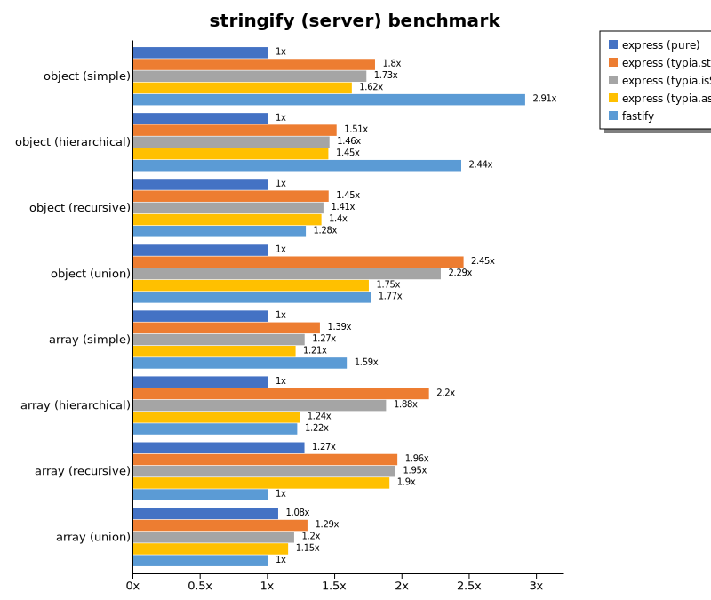

# Benchmark of `typescript-json`
> - CPU: AMD Ryzen 7 5800H with Radeon Graphics
> - Memory: 64,928 MB
> - OS: win32
> - TypeScript-JSON version: 3.3.34

## is

 Components | typescript-json | typebox | ajv | io-ts | zod | class-validator 
------------|-----------------|---------|-----|-------|-----|-----------------
object (simple) | 252957.5883007671 | 145129.50204188694 | 60582.216402746635 | 4719.279624377421 | 515.0633904538705 | 16.106766320828278
object (hierarchical) | 170925.79459791744 | 170451.4803684033 | 43985.52662196635 | 8353.440753412851 | 388.62831609712237 | 32.85063480103336
object (recursive) | 122499.70904666978 | 92257.94156880693 | 48473.681307111874 | 6101.937574870992 | 76.21892565578158 | 26.191492480684328
object (union, explicit) | 26616.17049251694 | 14762.447680995476 | 9351.43683938419 | 3256.199692234849 | 37.86998426549244 | 71.33292115628394
object (union, implicit) | 25815.28540159147 | Failed | Failed | Failed | Failed | Failed
array (recursive) | 97319.4305353241 | 76824.20396693097 | 25389.215102361846 | 5735.699740836727 | 107.26515630858643 | 24.505411330734965
array (union, explicit) | 29472.243646381266 | 13343.258555721359 | 5939.133971616074 | 2515.0829529494385 | 20.11261857616504 | 157.14640639507894
array (union, implicit) | 11647.352898257903 | Failed | Failed | Failed | Failed | Failed
ultimate union | 8686.746488378478 | Failed | Failed | Failed | Failed | Failed

 Unit: kilobytes/sec 

## assert (iterate)

 Components | typescript-json | typebox | io-ts | zod | class-validator 
------------|-----------------|---------|-------|-----|-----------------
object (simple) | 47059.226641699854 | 472.0919406970208 | 2412.5992168405714 | 478.57685148902823 | 14.760424435950025
object (hierarchical) | 56490.474117920145 | 749.3597490791898 | 3533.8497948144 | 388.6452172429481 | 32.06126540413193
object (recursive) | 54319.18272657256 | 417.6389412961947 | 2144.1577334398803 | 87.94642857142856 | 27.208883631447588
object (union, explicit) | 8280.261430584016 | 160.3248767354726 | 1425.7179004995355 | 37.71151353686636 | 72.06151334010339
object (union, implicit) | 9867.309659480004 | Failed | Failed | Failed | Failed
array (recursive) | 31719.6044921875 | 438.5870995088868 | 2101.3381835223117 | 105.09245986238533 | Failed
array (union, explicit) | 19100.591192707365 | 133.06935628255206 | 625.8136510716273 | 22.714709899981475 | 159.23892250973844
array (union, implicit) | 12669.809948065904 | Failed | Failed | Failed | Failed
ultimate union | 3885.8584660743495 | Failed | Failed | Failed | Failed

 Unit: kilobytes/sec 

## assert (throw)

 Components | typescript-json | typebox | io-ts | zod | class-validator 
------------|-----------------|---------|-------|-----|-----------------
object (simple) | 7380.306548180275 | 405.8679298904974 | 1709.0073959307765 | Failed | 15.988421906415647
object (hierarchical) | 28850.738949796032 | 775.1560093685831 | 3232.139353197674 | 379.81004901960785 | 30.991083264765038
object (recursive) | 7235.103589072198 | Failed | Failed | Failed | 77.28542380136987
object (union, explicit) | 6557.127906976744 | 175.73543954765452 | 1267.3131098977694 | 38.6351864640884 | 77.77166357738648
object (union, implicit) | 7240.158274623957 | Failed | Failed | Failed | Failed
array (recursive) | 18844.18299908842 | 402.70211499725326 | 1806.8656426876025 | 180.02261378519972 | 118.14528043408187
array (union, explicit) | 3428.185515273387 | 124.22066900927948 | 504.40842029922425 | 80.33852634443399 | 238.4203935306443
array (union, implicit) | 1607.1469961060634 | Failed | Failed | Failed | Failed
ultimate union | 3884.537689574265 | Failed | Failed | Failed | Failed

 Unit: kilobytes/sec 

## validate

 Components | typescript-json | typebox | io-ts | zod | class-validator 
------------|-----------------|---------|-------|-----|-----------------
object (simple) | 14288.810597045087 | 405.0762749001671 | 1968.0560699765708 | 435.5435432191597 | 14.211947652169998
object (hierarchical) | 31139.96179966044 | 731.9602525342344 | 3478.403049804141 | 365.7497228381375 | 32.9819691686548
object (recursive) | 34079.193195574 | 432.6581749461308 | 2092.6877550547206 | 83.05450731295706 | 27.175527014185054
object (union, explicit) | 6111.436770928637 | 162.7391976209376 | 1333.0065734321188 | 38.01748006926367 | 71.3175043202765
object (union, implicit) | 6586.166273262179 | 201.18051077745025 | 488.5304617952522 | 28.077633794910177 | Failed
array (recursive) | 18216.204059530464 | 455.28831351837823 | 2074.584756692694 | 106.16685045532157 | 24.639198166167663
array (union, explicit) | 14730.916846749504 | 137.55736757286996 | 618.5529478451475 | 22.460401221856124 | 156.07930152876023
array (union, implicit) | 10213.32457412106 | 121.59349325117371 | 552.2882908950618 | 19.181199083503056 | Failed
ultimate union | 2711.840715531116 | Failed | Failed | Failed | Failed

 Unit: kilobytes/sec 

## equals

 Components | typescript-json | typebox 
------------|-----------------|---------
object (simple) | 3964.8603738455267 | 8622.833224134001
object (hierarchical) | 8391.157085316734 | 17456.644690160832
object (recursive) | 8372.25910121991 | 13960.155890969669
object (union, explicit) | 3432.2368421052633 | 3849.389926723358
object (union, implicit) | 2901.365945956684 | 3577.840578445065
array (recursive) | 6854.909276318872 | 12395.663594090662
array (union, explicit) | 5838.26362251805 | 5445.17936536497
array (union, implicit) | 3643.3178274105367 | 4164.33231863079
ultimate union | 3876.636849870896 | Failed

 Unit: kilobytes/sec 

## assertEquals (iterate)

 Components | typescript-json | typebox 
------------|-----------------|---------
object (simple) | 4228.488469063957 | 342.78160577369886
object (hierarchical) | 6949.56423960813 | 626.1603923224393
object (recursive) | 7545.068788318997 | 374.7761741966939
object (union, explicit) | 2855.6437959136824 | 120.07116579652559
object (union, implicit) | 2863.6710903259677 | 116.49167149649887
array (recursive) | 6155.246101460164 | 387.2314638220243
array (union, explicit) | 3248.5411440914163 | 116.60901604328838
array (union, implicit) | 2143.2058519378966 | 63.31233742266592
ultimate union | 2781.5800205756636 | Failed

 Unit: kilobytes/sec 

## assertEquals (throw)

 Components | typescript-json | typebox 
------------|-----------------|---------
object (simple) | 2464.9480797568613 | 314.80478166141296
object (hierarchical) | 6144.473336730911 | 598.3809192200557
object (recursive) | 6083.5614284383155 | 345.715943183949
object (union, explicit) | 2611.8259250902524 | 116.58809766493701
object (union, implicit) | 2393.1228154893306 | 129.96538947610293
array (recursive) | 5912.674086030229 | 401.1492827494983
array (union, explicit) | 1639.9800934266448 | 120.60348491874227
array (union, implicit) | 959.1141507475083 | 133.79886885910707
ultimate union | 2851.7640888820806 | Failed

 Unit: kilobytes/sec 

## validateEquals

 Components | typescript-json | typebox 
------------|-----------------|---------
object (simple) | 2364.0671943281136 | 319.36928707312546
object (hierarchical) | 6065.406410820693 | 617.6739579443615
object (recursive) | 5404.157081517708 | 358.04182556333456
object (union, explicit) | 1784.2834892252777 | 121.304145390319
object (union, implicit) | 1785.9516214779374 | 114.36036886774855
array (recursive) | 4383.39043003565 | 387.2250473036897
array (union, explicit) | 2568.518606656513 | 115.77213861105868
array (union, implicit) | 2054.0813026046408 | 63.758415157572905
ultimate union | 1859.8548189878506 | Failed

 Unit: kilobytes/sec 

## optimizer

 Components | typescript-json | typebox | ajv 
------------|-----------------|---------|-----
object (hierarchical) | 150075.53850598927 | 178.0330200514924 | 4.407399060719373
object (recursive) | 116910.82236317445 | 913.6153316463634 | 10.489156102057539
object (union) | 24971.012352271708 | 147.59077974786868 | 6.348821171315837
array (hierarchical) | 129146.9452884092 | 11756.601540746242 | 78.95688657407406
array (recursive) | 88204.74055239423 | 9441.838436981376 | 105.76882198893526
array (union) | 28792.7082970838 | 1769.8940595975234 | 44.24187262026374
ultimate union | 8928.740668911007 | 178.2329023833213 | 12.943525086113125

 Unit: kilobytes/sec 

## stringify

 Components | TSON.stringify() | TSON.assertStringify() | TSON.isStringify() | fast-json-stringify | JSON.stringify 
------------|------------------|------------------------|--------------------|---------------------|----------------
object (simple) | 6907.3598212619 | 5586.384551897956 | 6132.416616024681 | 4243.328955681393 | 611.9673891505035
object (hierarchical) | 4781.572463195448 | 4129.740866185609 | 4408.976737481641 | 5712.578351080666 | 1049.8875605081528
object (recursive) | 6361.867742328019 | 5758.065589599833 | 6133.827654544599 | 1009.4035003814499 | 1028.0347890451517
object (union) | 1959.9097631459658 | 1572.9391895716356 | 1792.6113879840339 | 1928.8695937274856 | 595.4920850889513
array (simple) | 1950.6113401520806 | 1466.308154569167 | 1674.4608676309545 | 2305.962411310518 | 867.0881885593221
array (hierarchical) | 3292.3488829342987 | 2935.8316835062806 | 3124.1419943496307 | 4265.488760610814 | 917.3221523037543
array (recursive) | 2870.8669284821262 | 2611.982550584741 | 2724.1566827623906 | 840.1049627435996 | 830.4266997167139
array (union) | 2084.70615922539 | 1860.8006076546346 | 1984.5213498622588 | 1130.3185933147633 | 1226.1010332138137

 Unit: KB/s 

## stringify (server)

 Components | express (pure) | express (TSON.stringify) | express (TSON.isStringify) | express (TSON.assertStringify) | fastify 
------------|----------------|--------------------------|----------------------------|--------------------------------|---------
object (simple) | 40470.7902377064 | 72714.36575875487 | 70116.22072031208 | 65729.49410377358 | 117879.84689342404
object (hierarchical) | 83491.11205263683 | 126143.72825219473 | 121724.75550243999 | 121015.18151306242 | 203520.7489794067
object (recursive) | 45962.39760457309 | 66722.16701586351 | 64949.802454354984 | 64253.796044275085 | 58930.27157537663
object (union) | 48856.41611005882 | 119936.04946644061 | 111659.66088689586 | 85514.33276942979 | 86241.97965696051
array (simple) | 66811.04247681722 | 92651.54537313433 | 85052.93632286995 | 80580.48554913295 | 106001.02870813398
array (hierarchical) | 63795.81034823902 | 140197.33796250372 | 119848.57752207122 | 78868.515988516 | 77703.65465912475
array (recursive) | 37544.62791330371 | 57945.29994556342 | 57515.155053529306 | 56202.310197786246 | 29519.208155146694
array (union) | 86198.97865549571 | 103630.00498653635 | 95698.99890274314 | 92101.17336658353 | 80066.63465948749

 Unit: megabytes/sec 

