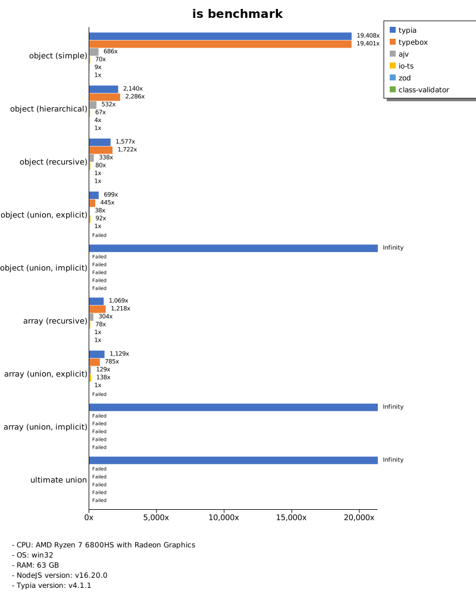
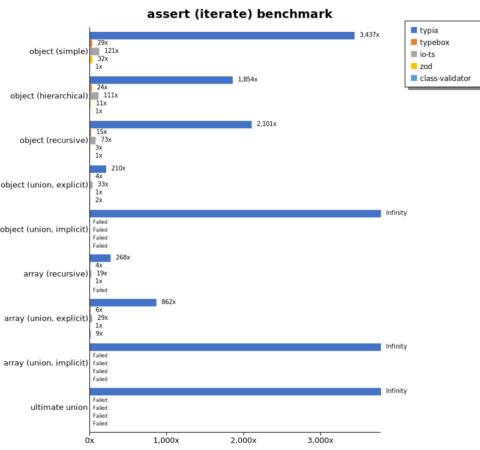
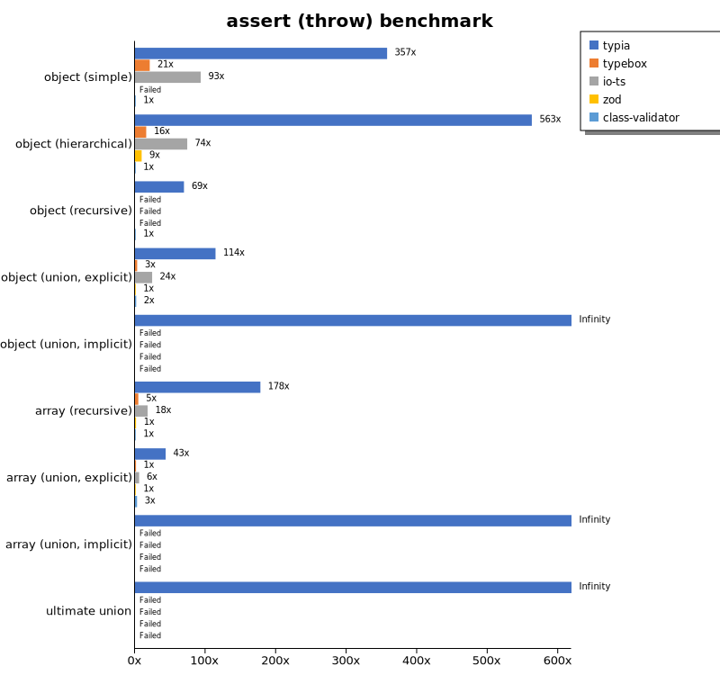
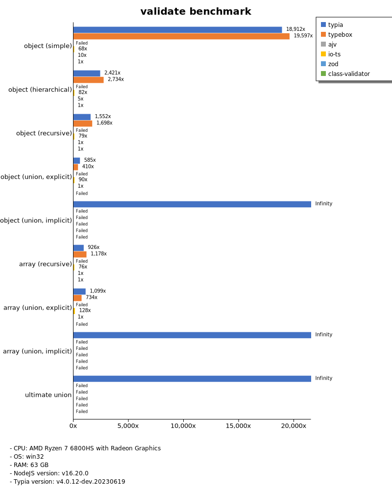
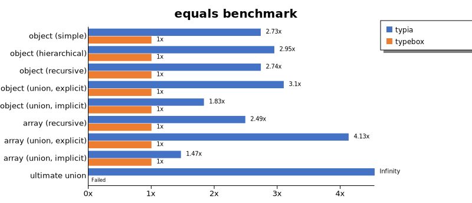
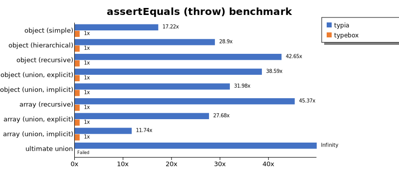
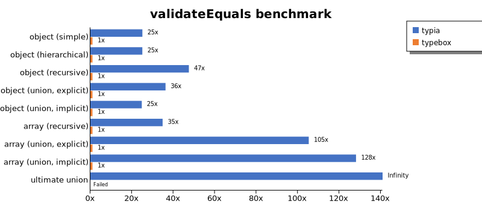
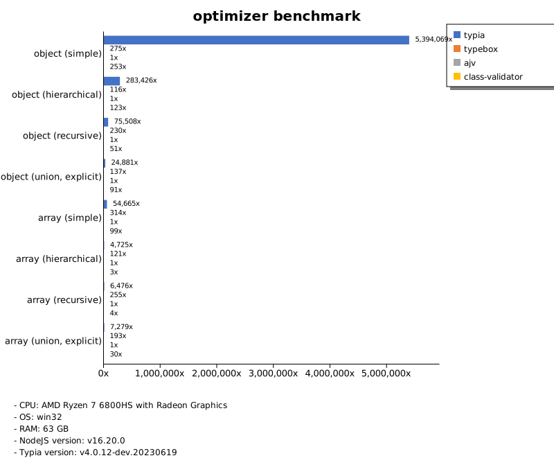
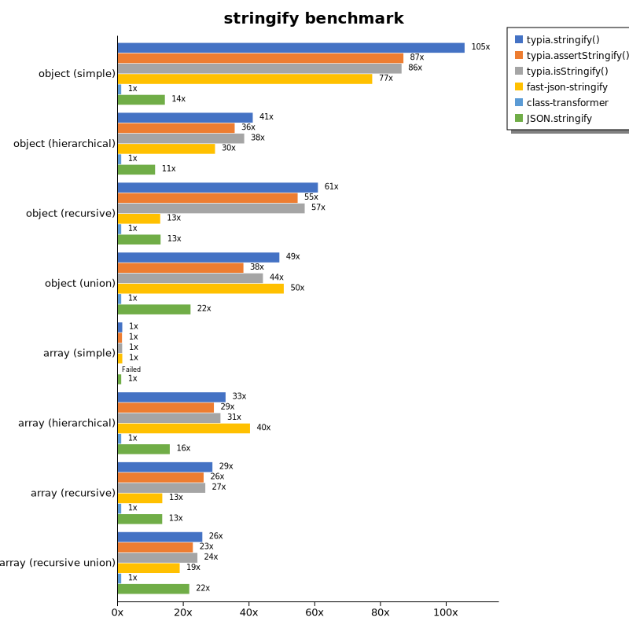
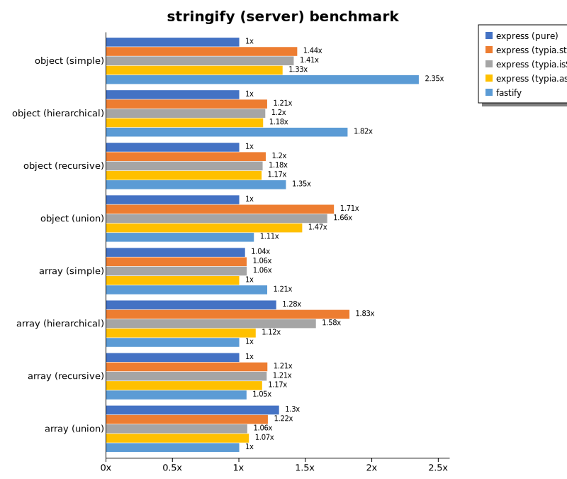

# Benchmark of `typia`
> - CPU: AMD Ryzen 7 6800HS with Radeon Graphics
> - Memory: 64,780 MB
> - OS: win32
> - NodeJS version: v16.19.0
> - Typia version: 3.7.0

## is

 Components | typia | typebox | ajv | io-ts | zod | class-validator 
------------|-------|---------|-----|-------|-----|-----------------
object (simple) | 273056.2791065085 | 51782.71384410478 | 65750.01258456829 | 4104.379900473538 | 791.8788540522606 | 17.905397829207033
object (hierarchical) | 176354.3537784447 | 120794.91279069766 | 46297.25739979683 | 8520.072781885397 | 466.9999887549478 | 41.36787481671554
object (recursive) | 121863.97854684725 | 86156.63987831103 | 46242.71708492323 | 5789.722741957977 | 95.21895616928691 | 35.15135994297107
object (union, explicit) | 28137.51110350652 | 12724.486890889832 | 10146.873409154017 | 3768.911712281509 | 44.18661898839138 | 94.99009623231774
object (union, implicit) | 32603.9301292478 | Failed | Failed | Failed | Failed | Failed
array (recursive) | 101547.51577804337 | 77237.4664369824 | 28570.271629851126 | 6303.217643095482 | 124.7726289069811 | 30.625696262862917
array (union, explicit) | 31789.856093169146 | 11084.725535689317 | 6425.583476642115 | 2972.0093886678765 | 23.331896251393534 | 222.13946408263834
array (union, implicit) | 11942.739392201835 | Failed | Failed | Failed | Failed | Failed
ultimate union | 8012.7709415621575 | Failed | Failed | Failed | Failed | Failed

 Unit: kilobytes/sec 

## assert (iterate)

 Components | typia | typebox | io-ts | zod | class-validator 
------------|-------|---------|-------|-----|-----------------
object (simple) | 51345.454801141546 | 403.83136146201 | 2165.791224967093 | 672.3004755062944 | 18.69063204489949
object (hierarchical) | 58045.45538557779 | 762.4862685013876 | 3680.4065393518517 | 440.1695651559674 | 40.89230176640396
object (recursive) | 61966.55417686023 | 427.34432571849675 | 2230.483090124816 | 93.26408286778398 | 33.862291246100206
object (union, explicit) | 8838.34130433522 | 164.19313826650944 | 1488.1577953615915 | 46.24361613040196 | 94.08066409838325
object (union, implicit) | 11110.977769119838 | Failed | Failed | Failed | Failed
array (recursive) | 31001.65915059535 | 425.9853078358209 | 2293.378560759315 | 122.46359530158148 | Failed
array (union, explicit) | 20243.329326923078 | 142.13887387175632 | 660.9247313861986 | 23.124526775881055 | 213.22726499030648
array (union, implicit) | 6090.98372561976 | Failed | Failed | Failed | Failed
ultimate union | 3700.7652229170412 | Failed | Failed | Failed | Failed

 Unit: kilobytes/sec 

## assert (throw)

 Components | typia | typebox | io-ts | zod | class-validator 
------------|-------|---------|-------|-----|-----------------
object (simple) | 6584.138902399481 | 385.0154517097967 | 1715.5097359774156 | Failed | 18.42002030644268
object (hierarchical) | 25747.64604839421 | 727.4727873516597 | 3390.5194105763735 | 431.0700329675397 | 45.7640530770285
object (recursive) | 7249.219991006355 | Failed | Failed | Failed | 104.4283846936887
object (union, explicit) | 6468.314982556549 | 174.71921117459289 | 1377.5356552476082 | 56.65662269351935 | 97.60809423846297
object (union, implicit) | 7633.414599302733 | Failed | Failed | Failed | Failed
array (recursive) | 22761.022829991547 | 602.5692327235772 | 2293.1075526204763 | 186.69021568010075 | 128.02167599896362
array (union, explicit) | 3797.42368811997 | 124.42514282856126 | 510.0365067432112 | 87.32433576198201 | 253.81555527843278
array (union, implicit) | 1624.3913484581299 | Failed | Failed | Failed | Failed
ultimate union | 3920.589163169238 | Failed | Failed | Failed | Failed

 Unit: kilobytes/sec 

## validate

 Components | typia | typebox | io-ts | zod | class-validator 
------------|-------|---------|-------|-----|-----------------
object (simple) | 13606.836821266968 | 405.1985713782413 | 1896.4909830491038 | 684.6572543405985 | 18.528686478608154
object (hierarchical) | 28176.498228976234 | 721.1722006978431 | 3659.12599832838 | 452.43966729147144 | 40.814589056776555
object (recursive) | 30416.371350013593 | 436.51100295257424 | 2309.689041845094 | 93.66463162251655 | 34.892512190547635
object (union, explicit) | 6307.338348271447 | 162.61853549324832 | 1452.8077309529358 | 46.24361613040196 | 97.19937330067503
object (union, implicit) | 8043.0519694794375 | 206.8866618628641 | 552.6490825688073 | 34.79624994089276 | Failed
array (recursive) | 19468.28423264017 | 480.63398022572073 | 2298.088781962201 | 122.28432170364935 | 31.020487823315968
array (union, explicit) | 15951.085360250325 | 143.25737599771952 | 674.2090807044481 | 23.660399011299436 | 214.18447496280456
array (union, implicit) | 5497.8857603778615 | 131.97009079789237 | 598.9411813135114 | 19.97974537037037 | Failed
ultimate union | 2690.3376169756866 | Failed | Failed | Failed | Failed

 Unit: kilobytes/sec 

## equals

 Components | typia | typebox 
------------|-------|---------
object (simple) | 22899.287250079793 | 8374.745945034898
object (hierarchical) | 43656.71245868389 | 14798.773454651482
object (recursive) | 38033.578876503 | 13901.476713570444
object (union, explicit) | 12136.802495912065 | 3915.726726761343
object (union, implicit) | 6735.607104799851 | 3675.4476163134436
array (recursive) | 32228.841027805476 | 12946.317274305555
array (union, explicit) | 22739.292049841057 | 5506.5886392924085
array (union, implicit) | 6462.314477776776 | 4403.69223587113
ultimate union | 5497.828268681497 | Failed

 Unit: kilobytes/sec 

## assertEquals (iterate)

 Components | typia | typebox 
------------|-------|---------
object (simple) | 12368.952344035542 | 325.87154685768377
object (hierarchical) | 31198.896884650476 | 619.636800780524
object (recursive) | 29851.63781284347 | 381.6828547297297
object (union, explicit) | 6122.044195343183 | 125.87536242050132
object (union, implicit) | 4768.666005505181 | 125.41301474680021
array (recursive) | 20781.769745674224 | 400.8988922268119
array (union, explicit) | 17183.81923446949 | 123.24958570075758
array (union, implicit) | 9133.37387287423 | 71.25939151254954
ultimate union | 3309.1187309860416 | Failed

 Unit: kilobytes/sec 

## assertEquals (throw)

 Components | typia | typebox 
------------|-------|---------
object (simple) | 5195.677951071037 | 301.7861833089713
object (hierarchical) | 17056.70926517572 | 590.1848468627816
object (recursive) | 15760.23888493033 | 369.558064703154
object (union, explicit) | 5246.774692613425 | 135.95174794019627
object (union, implicit) | 4102.127518862716 | 128.25639204545453
array (recursive) | 18167.033602212225 | 400.454990545651
array (union, explicit) | 3446.101447044335 | 124.47661810498221
array (union, implicit) | 1630.9480727747502 | 138.96253119679616
ultimate union | 3435.8818346829694 | Failed

 Unit: kilobytes/sec 

## validateEquals

 Components | typia | typebox 
------------|-------|---------
object (simple) | 7674.370897155361 | 321.2511499540019
object (hierarchical) | 16250.006276108612 | 632.7665593118269
object (recursive) | 18429.886382180157 | 379.1040101139666
object (union, explicit) | 4132.996665632754 | 122.64558742161564
object (union, implicit) | 3081.5939832089553 | 124.60670299615816
array (recursive) | 12407.452229576222 | 398.2257020013248
array (union, explicit) | 12790.165888798701 | 116.32550830403406
array (union, implicit) | 4561.6927035365625 | 66.25261057601287
ultimate union | 2132.8704567479062 | Failed

 Unit: kilobytes/sec 

## optimizer

 Components | typia | typebox | ajv 
------------|-------|---------|-----
object (hierarchical) | 161824.7898169104 | 152.4244028199857 | 4.421287573151268
object (recursive) | 126222.50022797739 | 840.8192673028898 | 10.980308219178083
object (union) | 23412.01339405379 | 137.3104298474135 | 6.515347889340476
array (hierarchical) | 142349.52607573 | 27749.002152512574 | 216.91043299100517
array (recursive) | 83627.81502587919 | 8925.352309757127 | 117.14745624769118
array (recursive union) | 31118.08500829799 | 1683.8963263669332 | 45.753710279649
ultimate union | 8254.667950814968 | 185.7213896693073 | 13.04235391007064

 Unit: kilobytes/sec 

## stringify

 Components | typia.stringify() | typia.assertStringify() | typia.isStringify() | fast-json-stringify | class-transformer | JSON.stringify 
------------|-------------------|-------------------------|---------------------|---------------------|-------------------|----------------
object (simple) | 6314.455607635738 | 5200.04175819147 | 5166.40642707389 | 4631.715742411623 | 59.86542074053957 | 855.0219675728752
object (hierarchical) | 5312.775739384903 | 4599.7960472419445 | 4975.986661166117 | 3825.7746114713777 | 129.5104099176231 | 1463.7328300726335
object (recursive) | 6798.106072372582 | 6109.56901186182 | 6349.078462533754 | 1437.1941435292752 | 111.7327113351422 | 1449.9778295903027
object (union) | 2197.896776686671 | 1708.4806114407565 | 1973.7906717624237 | 2257.5962636599784 | 44.744514413335786 | 988.1895644046942
array (simple) | 2458.3169816432783 | 2293.494810675182 | 2392.0848099226805 | 2464.116428247048 | Failed | 1860.9296845783472
array (hierarchical) | 3433.6173031244293 | 3061.212162654996 | 3270.7564368023045 | 4212.573469108802 | 104.84761484098941 | 1653.7219498397133
array (recursive) | 3065.2468092656363 | 2779.828250631077 | 2833.5447817656027 | 1438.5625177455988 | 106.61545302210723 | 1436.0173078492166
array (recursive union) | 2320.440871137703 | 2060.4128680443005 | 2185.2379366232926 | 1698.1300762000365 | 90.37442281548846 | 1961.6020442124438

 Unit: kilobytes/sec 

## stringify (server)

 Components | express (pure) | express (class-transformer) | express (typia.stringify) | express (typia.isStringify) | express (typia.assertStringify) | fastify 
------------|----------------|-----------------------------|---------------------------|-----------------------------|---------------------------------|---------
object (simple) | 42836.23371776131 | 5802.473633786142 | 58568.292575750704 | 57691.33068002699 | 54290.47638885428 | 110623.06323380946
object (hierarchical) | 93527.28922607179 | 13583.633349843003 | 109869.33753459064 | 109315.57270363628 | 106631.25443936297 | 157373.7482740188
object (recursive) | 45488.16656346355 | 8760.355808000548 | 52854.017857142855 | 51623.30346009975 | 51245.98744784108 | 56922.50147405661
object (union) | 55626.23823540382 | 4339.759978157268 | 121073.26740230285 | 115617.18594155197 | 101976.82607252394 | 80876.327587657
array (simple) | 94843.23551829268 | 10255.959475566151 | 121509.05437138728 | 117766.2052170502 | 111238.4699605519 | 130498.69989403879
array (hierarchical) | Failed | 7481.7578356641625 | 144612.8411569512 | 136239.71092587424 | 91456.03314139834 | 70280.21332198528
array (recursive union) | 106381.96234138163 | 8443.468529360582 | 108953.76347056024 | 105662.82760463406 | 94433.6680833188 | 90789.03459821429

 Unit: megabytes/sec 

