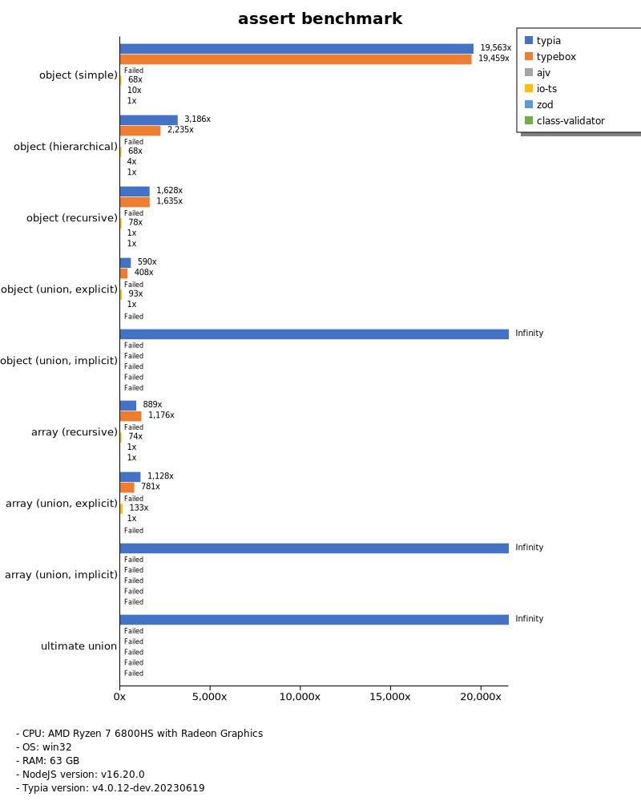
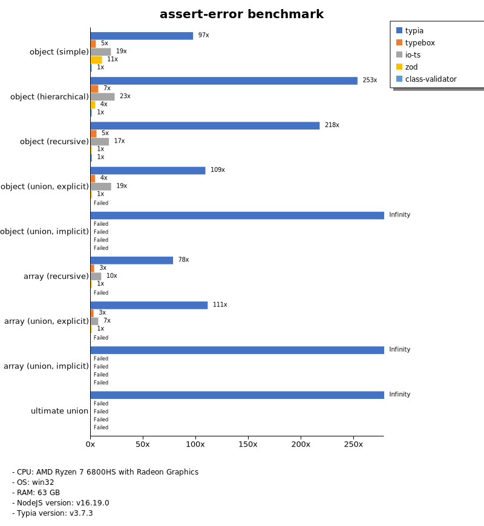
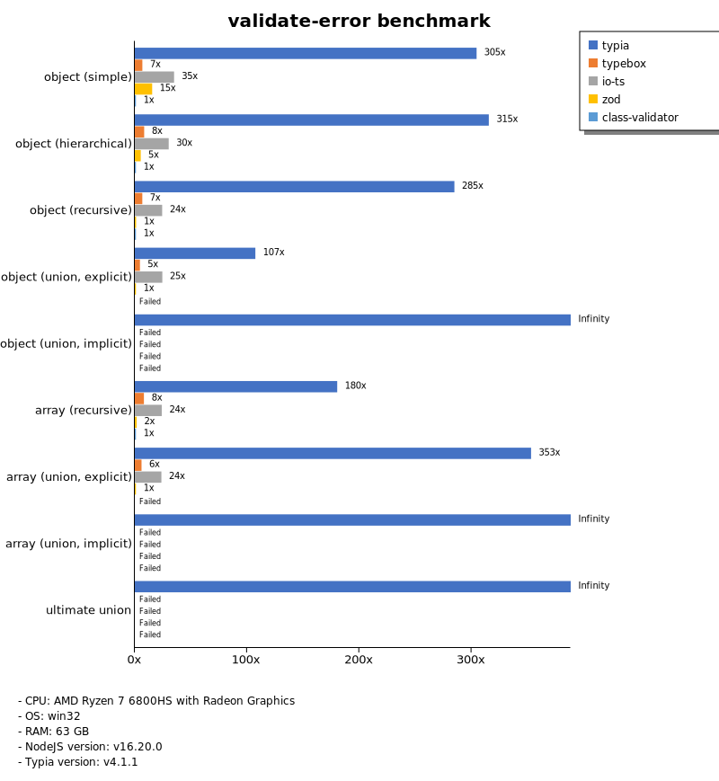
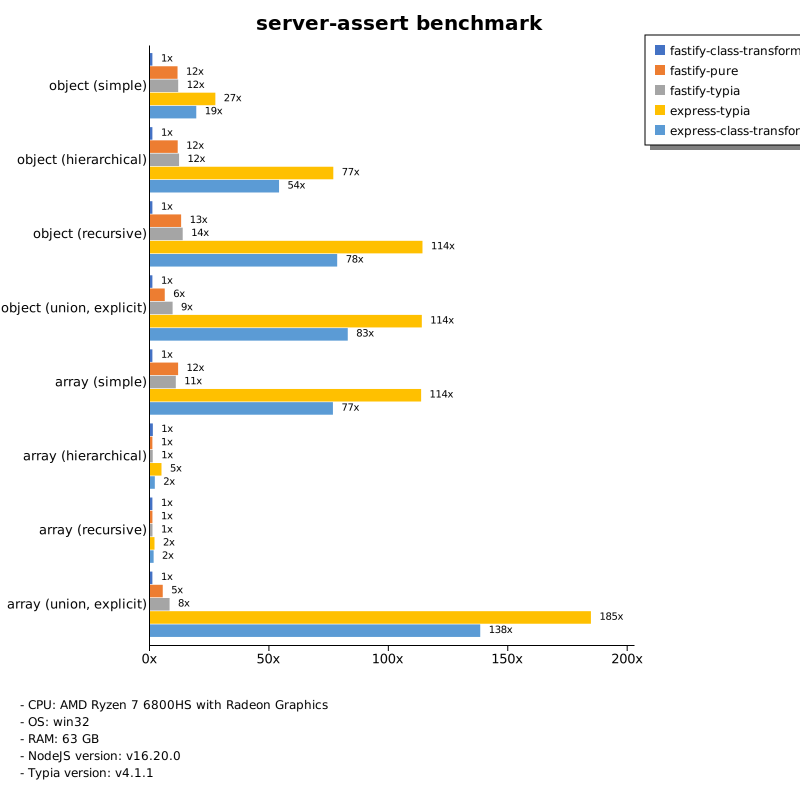
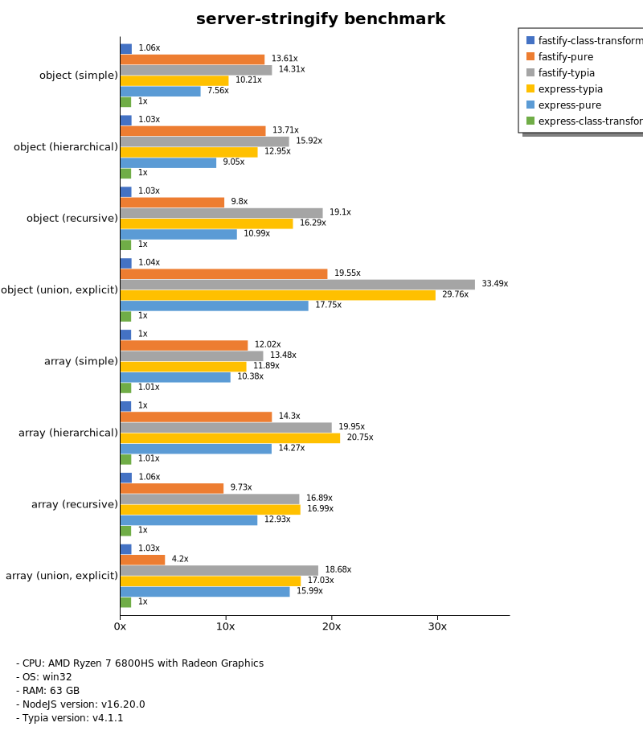
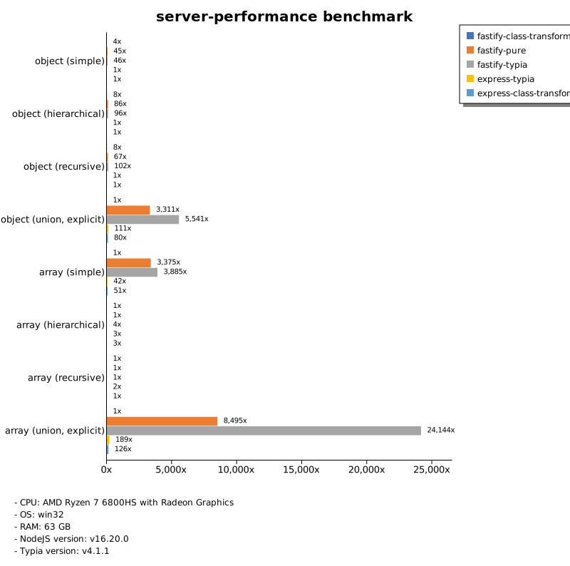

# Benchmark of `typia`
> - CPU: AMD Ryzen 7 6800HS with Radeon Graphics
> - Memory: 64,781 MB
> - OS: win32
> - NodeJS version: v16.20.1
> - Typia version: v4.1.8

## is

 Types | typia | typebox | ajv | io-ts | zod | class-validator 
-------|------|------|------|------|------|------
 object (simple) | 141,012 | 139,547 | 5,138 | 502 | 67 | 7.28 
 object (hierarchical) | 27,017 | 28,759 | 6,672 | 837 | 48 | 13 
 object (recursive) | 14,631 | 16,392 | 3,289 | 750 | 9.30 | 11 
 object (union, explicit) | 2,817 | 1,927 | 160 | 428 | 4.64 |  -  
 object (union, implicit) | 2,328 |  -  |  -  |  -  |  -  |  -  
 array (recursive) | 10,132 | 11,594 | 3,006 | 753 | 12 | 10 
 array (union, explicit) | 2,422 | 1,582 | 278 | 289 | 2.20 |  -  
 array (union, implicit) | 3,124 |  -  |  -  |  -  |  -  |  -  
 ultimate union | 790 |  -  |  -  |  -  |  -  |  -  

> Unit: Megabytes/sec

## assert

 Types | typia | typebox | ajv | io-ts | zod | class-validator 
-------|------|------|------|------|------|------
 object (simple) | 138,727 | 137,995 | 4,987 | 485 | 70 | 7.17 
 object (hierarchical) | 38,995 | 28,133 | 6,701 | 824 | 47 | 13 
 object (recursive) | 14,466 | 16,096 | 3,128 | 746 | 9.19 | 11 
 object (union, explicit) | 2,726 | 1,916 | 161 | 406 | 4.70 |  -  
 object (union, implicit) | 2,301 |  -  |  -  |  -  |  -  |  -  
 array (recursive) | 9,565 | 12,170 | 3,058 | 779 | 12 | 10 
 array (union, explicit) | 2,530 | 1,656 | 272 | 289 | 2.14 |  -  
 array (union, implicit) | 2,997 |  -  |  -  |  -  |  -  |  -  
 ultimate union | 779 |  -  |  -  |  -  |  -  |  -  

> Unit: Megabytes/sec

## validate

 Types | typia | typebox | ajv | io-ts | zod | class-validator 
-------|------|------|------|------|------|------
 object (simple) | 138,815 | 138,941 | 5,277 | 491 | 73 | 7.30 
 object (hierarchical) | 23,473 | 28,228 | 6,693 | 821 | 48 | 13 
 object (recursive) | 14,216 | 16,053 | 3,215 | 732 | 9.33 | 12 
 object (union, explicit) | 2,777 | 1,884 | 104 | 429 | 4.70 |  -  
 object (union, implicit) | 2,269 |  -  |  -  |  -  |  -  |  -  
 array (recursive) | 9,528 | 12,161 | 2,992 | 782 | 12 | 10 
 array (union, explicit) | 2,443 | 1,697 | 137 | 300 | 2.22 |  -  
 array (union, implicit) | 3,159 |  -  |  -  |  -  |  -  |  -  
 ultimate union | 794 |  -  |  -  |  -  |  -  |  -  

> Unit: Megabytes/sec

## assert-error

 Types | typia | typebox | io-ts | zod | class-validator 
-------|------|------|------|------|------
 object (simple) | 632 | 30 | 146 | 71 | 4.46 
 object (hierarchical) | 2,675 | 69 | 243 | 46 | 8.25 
 object (recursive) | 2,176 | 50 | 175 | 8.60 | 7.26 
 object (union, explicit) | 551 | 22 | 108 | 4.57 |  -  
 object (union, implicit) | 444 |  -  |  -  |  -  |  -  
 array (recursive) | 1,579 | 55 | 171 | 11 | 6.50 
 array (union, explicit) | 979 | 14 | 55 | 2.28 |  -  
 array (union, implicit) | 1,077 |  -  |  -  |  -  |  -  
 ultimate union | 254 |  -  |  -  |  -  |  -  

> Unit: Megabytes/sec

## validate-error

 Types | typia | typebox | io-ts | zod | class-validator 
-------|------|------|------|------|------
 object (simple) | 1,353 | 30 | 162 | 73 | 4.52 
 object (hierarchical) | 2,581 | 70 | 250 | 47 | 8.37 
 object (recursive) | 2,098 | 50 | 182 | 8.52 | 7.36 
 object (union, explicit) | 511 | 22 | 105 | 4.52 |  -  
 object (union, implicit) | 390 |  -  |  -  |  -  |  -  
 array (recursive) | 1,148 | 54 | 165 | 11 | 6.47 
 array (union, explicit) | 839 | 14 | 55 | 2.32 |  -  
 array (union, implicit) | 828 |  -  |  -  |  -  |  -  
 ultimate union | 208 |  -  |  -  |  -  |  -  

> Unit: Megabytes/sec

## optimizer

 Types | typia | typebox | ajv | class-validator 
-------|------|------|------|------
 object (simple) | 142,602 | 6.58 | 0.02 | 7.15 
 object (hierarchical) | 30,520 | 13 | 0.11 | 13 
 object (recursive) | 17,419 | 52 | 0.23 | 11 
 object (union, explicit) | 2,792 | 15 | 0.11 | 9.88 
 array (simple) | 13,105 | 159 | 0.30 | 24 
 array (hierarchical) | 25,619 | 1,216 | 5.16 | 19 
 array (recursive) | 12,793 | 592 | 2.26 | 10 
 array (union, explicit) | 5,356 | 145 | 0.72 | 23 

> Unit: Megabytes/sec

## stringify

 Types | typia.stringify | typia.isStringify | typia.assertStringify | fast-json-stringify | JSON.stringify | class-transformer 
-------|------|------|------|------|------|------
 object (simple) | 1,419 | 1,142 | 1,185 | 513 | 86 | 6.22 
 object (hierarchical) | 553 | 528 | 529 | 399 | 143 | 12 
 object (recursive) | 728 | 694 | 688 | 182 | 146 | 11 
 object (union, explicit) | 238 | 216 | 210 | 163 | 93 | 4.64 
 array (simple) | 273 | 261 | 261 | 402 | 175 | 11 
 array (hierarchical) | 372 | 364 | 363 | 540 | 157 | 9.39 
 array (recursive) | 330 | 313 | 304 | 579 | 152 | 10 
 array (union, explicit) | 276 | 260 | 258 | 61 | 193 | 8.72 

> Unit: Megabytes/sec

## server-assert

 Types | fastify-typia | fastify-pure | fastify-class-transformer | express-typia | express-class-transformer 
-------|------|------|------|------|------
 object (simple) | 58 | 58 | 5.26 | 41 | 5.02 
 object (hierarchical) | 122 | 118 | 9.99 | 112 | 9.69 
 object (recursive) | 120 | 113 | 8.58 | 109 | 7.81 
 object (union, explicit) | 78 | 51 | 3.37 | 73 | 3.38 
 array (simple) | 110 | 107 | 8.24 | 106 | 7.95 
 array (hierarchical) | 77 | 109 | 6.17 | 79 | 5.81 
 array (recursive) | 105 | 101 | 6.68 | 112 | 6.58 
 array (union, explicit) | 119 | 79 | 6.39 | 124 | 6.35 

> Unit: Megabytes/sec

## server-stringify

 Types | fastify-typia | fastify-pure | fastify-class-transformer | express-typia | express-pure | express-class-transformer 
-------|------|------|------|------|------|------
 object (simple) | 69 | 65 | 5.35 | 49 | 38 | 5.03 
 object (hierarchical) | 154 | 137 | 11 | 127 | 88 | 10 
 object (recursive) | 162 | 81 | 8.97 | 134 | 91 | 8.51 
 object (union, explicit) | 125 | 70 | 3.91 | 90 | 58 | 3.63 
 array (simple) | 118 | 99 | 9.30 | 109 | 94 | 9.42 
 array (hierarchical) | 166 | 90 | 8.08 | 157 | 111 | 7.91 
 array (recursive) | 130 | 74 | 8.29 | 129 | 105 | 8.28 
 array (union, explicit) | 134 | 32 | 7.68 | 130 | 124 | 7.66 

> Unit: Megabytes/sec

## server-performance

 Types | fastify-typia | fastify-pure | fastify-class-transformer | express-typia | express-class-transformer 
-------|------|------|------|------|------
 object (simple) | 80 | 79 | 6.44 | 54 | 9.20 
 object (hierarchical) | 140 | 127 | 13 | 114 | 18 
 object (recursive) | 126 | 79 | 9.71 | 109 | 15 
 object (union, explicit) | 86 | 55 | 3.11 | 72 | 3.04 
 array (simple) | 104 | 102 | 7.35 | 93 | 7.77 
 array (hierarchical) | 83 | 62 | 6.02 | 95 | 4.86 
 array (recursive) | 111 | 111 | 7.96 | 107 | 12 
 array (union, explicit) | 120 | 43 | 6.04 | 114 | 5.32 

> Unit: Megabytes/sec

Total elapsed time: 5,044,783 ms
