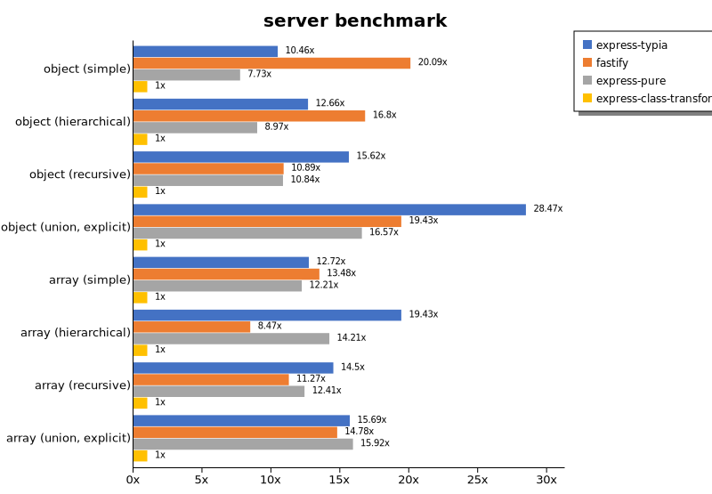

# Benchmark of `typia`
> - CPU: AMD Ryzen 7 6800HS with Radeon Graphics
> - Memory: 64,780 MB
> - OS: win32
> - NodeJS version: v16.19.0
> - Typia version: 3.7.2

## is

 Types | typia | typebox | ajv | io-ts | zod | class-validator 
-------|------|------|------|------|------|------
 object (simple) | 1,373,886 | 1,368,018 | 60,824 | 5,001 | 647 | 65 
 object (hierarchical) | 275,899 | 279,352 | 47,360 | 8,453 | 461 | 96 
 object (recursive) | 151,569 | 157,478 | 60,970 | 7,758 | 89 | 114 
 object (union, explicit) | 28,514 | 19,026 | 9,580 | 4,367 | 45 | 97 
 object (union, implicit) | 19,294 |  -  |  -  |  -  |  -  |  -  
 array (recursive) | 96,726 | 117,661 | 27,551 | 7,997 | 117 | 96 
 array (union, explicit) | 24,834 | 16,801 | 6,802 | 3,057 | 23 | 233 
 array (union, implicit) | 27,257 |  -  |  -  |  -  |  -  |  -  
 ultimate union | 8,266 |  -  |  -  |  -  |  -  |  -  

> Unit: Kilobytes/sec

## assert

 Types | typia | typebox | io-ts | zod | class-validator 
-------|------|------|------|------|------
 object (simple) | 58,221 | 380 | 2,316 | 686 | 64 
 object (hierarchical) | 87,685 | 729 | 3,623 | 451 | 93 
 object (recursive) | 69,830 | 570 | 2,513 | 91 | 114 
 object (union, explicit) | 7,727 | 213 | 1,539 | 46 | 96 
 object (union, implicit) | 9,617 |  -  |  -  |  -  | 114 
 array (recursive) | 28,474 | 604 | 2,675 | 118 | NaN 
 array (union, explicit) | 17,846 | 143 | 734 | 22 | 232 
 array (union, implicit) | 16,375 |  -  |  -  |  -  | 193 
 ultimate union | 3,794 |  -  |  -  |  -  |  -  

> Unit: Kilobytes/sec

## validate

 Types | typia | typebox | io-ts | zod | class-validator 
-------|------|------|------|------|------
 object (simple) | 14,942 | 354 | 2,372 | 711 | 67 
 object (hierarchical) | 34,435 | 749 | 3,592 | 466 | 100 
 object (recursive) | 25,286 | 575 | 2,524 | 92 | 114 
 object (union, explicit) | 6,037 | 219 | 1,590 | 46 | 97 
 object (union, implicit) | 6,290 |  -  |  -  |  -  | 117 
 array (recursive) | 16,344 | 609 | 2,606 | 119 | 94 
 array (union, explicit) | 13,632 | 149 | 650 | 20 | 215 
 array (union, implicit) | 11,727 |  -  |  -  |  -  | 187 
 ultimate union | 2,586 |  -  |  -  |  -  |  -  

> Unit: Kilobytes/sec

## optimizer

 Types | typia | typebox | ajv | class-validator 
-------|------|------|------|------
 object (simple) | 1,319,842 | 72 | 1 | 66 
 object (hierarchical) | 310,897 | 135 | 4 | 97 
 object (recursive) | 172,811 | 751 | 10 | 113 
 object (union, explicit) | 29,116 | 157 | 5 | 99 
 array (simple) | 122,151 | 1,701 | 32 | 227 
 array (hierarchical) | 260,470 | 5,713 | 262 | 186 
 array (recursive) | 127,893 | 8,632 | 106 | 91 
 array (union, explicit) | 57,048 | 1,559 | 39 | 224 

> Unit: Kilobytes/sec

## stringify

 Types | typia.stringify | typia.isStringify | typia.assertStringify | fast-json-stringify | JSON.stringify | class-transformer 
-------|------|------|------|------|------|------
 object (simple) | 13,629 | 10,130 | 6,414 | 4,363 | 836 | 57 
 object (hierarchical) | 5,603 | 5,321 | 4,713 | 6,729 | 1,355 | 123 
 object (recursive) | 7,089 | 6,694 | 6,579 | 1,350 | 1,412 | 108 
 object (union, explicit) | 2,355 | 2,047 | 1,686 | 1,640 | 875 | 46 
 array (simple) | 2,661 | 2,512 | 2,295 | 4,023 | 1,835 | 118 
 array (hierarchical) | 3,440 | 3,448 | 3,125 | 5,715 | 1,631 | 106 
 array (recursive) | 3,062 | 2,992 | 2,815 | 1,483 | 1,514 | 106 
 array (union, explicit) | 2,632 | 2,404 | 2,359 | 1,751 | 1,908 | 92 

> Unit: Kilobytes/sec

## server

 Types | express-typia | fastify | express-pure | express-class-transformer 
-------|------|------|------|------
 object (simple) | 61 | 117 | 45 | 5 
 object (hierarchical) | 146 | 194 | 103 | 11 
 object (recursive) | 154 | 107 | 107 | 9 
 object (union, explicit) | 123 | 84 | 72 | 4 
 array (simple) | 134 | 142 | 129 | 10 
 array (hierarchical) | 168 | 73 | 123 | 8 
 array (recursive) | 140 | 109 | 120 | 9 
 array (union, explicit) | 134 | 126 | 136 | 8 

> Unit: Kilobytes/sec

Total elapsed time: 1,511,983 ms
