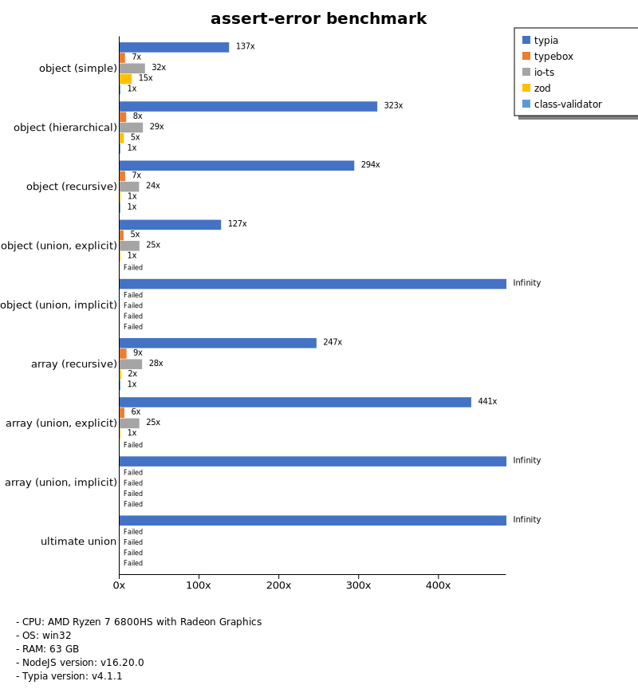

# Benchmark of `typia`
> - CPU: AMD Ryzen 7 6800HS with Radeon Graphics
> - Memory: 64,780 MB
> - OS: win32
> - NodeJS version: v16.19.0
> - Typia version: v3.7.3

## is

 Types | typia | typebox | ajv | io-ts | zod | class-validator 
-------|------|------|------|------|------|------
 object (simple) | 1,336,957 | 1,311,578 | 64,693 | 5,179 | 673 | 64 
 object (hierarchical) | 268,145 | 279,146 | 51,568 | 8,362 | 449 | 98 
 object (recursive) | 152,893 | 153,391 | 56,748 | 7,779 | 92 | 106 
 object (union, explicit) | 27,216 | 19,409 | 9,846 | 4,379 | 45 |  -  
 object (union, implicit) | 20,621 |  -  |  -  |  -  |  -  |  -  
 array (recursive) | 100,511 | 117,415 | 28,173 | 7,918 | 117 |  -  
 array (union, explicit) | 24,208 | 16,382 | 6,814 | 2,931 | 22 |  -  
 array (union, implicit) | 30,627 |  -  |  -  |  -  |  -  |  -  
 ultimate union | 8,095 |  -  |  -  |  -  |  -  |  -  

> Unit: Kilobytes/sec

## assert

 Types | typia | typebox | io-ts | zod | class-validator 
-------|------|------|------|------|------
 object (simple) | 1,317,336 | 1,323,300 | 4,888 | 677 | 64 
 object (hierarchical) | 271,109 | 279,921 | 8,349 | 465 | 98 
 object (recursive) | 137,108 | 158,127 | 7,536 | 92 | 112 
 object (union, explicit) | 26,715 | 18,871 | 4,366 | 46 |  -  
 object (union, implicit) | 24,841 |  -  |  -  |  -  |  -  
 array (recursive) | 94,935 | 121,161 | 8,090 | 121 |  -  
 array (union, explicit) | 24,217 | 16,503 | 2,971 | 23 |  -  
 array (union, implicit) | 30,225 |  -  |  -  |  -  |  -  
 ultimate union | 7,682 |  -  |  -  |  -  |  -  

> Unit: Kilobytes/sec

## validate

 Types | typia | typebox | io-ts | zod | class-validator 
-------|------|------|------|------|------
 object (simple) | 1,320,516 | 1,355,588 | 5,081 | 716 | 65 
 object (hierarchical) | 183,883 | 270,967 | 8,320 | 456 | 101 
 object (recursive) | 133,584 | 157,713 | 7,657 | 87 | 113 
 object (union, explicit) | 26,500 | 19,214 | 4,330 | 45 |  -  
 object (union, implicit) | 22,794 |  -  |  -  |  -  |  -  
 array (recursive) | 97,661 | 117,773 | 7,782 | 116 |  -  
 array (union, explicit) | 24,204 | 16,202 | 2,972 | 23 |  -  
 array (union, implicit) | 28,534 |  -  |  -  |  -  |  -  
 ultimate union | 7,686 |  -  |  -  |  -  |  -  

> Unit: Kilobytes/sec

## assert-error

 Types | typia | typebox | io-ts | zod | class-validator 
-------|------|------|------|------|------
 object (simple) | 6,372 | 315 | 1,255 | 698 | 65 
 object (hierarchical) | 26,994 | 761 | 2,417 | 448 | 106 
 object (recursive) | 22,056 | 553 | 1,749 | 101 | 118 
 object (union, explicit) | 6,089 | 230 | 1,082 | 55 |  -  
 object (union, implicit) | 4,514 |  -  |  -  |  -  |  -  
 array (recursive) | 14,558 | 604 | 1,847 | 186 |  -  
 array (union, explicit) | 9,914 | 239 | 636 | 89 |  -  
 array (union, implicit) | 10,972 |  -  |  -  |  -  |  -  
 ultimate union | 2,595 |  -  |  -  |  -  |  -  

> Unit: Kilobytes/sec

## validate-error

 Types | typia | typebox | io-ts | zod | class-validator 
-------|------|------|------|------|------
 object (simple) | 13,440 | 316 | 1,590 | 706 | 66 
 object (hierarchical) | 25,776 | 743 | 2,501 | 454 | 107 
 object (recursive) | 20,482 | 569 | 1,809 | 101 | 118 
 object (union, explicit) | 5,172 | 212 | 1,093 | 56 |  -  
 object (union, implicit) | 3,639 |  -  |  -  |  -  |  -  
 array (recursive) | 11,790 | 613 | 1,806 | 183 |  -  
 array (union, explicit) | 8,548 | 241 | 633 | 86 |  -  
 array (union, implicit) | 8,165 |  -  |  -  |  -  |  -  
 ultimate union | 2,041 |  -  |  -  |  -  |  -  

> Unit: Kilobytes/sec

## optimizer

 Types | typia | typebox | ajv | class-validator 
-------|------|------|------|------
 object (simple) | 1,360,007 | 70 | 1 | 67 
 object (hierarchical) | 318,319 | 136 | 5 | 95 
 object (recursive) | 173,622 | 794 | 10 | 114 
 object (union, explicit) | 29,238 | 164 | 5 | 100 
 array (simple) | 120,290 | 481 | 11 | 239 
 array (hierarchical) | 233,773 | 13,974 | 92 | 195 
 array (recursive) | 151,263 | 8,503 | 106 | 97 
 array (union, explicit) | 55,641 | 1,567 | 39 | 237 

> Unit: Kilobytes/sec

## stringify

 Types | typia.stringify | typia.isStringify | typia.assertStringify | fast-json-stringify | JSON.stringify | class-transformer 
-------|------|------|------|------|------|------
 object (simple) | 13,675 | 10,002 | 8,345 | 4,740 | 851 | 61 
 object (hierarchical) | 5,571 | 5,396 | 5,232 | 6,508 | 1,393 | 122 
 object (recursive) | 7,130 | 6,699 | 6,781 | 1,379 | 1,408 | 106 
 object (union, explicit) | 2,325 | 2,058 | 2,063 | 1,620 | 928 | 47 
 array (simple) | 2,697 | 2,440 | 2,486 | 4,022 | 1,843 | 118 
 array (hierarchical) | 3,557 | 3,487 | 3,559 | 5,372 | 1,627 | 97 
 array (recursive) | 3,139 | 3,084 | 3,047 | 1,530 | 1,477 | 104 
 array (union, explicit) | 2,799 | 2,513 | 2,548 | 1,773 | 1,938 | 92 

> Unit: Kilobytes/sec

## server

 Types | express-typia | fastify | express-pure | express-class-transformer 
-------|------|------|------|------
 object (simple) | 60 | 111 | 45 | 5 
 object (hierarchical) | 140 | 197 | 103 | 11 
 object (recursive) | 155 | 106 | 107 | 9 
 object (union, explicit) | 121 | 82 | 74 | 4 
 array (simple) | 130 | 135 | 125 | 10 
 array (hierarchical) | 156 | 81 | 118 | 8 
 array (recursive) | 138 | 106 | 115 | 8 
 array (union, explicit) | 137 | 127 | 133 | 7 

> Unit: Kilobytes/sec

Total elapsed time: 1,772,859 ms
