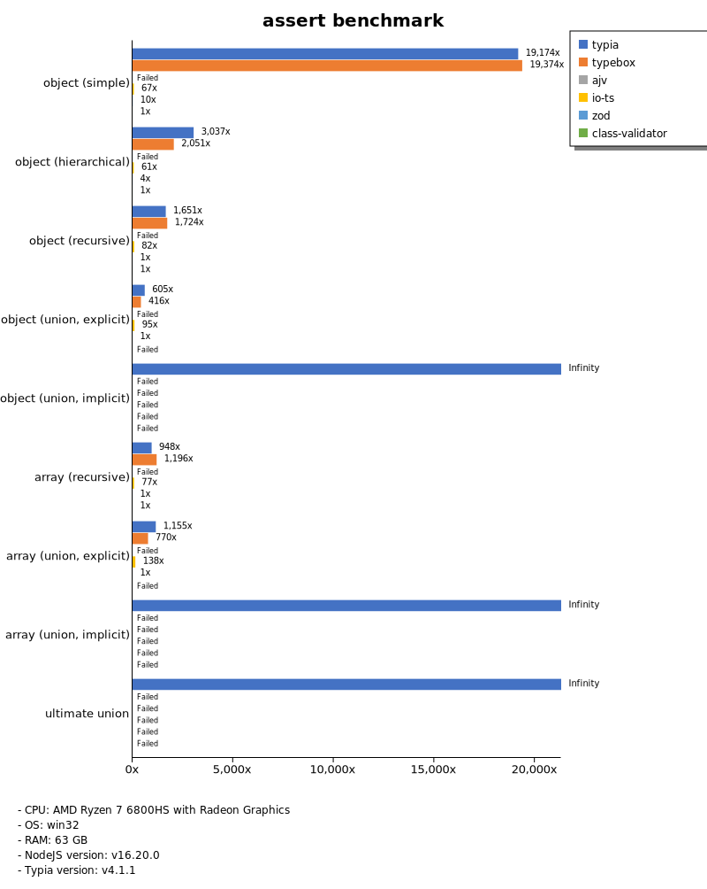

# Benchmark of `typia`
> - CPU: AMD Ryzen 7 6800HS with Radeon Graphics
> - Memory: 64,781 MB
> - OS: win32
> - NodeJS version: v16.20.0
> - Typia version: v4.1.1

## is

 Types | typia | typebox | ajv | io-ts | zod | class-validator 
-------|------|------|------|------|------|------
 object (simple) | 141,919 | 141,871 | 5,015 | 513 | 69 | 7.31 
 object (hierarchical) | 27,367 | 29,232 | 6,810 | 856 | 47 | 13 
 object (recursive) | 14,915 | 16,282 | 3,201 | 761 | 9.46 | 12 
 object (union, explicit) | 2,922 | 1,860 | 159 | 386 | 4.18 |  -  
 object (union, implicit) | 1,944 |  -  |  -  |  -  |  -  |  -  
 array (recursive) | 11,024 | 12,570 | 3,137 | 801 | 12 | 10 
 array (union, explicit) | 2,522 | 1,754 | 288 | 308 | 2.23 |  -  
 array (union, implicit) | 3,301 |  -  |  -  |  -  |  -  |  -  
 ultimate union | 833 |  -  |  -  |  -  |  -  |  -  

> Unit: Megabytes/sec

## assert

 Types | typia | typebox | ajv | io-ts | zod | class-validator 
-------|------|------|------|------|------|------
 object (simple) | 142,454 | 143,938 |  -  | 495 | 71 | 7.43 
 object (hierarchical) | 41,297 | 27,888 |  -  | 831 | 48 | 14 
 object (recursive) | 15,784 | 16,484 |  -  | 782 | 9.56 | 12 
 object (union, explicit) | 2,818 | 1,939 |  -  | 442 | 4.66 |  -  
 object (union, implicit) | 2,319 |  -  |  -  |  -  |  -  |  -  
 array (recursive) | 10,001 | 12,617 |  -  | 813 | 12 | 11 
 array (union, explicit) | 2,579 | 1,718 |  -  | 308 | 2.23 |  -  
 array (union, implicit) | 3,236 |  -  |  -  |  -  |  -  |  -  
 ultimate union | 836 |  -  |  -  |  -  |  -  |  -  

> Unit: Megabytes/sec

## validate

 Types | typia | typebox | ajv | io-ts | zod | class-validator 
-------|------|------|------|------|------|------
 object (simple) | 143,859 | 142,723 |  -  | 521 | 76 | 7.60 
 object (hierarchical) | 24,558 | 29,336 |  -  | 856 | 47 | 13 
 object (recursive) | 15,917 | 16,117 |  -  | 775 | 9.65 | 12 
 object (union, explicit) | 2,828 | 1,918 |  -  | 434 | 4.61 |  -  
 object (union, implicit) | 2,438 |  -  |  -  |  -  |  -  |  -  
 array (recursive) | 9,662 | 12,115 |  -  | 794 | 12 | 10 
 array (union, explicit) | 2,583 | 1,726 |  -  | 303 | 2.22 |  -  
 array (union, implicit) | 3,210 |  -  |  -  |  -  |  -  |  -  
 ultimate union | 842 |  -  |  -  |  -  |  -  |  -  

> Unit: Megabytes/sec

## assert-error

 Types | typia | typebox | io-ts | zod | class-validator 
-------|------|------|------|------|------
 object (simple) | 636 | 31 | 147 | 71 | 4.64 
 object (hierarchical) | 2,760 | 70 | 249 | 46 | 8.55 
 object (recursive) | 2,206 | 51 | 183 | 8.82 | 7.50 
 object (union, explicit) | 567 | 22 | 111 | 4.46 |  -  
 object (union, implicit) | 450 |  -  |  -  |  -  |  -  
 array (recursive) | 1,601 | 56 | 183 | 11 | 6.49 
 array (union, explicit) | 1,001 | 14 | 56 | 2.27 |  -  
 array (union, implicit) | 1,133 |  -  |  -  |  -  |  -  
 ultimate union | 271 |  -  |  -  |  -  |  -  

> Unit: Megabytes/sec

## validate-error

 Types | typia | typebox | io-ts | zod | class-validator 
-------|------|------|------|------|------
 object (simple) | 1,374 | 32 | 165 | 71 | 4.56 
 object (hierarchical) | 2,688 | 70 | 259 | 47 | 8.44 
 object (recursive) | 2,153 | 50 | 180 | 8.77 | 7.47 
 object (union, explicit) | 517 | 22 | 112 | 4.46 |  -  
 object (union, implicit) | 396 |  -  |  -  |  -  |  -  
 array (recursive) | 1,320 | 55 | 178 | 11 | 6.51 
 array (union, explicit) | 861 | 14 | 57 | 2.35 |  -  
 array (union, implicit) | 869 |  -  |  -  |  -  |  -  
 ultimate union | 223 |  -  |  -  |  -  |  -  

> Unit: Megabytes/sec

## optimizer

 Types | typia | typebox | ajv | class-validator 
-------|------|------|------|------
 object (simple) | 143,725 | 6.81 | 0.02 | 7.30 
 object (hierarchical) | 30,522 | 13 | 0.11 | 14 
 object (recursive) | 17,969 | 53 | 0.23 | 12 
 object (union, explicit) | 2,875 | 16 | 0.12 | 9.89 
 array (simple) | 13,422 | 142 | 0.25 | 24 
 array (hierarchical) | 26,599 | 778 | 5.25 | 19 
 array (recursive) | 12,782 | 622 | 2.37 | 10 
 array (union, explicit) | 5,603 | 151 | 0.74 | 23 

> Unit: Megabytes/sec

## stringify

 Types | typia.stringify | typia.isStringify | typia.assertStringify | fast-json-stringify | JSON.stringify | class-transformer 
-------|------|------|------|------|------|------
 object (simple) | 1,443 | 1,173 | 1,182 | 504 | 85 | 6.49 
 object (hierarchical) | 573 | 546 | 543 | 416 | 141 | 13 
 object (recursive) | 728 | 699 | 698 | 197 | 145 | 11 
 object (union, explicit) | 247 | 224 | 218 | 167 | 94 | 4.80 
 array (simple) | 282 | 270 | 266 | 420 | 172 | 12 
 array (hierarchical) | 388 | 386 | 380 | 575 | 159 | 9.41 
 array (recursive) | 338 | 327 | 326 | 622 | 153 | 10 
 array (union, explicit) | 281 | 264 | 269 | 61 | 195 | 8.77 

> Unit: Megabytes/sec

## server-assert

 Types | fastify-class-transformer | fastify-pure | fastify-typia | express-typia | express-class-transformer 
-------|------|------|------|------|------
 object (simple) | 0.05 | 0.58 | 0.60 | 1.38 | 0.98 
 object (hierarchical) | 0.02 | 0.18 | 0.18 | 1.16 | 0.82 
 object (recursive) | 0.01 | 0.13 | 0.13 | 1.10 | 0.76 
 object (union, explicit) | 0.01 | 0.06 | 0.09 | 1.08 | 0.79 
 array (simple) | 0.01 | 0.08 | 0.07 | 0.79 | 0.53 
 array (hierarchical) | 0.03 | 0.03 | 0.03 | 0.13 | 0.06 
 array (recursive) | 0.19 | 0.19 | 0.19 | 0.35 | 0.28 
 array (union, explicit) | 0.00 | 0.01 | 0.02 | 0.48 | 0.36 

> Unit: Megabytes/sec

## server-stringify

 Types | fastify-class-transformer | fastify-pure | fastify-typia | express-typia | express-pure | express-class-transformer 
-------|------|------|------|------|------|------
 object (simple) | 5.72 | 74 | 78 | 55 | 41 | 5.42 
 object (hierarchical) | 11 | 148 | 172 | 140 | 98 | 11 
 object (recursive) | 9.52 | 91 | 177 | 151 | 102 | 9.27 
 object (union, explicit) | 4.16 | 79 | 135 | 120 | 71 | 4.02 
 array (simple) | 9.65 | 116 | 130 | 115 | 100 | 9.73 
 array (hierarchical) | 8.21 | 117 | 164 | 170 | 117 | 8.31 
 array (recursive) | 8.66 | 80 | 138 | 139 | 106 | 8.19 
 array (union, explicit) | 8.14 | 33 | 148 | 135 | 127 | 7.94 

> Unit: Megabytes/sec

## server-performance

 Types | fastify-class-transformer | fastify-pure | fastify-typia | express-typia | express-class-transformer 
-------|------|------|------|------|------
 object (simple) | 3.59 | 44 | 45 | 1.36 | 0.98 
 object (hierarchical) | 6.76 | 70 | 78 | 1.15 | 0.81 
 object (recursive) | 6.05 | 50 | 76 | 1.09 | 0.74 
 object (union, explicit) | 0.01 | 31 | 52 | 1.04 | 0.75 
 array (simple) | 0.02 | 56 | 64 | 0.70 | 0.84 
 array (hierarchical) | 0.03 | 0.03 | 0.13 | 0.10 | 0.08 
 array (recursive) | 0.19 | 0.19 | 0.18 | 0.33 | 0.26 
 array (union, explicit) | 0.00 | 22 | 64 | 0.50 | 0.33 

> Unit: Megabytes/sec

Total elapsed time: 3,632,259 ms
