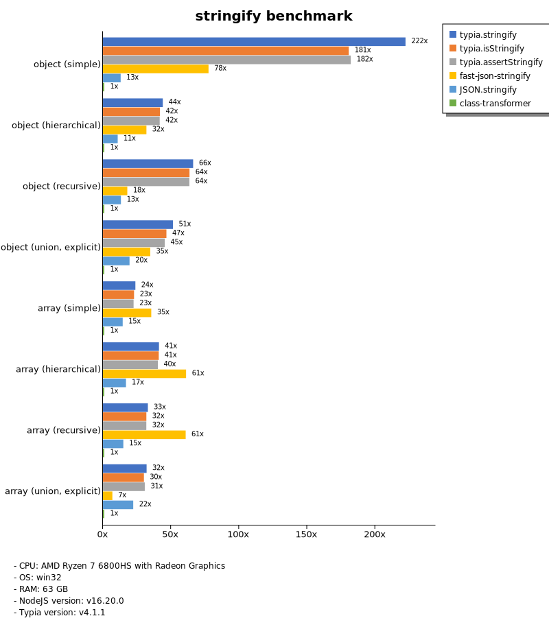

# Benchmark of `typia`
> - CPU: AMD Ryzen 7 6800HS with Radeon Graphics
> - Memory: 64,780 MB
> - OS: win32
> - NodeJS version: v16.20.0
> - Typia version: v3.8.6

## is

 Types | typia | typebox | ajv | io-ts | zod | class-validator 
-------|------|------|------|------|------|------
 object (simple) | 96,927 | 95,284 | 4,520 | 345 | 48 | 4.73 
 object (hierarchical) | 19,429 | 20,360 | 3,179 | 572 | 33 | 8.87 
 object (recursive) | 11,153 | 11,521 | 4,267 | 515 | 6.58 | 8.34 
 object (union, explicit) | 1,790 | 1,347 | 732 | 305 | 3.33 |  -  
 object (union, implicit) | 1,420 |  -  |  -  |  -  |  -  |  -  
 array (recursive) | 6,823 | 8,796 | 2,059 | 571 | 8.68 |  -  
 array (union, explicit) | 1,791 | 1,229 | 479 | 204 | 1.53 |  -  
 array (union, implicit) | 2,288 |  -  |  -  |  -  |  -  |  -  
 ultimate union | 664 |  -  |  -  |  -  |  -  |  -  

> Unit: Metabytes/sec

## assert

 Types | typia | typebox | io-ts | zod | class-validator 
-------|------|------|------|------|------
 object (simple) | 94,216 | 96,640 | 352 | 50 | 4.86 
 object (hierarchical) | 18,551 | 19,445 | 578 | 34 | 8.67 
 object (recursive) | 10,627 | 11,302 | 514 | 6.22 | 7.95 
 object (union, explicit) | 1,606 | 1,334 | 311 | 3.19 |  -  
 object (union, implicit) | 1,558 |  -  |  -  |  -  |  -  
 array (recursive) | 6,746 | 8,745 | 569 | 8.72 |  -  
 array (union, explicit) | 1,783 | 1,213 | 211 | 1.58 |  -  
 array (union, implicit) | 2,308 |  -  |  -  |  -  |  -  
 ultimate union | 663 |  -  |  -  |  -  |  -  

> Unit: Metabytes/sec

## validate

 Types | typia | typebox | io-ts | zod | class-validator 
-------|------|------|------|------|------
 object (simple) | 93,665 | 97,051 | 342 | 52 | 4.97 
 object (hierarchical) | 12,071 | 19,454 | 553 | 34 | 8.61 
 object (recursive) | 9,456 | 11,412 | 521 | 6.51 | 7.91 
 object (union, explicit) | 1,612 | 1,318 | 308 | 3.33 |  -  
 object (union, implicit) | 1,393 |  -  |  -  |  -  |  -  
 array (recursive) | 6,740 | 8,509 | 538 | 8.37 |  -  
 array (union, explicit) | 1,778 | 1,172 | 214 | 1.60 |  -  
 array (union, implicit) | 2,266 |  -  |  -  |  -  |  -  
 ultimate union | 647 |  -  |  -  |  -  |  -  

> Unit: Metabytes/sec

## assert-error

 Types | typia | typebox | io-ts | zod | class-validator 
-------|------|------|------|------|------
 object (simple) | 445 | 22 | 103 | 50 | 4.91 
 object (hierarchical) | 1,912 | 51 | 171 | 31 | 8.87 
 object (recursive) | 1,496 | 39 | 125 | 6.11 | 8.03 
 object (union, explicit) | 417 | 14 | 77 | 3.26 |  -  
 object (union, implicit) | 316 |  -  |  -  |  -  |  -  
 array (recursive) | 996 | 39 | 120 | 8.20 |  -  
 array (union, explicit) | 699 | 10 | 38 | 1.59 |  -  
 array (union, implicit) | 780 |  -  |  -  |  -  |  -  
 ultimate union | 195 |  -  |  -  |  -  |  -  

> Unit: Metabytes/sec

## validate-error

 Types | typia | typebox | io-ts | zod | class-validator 
-------|------|------|------|------|------
 object (simple) | 948 | 23 | 115 | 49 | 5.11 
 object (hierarchical) | 1,815 | 53 | 176 | 34 | 9.03 
 object (recursive) | 1,489 | 38 | 127 | 6.19 | 8.37 
 object (union, explicit) | 359 | 15 | 79 | 3.25 |  -  
 object (union, implicit) | 268 |  -  |  -  |  -  |  -  
 array (recursive) | 833 | 39 | 111 | 8.06 |  -  
 array (union, explicit) | 578 | 9.99 | 38 | 1.62 |  -  
 array (union, implicit) | 587 |  -  |  -  |  -  |  -  
 ultimate union | 143 |  -  |  -  |  -  |  -  

> Unit: Metabytes/sec

## optimizer

 Types | typia | typebox | ajv | class-validator 
-------|------|------|------|------
 object (simple) | 96,634 | 4.74 | 0.07 | 5.10 
 object (hierarchical) | 21,397 | 9.34 | 0.36 | 9.14 
 object (recursive) | 12,568 | 52 | 0.72 | 8.56 
 object (union, explicit) | 1,769 | 11 | 0.41 | 6.63 
 array (simple) | 9,034 | 86 | 0.74 | 17 
 array (hierarchical) | 16,773 | 1,050 | 12 | 13 
 array (recursive) | 8,963 | 574 | 7.24 | 6.71 
 array (union, explicit) | 3,637 | 107 | 2.82 | 16 

> Unit: Metabytes/sec

## stringify

 Types | typia.stringify | typia.isStringify | typia.assertStringify | fast-json-stringify | JSON.stringify | class-transformer 
-------|------|------|------|------|------|------
 object (simple) | 913 | 725 | 574 | 361 | 59 | 4.48 
 object (hierarchical) | 397 | 358 | 363 | 274 | 101 | 8.82 
 object (recursive) | 516 | 502 | 479 | 100 | 100 | 7.68 
 object (union, explicit) | 174 | 154 | 152 | 115 | 65 | 3.26 
 array (simple) | 195 | 184 | 186 | 281 | 124 | 7.68 
 array (hierarchical) | 268 | 260 | 261 | 399 | 112 | 6.39 
 array (recursive) | 232 | 224 | 225 | 108 | 108 | 7.11 
 array (union, explicit) | 194 | 192 | 183 | 127 | 140 | 6.22 

> Unit: Metabytes/sec

## server

 Types | fastify-class-transformer | fastify-pure | fastify-typia | express-typia | express-pure | express-class-transformer 
-------|------|------|------|------|------|------
 object (simple) | 3.98 | 63 | 67 | 38 | 29 | 3.75 
 object (hierarchical) | 8.06 | 109 | 127 | 86 | 66 | 7.58 
 object (recursive) | 6.85 | 71 | 130 | 101 | 71 | 6.79 
 object (union, explicit) | 2.99 | 55 | 89 | 79 | 46 | 2.94 
 array (simple) | 7.18 | 81 | 88 | 74 | 74 | 7.38 
 array (hierarchical) | 5.97 | 52 | 129 | 128 | 83 | 5.71 
 array (recursive) | 6.55 | 75 | 106 | 108 | 78 | 6.52 
 array (union, explicit) | 5.64 | 84 | 101 | 98 | 93 | 5.93 

> Unit: Metabytes/sec

Total elapsed time: 2,119,551 ms
