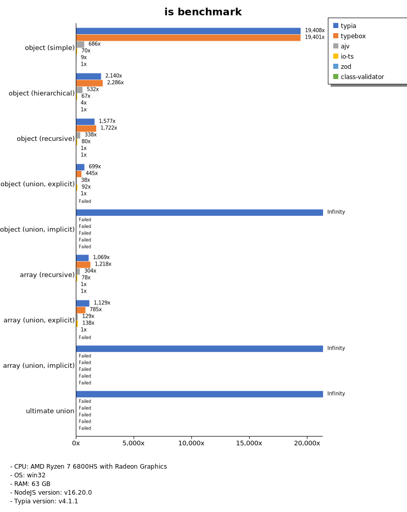
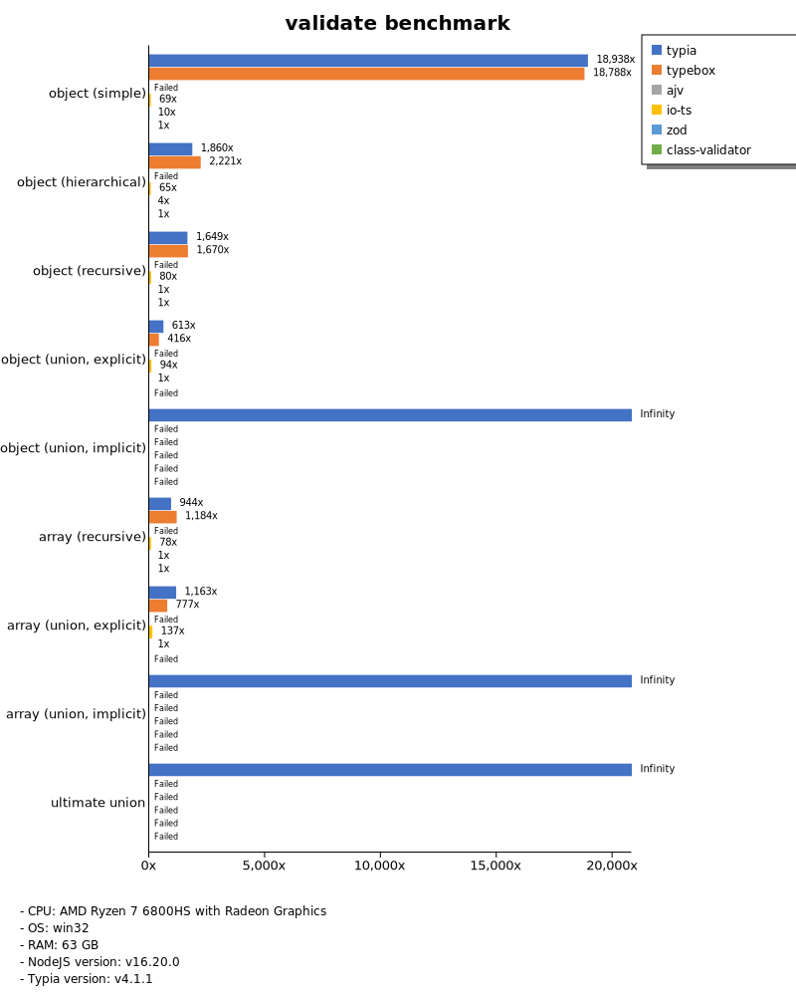

# Benchmark of `typia`
> - CPU: AMD Ryzen 7 6800HS with Radeon Graphics
> - Memory: 64,780 MB
> - OS: win32
> - Typia version: 3.5.0

## is

 Components | typia | typebox | ajv | io-ts | zod | class-validator 
------------|-------|---------|-----|-------|-----|-----------------
object (simple) | 275035.67184768355 | 44738.16257237738 | 65624.22766228292 | 4151.396639972971 | 521.9978253865979 | 18.06297322877231
object (hierarchical) | 179955.6194745016 | 118812.73080406913 | 45707.84172194693 | 8385.069236354417 | 402.0325436007058 | 35.17144097222222
object (recursive) | 120472.43097040066 | 86661.83077173104 | 45964.25197090377 | 6015.897614512792 | 85.03397395101825 | 29.309905485544853
object (union, explicit) | 25654.42810173624 | 12535.156250000002 | 9940.611969672804 | 3785.9781474967276 | 40.79695636507346 | 92.56408339912689
object (union, implicit) | 30783.22274794601 | Failed | Failed | Failed | Failed | Failed
array (recursive) | 105744.50224818074 | 84723.87304032333 | 28451.198055338784 | 5907.793938984882 | 110.80154894814542 | 31.146052170868344
array (union, explicit) | 30968.12254332935 | 10927.769183168317 | 6447.499033177873 | 2911.474395216557 | 23.104275591634565 | 203.11893771681576
array (union, implicit) | 19067.810047187442 | Failed | Failed | Failed | Failed | Failed
ultimate union | 7435.861883600917 | Failed | Failed | Failed | Failed | Failed

 Unit: kilobytes/sec 

## assert (iterate)

 Components | typia | typebox | io-ts | zod | class-validator 
------------|-------|---------|-------|-----|-----------------
object (simple) | 51043.16592330066 | 432.7695524676906 | 1798.1277424617465 | 473.2557920757688 | 14.850557894618024
object (hierarchical) | 60637.22386853448 | 790.055133193911 | 3629.786579915575 | 365.6235327982472 | 32.699177439953395
object (recursive) | 60992.545871559625 | 432.35810685893875 | 2126.2301804264625 | 83.34481175390266 | 29.024515287099177
object (union, explicit) | 8481.174321740713 | 169.7312083729781 | 1351.0656524122805 | 40.348101265822784 | 90.38189287040476
object (union, implicit) | 10714.896498103959 | Failed | Failed | Failed | Failed
array (recursive) | 30121.534916392542 | 485.0303418097754 | 2183.250351592296 | 112.26089545964125 | Failed
array (union, explicit) | 20281.488606407933 | 151.70583567148566 | 675.8623543432204 | 23.515187324929972 | 204.68023354253205
array (union, implicit) | 13835.539435886285 | Failed | Failed | Failed | Failed
ultimate union | 3956.950917214606 | Failed | Failed | Failed | Failed

 Unit: kilobytes/sec 

## assert (throw)

 Components | typia | typebox | io-ts | zod | class-validator 
------------|-------|---------|-------|-----|-----------------
object (simple) | 6631.8620274814475 | 392.5942754272326 | 1675.546223722363 | Failed | 16.136343980627306
object (hierarchical) | 29520.159896220714 | 774.014526729414 | 3324.362583364644 | 411.88325880148034 | 45.75355009820939
object (recursive) | 7702.027929330439 | Failed | Failed | Failed | 103.35838643865762
object (union, explicit) | 6545.152856721153 | 156.88557836169815 | 1302.3436764913436 | 58.1792482545774 | 98.09017627455566
object (union, implicit) | 7731.513881189949 | Failed | Failed | Failed | Failed
array (recursive) | 26291.082233223322 | 601.3863841298468 | 2089.0105243375306 | 182.43270966683082 | 125.09143596668919
array (union, explicit) | 3450.767115542763 | 127.45680130308 | 506.2290761853058 | 86.26563078204022 | 252.566077555074
array (union, implicit) | 1628.4073385341076 | Failed | Failed | Failed | Failed
ultimate union | 3758.81491482569 | Failed | Failed | Failed | Failed

 Unit: kilobytes/sec 

## validate

 Components | typia | typebox | io-ts | zod | class-validator 
------------|-------|---------|-------|-----|-----------------
object (simple) | 13895.363903714036 | 421.25506612627987 | 1879.7420101111638 | 464.32869145656974 | 15.149279898741106
object (hierarchical) | 31169.98097324723 | 768.2350253093364 | 3536.370945190157 | 383.0987528184893 | 34.59696588366891
object (recursive) | 34357.71554208223 | 454.6249646026053 | 2248.2982709871285 | 88.49564091600153 | 29.138877562907734
object (union, explicit) | 6626.782737543989 | 165.79290343791092 | 1400.4773898781632 | 40.46452236333518 | 92.14691179218838
object (union, implicit) | 7390.353880307566 | 210.53243598335214 | 542.0712899675626 | 29.12112691001698 | Failed
array (recursive) | 19556.97347606287 | 494.6226674065201 | 2301.6964212191797 | 113.03867378910667 | 24.94108462761976
array (union, explicit) | 15984.886177753544 | 147.8634220825427 | 659.8812346640241 | 23.597251400560225 | 213.41143389941828
array (union, implicit) | 11345.30906404618 | 132.25762655836797 | 620.4762747875354 | 19.80852335417433 | Failed
ultimate union | 2778.1761068868013 | Failed | Failed | Failed | Failed

 Unit: kilobytes/sec 

## equals

 Components | typia | typebox 
------------|-------|---------
object (simple) | 20507.578125 | 7881.837558799114
object (hierarchical) | 42707.201783517135 | 14741.406658137821
object (recursive) | 36757.60590213679 | 13787.12819052229
object (union, explicit) | 12068.39247881356 | 3836.345680368041
object (union, implicit) | 6197.0596144059955 | 3298.344364872685
array (recursive) | 31314.597827993453 | 13006.81517929161
array (union, explicit) | 23856.187697322264 | 5273.028071622671
array (union, implicit) | 14361.139289980325 | 4495.246677459323
ultimate union | 5827.343568819574 | Failed

 Unit: kilobytes/sec 

## assertEquals (iterate)

 Components | typia | typebox 
------------|-------|---------
object (simple) | 12354.272429848099 | 336.57994705720574
object (hierarchical) | 30996.58368893814 | 651.6691885757518
object (recursive) | 29555.547664141413 | 375.53207134611966
object (union, explicit) | 6356.211751452148 | 128.34265616107
object (union, implicit) | 4282.489828521516 | 122.05683513614322
array (recursive) | 20088.959383593035 | 405.82166705716963
array (union, explicit) | 16900.587913983443 | 127.25960628430815
array (union, implicit) | 10670.606050253537 | 71.25532435812724
ultimate union | 3329.549138569841 | Failed

 Unit: kilobytes/sec 

## assertEquals (throw)

 Components | typia | typebox 
------------|-------|---------
object (simple) | 5048.067074836125 | 312.9549014188318
object (hierarchical) | 18395.870913787265 | 588.5400761739957
object (recursive) | 15955.073531074724 | 369.8424442896936
object (union, explicit) | 5372.7735952993025 | 137.04032107522866
object (union, implicit) | 3796.09324540967 | 127.23267196812353
array (recursive) | 17016.26522540601 | 409.6021209469418
array (union, explicit) | 3368.7592626898854 | 123.26511279520619
array (union, implicit) | 1326.0337825364593 | 140.20778029356651
ultimate union | 3471.5594506188577 | Failed

 Unit: kilobytes/sec 

## validateEquals

 Components | typia | typebox 
------------|-------|---------
object (simple) | 8376.338379176666 | 334.0220385674931
object (hierarchical) | 16979.569874532834 | 677.7347431668238
object (recursive) | 18128.31248856777 | 381.74460431654677
object (union, explicit) | 4477.109011727298 | 123.55447508438026
object (union, implicit) | 3038.7306434113625 | 122.58940806720686
array (recursive) | 13243.922278994605 | 380.25440889246323
array (union, explicit) | 12867.482555729552 | 122.2103464904027
array (union, implicit) | 8382.956399767525 | 65.45033325537887
ultimate union | 2246.084790711009 | Failed

 Unit: kilobytes/sec 

## optimizer

 Components | typia | typebox | ajv 
------------|-------|---------|-----
object (hierarchical) | 158810.58281560076 | 145.15185012167564 | 4.184012151215121
object (recursive) | 117819.81416510156 | 872.3175344681728 | 10.553515125205628
object (union) | 23961.106029582887 | 128.64261047340815 | 6.1773504517247675
array (hierarchical) | 134689.497877455 | 18843.126642815423 | 141.74344246847585
array (recursive) | 83611.73184977738 | 8931.245213629298 | 113.43146300346272
array (union) | 29958.449724725888 | 1698.6682777107314 | 47.45056118566685
ultimate union | 8152.729283054003 | 178.33710264492103 | 12.964860629726322

 Unit: kilobytes/sec 

## stringify

 Components | typia.stringify() | typia.assertStringify() | typia.isStringify() | fast-json-stringify | class-transformer | JSON.stringify 
------------|-------------------|-------------------------|---------------------|---------------------|-------------------|----------------
object (simple) | 6008.689176655252 | 5501.050435309041 | 4895.68041587923 | 4346.829996462479 | 120.75210767315211 | 830.8154655432121
object (hierarchical) | 5439.733654160441 | 4409.809658701316 | 4923.587133996038 | 5882.956476911928 | 248.01061829524252 | 1364.3706751190255
object (recursive) | 6745.399577874146 | 5949.891842494911 | 6011.557770331875 | 1358.3374585559034 | 209.94373493417393 | 1337.155768359021
object (union) | 2029.4769086775163 | 1622.3912316986414 | 1824.7089857964882 | 2075.6492628023843 | 73.65654569223106 | 929.8812257935008
array (simple) | 2432.490409424226 | 2200.500345598813 | 2355.200902966486 | 3601.649242355297 | Failed | 1870.4399559023861
array (hierarchical) | 3372.173903660221 | 2995.538196020149 | 3287.846849944061 | 4875.241338566735 | 212.7028103829507 | 1597.6010379858658
array (recursive) | 2948.8525390625 | 2674.239783653846 | 2825.057038163717 | 1515.1742367148065 | 209.9244304906542 | 1479.4937919290799
array (union) | 2317.0065756146437 | 2103.4356335324233 | 2093.6223240815775 | 1664.35546875 | 158.70940867838914 | 1881.0399159663864

 Unit: kilobytes/sec 

## stringify (server)

 Components | express (pure) | express (typia.stringify) | express (typia.isStringify) | express (typia.assertStringify) | fastify 
------------|----------------|---------------------------|-----------------------------|---------------------------------|---------
object (simple) | 48271.49376332079 | 69330.75644841269 | 68065.27494331065 | 64016.40625 | 113488.34154912617
object (hierarchical) | 106049.13103119898 | 128314.88502692744 | 126832.36316632593 | 125106.57429245285 | 192499.52223827425
object (recursive) | 53060.84304798918 | 63648.5318049182 | 62403.49454365079 | 61985.70838341347 | 71712.50921201814
object (union) | 77529.43282247208 | 132772.6904189732 | 128853.77972925807 | 114254.49434941538 | 86088.68967494267
array (simple) | 129211.86442162738 | 130713.59437313062 | 130822.40631538306 | 123811.42290041981 | 149875.19085277696
array (hierarchical) | 102804.58726546277 | 147124.8830834985 | 126818.83722807192 | 90388.03437654779 | 80425.05701201424
array (recursive) | 45405.87585034013 | 55026.36348618592 | 54785.077239229024 | 53219.32332297714 | 47897.217015443144
array (union) | 128671.29239335046 | 120350.89285714286 | 105021.31581737005 | 106241.32653061225 | 99021.79762672624

 Unit: megabytes/sec 

