# Benchmark of `typescript-json`
> CPU: AMD Ryzen 9 5900HX with Radeon Graphics
> Memory: 64,928 MB
> NodeJS version: v16.16.0
> TypeScript-JSON version: 3.3.12

## is
 Components | typescript-json | typebox | ajv | io-ts | zod | class-validator 
------------|-----------------|---------|-----|-------|-----|-----------------
object (hierarchical) | 121233.9086659475 | 196522.61029411762 | 54996.344361177114 | 8990.815576781779 | 419.830843980565 | 68.70648589226823
object (recursive) | 84733.0141778678 | 86065.1890482399 | 38786 | 4750.320336811275 | 73.49990880904615 | 43.58353510895884
object (union, explicit) | 13463.058572191561 | 14182.971680764987 | 8733.113069016152 | 3302.195757350205 | 36.66603666603666 | 17.757009345794394
object (union, implicit) | 14607.733812949642 | Failed | Failed | Failed | 18.9873417721519 | 16.53046062407132
array (recursive) | 7791.512915129151 | 7380.5163889397545 | 2138.1996015214636 | 518.2247403210577 | 9.657261882219277 | 3.7285607755406414
array (union, explicit) | 2590.5251560778556 | 1846.1538461538462 | 787.1849485268015 | 388.4063444108761 | 3.0194376297414602 | 8.65149520406244
array (union, implicit) | 1752.4518706865238 | Failed | Failed | Failed | 2.066115702479339 | 5.3574727507851465
ultimate union | 612.6338718460701 | Failed | Failed | Failed | 0.35945363048166784 | Failed

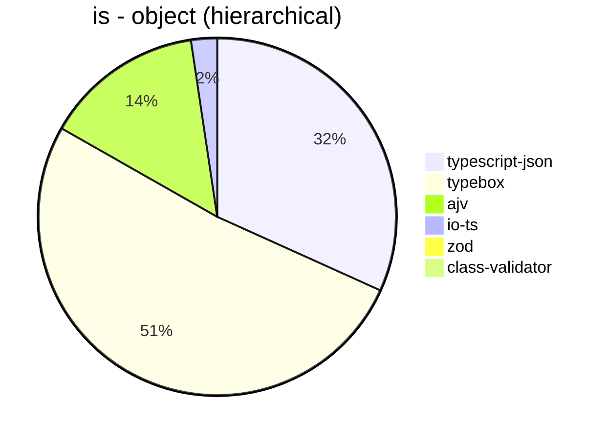
```mermaid
pie title is - object (hierarchical)
  "typescript-json": 121233.9086659475
  "typebox": 196522.61029411762
  "ajv": 54996.344361177114
  "io-ts": 8990.815576781779
  "zod": 419.830843980565
  "class-validator": 68.70648589226823
```

```mermaid
pie title is - object (recursive)
  "typescript-json": 84733.0141778678
  "typebox": 86065.1890482399
  "ajv": 38786
  "io-ts": 4750.320336811275
  "zod": 73.49990880904615
  "class-validator": 43.58353510895884
```

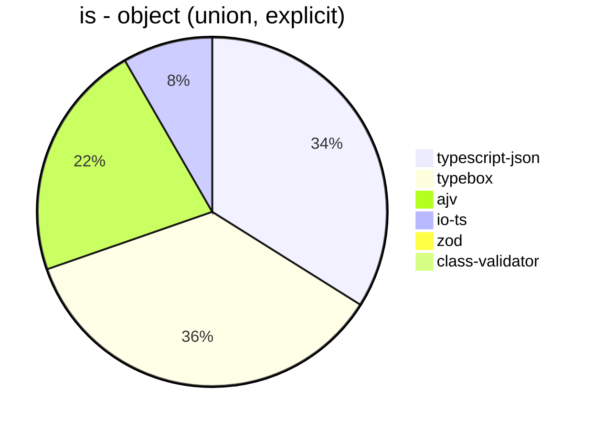
```mermaid
pie title is - object (union, explicit)
  "typescript-json": 13463.058572191561
  "typebox": 14182.971680764987
  "ajv": 8733.113069016152
  "io-ts": 3302.195757350205
  "zod": 36.66603666603666
  "class-validator": 17.757009345794394
```

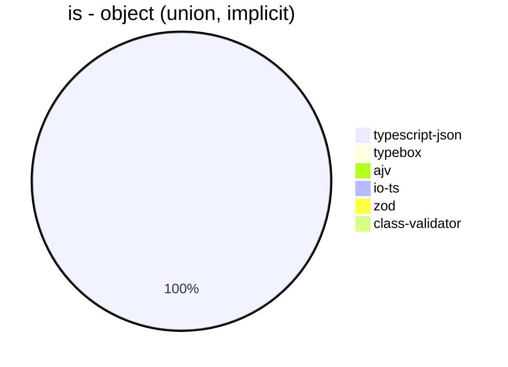
```mermaid
pie title is - object (union, implicit)
  "typescript-json": 14607.733812949642
  "typebox": 0
  "ajv": 0
  "io-ts": 0
  "zod": 18.9873417721519
  "class-validator": 16.53046062407132
```

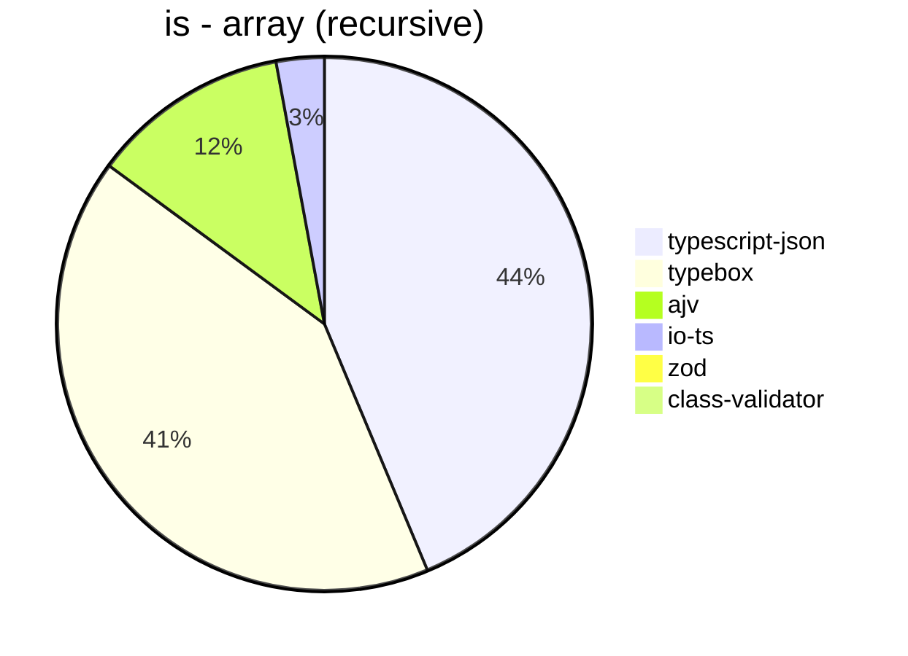
```mermaid
pie title is - array (recursive)
  "typescript-json": 7791.512915129151
  "typebox": 7380.5163889397545
  "ajv": 2138.1996015214636
  "io-ts": 518.2247403210577
  "zod": 9.657261882219277
  "class-validator": 3.7285607755406414
```

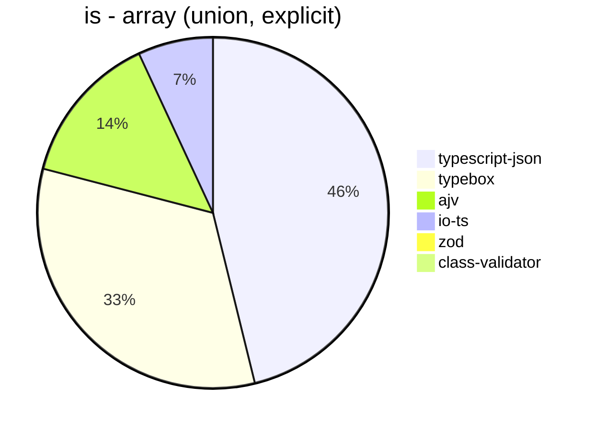
```mermaid
pie title is - array (union, explicit)
  "typescript-json": 2590.5251560778556
  "typebox": 1846.1538461538462
  "ajv": 787.1849485268015
  "io-ts": 388.4063444108761
  "zod": 3.0194376297414602
  "class-validator": 8.65149520406244
```

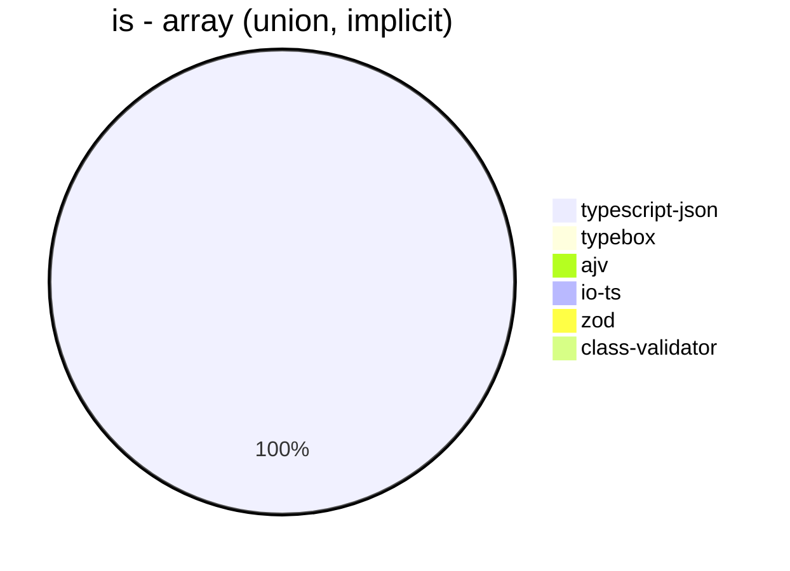
```mermaid
pie title is - array (union, implicit)
  "typescript-json": 1752.4518706865238
  "typebox": 0
  "ajv": 0
  "io-ts": 0
  "zod": 2.066115702479339
  "class-validator": 5.3574727507851465
```

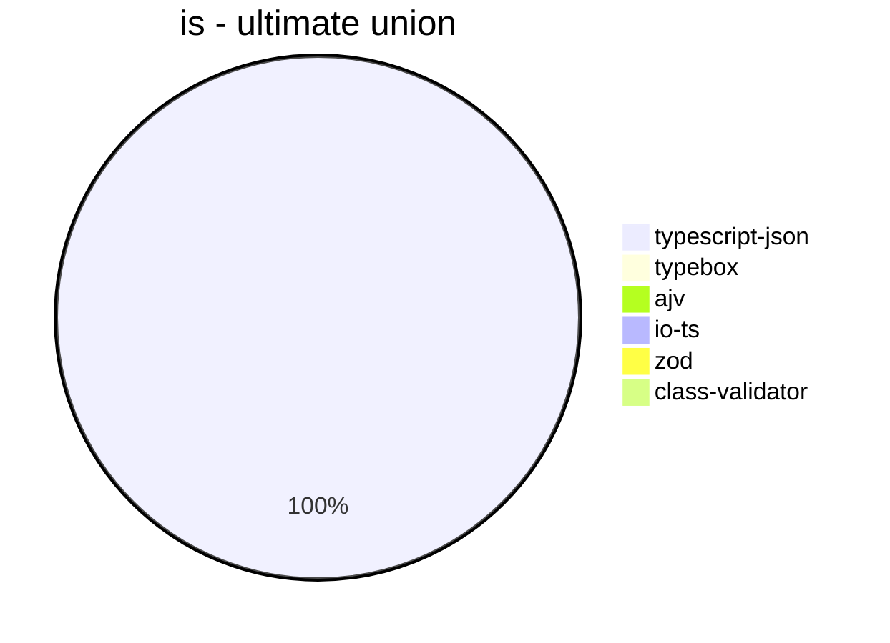
```mermaid
pie title is - ultimate union
  "typescript-json": 612.6338718460701
  "typebox": 0
  "ajv": 0
  "io-ts": 0
  "zod": 0.35945363048166784
  "class-validator": 0
```

## assert
 Components | typescript-json | typebox | io-ts | zod | class-validator 
------------|-----------------|---------|-------|-----|-----------------
object (hierarchical) | 24062.84592037136 | 867.8710591569253 | 4139.747576367295 | 433.0013155421913 | 66.93343033830483
object (recursive) | 36280.93457943926 | 361.00893326326855 | 1965.6197732763426 | 78.8130788130788 | 42.68402966178333
object (union, explicit) | 5436.65324057122 | 153.33098343320407 | 1302.9570392412127 | 37.04400150432494 | 17.801998183469575
object (union, implicit) | 5235.185866764814 | Failed | Failed | 19.663452448477976 | 16.473569876900797
array (recursive) | 1639.210716871832 | 40.3505568742012 | 189.85480610181952 | 9.71058644325971 | 3.9555471840271235
array (union, explicit) | 2292.8455577581544 | 19.874861980125136 | 88.09310653536258 | 3.008084226358338 | 7.946775087784144
array (union, implicit) | 1212.6311979732175 | Failed | Failed | 1.889287738522577 | 5.491384207536452
ultimate union | 261.167780513542 | Failed | Failed | 0.3627130939426913 | Failed

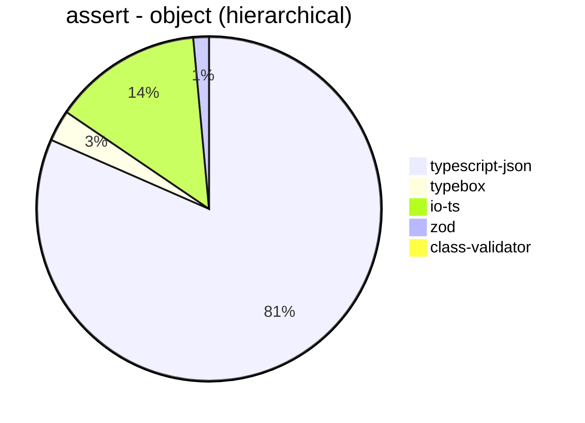
```mermaid
pie title assert - object (hierarchical)
  "typescript-json": 24062.84592037136
  "typebox": 867.8710591569253
  "io-ts": 4139.747576367295
  "zod": 433.0013155421913
  "class-validator": 66.93343033830483
```

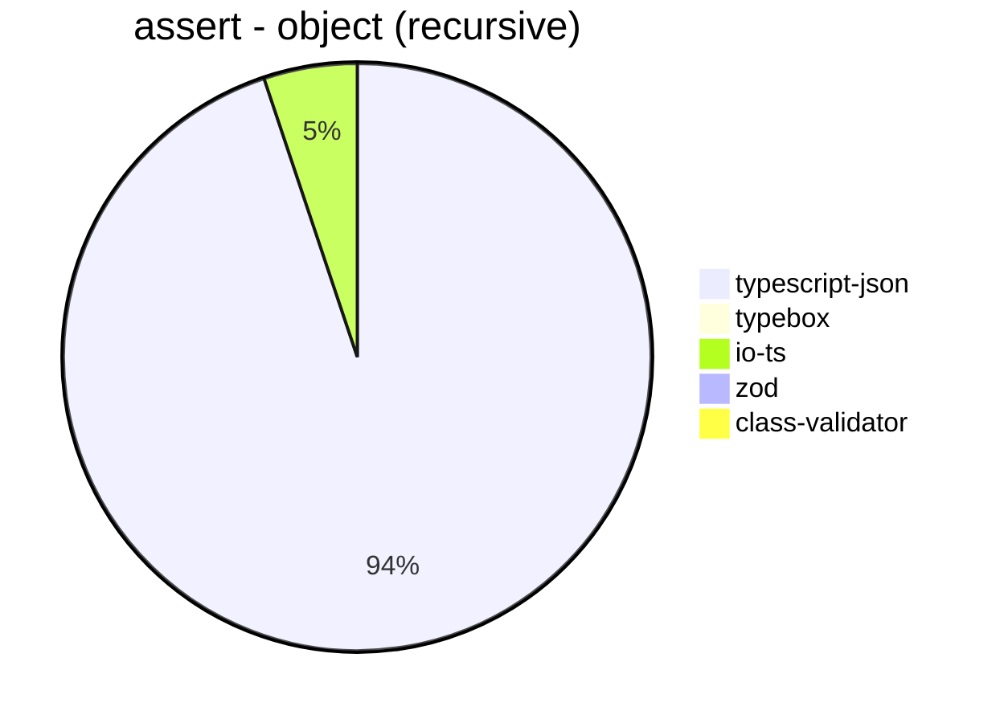
```mermaid
pie title assert - object (recursive)
  "typescript-json": 36280.93457943926
  "typebox": 361.00893326326855
  "io-ts": 1965.6197732763426
  "zod": 78.8130788130788
  "class-validator": 42.68402966178333
```

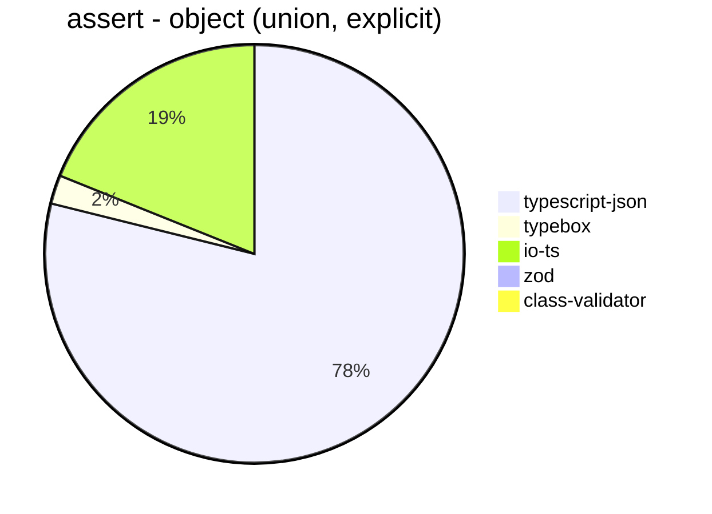
```mermaid
pie title assert - object (union, explicit)
  "typescript-json": 5436.65324057122
  "typebox": 153.33098343320407
  "io-ts": 1302.9570392412127
  "zod": 37.04400150432494
  "class-validator": 17.801998183469575
```

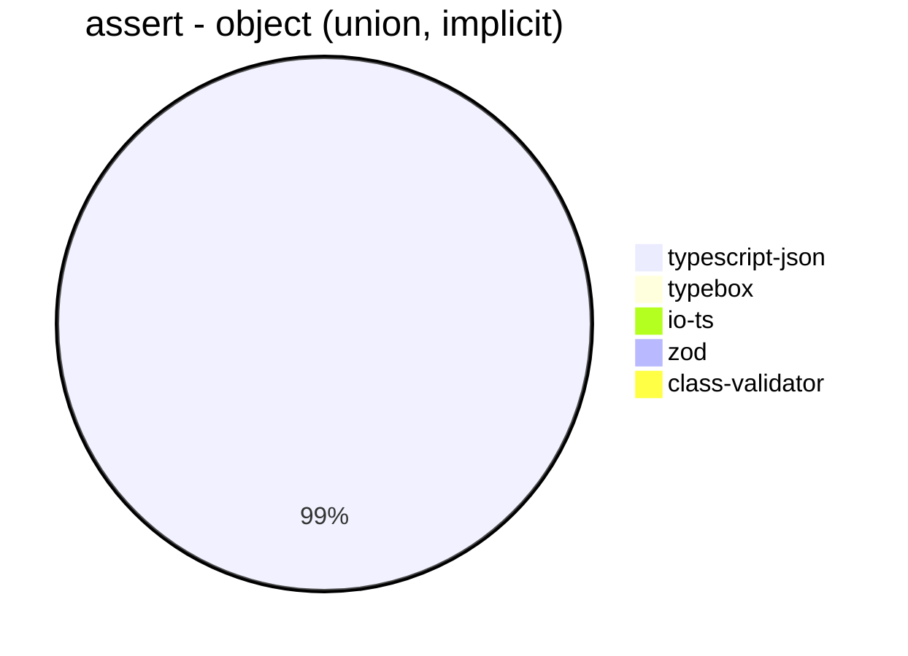
```mermaid
pie title assert - object (union, implicit)
  "typescript-json": 5235.185866764814
  "typebox": 0
  "io-ts": 0
  "zod": 19.663452448477976
  "class-validator": 16.473569876900797
```

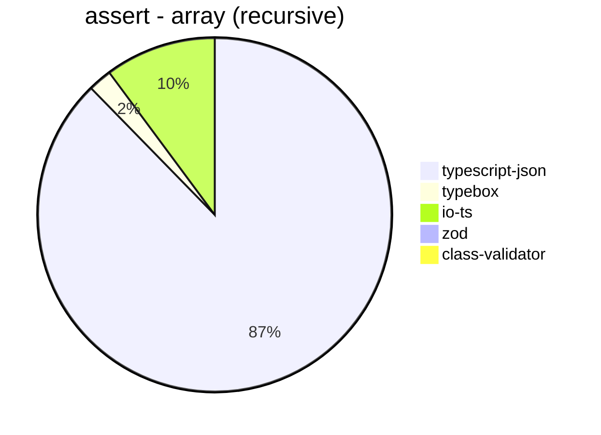
```mermaid
pie title assert - array (recursive)
  "typescript-json": 1639.210716871832
  "typebox": 40.3505568742012
  "io-ts": 189.85480610181952
  "zod": 9.71058644325971
  "class-validator": 3.9555471840271235
```

```mermaid
pie title assert - array (union, explicit)
  "typescript-json": 2292.8455577581544
  "typebox": 19.874861980125136
  "io-ts": 88.09310653536258
  "zod": 3.008084226358338
  "class-validator": 7.946775087784144
```

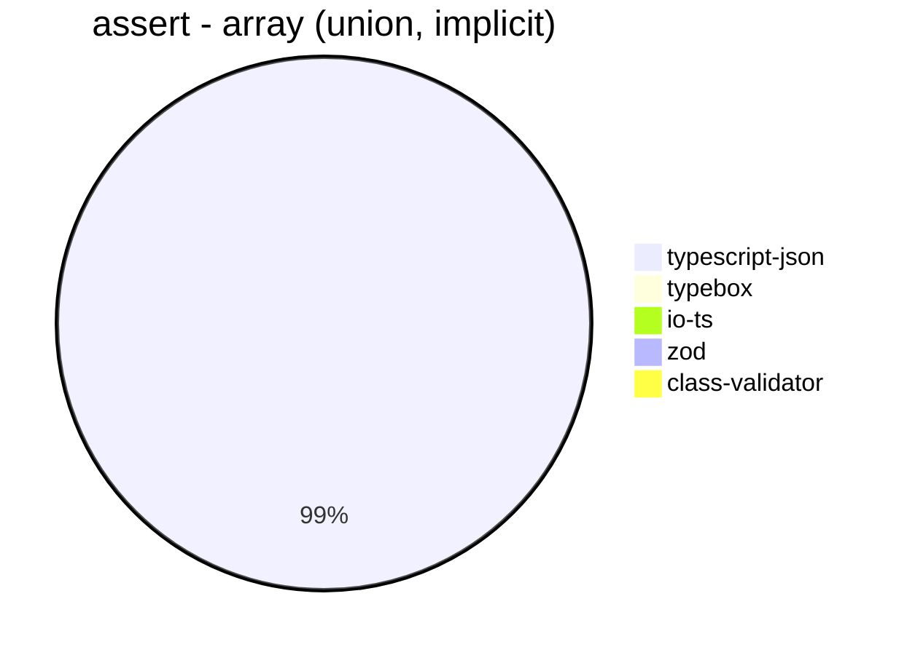
```mermaid
pie title assert - array (union, implicit)
  "typescript-json": 1212.6311979732175
  "typebox": 0
  "io-ts": 0
  "zod": 1.889287738522577
  "class-validator": 5.491384207536452
```

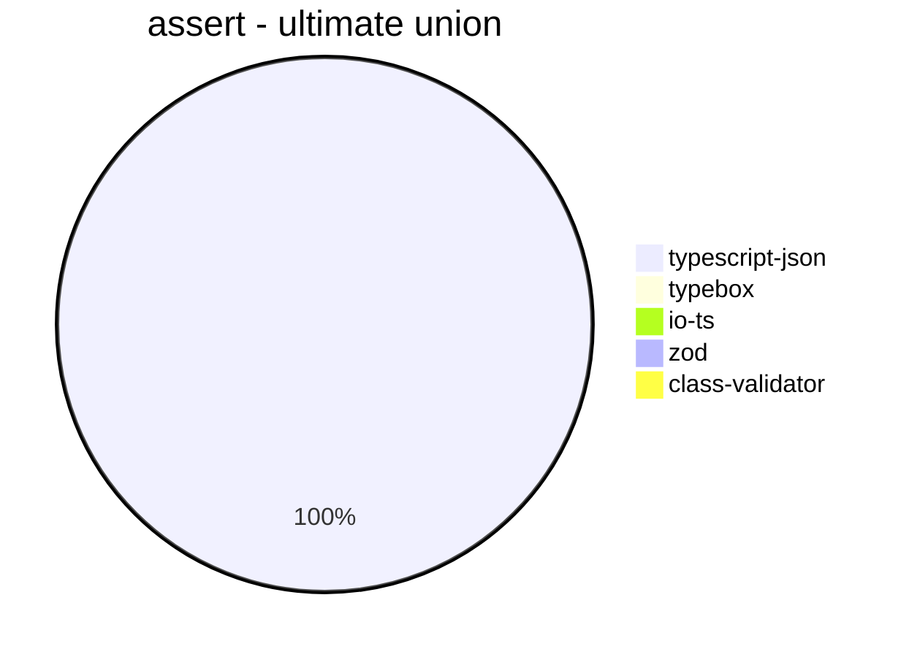
```mermaid
pie title assert - ultimate union
  "typescript-json": 261.167780513542
  "typebox": 0
  "io-ts": 0
  "zod": 0.3627130939426913
  "class-validator": 0
```

## valiadate
 Components | typescript-json | typebox | io-ts | zod | class-validator 
------------|-----------------|---------|-------|-----|-----------------
object (hierarchical) | 18166.374474053297 | 854.8303771310486 | 4153.789551140545 | 423.8095238095238 | 69.26882902693788
object (recursive) | 19761.092775944264 | 383.2790445168296 | 1908.3179297597042 | 76.76348547717843 | 42.7965320051651
object (union, explicit) | 4297.20793534166 | 151.77610333692144 | 1297.743533296643 | 36.440991490936 | 17.951042611060746
object (union, implicit) | 3966.5150136487714 | Failed | Failed | 20.134228187919465 | 16.83937823834197
array (recursive) | 1137.1256357129403 | 39.99279409115474 | 192.47093559697362 | 9.916094584286805 | 3.734129947722181
array (union, explicit) | 1846.5372974897632 | 20.489470688673876 | 93.3932247800861 | 3.184713375796178 | 8.092698179142909
array (union, implicit) | 889.943741209564 | Failed | Failed | 1.887861053426468 | 5.4613935969868175
ultimate union | 159.25524222704266 | Failed | Failed | 0.36107600649936816 | Failed

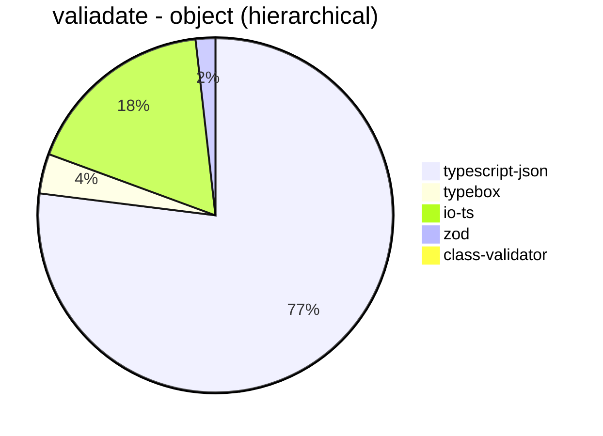
```mermaid
pie title valiadate - object (hierarchical)
  "typescript-json": 18166.374474053297
  "typebox": 854.8303771310486
  "io-ts": 4153.789551140545
  "zod": 423.8095238095238
  "class-validator": 69.26882902693788
```

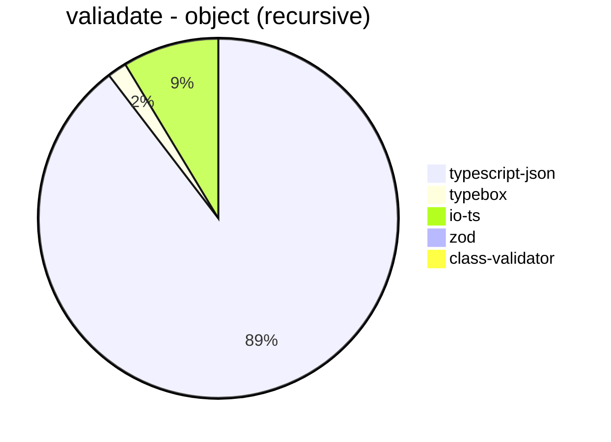
```mermaid
pie title valiadate - object (recursive)
  "typescript-json": 19761.092775944264
  "typebox": 383.2790445168296
  "io-ts": 1908.3179297597042
  "zod": 76.76348547717843
  "class-validator": 42.7965320051651
```

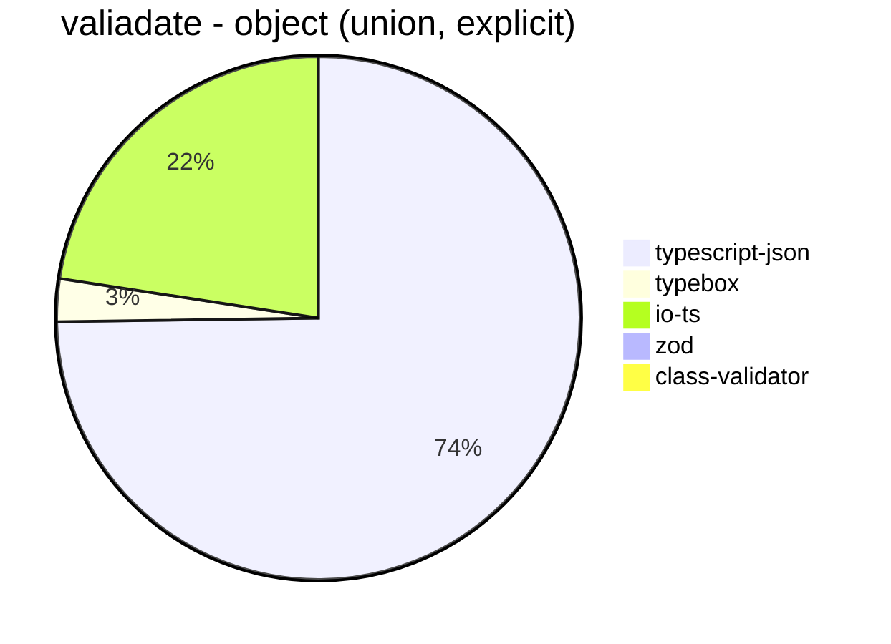
```mermaid
pie title valiadate - object (union, explicit)
  "typescript-json": 4297.20793534166
  "typebox": 151.77610333692144
  "io-ts": 1297.743533296643
  "zod": 36.440991490936
  "class-validator": 17.951042611060746
```

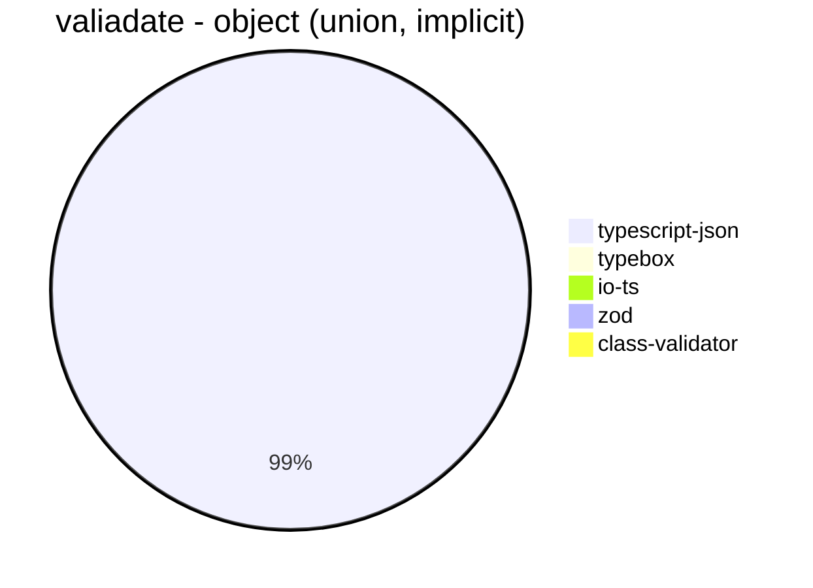
```mermaid
pie title valiadate - object (union, implicit)
  "typescript-json": 3966.5150136487714
  "typebox": 0
  "io-ts": 0
  "zod": 20.134228187919465
  "class-validator": 16.83937823834197
```

```mermaid
pie title valiadate - array (recursive)
  "typescript-json": 1137.1256357129403
  "typebox": 39.99279409115474
  "io-ts": 192.47093559697362
  "zod": 9.916094584286805
  "class-validator": 3.734129947722181
```

```mermaid
pie title valiadate - array (union, explicit)
  "typescript-json": 1846.5372974897632
  "typebox": 20.489470688673876
  "io-ts": 93.3932247800861
  "zod": 3.184713375796178
  "class-validator": 8.092698179142909
```

```mermaid
pie title valiadate - array (union, implicit)
  "typescript-json": 889.943741209564
  "typebox": 0
  "io-ts": 0
  "zod": 1.887861053426468
  "class-validator": 5.4613935969868175
```

```mermaid
pie title valiadate - ultimate union
  "typescript-json": 159.25524222704266
  "typebox": 0
  "io-ts": 0
  "zod": 0.36107600649936816
  "class-validator": 0
```

## optimizer
 Components | typescript-json | typebox | ajv 
------------|-----------------|---------|-----
object (hierarchical) | 107693.31656485808 | 208.42032011134307 | 5.288110867979577
object (recursive) | 82548.32451499118 | 871.94791101465 | 9.592326139088728
object (union) | 14308.685036623649 | 96.80382072005878 | 4.58547322083639
array (hierarchical) | 10641.975308641977 | 1037.4862183020948 | 6.8939817402645795
array (recursive) | 5963.470319634704 | 896.1996596710154 | 10.104790419161676
array (union) | 3970.424807313139 | 264.49275362318843 | 6.706408345752608
ultimate union | 588.4476534296028 | 13.463666543710808 | 0.9049773755656108

```mermaid
pie title optimizer - object (hierarchical)
  "typescript-json": 107693.31656485808
  "typebox": 208.42032011134307
  "ajv": 5.288110867979577
```

```mermaid
pie title optimizer - object (recursive)
  "typescript-json": 82548.32451499118
  "typebox": 871.94791101465
  "ajv": 9.592326139088728
```

```mermaid
pie title optimizer - object (union)
  "typescript-json": 14308.685036623649
  "typebox": 96.80382072005878
  "ajv": 4.58547322083639
```

```mermaid
pie title optimizer - array (hierarchical)
  "typescript-json": 10641.975308641977
  "typebox": 1037.4862183020948
  "ajv": 6.8939817402645795
```

```mermaid
pie title optimizer - array (recursive)
  "typescript-json": 5963.470319634704
  "typebox": 896.1996596710154
  "ajv": 10.104790419161676
```

```mermaid
pie title optimizer - array (union)
  "typescript-json": 3970.424807313139
  "typebox": 264.49275362318843
  "ajv": 6.706408345752608
```

```mermaid
pie title optimizer - ultimate union
  "typescript-json": 588.4476534296028
  "typebox": 13.463666543710808
  "ajv": 0.9049773755656108
```

## stringify
 Components | typescript-json | fast-json-stringify | JSON.stringify() 
------------|-----------------|---------------------|------------------
object (simple) | 144299.98187420698 | 31455.256456893414 | 6642.843708858379
object (hierarchical) | 5324.871228844739 | 4821.519447473646 | 1688.0373831775703
object (recursive) | 5628.997093023257 | 1283.9810426540284 | 1286.1205915813425
object (union) | 1429.198875614898 | 1388.5429638854296 | 683.0867203596179
array (hierarchical) | 250.35612535612537 | 363.99180785700986 | 115.9717051377513
array (recursive) | 276.38376383763836 | 132.65879707700955 | 131.10207100591714
array (union) | 344.58483754512633 | 241.35393671817513 | 273.42723004694835
ultimate union | 131.25440451021845 | 66.68946648426812 | 196.96969696969697

```mermaid
pie title stringify - object (simple)
  "typescript-json": 144299.98187420698
  "fast-json-stringify": 31455.256456893414
  "JSON.stringify()": 6642.843708858379
```

```mermaid
pie title stringify - object (hierarchical)
  "typescript-json": 5324.871228844739
  "fast-json-stringify": 4821.519447473646
  "JSON.stringify()": 1688.0373831775703
```

```mermaid
pie title stringify - object (recursive)
  "typescript-json": 5628.997093023257
  "fast-json-stringify": 1283.9810426540284
  "JSON.stringify()": 1286.1205915813425
```

```mermaid
pie title stringify - object (union)
  "typescript-json": 1429.198875614898
  "fast-json-stringify": 1388.5429638854296
  "JSON.stringify()": 683.0867203596179
```

```mermaid
pie title stringify - array (hierarchical)
  "typescript-json": 250.35612535612537
  "fast-json-stringify": 363.99180785700986
  "JSON.stringify()": 115.9717051377513
```

```mermaid
pie title stringify - array (recursive)
  "typescript-json": 276.38376383763836
  "fast-json-stringify": 132.65879707700955
  "JSON.stringify()": 131.10207100591714
```

```mermaid
pie title stringify - array (union)
  "typescript-json": 344.58483754512633
  "fast-json-stringify": 241.35393671817513
  "JSON.stringify()": 273.42723004694835
```

```mermaid
pie title stringify - ultimate union
  "typescript-json": 131.25440451021845
  "fast-json-stringify": 66.68946648426812
  "JSON.stringify()": 196.96969696969697
```

