# Benchmark of `typescript-json`
> CPU: AMD Ryzen 9 5900HX with Radeon Graphics
> Memory: 64,928 MB
> NodeJS version: v16.16.0
> TypeScript-JSON version: 3.3.18


## is
 Components | typescript-json | typebox | ajv | io-ts | zod | class-validator 
------------|-----------------|---------|-----|-------|-----|-----------------
object (simple) | 1075020.3347129745 | 1716862.8107917474 | 512979.0585287274 | 37097.93541556379 | 4144.53125 | 163.17767042404722
object (hierarchical) | 169810.2404110846 | 205283.49410503753 | 53247.43935309972 | 9191.398613826195 | 452.4103831891223 | 55.53539019963703
object (recursive) | 95652.27272727274 | 92351.12670853344 | 43461.10721793973 | 5791.936378768263 | 74.74897731498699 | 42.84929500091558
object (union, explicit) | 18628.571428571428 | 14040.396621373486 | 8459.2186429061 | 3343.0985915492956 | 36.28813865318649 | 112.03549639489741
object (union, implicit) | 21082.64915161467 | Failed | Failed | Failed | 18.836565096952906 | 78.87428254027031
array (recursive) | 7419.672131147541 | 7631.292261457551 | 2351.4824797843667 | 535.0635008282717 | 9.983361064891847 | 3.7783375314861463
array (union, explicit) | 4093.7675463222913 | 1923.3314947600663 | 820.480631276901 | 387.3291466568157 | 3.2840722495894914 | 42.1130402659771
array (union, implicit) | 2125.9052924791085 | Failed | Failed | Failed | 2.175883952855848 | 29.937864808887213
ultimate union | 681.3166605369621 | Failed | Failed | Failed | 0.486854917234664 | Failed


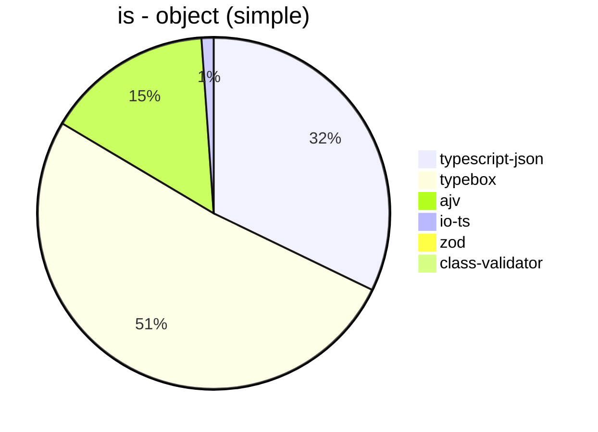


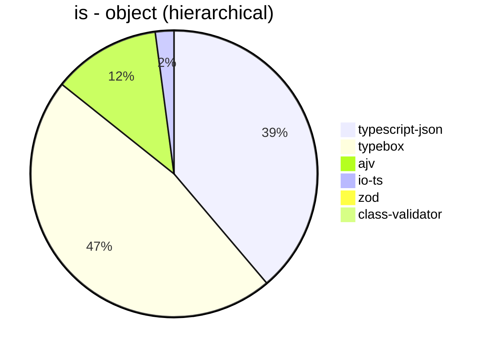


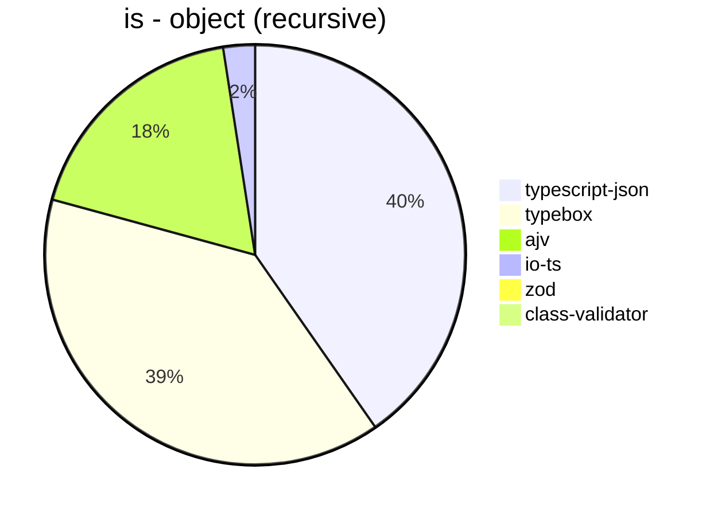


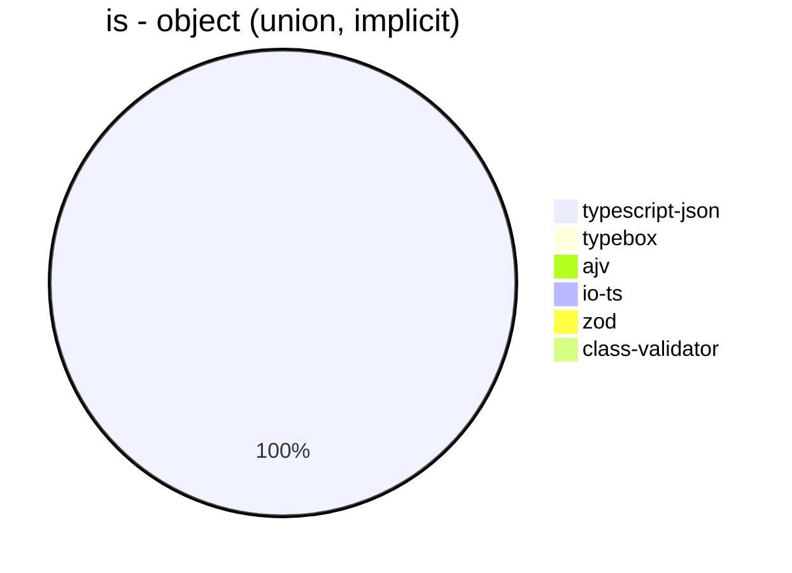


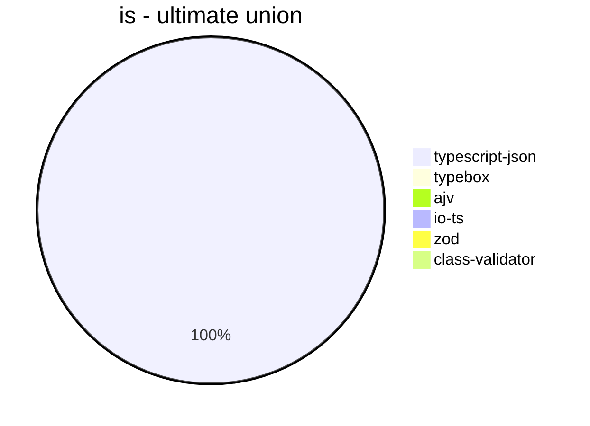


## assertType (iterate)
 Components | typescript-json | typebox | io-ts | zod | class-validator 
------------|-----------------|---------|-------|-----|-----------------
object (simple) | 348013.37613697164 | 3489.016736401674 | 18859.619686800896 | 3632.1797427070123 | 201.980198019802
object (hierarchical) | 63650.42107149256 | 884.4148840553659 | 4070.2494497432135 | 448.40455308826273 | 68.18181818181819
object (recursive) | 49955.79514824797 | 402.22222222222223 | 1965.1205259313365 | 79.3443844291302 | 42.47594844799419
object (union, explicit) | 7746.318114874815 | 151.91218130311614 | 1332.9001113999257 | 37.49300503637381 | 117.83681214421253
object (union, implicit) | 7054.393305439331 | Failed | Failed | 19.509476031215165 | 78.14520598559025
array (recursive) | 3001.688555347092 | 41.596402473299605 | 185.5612998522895 | 10.087801232953485 | 3.8917716827279465
array (union, explicit) | 2590.7839177528913 | 20.574606116774795 | 88.54454897620364 | 3.299725022914757 | 40.99107305520131
array (union, implicit) | 1192.8345626975765 | Failed | Failed | 2.165283291230603 | 29.055690072639223
ultimate union | 294.3192064923354 | Failed | Failed | 0.47930979389678857 | Failed


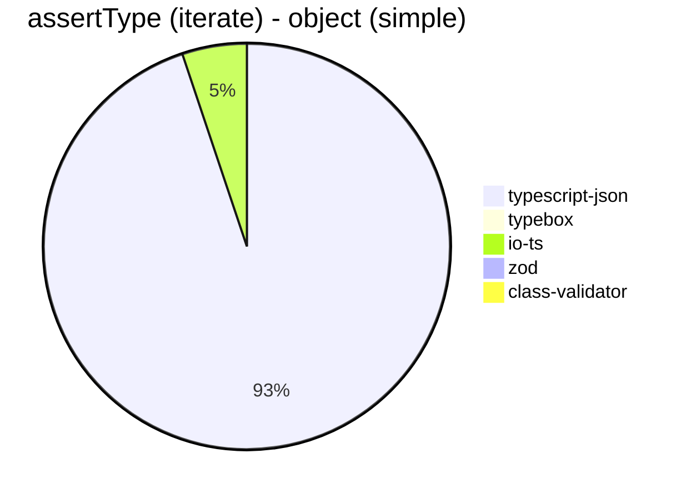


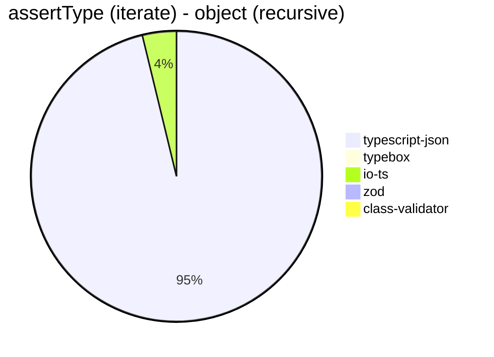


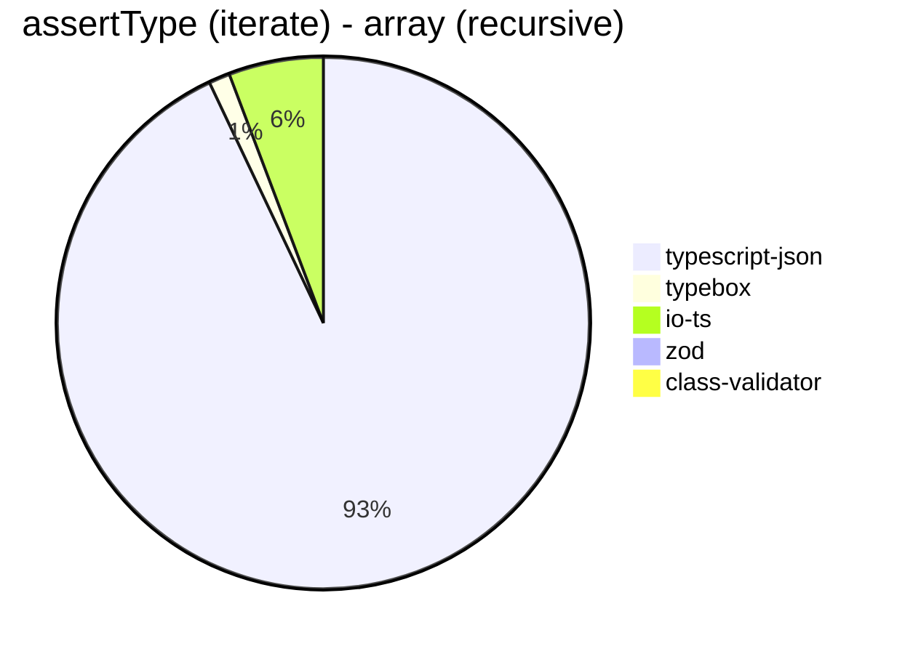


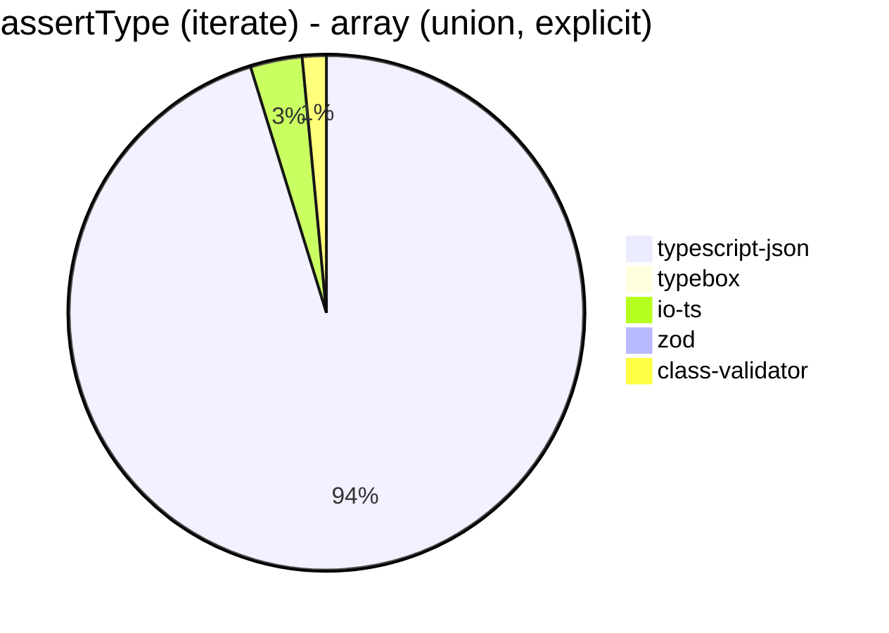


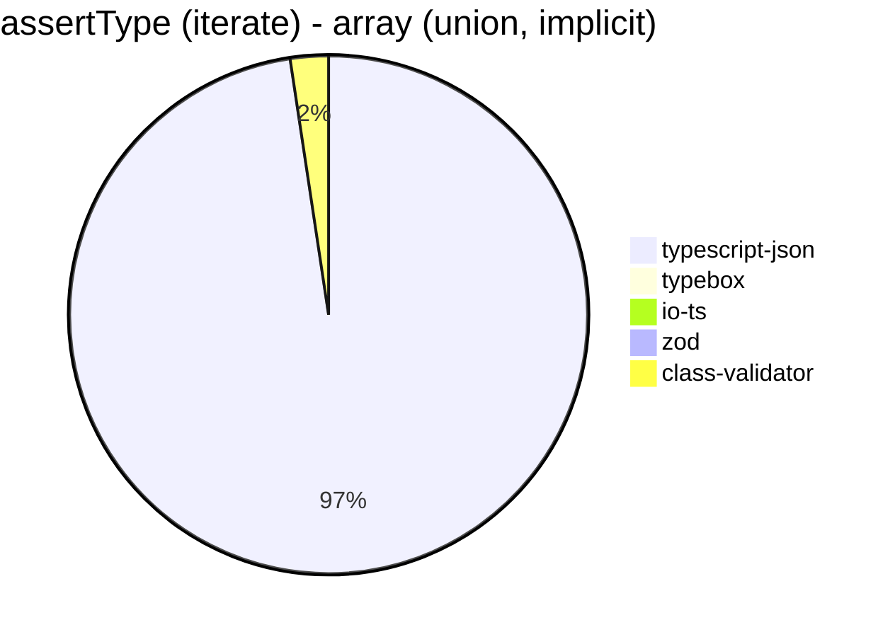


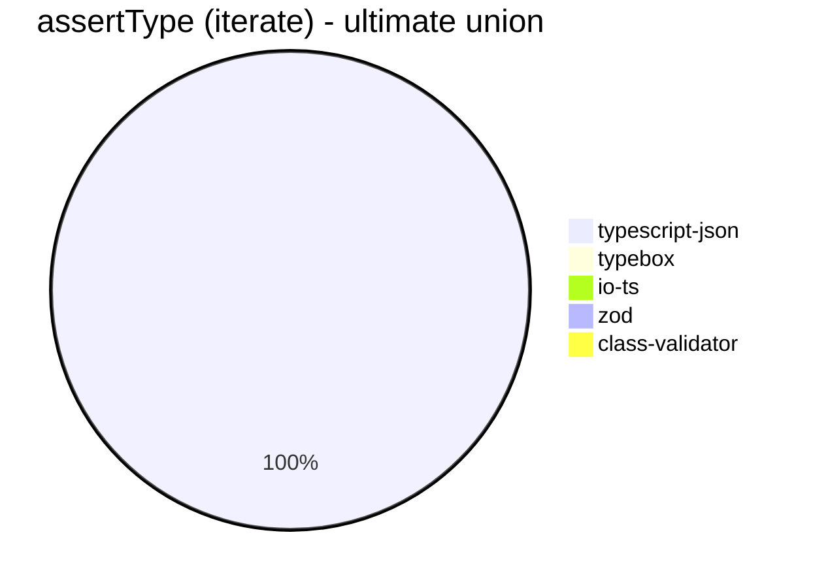


## assertType (throw)
 Components | typescript-json | typebox | io-ts | zod | class-validator 
------------|-----------------|---------|-------|-----|-----------------
object (simple) | 547.9052823315118 | 28.05717310746427 | 126.33714496495759 | 32.76633840644584 | 2.2030475491096015
object (hierarchical) | 355.01453488372096 | 8.513788635942996 | 37.291280148423006 | 4.690431519699812 | 0.7271405199054717
object (recursive) | 54.626532887402455 | Failed | Failed | 0.35555555555555557 | 0.8898380494749956
object (union, explicit) | 65.66297841465627 | 1.6432353478181485 | 10.895224260032686 | 0.3619254433586681 | 1.0907107798582076
object (union, implicit) | 50.72067141032658 | Failed | Failed | 0.3539196602371262 | 0.9174311926605504
array (recursive) | 14.443651925820257 | 0.35174111853675694 | 1.3232514177693762 | 0.15790304752881731 | 0.12758356723653994
array (union, explicit) | 5.054151624548736 | 0.1764602082230457 | 0.7307270734380709 | 0.11884953648680771 | 0.3623188405797102
array (union, implicit) | 2.0014556040756912 | Failed | Failed | 0.09389671361502347 | 0.34019391052900155
ultimate union | 2.8439388553146108 | Failed | Failed | 0.024028064779662645 | Failed


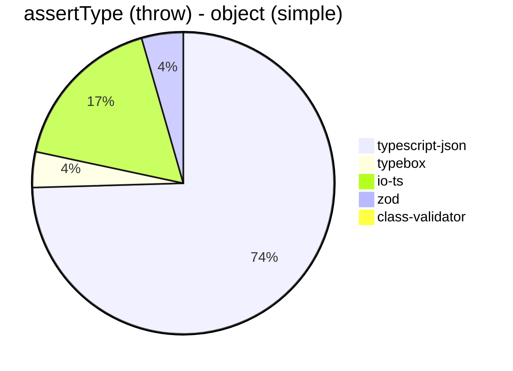


```mermaid
pie title assertType (throw) - object (recursive)
  "typescript-json": 54.626532887402455
  "typebox": 0
  "io-ts": 0
  "zod": 0.35555555555555557
  "class-validator": 0.8898380494749956
```


```mermaid
pie title assertType (throw) - object (union, explicit)
  "typescript-json": 65.66297841465627
  "typebox": 1.6432353478181485
  "io-ts": 10.895224260032686
  "zod": 0.3619254433586681
  "class-validator": 1.0907107798582076
```


```mermaid
pie title assertType (throw) - object (union, implicit)
  "typescript-json": 50.72067141032658
  "typebox": 0
  "io-ts": 0
  "zod": 0.3539196602371262
  "class-validator": 0.9174311926605504
```


```mermaid
pie title assertType (throw) - array (recursive)
  "typescript-json": 14.443651925820257
  "typebox": 0.35174111853675694
  "io-ts": 1.3232514177693762
  "zod": 0.15790304752881731
  "class-validator": 0.12758356723653994
```


```mermaid
pie title assertType (throw) - array (union, explicit)
  "typescript-json": 5.054151624548736
  "typebox": 0.1764602082230457
  "io-ts": 0.7307270734380709
  "zod": 0.11884953648680771
  "class-validator": 0.3623188405797102
```


```mermaid
pie title assertType (throw) - array (union, implicit)
  "typescript-json": 2.0014556040756912
  "typebox": 0
  "io-ts": 0
  "zod": 0.09389671361502347
  "class-validator": 0.34019391052900155
```


```mermaid
pie title assertType (throw) - ultimate union
  "class-validator": 0
  "typescript-json": 2.8439388553146108
  "typebox": 0
  "io-ts": 0
  "zod": 0.024028064779662645
```


## validate
 Components | typescript-json | typebox | io-ts | zod | class-validator 
------------|-----------------|---------|-------|-----|-----------------
object (simple) | 114805.12249443206 | 3209.9507927829413 | 16099.382369455361 | 3753.5066392369545 | 207.18540580789278
object (hierarchical) | 35512.866980790146 | 890.1038819026792 | 3967.0391061452515 | 425.08584854509303 | 68.47521047708139
object (recursive) | 26955.304254173403 | 377.13068181818187 | 1784.056886227545 | 79.42170484416073 | 43.357420789327406
object (union, explicit) | 5786.855149623646 | 156.84463329022722 | 1201.800450112528 | 36.65207877461707 | 111.2743297833272
object (union, implicit) | 4793.078586878154 | 145.44456641053785 | 364.84962406015035 | 19.45885841363973 | 77.63805358119191
array (recursive) | 1669.8834668608888 | 41.61199625117151 | 182.92011019283746 | 9.928295642581357 | 3.9004457652303115
array (union, explicit) | 2066.1790938280415 | 21.08662613981763 | 89.32296605348 | 3.280481137233461 | 39.642857142857146
array (union, implicit) | 1170.9522965064727 | 13.92757660167131 | 60.18602954586905 | 2.2185246810870773 | 29.52098031934645
ultimate union | 189.68820762933288 | Failed | Failed | 0.5003335557038026 | Failed


```mermaid
pie title validate - object (simple)
  "typescript-json": 114805.12249443206
  "typebox": 3209.9507927829413
  "io-ts": 16099.382369455361
  "zod": 3753.5066392369545
  "class-validator": 207.18540580789278
```


```mermaid
pie title validate - object (hierarchical)
  "typescript-json": 35512.866980790146
  "typebox": 890.1038819026792
  "io-ts": 3967.0391061452515
  "zod": 425.08584854509303
  "class-validator": 68.47521047708139
```


```mermaid
pie title validate - object (recursive)
  "typescript-json": 26955.304254173403
  "typebox": 377.13068181818187
  "io-ts": 1784.056886227545
  "zod": 79.42170484416073
  "class-validator": 43.357420789327406
```


```mermaid
pie title validate - object (union, explicit)
  "typescript-json": 5786.855149623646
  "typebox": 156.84463329022722
  "io-ts": 1201.800450112528
  "zod": 36.65207877461707
  "class-validator": 111.2743297833272
```


```mermaid
pie title validate - object (union, implicit)
  "typescript-json": 4793.078586878154
  "typebox": 145.44456641053785
  "io-ts": 364.84962406015035
  "zod": 19.45885841363973
  "class-validator": 77.63805358119191
```


```mermaid
pie title validate - array (recursive)
  "typescript-json": 1669.8834668608888
  "typebox": 41.61199625117151
  "io-ts": 182.92011019283746
  "zod": 9.928295642581357
  "class-validator": 3.9004457652303115
```


```mermaid
pie title validate - array (union, explicit)
  "typescript-json": 2066.1790938280415
  "typebox": 21.08662613981763
  "io-ts": 89.32296605348
  "zod": 3.280481137233461
  "class-validator": 39.642857142857146
```


```mermaid
pie title validate - array (union, implicit)
  "typescript-json": 1170.9522965064727
  "typebox": 13.92757660167131
  "io-ts": 60.18602954586905
  "zod": 2.2185246810870773
  "class-validator": 29.52098031934645
```


```mermaid
pie title validate - ultimate union
  "typescript-json": 189.68820762933288
  "typebox": 0
  "io-ts": 0
  "zod": 0.5003335557038026
  "class-validator": 0
```


## equals
 Components | typescript-json | typebox 
------------|-----------------|---------
object (simple) | 31308.826172928275 | 71034.11978221415
object (hierarchical) | 9839.024390243902 | 21418.798665183538
object (recursive) | 7610.890732059142 | 12940.91164884637
object (union, explicit) | 3177.77387023035 | 3793.103448275862
object (union, implicit) | 2094.8827292110873 | 2670.9141274238227
array (recursive) | 589.0257558790594 | 1218.9208895370034
array (union, explicit) | 849.1183421196145 | 774.1761210156671
array (union, implicit) | 521.5501629844259 | 486.48648648648646
ultimate union | 340.0679420704452 | 229.70223783983727


```mermaid
pie title equals - object (simple)
  "typescript-json": 31308.826172928275
  "typebox": 71034.11978221415
```


```mermaid
pie title equals - object (hierarchical)
  "typescript-json": 9839.024390243902
  "typebox": 21418.798665183538
```


```mermaid
pie title equals - object (recursive)
  "typescript-json": 7610.890732059142
  "typebox": 12940.91164884637
```


```mermaid
pie title equals - object (union, explicit)
  "typescript-json": 3177.77387023035
  "typebox": 3793.103448275862
```


```mermaid
pie title equals - object (union, implicit)
  "typescript-json": 2094.8827292110873
  "typebox": 2670.9141274238227
```


```mermaid
pie title equals - array (recursive)
  "typescript-json": 589.0257558790594
  "typebox": 1218.9208895370034
```


```mermaid
pie title equals - array (union, explicit)
  "typescript-json": 849.1183421196145
  "typebox": 774.1761210156671
```


```mermaid
pie title equals - array (union, implicit)
  "typescript-json": 521.5501629844259
  "typebox": 486.48648648648646
```


```mermaid
pie title equals - ultimate union
  "typescript-json": 340.0679420704452
  "typebox": 229.70223783983727
```


## assertEquals (iterate)
 Components | typescript-json | typebox 
------------|-----------------|---------
object (simple) | 34915.715062533985 | 2815.0569773958528
object (hierarchical) | 8682.493657122146 | 765.5362053162236
object (recursive) | 7280.610346110904 | 353.900975243811
object (union, explicit) | 2663.0928584408503 | 122.68907563025209
object (union, implicit) | 2044.843049327354 | 83.93956351426974
array (recursive) | 610.3825136612022 | 36.940298507462686
array (union, explicit) | 467.12227558182497 | 17.014270032930845
array (union, implicit) | 300.65958226456576 | 7.220885021292354
ultimate union | 233.03571428571428 | 4.4028618602091365


```mermaid
pie title assertEquals (iterate) - object (simple)
  "typescript-json": 34915.715062533985
  "typebox": 2815.0569773958528
```


```mermaid
pie title assertEquals (iterate) - object (hierarchical)
  "typescript-json": 8682.493657122146
  "typebox": 765.5362053162236
```


```mermaid
pie title assertEquals (iterate) - object (recursive)
  "typescript-json": 7280.610346110904
  "typebox": 353.900975243811
```


```mermaid
pie title assertEquals (iterate) - object (union, explicit)
  "typescript-json": 2663.0928584408503
  "typebox": 122.68907563025209
```


```mermaid
pie title assertEquals (iterate) - object (union, implicit)
  "typescript-json": 2044.843049327354
  "typebox": 83.93956351426974
```


```mermaid
pie title assertEquals (iterate) - array (recursive)
  "typescript-json": 610.3825136612022
  "typebox": 36.940298507462686
```


```mermaid
pie title assertEquals (iterate) - array (union, explicit)
  "typescript-json": 467.12227558182497
  "typebox": 17.014270032930845
```


```mermaid
pie title assertEquals (iterate) - array (union, implicit)
  "typescript-json": 300.65958226456576
  "typebox": 7.220885021292354
```


```mermaid
pie title assertEquals (iterate) - ultimate union
  "typescript-json": 233.03571428571428
  "typebox": 4.4028618602091365
```


## assertEquals (throw)
 Components | typescript-json | typebox 
------------|-----------------|---------
object (simple) | 203.04475421863538 | 24.18312719217279
object (hierarchical) | 72.87015538489015 | 6.910347335879251
object (recursive) | 58.80191106210952 | 3.3076074972436604
object (union, explicit) | 24.757804090419807 | 1.274117218784128
object (union, implicit) | 19.033674963396777 | 0.9172628875435701
array (recursive) | 5.89101620029455 | 0.3660992128866923
array (union, explicit) | 2.553812477198103 | 0.17325017325017325
array (union, implicit) | 1.265365148228489 | 0.1504890895410083
ultimate union | 2.291960507757405 | 0.12987012987012986


```mermaid
pie title assertEquals (throw) - object (simple)
  "typescript-json": 203.04475421863538
  "typebox": 24.18312719217279
```


```mermaid
pie title assertEquals (throw) - object (hierarchical)
  "typescript-json": 72.87015538489015
  "typebox": 6.910347335879251
```


```mermaid
pie title assertEquals (throw) - object (recursive)
  "typescript-json": 58.80191106210952
  "typebox": 3.3076074972436604
```


```mermaid
pie title assertEquals (throw) - object (union, explicit)
  "typescript-json": 24.757804090419807
  "typebox": 1.274117218784128
```


```mermaid
pie title assertEquals (throw) - object (union, implicit)
  "typescript-json": 19.033674963396777
  "typebox": 0.9172628875435701
```


```mermaid
pie title assertEquals (throw) - array (recursive)
  "typescript-json": 5.89101620029455
  "typebox": 0.3660992128866923
```


```mermaid
pie title assertEquals (throw) - array (union, explicit)
  "typescript-json": 2.553812477198103
  "typebox": 0.17325017325017325
```


```mermaid
pie title assertEquals (throw) - array (union, implicit)
  "typescript-json": 1.265365148228489
  "typebox": 0.1504890895410083
```


```mermaid
pie title assertEquals (throw) - ultimate union
  "typescript-json": 2.291960507757405
  "typebox": 0.12987012987012986
```


## validateEquals
 Components | typescript-json | typebox 
------------|-----------------|---------
object (simple) | 20606.446776611694 | 2673.7938596491226
object (hierarchical) | 7419.65734896303 | 734.2619392185239
object (recursive) | 4890.133333333333 | 346.045989904655
object (union, explicit) | 1690.7344833718655 | 119.77715877437328
object (union, implicit) | 1253.1711555169418 | 85.82872401296967
array (recursive) | 390.88983050847463 | 34.97267759562841
array (union, explicit) | 396.26704953338117 | 17.308766052484646
array (union, implicit) | 261.94753862738054 | 7.859281437125748
ultimate union | 160.16537839295347 | 4.53771979580261


```mermaid
pie title validateEquals - object (simple)
  "typescript-json": 20606.446776611694
  "typebox": 2673.7938596491226
```


```mermaid
pie title validateEquals - object (hierarchical)
  "typescript-json": 7419.65734896303
  "typebox": 734.2619392185239
```


```mermaid
pie title validateEquals - object (recursive)
  "typescript-json": 4890.133333333333
  "typebox": 346.045989904655
```


```mermaid
pie title validateEquals - object (union, explicit)
  "typescript-json": 1690.7344833718655
  "typebox": 119.77715877437328
```


```mermaid
pie title validateEquals - object (union, implicit)
  "typescript-json": 1253.1711555169418
  "typebox": 85.82872401296967
```


```mermaid
pie title validateEquals - array (recursive)
  "typescript-json": 390.88983050847463
  "typebox": 34.97267759562841
```


```mermaid
pie title validateEquals - array (union, explicit)
  "typescript-json": 396.26704953338117
  "typebox": 17.308766052484646
```


```mermaid
pie title validateEquals - array (union, implicit)
  "typescript-json": 261.94753862738054
  "typebox": 7.859281437125748
```


```mermaid
pie title validateEquals - ultimate union
  "typescript-json": 160.16537839295347
  "typebox": 4.53771979580261
```


## optimizer
 Components | typescript-json | typebox | ajv 
------------|-----------------|---------|-----
object (hierarchical) | 149557.8034682081 | 214.13991464093522 | 5.147319843805467
object (recursive) | 90890.53633534687 | 882.5602968460112 | 9.461966604823749
object (union) | 21076.073401033314 | 110.14115898959881 | 4.6720239207624745
array (hierarchical) | 3201.768933112217 | 1051.5813253012047 | 6.793977230995226
array (recursive) | 7887.717351091381 | 887.2025482480794 | 9.88990483299123
array (union) | 4051.7921146953404 | 268.88888888888886 | 6.743211226535447
ultimate union | 652.9134998190373 | 13.412816691505215 | 0.9243852837862822


```mermaid
pie title optimizer - object (hierarchical)
  "typescript-json": 149557.8034682081
  "typebox": 214.13991464093522
  "ajv": 5.147319843805467
```


```mermaid
pie title optimizer - object (recursive)
  "typescript-json": 90890.53633534687
  "typebox": 882.5602968460112
  "ajv": 9.461966604823749
```


```mermaid
pie title optimizer - object (union)
  "typescript-json": 21076.073401033314
  "typebox": 110.14115898959881
  "ajv": 4.6720239207624745
```


```mermaid
pie title optimizer - array (hierarchical)
  "typescript-json": 3201.768933112217
  "typebox": 1051.5813253012047
  "ajv": 6.793977230995226
```


```mermaid
pie title optimizer - array (recursive)
  "typescript-json": 7887.717351091381
  "typebox": 887.2025482480794
  "ajv": 9.88990483299123
```


```mermaid
pie title optimizer - array (union)
  "typescript-json": 4051.7921146953404
  "typebox": 268.88888888888886
  "ajv": 6.743211226535447
```


```mermaid
pie title optimizer - ultimate union
  "typescript-json": 652.9134998190373
  "typebox": 13.412816691505215
  "ajv": 0.9243852837862822
```


## stringify
 Components | TSON.stringify() | TSON.assertStringify() | TSON.isStringify() | JSON.stringify() | fast-json-stringify 
------------|------------------|------------------------|--------------------|------------------|---------------------
object (simple) | 46183.618843683085 | 40176.08095676173 | 42003.807106598986 | 6773.205561818865 | 31949.534024969227
object (hierarchical) | 5636.006730229949 | 4738.525478857969 | 5124.883677647496 | 1667.5809105869446 | 4921.911214120164
object (recursive) | 5425.819229384228 | 5444.989620683147 | 5404.796249549225 | 1286.6407263294423 | 1319.6877380045698
object (union) | 1596.9851071558298 | 1265.8158614402917 | 1443.2148040638608 | 672.1281631166939 | 1457.0151921358356
array (hierarchical) | 80.80992338562568 | 73.0837789661319 | 76.73310989592521 | 38.18350324374421 | 108.54158895934353
array (recursive) | 270.33279943050366 | 249.31954273271637 | 271.25581395348837 | 133.50687988099665 | 132.32304564775458
array (union) | 346.1607624527963 | 307.60849827492285 | 312.36673773987206 | 276.5445800961894 | 244.9609587797349


```mermaid
pie title stringify - object (simple)
  "TSON.stringify()": 46183.618843683085
  "TSON.assertStringify()": 40176.08095676173
  "TSON.isStringify()": 42003.807106598986
  "JSON.stringify()": 6773.205561818865
  "fast-json-stringify": 31949.534024969227
```


```mermaid
pie title stringify - object (hierarchical)
  "TSON.stringify()": 5636.006730229949
  "TSON.assertStringify()": 4738.525478857969
  "TSON.isStringify()": 5124.883677647496
  "JSON.stringify()": 1667.5809105869446
  "fast-json-stringify": 4921.911214120164
```


```mermaid
pie title stringify - object (recursive)
  "TSON.stringify()": 5425.819229384228
  "TSON.assertStringify()": 5444.989620683147
  "TSON.isStringify()": 5404.796249549225
  "JSON.stringify()": 1286.6407263294423
  "fast-json-stringify": 1319.6877380045698
```


```mermaid
pie title stringify - object (union)
  "TSON.stringify()": 1596.9851071558298
  "TSON.assertStringify()": 1265.8158614402917
  "TSON.isStringify()": 1443.2148040638608
  "JSON.stringify()": 672.1281631166939
  "fast-json-stringify": 1457.0151921358356
```


```mermaid
pie title stringify - array (hierarchical)
  "TSON.stringify()": 80.80992338562568
  "TSON.assertStringify()": 73.0837789661319
  "TSON.isStringify()": 76.73310989592521
  "JSON.stringify()": 38.18350324374421
  "fast-json-stringify": 108.54158895934353
```


```mermaid
pie title stringify - array (recursive)
  "TSON.stringify()": 270.33279943050366
  "TSON.assertStringify()": 249.31954273271637
  "TSON.isStringify()": 271.25581395348837
  "JSON.stringify()": 133.50687988099665
  "fast-json-stringify": 132.32304564775458
```


```mermaid
pie title stringify - array (union)
  "TSON.stringify()": 346.1607624527963
  "TSON.assertStringify()": 307.60849827492285
  "TSON.isStringify()": 312.36673773987206
  "JSON.stringify()": 276.5445800961894
  "fast-json-stringify": 244.9609587797349
```


> Total elapsed time: 1,764,531 ms
