# Benchmark of `typescript-json`
> CPU: AMD Ryzen 9 5900HX with Radeon Graphics
> Memory: 64,928 MB
> NodeJS version: v16.16.0
> TypeScript-JSON version: 3.3.12

## is
 Components | typescript-json | io-ts | class-validator | zod | ajv 
------------|-----------------|-------|-----------------|-----|-----
object (hierarchical) | 117550.32080659945 | 9327.624309392266 | 71.96210603024231 | 422.90909090909093 | 88593.7037037037
object (recursive) | 85109.68687053653 | 4968.164453338185 | 45.83410651326776 | 74.53301276123544 | Failed
object (union, explicit) | 16533.697632058287 | 3281.657018813314 | 18.423932871214884 | 36.6327474560592 | 1339.7250361794502
object (union, implicit) | 16042.139384116694 | 3173.1182795698924 | 18.81224640354113 | 54.62737000187723 | Failed
array (recursive) | 7907.040704070408 | 521.1320754716982 | 3.9727582292849037 | 9.513150531617237 | Failed
array (union, explicit) | 3991.2885662431945 | 400.6949524506218 | 8.267568583239383 | 2.9923321488685244 | Failed
array (union, implicit) | 4115.482695810564 | 479.89427978100815 | 9.972801450589303 | 3.949595636637201 | Failed
ultimate union | 654.9909255898367 | Failed | Failed | Failed | Failed

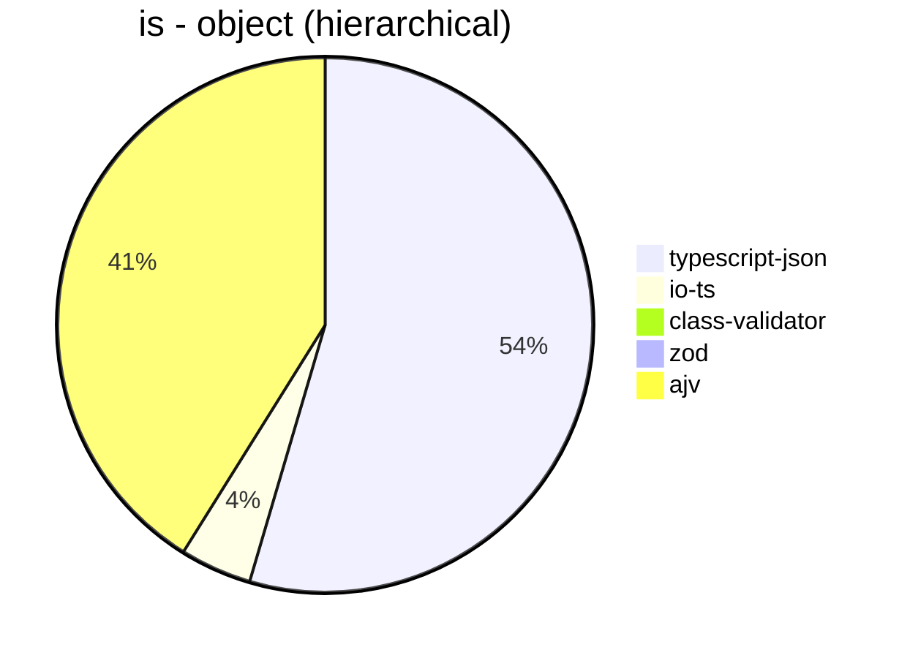
```mermaid
pie title is - object (hierarchical)
  "typescript-json": 117550.32080659945
  "io-ts": 9327.624309392266
  "class-validator": 71.96210603024231
  "zod": 422.90909090909093
  "ajv": 88593.7037037037
```

```mermaid
pie title is - object (recursive)
  "typescript-json": 85109.68687053653
  "io-ts": 4968.164453338185
  "class-validator": 45.83410651326776
  "zod": 74.53301276123544
  "ajv": 0
```

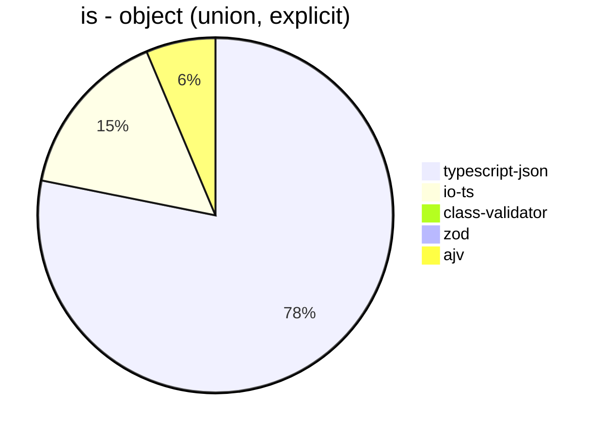
```mermaid
pie title is - object (union, explicit)
  "typescript-json": 16533.697632058287
  "io-ts": 3281.657018813314
  "class-validator": 18.423932871214884
  "zod": 36.6327474560592
  "ajv": 1339.7250361794502
```

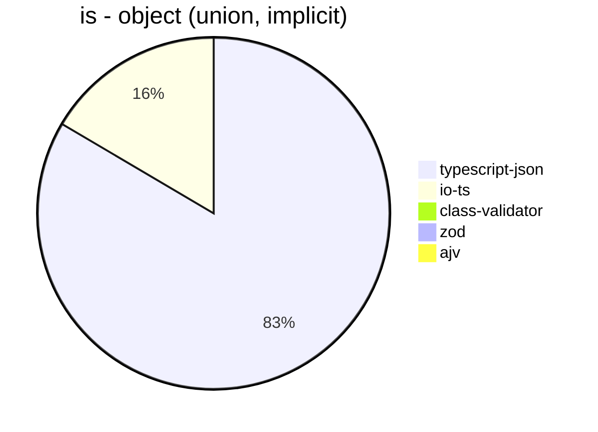
```mermaid
pie title is - object (union, implicit)
  "typescript-json": 16042.139384116694
  "io-ts": 3173.1182795698924
  "class-validator": 18.81224640354113
  "zod": 54.62737000187723
  "ajv": 0
```

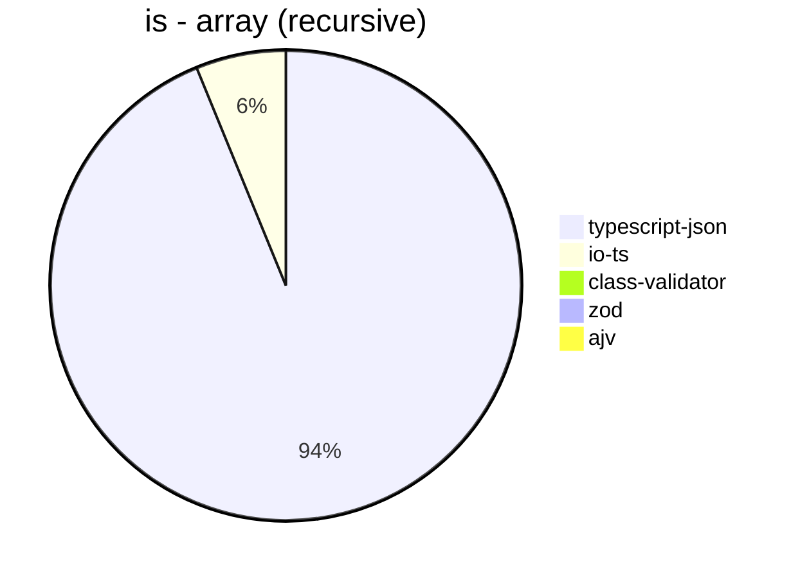
```mermaid
pie title is - array (recursive)
  "typescript-json": 7907.040704070408
  "io-ts": 521.1320754716982
  "class-validator": 3.9727582292849037
  "zod": 9.513150531617237
  "ajv": 0
```

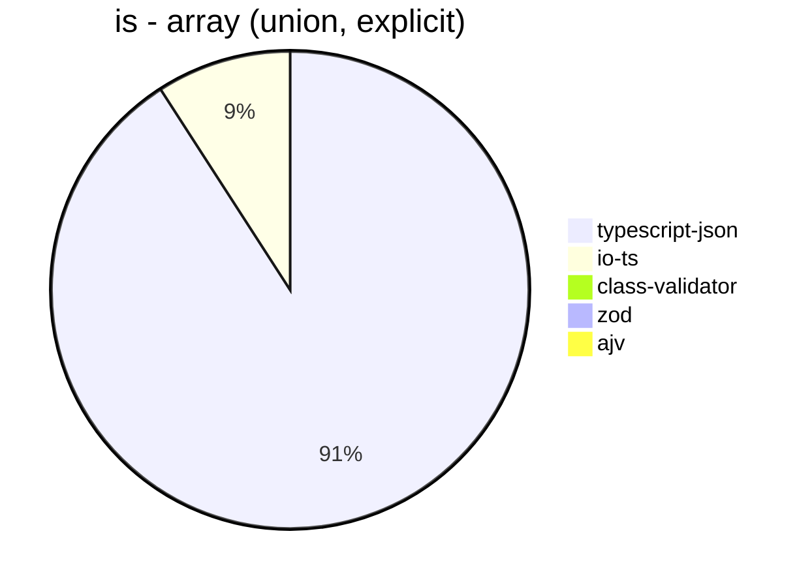
```mermaid
pie title is - array (union, explicit)
  "typescript-json": 3991.2885662431945
  "io-ts": 400.6949524506218
  "class-validator": 8.267568583239383
  "zod": 2.9923321488685244
  "ajv": 0
```

```mermaid
pie title is - array (union, implicit)
  "typescript-json": 4115.482695810564
  "io-ts": 479.89427978100815
  "class-validator": 9.972801450589303
  "zod": 3.949595636637201
  "ajv": 0
```

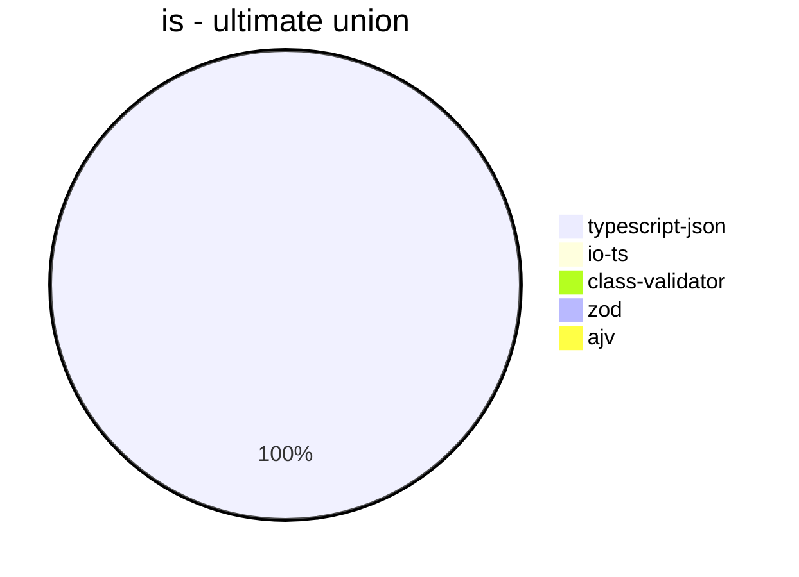
```mermaid
pie title is - ultimate union
  "typescript-json": 654.9909255898367
  "io-ts": 0
  "class-validator": 0
  "zod": 0
  "ajv": 0
```

## assert
 Components | typescript-json | class-validator | io-ts | zod 
------------|-----------------|-----------------|-------|-----
object (hierarchical) | 26022.03906110016 | 69.37033084311634 | 4102.685050798259 | 451.5031196823596
object (recursive) | 35776.80402759649 | 45.84261321455085 | 2056.0296846011133 | 76.89491028927134
object (union, explicit) | 5469.229380978162 | 18.613138686131386 | 1351.7651296829972 | 37.735849056603776
object (union, implicit) | 5295.319465081723 | 19.47200898708107 | 933.083511777302 | 55.2423900789177
array (recursive) | 1716.1789066813915 | 3.949595636637201 | 183.69565217391306 | 9.884052461509219
array (union, explicit) | 2321.2836591663595 | 8.12274368231047 | 91.19095385737735 | 2.9784065524944157
array (union, implicit) | 2006.63082437276 | 10.056683123057232 | 129.4776119402985 | 4.1368935690109065
ultimate union | 293.9232605103727 | Failed | Failed | Failed

```mermaid
pie title assert - object (hierarchical)
  "typescript-json": 26022.03906110016
  "class-validator": 69.37033084311634
  "io-ts": 4102.685050798259
  "zod": 451.5031196823596
```

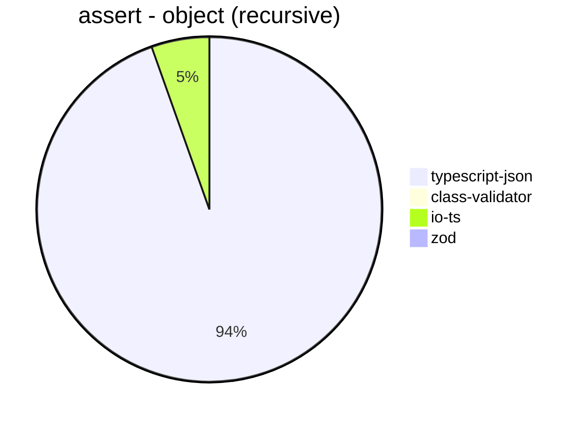
```mermaid
pie title assert - object (recursive)
  "typescript-json": 35776.80402759649
  "class-validator": 45.84261321455085
  "io-ts": 2056.0296846011133
  "zod": 76.89491028927134
```

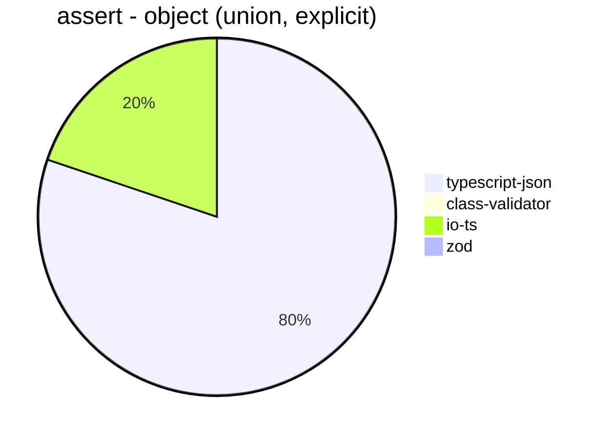
```mermaid
pie title assert - object (union, explicit)
  "typescript-json": 5469.229380978162
  "class-validator": 18.613138686131386
  "io-ts": 1351.7651296829972
  "zod": 37.735849056603776
```

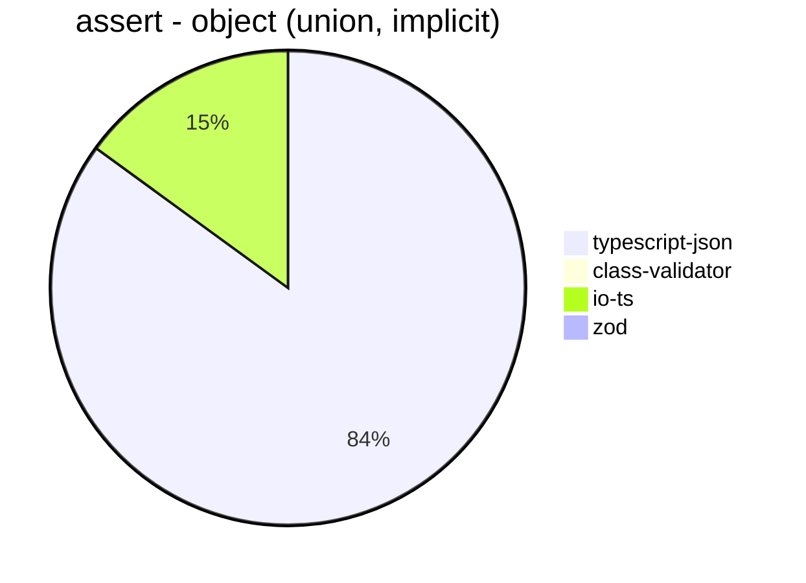
```mermaid
pie title assert - object (union, implicit)
  "typescript-json": 5295.319465081723
  "class-validator": 19.47200898708107
  "io-ts": 933.083511777302
  "zod": 55.2423900789177
```

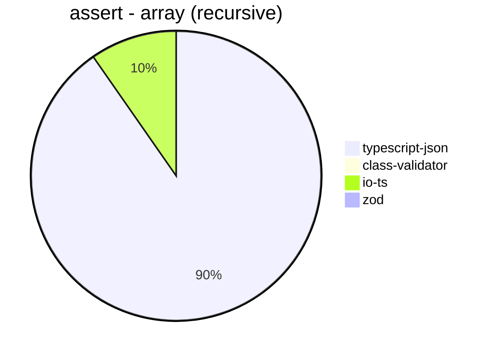
```mermaid
pie title assert - array (recursive)
  "typescript-json": 1716.1789066813915
  "class-validator": 3.949595636637201
  "io-ts": 183.69565217391306
  "zod": 9.884052461509219
```

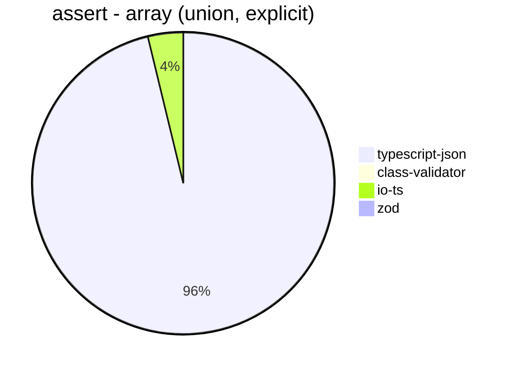
```mermaid
pie title assert - array (union, explicit)
  "typescript-json": 2321.2836591663595
  "class-validator": 8.12274368231047
  "io-ts": 91.19095385737735
  "zod": 2.9784065524944157
```

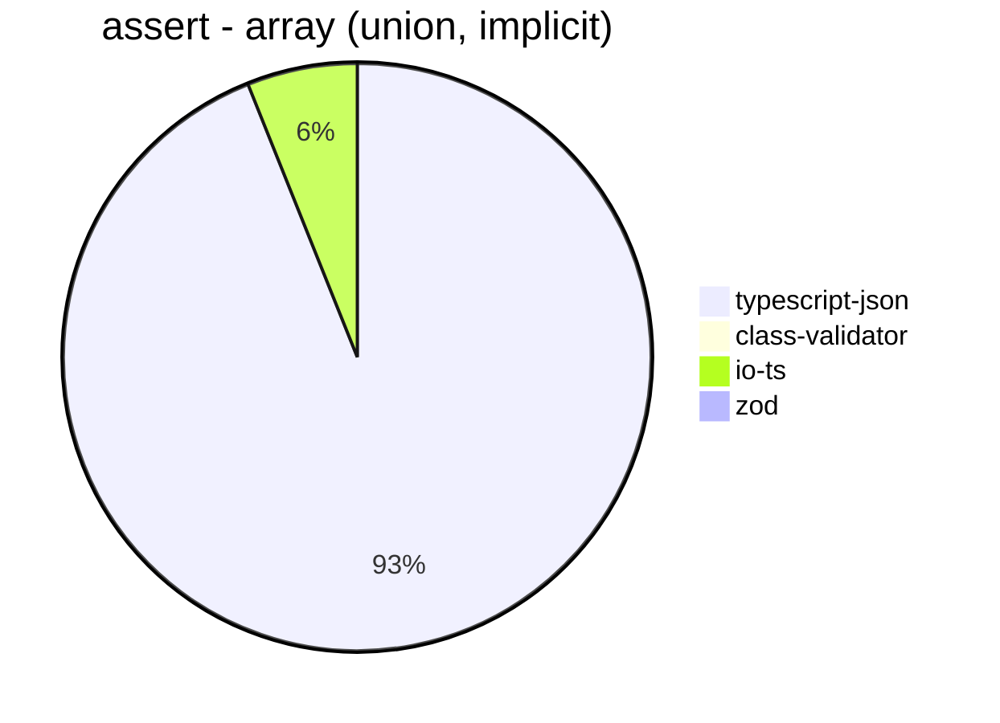
```mermaid
pie title assert - array (union, implicit)
  "typescript-json": 2006.63082437276
  "class-validator": 10.056683123057232
  "io-ts": 129.4776119402985
  "zod": 4.1368935690109065
```

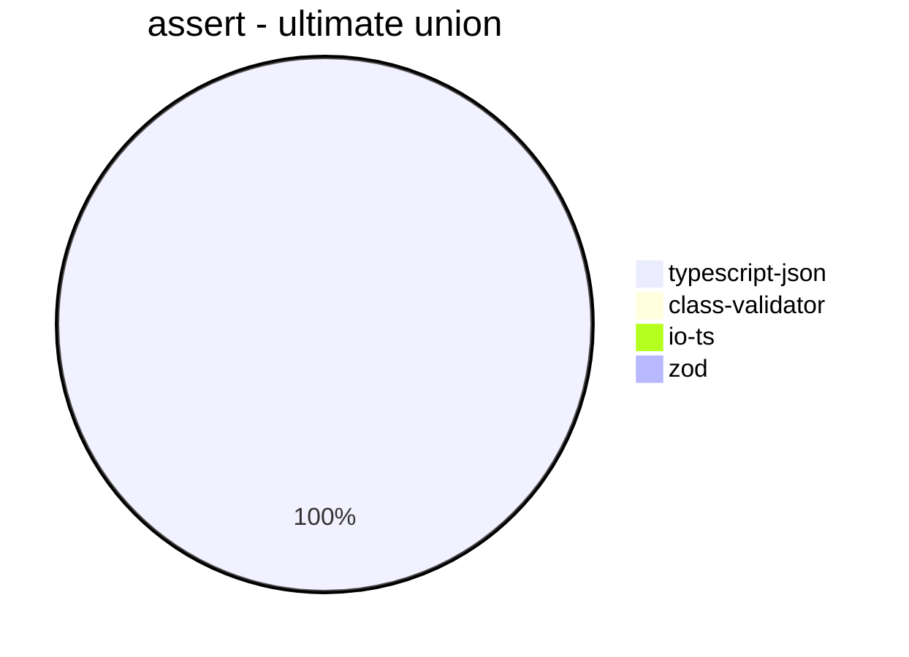
```mermaid
pie title assert - ultimate union
  "typescript-json": 293.9232605103727
  "class-validator": 0
  "io-ts": 0
  "zod": 0
```

## valiadate
 Components | typescript-json | class-validator | io-ts | zod 
------------|-----------------|-----------------|-------|-----
object (hierarchical) | 19861.89069423929 | 68.72121856181367 | 3985.2065668410605 | 441.14370590419605
object (recursive) | 20181.12660749864 | 44.10973641742873 | 1802.8169014084506 | 79.879427279578
object (union, explicit) | 4051.9903912148247 | 18.34372217275156 | 1161.2903225806451 | 37.023115955647434
object (union, implicit) | 4972.537532039546 | 19.037159070108 | 926.3099426032217 | 53.994082840236686
array (recursive) | 1253.012048192771 | 3.9637599093997733 | 190.06755523096584 | 10.013225014169658
array (union, explicit) | 1841.2162162162163 | 8.19373634377276 | 94.45701357466064 | 3.0024394820791893
array (union, implicit) | 1751.955903271693 | 10.381905821282906 | 127.06362455945094 | 3.9562923888470234
ultimate union | 180.29538904899135 | Failed | Failed | Failed

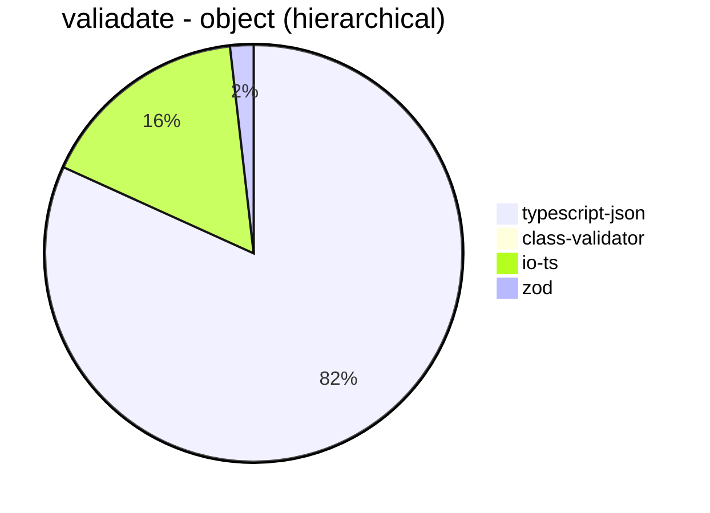
```mermaid
pie title valiadate - object (hierarchical)
  "typescript-json": 19861.89069423929
  "class-validator": 68.72121856181367
  "io-ts": 3985.2065668410605
  "zod": 441.14370590419605
```

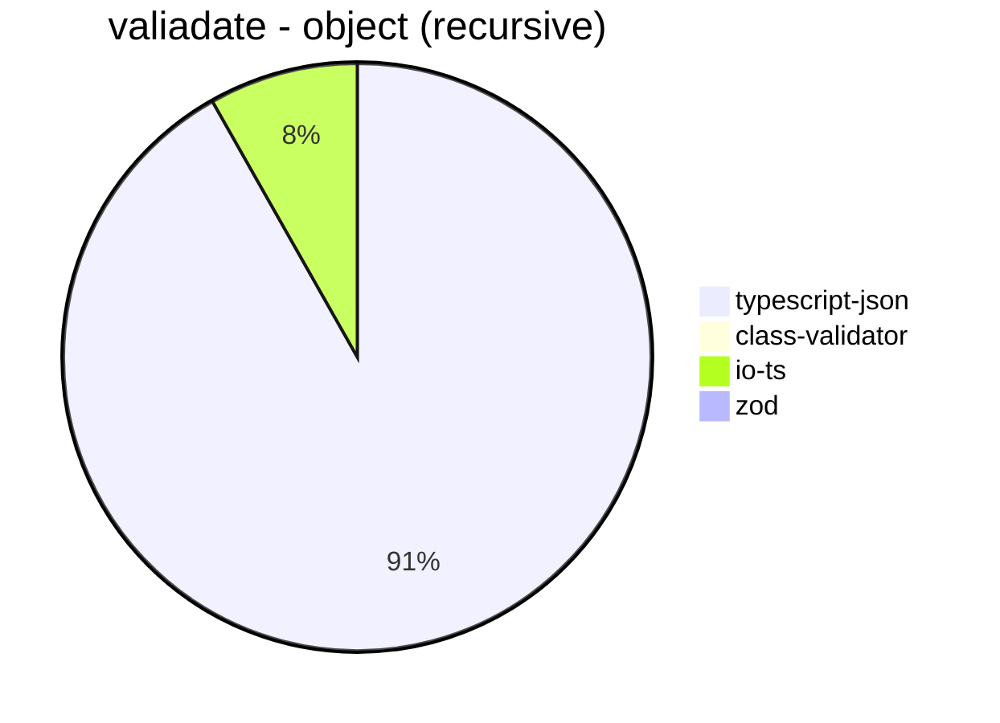
```mermaid
pie title valiadate - object (recursive)
  "typescript-json": 20181.12660749864
  "class-validator": 44.10973641742873
  "io-ts": 1802.8169014084506
  "zod": 79.879427279578
```

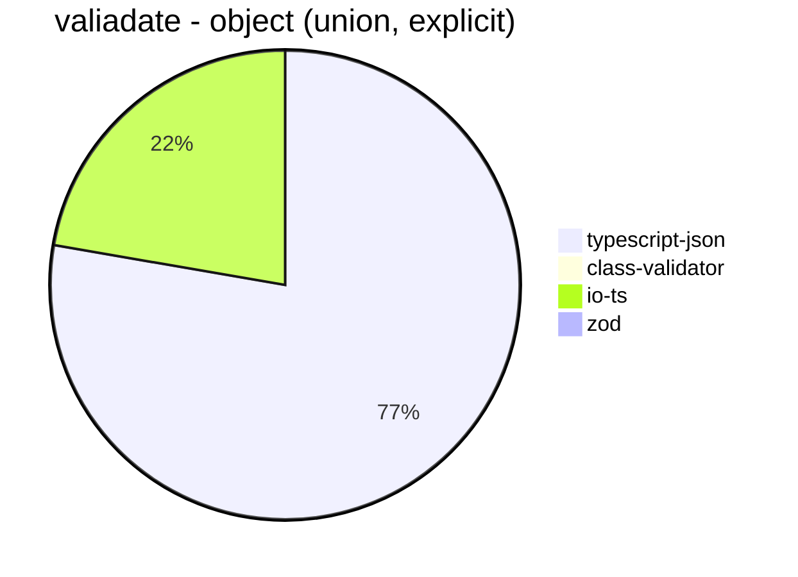
```mermaid
pie title valiadate - object (union, explicit)
  "typescript-json": 4051.9903912148247
  "class-validator": 18.34372217275156
  "io-ts": 1161.2903225806451
  "zod": 37.023115955647434
```

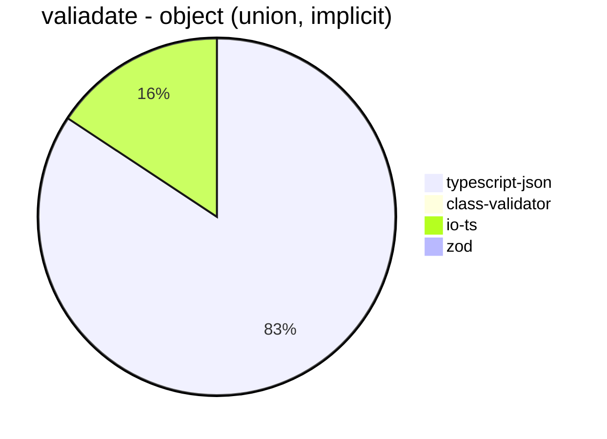
```mermaid
pie title valiadate - object (union, implicit)
  "typescript-json": 4972.537532039546
  "class-validator": 19.037159070108
  "io-ts": 926.3099426032217
  "zod": 53.994082840236686
```

```mermaid
pie title valiadate - array (recursive)
  "typescript-json": 1253.012048192771
  "class-validator": 3.9637599093997733
  "io-ts": 190.06755523096584
  "zod": 10.013225014169658
```

```mermaid
pie title valiadate - array (union, explicit)
  "typescript-json": 1841.2162162162163
  "class-validator": 8.19373634377276
  "io-ts": 94.45701357466064
  "zod": 3.0024394820791893
```

```mermaid
pie title valiadate - array (union, implicit)
  "typescript-json": 1751.955903271693
  "class-validator": 10.381905821282906
  "io-ts": 127.06362455945094
  "zod": 3.9562923888470234
```

```mermaid
pie title valiadate - ultimate union
  "typescript-json": 180.29538904899135
  "class-validator": 0
  "io-ts": 0
  "zod": 0
```

## optimizer
 Components | typescript-json | fast-json-stringify | JSON.stringify() 
------------|-----------------|---------------------|------------------
object (simple) | 153643.99214425994 | 32.34501347708895 | 6616.58698050754
object (hierarchical) | 5017.534246575343 | 12.184033460629205 | 1716.446124763705
object (recursive) | 5644.823788546255 | 81.17186042172047 | 1248.6378496185978
object (union) | 2352.5049737746426 | 1.2556053811659191 | 961.0967024824009
array (hierarchical) | 106.45339216767788 | 10.91867469879518 | 49.42400594574508
array (recursive) | 265.4883381924198 | 52.07166853303472 | 137.75606089081
array (union) | 348.50385235620854 | 3.1319086219602066 | 276.57992565055764
ultimate union | 138.56278904304517 | 0.16663889351774702 | 203.63838871356973

```mermaid
pie title optimizer - object (simple)
  "typescript-json": 153643.99214425994
  "fast-json-stringify": 32.34501347708895
  "JSON.stringify()": 6616.58698050754
```

```mermaid
pie title optimizer - object (hierarchical)
  "typescript-json": 5017.534246575343
  "fast-json-stringify": 12.184033460629205
  "JSON.stringify()": 1716.446124763705
```

```mermaid
pie title optimizer - object (recursive)
  "typescript-json": 5644.823788546255
  "fast-json-stringify": 81.17186042172047
  "JSON.stringify()": 1248.6378496185978
```

```mermaid
pie title optimizer - object (union)
  "typescript-json": 2352.5049737746426
  "fast-json-stringify": 1.2556053811659191
  "JSON.stringify()": 961.0967024824009
```

```mermaid
pie title optimizer - array (hierarchical)
  "typescript-json": 106.45339216767788
  "fast-json-stringify": 10.91867469879518
  "JSON.stringify()": 49.42400594574508
```

```mermaid
pie title optimizer - array (recursive)
  "typescript-json": 265.4883381924198
  "fast-json-stringify": 52.07166853303472
  "JSON.stringify()": 137.75606089081
```

```mermaid
pie title optimizer - array (union)
  "typescript-json": 348.50385235620854
  "fast-json-stringify": 3.1319086219602066
  "JSON.stringify()": 276.57992565055764
```

```mermaid
pie title optimizer - ultimate union
  "typescript-json": 138.56278904304517
  "fast-json-stringify": 0.16663889351774702
  "JSON.stringify()": 203.63838871356973
```

## stringify
 Components | typescript-json | fast-json-stringify | JSON.stringify() 
------------|-----------------|---------------------|------------------
object (simple) | 155006.22368661908 | 31045.721630554537 | 6667.037449017426
object (hierarchical) | 5452.536231884058 | 5130.256026910858 | 1709.8105421121738
object (recursive) | 5872.413793103448 | 1287.4127193810152 | 1278.1716417910447
object (union) | 2276.8981648074846 | 1677.730192719486 | 960.8461681202449
array (hierarchical) | 180.08948545861298 | 243.3382679496669 | 81.23042917664395
array (recursive) | 274.16974169741695 | 136.4398881640261 | 134.24052960647296
array (union) | 355.63703024747934 | 238.1630473478106 | 276.671010984919
ultimate union | 141.55169324493818 | 78.26694619147449 | 202.24099926524613

```mermaid
pie title stringify - object (simple)
  "typescript-json": 155006.22368661908
  "fast-json-stringify": 31045.721630554537
  "JSON.stringify()": 6667.037449017426
```

```mermaid
pie title stringify - object (hierarchical)
  "typescript-json": 5452.536231884058
  "fast-json-stringify": 5130.256026910858
  "JSON.stringify()": 1709.8105421121738
```

```mermaid
pie title stringify - object (recursive)
  "typescript-json": 5872.413793103448
  "fast-json-stringify": 1287.4127193810152
  "JSON.stringify()": 1278.1716417910447
```

```mermaid
pie title stringify - object (union)
  "typescript-json": 2276.8981648074846
  "fast-json-stringify": 1677.730192719486
  "JSON.stringify()": 960.8461681202449
```

```mermaid
pie title stringify - array (hierarchical)
  "typescript-json": 180.08948545861298
  "fast-json-stringify": 243.3382679496669
  "JSON.stringify()": 81.23042917664395
```

```mermaid
pie title stringify - array (recursive)
  "typescript-json": 274.16974169741695
  "fast-json-stringify": 136.4398881640261
  "JSON.stringify()": 134.24052960647296
```

```mermaid
pie title stringify - array (union)
  "typescript-json": 355.63703024747934
  "fast-json-stringify": 238.1630473478106
  "JSON.stringify()": 276.671010984919
```

```mermaid
pie title stringify - ultimate union
  "typescript-json": 141.55169324493818
  "fast-json-stringify": 78.26694619147449
  "JSON.stringify()": 202.24099926524613
```

