# Benchmark of `typescript-json`
> CPU: AMD Ryzen 9 5900HX with Radeon Graphics
> Memory: 64,928 MB
> NodeJS version: v16.16.0
> TypeScript-JSON version: 3.3.12

## is
 Components | typescript-json | typebox | ajv | io-ts | class-validator | zod 
------------|-----------------|---------|-----|-------|-----------------|-----
object (hierarchical) | 117845.05232237928 | 196188.82395909424 | 94026.64430780697 | 9165.611028315945 | 65.35720493655484 | 429.7460259455509
object (recursive) | 84088.05147058822 | 86140.84003574621 | Failed | 4969.303201506592 | 41.51010914295938 | 74.92039707810451
object (union, explicit) | 16115.772119435795 | 13644.412191582003 | 1346.516355571983 | 3337.4370453273646 | 17.705643673921063 | 35.31124863487441
object (union, implicit) | 14110.040755835495 | Failed | 4844.519646550103 | Failed | 17.824663514005092 | 19.901440485216074
array (recursive) | 7841.00185528757 | 7081.461675579322 | Failed | 508.5253887952033 | 3.779289493575208 | 9.37031484257871
array (union, explicit) | 3960.4499274310597 | 1948.9361702127658 | Failed | 374.68030690537086 | 7.5904677846425415 | 3.022289384208538
array (union, implicit) | 4017.1002364926326 | 2379.8677443056577 | Failed | 449.63558213418054 | 9.816632709761066 | 3.975766755017039
ultimate union | 616.6850422638736 | 315.9259259259259 | Failed | Failed | Failed | 0.3537318712415989

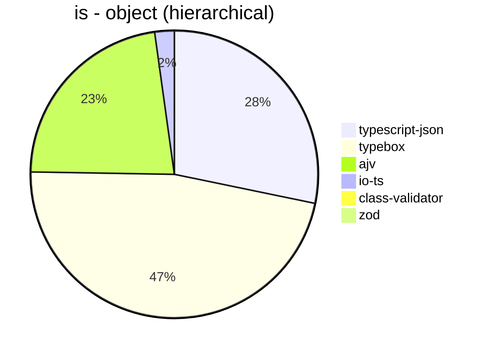
```mermaid
pie title is - object (hierarchical)
  "typescript-json": 117845.05232237928
  "typebox": 196188.82395909424
  "ajv": 94026.64430780697
  "io-ts": 9165.611028315945
  "class-validator": 65.35720493655484
  "zod": 429.7460259455509
```

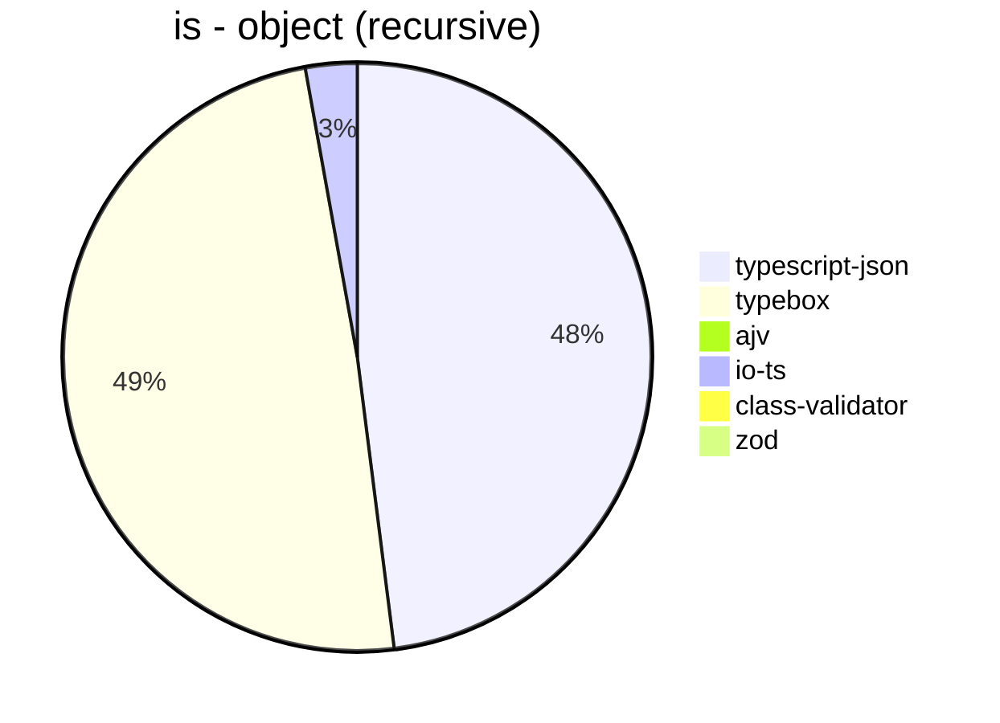
```mermaid
pie title is - object (recursive)
  "typescript-json": 84088.05147058822
  "typebox": 86140.84003574621
  "ajv": 0
  "io-ts": 4969.303201506592
  "class-validator": 41.51010914295938
  "zod": 74.92039707810451
```

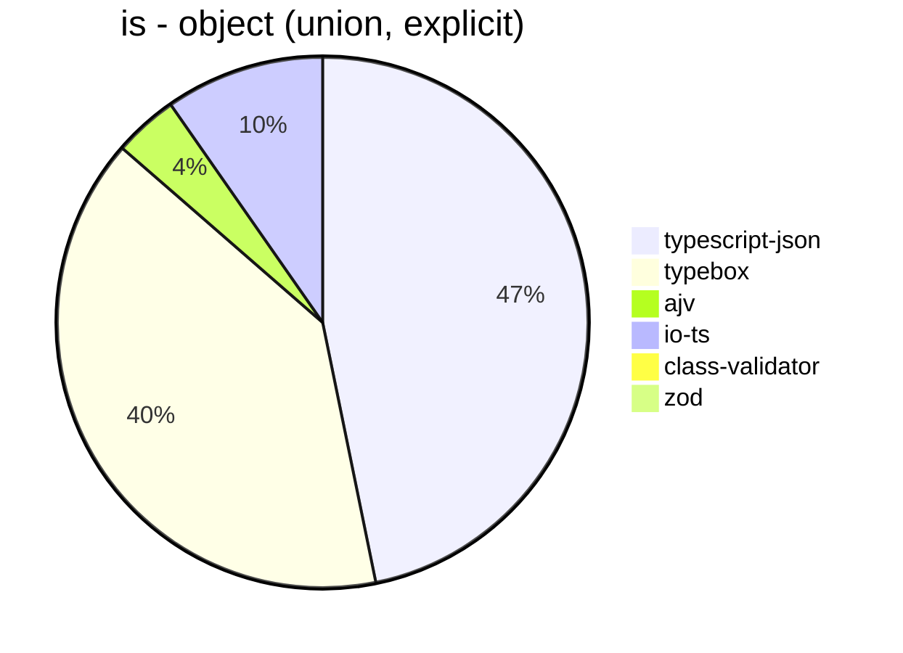
```mermaid
pie title is - object (union, explicit)
  "typescript-json": 16115.772119435795
  "typebox": 13644.412191582003
  "ajv": 1346.516355571983
  "io-ts": 3337.4370453273646
  "class-validator": 17.705643673921063
  "zod": 35.31124863487441
```

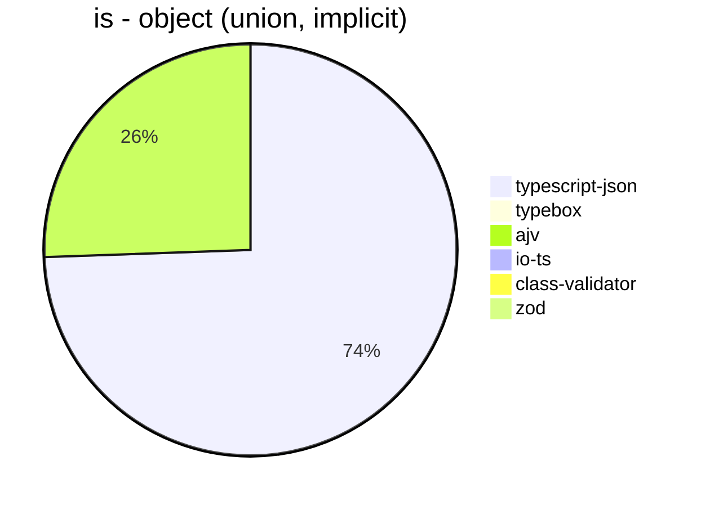
```mermaid
pie title is - object (union, implicit)
  "typescript-json": 14110.040755835495
  "typebox": 0
  "ajv": 4844.519646550103
  "io-ts": 0
  "class-validator": 17.824663514005092
  "zod": 19.901440485216074
```

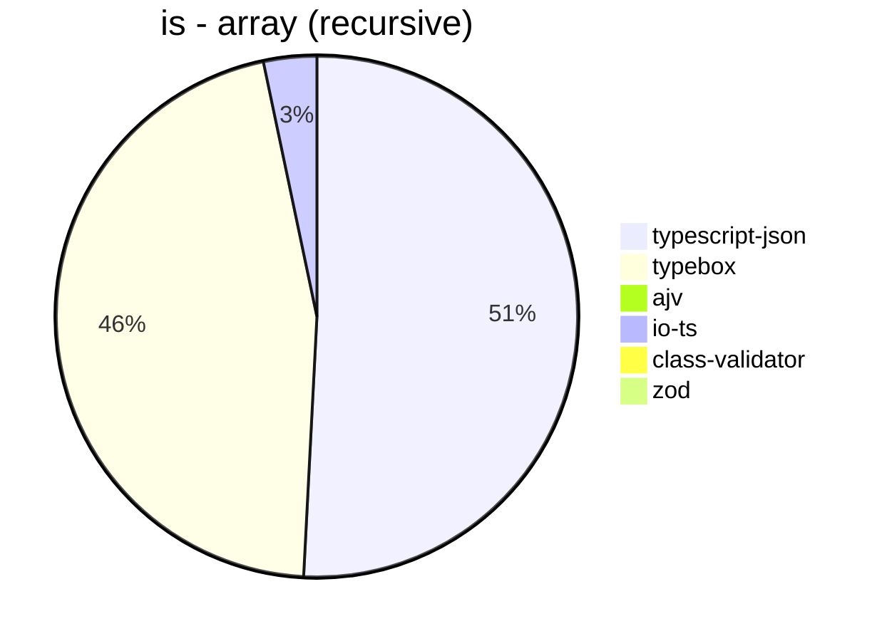
```mermaid
pie title is - array (recursive)
  "typescript-json": 7841.00185528757
  "typebox": 7081.461675579322
  "ajv": 0
  "io-ts": 508.5253887952033
  "class-validator": 3.779289493575208
  "zod": 9.37031484257871
```

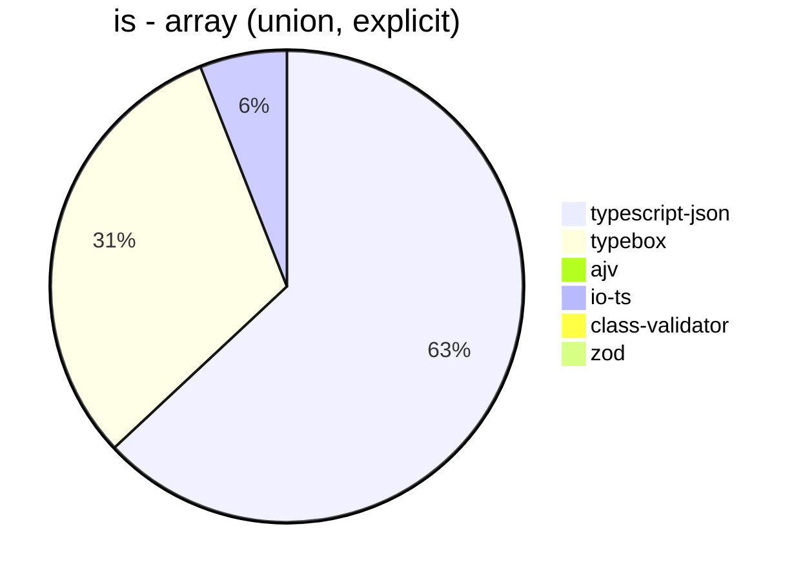
```mermaid
pie title is - array (union, explicit)
  "typescript-json": 3960.4499274310597
  "typebox": 1948.9361702127658
  "ajv": 0
  "io-ts": 374.68030690537086
  "class-validator": 7.5904677846425415
  "zod": 3.022289384208538
```

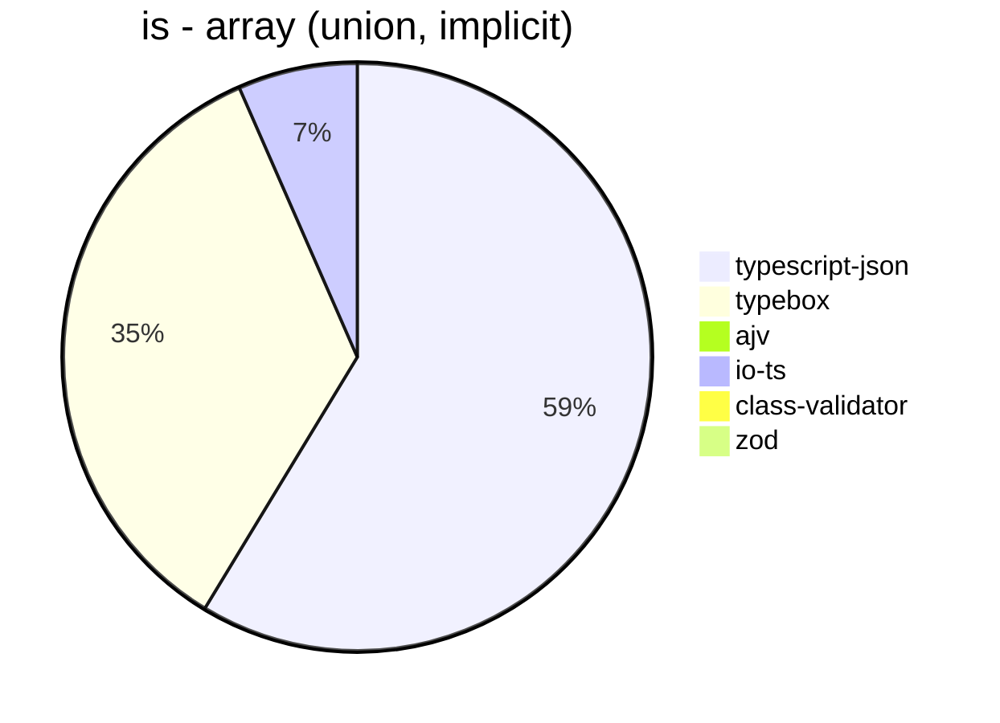
```mermaid
pie title is - array (union, implicit)
  "typescript-json": 4017.1002364926326
  "typebox": 2379.8677443056577
  "ajv": 0
  "io-ts": 449.63558213418054
  "class-validator": 9.816632709761066
  "zod": 3.975766755017039
```

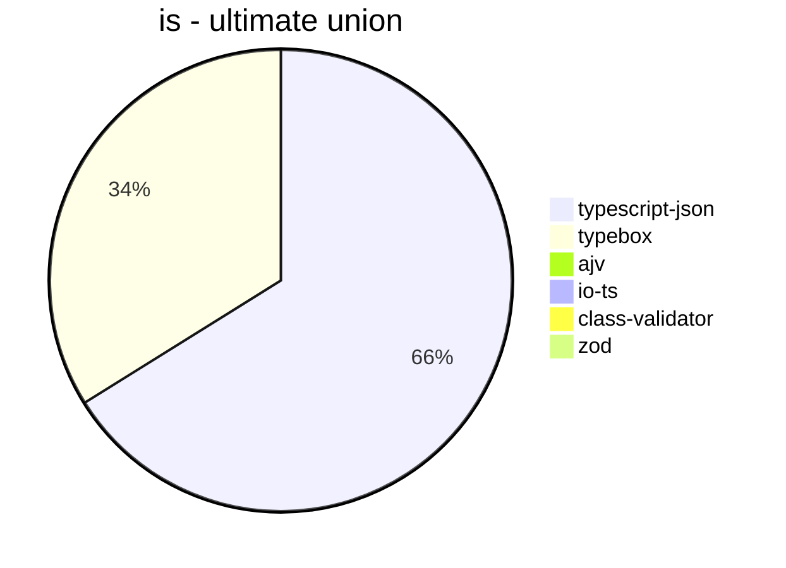
```mermaid
pie title is - ultimate union
  "typescript-json": 616.6850422638736
  "typebox": 315.9259259259259
  "ajv": 0
  "io-ts": 0
  "class-validator": 0
  "zod": 0.3537318712415989
```

## assert
 Components | typescript-json | typebox | io-ts | zod | class-validator 
------------|-----------------|---------|-------|-----|-----------------
object (hierarchical) | 22979.15218902015 | 1019.412191582003 | 4256.124721603564 | 439.7974493623406 | 68.41909023117077
object (recursive) | 35552.97397769517 | 435.6510269455436 | 1975.399302368276 | 77.37089201877934 | 42.86489419424851
object (union, explicit) | 5302.40427426536 | 177.13004484304932 | 1324.2251971391893 | 35.89177250138045 | 18.17180616740088
object (union, implicit) | 5325.822278757041 | 76.83883920423435 | 335.9542530378842 | 18.57467778620167 | 17.27661155489504
array (recursive) | 1707.052108267354 | 41.85103244837758 | 182.28217280349983 | 9.69968289498228 | 3.986332574031891
array (union, explicit) | 2168.768011527378 | 21.892527591821963 | 88.83575501195511 | 3.0205776854823485 | 8.170245107353221
array (union, implicit) | 2004.5720555961962 | 29.389600602863602 | 120.72138387927862 | 3.9727582292849037 | 9.818451278251205
ultimate union | 261.84493898061737 | 4.77326968973747 | Failed | 0.3577177606868181 | Failed

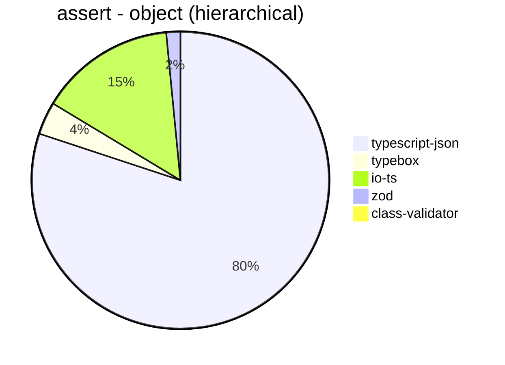
```mermaid
pie title assert - object (hierarchical)
  "typescript-json": 22979.15218902015
  "typebox": 1019.412191582003
  "io-ts": 4256.124721603564
  "zod": 439.7974493623406
  "class-validator": 68.41909023117077
```

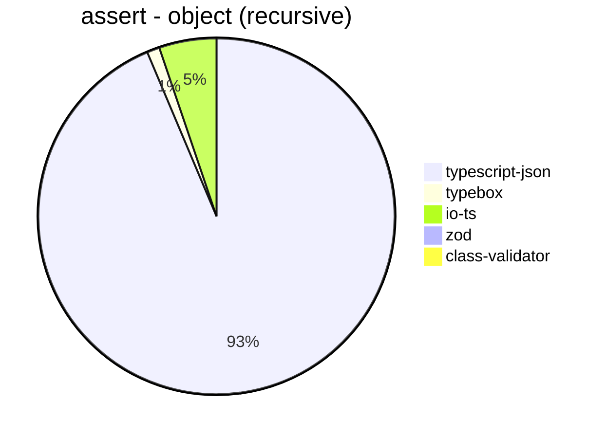
```mermaid
pie title assert - object (recursive)
  "typescript-json": 35552.97397769517
  "typebox": 435.6510269455436
  "io-ts": 1975.399302368276
  "zod": 77.37089201877934
  "class-validator": 42.86489419424851
```

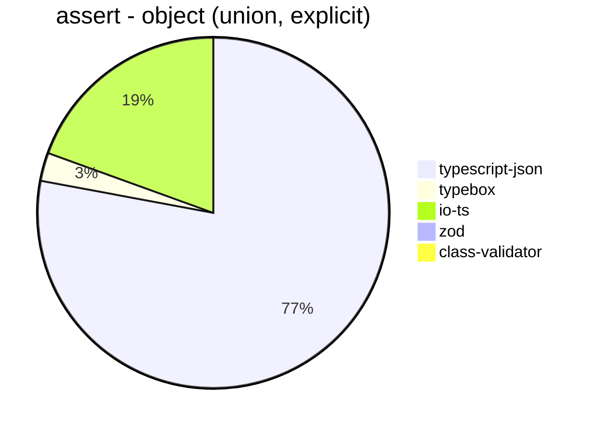
```mermaid
pie title assert - object (union, explicit)
  "typescript-json": 5302.40427426536
  "typebox": 177.13004484304932
  "io-ts": 1324.2251971391893
  "zod": 35.89177250138045
  "class-validator": 18.17180616740088
```

```mermaid
pie title assert - object (union, implicit)
  "typescript-json": 5325.822278757041
  "typebox": 76.83883920423435
  "io-ts": 335.9542530378842
  "zod": 18.57467778620167
  "class-validator": 17.27661155489504
```

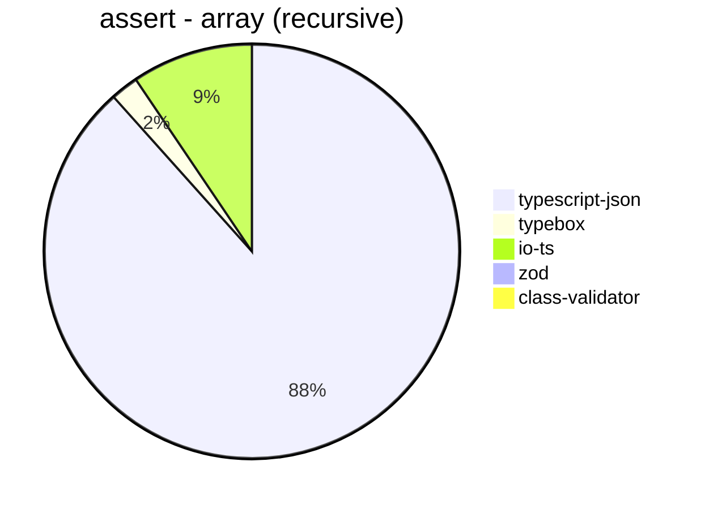
```mermaid
pie title assert - array (recursive)
  "typescript-json": 1707.052108267354
  "typebox": 41.85103244837758
  "io-ts": 182.28217280349983
  "zod": 9.69968289498228
  "class-validator": 3.986332574031891
```

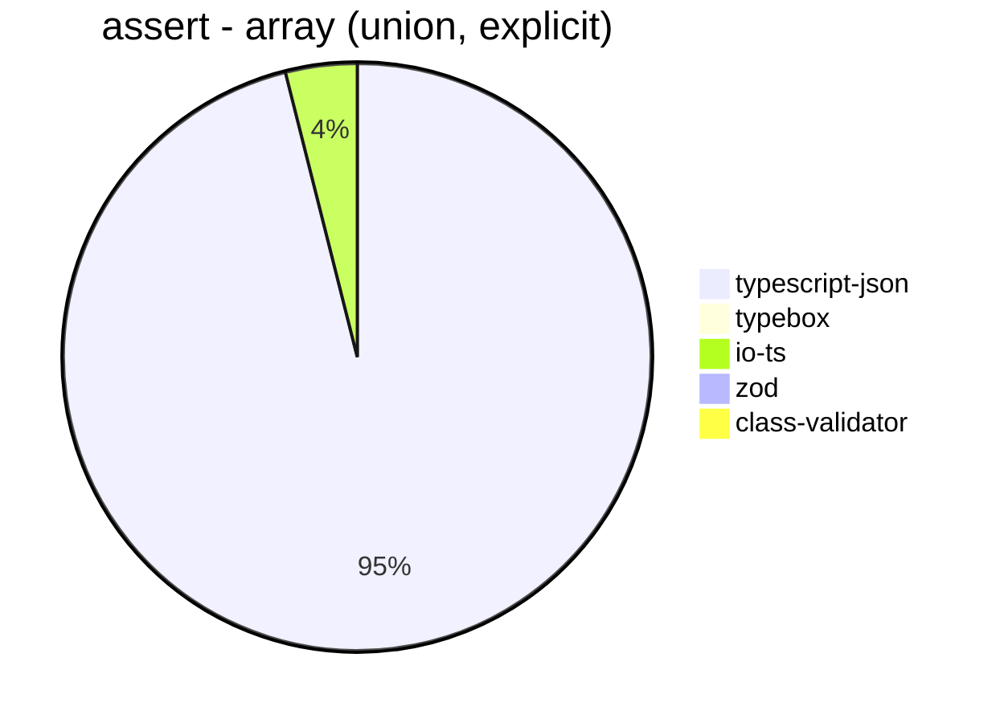
```mermaid
pie title assert - array (union, explicit)
  "typescript-json": 2168.768011527378
  "typebox": 21.892527591821963
  "io-ts": 88.83575501195511
  "zod": 3.0205776854823485
  "class-validator": 8.170245107353221
```

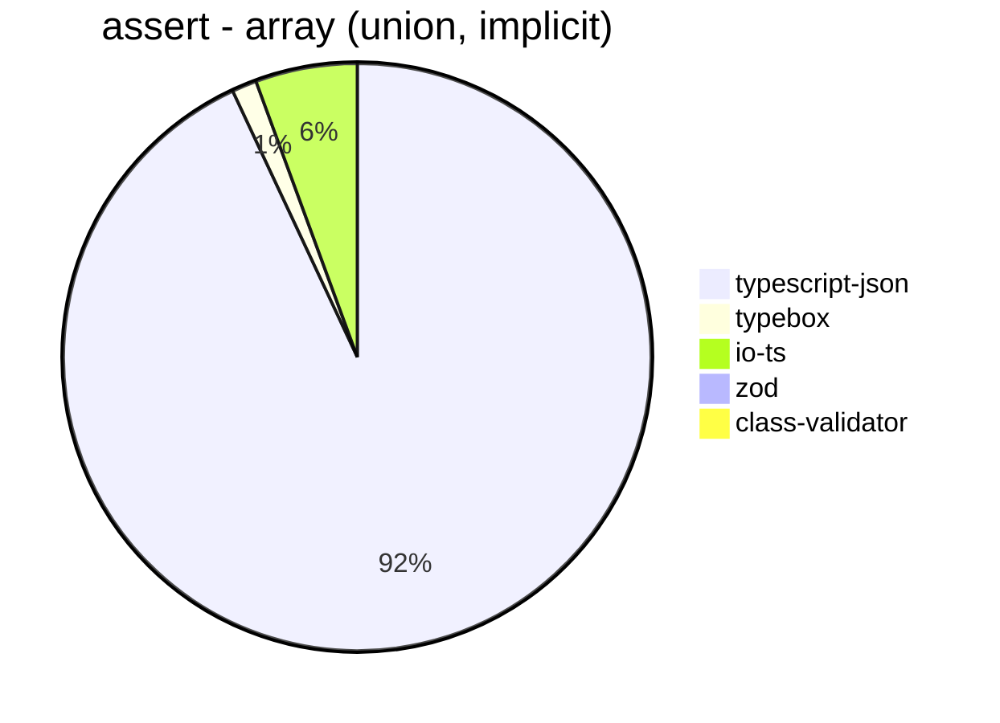
```mermaid
pie title assert - array (union, implicit)
  "typescript-json": 2004.5720555961962
  "typebox": 29.389600602863602
  "io-ts": 120.72138387927862
  "zod": 3.9727582292849037
  "class-validator": 9.818451278251205
```

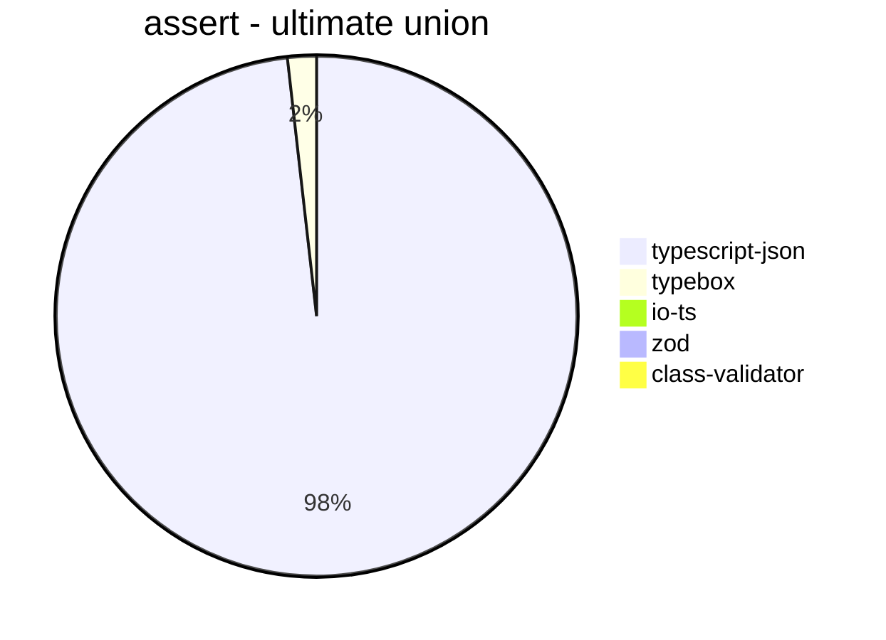
```mermaid
pie title assert - ultimate union
  "typescript-json": 261.84493898061737
  "typebox": 4.77326968973747
  "io-ts": 0
  "zod": 0.3577177606868181
  "class-validator": 0
```

## valiadate
 Components | typescript-json | typebox | io-ts | zod | class-validator 
------------|-----------------|---------|-------|-----|-----------------
object (hierarchical) | 18125.236538792364 | 904.7191817692445 | 3891.1501120238986 | 441.8692293197663 | 68.99096107729201
object (recursive) | 19880.267679508048 | 400.323275862069 | 1815.270490320246 | 77.95394488486221 | 41.431593794076164
object (union, explicit) | 4255.326898561282 | 174.1030777636132 | 1189.0841813135985 | 35.960499347866595 | 18.273354465784074
object (union, implicit) | 3800.622514265952 | 80.07626310772164 | 346.65207079000186 | 18.765246762994934 | 17.320803390455133
array (recursive) | 1098.9676041295834 | 43.4947049924357 | 182.87079580959383 | 9.880296408892267 | 3.9652567975830815
array (union, explicit) | 1913.7345954634754 | 22.45314529597328 | 88.78760255241568 | 3.0326004548900682 | 7.924806487283449
array (union, implicit) | 1731.066176470588 | 29.104887424492038 | 120.30623405030988 | 4.16036308623298 | 10.01890359168242
ultimate union | 159.8639455782313 | 5.07900677200903 | Failed | 0.35707909301910373 | Failed

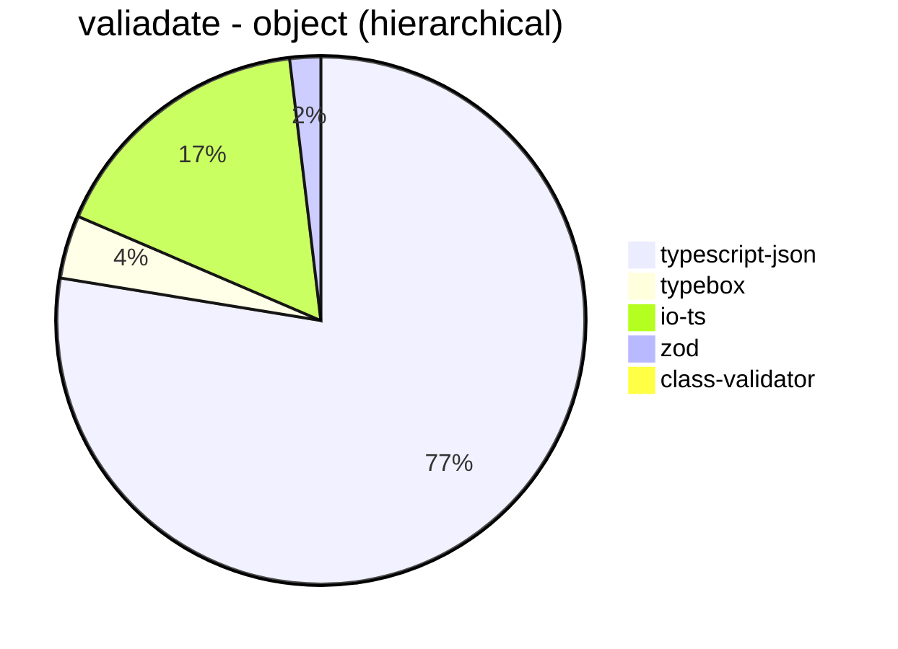
```mermaid
pie title valiadate - object (hierarchical)
  "typescript-json": 18125.236538792364
  "typebox": 904.7191817692445
  "io-ts": 3891.1501120238986
  "zod": 441.8692293197663
  "class-validator": 68.99096107729201
```

```mermaid
pie title valiadate - object (recursive)
  "typescript-json": 19880.267679508048
  "typebox": 400.323275862069
  "io-ts": 1815.270490320246
  "zod": 77.95394488486221
  "class-validator": 41.431593794076164
```

```mermaid
pie title valiadate - object (union, explicit)
  "typescript-json": 4255.326898561282
  "typebox": 174.1030777636132
  "io-ts": 1189.0841813135985
  "zod": 35.960499347866595
  "class-validator": 18.273354465784074
```

```mermaid
pie title valiadate - object (union, implicit)
  "typescript-json": 3800.622514265952
  "typebox": 80.07626310772164
  "io-ts": 346.65207079000186
  "zod": 18.765246762994934
  "class-validator": 17.320803390455133
```

```mermaid
pie title valiadate - array (recursive)
  "typescript-json": 1098.9676041295834
  "typebox": 43.4947049924357
  "io-ts": 182.87079580959383
  "zod": 9.880296408892267
  "class-validator": 3.9652567975830815
```

```mermaid
pie title valiadate - array (union, explicit)
  "typescript-json": 1913.7345954634754
  "typebox": 22.45314529597328
  "io-ts": 88.78760255241568
  "zod": 3.0326004548900682
  "class-validator": 7.924806487283449
```

```mermaid
pie title valiadate - array (union, implicit)
  "typescript-json": 1731.066176470588
  "typebox": 29.104887424492038
  "io-ts": 120.30623405030988
  "zod": 4.16036308623298
  "class-validator": 10.01890359168242
```

```mermaid
pie title valiadate - ultimate union
  "typescript-json": 159.8639455782313
  "typebox": 5.07900677200903
  "io-ts": 0
  "zod": 0.35707909301910373
  "class-validator": 0
```

## optimizer
 Components | typescript-json | ajv | typebox 
------------|-----------------|-----|---------
object (hierarchical) | 104900.76869322151 | 5.171184022824536 | 219.10620589831734
object (recursive) | 80963.93324959626 | 9.589288945178216 | 912.5
object (union) | 13237.905417648124 | 4.826434007796547 | 92.68555037647901
array (hierarchical) | 18968.613775065387 | 6.97503671071953 | 1086.3499245852186
array (recursive) | 6393.045112781954 | 10.051169590643275 | 926.7833615659703
array (union) | 3924.2369838420104 | 6.8760453447314624 | 269.791474441779
ultimate union | 597.4754558204769 | 0.9097525473071324 | 12.635048525911005

```mermaid
pie title optimizer - object (hierarchical)
  "typescript-json": 104900.76869322151
  "ajv": 5.171184022824536
  "typebox": 219.10620589831734
```

```mermaid
pie title optimizer - object (recursive)
  "typescript-json": 80963.93324959626
  "ajv": 9.589288945178216
  "typebox": 912.5
```

```mermaid
pie title optimizer - object (union)
  "typescript-json": 13237.905417648124
  "ajv": 4.826434007796547
  "typebox": 92.68555037647901
```

```mermaid
pie title optimizer - array (hierarchical)
  "typescript-json": 18968.613775065387
  "ajv": 6.97503671071953
  "typebox": 1086.3499245852186
```

```mermaid
pie title optimizer - array (recursive)
  "typescript-json": 6393.045112781954
  "ajv": 10.051169590643275
  "typebox": 926.7833615659703
```

```mermaid
pie title optimizer - array (union)
  "typescript-json": 3924.2369838420104
  "ajv": 6.8760453447314624
  "typebox": 269.791474441779
```

```mermaid
pie title optimizer - ultimate union
  "typescript-json": 597.4754558204769
  "ajv": 0.9097525473071324
  "typebox": 12.635048525911005
```

## stringify
 Components | typescript-json | fast-json-stringify | JSON.stringify() 
------------|-----------------|---------------------|------------------
object (simple) | 160174.1193648476 | 33108.75525498081 | 6429.221251819505
object (hierarchical) | 5545.867393278838 | 5003.982621288921 | 1672.5189428941048
object (recursive) | 5929.863418235511 | 1247.6190476190477 | 1296.978909367281
object (union) | 1552.2966242390703 | 1506.3768636608586 | 743.184809174657
array (hierarchical) | 183.20044502132396 | 259.7020415670406 | 80.4093567251462
array (recursive) | 267.9891794409378 | 138.28376586474712 | 135.4069659154405
array (union) | 347.5468331846565 | 247.67051807677973 | 275.52160953800296
ultimate union | 128.43394575678042 | 73.76058041112455 | 194.04940119760477

```mermaid
pie title stringify - object (simple)
  "typescript-json": 160174.1193648476
  "fast-json-stringify": 33108.75525498081
  "JSON.stringify()": 6429.221251819505
```

```mermaid
pie title stringify - object (hierarchical)
  "typescript-json": 5545.867393278838
  "fast-json-stringify": 5003.982621288921
  "JSON.stringify()": 1672.5189428941048
```

```mermaid
pie title stringify - object (recursive)
  "typescript-json": 5929.863418235511
  "fast-json-stringify": 1247.6190476190477
  "JSON.stringify()": 1296.978909367281
```

```mermaid
pie title stringify - object (union)
  "typescript-json": 1552.2966242390703
  "fast-json-stringify": 1506.3768636608586
  "JSON.stringify()": 743.184809174657
```

```mermaid
pie title stringify - array (hierarchical)
  "typescript-json": 183.20044502132396
  "fast-json-stringify": 259.7020415670406
  "JSON.stringify()": 80.4093567251462
```

```mermaid
pie title stringify - array (recursive)
  "typescript-json": 267.9891794409378
  "fast-json-stringify": 138.28376586474712
  "JSON.stringify()": 135.4069659154405
```

```mermaid
pie title stringify - array (union)
  "typescript-json": 347.5468331846565
  "fast-json-stringify": 247.67051807677973
  "JSON.stringify()": 275.52160953800296
```

```mermaid
pie title stringify - ultimate union
  "typescript-json": 128.43394575678042
  "fast-json-stringify": 73.76058041112455
  "JSON.stringify()": 194.04940119760477
```

