# Benchmark of `typescript-json`
> CPU: AMD Ryzen 9 5900HX with Radeon Graphics
> Memory: 64,928 MB
> NodeJS version: v16.16.0
> TypeScript-JSON version: 3.3.12


## is
 Components | typescript-json | typebox | ajv | io-ts | class-validator | zod 
------------|-----------------|---------|-----|-------|-----------------|-----
object (hierarchical) | 116633.84615384614 | 186572.3400586308 | 92013.37913578015 | 9175.931021830856 | 65.79643676133357 | 429.03811252268605
object (recursive) | 80975.26113249038 | 85332.54631311297 | Failed | 4780.326665443201 | 43.40567612687813 | 72.08196121478228
object (union, explicit) | 15282.280701754386 | 13801.652892561982 | 1269.3935119887165 | 3233.351283432059 | 18.439187930713356 | 36.53989560029829
object (union, implicit) | 17898.149749265085 | 86323.00556586271 | 4765.4576207479795 | Failed | 18.185192057895712 | 48.03574753304785
array (recursive) | 7894.076397859384 | 7778.453038674033 | Failed | 509.70245795601556 | 3.7878787878787876 | 9.375585974123382
array (union, explicit) | 4127.183406113537 | 1889.5391367959035 | Failed | 400.936329588015 | 7.901506798970966 | 3.003003003003003
array (union, implicit) | 3988.380281690141 | 2410.90573012939 | Failed | 488.49056603773585 | 9.924646204741777 | 3.951825366955213
ultimate union | 601.8148820326679 | 312.29357798165137 | Failed | Failed | Failed | 0.3575898444484177


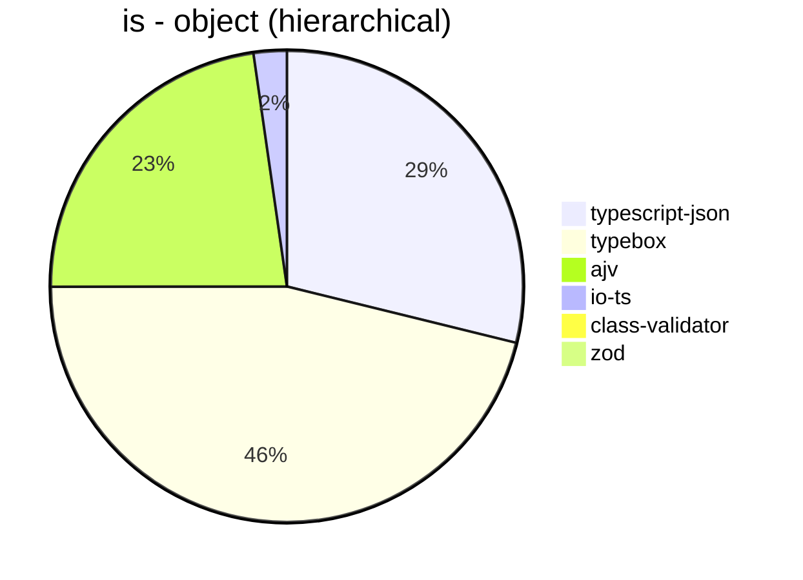


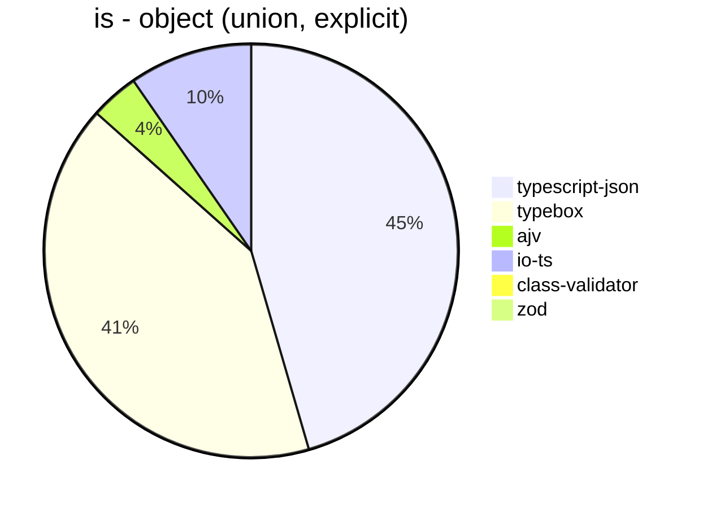


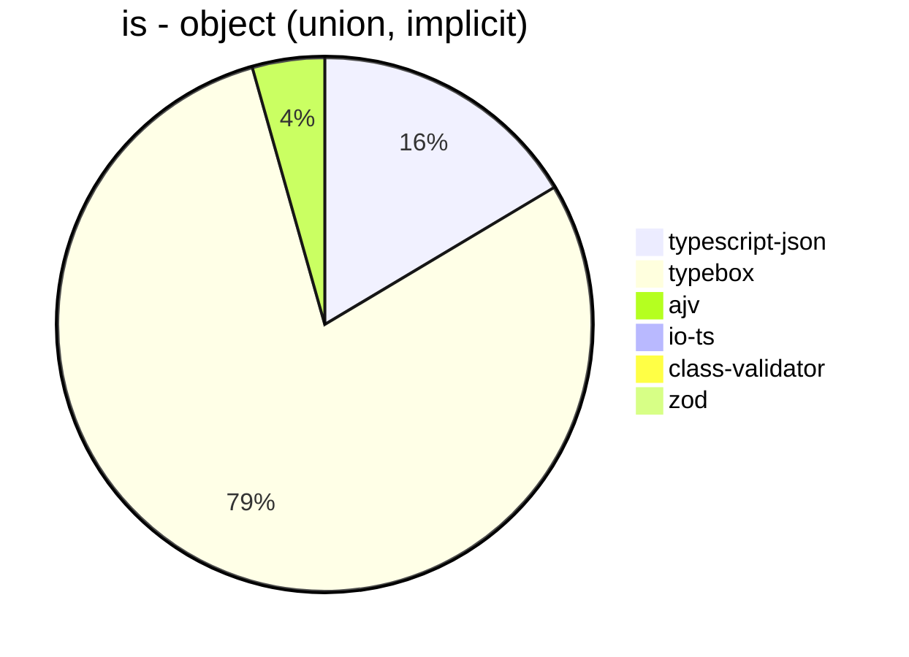


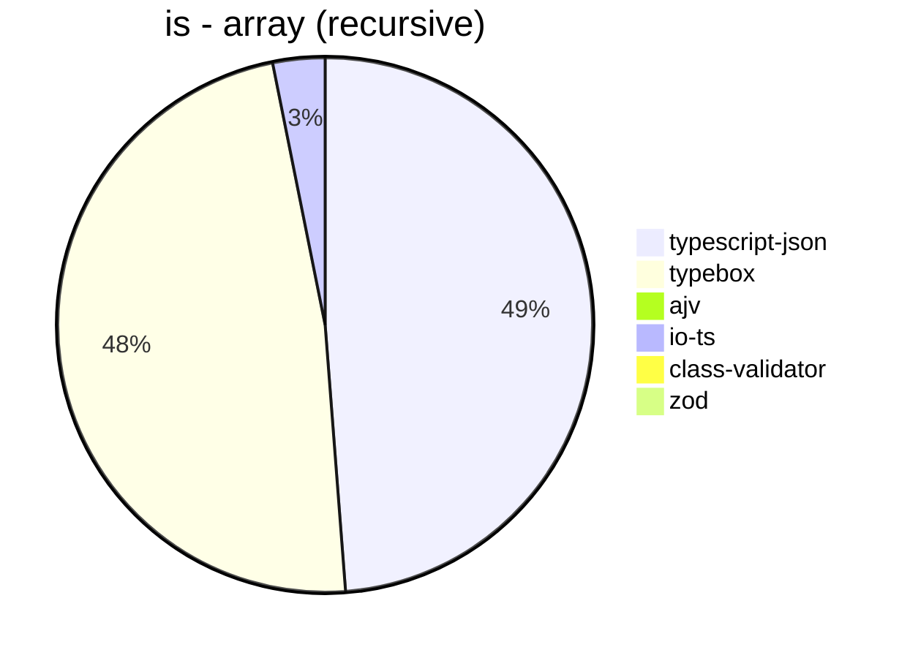


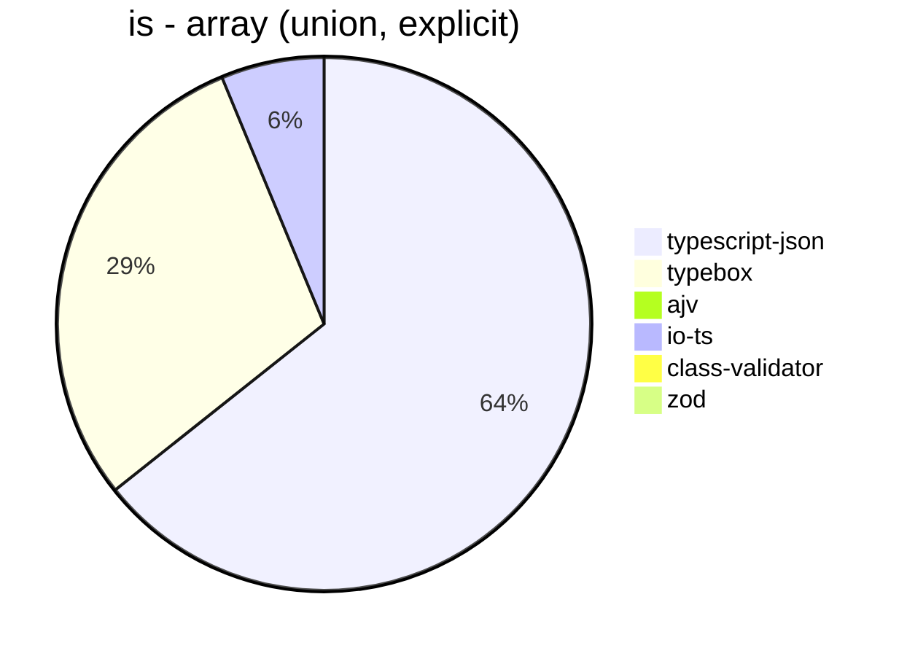


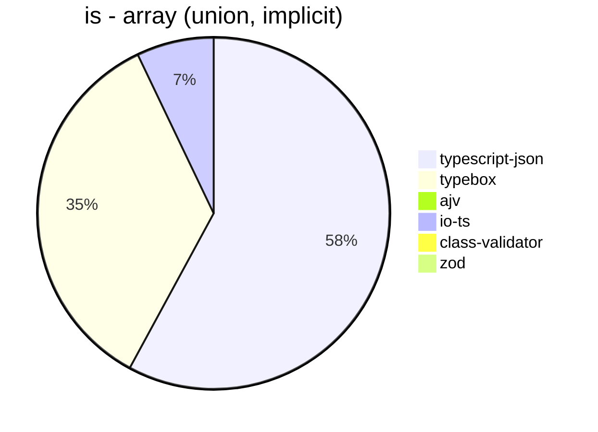


## assert
 Components | typescript-json | typebox | io-ts | zod | class-validator 
------------|-----------------|---------|-------|-----|-----------------
object (hierarchical) | 23460.77903428469 | 987.5604699378023 | 4138.742023701003 | 432.34138124649076 | 68.4654919236417
object (recursive) | 34663.83363471971 | 404.74924685451003 | 1885.1570964247019 | 72.36019296051455 | 43.69992716678806
object (union, explicit) | 5319.01728844404 | 178.69241192411926 | 1396.3794078823307 | 36.333456289192185 | 17.934782608695652
object (union, implicit) | 5663.749088256747 | 155.36924723510523 | 591.4712940742108 | 48.05706776797447 | 18.075588825999635
array (recursive) | 1671.1762495302517 | 41.171088746569076 | 185.30001823819077 | 9.846619958341224 | 4.161937192584185
array (union, explicit) | 2311.2826166850423 | 20.596962820736604 | 88.85597926693816 | 2.97785222408338 | 7.978241160471442
array (union, implicit) | 2001.2655939251492 | 29.057930779196745 | 123.61865517887244 | 3.970504821327283 | 9.743774810537712
ultimate union | 256.9162995594714 | 4.569548528605374 | Failed | 0.354924578527063 | Failed


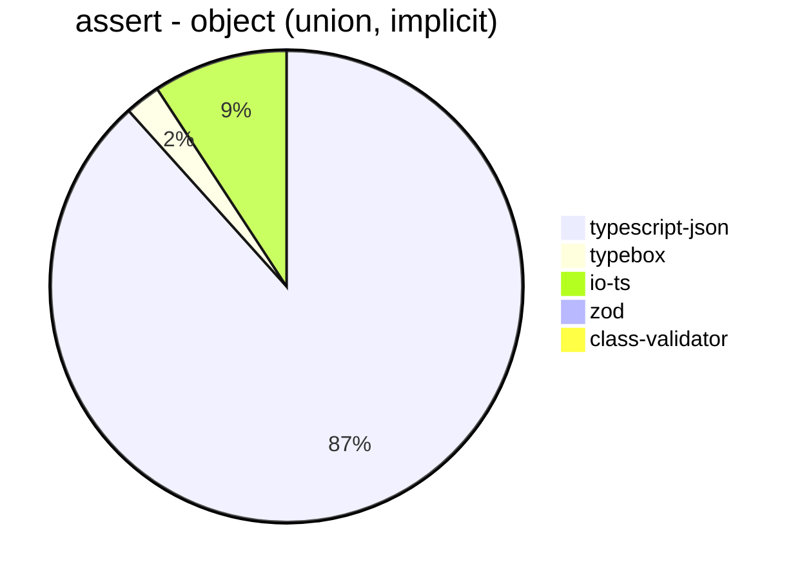


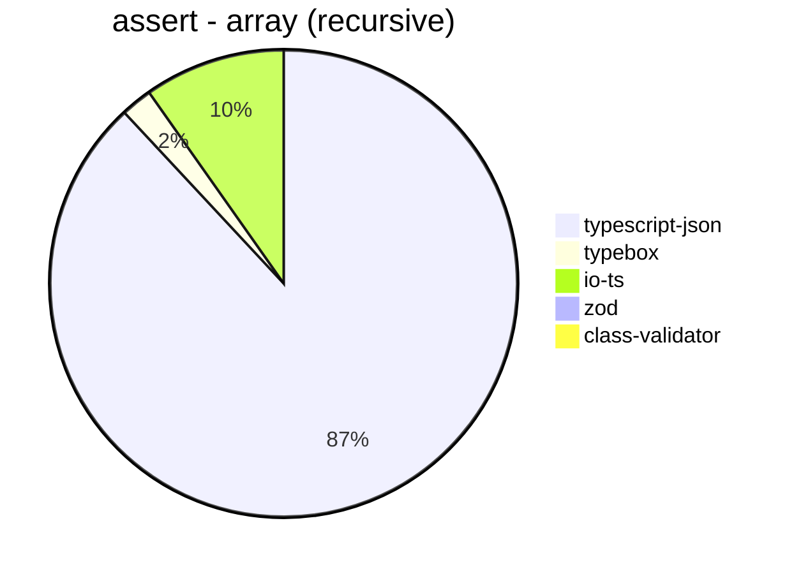


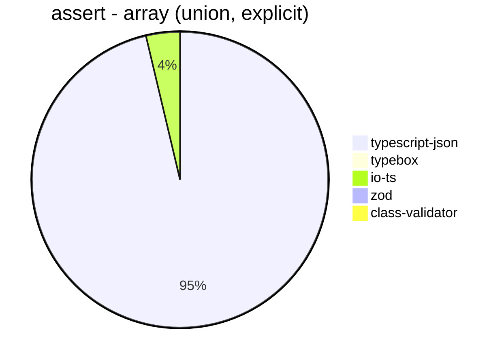


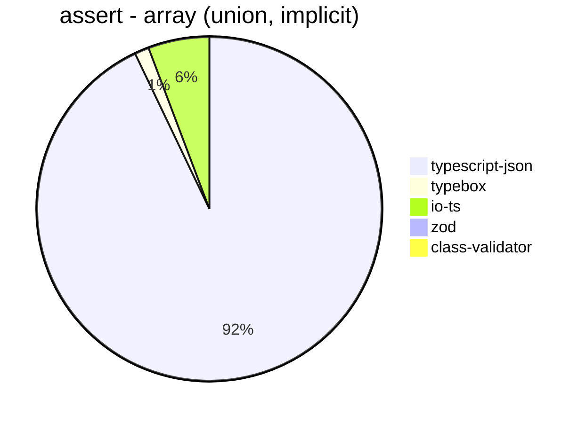


## valiadate
 Components | typescript-json | typebox | io-ts | zod | class-validator 
------------|-----------------|---------|-------|-----|-----------------
object (hierarchical) | 19801.89204229271 | 899.5931952662721 | 3794.169925346605 | 424.80359147025814 | 68.45878136200717
object (recursive) | 20505.28462822177 | 397.8475009120759 | 1873.9308293045742 | 76.99548192771084 | 42.6489112830664
object (union, explicit) | 4354.365370506236 | 172.38148772718756 | 1195.8105646630236 | 36.55549274543056 | 18.075588825999635
object (union, implicit) | 4206.430398246255 | 159.2790141622218 | 595.8751393534003 | 48.534627590069064 | 18.74062968515742
array (recursive) | 1240.5589123867069 | 40.569780021637214 | 192.4839596700275 | 9.826152683295541 | 3.935532233883058
array (union, explicit) | 1938.9671361502346 | 22.079116835326587 | 93.52249393317155 | 3.203316374599585 | 7.919366450683945
array (union, implicit) | 1765.0481905801055 | 29.183248057608488 | 118.48935027742975 | 3.981042654028436 | 9.764918625678119
ultimate union | 159.7393448397323 | 4.620218074293107 | Failed | 0.36029544226265536 | Failed


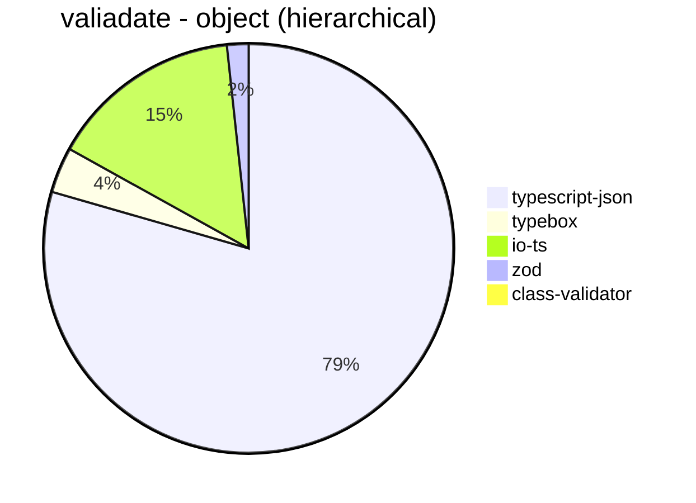


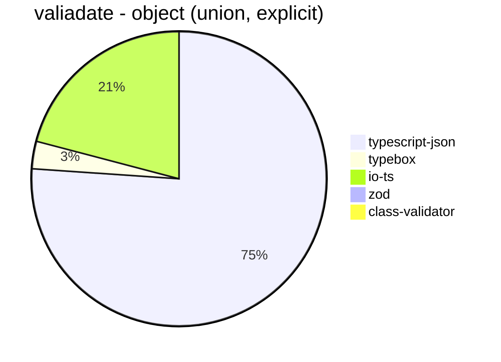


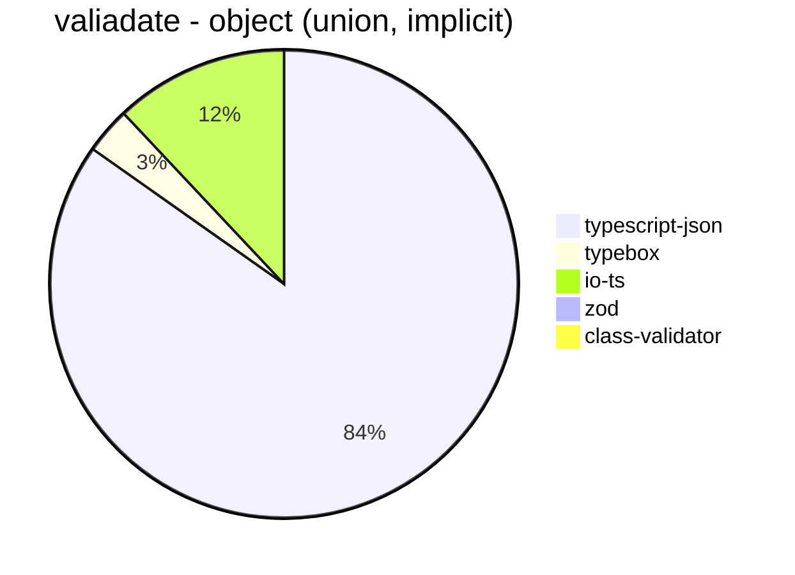


```mermaid
pie title valiadate - array (recursive)
  "typescript-json": 1240.5589123867069
  "typebox": 40.569780021637214
  "io-ts": 192.4839596700275
  "zod": 9.826152683295541
  "class-validator": 3.935532233883058
```


```mermaid
pie title valiadate - array (union, explicit)
  "typescript-json": 1938.9671361502346
  "typebox": 22.079116835326587
  "io-ts": 93.52249393317155
  "zod": 3.203316374599585
  "class-validator": 7.919366450683945
```


```mermaid
pie title valiadate - array (union, implicit)
  "typescript-json": 1765.0481905801055
  "typebox": 29.183248057608488
  "io-ts": 118.48935027742975
  "zod": 3.981042654028436
  "class-validator": 9.764918625678119
```


```mermaid
pie title valiadate - ultimate union
  "typescript-json": 159.7393448397323
  "typebox": 4.620218074293107
  "io-ts": 0
  "zod": 0.36029544226265536
  "class-validator": 0
```


## optimizer
 Components | typescript-json | ajv | typebox 
------------|-----------------|-----|---------
object (hierarchical) | 102486.00779312788 | 5.049594229035167 | 214.183637013219
object (recursive) | 84277.48691099478 | 8.895214374666429 | 888.6683507758933
object (union) | 17929.10447761194 | 4.740200546946217 | 171.62966973470492
array (hierarchical) | 3792.0881502890174 | 6.581352833638026 | 1101.578847251284
array (recursive) | 6319.704713231118 | 9.572072072072071 | 905.625116800598
array (union) | 3807.631160572337 | 6.467110125646711 | 271.96418578623394
ultimate union | 627.222122463638 | 0.9061254077564336 | 12.822828246342786


```mermaid
pie title optimizer - object (hierarchical)
  "typescript-json": 102486.00779312788
  "ajv": 5.049594229035167
  "typebox": 214.183637013219
```


```mermaid
pie title optimizer - object (recursive)
  "typescript-json": 84277.48691099478
  "ajv": 8.895214374666429
  "typebox": 888.6683507758933
```


```mermaid
pie title optimizer - object (union)
  "typescript-json": 17929.10447761194
  "ajv": 4.740200546946217
  "typebox": 171.62966973470492
```


```mermaid
pie title optimizer - array (hierarchical)
  "typescript-json": 3792.0881502890174
  "ajv": 6.581352833638026
  "typebox": 1101.578847251284
```


```mermaid
pie title optimizer - array (recursive)
  "typescript-json": 6319.704713231118
  "ajv": 9.572072072072071
  "typebox": 905.625116800598
```


```mermaid
pie title optimizer - array (union)
  "typescript-json": 3807.631160572337
  "ajv": 6.467110125646711
  "typebox": 271.96418578623394
```


```mermaid
pie title optimizer - ultimate union
  "typescript-json": 627.222122463638
  "ajv": 0.9061254077564336
  "typebox": 12.822828246342786
```


## stringify
 Components | typescript-json | fast-json-stringify | JSON.stringify() 
------------|-----------------|---------------------|------------------
object (simple) | 150608.01702731467 | 33146.86223542518 | 6514.561305880171
object (hierarchical) | 5307.828551186681 | 4913.411341134114 | 1700.7326695472477
object (recursive) | 5998.516870596959 | 1288.4869040889391 | 1304.7854158754274
object (union) | 2266.848319709355 | 1564.6636771300448 | 979.2736261646701
array (hierarchical) | 400.8826774549467 | 549.0559052202888 | 183.64661654135338
array (recursive) | 267.6518883415435 | 134.6368715083799 | 135.56139692076607
array (union) | 345.8228755826461 | 245.16728624535315 | 275.88785046728975
ultimate union | 130.78826440438317 | 68.12272490899636 | 185.8487151646761


```mermaid
pie title stringify - object (simple)
  "typescript-json": 150608.01702731467
  "fast-json-stringify": 33146.86223542518
  "JSON.stringify()": 6514.561305880171
```


```mermaid
pie title stringify - object (hierarchical)
  "typescript-json": 5307.828551186681
  "fast-json-stringify": 4913.411341134114
  "JSON.stringify()": 1700.7326695472477
```


```mermaid
pie title stringify - object (recursive)
  "typescript-json": 5998.516870596959
  "fast-json-stringify": 1288.4869040889391
  "JSON.stringify()": 1304.7854158754274
```


```mermaid
pie title stringify - object (union)
  "typescript-json": 2266.848319709355
  "fast-json-stringify": 1564.6636771300448
  "JSON.stringify()": 979.2736261646701
```


```mermaid
pie title stringify - array (hierarchical)
  "typescript-json": 400.8826774549467
  "fast-json-stringify": 549.0559052202888
  "JSON.stringify()": 183.64661654135338
```


```mermaid
pie title stringify - array (recursive)
  "typescript-json": 267.6518883415435
  "fast-json-stringify": 134.6368715083799
  "JSON.stringify()": 135.56139692076607
```


```mermaid
pie title stringify - array (union)
  "typescript-json": 345.8228755826461
  "fast-json-stringify": 245.16728624535315
  "JSON.stringify()": 275.88785046728975
```


```mermaid
pie title stringify - ultimate union
  "typescript-json": 130.78826440438317
  "fast-json-stringify": 68.12272490899636
  "JSON.stringify()": 185.8487151646761
```


