# Benchmark of `typescript-json`
> CPU: AMD Ryzen 9 5900HX with Radeon Graphics
> Memory: 64,928 MB
> NodeJS version: v16.16.0
> TypeScript-JSON version: 3.3.17

## TSON iterate
 Components | is | assert | validate 
------------|----|--------|----------
simple | 498242.83396430506 | 255103.62511052165 | 103971.01716817426
object (hierarchical) | 125787.21136767318 | 72666.97553743514 | 40315.120028663565
object (recursive) | 80967.82091640434 | 50987.49320282762 | 29616.973273169042
object (union, explicit) | 24689.921057462823 | 7352.5206232813935 | 5252.5957751521655
object (union, implicit) | 20732.194244604318 | 6808.199643493761 | 4743.815283122595
array (recursive) | 8062.767740733842 | 2726.0273972602736 | 1706.3197026022306
array (union, explicit) | 4087.6717281272595 | 2731.393396754337 | 2158.854166666667
array (union, implicit) | 1956.294964028777 | 1508.1618168914124 | 1195.433789954338
ultimate union | 490.4896090172596 | 254.65282748747316 | 190.12567324955117

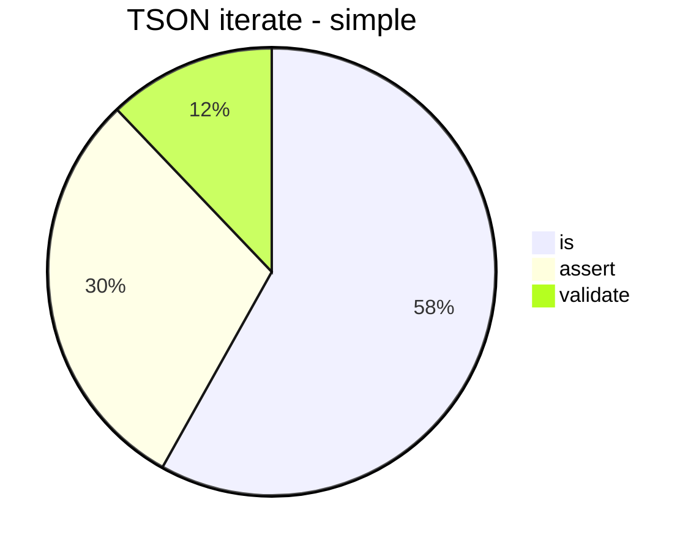
```mermaid
pie title TSON iterate - simple
  "is": 498242.83396430506
  "assert": 255103.62511052165
  "validate": 103971.01716817426
```

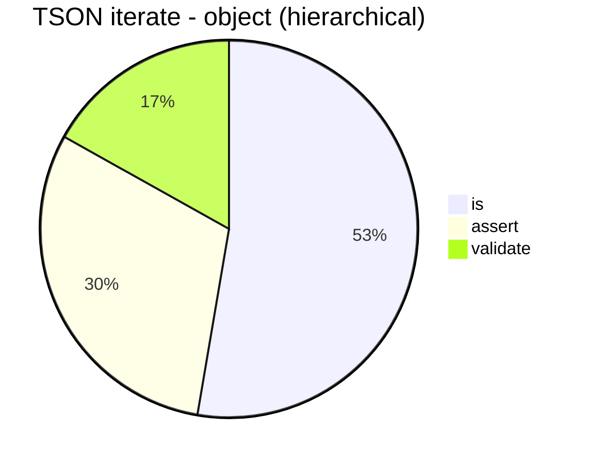
```mermaid
pie title TSON iterate - object (hierarchical)
  "is": 125787.21136767318
  "assert": 72666.97553743514
  "validate": 40315.120028663565
```

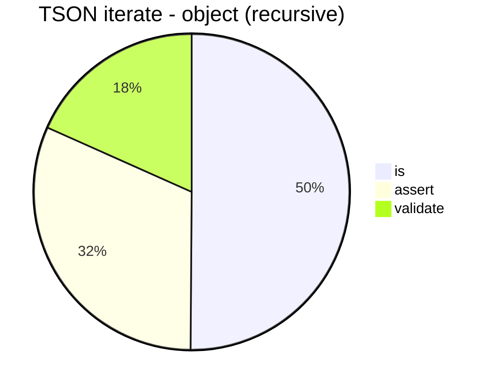
```mermaid
pie title TSON iterate - object (recursive)
  "is": 80967.82091640434
  "assert": 50987.49320282762
  "validate": 29616.973273169042
```

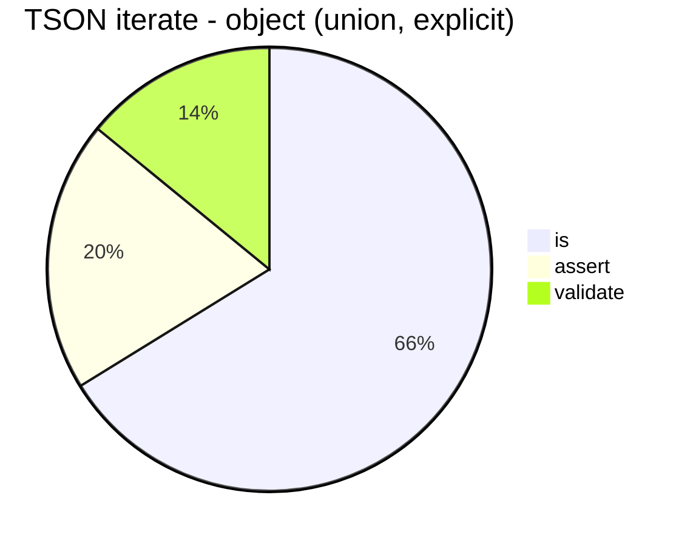
```mermaid
pie title TSON iterate - object (union, explicit)
  "is": 24689.921057462823
  "assert": 7352.5206232813935
  "validate": 5252.5957751521655
```

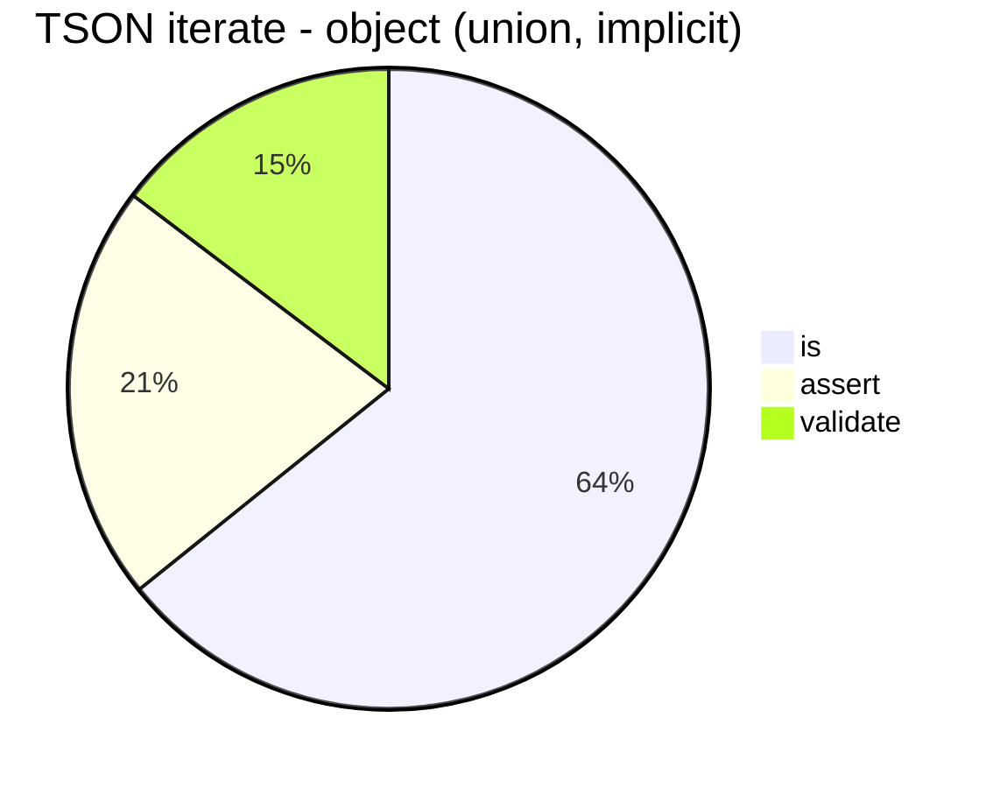
```mermaid
pie title TSON iterate - object (union, implicit)
  "is": 20732.194244604318
  "assert": 6808.199643493761
  "validate": 4743.815283122595
```

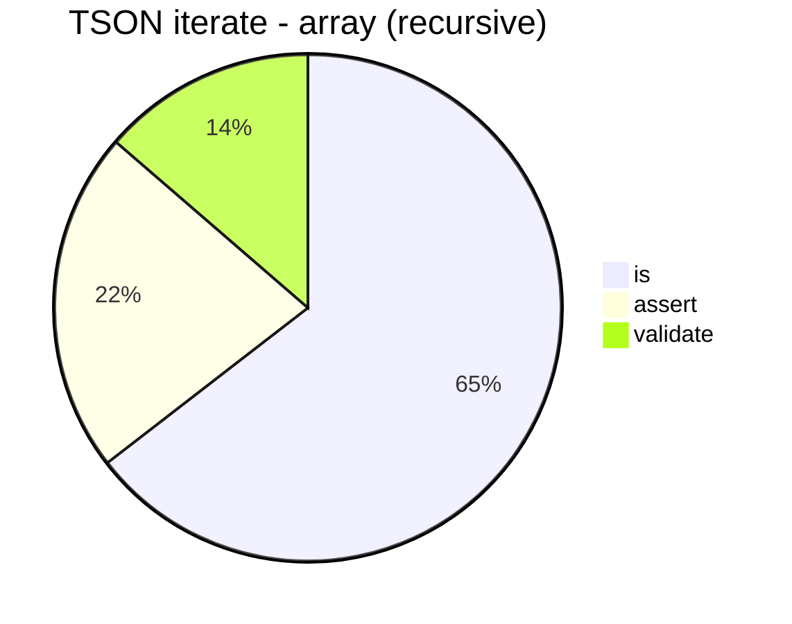
```mermaid
pie title TSON iterate - array (recursive)
  "is": 8062.767740733842
  "assert": 2726.0273972602736
  "validate": 1706.3197026022306
```

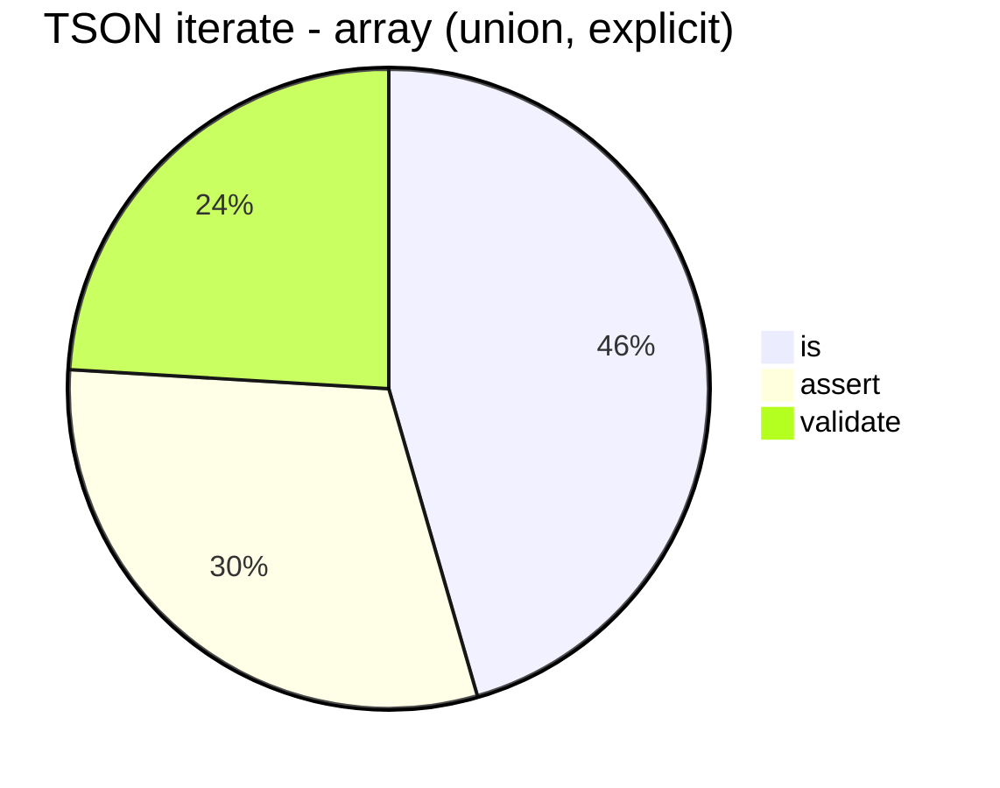
```mermaid
pie title TSON iterate - array (union, explicit)
  "is": 4087.6717281272595
  "assert": 2731.393396754337
  "validate": 2158.854166666667
```

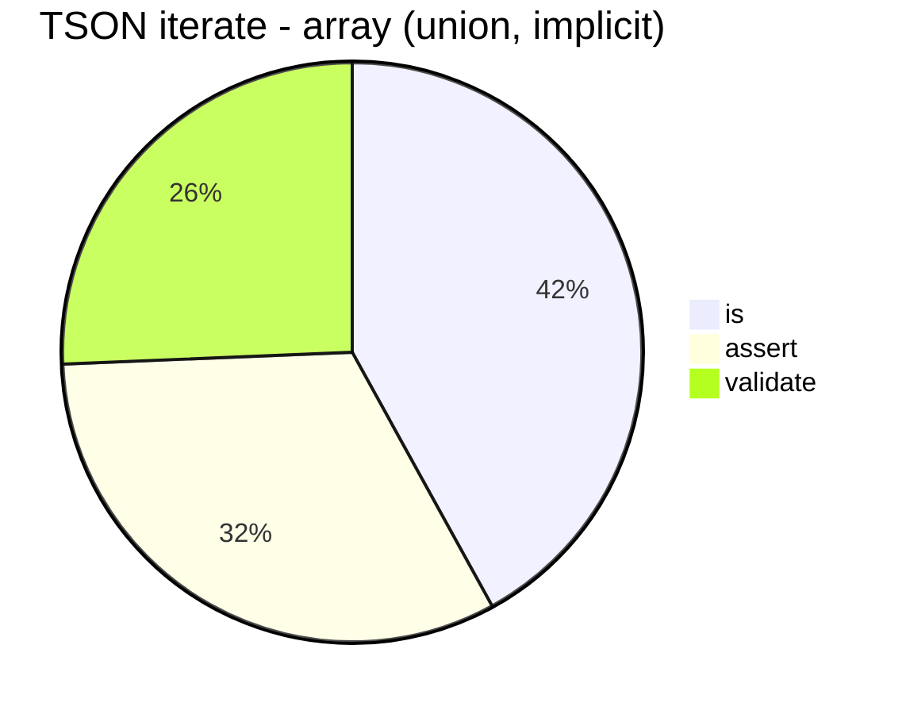
```mermaid
pie title TSON iterate - array (union, implicit)
  "is": 1956.294964028777
  "assert": 1508.1618168914124
  "validate": 1195.433789954338
```

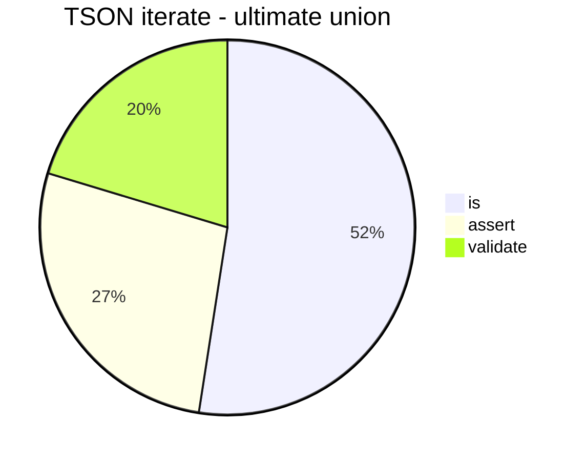
```mermaid
pie title TSON iterate - ultimate union
  "is": 490.4896090172596
  "assert": 254.65282748747316
  "validate": 190.12567324955117
```

## is
 Components | typescript-json | typebox | ajv | io-ts | zod | class-validator 
------------|-----------------|---------|-----|-------|-----|-----------------
object (simple) | 471414.12692721403 | 11838959.663865546 | 485626.60869565216 | 39226.886094674555 | 3922.720797720798 | 195.56197005231823
object (hierarchical) | 110717.96733212341 | 194724.49739389427 | 48560.635827826394 | 9063.193698532044 | 446.5579710144928 | 64.99470151889791
object (recursive) | 89511.06602729621 | 97907.3703366697 | 46924.17403863514 | 5651.239067055393 | 75.74094401756311 | 43.340183074911266
object (union, explicit) | 16790.6610703043 | 14788.863976083707 | 8806.818181818182 | 3345.0717346748647 | 36.25045770779934 | 113.71973587674248
object (union, implicit) | 18057.36659989073 | Failed | Failed | Failed | 19.27353595255745 | 78.125
array (recursive) | 7246.689642662797 | 8206.62227155013 | 2370.1931922723093 | 538.8868411352746 | 9.433962264150944 | 3.7369207772795217
array (union, explicit) | 4024.687004055722 | 2025.4050073637702 | 834.3416370106761 | 393.93939393939394 | 2.9493087557603688 | 40.74889867841409
array (union, implicit) | 2163.6267044448377 | Failed | Failed | Failed | 1.858045336306206 | 28.272443546906555
ultimate union | 519.5612431444241 | Failed | Failed | Failed | 0.34536349507857017 | Failed

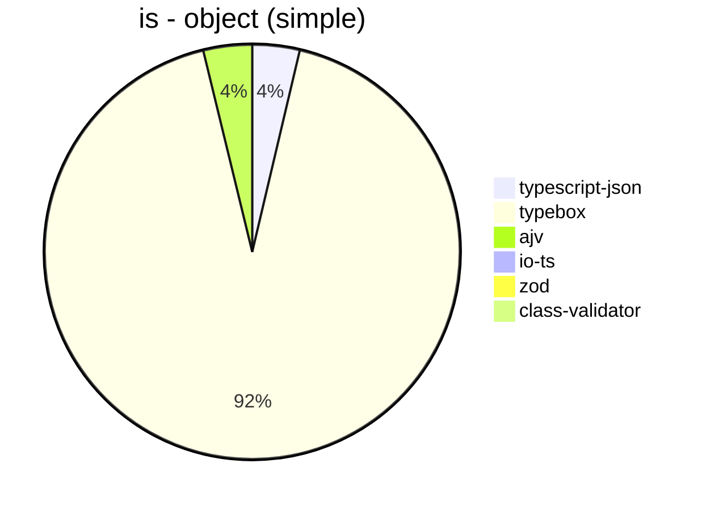
```mermaid
pie title is - object (simple)
  "typescript-json": 471414.12692721403
  "typebox": 11838959.663865546
  "ajv": 485626.60869565216
  "io-ts": 39226.886094674555
  "zod": 3922.720797720798
  "class-validator": 195.56197005231823
```

```mermaid
pie title is - object (hierarchical)
  "typescript-json": 110717.96733212341
  "typebox": 194724.49739389427
  "ajv": 48560.635827826394
  "io-ts": 9063.193698532044
  "zod": 446.5579710144928
  "class-validator": 64.99470151889791
```

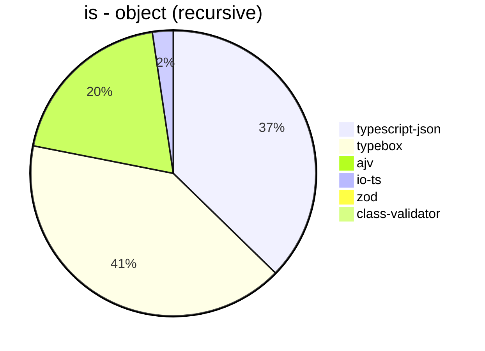
```mermaid
pie title is - object (recursive)
  "typescript-json": 89511.06602729621
  "typebox": 97907.3703366697
  "ajv": 46924.17403863514
  "io-ts": 5651.239067055393
  "zod": 75.74094401756311
  "class-validator": 43.340183074911266
```

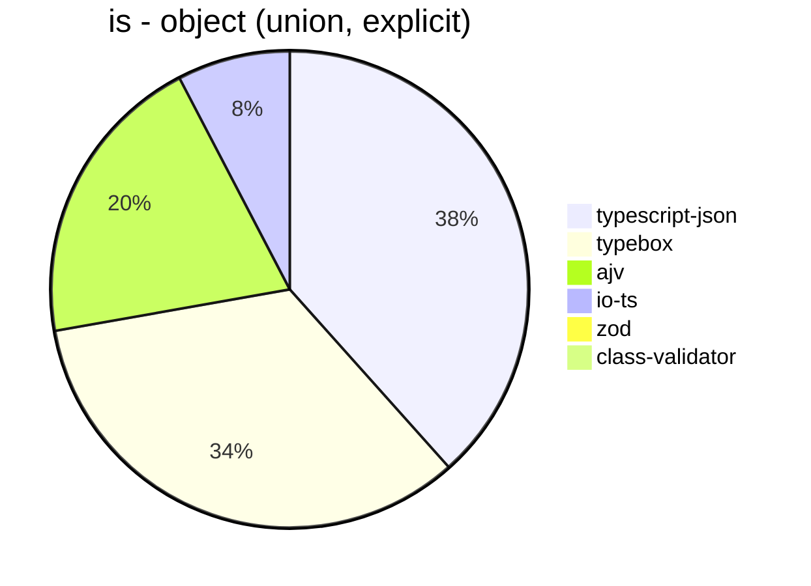
```mermaid
pie title is - object (union, explicit)
  "typescript-json": 16790.6610703043
  "typebox": 14788.863976083707
  "ajv": 8806.818181818182
  "io-ts": 3345.0717346748647
  "zod": 36.25045770779934
  "class-validator": 113.71973587674248
```

```mermaid
pie title is - object (union, implicit)
  "typescript-json": 18057.36659989073
  "typebox": 0
  "ajv": 0
  "io-ts": 0
  "zod": 19.27353595255745
  "class-validator": 78.125
```

```mermaid
pie title is - array (recursive)
  "typescript-json": 7246.689642662797
  "typebox": 8206.62227155013
  "ajv": 2370.1931922723093
  "io-ts": 538.8868411352746
  "zod": 9.433962264150944
  "class-validator": 3.7369207772795217
```

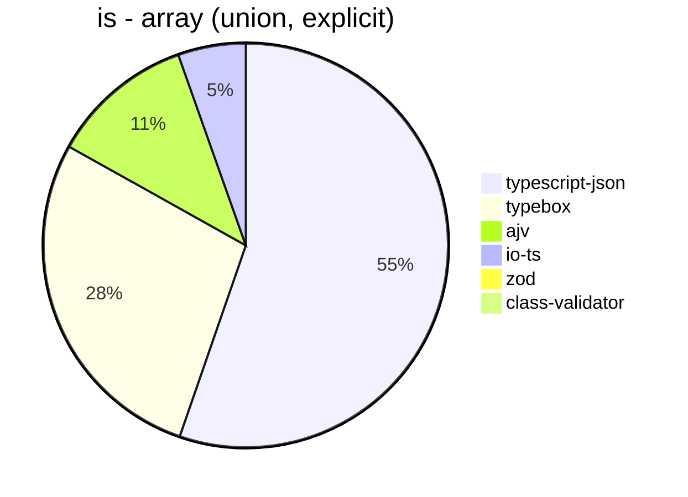
```mermaid
pie title is - array (union, explicit)
  "typescript-json": 4024.687004055722
  "typebox": 2025.4050073637702
  "ajv": 834.3416370106761
  "io-ts": 393.93939393939394
  "zod": 2.9493087557603688
  "class-validator": 40.74889867841409
```

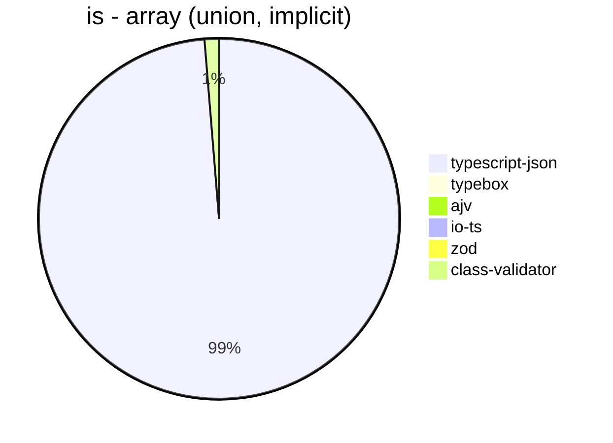
```mermaid
pie title is - array (union, implicit)
  "typescript-json": 2163.6267044448377
  "typebox": 0
  "ajv": 0
  "io-ts": 0
  "zod": 1.858045336306206
  "class-validator": 28.272443546906555
```

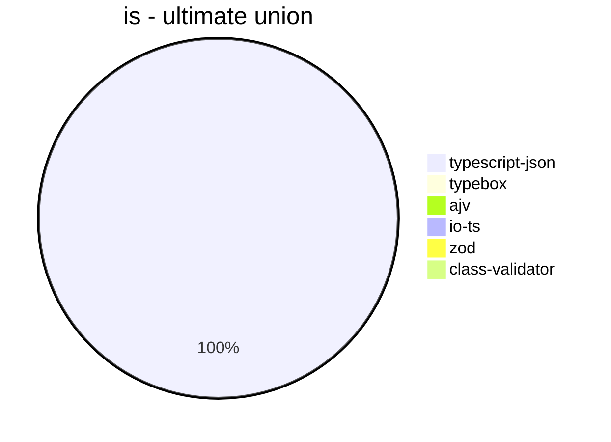
```mermaid
pie title is - ultimate union
  "typescript-json": 519.5612431444241
  "typebox": 0
  "ajv": 0
  "io-ts": 0
  "zod": 0.34536349507857017
  "class-validator": 0
```

## assertType (iterate)
 Components | typescript-json | typebox | io-ts | zod | class-validator 
------------|-----------------|---------|-------|-----|-----------------
object (simple) | 240390.1070882203 | 3696.555494805905 | 19396.050670640834 | 3621.3872832369943 | 206.96142991533395
object (hierarchical) | 61751.04675505932 | 927.8985507246377 | 4077.0497803806734 | 432.2687224669603 | 65.60636182902584
object (recursive) | 49200.59824266218 | 391.34355275022546 | 1979.2727272727273 | 78.13084112149534 | 41.789940828402365
object (union, explicit) | 7050.406203840472 | 150.56664867781976 | 1297.2774098601913 | 36.838208071084786 | 111.38059701492537
object (union, implicit) | 5871.737923375903 | Failed | Failed | 18.79219120598431 | 76.85202290781451
array (recursive) | 2860.8172199927035 | 40.812591508052705 | 184.97316636851522 | 9.854964670881369 | 3.6913990402362495
array (union, explicit) | 2720.899962811454 | 20.408163265306122 | 94.49264428517542 | 2.9613177864149547 | 40.4486118771833
array (union, implicit) | 1537.7427629168194 | Failed | Failed | 1.822489520685256 | 28.072701097714592
ultimate union | 280.8652831516004 | Failed | Failed | 0.3522367030644593 | Failed

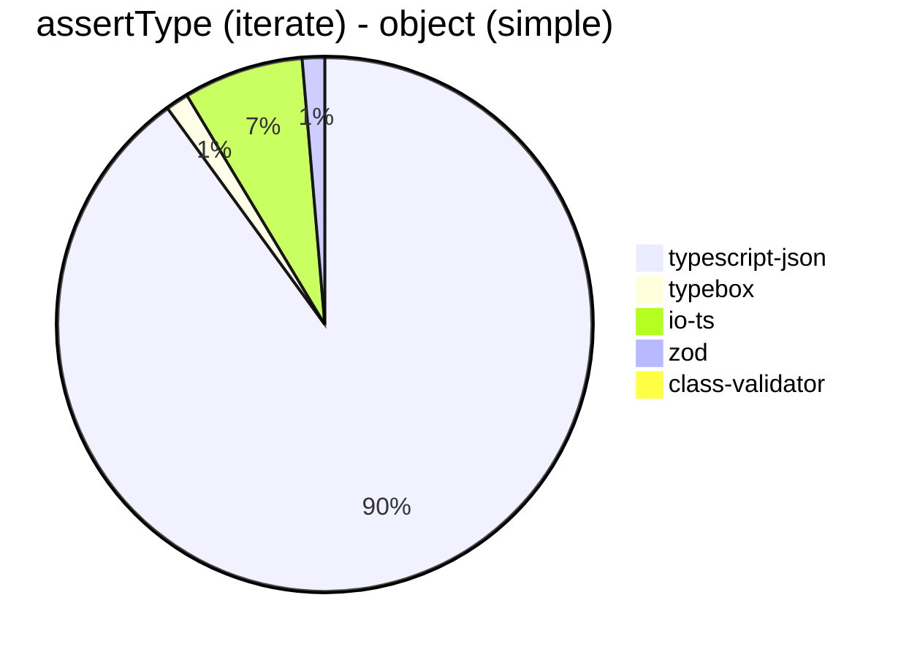
```mermaid
pie title assertType (iterate) - object (simple)
  "typescript-json": 240390.1070882203
  "typebox": 3696.555494805905
  "io-ts": 19396.050670640834
  "zod": 3621.3872832369943
  "class-validator": 206.96142991533395
```

```mermaid
pie title assertType (iterate) - object (hierarchical)
  "typescript-json": 61751.04675505932
  "typebox": 927.8985507246377
  "io-ts": 4077.0497803806734
  "zod": 432.2687224669603
  "class-validator": 65.60636182902584
```

```mermaid
pie title assertType (iterate) - object (recursive)
  "typescript-json": 49200.59824266218
  "typebox": 391.34355275022546
  "io-ts": 1979.2727272727273
  "zod": 78.13084112149534
  "class-validator": 41.789940828402365
```

```mermaid
pie title assertType (iterate) - object (union, explicit)
  "typescript-json": 7050.406203840472
  "typebox": 150.56664867781976
  "io-ts": 1297.2774098601913
  "zod": 36.838208071084786
  "class-validator": 111.38059701492537
```

```mermaid
pie title assertType (iterate) - object (union, implicit)
  "typescript-json": 5871.737923375903
  "typebox": 0
  "io-ts": 0
  "zod": 18.79219120598431
  "class-validator": 76.85202290781451
```

```mermaid
pie title assertType (iterate) - array (recursive)
  "typescript-json": 2860.8172199927035
  "typebox": 40.812591508052705
  "io-ts": 184.97316636851522
  "zod": 9.854964670881369
  "class-validator": 3.6913990402362495
```

```mermaid
pie title assertType (iterate) - array (union, explicit)
  "typescript-json": 2720.899962811454
  "typebox": 20.408163265306122
  "io-ts": 94.49264428517542
  "zod": 2.9613177864149547
  "class-validator": 40.4486118771833
```

```mermaid
pie title assertType (iterate) - array (union, implicit)
  "typescript-json": 1537.7427629168194
  "typebox": 0
  "io-ts": 0
  "zod": 1.822489520685256
  "class-validator": 28.072701097714592
```

```mermaid
pie title assertType (iterate) - ultimate union
  "class-validator": 0
  "typescript-json": 280.8652831516004
  "typebox": 0
  "io-ts": 0
  "zod": 0.3522367030644593
```

## assertType (throw)
 Components | typescript-json | typebox | io-ts | zod | class-validator 
------------|-----------------|---------|-------|-----|-----------------
object (simple) | 515.0799418604652 | 30.325307847822092 | 126.7135976287514 | 33.368832090876815 | 2.002913328477786
object (hierarchical) | 334.2608050454461 | 8.596524014202952 | 37.071709417712036 | 4.249815225424982 | 0.7245064299945662
object (recursive) | 50.720768820074746 | Failed | Failed | 0.3460207612456747 | 0.9242144177449167
object (union, explicit) | 54.107853782120884 | 1.478743068391867 | 11.350949013770004 | 0.3575898444484177 | 1.0958904109589043
object (union, implicit) | 49.75124378109452 | Failed | Failed | 0.33675702980299715 | 0.8946144211844694
array (recursive) | 17.615427405896533 | 0.5449591280653951 | 1.67348456675344 | 0.15969338869370808 | 0.12823800974608873
array (union, explicit) | 5.152741994847258 | 0.17857142857142858 | 0.7336757153338225 | 0.12307692307692308 | 0.36744442403086536
array (union, implicit) | 2.0014556040756912 | Failed | Failed | 0.10397171969224371 | 0.35848718408316904
ultimate union | 2.92024091987589 | Failed | Failed | 0.030427506465845123 | Failed

```mermaid
pie title assertType (throw) - object (simple)
  "typescript-json": 515.0799418604652
  "typebox": 30.325307847822092
  "io-ts": 126.7135976287514
  "zod": 33.368832090876815
  "class-validator": 2.002913328477786
```

```mermaid
pie title assertType (throw) - object (hierarchical)
  "typescript-json": 334.2608050454461
  "typebox": 8.596524014202952
  "io-ts": 37.071709417712036
  "zod": 4.249815225424982
  "class-validator": 0.7245064299945662
```

```mermaid
pie title assertType (throw) - object (recursive)
  "typescript-json": 50.720768820074746
  "typebox": 0
  "io-ts": 0
  "zod": 0.3460207612456747
  "class-validator": 0.9242144177449167
```

```mermaid
pie title assertType (throw) - object (union, explicit)
  "typescript-json": 54.107853782120884
  "typebox": 1.478743068391867
  "io-ts": 11.350949013770004
  "zod": 0.3575898444484177
  "class-validator": 1.0958904109589043
```

```mermaid
pie title assertType (throw) - object (union, implicit)
  "typescript-json": 49.75124378109452
  "typebox": 0
  "io-ts": 0
  "zod": 0.33675702980299715
  "class-validator": 0.8946144211844694
```

```mermaid
pie title assertType (throw) - array (recursive)
  "typescript-json": 17.615427405896533
  "typebox": 0.5449591280653951
  "io-ts": 1.67348456675344
  "zod": 0.15969338869370808
  "class-validator": 0.12823800974608873
```

```mermaid
pie title assertType (throw) - array (union, explicit)
  "typescript-json": 5.152741994847258
  "typebox": 0.17857142857142858
  "io-ts": 0.7336757153338225
  "zod": 0.12307692307692308
  "class-validator": 0.36744442403086536
```

```mermaid
pie title assertType (throw) - array (union, implicit)
  "typescript-json": 2.0014556040756912
  "typebox": 0
  "io-ts": 0
  "zod": 0.10397171969224371
  "class-validator": 0.35848718408316904
```

```mermaid
pie title assertType (throw) - ultimate union
  "class-validator": 0
  "typescript-json": 2.92024091987589
  "typebox": 0
  "io-ts": 0
  "zod": 0.030427506465845123
```

## validate
 Components | typescript-json | typebox | io-ts | zod | class-validator 
------------|-----------------|---------|-------|-----|-----------------
object (simple) | 106790.19714234039 | 3354.143441099963 | 14405.794460641398 | 3779.3064455333583 | 201.30932896890346
object (hierarchical) | 36555.51543599928 | 926.6227657572906 | 4013.015991074749 | 455.0413844996238 | 67.7025527192009
object (recursive) | 29690.77034883721 | 407.2078766487089 | 1920.1471941122356 | 82.93883734141262 | 41.97214076246334
object (union, explicit) | 5517.02786377709 | 159.15805022156573 | 1292.597378622854 | 38.02210151713804 | 111.4724480578139
object (union, implicit) | 4743.372407574391 | 149.22876788700984 | 371.016122984627 | 19.689511548655812 | 78.71231857089691
array (recursive) | 1680.1517067003792 | 42.26686884003033 | 196.93530079455167 | 10.064565134827193 | 3.7615196539401916
array (union, explicit) | 2225.415762834418 | 20.919713531850736 | 95.13980108838432 | 3.2300969029070874 | 40.910773787486114
array (union, implicit) | 1147.5172163827474 | 14.372163388804841 | 65.60118937000557 | 2.066115702479339 | 29.439165269237936
ultimate union | 196.2418010990959 | Failed | Failed | 0.35925992455541583 | Failed

```mermaid
pie title validate - object (simple)
  "typescript-json": 106790.19714234039
  "typebox": 3354.143441099963
  "io-ts": 14405.794460641398
  "zod": 3779.3064455333583
  "class-validator": 201.30932896890346
```

```mermaid
pie title validate - object (hierarchical)
  "typescript-json": 36555.51543599928
  "typebox": 926.6227657572906
  "io-ts": 4013.015991074749
  "zod": 455.0413844996238
  "class-validator": 67.7025527192009
```

```mermaid
pie title validate - object (recursive)
  "typescript-json": 29690.77034883721
  "typebox": 407.2078766487089
  "io-ts": 1920.1471941122356
  "zod": 82.93883734141262
  "class-validator": 41.97214076246334
```

```mermaid
pie title validate - object (union, explicit)
  "typescript-json": 5517.02786377709
  "typebox": 159.15805022156573
  "io-ts": 1292.597378622854
  "zod": 38.02210151713804
  "class-validator": 111.4724480578139
```

```mermaid
pie title validate - object (union, implicit)
  "typescript-json": 4743.372407574391
  "typebox": 149.22876788700984
  "io-ts": 371.016122984627
  "zod": 19.689511548655812
  "class-validator": 78.71231857089691
```

```mermaid
pie title validate - array (recursive)
  "typescript-json": 1680.1517067003792
  "typebox": 42.26686884003033
  "io-ts": 196.93530079455167
  "zod": 10.064565134827193
  "class-validator": 3.7615196539401916
```

```mermaid
pie title validate - array (union, explicit)
  "typescript-json": 2225.415762834418
  "typebox": 20.919713531850736
  "io-ts": 95.13980108838432
  "zod": 3.2300969029070874
  "class-validator": 40.910773787486114
```

```mermaid
pie title validate - array (union, implicit)
  "typescript-json": 1147.5172163827474
  "typebox": 14.372163388804841
  "io-ts": 65.60118937000557
  "zod": 2.066115702479339
  "class-validator": 29.439165269237936
```

```mermaid
pie title validate - ultimate union
  "typescript-json": 196.2418010990959
  "typebox": 0
  "io-ts": 0
  "zod": 0.35925992455541583
  "class-validator": 0
```

## equals
 Components | typescript-json | typebox 
------------|-----------------|---------
object (simple) | 30851.798301102473 | 72505.02419054709
object (hierarchical) | 8392.997499106825 | 20863.352898019075
object (recursive) | 6630.843632455669 | 12540.992647058823
object (union, explicit) | 3137.931034482759 | 3839.2690658213683
object (union, implicit) | 2155.718206770357 | 2591.5186661834
array (recursive) | 653.8959837127522 | 1254.8983702618568
array (union, explicit) | 469.45454545454544 | 833.457249070632
array (union, implicit) | 290.31135849712996 | 542.7350427350427
ultimate union | 355.4468007975349 | 239.86116185604675

```mermaid
pie title equals - object (simple)
  "typescript-json": 30851.798301102473
  "typebox": 72505.02419054709
```

```mermaid
pie title equals - object (hierarchical)
  "typescript-json": 8392.997499106825
  "typebox": 20863.352898019075
```

```mermaid
pie title equals - object (recursive)
  "typescript-json": 6630.843632455669
  "typebox": 12540.992647058823
```

```mermaid
pie title equals - object (union, explicit)
  "typescript-json": 3137.931034482759
  "typebox": 3839.2690658213683
```

```mermaid
pie title equals - object (union, implicit)
  "typescript-json": 2155.718206770357
  "typebox": 2591.5186661834
```

```mermaid
pie title equals - array (recursive)
  "typescript-json": 653.8959837127522
  "typebox": 1254.8983702618568
```

```mermaid
pie title equals - array (union, explicit)
  "typescript-json": 469.45454545454544
  "typebox": 833.457249070632
```

```mermaid
pie title equals - array (union, implicit)
  "typescript-json": 290.31135849712996
  "typebox": 542.7350427350427
```

```mermaid
pie title equals - ultimate union
  "typescript-json": 355.4468007975349
  "typebox": 239.86116185604675
```

## assertEquals (iterate)
 Components | typescript-json | typebox 
------------|-----------------|---------
object (simple) | 34221.88395415473 | 2855.1131052533183
object (hierarchical) | 7996.216897856242 | 785.1147174034695
object (recursive) | 6767.667685668045 | 359.2269094963761
object (union, explicit) | 2700.6948156066273 | 120.44198895027625
object (union, implicit) | 2068.530207394049 | 85.07517418408509
array (recursive) | 601.4189557940695 | 36.91783415372965
array (union, explicit) | 478.78566203365034 | 17.463933181473045
array (union, implicit) | 297.65155652648826 | 7.766622466376208
ultimate union | 236.29764065335755 | 4.53257790368272

```mermaid
pie title assertEquals (iterate) - object (simple)
  "typescript-json": 34221.88395415473
  "typebox": 2855.1131052533183
```

```mermaid
pie title assertEquals (iterate) - object (hierarchical)
  "typescript-json": 7996.216897856242
  "typebox": 785.1147174034695
```

```mermaid
pie title assertEquals (iterate) - object (recursive)
  "typescript-json": 6767.667685668045
  "typebox": 359.2269094963761
```

```mermaid
pie title assertEquals (iterate) - object (union, explicit)
  "typescript-json": 2700.6948156066273
  "typebox": 120.44198895027625
```

```mermaid
pie title assertEquals (iterate) - object (union, implicit)
  "typescript-json": 2068.530207394049
  "typebox": 85.07517418408509
```

```mermaid
pie title assertEquals (iterate) - array (recursive)
  "typescript-json": 601.4189557940695
  "typebox": 36.91783415372965
```

```mermaid
pie title assertEquals (iterate) - array (union, explicit)
  "typescript-json": 478.78566203365034
  "typebox": 17.463933181473045
```

```mermaid
pie title assertEquals (iterate) - array (union, implicit)
  "typescript-json": 297.65155652648826
  "typebox": 7.766622466376208
```

```mermaid
pie title assertEquals (iterate) - ultimate union
  "typescript-json": 236.29764065335755
  "typebox": 4.53257790368272
```

## assertEquals (throw)
 Components | typescript-json | typebox 
------------|-----------------|---------
object (simple) | 202.6046511627907 | 24.80736703627138
object (hierarchical) | 71.68523176428315 | 7.054018934471877
object (recursive) | 57.20572057205721 | 3.3444816053511706
object (union, explicit) | 25.738626064890337 | 1.2948575656677765
object (union, implicit) | 18.62904684391391 | 0.9174311926605504
array (recursive) | 5.800253761102048 | 0.36218761318362913
array (union, explicit) | 2.6061057334326136 | 0.1790189760114572
array (union, implicit) | 1.2671976828385227 | 0.154273372415921
ultimate union | 2.348690153568202 | 0.13694878115584772

```mermaid
pie title assertEquals (throw) - object (simple)
  "typescript-json": 202.6046511627907
  "typebox": 24.80736703627138
```

```mermaid
pie title assertEquals (throw) - object (hierarchical)
  "typescript-json": 71.68523176428315
  "typebox": 7.054018934471877
```

```mermaid
pie title assertEquals (throw) - object (recursive)
  "typescript-json": 57.20572057205721
  "typebox": 3.3444816053511706
```

```mermaid
pie title assertEquals (throw) - object (union, explicit)
  "typescript-json": 25.738626064890337
  "typebox": 1.2948575656677765
```

```mermaid
pie title assertEquals (throw) - object (union, implicit)
  "typescript-json": 18.62904684391391
  "typebox": 0.9174311926605504
```

```mermaid
pie title assertEquals (throw) - array (recursive)
  "typescript-json": 5.800253761102048
  "typebox": 0.36218761318362913
```

```mermaid
pie title assertEquals (throw) - array (union, explicit)
  "typescript-json": 2.6061057334326136
  "typebox": 0.1790189760114572
```

```mermaid
pie title assertEquals (throw) - array (union, implicit)
  "typescript-json": 1.2671976828385227
  "typebox": 0.154273372415921
```

```mermaid
pie title assertEquals (throw) - ultimate union
  "typescript-json": 2.348690153568202
  "typebox": 0.13694878115584772
```

## validateEquals
 Components | typescript-json | typebox 
------------|-----------------|---------
object (simple) | 19860.26513794339 | 2729.8957557706626
object (hierarchical) | 6915.882778581766 | 745.5397368895296
object (recursive) | 4672.264355362947 | 353.6790863134244
object (union, explicit) | 1715.1173046392662 | 116.60583941605839
object (union, implicit) | 1296.0057061340942 | 84.42638093478662
array (recursive) | 389.4359892569382 | 35.36562902928716
array (union, explicit) | 397.26513940685487 | 17.055144968732233
array (union, implicit) | 264.1240420602388 | 7.72273497833867
ultimate union | 153.81950459033433 | 4.718761796904492

```mermaid
pie title validateEquals - object (simple)
  "typescript-json": 19860.26513794339
  "typebox": 2729.8957557706626
```

```mermaid
pie title validateEquals - object (hierarchical)
  "typescript-json": 6915.882778581766
  "typebox": 745.5397368895296
```

```mermaid
pie title validateEquals - object (recursive)
  "typescript-json": 4672.264355362947
  "typebox": 353.6790863134244
```

```mermaid
pie title validateEquals - object (union, explicit)
  "typescript-json": 1715.1173046392662
  "typebox": 116.60583941605839
```

```mermaid
pie title validateEquals - object (union, implicit)
  "typescript-json": 1296.0057061340942
  "typebox": 84.42638093478662
```

```mermaid
pie title validateEquals - array (recursive)
  "typescript-json": 389.4359892569382
  "typebox": 35.36562902928716
```

```mermaid
pie title validateEquals - array (union, explicit)
  "typescript-json": 397.26513940685487
  "typebox": 17.055144968732233
```

```mermaid
pie title validateEquals - array (union, implicit)
  "typescript-json": 264.1240420602388
  "typebox": 7.72273497833867
```

```mermaid
pie title validateEquals - ultimate union
  "typescript-json": 153.81950459033433
  "typebox": 4.718761796904492
```

## optimizer
 Components | typescript-json | typebox | ajv 
------------|-----------------|---------|-----
object (hierarchical) | 121589.80845681243 | 217.44815991033067 | 5.378271782000716
object (recursive) | 78547.28260869566 | 901.6576643695288 | 9.93676603432701
object (union) | 20967.40137062419 | 114.79111780203236 | 4.85981308411215
array (hierarchical) | 2430.2025782688766 | 1055.0974512743628 | 7.116788321167883
array (recursive) | 7786.649456020653 | 891.9213973799126 | 10.284664830119375
array (union) | 4358.58310626703 | 276.9891669779604 | 6.957158549981692
ultimate union | 625.2695902228612 | 13.377313542239326 | 0.9214891264283082

```mermaid
pie title optimizer - object (hierarchical)
  "typescript-json": 121589.80845681243
  "typebox": 217.44815991033067
  "ajv": 5.378271782000716
```

```mermaid
pie title optimizer - object (recursive)
  "typescript-json": 78547.28260869566
  "typebox": 901.6576643695288
  "ajv": 9.93676603432701
```

```mermaid
pie title optimizer - object (union)
  "typescript-json": 20967.40137062419
  "typebox": 114.79111780203236
  "ajv": 4.85981308411215
```

```mermaid
pie title optimizer - array (hierarchical)
  "typescript-json": 2430.2025782688766
  "typebox": 1055.0974512743628
  "ajv": 7.116788321167883
```

```mermaid
pie title optimizer - array (recursive)
  "typescript-json": 7786.649456020653
  "typebox": 891.9213973799126
  "ajv": 10.284664830119375
```

```mermaid
pie title optimizer - array (union)
  "typescript-json": 4358.58310626703
  "typebox": 276.9891669779604
  "ajv": 6.957158549981692
```

```mermaid
pie title optimizer - ultimate union
  "typescript-json": 625.2695902228612
  "typebox": 13.377313542239326
  "ajv": 0.9214891264283082
```

## stringify
 Components | TSON.stringify() | TSON.assertStringify() | TSON.isStringify() | JSON.stringify() | fast-json-stringify 
------------|------------------|------------------------|--------------------|------------------|---------------------
object (simple) | 48204.59599703484 | 36339.56782277102 | 41617.658062102506 | 6572.181818181818 | 35092.90016426355
object (hierarchical) | 5602.283189099613 | 5021.493422271632 | 4980.03663003663 | 1694.3141302308127 | 5272.336448598131
object (recursive) | 6022.723107934763 | 5093.269934162399 | 5763.510995154678 | 1301.9328204165886 | 1294.3933995874743
object (union) | 1656.1177552897884 | 1306.2709966405375 | 1462.4370956146656 | 689.7313213102686 | 1533.2241034043327
array (hierarchical) | 174.9821810406272 | 164.83717526527624 | 174.1338654090332 | 81.60237388724035 | 262.23453370267777
array (recursive) | 277.8185824458318 | 247.54277393520204 | 266.9242089771891 | 134.2557965594615 | 134.665670526709
array (union) | 346.7946396233249 | 305.742935278031 | 314.28059487547034 | 275.0409016542447 | 249.31255728689277

```mermaid
pie title stringify - object (simple)
  "TSON.stringify()": 48204.59599703484
  "TSON.assertStringify()": 36339.56782277102
  "TSON.isStringify()": 41617.658062102506
  "JSON.stringify()": 6572.181818181818
  "fast-json-stringify": 35092.90016426355
```

```mermaid
pie title stringify - object (hierarchical)
  "TSON.stringify()": 5602.283189099613
  "TSON.assertStringify()": 5021.493422271632
  "TSON.isStringify()": 4980.03663003663
  "JSON.stringify()": 1694.3141302308127
  "fast-json-stringify": 5272.336448598131
```

```mermaid
pie title stringify - object (recursive)
  "TSON.stringify()": 6022.723107934763
  "TSON.assertStringify()": 5093.269934162399
  "TSON.isStringify()": 5763.510995154678
  "JSON.stringify()": 1301.9328204165886
  "fast-json-stringify": 1294.3933995874743
```

```mermaid
pie title stringify - object (union)
  "TSON.stringify()": 1656.1177552897884
  "TSON.assertStringify()": 1306.2709966405375
  "TSON.isStringify()": 1462.4370956146656
  "JSON.stringify()": 689.7313213102686
  "fast-json-stringify": 1533.2241034043327
```

```mermaid
pie title stringify - array (hierarchical)
  "TSON.stringify()": 174.9821810406272
  "TSON.assertStringify()": 164.83717526527624
  "TSON.isStringify()": 174.1338654090332
  "JSON.stringify()": 81.60237388724035
  "fast-json-stringify": 262.23453370267777
```

```mermaid
pie title stringify - array (recursive)
  "TSON.stringify()": 277.8185824458318
  "TSON.assertStringify()": 247.54277393520204
  "TSON.isStringify()": 266.9242089771891
  "JSON.stringify()": 134.2557965594615
  "fast-json-stringify": 134.665670526709
```

```mermaid
pie title stringify - array (union)
  "TSON.stringify()": 346.7946396233249
  "TSON.assertStringify()": 305.742935278031
  "TSON.isStringify()": 314.28059487547034
  "JSON.stringify()": 275.0409016542447
  "fast-json-stringify": 249.31255728689277
```

> Total elapsed time: 1,902,519 ms
