# Benchmark of `typescript-json`
> CPU: AMD Ryzen 9 5900HX with Radeon Graphics
> Memory: 64,928 MB
> NodeJS version: v16.16.0
> TypeScript-JSON version: 3.3.18


## is
 Components | typescript-json | typebox | ajv | io-ts | zod | class-validator 
------------|-----------------|---------|-----|-------|-----|-----------------
object (simple) | 1041434.2535415909 | 1573634.5823306977 | 529566.6480758506 | 38836.636414150766 | 3968.1296667273728 | 192.71948608137043
object (hierarchical) | 167715.7603686636 | 198716.4911006175 | 53944.87750556793 | 9577.859778597785 | 448.3194795807734 | 66.32837984777093
object (recursive) | 98435.42836442674 | 90802.74725274724 | 45261.44756277696 | 5616.134271792095 | 75.78830905402913 | 41.51689432063264
object (union, explicit) | 19973.743016759778 | 14631.203007518798 | 8913.66120218579 | 3314.542783694455 | 36.85368536853686 | 114.99244712990935
object (union, implicit) | 21272.166105499437 | Failed | Failed | Failed | 19.87120515179393 | 75.38488763050788
array (recursive) | 8073.005093378607 | 7497.552130553037 | 2328.8614938361134 | 514.5985401459853 | 10.116148370176095 | 3.896103896103896
array (union, explicit) | 4081.3583303855676 | 2013.829190805457 | 850.7462686567164 | 391.9120387625792 | 3.352579623766064 | 42.72062956717257
array (union, implicit) | 2075.1423847143124 | Failed | Failed | Failed | 2.203856749311295 | 30.699260943718023
ultimate union | 641.5232515562066 | Failed | Failed | Failed | 0.5027652086475616 | Failed


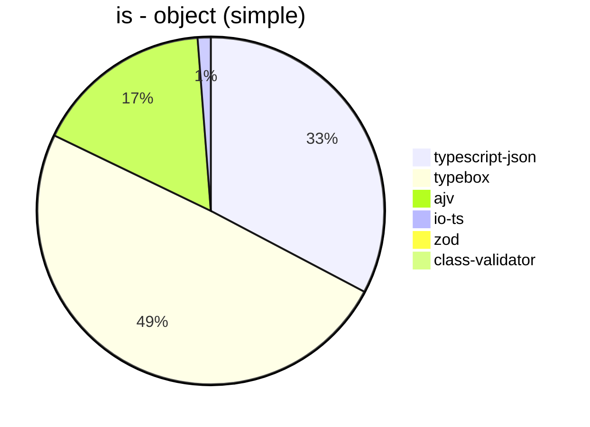


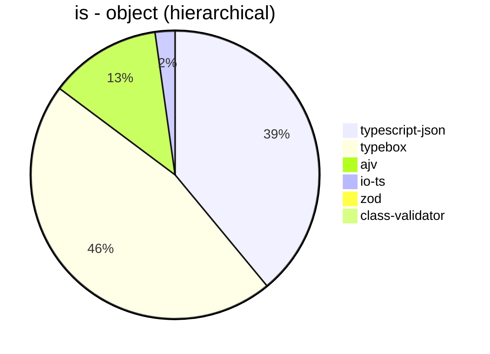


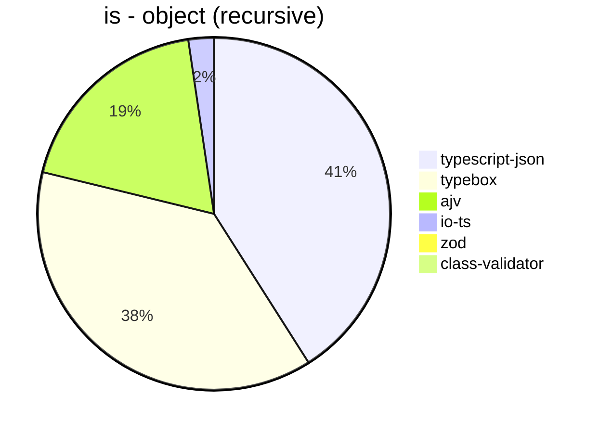


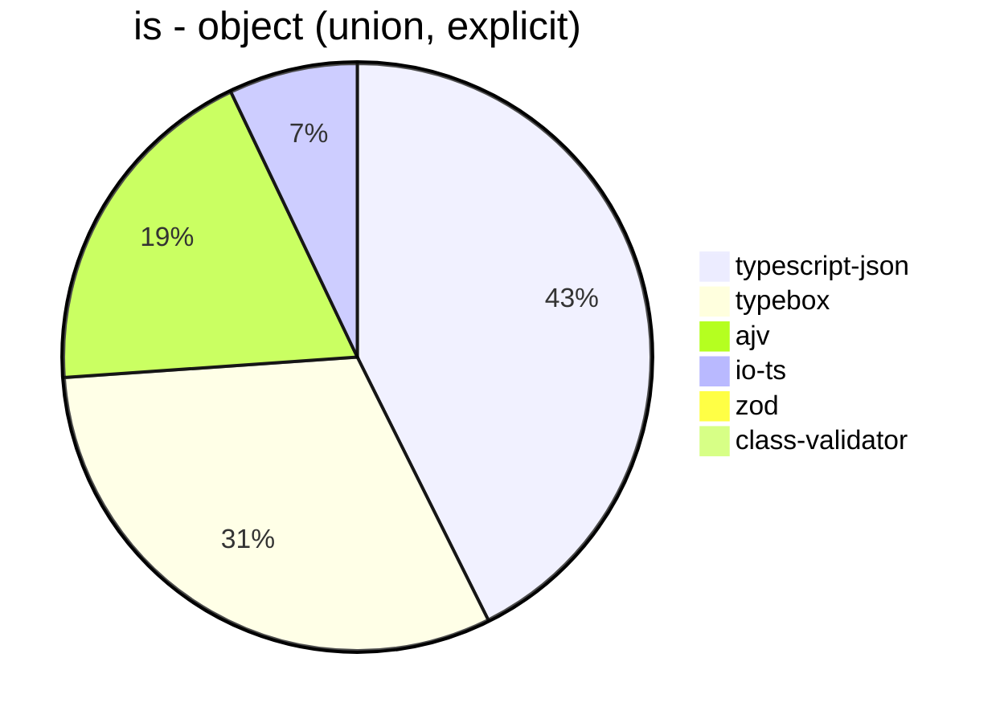


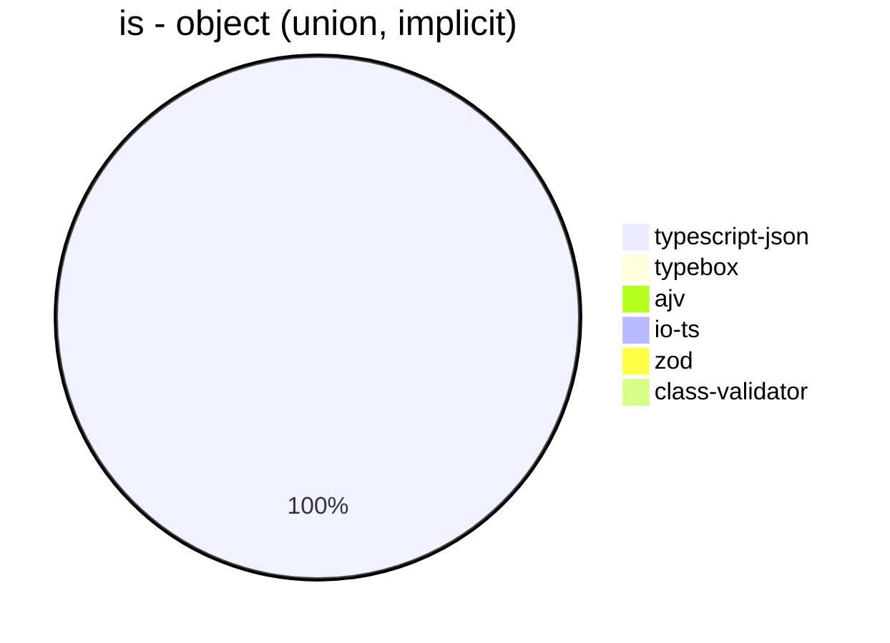


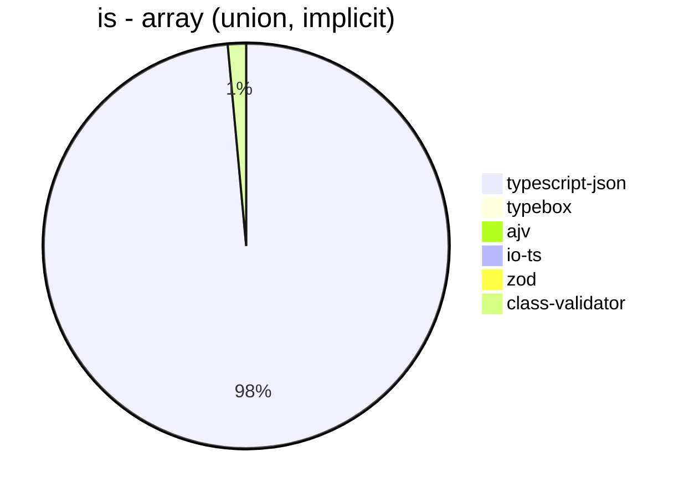


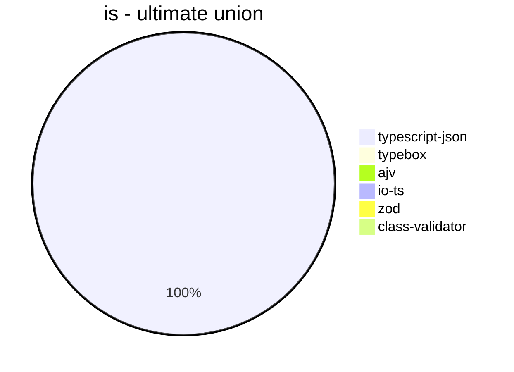


## assertType (iterate)
 Components | typescript-json | typebox | io-ts | zod | class-validator 
------------|-----------------|---------|-------|-----|-----------------
object (simple) | 357276.54232424684 | 3544.761213001635 | 18484.288022984376 | 3758.995502248875 | 198.20948970456578
object (hierarchical) | 65523.67841409691 | 890.5419766206164 | 4183.383233532934 | 430.89725036179453 | 67.76859504132231
object (recursive) | 48407.38047627704 | 389.32126696832574 | 1854.5258620689656 | 77.62985186574161 | 43.96650171298059
object (union, explicit) | 7256.667884545122 | 156.50741350906094 | 1211.164219870263 | 36.25709577000549 | 110.20408163265307
object (union, implicit) | 7077.808219178083 | Failed | Failed | 20.92760180995475 | 77.10666421883606
array (recursive) | 2938.2850901146912 | 41.49298976885184 | 187.53457495851006 | 10.262257696693274 | 3.853918150119288
array (union, explicit) | 2652.7701590784422 | 20.115477742596386 | 90.53420805998125 | 3.3695245226506927 | 42.615188490256784
array (union, implicit) | 1327.4484296599144 | Failed | Failed | 2.2189349112426036 | 29.369108049311095
ultimate union | 291.31451177845713 | Failed | Failed | 0.5079580088046055 | Failed


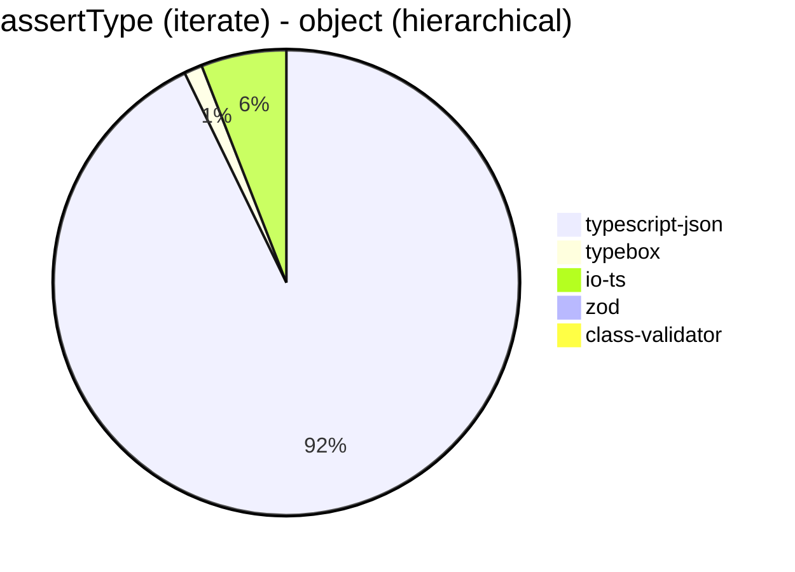


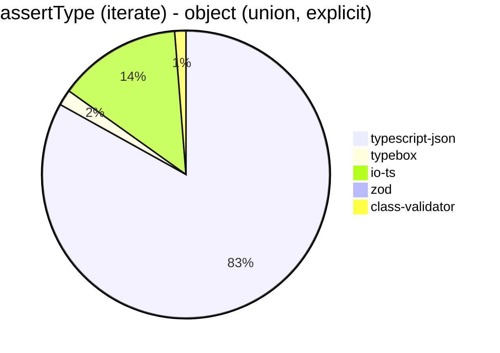


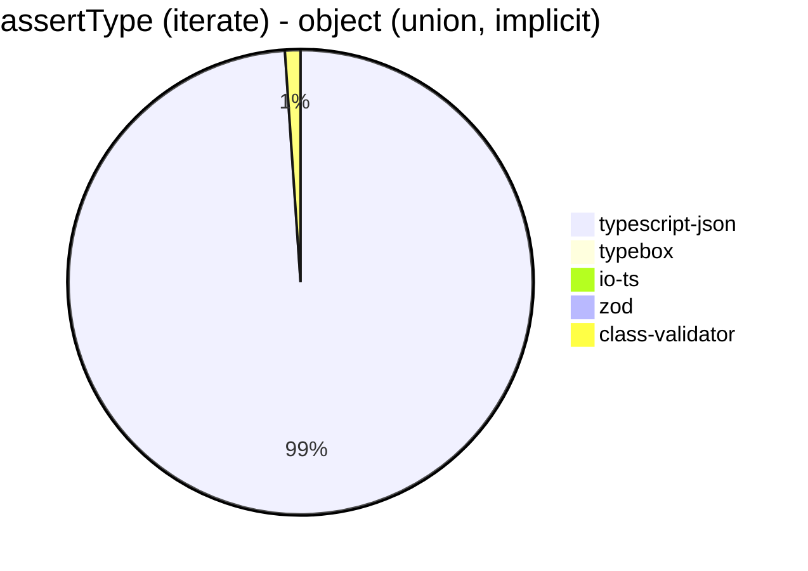


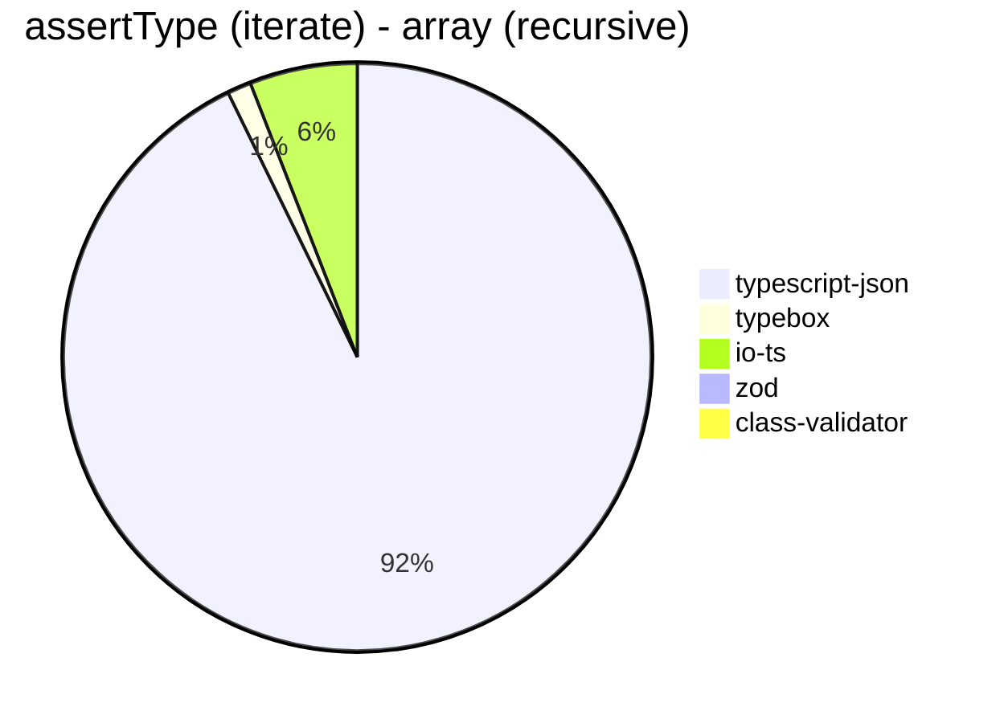


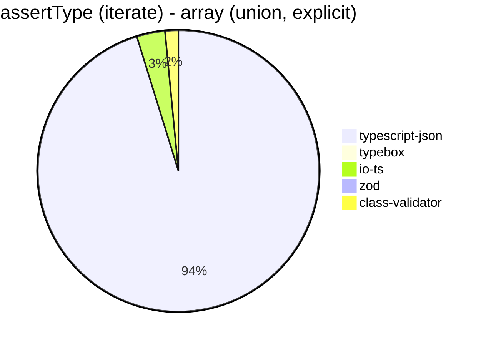


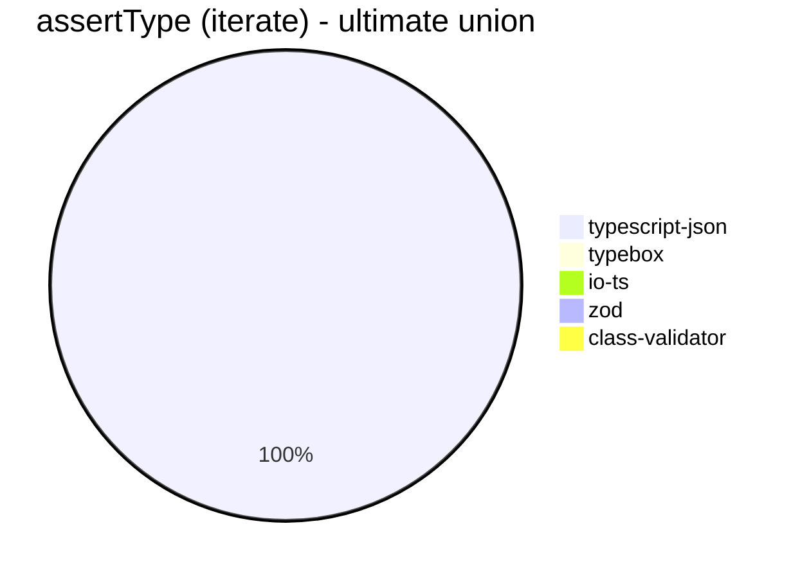


## assertType (throw)
 Components | typescript-json | typebox | io-ts | zod | class-validator 
------------|-----------------|---------|-------|-----|-----------------
object (simple) | 58166.51075771749 | 3251.285819250551 | 12674.599068804966 | 3422.123566407695 | 203.40236686390529
object (hierarchical) | 37372.634643377 | 930.925339787749 | 3818.3503243744212 | 452.23289994347084 | 73.93715341959334
object (recursive) | 5215.7943067033975 | Failed | Failed | 35.2485019386676 | 92.57544899092761
object (union, explicit) | 6321.535481598872 | 166.85205784204672 | 1329.787234042553 | 36.55638822884299 | 132.20018885741266
object (union, implicit) | 5246.078961600865 | Failed | Failed | 35.94536304816678 | 91.34088417975886
array (recursive) | 2083.7075624214117 | 53.77307761247536 | 187.58206715438 | 16.47175094712568 | 13.728720483250962
array (union, explicit) | 522.875816993464 | 18.10610175629187 | 74.487895716946 | 12.22792858889704 | 53.937432578209275
array (union, implicit) | 200.43731778425652 | Failed | Failed | 10.476689366160294 | 35.48616039744499
ultimate union | 310.445580715851 | Failed | Failed | 2.989357885926103 | Failed


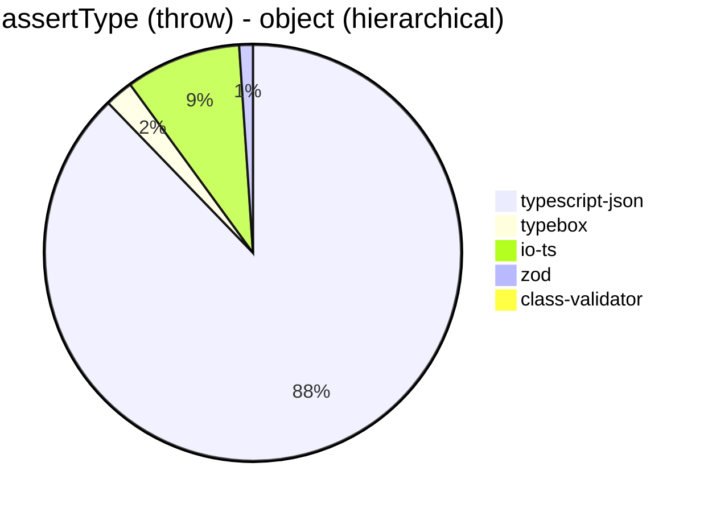


```mermaid
pie title assertType (throw) - object (recursive)
  "typescript-json": 5215.7943067033975
  "typebox": 0
  "io-ts": 0
  "zod": 35.2485019386676
  "class-validator": 92.57544899092761
```


```mermaid
pie title assertType (throw) - object (union, explicit)
  "typescript-json": 6321.535481598872
  "typebox": 166.85205784204672
  "io-ts": 1329.787234042553
  "zod": 36.55638822884299
  "class-validator": 132.20018885741266
```


```mermaid
pie title assertType (throw) - object (union, implicit)
  "typescript-json": 5246.078961600865
  "typebox": 0
  "io-ts": 0
  "zod": 35.94536304816678
  "class-validator": 91.34088417975886
```


```mermaid
pie title assertType (throw) - array (recursive)
  "typescript-json": 2083.7075624214117
  "typebox": 53.77307761247536
  "io-ts": 187.58206715438
  "zod": 16.47175094712568
  "class-validator": 13.728720483250962
```


```mermaid
pie title assertType (throw) - array (union, explicit)
  "typescript-json": 522.875816993464
  "typebox": 18.10610175629187
  "io-ts": 74.487895716946
  "zod": 12.22792858889704
  "class-validator": 53.937432578209275
```


```mermaid
pie title assertType (throw) - array (union, implicit)
  "typescript-json": 200.43731778425652
  "typebox": 0
  "io-ts": 0
  "zod": 10.476689366160294
  "class-validator": 35.48616039744499
```


```mermaid
pie title assertType (throw) - ultimate union
  "typescript-json": 310.445580715851
  "typebox": 0
  "io-ts": 0
  "zod": 2.989357885926103
  "class-validator": 0
```


## validate
 Components | typescript-json | typebox | io-ts | zod | class-validator 
------------|-----------------|---------|-------|-----|-----------------
object (simple) | 106943.93032117584 | 3291.574279379158 | 13662.309368191722 | 3613.872200983069 | 203.4552471972064
object (hierarchical) | 35617.8274990978 | 914.0062742203359 | 4105.263157894737 | 451.12781954887214 | 68.59671768393878
object (recursive) | 30237.988826815643 | 411.21320082505156 | 1927.46970253397 | 81.35593220338984 | 43.50250976017848
object (union, explicit) | 5805.194805194805 | 157.92379900607398 | 1294.1945118536494 | 37.64044943820225 | 115.06080449017774
object (union, implicit) | 4880.653950953679 | 149.97180981018607 | 375 | 21.61547212741752 | 78.64554888039322
array (recursive) | 1722.7027027027027 | 43.8496583143508 | 199.77103606182027 | 10.256410256410257 | 3.9223010833022034
array (union, explicit) | 2078.0090497737556 | 21.074615530662616 | 92.41837299391256 | 3.362600410984495 | 43.65904365904366
array (union, implicit) | 1123.9466292134832 | 14.095094906972374 | 65.77206577206576 | 2.213205459240133 | 29.50282280094701
ultimate union | 194.30189347018228 | Failed | Failed | 0.5101173269852066 | Failed


```mermaid
pie title validate - object (simple)
  "typescript-json": 106943.93032117584
  "typebox": 3291.574279379158
  "io-ts": 13662.309368191722
  "zod": 3613.872200983069
  "class-validator": 203.4552471972064
```


```mermaid
pie title validate - object (hierarchical)
  "typescript-json": 35617.8274990978
  "typebox": 914.0062742203359
  "io-ts": 4105.263157894737
  "zod": 451.12781954887214
  "class-validator": 68.59671768393878
```


```mermaid
pie title validate - object (recursive)
  "typescript-json": 30237.988826815643
  "typebox": 411.21320082505156
  "io-ts": 1927.46970253397
  "zod": 81.35593220338984
  "class-validator": 43.50250976017848
```


```mermaid
pie title validate - object (union, explicit)
  "typescript-json": 5805.194805194805
  "typebox": 157.92379900607398
  "io-ts": 1294.1945118536494
  "zod": 37.64044943820225
  "class-validator": 115.06080449017774
```


```mermaid
pie title validate - object (union, implicit)
  "typescript-json": 4880.653950953679
  "typebox": 149.97180981018607
  "io-ts": 375
  "zod": 21.61547212741752
  "class-validator": 78.64554888039322
```


```mermaid
pie title validate - array (recursive)
  "typescript-json": 1722.7027027027027
  "typebox": 43.8496583143508
  "io-ts": 199.77103606182027
  "zod": 10.256410256410257
  "class-validator": 3.9223010833022034
```


```mermaid
pie title validate - array (union, explicit)
  "typescript-json": 2078.0090497737556
  "typebox": 21.074615530662616
  "io-ts": 92.41837299391256
  "zod": 3.362600410984495
  "class-validator": 43.65904365904366
```


```mermaid
pie title validate - array (union, implicit)
  "typescript-json": 1123.9466292134832
  "typebox": 14.095094906972374
  "io-ts": 65.77206577206576
  "zod": 2.213205459240133
  "class-validator": 29.50282280094701
```


```mermaid
pie title validate - ultimate union
  "typescript-json": 194.30189347018228
  "typebox": 0
  "io-ts": 0
  "zod": 0.5101173269852066
  "class-validator": 0
```


## equals
 Components | typescript-json | typebox 
------------|-----------------|---------
object (simple) | 31575.45813869925 | 68675.86206896552
object (hierarchical) | 9931.129985228952 | 20188.76727076978
object (recursive) | 7806.710158434296 | 12467.991169977926
object (union, explicit) | 3195.5347497299244 | 3560.9007164790173
object (union, implicit) | 2083.6617699749195 | 2543.9006836991725
array (recursive) | 601.4533258803801 | 1195.9680348710497
array (union, explicit) | 849.4297933000713 | 822.3853211009175
array (union, implicit) | 528.8192501398993 | 487.51991502920873
ultimate union | 356.0732113144759 | 233.3033303330333


```mermaid
pie title equals - object (simple)
  "typescript-json": 31575.45813869925
  "typebox": 68675.86206896552
```


```mermaid
pie title equals - object (hierarchical)
  "typescript-json": 9931.129985228952
  "typebox": 20188.76727076978
```


```mermaid
pie title equals - object (recursive)
  "typescript-json": 7806.710158434296
  "typebox": 12467.991169977926
```


```mermaid
pie title equals - object (union, explicit)
  "typescript-json": 3195.5347497299244
  "typebox": 3560.9007164790173
```


```mermaid
pie title equals - object (union, implicit)
  "typescript-json": 2083.6617699749195
  "typebox": 2543.9006836991725
```


```mermaid
pie title equals - array (recursive)
  "typescript-json": 601.4533258803801
  "typebox": 1195.9680348710497
```


```mermaid
pie title equals - array (union, explicit)
  "typescript-json": 849.4297933000713
  "typebox": 822.3853211009175
```


```mermaid
pie title equals - array (union, implicit)
  "typescript-json": 528.8192501398993
  "typebox": 487.51991502920873
```


```mermaid
pie title equals - ultimate union
  "typescript-json": 356.0732113144759
  "typebox": 233.3033303330333
```


## assertEquals (iterate)
 Components | typescript-json | typebox 
------------|-----------------|---------
object (simple) | 36501.19727389942 | 2865.342163355408
object (hierarchical) | 8845.366379310346 | 790.2656511239086
object (recursive) | 7287.5299318474845 | 360.15610481323176
object (union, explicit) | 2845.1790633608816 | 123.94840157038698
object (union, implicit) | 2097.2477064220184 | 87.14392803598201
array (recursive) | 593.6547768417279 | 37.08634461772537
array (union, explicit) | 467.57553426676486 | 17.56373937677054
array (union, implicit) | 288.1113887897179 | 7.876969242310578
ultimate union | 235.93073593073595 | 4.539436353319463


```mermaid
pie title assertEquals (iterate) - object (simple)
  "typescript-json": 36501.19727389942
  "typebox": 2865.342163355408
```


```mermaid
pie title assertEquals (iterate) - object (hierarchical)
  "typescript-json": 8845.366379310346
  "typebox": 790.2656511239086
```


```mermaid
pie title assertEquals (iterate) - object (recursive)
  "typescript-json": 7287.5299318474845
  "typebox": 360.15610481323176
```


```mermaid
pie title assertEquals (iterate) - object (union, explicit)
  "typescript-json": 2845.1790633608816
  "typebox": 123.94840157038698
```


```mermaid
pie title assertEquals (iterate) - object (union, implicit)
  "typescript-json": 2097.2477064220184
  "typebox": 87.14392803598201
```


```mermaid
pie title assertEquals (iterate) - array (recursive)
  "typescript-json": 593.6547768417279
  "typebox": 37.08634461772537
```


```mermaid
pie title assertEquals (iterate) - array (union, explicit)
  "typescript-json": 467.57553426676486
  "typebox": 17.56373937677054
```


```mermaid
pie title assertEquals (iterate) - array (union, implicit)
  "typescript-json": 288.1113887897179
  "typebox": 7.876969242310578
```


```mermaid
pie title assertEquals (iterate) - ultimate union
  "typescript-json": 235.93073593073595
  "typebox": 4.539436353319463
```


## assertEquals (throw)
 Components | typescript-json | typebox 
------------|-----------------|---------
object (simple) | 20498.511904761905 | 2624.8632883703976
object (hierarchical) | 7513.189012188466 | 747.6635514018692
object (recursive) | 5817.325117796303 | 355.00747384155454
object (union, explicit) | 2636.8796923640357 | 127.73722627737226
object (union, implicit) | 1915.9911569638912 | 92.18289085545722
array (recursive) | 588.9931897662433 | 36.90717844620779
array (union, explicit) | 259.69207939157855 | 17.787264318747777
array (union, implicit) | 127.43491716730384 | 15.976993129892952
ultimate union | 234.74178403755866 | 13.66867140513942


```mermaid
pie title assertEquals (throw) - object (simple)
  "typescript-json": 20498.511904761905
  "typebox": 2624.8632883703976
```


```mermaid
pie title assertEquals (throw) - object (hierarchical)
  "typescript-json": 7513.189012188466
  "typebox": 747.6635514018692
```


```mermaid
pie title assertEquals (throw) - object (recursive)
  "typescript-json": 5817.325117796303
  "typebox": 355.00747384155454
```


```mermaid
pie title assertEquals (throw) - object (union, explicit)
  "typescript-json": 2636.8796923640357
  "typebox": 127.73722627737226
```


```mermaid
pie title assertEquals (throw) - object (union, implicit)
  "typescript-json": 1915.9911569638912
  "typebox": 92.18289085545722
```


```mermaid
pie title assertEquals (throw) - array (recursive)
  "typescript-json": 588.9931897662433
  "typebox": 36.90717844620779
```


```mermaid
pie title assertEquals (throw) - array (union, explicit)
  "typescript-json": 259.69207939157855
  "typebox": 17.787264318747777
```


```mermaid
pie title assertEquals (throw) - array (union, implicit)
  "typescript-json": 127.43491716730384
  "typebox": 15.976993129892952
```


```mermaid
pie title assertEquals (throw) - ultimate union
  "typescript-json": 234.74178403755866
  "typebox": 13.66867140513942
```


## validateEquals
 Components | typescript-json | typebox 
------------|-----------------|---------
object (simple) | 18085.86387434555 | 2568.4566145092463
object (hierarchical) | 7656.594897774561 | 758.4487534626039
object (recursive) | 5151.509639869043 | 351.2747875354108
object (union, explicit) | 1819.006940736786 | 121.31941856131198
object (union, implicit) | 1375.4768392370572 | 87.83783783783782
array (recursive) | 412.7803488786044 | 36.91783415372965
array (union, explicit) | 408.66359447004606 | 17.667173252279635
array (union, implicit) | 229.44034551016733 | 7.336343115124153
ultimate union | 156.66901905434017 | 4.546315590073878


```mermaid
pie title validateEquals - object (simple)
  "typescript-json": 18085.86387434555
  "typebox": 2568.4566145092463
```


```mermaid
pie title validateEquals - object (hierarchical)
  "typescript-json": 7656.594897774561
  "typebox": 758.4487534626039
```


```mermaid
pie title validateEquals - object (recursive)
  "typescript-json": 5151.509639869043
  "typebox": 351.2747875354108
```


```mermaid
pie title validateEquals - object (union, explicit)
  "typescript-json": 1819.006940736786
  "typebox": 121.31941856131198
```


```mermaid
pie title validateEquals - object (union, implicit)
  "typescript-json": 1375.4768392370572
  "typebox": 87.83783783783782
```


```mermaid
pie title validateEquals - array (recursive)
  "typescript-json": 412.7803488786044
  "typebox": 36.91783415372965
```


```mermaid
pie title validateEquals - array (union, explicit)
  "typescript-json": 408.66359447004606
  "typebox": 17.667173252279635
```


```mermaid
pie title validateEquals - array (union, implicit)
  "typescript-json": 229.44034551016733
  "typebox": 7.336343115124153
```


```mermaid
pie title validateEquals - ultimate union
  "typescript-json": 156.66901905434017
  "typebox": 4.546315590073878
```


## optimizer
 Components | typescript-json | typebox | ajv 
------------|-----------------|---------|-----
object (hierarchical) | 148270.88924673464 | 199.67822667143366 | 5.213014560488945
object (recursive) | 90090.59736509655 | 880.1498127340824 | 9.506398537477148
object (union) | 22016.766678432756 | 104.46947674418605 | 4.658963846440552
array (hierarchical) | 4959.168925022584 | 1013.0402384500744 | 6.882440476190475
array (recursive) | 7755.323122898767 | 890.625 | 9.774990778310586
array (union) | 4474.274163910327 | 268.9949842095486 | 6.622516556291391
ultimate union | 659.3189964157706 | 12.594458438287154 | 0.9114108640174992


```mermaid
pie title optimizer - object (hierarchical)
  "typescript-json": 148270.88924673464
  "typebox": 199.67822667143366
  "ajv": 5.213014560488945
```


```mermaid
pie title optimizer - object (recursive)
  "typescript-json": 90090.59736509655
  "typebox": 880.1498127340824
  "ajv": 9.506398537477148
```


```mermaid
pie title optimizer - object (union)
  "typescript-json": 22016.766678432756
  "typebox": 104.46947674418605
  "ajv": 4.658963846440552
```


```mermaid
pie title optimizer - array (hierarchical)
  "typescript-json": 4959.168925022584
  "typebox": 1013.0402384500744
  "ajv": 6.882440476190475
```


```mermaid
pie title optimizer - array (recursive)
  "typescript-json": 7755.323122898767
  "typebox": 890.625
  "ajv": 9.774990778310586
```


```mermaid
pie title optimizer - array (union)
  "typescript-json": 4474.274163910327
  "typebox": 268.9949842095486
  "ajv": 6.622516556291391
```


```mermaid
pie title optimizer - ultimate union
  "typescript-json": 659.3189964157706
  "typebox": 12.594458438287154
  "ajv": 0.9114108640174992
```


## stringify
 Components | TSON.stringify() | TSON.assertStringify() | TSON.isStringify() | JSON.stringify() | fast-json-stringify 
------------|------------------|------------------------|--------------------|------------------|---------------------
object (simple) | 51396.80522780904 | 43450.99818511797 | 45144.91695564884 | 6654.538772510106 | 33715.23668639053
object (hierarchical) | 5693.715341959334 | 4956.586826347305 | 5217.660292463443 | 1705.9260635333458 | 4975.081847944707
object (recursive) | 5779.796511627907 | 5510.416666666666 | 5543.596237337193 | 1317.6136363636363 | 1315.4908265557026
object (union) | 1575.6016902443507 | 1233.526430123099 | 1403.281052821345 | 685.7089342573515 | 1454.4162075706415
array (hierarchical) | 151.03223469757333 | 138.89908256880733 | 146.99413489736068 | 70.38068709377902 | 210.63171308938647
array (recursive) | 278.74246024492777 | 253.60862415494245 | 273.2827254212183 | 131.641409530765 | 134.15545590433481
array (union) | 368.0881821467293 | 316.1290322580645 | 320.3125 | 281.0760667903525 | 245.04147133068878


```mermaid
pie title stringify - object (simple)
  "TSON.stringify()": 51396.80522780904
  "TSON.assertStringify()": 43450.99818511797
  "TSON.isStringify()": 45144.91695564884
  "JSON.stringify()": 6654.538772510106
  "fast-json-stringify": 33715.23668639053
```


```mermaid
pie title stringify - object (hierarchical)
  "TSON.stringify()": 5693.715341959334
  "TSON.assertStringify()": 4956.586826347305
  "TSON.isStringify()": 5217.660292463443
  "JSON.stringify()": 1705.9260635333458
  "fast-json-stringify": 4975.081847944707
```


```mermaid
pie title stringify - object (recursive)
  "TSON.stringify()": 5779.796511627907
  "TSON.assertStringify()": 5510.416666666666
  "TSON.isStringify()": 5543.596237337193
  "JSON.stringify()": 1317.6136363636363
  "fast-json-stringify": 1315.4908265557026
```


```mermaid
pie title stringify - object (union)
  "TSON.stringify()": 1575.6016902443507
  "TSON.assertStringify()": 1233.526430123099
  "TSON.isStringify()": 1403.281052821345
  "JSON.stringify()": 685.7089342573515
  "fast-json-stringify": 1454.4162075706415
```


```mermaid
pie title stringify - array (hierarchical)
  "TSON.stringify()": 151.03223469757333
  "TSON.assertStringify()": 138.89908256880733
  "TSON.isStringify()": 146.99413489736068
  "JSON.stringify()": 70.38068709377902
  "fast-json-stringify": 210.63171308938647
```


```mermaid
pie title stringify - array (recursive)
  "TSON.stringify()": 278.74246024492777
  "TSON.assertStringify()": 253.60862415494245
  "TSON.isStringify()": 273.2827254212183
  "JSON.stringify()": 131.641409530765
  "fast-json-stringify": 134.15545590433481
```


```mermaid
pie title stringify - array (union)
  "TSON.stringify()": 368.0881821467293
  "TSON.assertStringify()": 316.1290322580645
  "TSON.isStringify()": 320.3125
  "JSON.stringify()": 281.0760667903525
  "fast-json-stringify": 245.04147133068878
```


> Total elapsed time: 1,743,954 ms
