# Benchmark of `typescript-json`
> CPU: AMD Ryzen 9 5900HX with Radeon Graphics        
> Memory: 64,928 MB
> NodeJS version: v16.16.0
> TypeScript-JSON version: 3.3.8

## valiadate
 Components | typescript-json | io-ts | zod 
------------|-----------------|-------|-----
object (hierarchical) | 20488.044485634848 | 3892.7341597796144 | 441.8064976794002
object (recursive) | 19881.074168797953 | 1869.0519433345441 | 77.86735067790399
object (union, explicit) | 4173.024769481107 | 1214.3109540636042 | 35.97252349963847
object (union, implicit) | 4854.7965658827925 | 948.8523405024398 | 55.3072625698324
array (recursive) | 1266.1654135338345 | 190.41659216878242 | 9.739651620153586
array (union, explicit) | 1874.233128834356 | 90.51412020275163 | 2.949852507374631
array (union, implicit) | 1701.2734347364699 | 125.16345974220064 | 3.987089424719954
ultimate union | 163.27960756832516 | Failed | Failed

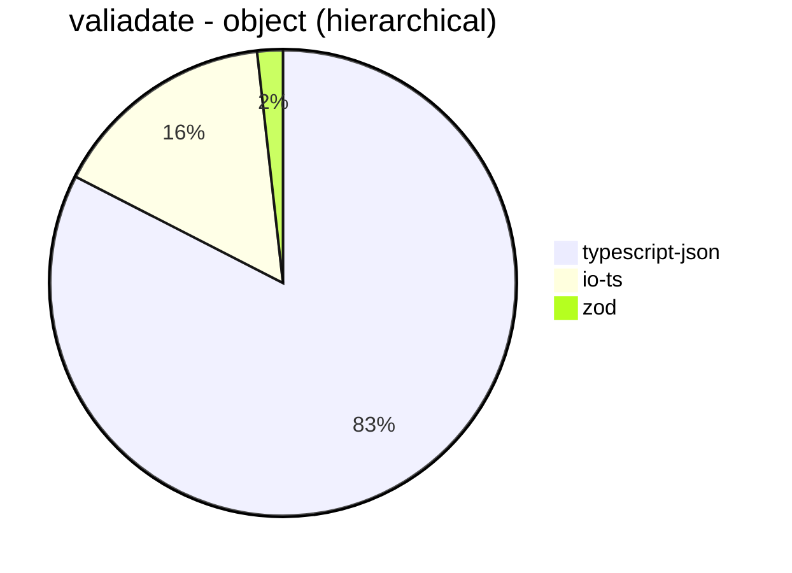
```mermaid
pie title valiadate - object (hierarchical)
  "typescript-json": 20488.044485634848
  "io-ts": 3892.7341597796144
  "zod": 441.8064976794002
```

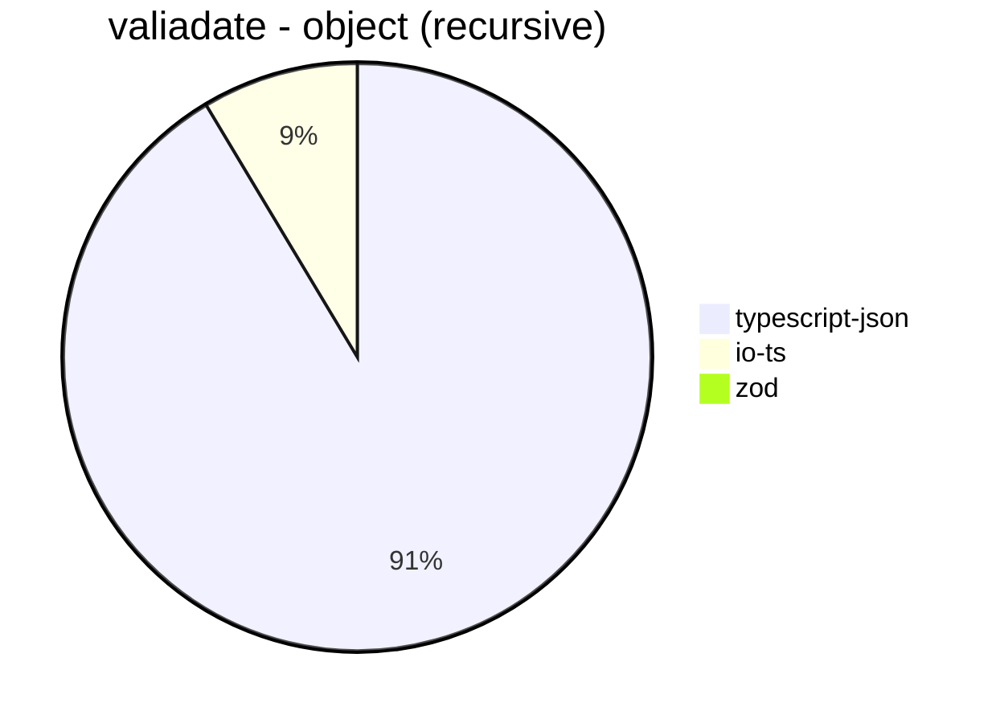
```mermaid
pie title valiadate - object (recursive)
  "typescript-json": 19881.074168797953
  "io-ts": 1869.0519433345441
  "zod": 77.86735067790399
```

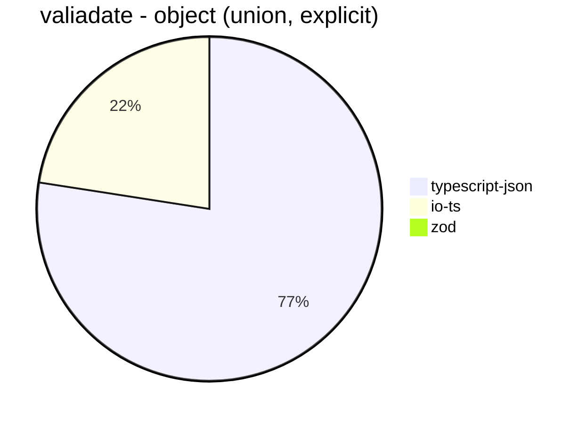
```mermaid
pie title valiadate - object (union, explicit)
  "typescript-json": 4173.024769481107
  "io-ts": 1214.3109540636042
  "zod": 35.97252349963847
```

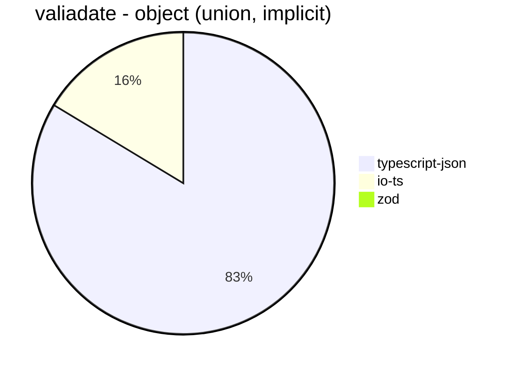
```mermaid
pie title valiadate - object (union, implicit)
  "typescript-json": 4854.7965658827925
  "io-ts": 948.8523405024398
  "zod": 55.3072625698324
```

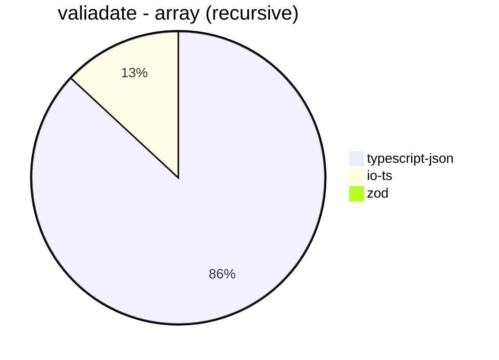
```mermaid
pie title valiadate - array (recursive)
  "typescript-json": 1266.1654135338345
  "io-ts": 190.41659216878242
  "zod": 9.739651620153586
```

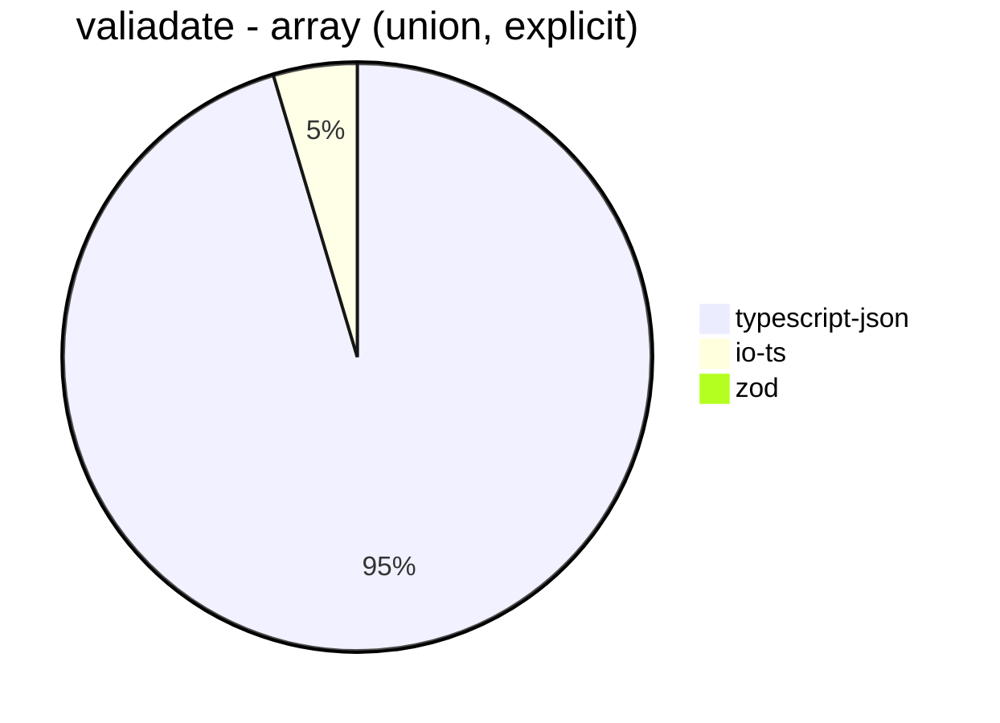
```mermaid
pie title valiadate - array (union, explicit)
  "typescript-json": 1874.233128834356
  "io-ts": 90.51412020275163
  "zod": 2.949852507374631
```

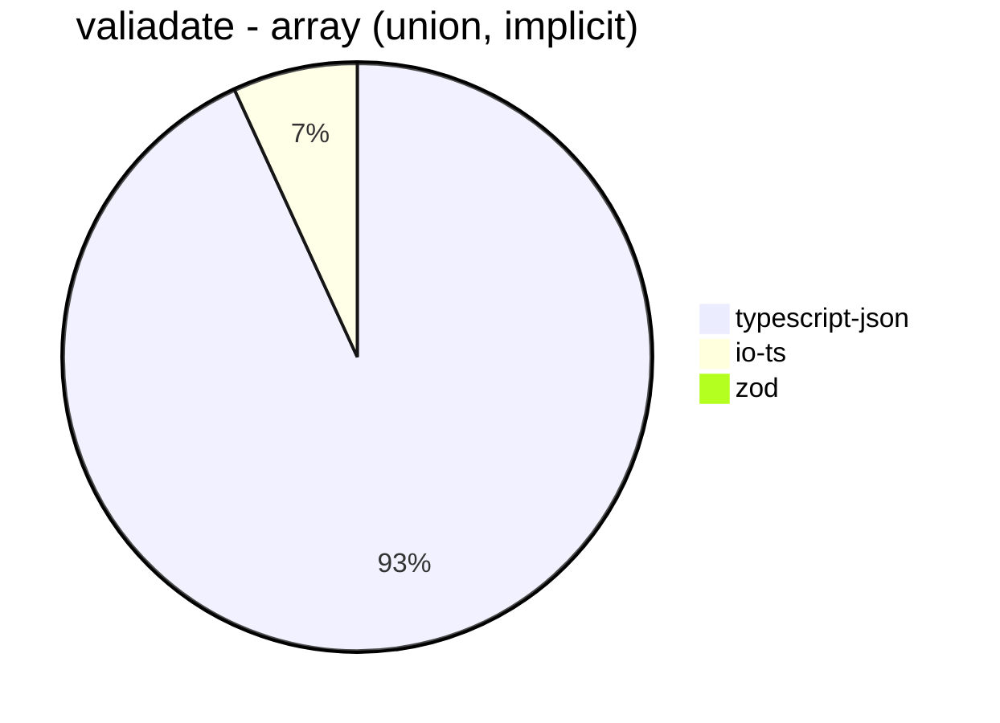
```mermaid
pie title valiadate - array (union, implicit)
  "typescript-json": 1701.2734347364699
  "io-ts": 125.16345974220064
  "zod": 3.987089424719954
```

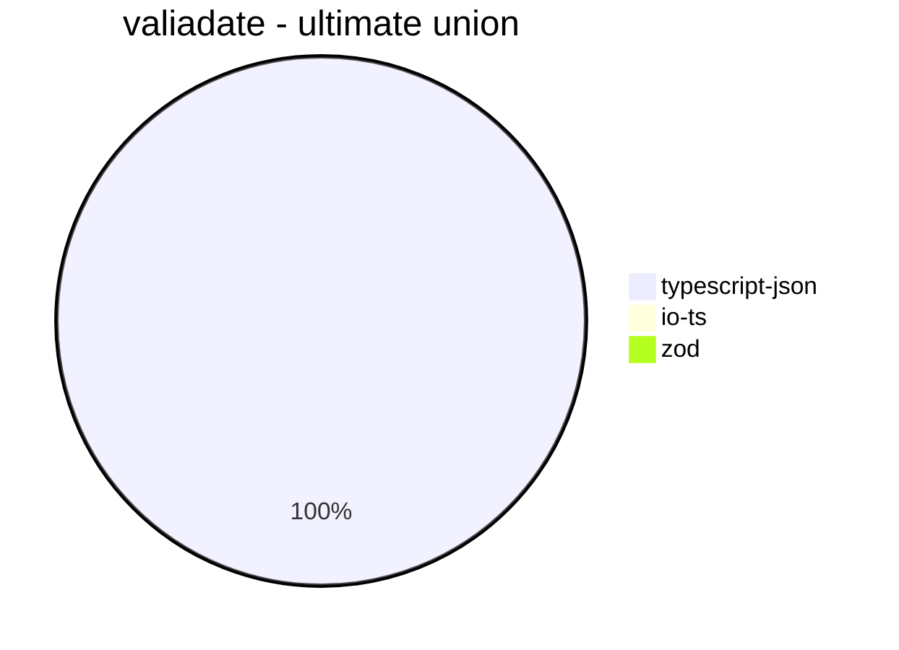
```mermaid
pie title valiadate - ultimate union
  "typescript-json": 163.27960756832516
  "io-ts": 0
  "zod": 0
```

## is
 Components | typescript-json | io-ts | zod | ajv 
------------|-----------------|-------|-----|-----
object (hierarchical) | 115517.3087164921 | 8879.669540229886 | 426.39040348964016 | 88994.80808455405
object (recursive) | 90780.11152416357 | 4870.251422279317 | 78.66218236173393 | Failed
object (union, explicit) | 15808.743169398907 | 3317.6800748362957 | 36.077705827937095 | 1308.6839749328558
object (union, implicit) | 16583.903492978032 | 3198.767892734191 | 55.15947467166979 | Failed
array (recursive) | 7978.81828316611 | 510.53027453930054 | 9.882174078297226 | Failed
array (union, explicit) | 3973.5332222839165 | 387.71305487919085 | 3.0171600980577034 | Failed
array (union, implicit) | 4063.9767357324613 | 463.86430678466076 | 3.9878465628560575 | Failed
ultimate union | 679.5805935667319 | Failed | Failed | Failed

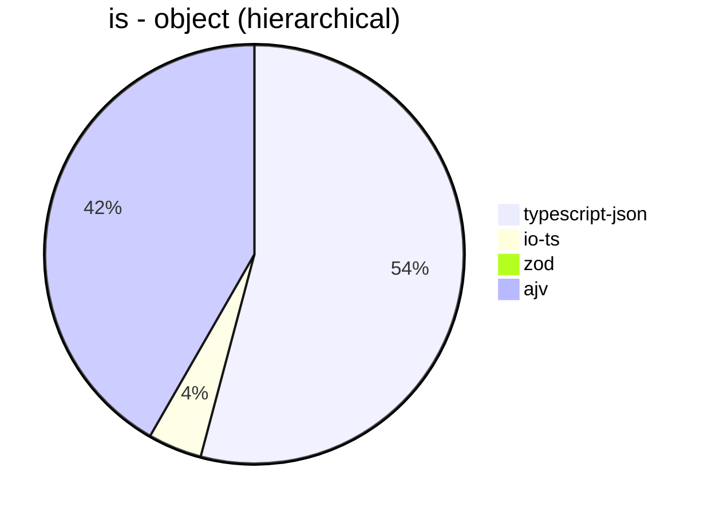
```mermaid
pie title is - object (hierarchical)
  "typescript-json": 115517.3087164921
  "io-ts": 8879.669540229886
  "zod": 426.39040348964016
  "ajv": 88994.80808455405
```

```mermaid
pie title is - object (recursive)
  "typescript-json": 90780.11152416357
  "io-ts": 4870.251422279317
  "zod": 78.66218236173393
  "ajv": 0
```

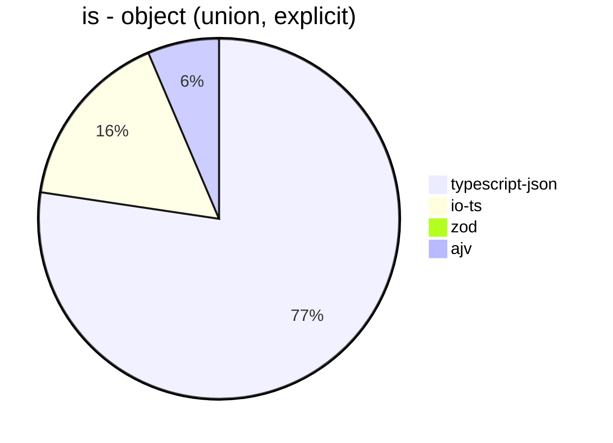
```mermaid
pie title is - object (union, explicit)
  "typescript-json": 15808.743169398907
  "io-ts": 3317.6800748362957
  "zod": 36.077705827937095
  "ajv": 1308.6839749328558
```

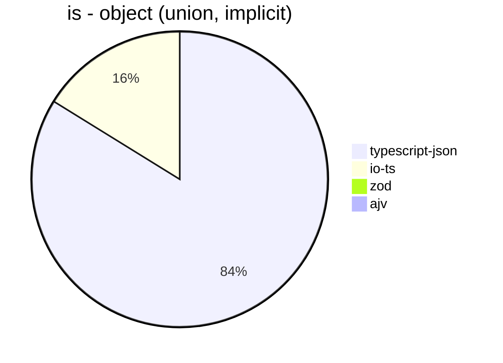
```mermaid
pie title is - object (union, implicit)
  "typescript-json": 16583.903492978032
  "io-ts": 3198.767892734191
  "zod": 55.15947467166979
  "ajv": 0
```

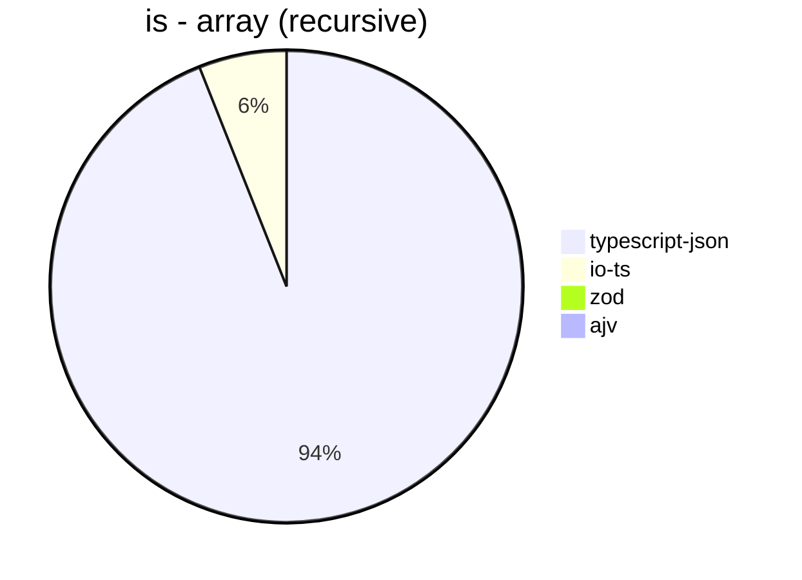
```mermaid
pie title is - array (recursive)
  "typescript-json": 7978.81828316611
  "io-ts": 510.53027453930054
  "zod": 9.882174078297226
  "ajv": 0
```

```mermaid
pie title is - array (union, explicit)
  "typescript-json": 3973.5332222839165
  "io-ts": 387.71305487919085
  "zod": 3.0171600980577034
  "ajv": 0
```

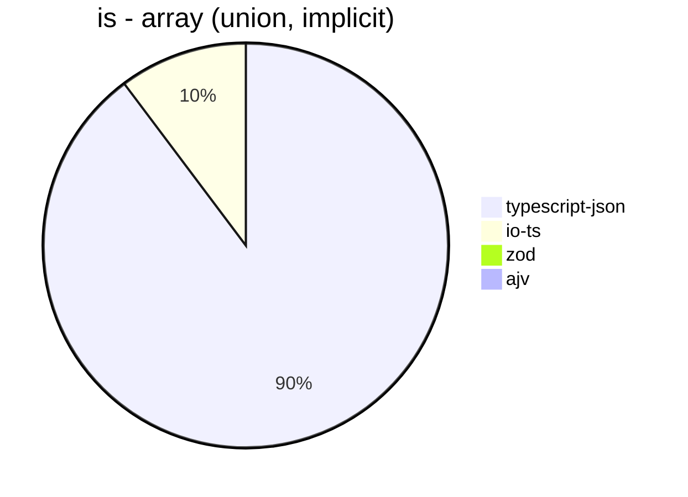
```mermaid
pie title is - array (union, implicit)
  "typescript-json": 4063.9767357324613
  "io-ts": 463.86430678466076
  "zod": 3.9878465628560575
  "ajv": 0
```

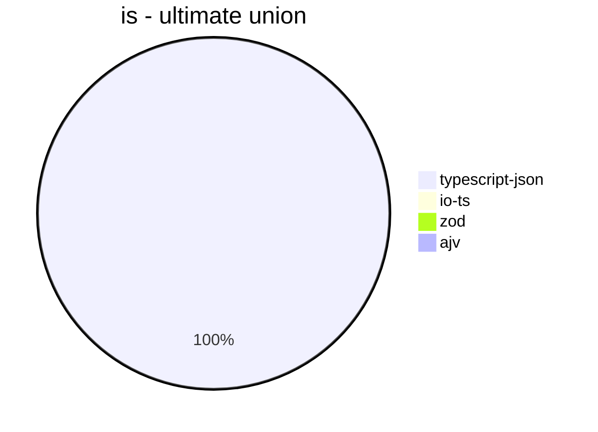
```mermaid
pie title is - ultimate union
  "typescript-json": 679.5805935667319
  "io-ts": 0
  "zod": 0
  "ajv": 0
```

## optimizer
 Components | typescript-json | fast-json-stringify | JSON.stringify() 
------------|-----------------|---------------------|------------------
object (simple) | 156332.54026354317 | 30.98197094346228 | 6665.849981153411
object (hierarchical) | 4713.482092630789 | 11.974944731024319 | 1634.8946986201888
object (recursive) | 5450.786681302598 | 75.6513926325247 | 1290.554609123604
object (union) | 2199.858130874268 | 1.250446588067167 | 952.3020257826888
array (hierarchical) | 99.41520467836257 | 10.554089709762533 | 46.7966573816156
array (recursive) | 257.1119913575801 | 52.901023890784984 | 135.59008509064003
array (union) | 339.1053391053391 | 3.191888847164852 | 276.96629213483146
ultimate union | 134.18923672177277 | 0.16812373907195696 | 193.3731667571972

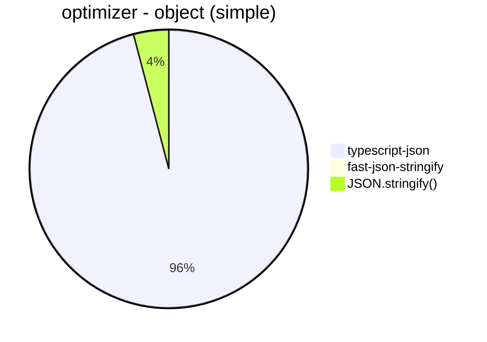
```mermaid
pie title optimizer - object (simple)
  "typescript-json": 156332.54026354317
  "fast-json-stringify": 30.98197094346228
  "JSON.stringify()": 6665.849981153411
```

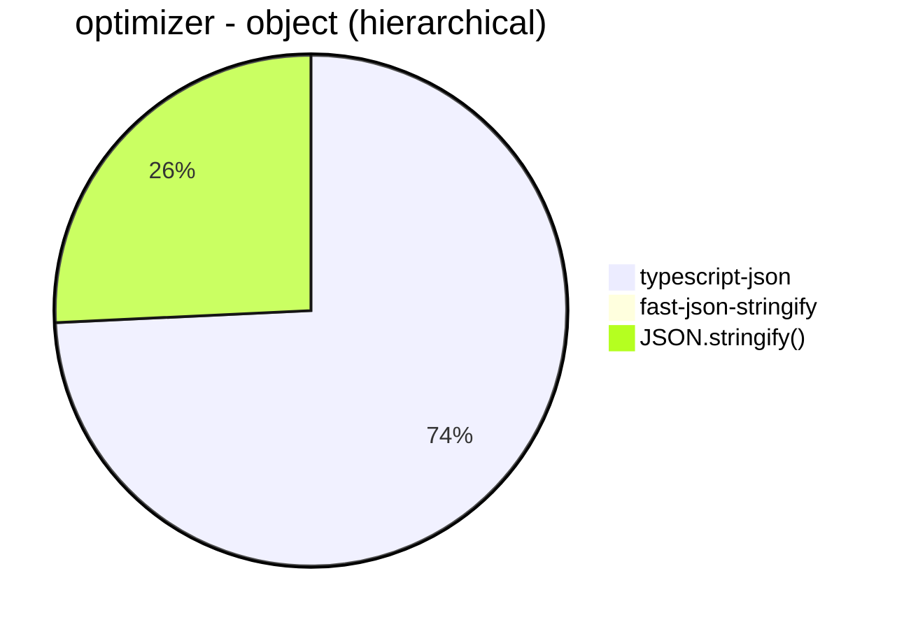
```mermaid
pie title optimizer - object (hierarchical)
  "typescript-json": 4713.482092630789
  "fast-json-stringify": 11.974944731024319
  "JSON.stringify()": 1634.8946986201888
```

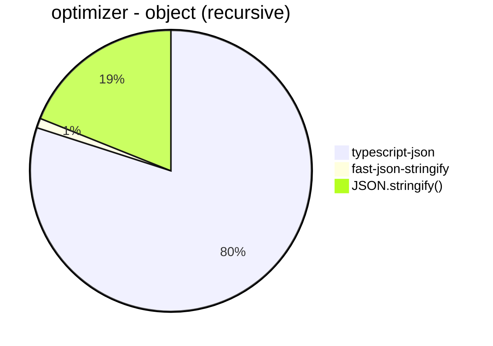
```mermaid
pie title optimizer - object (recursive)
  "typescript-json": 5450.786681302598
  "fast-json-stringify": 75.6513926325247
  "JSON.stringify()": 1290.554609123604
```

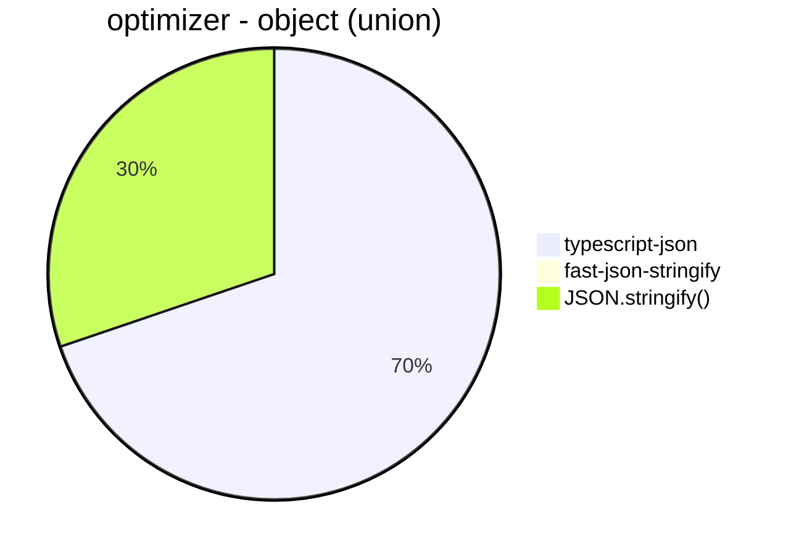
```mermaid
pie title optimizer - object (union)
  "typescript-json": 2199.858130874268
  "fast-json-stringify": 1.250446588067167
  "JSON.stringify()": 952.3020257826888
```

```mermaid
pie title optimizer - array (hierarchical)
  "typescript-json": 99.41520467836257
  "fast-json-stringify": 10.554089709762533
  "JSON.stringify()": 46.7966573816156
```

```mermaid
pie title optimizer - array (recursive)
  "typescript-json": 257.1119913575801
  "fast-json-stringify": 52.901023890784984
  "JSON.stringify()": 135.59008509064003
```

```mermaid
pie title optimizer - array (union)
  "typescript-json": 339.1053391053391
  "fast-json-stringify": 3.191888847164852
  "JSON.stringify()": 276.96629213483146
```

```mermaid
pie title optimizer - ultimate union
  "typescript-json": 134.18923672177277
  "fast-json-stringify": 0.16812373907195696
  "JSON.stringify()": 193.3731667571972
```

## stringify
 Components | typescript-json | fast-json-stringify | JSON.stringify() 
------------|-----------------|---------------------|------------------
object (simple) | 144925.5865102639 | 30439.11706169712 | 6612.11778029445
object (hierarchical) | 5077.910003718855 | 4782.0777756904 | 1683.1422664912611
object (recursive) | 5711.205307777368 | 1198.1491562329886 | 1278.5795670338018
object (union) | 2242.802824551874 | 1585.1773796979276 | 949.8700334199777
array (hierarchical) | 102.42929659173313 | 147.70240700218818 | 51.814440703329595
array (recursive) | 260.6334841628959 | 129.577988473694 | 129.0501758933531
array (union) | 344.8957584471603 | 239.51334664971856 | 273.38530066815144
ultimate union | 140.51394204483324 | 73.58093903293623 | 202.88514888108008

```mermaid
pie title stringify - object (simple)
  "typescript-json": 144925.5865102639
  "fast-json-stringify": 30439.11706169712
  "JSON.stringify()": 6612.11778029445
```

```mermaid
pie title stringify - object (hierarchical)
  "typescript-json": 5077.910003718855
  "fast-json-stringify": 4782.0777756904
  "JSON.stringify()": 1683.1422664912611
```

```mermaid
pie title stringify - object (recursive)
  "typescript-json": 5711.205307777368
  "fast-json-stringify": 1198.1491562329886
  "JSON.stringify()": 1278.5795670338018
```

```mermaid
pie title stringify - object (union)
  "typescript-json": 2242.802824551874
  "fast-json-stringify": 1585.1773796979276
  "JSON.stringify()": 949.8700334199777
```

```mermaid
pie title stringify - array (hierarchical)
  "typescript-json": 102.42929659173313
  "fast-json-stringify": 147.70240700218818
  "JSON.stringify()": 51.814440703329595
```

```mermaid
pie title stringify - array (recursive)
  "typescript-json": 260.6334841628959
  "fast-json-stringify": 129.577988473694
  "JSON.stringify()": 129.0501758933531
```

```mermaid
pie title stringify - array (union)
  "typescript-json": 344.8957584471603
  "fast-json-stringify": 239.51334664971856
  "JSON.stringify()": 273.38530066815144
```

```mermaid
pie title stringify - ultimate union
  "typescript-json": 140.51394204483324
  "fast-json-stringify": 73.58093903293623
  "JSON.stringify()": 202.88514888108008
```

