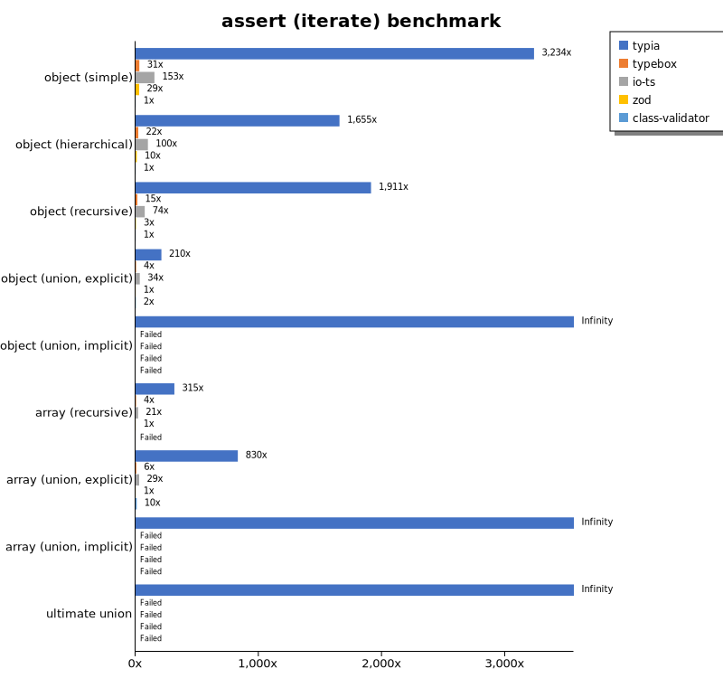
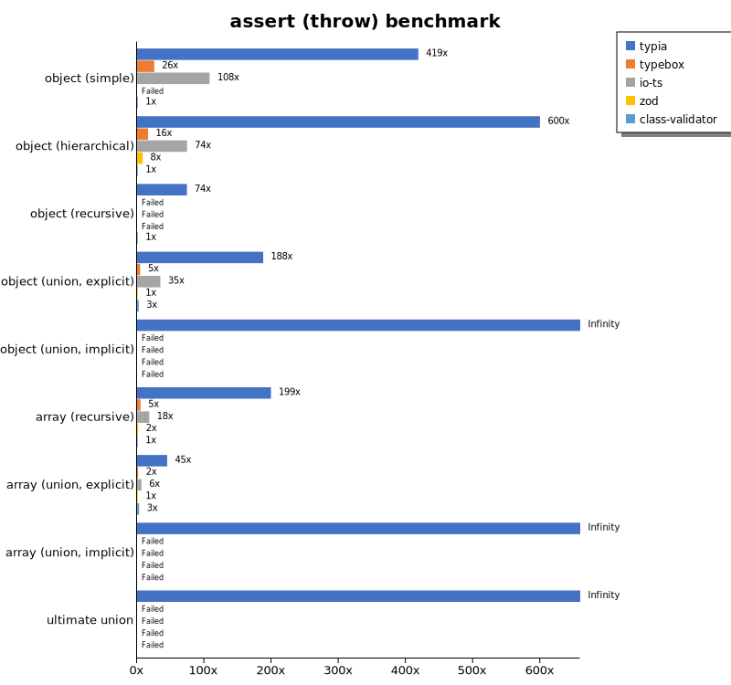
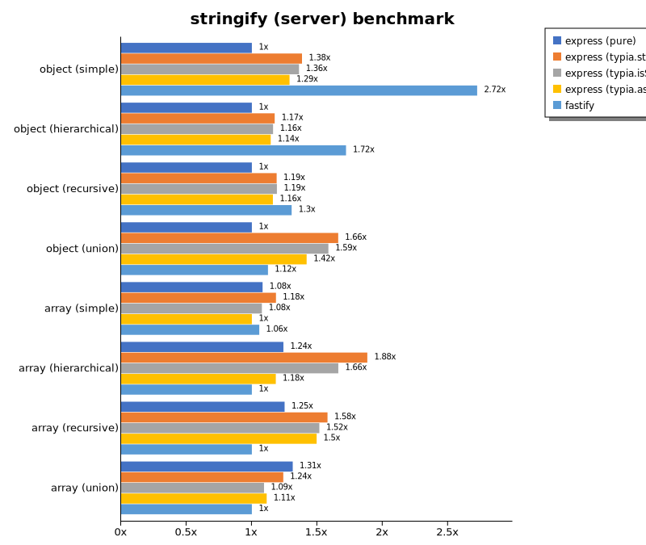

# Benchmark of `typia`
> - CPU: AMD Ryzen 9 5900HX with Radeon Graphics
> - Memory: 64,928 MB
> - OS: win32
> - Typia version: 3.3.35

## is

 Components | typia | typebox | ajv | io-ts | zod | class-validator 
------------|-----------------|---------|-----|-------|-----|-----------------
object (simple) | 276696.38839556504 | 145980.02173575308 | 63753.88127263682 | 4746.989036720898 | 501.4307329819546 | 18.18195771566351
object (hierarchical) | 176568.26546442008 | 171821.3240396669 | 48455.09822700331 | 7958.087858606557 | 383.50193787944494 | 36.95327021375465
object (recursive) | 121376.22444388039 | 93214.19158079321 | 51593.96717369292 | 6323.611497128033 | 85.62848630831643 | 27.45743515003615
object (union, explicit) | 25926.039841877187 | 15715.748682435524 | 10362.272360669534 | 3432.924349240781 | 39.37168330635006 | 87.888896876659
object (union, implicit) | 32880.068737774774 | Failed | Failed | Failed | Failed | Failed
array (recursive) | 102437.12535511365 | 82613.83309502163 | 26534.945867950373 | 5805.004371140531 | 113.7931956391047 | 31.492872021143164
array (union, explicit) | 28312.285844669786 | 13170.578326161889 | 5937.7203683242315 | 2598.728847381865 | 24.97866274165603 | 208.7168479000363
array (union, implicit) | 15696.997463383273 | Failed | Failed | Failed | Failed | Failed
ultimate union | 8560.435925777065 | Failed | Failed | Failed | Failed | Failed

 Unit: kilobytes/sec 

## assert (iterate)

 Components | typia | typebox | io-ts | zod | class-validator 
------------|-----------------|---------|-------|-----|-----------------
object (simple) | 51614.30316704294 | 489.33835555405165 | 2445.746368938701 | 468.6481411834427 | 15.957890438063684
object (hierarchical) | 61088.94753295624 | 814.3519899926553 | 3694.7219618375043 | 373.4479317033562 | 36.905685827529325
object (recursive) | 57439.653206466865 | 444.173560743427 | 2236.7759799268383 | 88.63313232694455 | 30.052257234279352
object (union, explicit) | 8300.686669397413 | 173.93711635044642 | 1361.9708288865174 | 39.573706099815155 | 89.89033700758945
object (union, implicit) | 10773.254845307883 | Failed | Failed | Failed | Failed
array (recursive) | 34139.972486720166 | 467.13288297358247 | 2223.1428933330226 | 108.36204386645962 | Failed
array (union, explicit) | 18598.06095157658 | 142.51361811926606 | 658.0957417388439 | 22.407586104513065 | 216.47135416666669
array (union, implicit) | 11442.268613387978 | Failed | Failed | Failed | Failed
ultimate union | 3778.258125330746 | Failed | Failed | Failed | Failed

 Unit: kilobytes/sec 

## assert (throw)

 Components | typia | typebox | io-ts | zod | class-validator 
------------|-----------------|---------|-------|-----|-----------------
object (simple) | 7180.314422395262 | 419.23804706235006 | 1711.598136974945 | Failed | 16.094850453415578
object (hierarchical) | 30976.682498270296 | 791.3492510756133 | 3365.0359966528163 | 380.69378158338014 | 46.02749083544533
object (recursive) | 7804.093461981566 | Failed | Failed | Failed | 102.39363209686196
object (union, explicit) | 6854.040852575488 | 176.30008873528863 | 1345.0796070460706 | 37.705636461704415 | 96.52004326215021
object (union, implicit) | 7821.510284523378 | Failed | Failed | Failed | Failed
array (recursive) | 25742.75064032199 | 583.2839928037673 | 2274.2627201076734 | 178.51508581316983 | 109.21966204048684
array (union, explicit) | 3501.798535406742 | 123.32440577009937 | 493.8329433441852 | 76.10665469255213 | 246.0265222337358
array (union, implicit) | 1754.7385026568827 | Failed | Failed | Failed | Failed
ultimate union | 3795.0639298923634 | Failed | Failed | Failed | Failed

 Unit: kilobytes/sec 

## validate

 Components | typia | typebox | io-ts | zod | class-validator 
------------|-----------------|---------|-------|-----|-----------------
object (simple) | 14926.764705882351 | 418.7556357078449 | 2052.675276752768 | 472.53735473159935 | 16.103022484334684
object (hierarchical) | 29798.375794610714 | 799.199928134696 | 3621.0883296716 | 388.404099048685 | 36.339070013408545
object (recursive) | 34383.605615798544 | 447.91606905177156 | 2156.5647523563116 | 85.80308007637016 | 30.054289767505974
object (union, explicit) | 6216.349401116715 | 166.12501125517738 | 1398.9847904823032 | 39.67893835616439 | 92.13801166882756
object (union, implicit) | 6936.696572040707 | 205.7314019018793 | 538.0119884465479 | 28.274852776219852 | Failed
array (recursive) | 19951.91406963992 | 470.91720130663657 | 2200.828259722987 | 110.5561201313828 | 30.613048311814975
array (union, explicit) | 14846.518707959642 | 143.58883304195803 | 652.2765654370301 | 22.696982083640382 | 215.65254594898724
array (union, implicit) | 10724.871661804307 | 128.31676673600606 | 601.9879112308565 | 18.528687433439828 | Failed
ultimate union | 2728.007263469547 | Failed | Failed | Failed | Failed

 Unit: kilobytes/sec 

## equals

 Components | typia | typebox 
------------|-----------------|---------
object (simple) | 15228.758556342873 | 9186.10629656457
object (hierarchical) | 16012.626409151191 | 17607.678364102445
object (recursive) | 20250.479193696316 | 14794.676471267554
object (union, explicit) | 8899.009253381719 | 4107.333030658188
object (union, implicit) | 8069.16368853604 | 3554.1137761308346
array (recursive) | 20522.796943631038 | 14050
array (union, explicit) | 13562.094039090704 | 5387.341677150046
array (union, implicit) | 6135.260296658987 | 4286.720830845886
ultimate union | 5879.413357799788 | Failed

 Unit: kilobytes/sec 

## assertEquals (iterate)

 Components | typia | typebox 
------------|-----------------|---------
object (simple) | 6640.992105881141 | 366.57831712267694
object (hierarchical) | 17205.447932304374 | 670.1559934318554
object (recursive) | 18940.388274737223 | 394.3670124097055
object (union, explicit) | 4507.097045766564 | 128.1018109033266
object (union, implicit) | 5242.271435950413 | 123.1155012548801
array (recursive) | 15284.941707613887 | 409.17198069334836
array (union, explicit) | 11818.03705601093 | 115.61459473636198
array (union, implicit) | 7632.165043364537 | 65.93560039012883
ultimate union | 3462.188127230151 | Failed

 Unit: kilobytes/sec 

## assertEquals (throw)

 Components | typia | typebox 
------------|-----------------|---------
object (simple) | 3846.694167009885 | 331.2511514369934
object (hierarchical) | 11745.758519936595 | 640.8462510361024
object (recursive) | 12837.550037002153 | 378.94774851683223
object (union, explicit) | 4298.616518824485 | 134.05727835098614
object (union, implicit) | 4459.636893085541 | 128.02207465594242
array (recursive) | 12072.91369747068 | 392.7291973695963
array (union, explicit) | 2984.7577285558186 | 119.38596071896855
array (union, implicit) | 1424.7227718955592 | 132.67444406685559
ultimate union | 3591.051691328363 | Failed

 Unit: kilobytes/sec 

## validateEquals

 Components | typia | typebox 
------------|-----------------|---------
object (simple) | 4132.152655746329 | 340.7244765967653
object (hierarchical) | 9754.369989641506 | 656.7005131414991
object (recursive) | 11029.10049131627 | 376.28331927216345
object (union, explicit) | 2954.973855696883 | 127.05928467551354
object (union, implicit) | 3251.6602425950487 | 119.4128226468442
array (recursive) | 8535.466598252118 | 413.87816594663883
array (union, explicit) | 8177.368276115292 | 117.48963588918718
array (union, implicit) | 5746.847113458387 | 68.68209067066317
ultimate union | 2224.3488417636527 | Failed

 Unit: kilobytes/sec 

## optimizer

 Components | typia | typebox | ajv 
------------|-----------------|---------|-----
object (hierarchical) | 171008.18452380953 | 174.0465666118421 | 4.7011838660166125
object (recursive) | 121646.52555425836 | 980.9490206015463 | 10.836164858953758
object (union) | 30268.29837801177 | 156.39542289402175 | 7.103526147129854
array (hierarchical) | 147868.31752990754 | 43351.56393929624 | 314.87227879213486
array (recursive) | 73338.37260422044 | 9460.51697914782 | 115.53221009741476
array (union) | 28393.180818532175 | 1794.3581046516913 | 46.939642865467086
ultimate union | 8630.56755269477 | 190.85007889363283 | 12.873509624053371

 Unit: kilobytes/sec 

## stringify

 Components | typia.stringify() | typia.assertStringify() | typia.isStringify() | fast-json-stringify | JSON.stringify 
------------|------------------|------------------------|--------------------|---------------------|----------------
object (simple) | 6531.86553030303 | 5585.969488646939 | 6140.3644373598645 | 4254.686640066043 | 862.1393552483071
object (hierarchical) | 5020.041138215146 | 4261.70163921336 | 4554.610421569515 | 5547.897085417038 | 1430.0473245982807
object (recursive) | 6570.694829178209 | 6086.257254568338 | 6275.764084347195 | 1342.7779146799926 | 1369.102028570097
object (union) | 2114.4857251661742 | 1616.1071151511064 | 1912.7733668625679 | 2134.7944415983607 | 959.0495153557532
array (simple) | 1985.3890813666299 | 1508.2350091993756 | 1710.2542929378149 | 2469.2239816498786 | 1533.8632951252569
array (hierarchical) | 3462.1999388966483 | 3058.436602011494 | 3369.675062189055 | 4690.750675613778 | 1612.020978938421
array (recursive) | 3015.8321711393382 | 2829.6599601051507 | 2978.170775804444 | 1490.0184239028065 | 1488.0563981376977
array (union) | 2152.746116660557 | 1907.2522333652794 | 1964.743301564467 | 1669.858917654687 | 1868.7756267572634

 Unit: kilobytes/sec 

## stringify (server)

 Components | express (pure) | express (typia.stringify) | express (typia.isStringify) | express (typia.assertStringify) | fastify 
------------|----------------|--------------------------|----------------------------|--------------------------------|---------
object (simple) | 47740.10469812925 | 66133.03651147959 | 64933.44613729044 | 61395.581420068025 | 125918.89199392346
object (hierarchical) | 103218.0303866198 | 115940.08501265335 | 115428.91916336954 | 114532.6488095238 | 179129.86849568665
object (recursive) | 50577.110707078726 | 60158.42580782313 | 59079.52297410666 | 58268.76275510204 | 65529.55994897959
object (union) | 76347.2823716351 | 129624.72195568736 | 124134.12854164588 | 110409.54250523064 | 84152.87195851615
array (simple) | 106170.05879630783 | 118849.4782065813 | 97841.35601622424 | 99001.38217410937 | 105445.60669456067
array (hierarchical) | 96631.23737420682 | 141146.2887327113 | 117755.8132320826 | 84083.04676260665 | 76967.75943418092
array (recursive) | 43576.9941221993 | 51870.58465124388 | 51213.9401948943 | 50829.34202652838 | 43362.59176303276
array (union) | 120458.52191397392 | 116850.35904951162 | 101158.158514425 | 101849.19724770641 | 94995.09741863408

 Unit: megabytes/sec 

