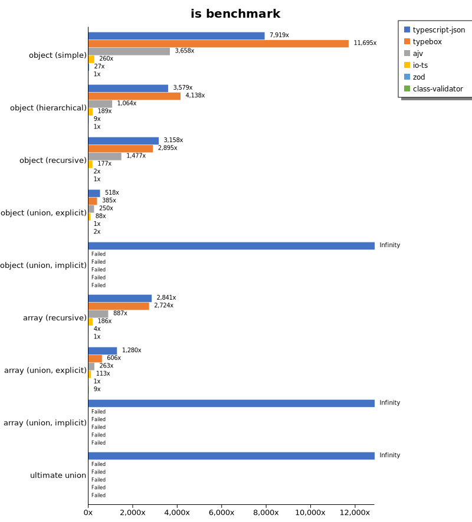
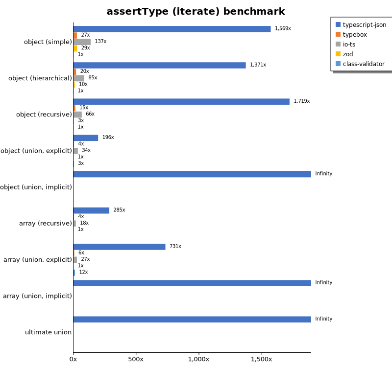
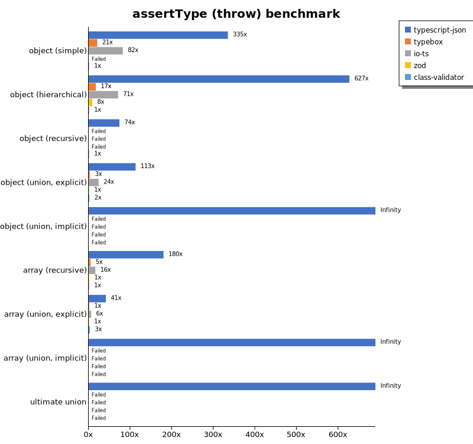
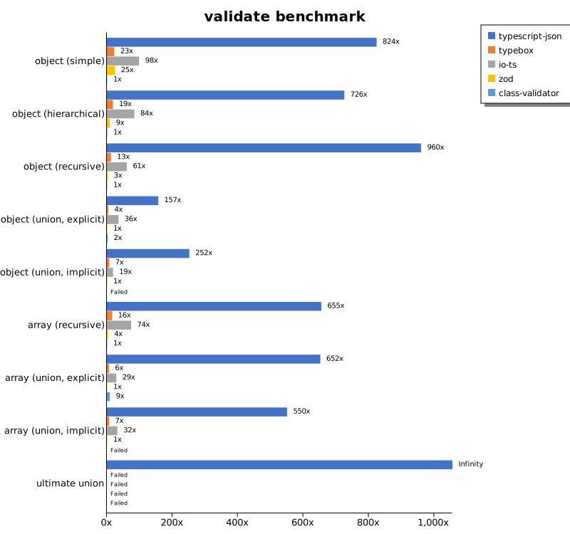
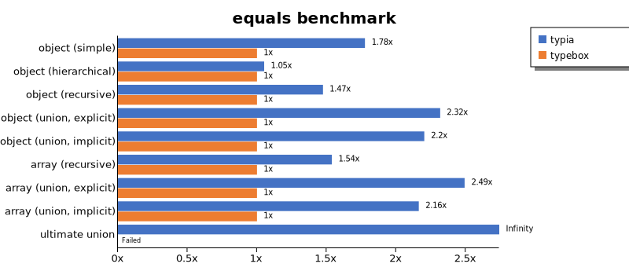
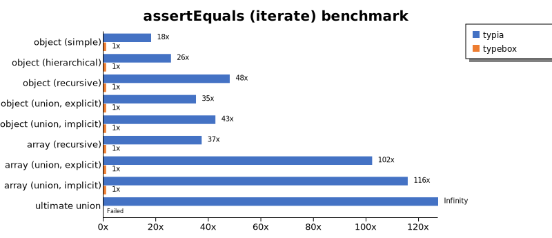
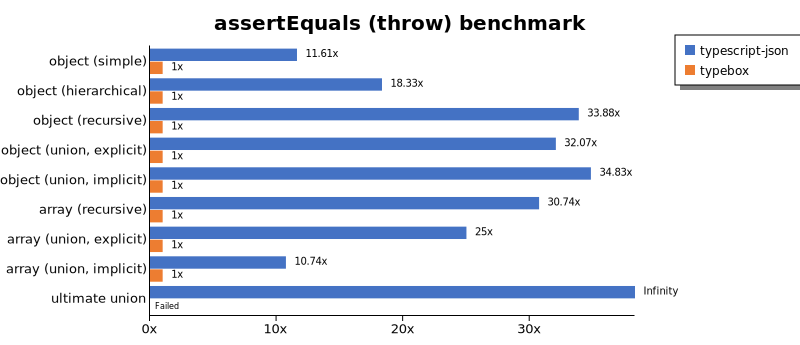
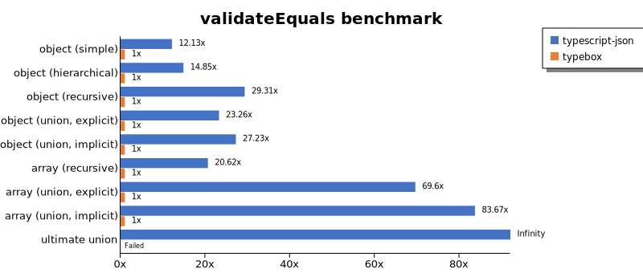
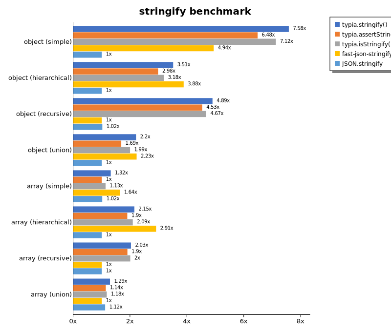

# Benchmark of `typescript-json`
> - CPU: AMD Ryzen 9 5900HX with Radeon Graphics
> - Memory: 64,928 MB
> - OS: win32
> - TypeScript-JSON version: 3.3.20

## is

 Components | typescript-json | typebox | ajv | io-ts | zod | class-validator 
------------|-----------------|---------|-----|-------|-----|-----------------
object (simple) | 1058277.1549347546 | 1677272.5773951272 | 525821.3891951488 | 38395.42067962929 | 3882.1326676176895 | 151.32408575031525
object (hierarchical) | 161469.73754686664 | 193460.0317628375 | 54247.34917733089 | 9475.922224241323 | 454.7287390029325 | 42.50681198910082
object (recursive) | 97350.16465422612 | 90399.63503649634 | 44950.504124656276 | 5703.392922291135 | 76.90878692179082 | 27.685492801771872
object (union, explicit) | 19038.893844781443 | 14707.959641255604 | 8627.371749824315 | 3366.301725737613 | 35.66924878400288 | 102.94117647058823
object (union, implicit) | 21567.552395209583 | Failed | Failed | Failed | Failed | Failed
array (recursive) | 7795.364612775579 | 7635.451505016723 | 2450.3901895206245 | 541.3702733058781 | 9.987053819123359 | 2.745744096650192
array (union, explicit) | 4152.962625341841 | 2045.4035874439462 | 858.7278106508875 | 389.99442068067697 | 3.3210332103321036 | 42.20532319391635
array (union, implicit) | 1462.198685171658 | Failed | Failed | Failed | Failed | Failed
ultimate union | 660.9702315325248 | Failed | Failed | Failed | Failed | Failed

## assertType (iterate)

 Components | typescript-json | typebox | io-ts | zod | class-validator 
------------|-----------------|---------|-------|-----|-----------------
object (simple) | 200364.0429338104 | 3449.4361911580454 | 17446.32667617689 | 3653.649635036496 | 127.69455608330288
object (hierarchical) | 59335.36055603823 | 878.9983549625297 | 3690.968072392009 | 429.8009682625068 | 43.28767123287672
object (recursive) | 48080.89409260245 | 407.7669902912621 | 1837.7812663526952 | 80.55975794251134 | 27.974636329727712
object (union, explicit) | 7351.789211322771 | 152.15053763440858 | 1296.5367965367966 | 37.58542141230068 | 107.78443113772455
object (union, implicit) | 7024.811218985975 | Failed | Failed | Failed | Failed
array (recursive) | 2913.6266094420603 | 40.91411721341688 | 189.0547263681592 | 10.229210077666224 | Failed
array (union, explicit) | 2436.893203883495 | 20.32967032967033 | 89.82035928143713 | 3.333333333333333 | 39.394492066387016
array (union, implicit) | 1451.5590200445436 | Failed | Failed | Failed | Failed
ultimate union | 295.72836801752464 | Failed | Failed | Failed | Failed

## assertType (throw)

 Components | typescript-json | typebox | io-ts | zod | class-validator 
------------|-----------------|---------|-------|-----|-----------------
object (simple) | 53433.00110741972 | 3370.786516853932 | 12470.545586369402 | Failed | 150.12197410395947
object (hierarchical) | 34000 | 927.8545729975384 | 3530.2465850629774 | 472.5897920604915 | 54.34782608695653
object (recursive) | 4013.0151843817785 | Failed | Failed | Failed | 74.69654528478057
object (union, explicit) | 6213.976945244957 | 167.34845667534398 | 1185.324553151458 | 36.663611365719525 | 111.19347664936991
object (union, implicit) | 5491.063202505989 | Failed | Failed | Failed | Failed
array (recursive) | 2325.152242111091 | 55.59673832468496 | 185.2881230313137 | 16.55629139072848 | 11.49425287356322
array (union, explicit) | 516.1290322580645 | 17.83166904422254 | 72.92616226071102 | 12.23540927444023 | 54.62490895848507
array (union, implicit) | 204.7654504839911 | Failed | Failed | Failed | Failed
ultimate union | 292.8793703093538 | Failed | Failed | Failed | Failed

## validate

 Components | typescript-json | typebox | io-ts | zod | class-validator 
------------|-----------------|---------|-------|-----|-----------------
object (simple) | 107825.87336244539 | 3237.64534883721 | 13382.198952879582 | 3755.813953488372 | 130.3387334315169
object (hierarchical) | 34042.019837691616 | 901.0620458356624 | 3932.8759503059528 | 447.51381215469615 | 43.21663019693654
object (recursive) | 29267.531044558076 | 408.2313681868743 | 1927.4845012211158 | 80.85345311622683 | 28.35002835002835
object (union, explicit) | 5572.969086987779 | 152.73515074923273 | 1280.269058295964 | 37.88164342254052 | 108.67545978079139
object (union, implicit) | 4665.896159317213 | 146.55976132761512 | 362.237509051412 | 20.439061317183953 | Failed
array (recursive) | 1685.7873584216295 | 43.22274881516587 | 199.01440485216074 | 10.202153788021915 | 2.7777777777777777
array (union, explicit) | 2156.644123560592 | 21.714285714285715 | 96.6647823629169 | 3.3222591362126246 | 39.720880300590444
array (union, implicit) | 759.6380090497737 | 13.979496738117428 | 62.9013978088402 | 2.2172949002217295 | Failed
ultimate union | 189.33566433566435 | Failed | Failed | Failed | Failed

## equals

 Components | typescript-json | typebox 
------------|-----------------|---------
object (simple) | 31936.18960802188 | 70331.3577586207
object (hierarchical) | 9578.759163239763 | 19931.56574704407
object (recursive) | 7446.747161650746 | 12707.988980716254
object (union, explicit) | 3234.594594594595 | 3665.2452025586354
object (union, implicit) | 2059.08604069975 | 2560.567936736161
array (recursive) | 597.5336322869955 | 1232.4265108636114
array (union, explicit) | 825.4167413514967 | 791.3106707871295
array (union, implicit) | 520.9976159911976 | 497.5115535015997
ultimate union | 347.0383275261324 | 220.11585044760403

## assertEquals (iterate)

 Components | typescript-json | typebox 
------------|-----------------|---------
object (simple) | 31953.167574931882 | 2691.2751677852348
object (hierarchical) | 8713.949701465532 | 743.9613526570048
object (recursive) | 7198.4435797665365 | 352.1954804335844
object (union, explicit) | 2774.8511636298035 | 119.64712369049809
object (union, implicit) | 2106.301369863014 | 86.48446274803445
array (recursive) | 583.1836148041682 | 37.5996961640714
array (union, explicit) | 465.33936651583707 | 17.039000378644452
array (union, implicit) | 297.5609756097561 | 7.9455164585698075
ultimate union | 244.86426999266325 | 4.512974802557353

## assertEquals (throw)

 Components | typescript-json | typebox 
------------|-----------------|---------
object (simple) | 20688.385790539298 | 2598.3667409057166
object (hierarchical) | 7391.2251957036215 | 748.2229704451927
object (recursive) | 5835.010060362173 | 338.9192242515534
object (union, explicit) | 2629.1765565090377 | 127.57426644796791
object (union, implicit) | 1890.5653517542262 | 92.13193292795283
array (recursive) | 594.7955390334573 | 36.081544290095614
array (union, explicit) | 256.8336085121996 | 17.761989342806395
array (union, implicit) | 127.13403559752996 | 15.75547502757208
ultimate union | 238.75114784205692 | 13.661202185792348

## validateEquals

 Components | typescript-json | typebox 
------------|-----------------|---------
object (simple) | 19005.05689001264 | 2636.4477335800184
object (hierarchical) | 7481.061299176577 | 750.5601194921584
object (recursive) | 5046.343229543809 | 347.82608695652175
object (union, explicit) | 1746.0032333393208 | 119.48149539733232
object (union, implicit) | 1318.9469914040117 | 84.86238532110092
array (recursive) | 403.794522999821 | 37.12164477441462
array (union, explicit) | 383.60483447188653 | 17.71091220719863
array (union, implicit) | 260.8695652173913 | 7.267983600447261
ultimate union | 150.44401880550234 | 4.4969083754918495

## optimizer

 Components | typescript-json | typebox | ajv 
------------|-----------------|---------|-----
object (hierarchical) | 124377.68624641835 | 195.86157688191224 | 5.48847420417124
object (recursive) | 91455.15858549034 | 841.5531836584468 | 9.768451519536903
object (union) | 20508.58983536149 | 101.28205128205128 | 4.872563718140929
array (hierarchical) | 3136.8344539342174 | 1016.0771704180064 | 7.186290768380321
array (recursive) | 7831.4397466939845 | 878.6860768943636 | 10.253542132736763
array (union) | 4289.2148095152925 | 261.90924496328375 | 6.792729943087938
ultimate union | 603.6736135641116 | 12.620638455827766 | 0.9090909090909091

## stringify

 Components | TSON.stringify() | TSON.assertStringify() | TSON.isStringify() | JSON.stringify() | fast-json-stringify 
------------|------------------|------------------------|--------------------|------------------|---------------------
object (simple) | 51385.84853510227 | 43205.99927719552 | 46101.795298908015 | 6847.206385404789 | 32984.369320247184
object (hierarchical) | 5528.7206266318535 | 4831.893313298272 | 4929.0123456790125 | 1712.1750514307087 | 4993.349344171439
object (recursive) | 5668.0065777452955 | 5295.106462457975 | 5520.875858229727 | 1309.1453151299793 | 1278.3183403708463
object (union) | 1495.7280494455554 | 1201.0899182561309 | 1358.0336164829205 | 682.762492981471 | 1452.0007177462767
array (hierarchical) | 93.3308837038398 | 85.95619363151114 | 90.1015228426396 | 45.540438397581255 | 131.31679043651513
array (recursive) | 274.26160337552744 | 241.44111848001435 | 263.1771595900439 | 133.16167003862424 | 134.97390007457122
array (union) | 353.8966964774594 | 296.6936334857545 | 313.4949348769899 | 284.6646571213263 | 251.52579988903273

