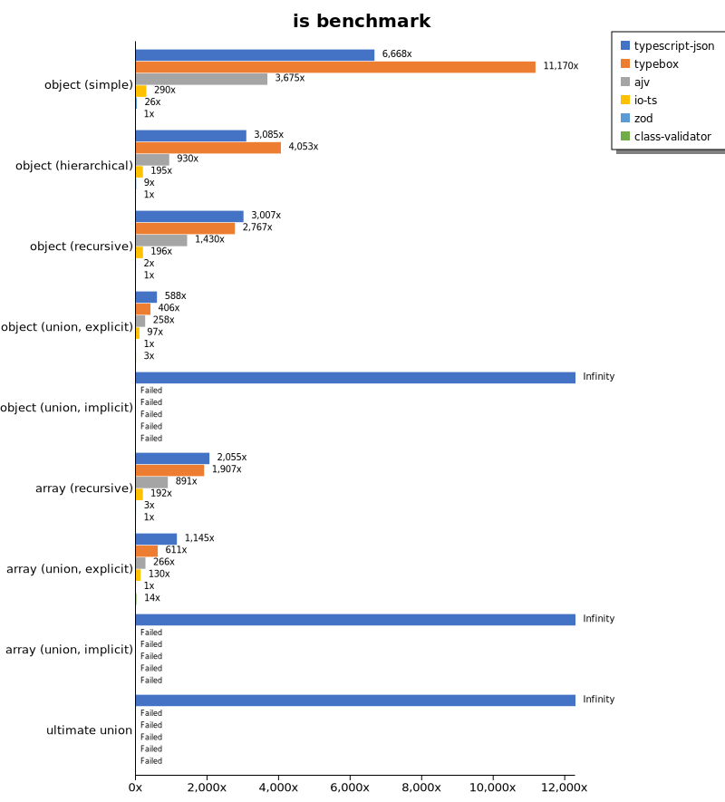
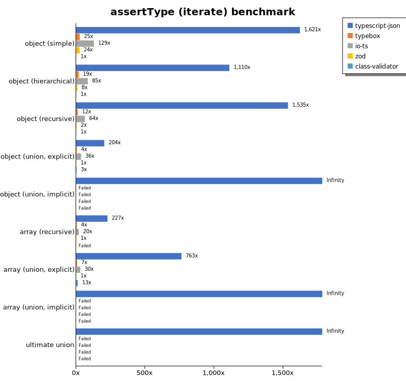
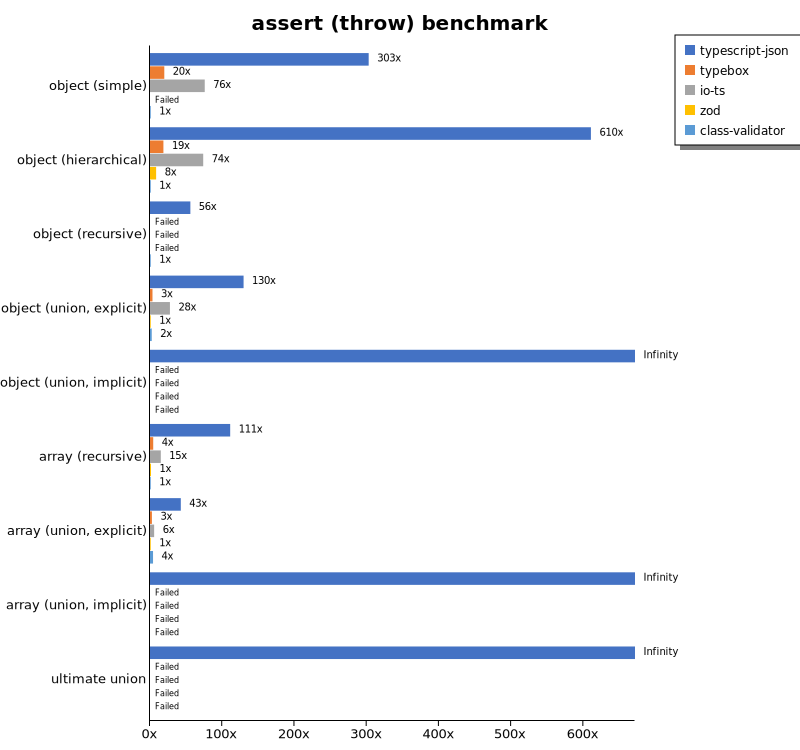
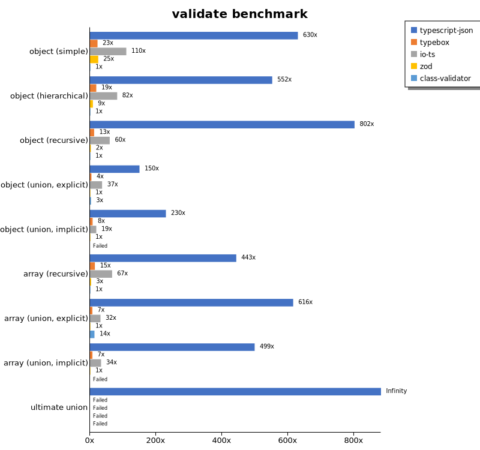
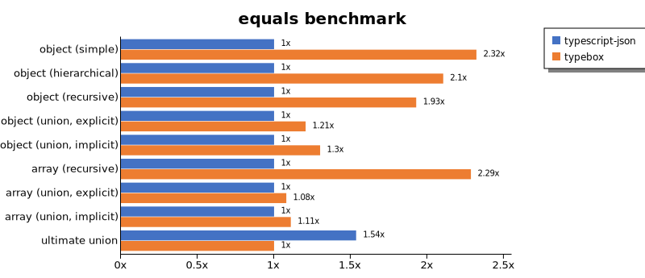
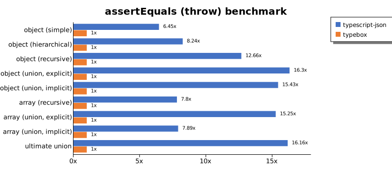
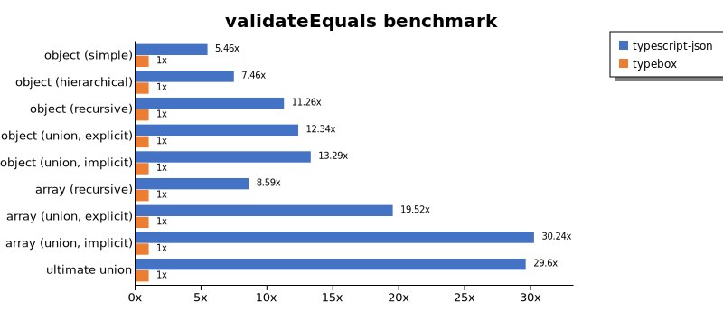
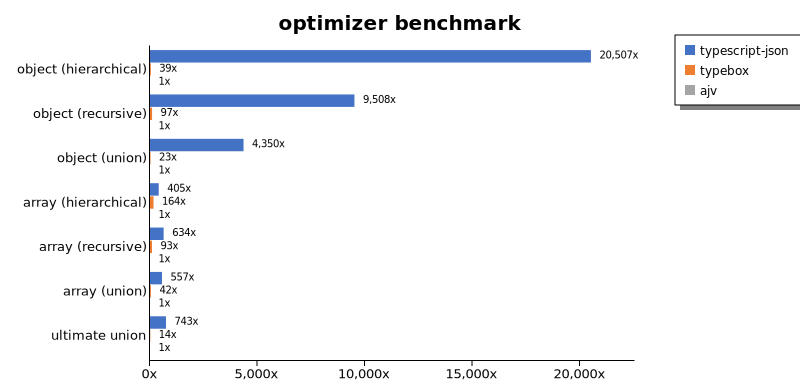
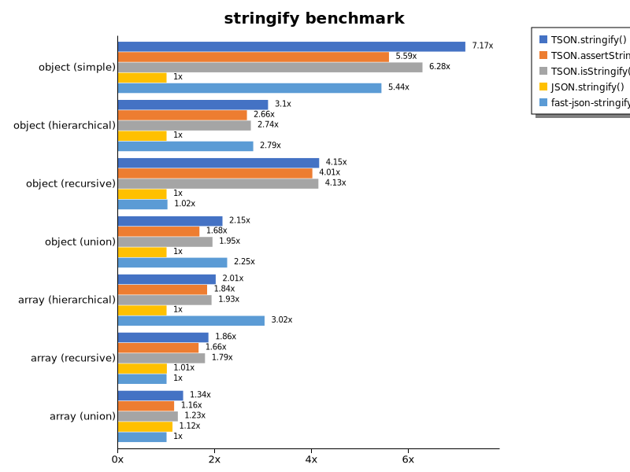

# Benchmark of `typescript-json`
> - CPU: AMD Ryzen 9 5900X 12-Core Processor
> - Memory: 16,326 MB
> - TypeScript-JSON version: 3.3.20

## is

 Components | typescript-json | typebox | ajv | io-ts | zod | class-validator 
------------|-----------------|---------|-----|-------|-----|-----------------
object (simple) | 1113980.7586586038 | 1866074.3978590542 | 613898.6286137879 | 48489.87411056377 | 4343.778301032422 | 167.05461056401074
object (hierarchical) | 175901.7905588714 | 231084.2065868263 | 53042.68180985528 | 11101.212343864805 | 518.5251798561152 | 57.01754385964912
object (recursive) | 106102.75824770147 | 97628.54030501089 | 50476.112026359144 | 6902.644907146877 | 80.96437567470313 | 35.28763095019298
object (union, explicit) | 23170.12839879154 | 16012.266465370823 | 10165.920086006092 | 3843.325484513675 | 39.437648347635566 | 122.25705329153604
object (union, implicit) | 20865.238817285823 | Failed | Failed | Failed | Failed | Failed
array (recursive) | 6845.335360060802 | 6350.364963503649 | 2968.7099725526077 | 640.5495729669514 | 11.202389843166543 | 3.330866025166544
array (union, explicit) | 3850.924918389554 | 2055.4747180793015 | 895.6349919166516 | 437.6949899064049 | 3.363857222948982 | 47.4376071632692
array (union, implicit) | 2008.5067873303167 | Failed | Failed | Failed | Failed | Failed
ultimate union | 697.5194372454646 | Failed | Failed | Failed | Failed | Failed

## assert (iterate)

 Components | typescript-json | typebox | io-ts | zod | class-validator 
------------|-----------------|---------|-------|-----|-----------------
object (simple) | 274684.08463661454 | 4318.148420279207 | 21824.397534093034 | 4121.880650994574 | 169.44444444444446
object (hierarchical) | 62841.2348401323 | 1055.3834942612498 | 4797.8822218094 | 465.1205259313368 | 56.61424606845513
object (recursive) | 55303.01927973809 | 439.5486297689414 | 2293.333333333333 | 84.14836685735376 | 36.02744948532215
object (union, explicit) | 8133.213321332134 | 177.53424657534248 | 1440.2434526005163 | 39.88017225238719 | 120.99447513812154
object (union, implicit) | 7285.262603196909 | Failed | Failed | Failed | Failed
array (recursive) | 2394.151186315983 | 45.12105649303008 | 207.06976744186045 | 10.539940828402365 | Failed
array (union, explicit) | 2571.9020438225 | 22.807342851844986 | 102.1723122238586 | 3.3695245226506927 | 43.69992716678806
array (union, implicit) | 1337.3954165150963 | Failed | Failed | Failed | Failed
ultimate union | 317.51621872103806 | Failed | Failed | Failed | Failed

## assert (throw)

 Components | typescript-json | typebox | io-ts | zod | class-validator 
------------|-----------------|---------|-------|-----|-----------------
object (simple) | 56486.436611921024 | 3694.078336736588 | 14138.961524094135 | Failed | 186.56716417910445
object (hierarchical) | 34047.45042492918 | 1035.1966873706006 | 4107.806691449814 | 472.8579534707774 | 55.77244841048522
object (recursive) | 5123.513266239707 | Failed | Failed | Failed | 91.67583425009168
object (union, explicit) | 7020.768241132146 | 185.9427296392711 | 1494.7965941343425 | 54.190751445086704 | 129.7978861487113
object (union, implicit) | 5988.679934270585 | Failed | Failed | Failed | Failed
array (recursive) | 1362.8929674722879 | 54.55537370430987 | 183.75597206909225 | 16.8321831341525 | 12.275963663147555
array (union, explicit) | 556.9996286669142 | 34.393809114359414 | 74.62686567164178 | 13.058239749281796 | 54.955119985345306
array (union, implicit) | 222.4694104560623 | Failed | Failed | Failed | Failed
ultimate union | 312.49999999999994 | Failed | Failed | Failed | Failed

## validate

 Components | typescript-json | typebox | io-ts | zod | class-validator 
------------|-----------------|---------|-------|-----|-----------------
object (simple) | 102780.9626825311 | 3722.192369693713 | 17943.87849601778 | 4074.2358078602615 | 163.1306828311642
object (hierarchical) | 30367.89851075565 | 1046.0526315789473 | 4528.605813738197 | 483.79761227970437 | 54.98652291105121
object (recursive) | 29249.862813243097 | 456.61929693343313 | 2180.974899963623 | 86.90680388793596 | 36.48109443283298
object (union, explicit) | 6036.01108033241 | 176.3425253991292 | 1473.0275229357799 | 40.23422742727617 | 120.93628088426527
object (union, implicit) | 4913.22388598232 | 170.58714576773477 | 406.1588921282799 | 21.360314783586286 | Failed
array (recursive) | 1482.1693907875185 | 49.478672985781984 | 223.98817224172984 | 11.200298674631323 | 3.3432392273402676
array (union, explicit) | 2080.956761729531 | 24.63712757830405 | 107.26319730438038 | 3.379012577435705 | 45.74914220358368
array (union, implicit) | 1107.9668348954579 | 16.405808033188762 | 74.55890722822994 | 2.2201665124884364 | Failed
ultimate union | 204.49640287769785 | Failed | Failed | Failed | Failed

## equals

 Components | typescript-json | typebox 
------------|-----------------|---------
object (simple) | 28529.605263157893 | 66222.18246869411
object (hierarchical) | 8458.41566373271 | 17800.072241285896
object (recursive) | 6225.6267409470765 | 12003.193187865887
object (union, explicit) | 2993.286087280865 | 3609.837799717913
object (union, implicit) | 2017.5240248728094 | 2624.1186042307
array (recursive) | 483.4983498349835 | 1104.9168342167795
array (union, explicit) | 738.9543446244477 | 797.9370049732916
array (union, implicit) | 473.8604651162791 | 525.6410256410256
ultimate union | 335.11225616488775 | 218.21120689655174

## assertEquals (iterate)

 Components | typescript-json | typebox 
------------|-----------------|---------
object (simple) | 23658.02556818182 | 3179.389312977099
object (hierarchical) | 8041.905113531475 | 888.2091212458288
object (recursive) | 5976.9273026918145 | 397.6705490848586
object (union, explicit) | 2506.412605349945 | 134.2475640562974
object (union, implicit) | 1829.72972972973 | 97.29729729729729
array (recursive) | 475.58998378670503 | 41.46156758803484
array (union, explicit) | 465.79804560260584 | 19.86003404577265
array (union, implicit) | 309.0105030403538 | 9.09435392194013
ultimate union | 233.5844994617869 | 5.103005103005103

## assertEquals (throw)

 Components | typescript-json | typebox 
------------|-----------------|---------
object (simple) | 19307.48964998118 | 2994.572337638031
object (hierarchical) | 6791.140399048142 | 824.4778307072187
object (recursive) | 5013.428827215756 | 396.00226287007354
object (union, explicit) | 2420.994270929588 | 148.56081708449398
object (union, implicit) | 1726.6715650257165 | 111.87768040275965
array (recursive) | 427.5887711470534 | 54.80453050785531
array (union, explicit) | 277.98369162342476 | 18.22489520685256
array (union, implicit) | 127.5277828384041 | 16.157699143641945
ultimate union | 238.13885326982964 | 14.74056603773585

## validateEquals

 Components | typescript-json | typebox 
------------|-----------------|---------
object (simple) | 16652.352501867066 | 3051.6956920256644
object (hierarchical) | 6282.742402315485 | 842.095688557395
object (recursive) | 4364.0358908624785 | 387.45387453874537
object (union, explicit) | 1683.3602584814216 | 136.36363636363637
object (union, implicit) | 1280.9352517985612 | 96.3742250610558
array (recursive) | 341.9746276889134 | 39.810426540284354
array (union, explicit) | 383.56649548432796 | 19.65188096574958
array (union, implicit) | 255.04554384711557 | 8.434864104967199
ultimate union | 151.20756037801888 | 5.107832009080591

## optimizer

 Components | typescript-json | typebox | ajv 
------------|-----------------|---------|-----
object (hierarchical) | 115730.76923076923 | 218.87125220458555 | 5.643546331694884
object (recursive) | 95221.61966738974 | 967.1480144404333 | 10.01456664238893
object (union) | 21955.7779799818 | 115.57603686635944 | 5.046728971962617
array (hierarchical) | 2980.0148038490006 | 1202.8985507246377 | 7.356998344675372
array (recursive) | 6587.290124571223 | 970.2302939524433 | 10.393466963622865
array (union) | 4052.3149835946047 | 304.331450094162 | 7.27476217123671
ultimate union | 686.1026649973171 | 12.724959098345755 | 0.9230201218386561

## stringify

 Components | TSON.stringify() | TSON.assertStringify() | TSON.isStringify() | JSON.stringify() | fast-json-stringify 
------------|------------------|------------------------|--------------------|------------------|---------------------
object (simple) | 59006.061719324025 | 46027.03196347032 | 51723.35351311686 | 8231.148162182646 | 44748.9010989011
object (hierarchical) | 6223.2558139534885 | 5346.310715609937 | 5508.375819373634 | 2010.3435537495384 | 5607.886493458634
object (recursive) | 6359.430604982206 | 6144.227222427149 | 6334.950550475835 | 1532.160527762507 | 1560.773999624272
object (union) | 1691.9127086007702 | 1318.448674613058 | 1529.9254138621066 | 785.3065733750691 | 1767.9686106652398
array (hierarchical) | 145.37690308206462 | 132.59164690862667 | 139.1948005055064 | 72.16110385977997 | 218.16496756255793
array (recursive) | 289.22631959508317 | 257.75401069518716 | 278.24344023323613 | 156.04854000758436 | 155.13036953667228
array (union) | 365.80443955237575 | 315.2075403298894 | 336.0190441311115 | 305.9023836549376 | 272.54249815225427

