# Benchmark of `typia`
> - CPU: AMD Ryzen 9 5950X 16-Core Processor
> - Memory: 64.226 MB
> - OS: linux
> - Typia version: 3.4.22

## is

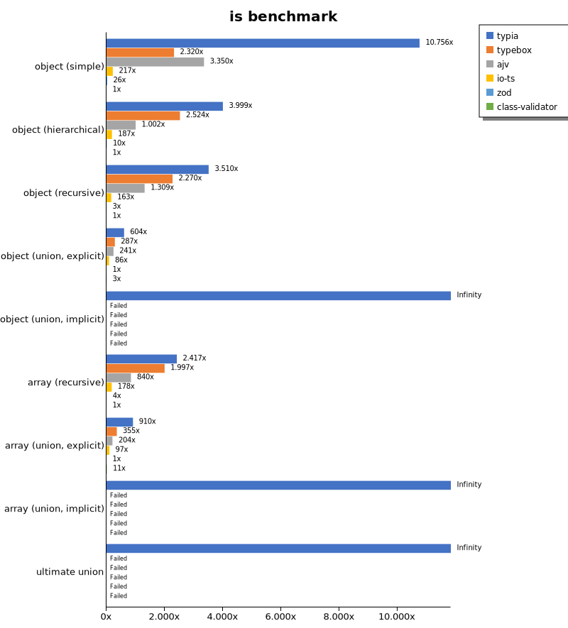

 Components | typia | typebox | ajv | io-ts | zod | class-validator 
------------|-------|---------|-----|-------|-----|-----------------
object (simple) | 227396.97300918188 | 49548.88036015871 | 72814.02050275258 | 4614.129695866801 | 571.2951813126566 | 20.74400109096635
object (hierarchical) | 181806.04496606332 | 121171.20732631869 | 52537.30761231281 | 8456.808076852194 | 451.503537735849 | 41.008030920199964
object (recursive) | 133112.69722203005 | 87471.0336030034 | 50047.34191108864 | 6274.300784211524 | 106.88620046749776 | 33.81829393149665
object (union, explicit) | 28694.29296948137 | 13998.451045985676 | 11065.941082655325 | 3963.378633314701 | 46.25368188512518 | 125.28019213174748
object (union, implicit) | 32912.89040509477 | Failed | Failed | Failed | Failed | Failed
array (recursive) | 90725.71735674235 | 74075.47651018415 | 30807.28537757756 | 6266.781370589856 | 152.47051532451923 | 30.957782874976534
array (union, explicit) | 26768.19413545116 | 10276.754982935548 | 6225.3460061961205 | 2913.4908755869083 | 30.348557692307697 | 313.52642952127655
array (union, implicit) | 18507.596844662945 | Failed | Failed | Failed | Failed | Failed
ultimate union | 8743.31746214504 | Failed | Failed | Failed | Failed | Failed

 Unit: kilobytes/sec 

## assert (iterate)

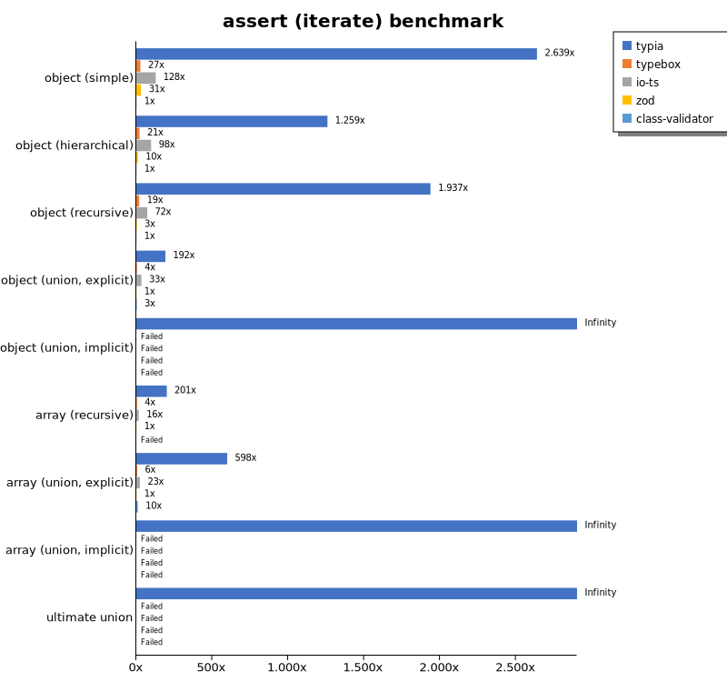

 Components | typia | typebox | io-ts | zod | class-validator 
------------|-------|---------|-------|-----|-----------------
object (simple) | 48212.967246484084 | 491.48936170212767 | 2329.73328324568 | 568.8959955506118 | 18.267463235294116
object (hierarchical) | 50972.38945807689 | 858.1778531093141 | 3952.941940387866 | 421.57955120537355 | 40.4816238550148
object (recursive) | 66119.40544027291 | 645.7781386984705 | 2464.5325377747254 | 114.97608463517085 | 34.128520303143716
object (union, explicit) | 9121.88317146059 | 182.19855786951712 | 1590.2157038012797 | 47.622423898657594 | 127.73394081141164
object (union, implicit) | 12002.523988529356 | Failed | Failed | Failed | Failed
array (recursive) | 31153.027865975935 | 668.8415764132643 | 2453.111454191326 | 155.16257749151424 | Failed
array (union, explicit) | 18276.52537796976 | 170.70245878339966 | 712.9009746404239 | 30.539110572440794 | 303.95411459312163
array (union, implicit) | 11776.707458774896 | Failed | Failed | Failed | Failed
ultimate union | 4562.757300041111 | Failed | Failed | Failed | Failed

 Unit: kilobytes/sec 

## assert (throw)

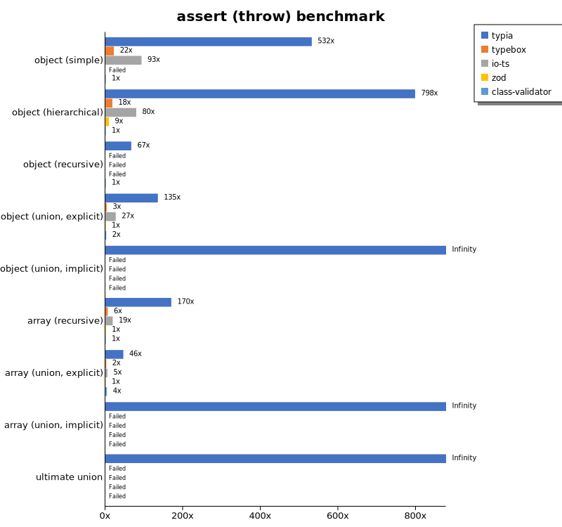

 Components | typia | typebox | io-ts | zod | class-validator 
------------|-------|---------|-------|-----|-----------------
object (simple) | 11107.9362613104 | 478.82138578274765 | 2016.0466437232358 | Failed | 18.880208333333336
object (hierarchical) | 36752.68937867853 | 847.4045586340206 | 3573.1727051597622 | 436.7269034629981 | 45.51397684800664
object (recursive) | 7793.434458637469 | Failed | Failed | Failed | 131.27730292319896
object (union, explicit) | 8336.021147956797 | 196.17836349607182 | 1494.0842535846436 | 57.20561079545454 | 136.78752969536055
object (union, implicit) | 8700.354337431694 | Failed | Failed | Failed | Failed
array (recursive) | 21793.3575296985 | 812.1472472299168 | 2492.129208774084 | 193.1900080719557 | 135.65013398365207
array (union, explicit) | 4535.351021468144 | 241.18521577249425 | 626.3242589170951 | 93.29764535181891 | 371.969674379771
array (union, implicit) | 2262.170255406413 | Failed | Failed | Failed | Failed
ultimate union | 4550.7012009177515 | Failed | Failed | Failed | Failed

 Unit: kilobytes/sec 

## validate

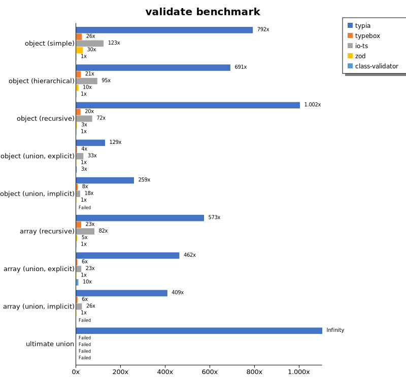

 Components | typia | typebox | io-ts | zod | class-validator 
------------|-------|---------|-------|-----|-----------------
object (simple) | 14465.464001560505 | 471.6633786015783 | 2250.3574734194035 | 544.2333058293045 | 18.275695540189346
object (hierarchical) | 28522.325992413746 | 869.1877278463264 | 3924.126720782993 | 429.8224005255255 | 41.282455274163574
object (recursive) | 34227.351351235615 | 669.5689795823232 | 2456.8139304577467 | 116.01603182399168 | 34.14788060673739
object (union, explicit) | 6362.143665158371 | 188.38988643250045 | 1600.75234316676 | 49.14162164413557 | 128.9022138596656
object (union, implicit) | 7962.840635777818 | 233.54715260152287 | 554.7092379232137 | 30.72557361320399 | Failed
array (recursive) | 17666.213555630027 | 705.8690043951844 | 2524.078747884543 | 155.65635619218426 | 30.828630351467563
array (union, explicit) | 14086.304254632103 | 170.21735533282904 | 704.2270813844715 | 30.464677959791512 | 306.1185167651949
array (union, implicit) | 9963.661391728207 | 152.8104160754824 | 634.5826216536532 | 24.374780753040223 | Failed
ultimate union | 3118.7839291741675 | Failed | Failed | Failed | Failed

 Unit: kilobytes/sec 

## equals

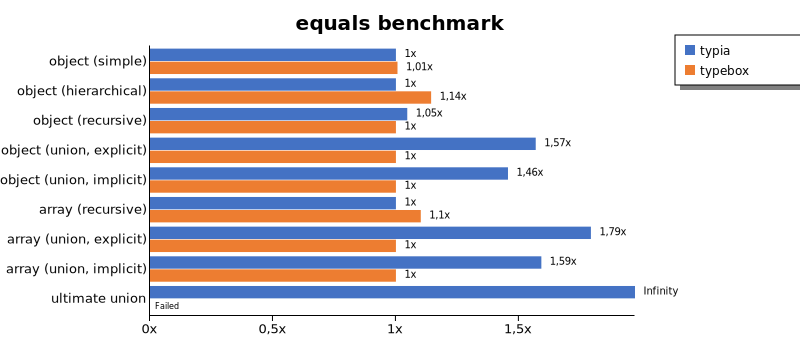

 Components | typia | typebox 
------------|-------|---------
object (simple) | 7736.07542958221 | 7912.119946225271
object (hierarchical) | 12912.370769859486 | 13375.22144689374
object (recursive) | 14045.334917085895 | 12920.345567831153
object (union, explicit) | 5828.900404697026 | 3612.44261708221
object (union, implicit) | 5240.624056636634 | 3597.44124698851
array (recursive) | 11204.699835141024 | 11773.2780948393
array (union, explicit) | 9318.188625268722 | 5210.500180570602
array (union, implicit) | 6947.948063908906 | 4336.4779295431445
ultimate union | 5720.732254910876 | Failed

 Unit: kilobytes/sec 

## assertEquals (iterate)

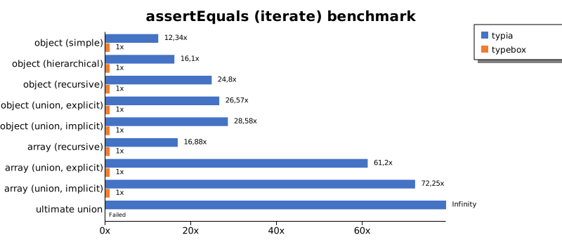

 Components | typia | typebox 
------------|-------|---------
object (simple) | 4563.312855113636 | 369.8964883192583
object (hierarchical) | 11187.33169535997 | 694.9077560240964
object (recursive) | 13237.301763660178 | 533.7487171114013
object (union, explicit) | 3760.848067062703 | 141.5316230106101
object (union, implicit) | 3884.2125276548672 | 135.90494791666669
array (recursive) | 9393.73424957999 | 556.4873080204778
array (union, explicit) | 8204.737889332966 | 134.07175164473682
array (union, implicit) | 5668.967190682281 | 78.45782280867107
ultimate union | 3661.498287671233 | Failed

 Unit: kilobytes/sec 

## assertEquals (throw)

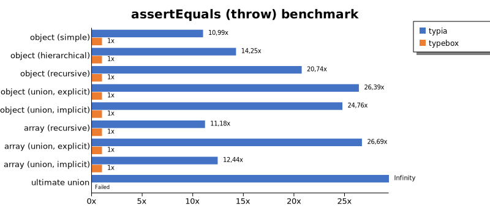

 Components | typia | typebox 
------------|-------|---------
object (simple) | 3738.3248303272594 | 345.8108005512988
object (hierarchical) | 9390.015452119147 | 658.4359345876048
object (recursive) | 10284.047493840648 | 515.5271394870697
object (union, explicit) | 3677.2986144571396 | 137.16187914487205
object (union, implicit) | 3445.669457794278 | 130.30301390812556
array (recursive) | 8414.258323025579 | 609.0817065709272
array (union, explicit) | 3404.6904959226576 | 124.67114842179792
array (union, implicit) | 1756.9849046610173 | 142.15317060173797
ultimate union | 3730.302165240518 | Failed

 Unit: kilobytes/sec 

## validateEquals

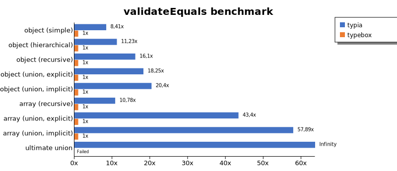

 Components | typia | typebox 
------------|-------|---------
object (simple) | 3038.0006119414797 | 352.98400623063606
object (hierarchical) | 6907.2601052233495 | 665.4916158536586
object (recursive) | 8068.975700785244 | 527.8221988730833
object (union, explicit) | 2540.0383674377226 | 142.8672716959728
object (union, implicit) | 2739.2560773143214 | 135.6730196458606
array (recursive) | 5995.637937351164 | 552.384972841422
array (union, explicit) | 5960.578137603065 | 140.39080343547775
array (union, implicit) | 4636.516309306569 | 77.73305877948334
ultimate union | 2384.3985242754256 | Failed

 Unit: kilobytes/sec 

## optimizer

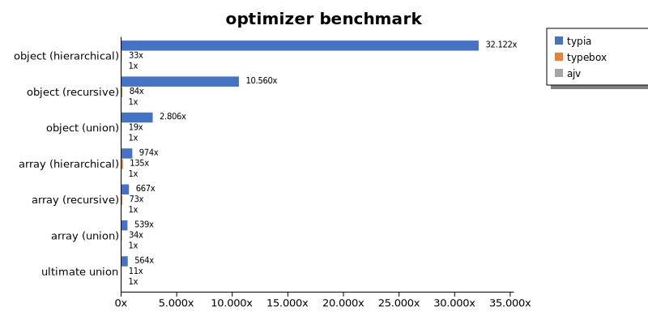

 Components | typia | typebox | ajv 
------------|-------|---------|-----
object (hierarchical) | 169250.11972495427 | 175.9509804470525 | 5.268903586325716
object (recursive) | 128132.89701021633 | 1024.7938773840688 | 12.1342934487133
object (union) | 21847.227348219232 | 150.6164628335451 | 7.784878582061779
array (hierarchical) | 145456.43614567563 | 20160.316433816515 | 149.35627986034547
array (recursive) | 83887.980226938 | 9238.745587200327 | 125.83677409624842
array (union) | 28813.001235110987 | 1829.4725582853425 | 53.416053921568626
ultimate union | 9000.534689221 | 182.56372146564397 | 15.971941427911275

 Unit: kilobytes/sec 

## stringify

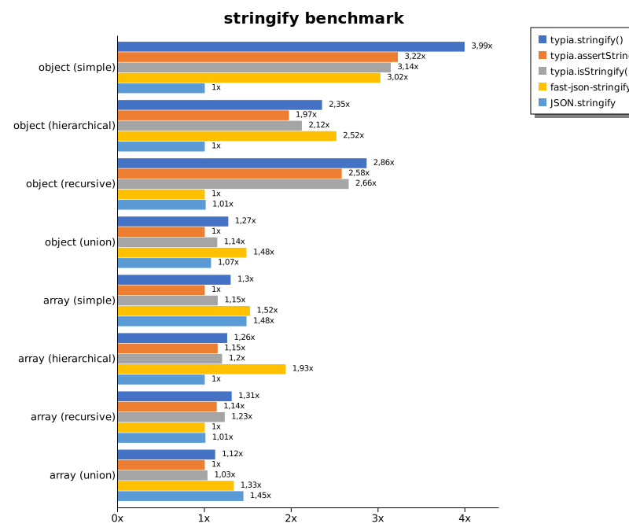

 Components | typia.stringify() | typia.assertStringify() | typia.isStringify() | fast-json-stringify | JSON.stringify 
------------|-------------------|-------------------------|---------------------|---------------------|----------------
object (simple) | 6930.759918048054 | 5597.020081061164 | 5454.896907216495 | 5246.993287339175 | 1735.9651548672564
object (hierarchical) | 5872.688463242552 | 4921.331156023762 | 5291.054996720821 | 6283.945935837766 | 2498.023457989884
object (recursive) | 7609.501689189189 | 6847.91686133433 | 7060.539725933381 | 2656.7016310332174 | 2685.030232611913
object (union) | 2136.879905987587 | 1681.6229229607252 | 1924.0283273993107 | 2487.753398001859 | 1803.342069462228
array (simple) | 2069.0161413018327 | 1593.5527218664229 | 1831.0332708528585 | 2423.008624521335 | 2360.1229543255618
array (hierarchical) | 3578.10457656852 | 3266.319091706687 | 3410.421404576099 | 5493.585449673812 | 2843.738350419385
array (recursive) | 3150.727818853974 | 2736.674054103454 | 2958.275527192009 | 2404.781879194631 | 2423.0402542372885
array (union) | 2335.7821537056134 | 2085.140244284997 | 2150.1071762552783 | 2782.0218871934226 | 3013.3019297261408

 Unit: kilobytes/sec 

## stringify (server)

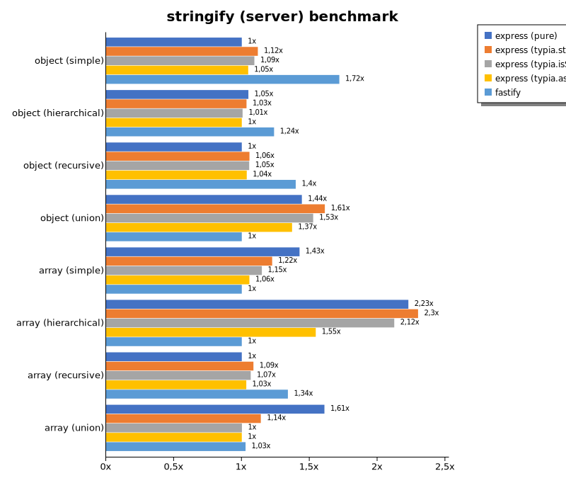

 Components | express (pure) | express (typia.stringify) | express (typia.isStringify) | express (typia.assertStringify) | fastify 
------------|----------------|---------------------------|-----------------------------|---------------------------------|---------
object (simple) | 80425.01375465105 | 89944.40542606416 | 87879.38925708564 | 84223.4603319568 | 138245.12959617216
object (hierarchical) | 163409.310019309 | 161260.2798291587 | 156758.48522729852 | 155830.5812966566 | 192902.42777443727
object (recursive) | 77639.60455999819 | 82033.56058339194 | 81881.91606206888 | 80479.8058806648 | 108502.50589622642
object (union) | 133992.41378748184 | 149719.1849805428 | 141736.26204622007 | 127284.83501746507 | 92869.35309069362
array (simple) | 158467.79984784804 | 136035.86778870146 | 127578.93922433147 | 117376.81522398812 | 111153.17223039706
array (hierarchical) | 179837.09341720497 | 185606.48213818087 | 171435.00678568755 | 124732.84300357784 | 80719.45815400449
array (recursive) | 66373.47075825997 | 72069.12147977391 | 70744.61361838075 | 68576.94004152673 | 88930.37479728044
array (union) | 196269.6943839811 | 139075.0252424838 | 122087.94870615457 | 121972.58278626928 | 125366.90458227445

 Unit: megabytes/sec 

