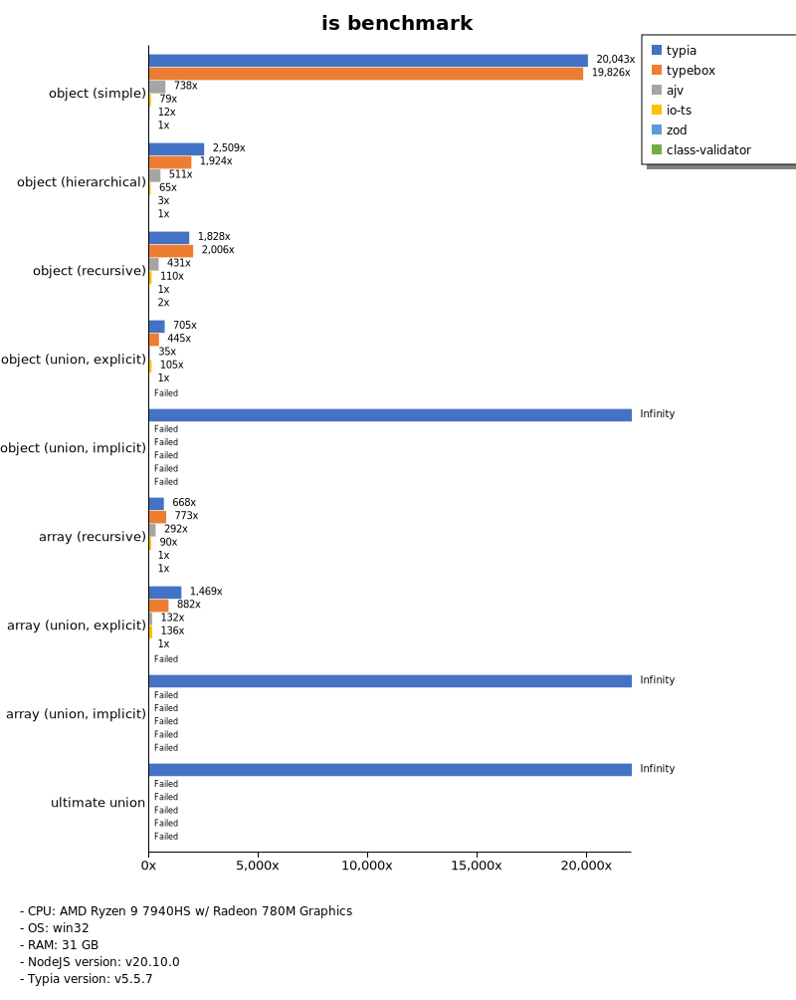
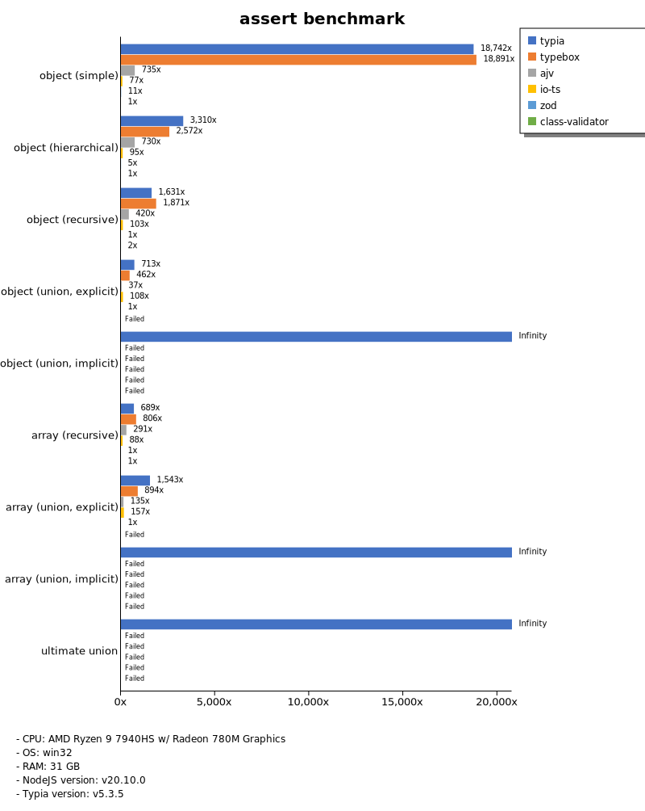
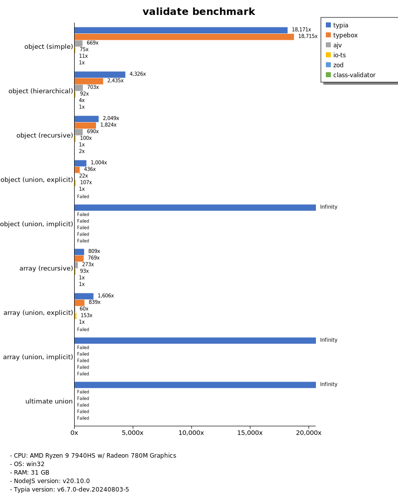
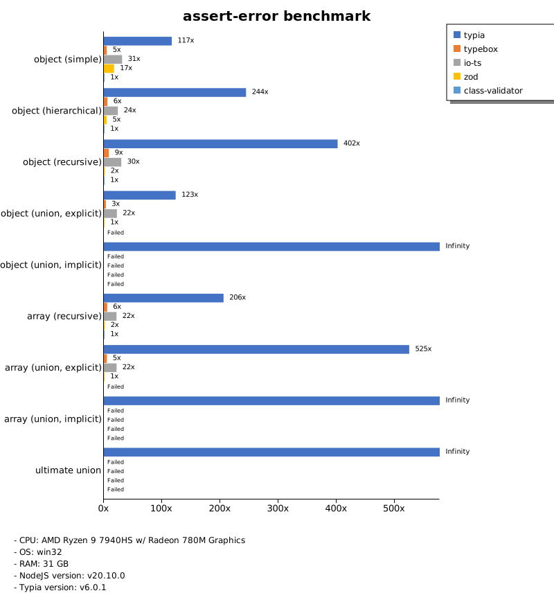
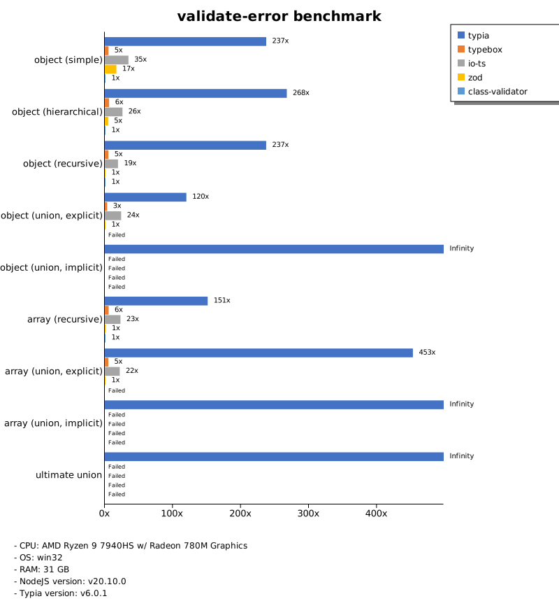
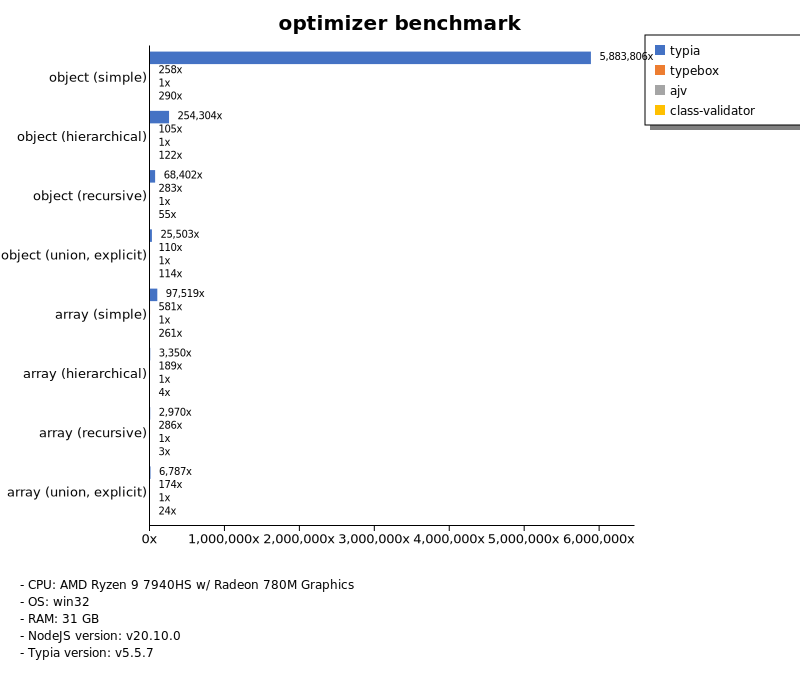
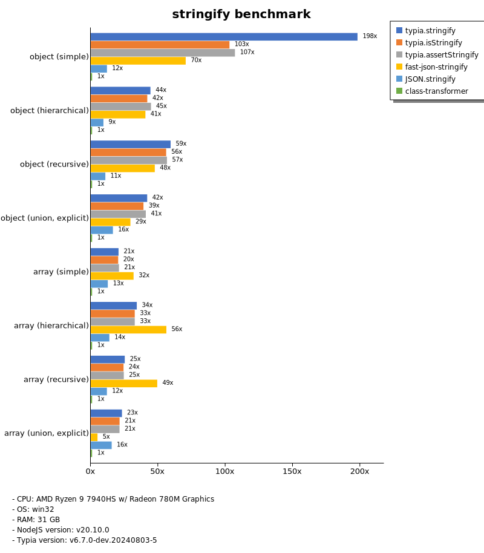
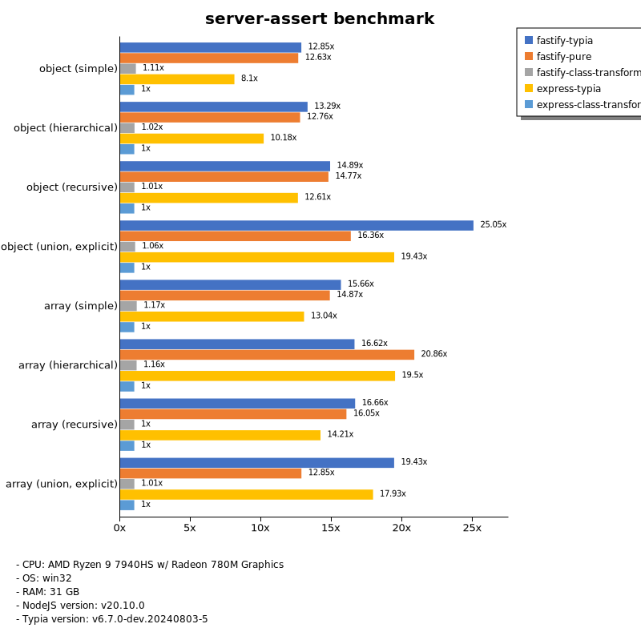
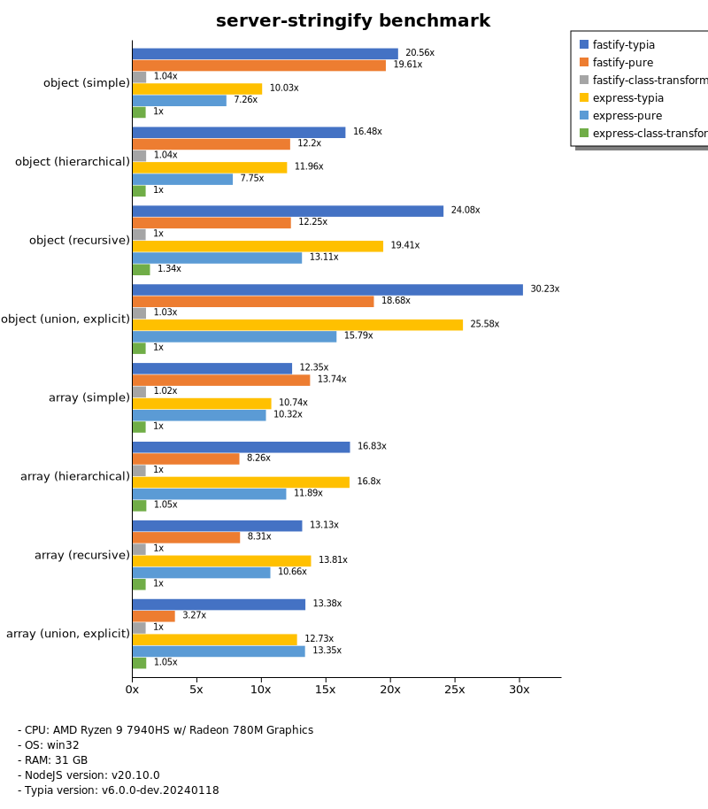
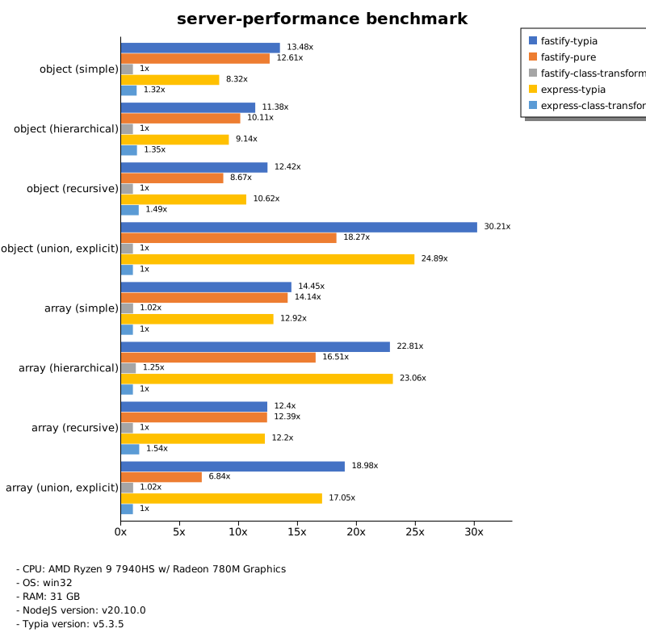

# Benchmark of `typia`
> - CPU: AMD Ryzen 9 7940HS w/ Radeon 780M Graphics
> - Memory: 31,954 MB
> - OS: win32
> - NodeJS version: v20.10.0
> - Typia version: v6.0.1

## is

 Types | typia | typebox | ajv | io-ts | zod | class-validator 
-------|------|------|------|------|------|------
 object (simple) | 198,760 | 196,837 | 7,536 | 805 | 112 | 10 
 object (hierarchical) | 48,993 | 35,506 | 9,723 | 1,257 | 61 | 19 
 object (recursive) | 18,796 | 21,046 | 7,412 | 1,138 | 11 | 18 
 object (union, explicit) | 4,415 | 2,733 | 221 | 641 | 6.20 |  -  
 object (union, implicit) | 4,218 |  -  |  -  |  -  |  -  |  -  
 array (recursive) | 9,432 | 10,312 | 3,918 | 1,227 | 15 | 9.84 
 array (union, explicit) | 4,013 | 2,568 | 370 | 440 | 2.90 |  -  
 array (union, implicit) | 3,229 |  -  |  -  |  -  |  -  |  -  
 ultimate union | 1,515 |  -  |  -  |  -  |  -  |  -  

> Unit: Megabytes/sec

## assert

 Types | typia | typebox | ajv | io-ts | zod | class-validator 
-------|------|------|------|------|------|------
 object (simple) | 202,193 | 198,892 | 7,703 | 798 | 122 | 9.62 
 object (hierarchical) | 32,943 | 34,160 | 10,124 | 1,194 | 61 | 19 
 object (recursive) | 18,321 | 20,574 | 8,112 | 1,141 | 11 | 16 
 object (union, explicit) | 3,998 | 2,819 | 219 | 633 | 6.04 |  -  
 object (union, implicit) | 3,783 |  -  |  -  |  -  |  -  |  -  
 array (recursive) | 9,150 | 10,643 | 3,966 | 1,241 | 14 | 14 
 array (union, explicit) | 4,006 | 2,531 | 377 | 442 | 2.73 |  -  
 array (union, implicit) | 3,246 |  -  |  -  |  -  |  -  |  -  
 ultimate union | 1,375 |  -  |  -  |  -  |  -  |  -  

> Unit: Megabytes/sec

## validate

 Types | typia | typebox | ajv | io-ts | zod | class-validator 
-------|------|------|------|------|------|------
 object (simple) | 196,122 | 196,779 | 7,465 | 809 | 119 | 10 
 object (hierarchical) | 26,111 | 34,325 | 9,806 | 1,251 | 62 | 18 
 object (recursive) | 18,102 | 20,412 | 7,926 | 1,150 | 11 | 18 
 object (union, explicit) | 4,217 | 2,724 | 134 | 663 | 6.13 |  -  
 object (union, implicit) | 4,153 |  -  |  -  |  -  |  -  |  -  
 array (recursive) | 8,841 | 11,024 | 3,698 | 1,232 | 14 | 10 
 array (union, explicit) | 4,039 | 2,603 | 174 | 434 | 2.89 |  -  
 array (union, implicit) | 3,095 |  -  |  -  |  -  |  -  |  -  
 ultimate union | 1,400 |  -  |  -  |  -  |  -  |  -  

> Unit: Megabytes/sec

## assert-error

 Types | typia | typebox | io-ts | zod | class-validator 
-------|------|------|------|------|------
 object (simple) | 759 | 32 | 204 | 113 | 6.50 
 object (hierarchical) | 3,052 | 76 | 300 | 59 | 12 
 object (recursive) | 2,696 | 57 | 201 | 10 | 6.71 
 object (union, explicit) | 723 | 20 | 131 | 5.86 |  -  
 object (union, implicit) | 556 |  -  |  -  |  -  |  -  
 array (recursive) | 1,846 | 51 | 195 | 14 | 8.98 
 array (union, explicit) | 1,499 | 15 | 62 | 2.86 |  -  
 array (union, implicit) | 1,230 |  -  |  -  |  -  |  -  
 ultimate union | 350 |  -  |  -  |  -  |  -  

> Unit: Megabytes/sec

## validate-error

 Types | typia | typebox | io-ts | zod | class-validator 
-------|------|------|------|------|------
 object (simple) | 1,503 | 34 | 220 | 108 | 6.33 
 object (hierarchical) | 3,239 | 77 | 314 | 60 | 12 
 object (recursive) | 2,482 | 56 | 203 | 10 | 11 
 object (union, explicit) | 691 | 20 | 138 | 5.76 |  -  
 object (union, implicit) | 450 |  -  |  -  |  -  |  -  
 array (recursive) | 1,347 | 51 | 205 | 13 | 8.91 
 array (union, explicit) | 1,263 | 15 | 61 | 2.79 |  -  
 array (union, implicit) | 939 |  -  |  -  |  -  |  -  
 ultimate union | 318 |  -  |  -  |  -  |  -  

> Unit: Megabytes/sec

## optimizer

 Types | typia | typebox | ajv | class-validator 
-------|------|------|------|------
 object (simple) | 197,400 | 8.61 | 0.03 | 10 
 object (hierarchical) | 46,179 | 16 | 0.14 | 19 
 object (recursive) | 21,793 | 90 | 0.31 | 18 
 object (union, explicit) | 4,365 | 19 | 0.15 | 18 
 array (simple) | 15,380 | 212 | 0.48 | 41 
 array (hierarchical) | 30,953 | 1,300 | 7.23 | 33 
 array (recursive) | 10,381 | 904 | 3.31 | 14 
 array (union, explicit) | 6,591 | 186 | 1.01 | 50 

> Unit: Megabytes/sec

## stringify

 Types | typia.stringify | typia.isStringify | typia.assertStringify | fast-json-stringify | JSON.stringify | class-transformer 
-------|------|------|------|------|------|------
 object (simple) | 2,197 | 1,822 | 1,734 | 719 | 121 | 9.41 
 object (hierarchical) | 784 | 763 | 747 | 916 | 182 | 19 
 object (recursive) | 1,002 | 963 | 933 | 864 | 185 | 17 
 object (union, explicit) | 310 | 256 | 263 | 209 | 120 | 7.20 
 array (simple) | 376 | 354 | 356 | 607 | 235 | 18 
 array (hierarchical) | 447 | 458 | 453 | 803 | 196 | 14 
 array (recursive) | 400 | 388 | 378 | 832 | 192 | 16 
 array (union, explicit) | 334 | 315 | 323 | 76 | 256 | 15 

> Unit: Megabytes/sec

## server-assert

 Types | fastify-typia | fastify-pure | fastify-class-transformer | express-typia | express-class-transformer 
-------|------|------|------|------|------
 object (simple) | 90 | 88 | 7.39 | 55 | 6.70 
 object (hierarchical) | 168 | 161 | 13 | 127 | 13 
 object (recursive) | 160 | 153 | 10 | 129 | 10 
 object (union, explicit) | 101 | 67 | 4.31 | 75 | 4.15 
 array (simple) | 150 | 150 | 10 | 119 | 9.60 
 array (hierarchical) | 85 | 86 | 7.73 | 81 | 5.91 
 array (recursive) | 134 | 103 | 8.34 | 108 | 6.76 
 array (union, explicit) | 158 | 105 | 8.37 | 144 | 8.17 

> Unit: Megabytes/sec

## server-stringify

 Types | fastify-typia | fastify-pure | fastify-class-transformer | express-typia | express-pure | express-class-transformer 
-------|------|------|------|------|------|------
 object (simple) | 123 | 115 | 7.67 | 58 | 49 | 6.99 
 object (hierarchical) | 188 | 191 | 14 | 150 | 108 | 14 
 object (recursive) | 229 | 208 | 11 | 189 | 120 | 12 
 object (union, explicit) | 130 | 81 | 5.19 | 119 | 82 | 5.10 
 array (simple) | 141 | 125 | 12 | 119 | 121 | 12 
 array (hierarchical) | 145 | 116 | 10 | 146 | 113 | 10 
 array (recursive) | 124 | 78 | 10 | 127 | 106 | 8.01 
 array (union, explicit) | 125 | 35 | 11 | 124 | 137 | 11 

> Unit: Megabytes/sec

## server-performance

 Types | fastify-typia | fastify-pure | fastify-class-transformer | express-typia | express-class-transformer 
-------|------|------|------|------|------
 object (simple) | 100 | 109 | 8.09 | 71 | 11 
 object (hierarchical) | 180 | 170 | 15 | 141 | 23 
 object (recursive) | 178 | 170 | 13 | 149 | 19 
 object (union, explicit) | 115 | 73 | 3.98 | 94 | 3.81 
 array (simple) | 164 | 138 | 9.55 | 130 | 9.76 
 array (hierarchical) | 137 | 59 | 6.52 | 115 | 7.65 
 array (recursive) | 129 | 126 | 11 | 120 | 15 
 array (union, explicit) | 133 | 50 | 8.34 | 153 | 8.15 

> Unit: Megabytes/sec

Total elapsed time: 4,418,818 ms
