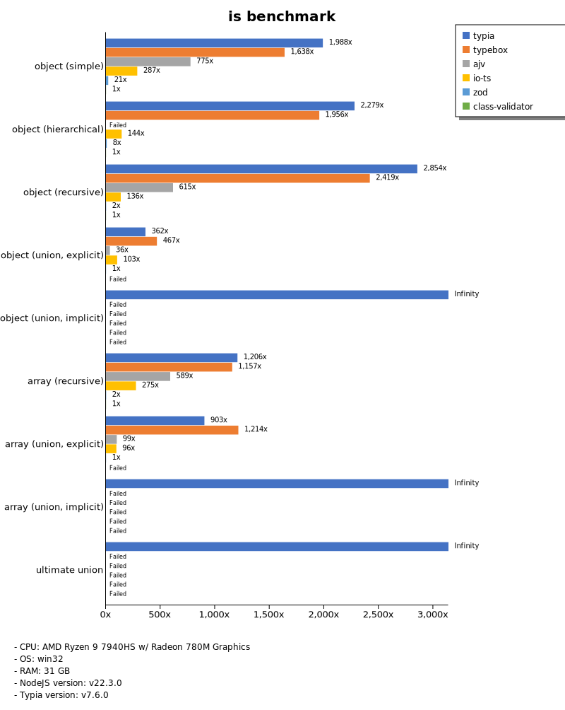
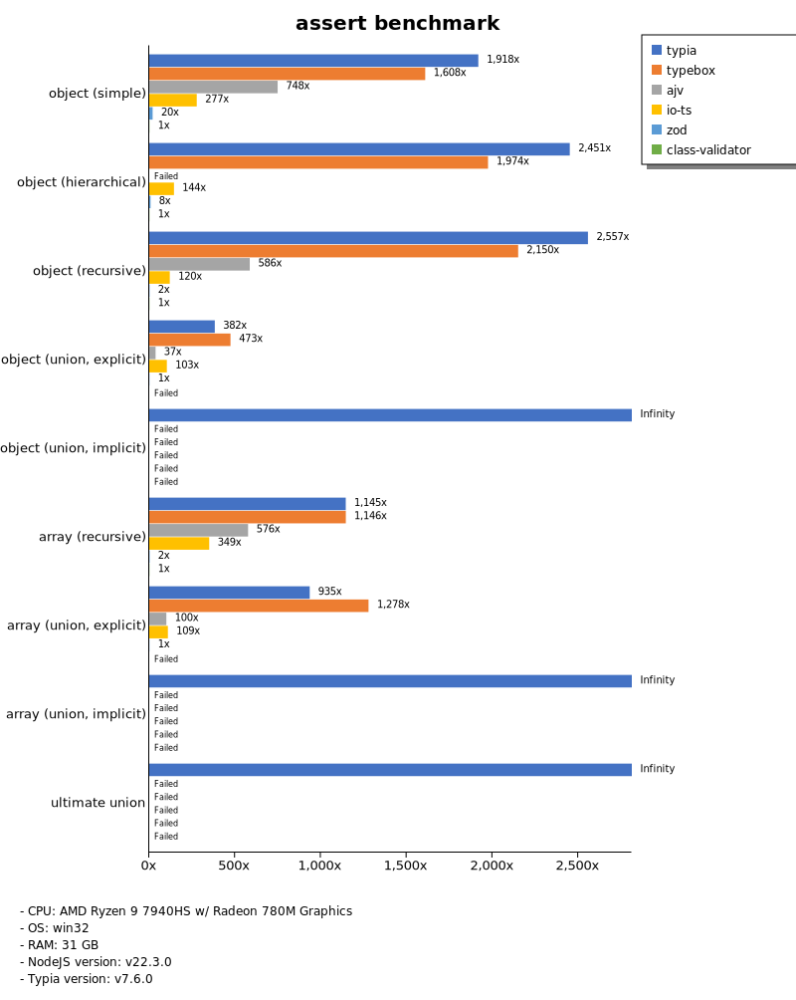
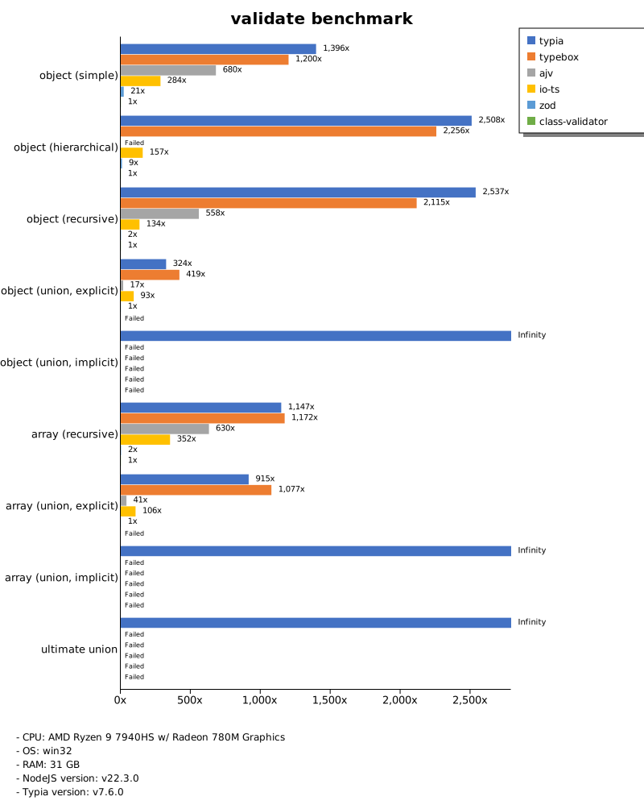
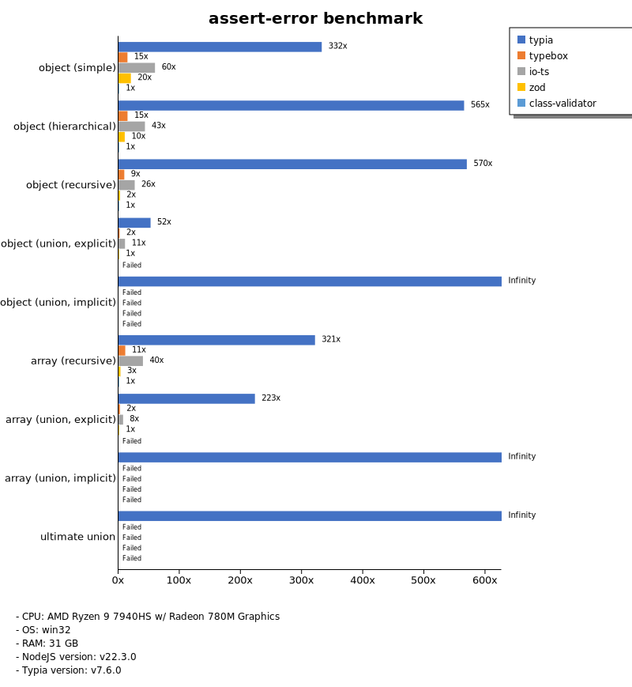
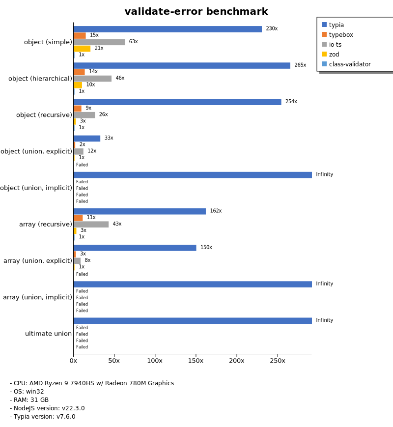
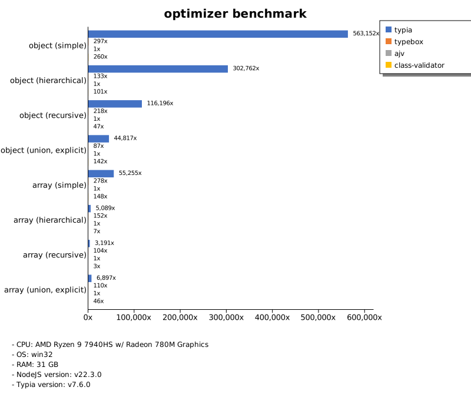
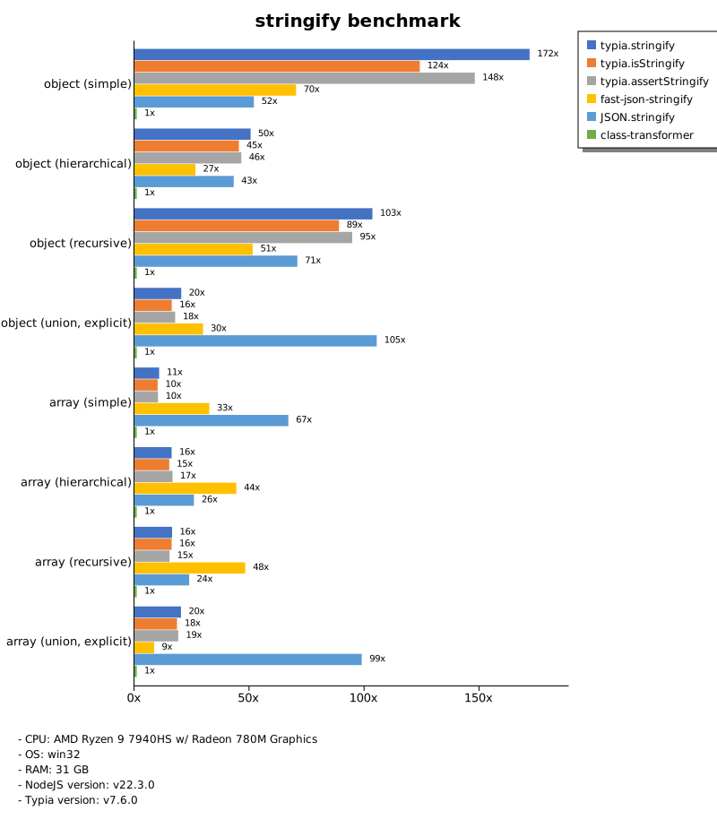

# Benchmark of `typia`
> - CPU: AMD Ryzen 9 7940HS w/ Radeon 780M Graphics
> - Memory: 31,954 MB
> - OS: win32
> - Bun.JS
> - Typia version: v7.6.0

## is

 Types | typia | typebox | ajv | io-ts | zod | class-validator 
-------|------|------|------|------|------|------
 object (simple) | 9,699 | 7,988 | 3,780 | 1,401 | 102 | 4.88 
 object (hierarchical) | 21,453 | 18,412 |  -  | 1,358 | 72 | 9.41 
 object (recursive) | 18,993 | 16,095 | 4,092 | 904 | 12 | 6.65 
 object (union, explicit) | 3,185 | 4,109 | 320 | 904 | 8.79 |  -  
 object (union, implicit) | 4,114 |  -  |  -  |  -  |  -  |  -  
 array (recursive) | 6,961 | 6,683 | 3,402 | 1,589 | 12 | 5.77 
 array (union, explicit) | 4,687 | 6,303 | 515 | 496 | 5.19 |  -  
 array (union, implicit) | 3,489 |  -  |  -  |  -  |  -  |  -  
 ultimate union | 1,502 |  -  |  -  |  -  |  -  |  -  

> Unit: Megabytes/sec

## assert

 Types | typia | typebox | ajv | io-ts | zod | class-validator 
-------|------|------|------|------|------|------
 object (simple) | 9,186 | 7,704 | 3,584 | 1,326 | 94 | 4.79 
 object (hierarchical) | 21,483 | 17,306 |  -  | 1,263 | 66 | 8.76 
 object (recursive) | 18,642 | 15,677 | 4,271 | 872 | 12 | 7.29 
 object (union, explicit) | 3,323 | 4,118 | 320 | 892 | 8.70 |  -  
 object (union, implicit) | 4,017 |  -  |  -  |  -  |  -  |  -  
 array (recursive) | 6,646 | 6,648 | 3,342 | 2,028 | 12 | 5.80 
 array (union, explicit) | 4,598 | 6,283 | 490 | 534 | 4.92 |  -  
 array (union, implicit) | 3,506 |  -  |  -  |  -  |  -  |  -  
 ultimate union | 1,453 |  -  |  -  |  -  |  -  |  -  

> Unit: Megabytes/sec

## validate

 Types | typia | typebox | ajv | io-ts | zod | class-validator 
-------|------|------|------|------|------|------
 object (simple) | 6,125 | 5,263 | 2,984 | 1,246 | 93 | 4.39 
 object (hierarchical) | 17,375 | 15,626 |  -  | 1,088 | 61 | 6.93 
 object (recursive) | 16,747 | 13,962 | 3,684 | 884 | 12 | 6.60 
 object (union, explicit) | 3,039 | 3,928 | 162 | 869 | 9.37 |  -  
 object (union, implicit) | 3,904 |  -  |  -  |  -  |  -  |  -  
 array (recursive) | 6,266 | 6,400 | 3,444 | 1,925 | 12 | 5.46 
 array (union, explicit) | 4,587 | 5,401 | 204 | 531 | 5.02 |  -  
 array (union, implicit) | 2,567 |  -  |  -  |  -  |  -  |  -  
 ultimate union | 1,457 |  -  |  -  |  -  |  -  |  -  

> Unit: Megabytes/sec

## assert-error

 Types | typia | typebox | io-ts | zod | class-validator 
-------|------|------|------|------|------
 object (simple) | 949 | 42 | 170 | 58 | 2.85 
 object (hierarchical) | 2,712 | 71 | 207 | 49 | 4.80 
 object (recursive) | 2,562 | 43 | 119 | 11 | 4.50 
 object (union, explicit) | 496 | 17 | 101 | 9.45 |  -  
 object (union, implicit) | 549 |  -  |  -  |  -  |  -  
 array (recursive) | 1,234 | 43 | 153 | 12 | 3.84 
 array (union, explicit) | 1,273 | 14 | 43 | 5.71 |  -  
 array (union, implicit) | 943 |  -  |  -  |  -  |  -  
 ultimate union | 282 |  -  |  -  |  -  |  -  

> Unit: Megabytes/sec

## validate-error

 Types | typia | typebox | io-ts | zod | class-validator 
-------|------|------|------|------|------
 object (simple) | 653 | 42 | 178 | 58 | 2.83 
 object (hierarchical) | 1,161 | 59 | 203 | 45 | 4.38 
 object (recursive) | 1,135 | 42 | 116 | 11 | 4.47 
 object (union, explicit) | 257 | 15 | 93 | 7.88 |  -  
 object (union, implicit) | 279 |  -  |  -  |  -  |  -  
 array (recursive) | 601 | 41 | 159 | 12 | 3.72 
 array (union, explicit) | 709 | 13 | 40 | 4.72 |  -  
 array (union, implicit) | 571 |  -  |  -  |  -  |  -  
 ultimate union | 170 |  -  |  -  |  -  |  -  

> Unit: Megabytes/sec

## optimizer

 Types | typia | typebox | ajv | class-validator 
-------|------|------|------|------
 object (simple) | 9,781 | 5.16 | 0.02 | 4.52 
 object (hierarchical) | 20,949 | 9.18 | 0.07 | 7.01 
 object (recursive) | 19,044 | 36 | 0.16 | 7.76 
 object (union, explicit) | 3,113 | 6.08 | 0.07 | 9.89 
 array (simple) | 7,965 | 40 | 0.14 | 21 
 array (hierarchical) | 10,849 | 325 | 2.13 | 15 
 array (recursive) | 5,110 | 167 | 1.60 | 5.20 
 array (union, explicit) | 3,345 | 54 | 0.49 | 22 

> Unit: Megabytes/sec

## stringify

 Types | typia.stringify | typia.isStringify | typia.assertStringify | fast-json-stringify | JSON.stringify | class-transformer 
-------|------|------|------|------|------|------
 object (simple) | 1,031 | 744 | 888 | 421 | 311 | 6.00 
 object (hierarchical) | 603 | 542 | 555 | 317 | 515 | 12 
 object (recursive) | 1,002 | 861 | 917 | 498 | 686 | 9.69 
 object (union, explicit) | 90 | 72 | 79 | 132 | 468 | 4.44 
 array (simple) | 123 | 115 | 117 | 371 | 764 | 11 
 array (hierarchical) | 154 | 145 | 158 | 423 | 247 | 9.56 
 array (recursive) | 144 | 142 | 135 | 425 | 210 | 8.82 
 array (union, explicit) | 187 | 171 | 176 | 79 | 913 | 9.24 

> Unit: Megabytes/sec

Total elapsed time: 1,481,701 ms
