# Benchmark of `typescript-json`
> CPU: Apple M1 Max
> Memory: 65,536 MB

## assert
 Components | typescript-json | typescript-is 
------------|-----------------|---------------
object (hierarchical) | 33377.700476016114 | 29598.683007133714
object (recursive) | 34755.92019392131 | 21584.03515195899
object (union) | 6414.042237865877 | 2923.5715598015804
array (recursive) | 1557.9765062523684 | 1829.6973961998592
array (union) | 3992.9525222551924 | 301.38199858256553
ultimate union | 5235.424764019989 | 47.56756756756757

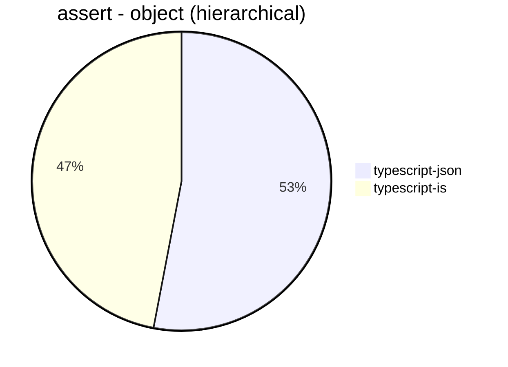
```mermaid
pie title assert - object (hierarchical)
  "typescript-json": 33377.700476016114
  "typescript-is": 29598.683007133714
```

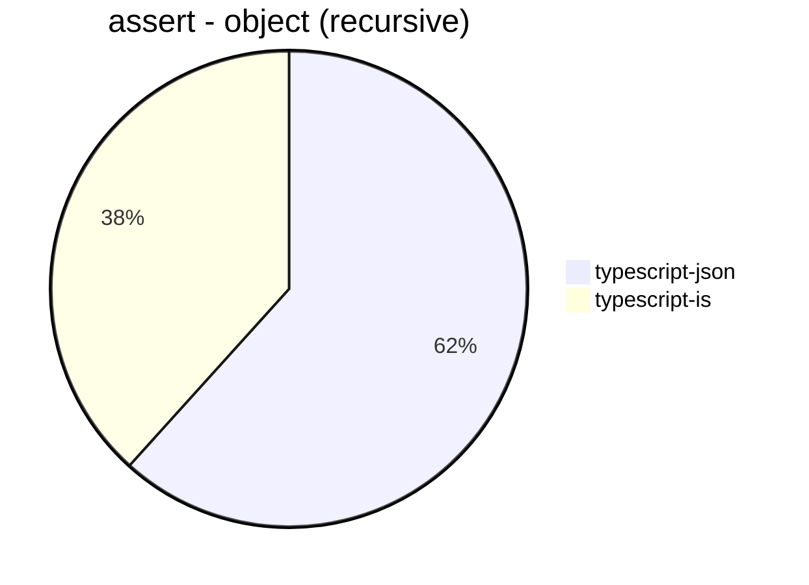
```mermaid
pie title assert - object (recursive)
  "typescript-json": 34755.92019392131
  "typescript-is": 21584.03515195899
```

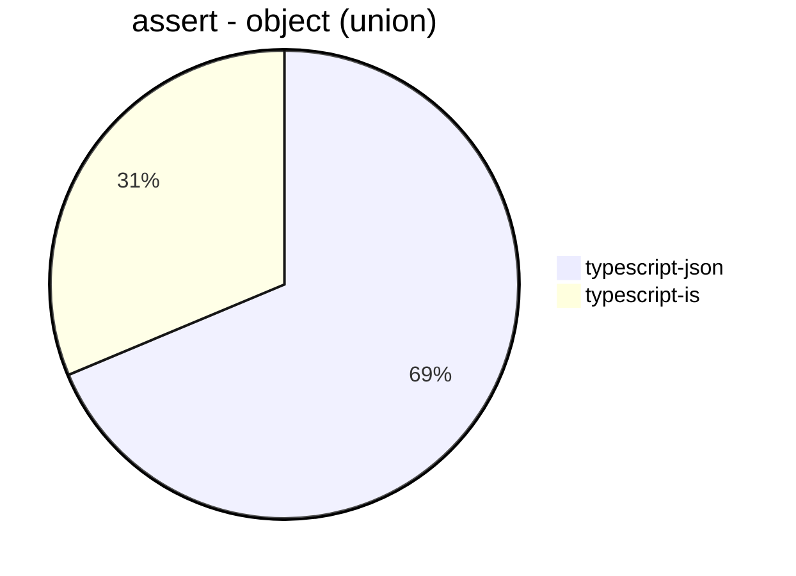
```mermaid
pie title assert - object (union)
  "typescript-json": 6414.042237865877
  "typescript-is": 2923.5715598015804
```

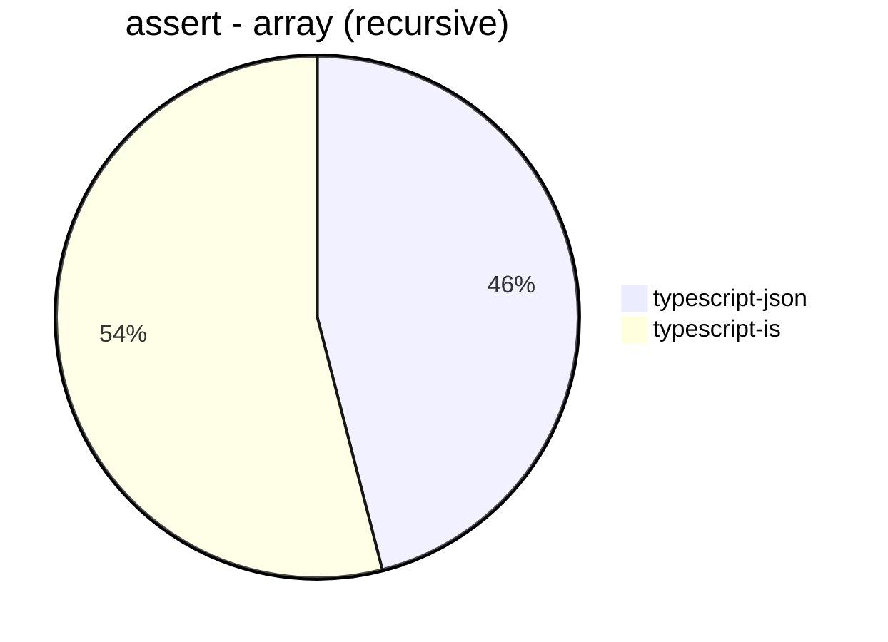
```mermaid
pie title assert - array (recursive)
  "typescript-json": 1557.9765062523684
  "typescript-is": 1829.6973961998592
```

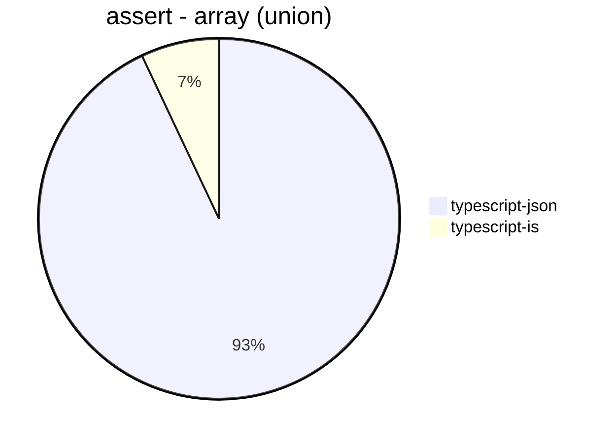
```mermaid
pie title assert - array (union)
  "typescript-json": 3992.9525222551924
  "typescript-is": 301.38199858256553
```

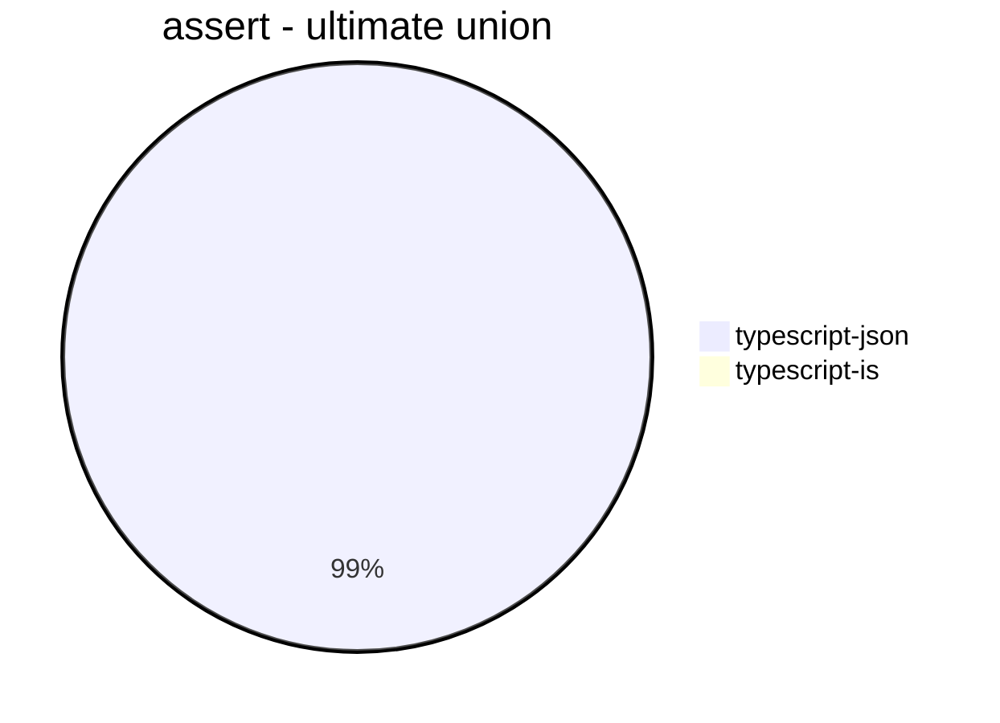
```mermaid
pie title assert - ultimate union
  "typescript-json": 5235.424764019989
  "typescript-is": 47.56756756756757
```

## is
 Components | typescript-json | typescript-is | ajv 
------------|-----------------|---------------|-----
object (hierarchical) | 116493.76114081996 | 62622.214103032515 | 94849.52628645736
object (recursive) | 69867.40947075209 | 50435.294117647056 | Failed
object (union, explicit) | 18114.25925925926 | Failed | 1948.4208559147824
object (union, implicit) | 13145.940014630578 | Failed | Failed
array (recursive) | 6133.824884792627 | 4968.860055607044 | Failed
array (union, explicit) | 6791.184573002754 | 1288.7758808572466 | Failed
array (union, implicit) | 7423.549423549423 | 1320.7007508044333 | Failed
ultimate union | 10541.89418188665 | 384.46142649199413 | Failed

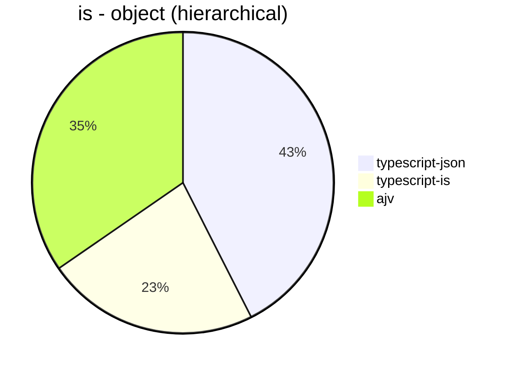
```mermaid
pie title is - object (hierarchical)
  "typescript-json": 116493.76114081996
  "typescript-is": 62622.214103032515
  "ajv": 94849.52628645736
```

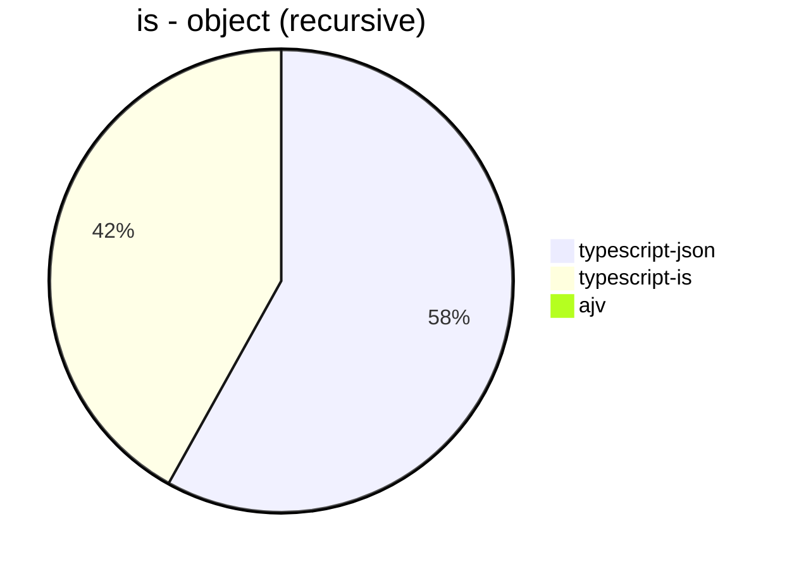
```mermaid
pie title is - object (recursive)
  "typescript-json": 69867.40947075209
  "typescript-is": 50435.294117647056
  "ajv": 0
```

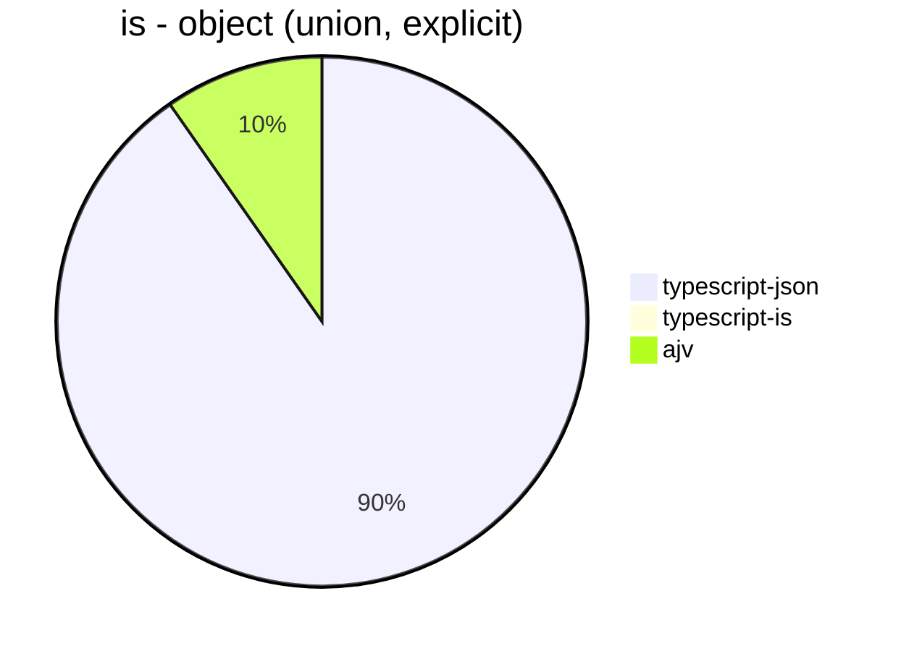
```mermaid
pie title is - object (union, explicit)
  "typescript-json": 18114.25925925926
  "typescript-is": 0
  "ajv": 1948.4208559147824
```

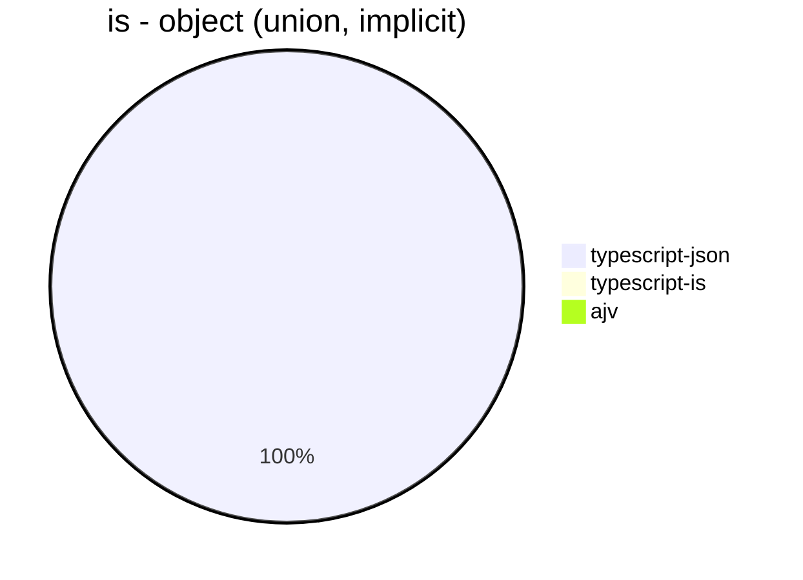
```mermaid
pie title is - object (union, implicit)
  "typescript-json": 13145.940014630578
  "typescript-is": 0
  "ajv": 0
```

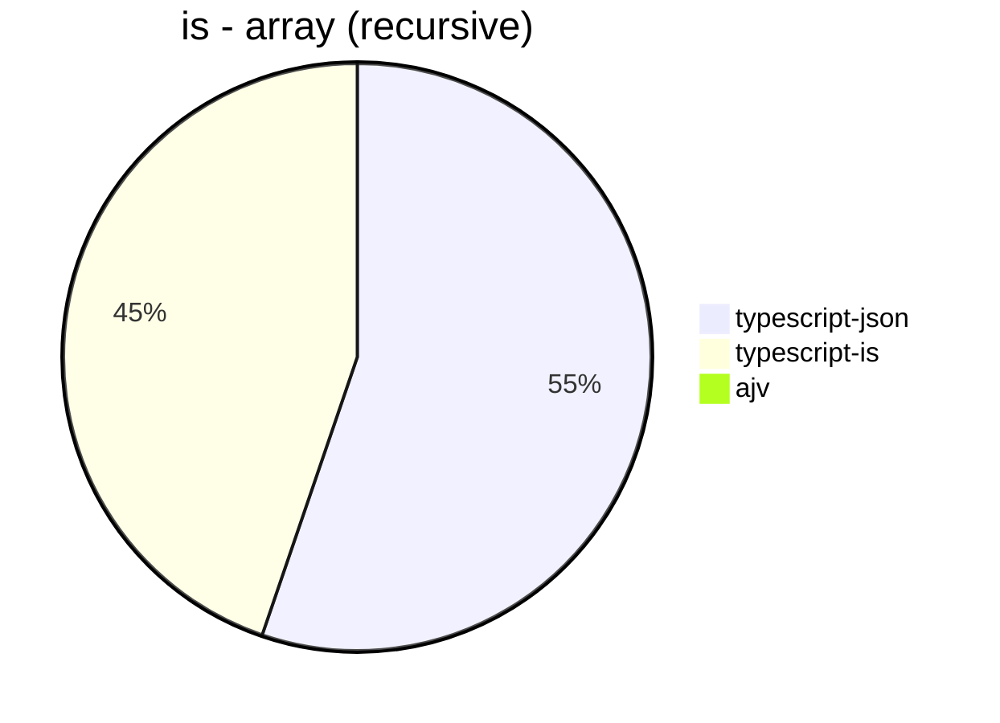
```mermaid
pie title is - array (recursive)
  "typescript-json": 6133.824884792627
  "typescript-is": 4968.860055607044
  "ajv": 0
```

```mermaid
pie title is - array (union, explicit)
  "typescript-json": 6791.184573002754
  "typescript-is": 1288.7758808572466
  "ajv": 0
```

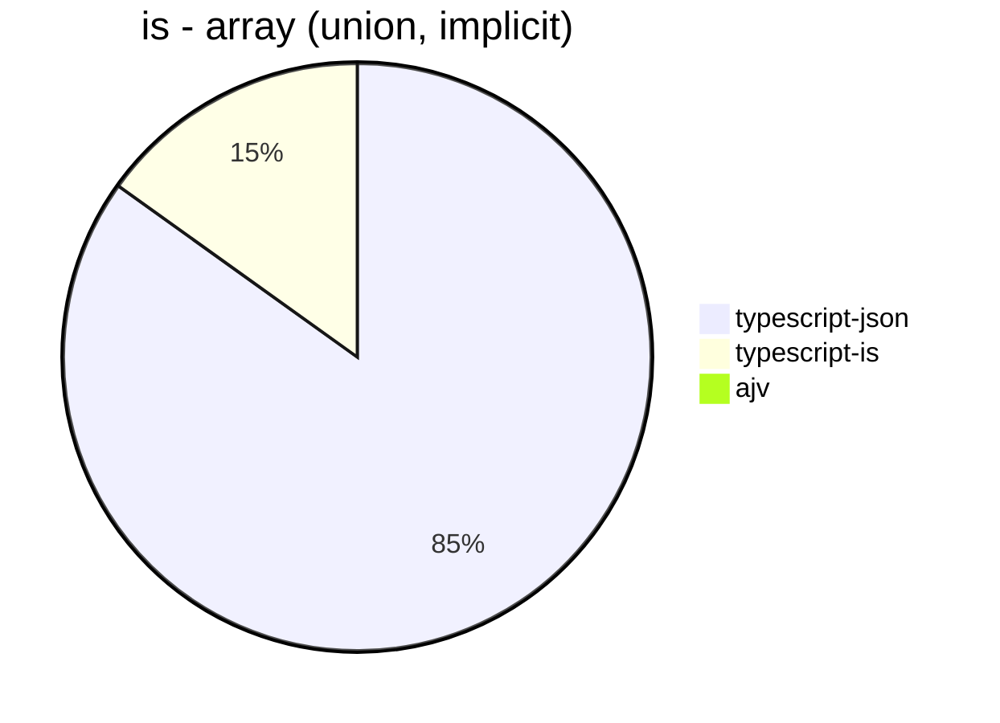
```mermaid
pie title is - array (union, implicit)
  "typescript-json": 7423.549423549423
  "typescript-is": 1320.7007508044333
  "ajv": 0
```

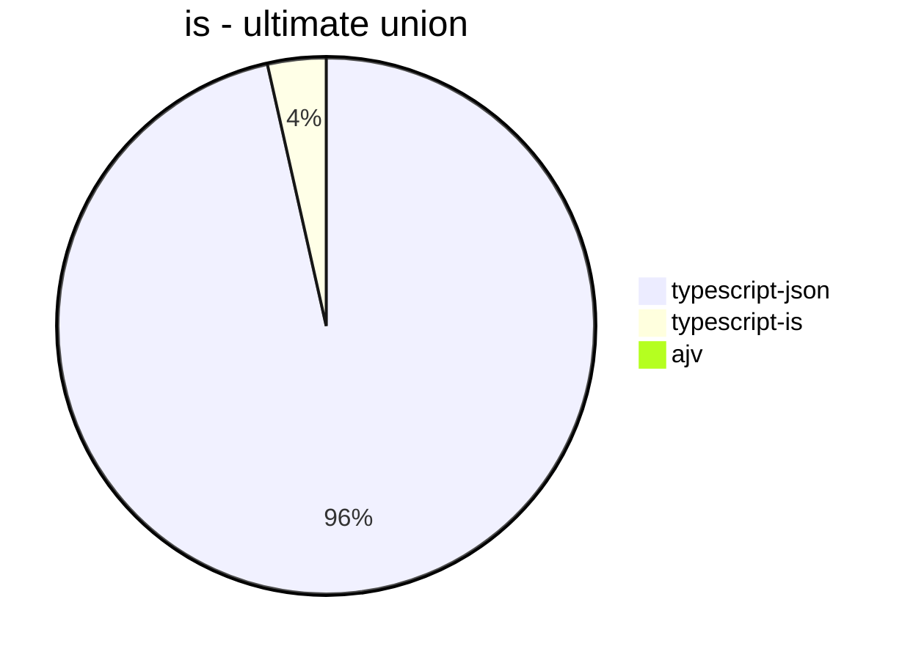
```mermaid
pie title is - ultimate union
  "typescript-json": 10541.89418188665
  "typescript-is": 384.46142649199413
  "ajv": 0
```

## optimizer
 Components | typescript-json | fast-json-stringify | JSON.stringify() 
------------|-----------------|---------------------|------------------
object (simple) | 49188.93058161351 | 10.119262739428985 | 15382.336396024752
object (hierarchical) | 6694.308056010184 | 2.206693637366679 | 3431.4901593252107
object (recursive) | 5933.308214016579 | 80.82092262985833 | 2833.48565161762
object (union) | 2653.5258189894507 | 1.6847622613253463 | 1937.918215613383
array (hierarchical) | 219.59154165913608 | 4.2727103845439345 | 188.9763779527559
array (recursive) | 323.22863403944484 | 69.74981046247157 | 273.5026886704988
array (union) | 484.4093910491563 | 3.1498980915323327 | 529.9963194700036
ultimate union | 1497.032640949555 | Failed | 396.69731656971294

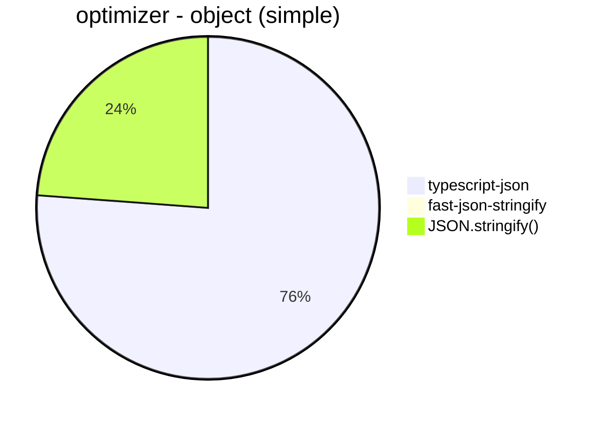
```mermaid
pie title optimizer - object (simple)
  "typescript-json": 49188.93058161351
  "fast-json-stringify": 10.119262739428985
  "JSON.stringify()": 15382.336396024752
```

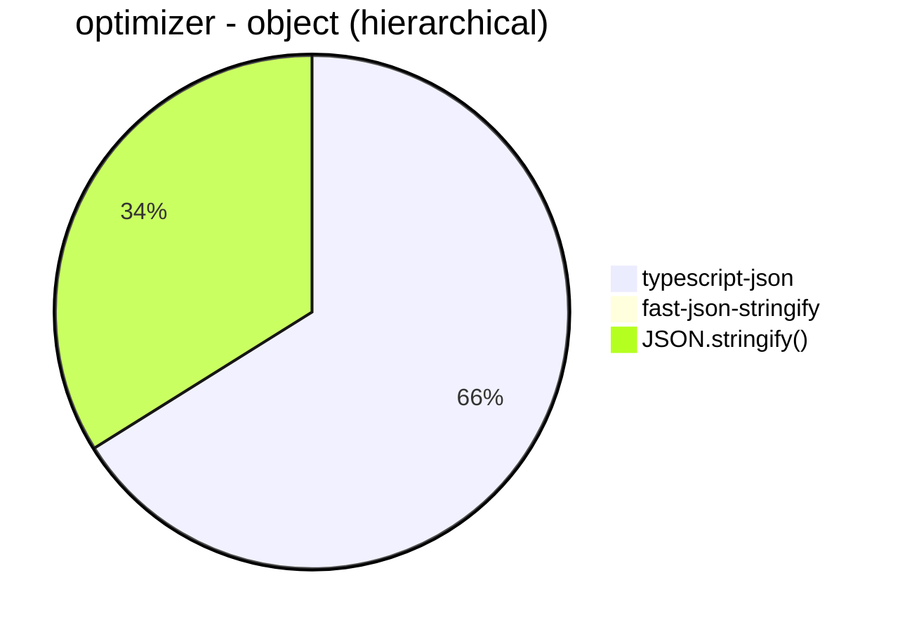
```mermaid
pie title optimizer - object (hierarchical)
  "typescript-json": 6694.308056010184
  "fast-json-stringify": 2.206693637366679
  "JSON.stringify()": 3431.4901593252107
```

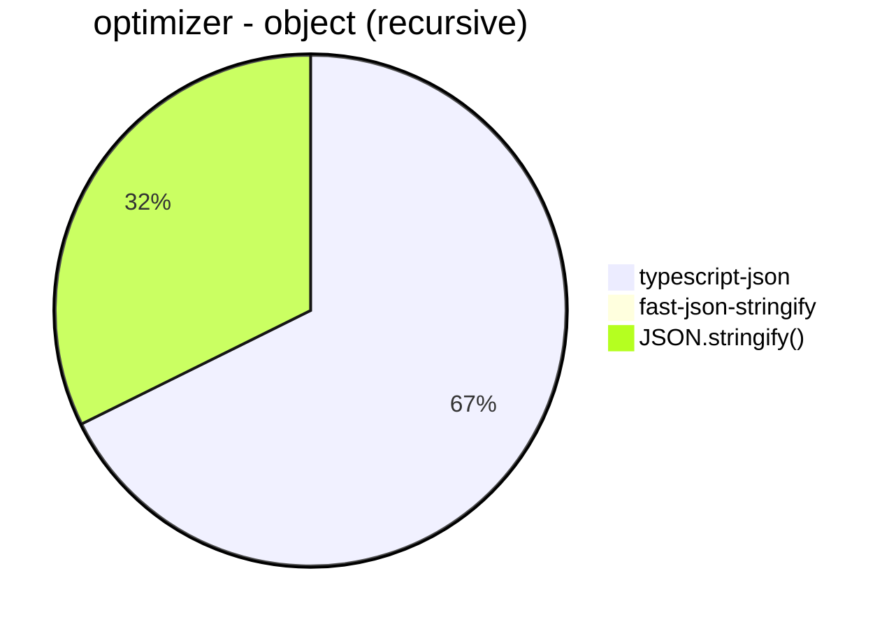
```mermaid
pie title optimizer - object (recursive)
  "typescript-json": 5933.308214016579
  "fast-json-stringify": 80.82092262985833
  "JSON.stringify()": 2833.48565161762
```

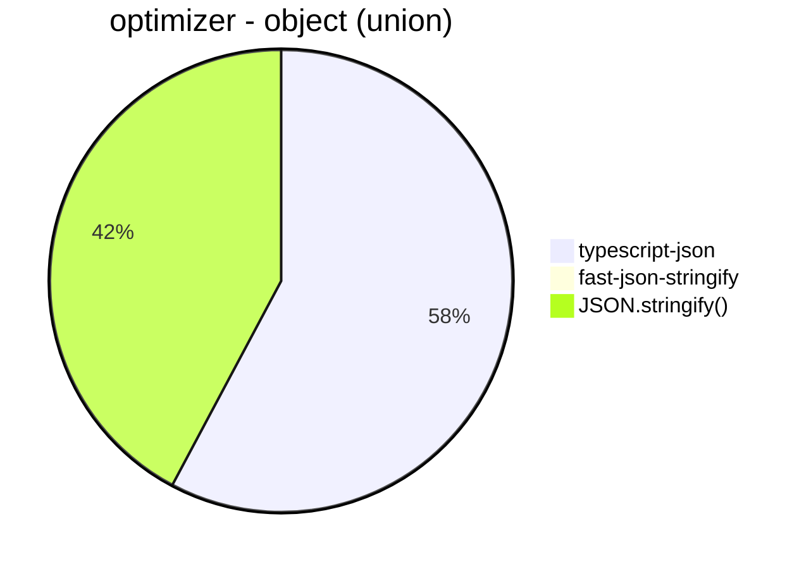
```mermaid
pie title optimizer - object (union)
  "typescript-json": 2653.5258189894507
  "fast-json-stringify": 1.6847622613253463
  "JSON.stringify()": 1937.918215613383
```

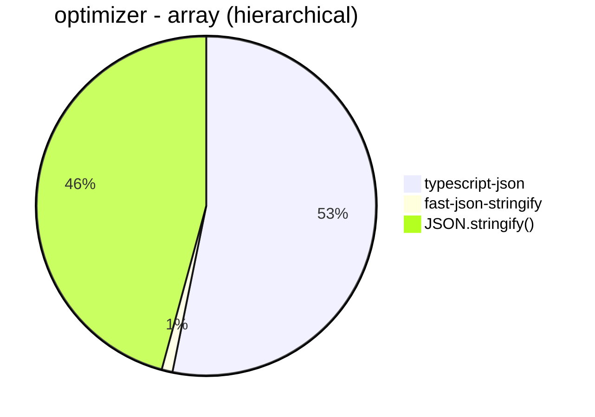
```mermaid
pie title optimizer - array (hierarchical)
  "typescript-json": 219.59154165913608
  "fast-json-stringify": 4.2727103845439345
  "JSON.stringify()": 188.9763779527559
```

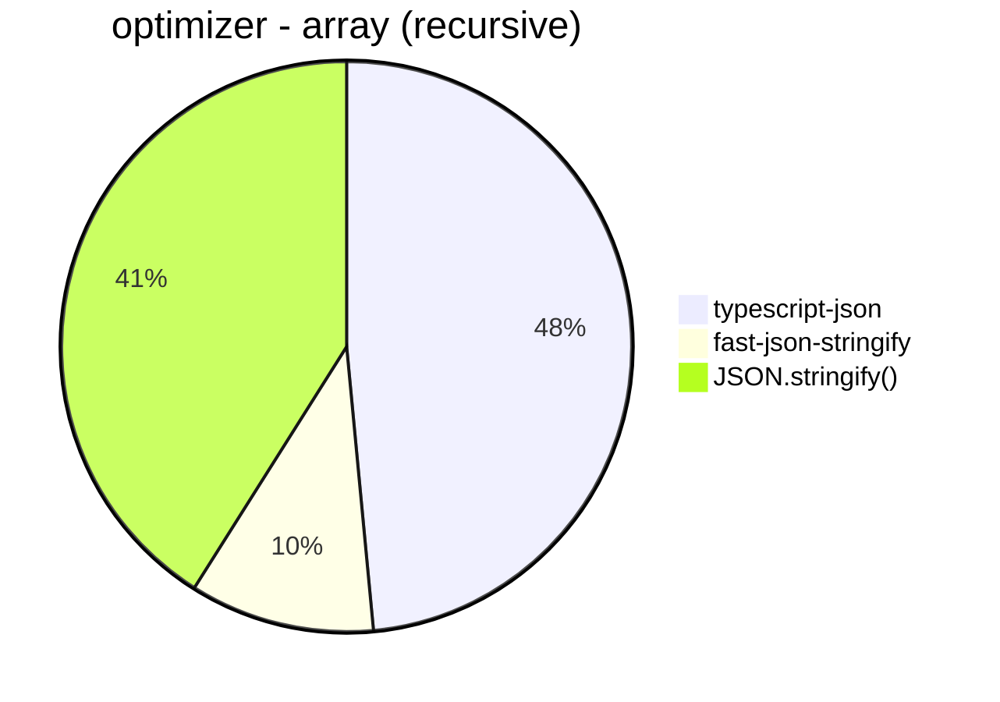
```mermaid
pie title optimizer - array (recursive)
  "typescript-json": 323.22863403944484
  "fast-json-stringify": 69.74981046247157
  "JSON.stringify()": 273.5026886704988
```

```mermaid
pie title optimizer - array (union)
  "typescript-json": 484.4093910491563
  "fast-json-stringify": 3.1498980915323327
  "JSON.stringify()": 529.9963194700036
```

```mermaid
pie title optimizer - ultimate union
  "typescript-json": 1497.032640949555
  "fast-json-stringify": 0
  "JSON.stringify()": 396.69731656971294
```

## stringify
 Components | typescript-json | fast-json-stringify | JSON.stringify() 
------------|-----------------|---------------------|------------------
object (simple) | 47682.53968253969 | 39081.22382079767 | 15306.045812992867
object (hierarchical) | 7295.127870076535 | 7067.857142857142 | 3446.556266465939
object (recursive) | 6053.736991485336 | 2899.050102439933 | 2841.472303206997
object (union) | 2673.0349344978163 | 2080.8062130177514 | 1969.7709350356743
array (hierarchical) | 87.84530386740332 | 118.70305916834586 | 72.75711159737418
array (recursive) | 318.95001797914415 | 270.007342143906 | 270.8026509572901
array (union) | 491.31559497413156 | 482.5046040515654 | 529.9632352941176
ultimate union | 1501.5650893021543 | Failed | 392.98310748097276

```mermaid
pie title stringify - object (simple)
  "typescript-json": 47682.53968253969
  "fast-json-stringify": 39081.22382079767
  "JSON.stringify()": 15306.045812992867
```

```mermaid
pie title stringify - object (hierarchical)
  "typescript-json": 7295.127870076535
  "fast-json-stringify": 7067.857142857142
  "JSON.stringify()": 3446.556266465939
```

```mermaid
pie title stringify - object (recursive)
  "typescript-json": 6053.736991485336
  "fast-json-stringify": 2899.050102439933
  "JSON.stringify()": 2841.472303206997
```

```mermaid
pie title stringify - object (union)
  "typescript-json": 2673.0349344978163
  "fast-json-stringify": 2080.8062130177514
  "JSON.stringify()": 1969.7709350356743
```

```mermaid
pie title stringify - array (hierarchical)
  "typescript-json": 87.84530386740332
  "fast-json-stringify": 118.70305916834586
  "JSON.stringify()": 72.75711159737418
```

```mermaid
pie title stringify - array (recursive)
  "typescript-json": 318.95001797914415
  "fast-json-stringify": 270.007342143906
  "JSON.stringify()": 270.8026509572901
```

```mermaid
pie title stringify - array (union)
  "typescript-json": 491.31559497413156
  "fast-json-stringify": 482.5046040515654
  "JSON.stringify()": 529.9632352941176
```

```mermaid
pie title stringify - ultimate union
  "typescript-json": 1501.5650893021543
  "fast-json-stringify": 0
  "JSON.stringify()": 392.98310748097276
```

