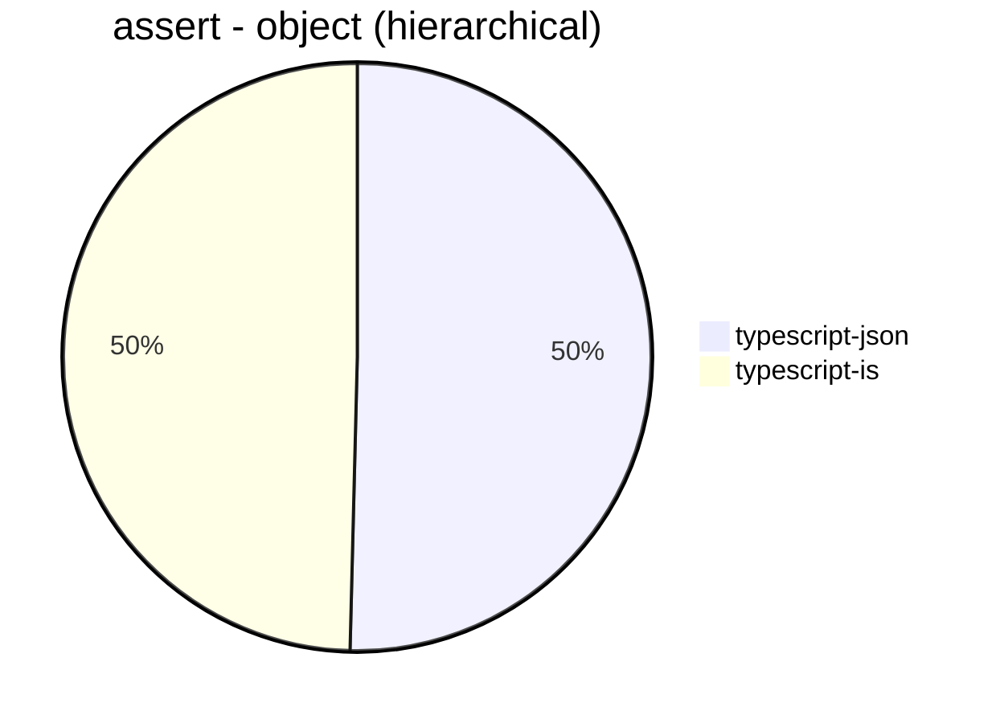
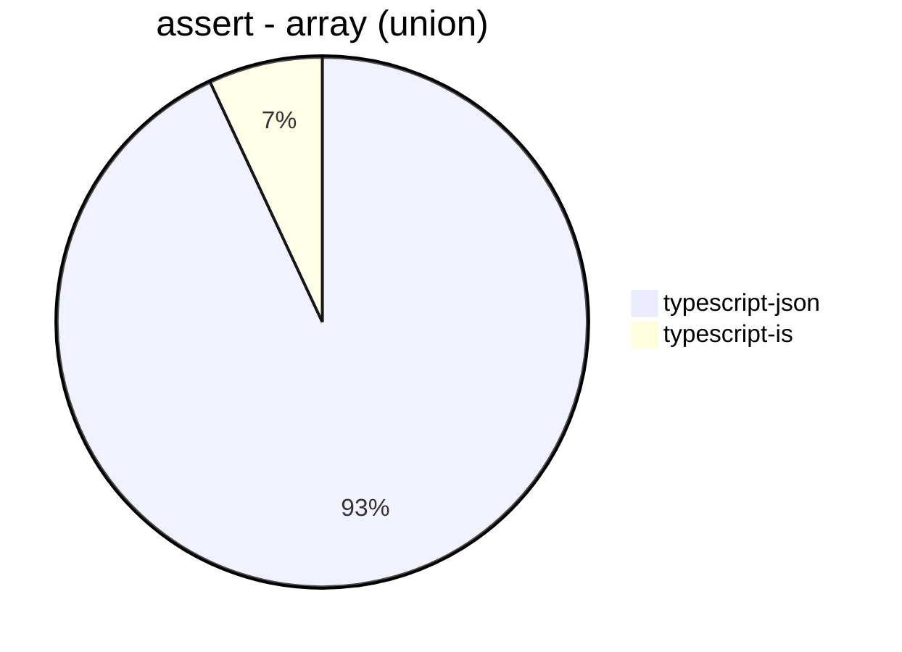
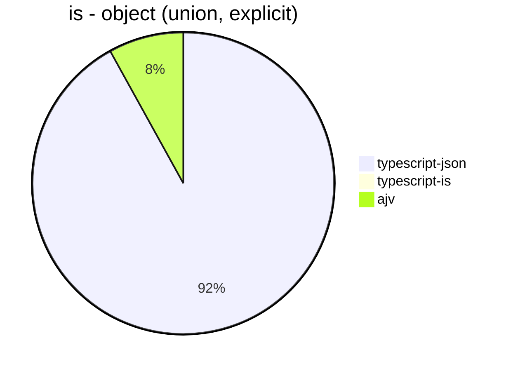
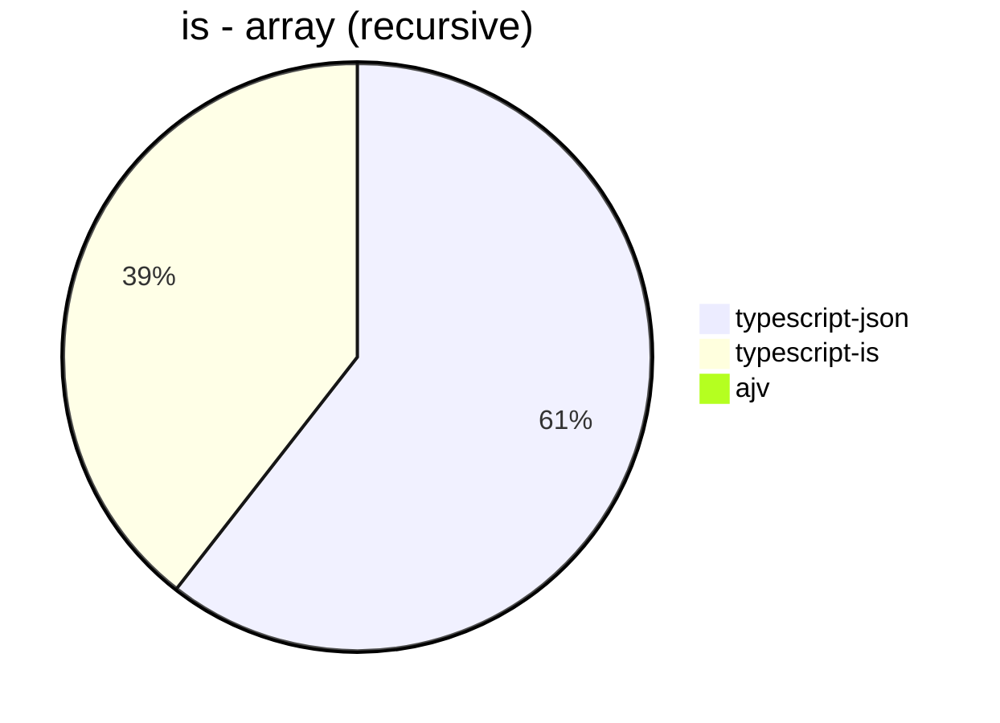
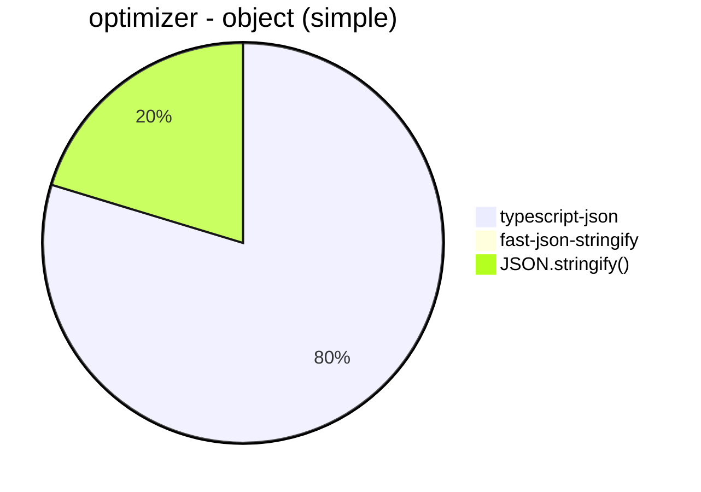
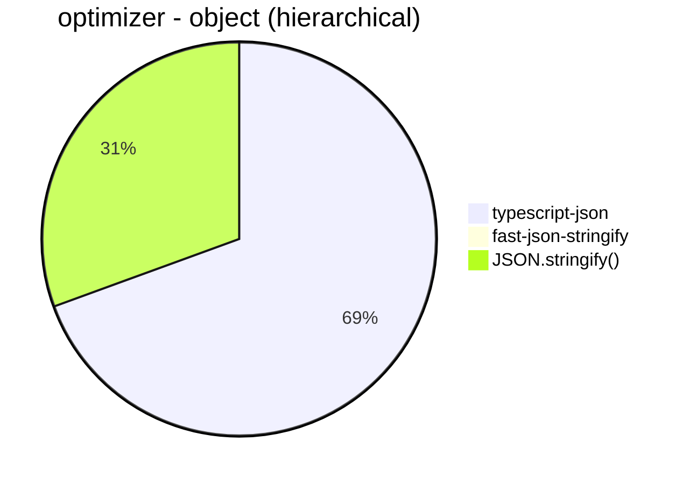
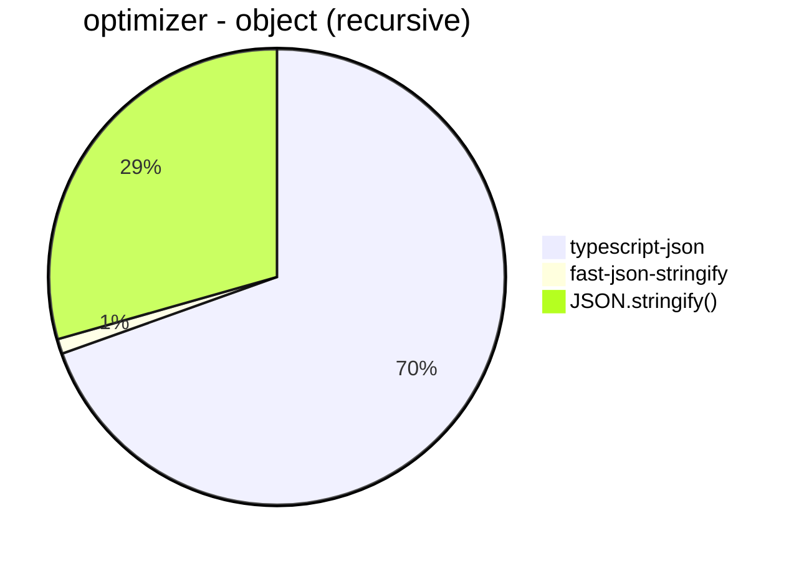
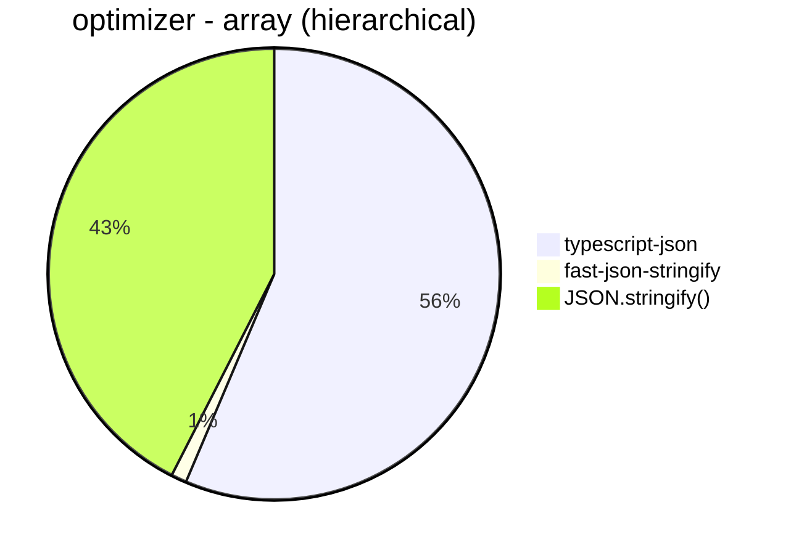
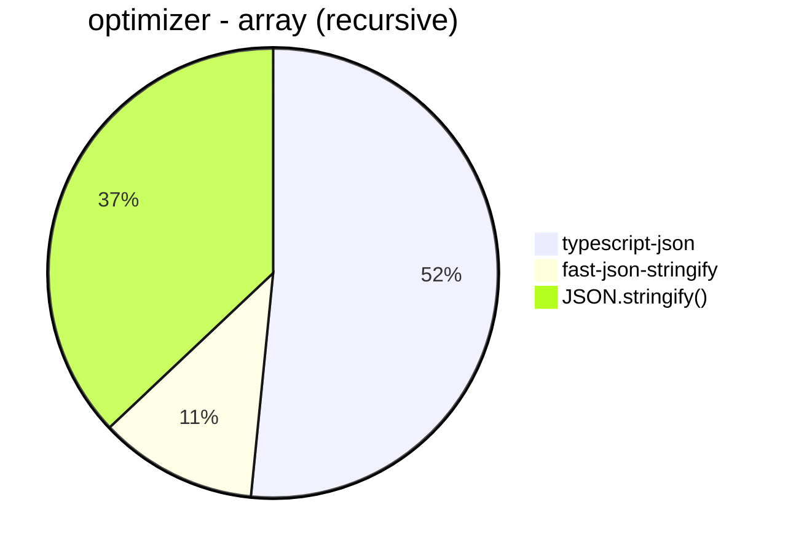

# Benchmark of `typescript-json`
> CPU: Apple M1 Max
> Memory: 32,768 MB


## assert
 Components | typescript-json | typescript-is 
------------|-----------------|---------------
object (hierarchical) | 29432.477064220184 | 28973.17518248175
object (recursive) | 34207.44288872513 | 21620.797354400147
object (union) | 6119.772560528247 | 2908.6900606283302
array (recursive) | 1556.252375522615 | 1856.788372917405
array (union) | 4137.602927721867 | 309.29546292880855
ultimate union | 4773.104488872124 | 46.6618808327351








## is
 Components | typescript-json | typescript-is | ajv 
------------|-----------------|---------------|-----
object (hierarchical) | 121981.10785033015 | 64257.981177338996 | 96245.47996272134
object (recursive) | 71419.72562106044 | 48870.20437432771 | Failed
object (union, explicit) | 18270.049099836335 | Failed | 1596.993032636597
object (union, implicit) | 17898.483496877787 | Failed | Failed
array (recursive) | 7366.194592606216 | 4800.8776741634665 | Failed
array (union, explicit) | 7510.901796616083 | 1349.054838105933 | Failed
array (union, implicit) | 8119.151354423187 | 1387.631143014909 | Failed
ultimate union | 12011.886792452831 | 382.20666789463985 | Failed








## optimizer
 Components | typescript-json | fast-json-stringify | JSON.stringify() 
------------|-----------------|---------------------|------------------
object (simple) | 54207.5329566855 | 10.307446241336415 | 13813.256376838577
object (hierarchical) | 7173.953145176167 | 2.144388849177984 | 3158.0507689457104
object (recursive) | 6117.1555885629405 | 92.77797640328923 | 2585.8400586940575
object (union) | 2886.0018298261666 | 1.6672841793256763 | 1877.1863832988527
array (hierarchical) | 219.41391941391942 | 4.30550355672033 | 165.3846153846154
array (recursive) | 351.0735914846761 | 77.41450582487786 | 252.14438884917797
array (union) | 529.5905596281066 | 3.165146155278346 | 500.6612507084829
ultimate union | 1716.6328225955326 | Failed | 402.4367385192127

















```mermaid
pie title optimizer - array (union)
  "typescript-json": 529.5905596281066
  "fast-json-stringify": 3.165146155278346
  "JSON.stringify()": 500.6612507084829
```


```mermaid
pie title optimizer - ultimate union
  "typescript-json": 1716.6328225955326
  "fast-json-stringify": 0
  "JSON.stringify()": 402.4367385192127
```


## stringify
 Components | typescript-json | fast-json-stringify | JSON.stringify() 
------------|-----------------|---------------------|------------------
object (simple) | 52931.58473954512 | 40538.33240067152 | 13609.52557449963
object (hierarchical) | 7595.1595159515955 | 7287.947269303202 | 3210.139464756879
object (recursive) | 6483.08727340684 | 2627.234199373503 | 2628.2098312545854
object (union) | 2971.964352023765 | 2109.1472303206997 | 1844.6976658702445
array (hierarchical) | 147.69230769230768 | 198.8141560125996 | 111.35135135135135
array (recursive) | 352.27891774105683 | 264.01345291479817 | 265.89161822613914
array (union) | 560.3033666296708 | 446.5280356479762 | 488.4446074834923
ultimate union | 1717.1496263896481 | Failed | 399.7011580127008


```mermaid
pie title stringify - object (simple)
  "typescript-json": 52931.58473954512
  "fast-json-stringify": 40538.33240067152
  "JSON.stringify()": 13609.52557449963
```


```mermaid
pie title stringify - object (hierarchical)
  "typescript-json": 7595.1595159515955
  "fast-json-stringify": 7287.947269303202
  "JSON.stringify()": 3210.139464756879
```


```mermaid
pie title stringify - object (recursive)
  "typescript-json": 6483.08727340684
  "fast-json-stringify": 2627.234199373503
  "JSON.stringify()": 2628.2098312545854
```


```mermaid
pie title stringify - object (union)
  "typescript-json": 2971.964352023765
  "fast-json-stringify": 2109.1472303206997
  "JSON.stringify()": 1844.6976658702445
```


```mermaid
pie title stringify - array (hierarchical)
  "typescript-json": 147.69230769230768
  "fast-json-stringify": 198.8141560125996
  "JSON.stringify()": 111.35135135135135
```


```mermaid
pie title stringify - array (recursive)
  "typescript-json": 352.27891774105683
  "fast-json-stringify": 264.01345291479817
  "JSON.stringify()": 265.89161822613914
```


```mermaid
pie title stringify - array (union)
  "typescript-json": 560.3033666296708
  "fast-json-stringify": 446.5280356479762
  "JSON.stringify()": 488.4446074834923
```


```mermaid
pie title stringify - ultimate union
  "typescript-json": 1717.1496263896481
  "fast-json-stringify": 0
  "JSON.stringify()": 399.7011580127008
```


