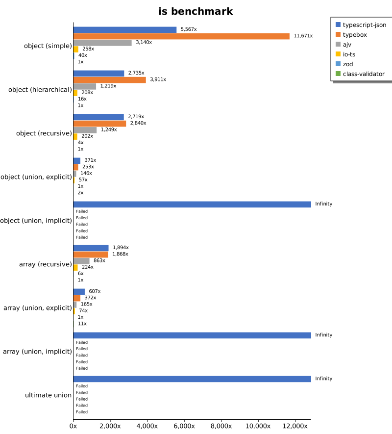
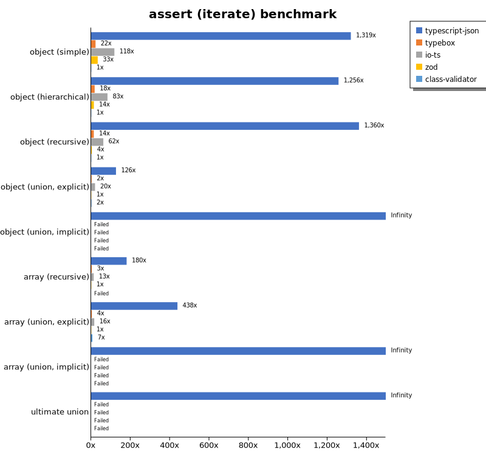
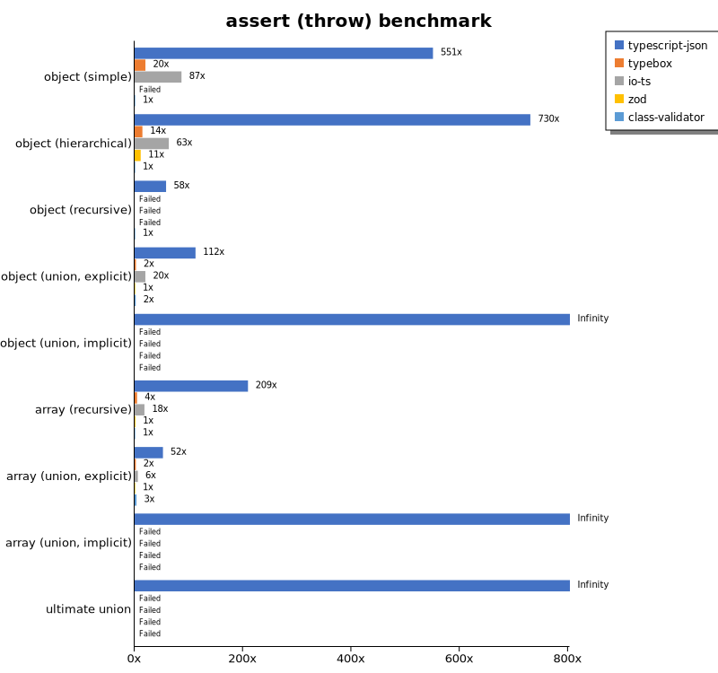
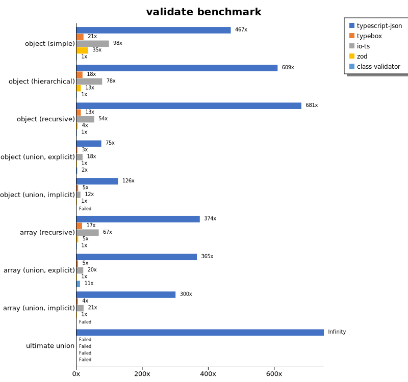
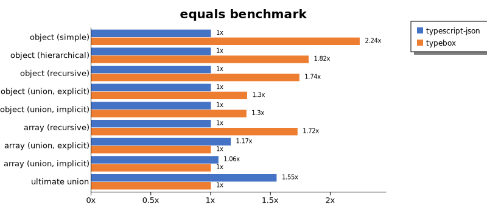
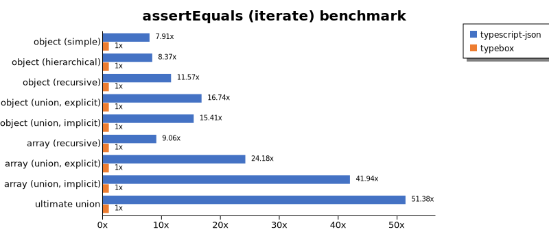
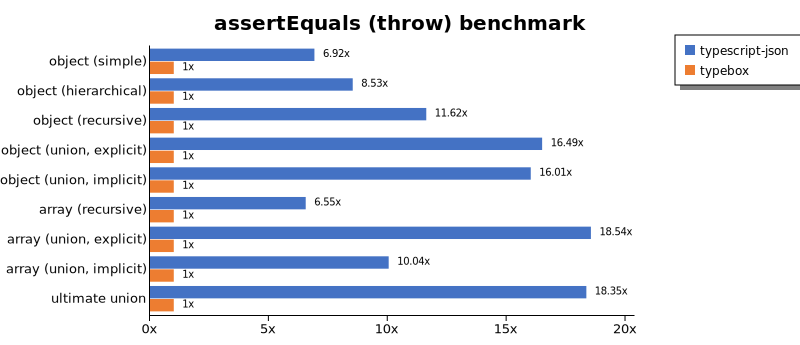
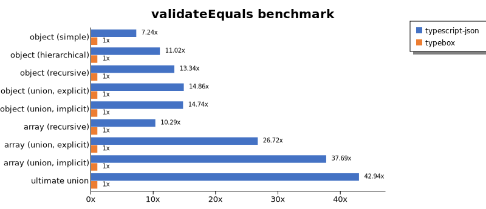
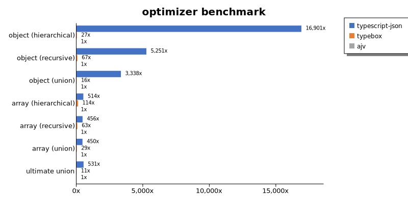
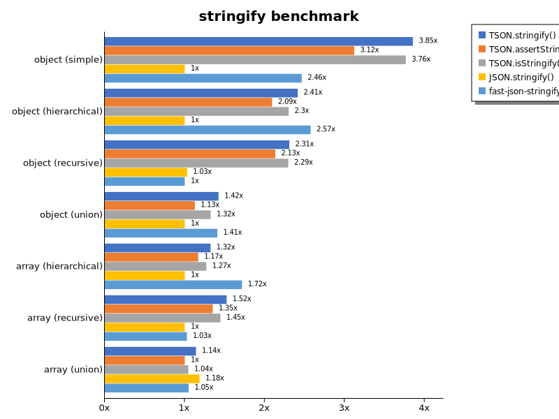

# Benchmark of `typescript-json`
> - CPU: Apple M1 Max
> - Memory: 65,536 MB
> - OS: darwin
> - TypeScript-JSON version: 3.3.31

## is

 Components | typescript-json | typebox | ajv | io-ts | zod | class-validator 
------------|-----------------|---------|-----|-------|-----|-----------------
object (simple) | 2213050.910442215 | 1217082.1643286573 | 484014.0066347217 | 38806.31693592303 | 6336.9443406798655 | 172.2627737226277
object (hierarchical) | 222776.1304670126 | 196927.26242206688 | 72855.435188644 | 11012.41890639481 | 818.4672206832871 | 59.06238464377999
object (recursive) | 100556.02732139561 | 91866.14901090776 | 43647.14548802947 | 6710.2283274549845 | 126.40916651265941 | 38.01006148686417
object (union, explicit) | 28325.326271987895 | 17192.073170731706 | 11243.919885550788 | 3857.8340156308154 | 72.14577910003719 | 141.47675478577938
object (union, implicit) | 21332.602339181285 | Failed | Failed | Failed | Failed | Failed
array (recursive) | 10137.381966302537 | 6997.451765562432 | 2530.538489338634 | 617.0571696344892 | 16.55379984951091 | 3.68052999631947
array (union, explicit) | 4535.119478638668 | 2203.5398230088495 | 1116.5869805075397 | 428.2736403259428 | 6.754221388367729 | 43.18100035984167
array (union, implicit) | 1101.2264323631705 | Failed | Failed | Failed | Failed | Failed
ultimate union | 795.3997403079206 | Failed | Failed | Failed | Failed | Failed

## assert (iterate)

 Components | typescript-json | typebox | io-ts | zod | class-validator 
------------|-----------------|---------|-------|-----|-----------------
object (simple) | 232166.35825314582 | 3944.890510948905 | 20785.673785673782 | 5894.413407821229 | 176.01760176017603
object (hierarchical) | 73556.81396212403 | 1048.1263776634828 | 4863.974692966133 | 816.5979767703259 | 58.544592376436256
object (recursive) | 51460.93894971237 | 512.2364457831325 | 2343.3962264150946 | 133.85228782988418 | 37.8317334839074
object (union, explicit) | 9308.003679852805 | 178.44490024240162 | 1465.4578422484135 | 73.71428571428572 | 139.2035074899525
object (union, implicit) | 8077.262693156733 | Failed | Failed | Failed | Failed
array (recursive) | 3069.9093767338636 | 52.62175779063258 | 221.5624420115049 | 17.032551097653293 | Failed
array (union, explicit) | 2988.9746416758544 | 24.746906636670417 | 107.85767234988882 | 6.8181818181818175 | 45.33282325937261
array (union, implicit) | 1576.6871165644172 | Failed | Failed | Failed | Failed
ultimate union | 346.1746174617462 | Failed | Failed | Failed | Failed

## assert (throw)

 Components | typescript-json | typebox | io-ts | zod | class-validator 
------------|-----------------|---------|-------|-----|-----------------
object (simple) | 101949.28084784254 | 3688.447856206703 | 16013.628620102212 | Failed | 185.11662347278786
object (hierarchical) | 53133.257833144584 | 1044.5812348442455 | 4590.476190476191 | 813.7774413323241 | 72.74049827241316
object (recursive) | 6455.813953488372 | Failed | Failed | Failed | 111.17287381878822
object (union, explicit) | 8406.91685062546 | 186.08113137327877 | 1482.6078692263827 | 74.79431563201196 | 150.6024096385542
object (union, implicit) | 6404.657933042212 | Failed | Failed | Failed | Failed
array (recursive) | 2601.7468871956885 | 55.57613931085588 | 225.30980097634247 | 17.873100983020553 | 12.434717731907485
array (union, explicit) | 824.6289169873558 | 35.448422545196735 | 93.84384384384384 | 15.770383220312253 | 54.495912806539515
array (union, implicit) | 314.9898091532333 | Failed | Failed | Failed | Failed
ultimate union | 369.82248520710056 | Failed | Failed | Failed | Failed

## validate

 Components | typescript-json | typebox | io-ts | zod | class-validator 
------------|-----------------|---------|-------|-----|-----------------
object (simple) | 129980.57204533188 | 3715.354404338881 | 16593.57170026626 | 5877.676410351889 | 174.66691002007667
object (hierarchical) | 47728.782287822876 | 1033.4429824561403 | 4650.867699197612 | 818.5915492957745 | 60.760931289040315
object (recursive) | 33828.84544448543 | 506.83648623337706 | 2199.8130841121497 | 136.12866168868464 | 37.17403366007028
object (union, explicit) | 7215.342465753425 | 184.79909021986353 | 1434.3228200371059 | 74.55890722822994 | 142.01510407073124
object (union, implicit) | 5713.087248322148 | 175.023832221163 | 441.7520969245107 | 39.88017225238719 | Failed
array (recursive) | 1829.6823658269443 | 53.72451895599163 | 218.15074995253462 | 17.690698116796653 | 3.3860045146726865
array (union, explicit) | 2478.7369958021536 | 25.09505703422053 | 108.08288221019228 | 6.759294029290274 | 45.42873367404883
array (union, implicit) | 1442.7522935779816 | 16.74418604651163 | 77.47816179263198 | 4.4859813084112155 | Failed
ultimate union | 277.8889899909008 | Failed | Failed | Failed | Failed

## equals

 Components | typescript-json | typebox 
------------|-----------------|---------
object (simple) | 37056.58999634904 | 70162.8242074928
object (hierarchical) | 12428.834130194926 | 20572.286894479912
object (recursive) | 8629.809488233097 | 13163.08376575241
object (union, explicit) | 3796.497695852535 | 4459.200900393922
object (union, implicit) | 2514.5430662413214 | 2888.2395909422935
array (recursive) | 704.9118860142482 | 1213.732004429679
array (union, explicit) | 1004.8309178743962 | 797.3149356703337
array (union, implicit) | 491.65290772335356 | 517.5870238746127
ultimate union | 380.6404657933042 | Failed

## assertEquals (iterate)

 Components | typescript-json | typebox 
------------|-----------------|---------
object (simple) | 40009.94558078439 | 2985.722130697419
object (hierarchical) | 10148.416769856714 | 897.5455559687616
object (recursive) | 7927.793904208999 | 439.1592920353982
object (union, explicit) | 3230.512249443207 | 135.14008423365684
object (union, implicit) | 705.2820053715309 | 100.53993669707688
array (recursive) | 672.5878833208676 | 47.58264857634245
array (union, explicit) | 323.3631223782601 | 20.83724422752018
array (union, implicit) | 218.41188336695396 | 9.111617312072894
ultimate union | 287.52759381898454 | Failed

## assertEquals (throw)

 Components | typescript-json | typebox 
------------|-----------------|---------
object (simple) | 26320.582877959925 | 2874.0960504357504
object (hierarchical) | 9399.571122230163 | 851.8518518518517
object (recursive) | 7522.040892890639 | 422.01834862385317
object (union, explicit) | 3294.646199925122 | 148.72652909462727
object (union, implicit) | 2247.8070175438597 | 110.78286558345643
array (recursive) | 526.3157894736842 | 54.94505494505495
array (union, explicit) | 407.48286719762916 | 36.8052999631947
array (union, implicit) | 204.5370026031982 | 16.315875346712353
ultimate union | 293.3626696002934 | Failed

## validateEquals

 Components | typescript-json | typebox 
------------|-----------------|---------
object (simple) | 26037.60088041086 | 2993.398129470016
object (hierarchical) | 10151.360233704581 | 880.9390721073225
object (recursive) | 6494.343891402715 | 435.6984478935699
object (union, explicit) | 2330.7984790874525 | 140.37735849056605
object (union, implicit) | 1695.9659511472983 | 102.46679316888046
array (recursive) | 498.0694980694981 | 47.12339137017411
array (union, explicit) | 550.3462972828981 | 21.034678794769754
array (union, implicit) | 343.2644854688357 | 8.968609865470851
ultimate union | 204.08882622488545 | Failed

## optimizer

 Components | typescript-json | typebox | ajv 
------------|-----------------|---------|-----
object (hierarchical) | 202491.531597159 | 236.31436314363143 | 9.335529928610653
object (recursive) | 93918.70824053453 | 1108.5082458770614 | 17.695919104369807
object (union) | 25015.710632078917 | 121.94677360554138 | 8.195194635872602
array (hierarchical) | 5930.405656866395 | 1294.0301283243446 | 11.879049676025918
array (recursive) | 8760.173323285608 | 1054.8679105856272 | 18.611576400521123
array (union) | 4997.946995147443 | 299.62613494748086 | 11.54132539091586
ultimate union | 796.1201268420072 | 16.69139465875371 | 1.4735678762202984

## stringify

 Components | TSON.stringify() | TSON.assertStringify() | TSON.isStringify() | JSON.stringify() | fast-json-stringify 
------------|------------------|------------------------|--------------------|------------------|---------------------
object (simple) | 58771.749126356444 | 47592.68026219957 | 57411.77577125659 | 15250 | 37562.755192614946
object (hierarchical) | 8187.051717629294 | 7099.816513761468 | 7801.698113207547 | 3392.3047906450397 | 8732.099907493062
object (recursive) | 6461.272727272727 | 5970.786927149899 | 6424.361126655475 | 2881.2202097235463 | 2799.5921394141637
object (union) | 1981.559247763374 | 1568.0632979679913 | 1843.7385236871098 | 1392.4385633270322 | 1959.4544095665171
array (hierarchical) | 108.08809920414585 | 95.44547269098167 | 103.73520710059171 | 81.70180722891565 | 140.19374885761286
array (recursive) | 366.9184011788543 | 324.98629135441416 | 348.1914504932408 | 240.76782449725778 | 247.13399736891563
array (union) | 484.31991092967155 | 424.63235294117646 | 443.6117711570097 | 502.98284862043255 | 445.18692432725305

