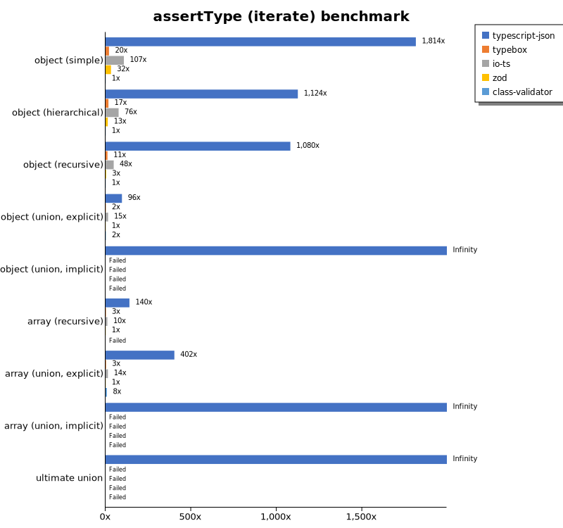

# Benchmark of `typescript-json`
> - CPU: Apple M1 Max
> - Memory: 32,768 MB
> - OS: darwin
> - TypeScript-JSON version: 3.3.20

## is

 Components | typescript-json | typebox | ajv | io-ts | zod | class-validator 
------------|-----------------|---------|-----|-------|-----|-----------------
object (simple) | 886116.7123287672 | 1857741.504178273 | 499872.925119882 | 41081.09589041096 | 6413.715570545251 | 159.17076598735065
object (hierarchical) | 142588.59583952453 | 203877.81531531533 | 63551.94201821223 | 10856.62233558025 | 809.0507726269316 | 52.1256931608133
object (recursive) | 89068.19866567828 | 93006.09080841638 | 40898.72717210847 | 6614.054656999443 | 124.88227538142776 | 32.75351591413767
object (union, explicit) | 24945.66452101477 | 17038.288288288288 | 9796.641446761396 | 3863.7754183912175 | 67.32747334954179 | 149.43396226415095
object (union, implicit) | 20738.117780723347 | Failed | Failed | Failed | Failed | Failed
array (recursive) | 5347.135564378899 | 5273.637374860957 | 2437.038439689453 | 633.818589025756 | 15.774647887323942 | 2.8237951807228914
array (union, explicit) | 3436.282693377852 | 2103.7735849056603 | 932.0007472445359 | 416.1753868828298 | 5.659309564233164 | 61.0614418870078
array (union, implicit) | 1638.2475913470278 | Failed | Failed | Failed | Failed | Failed
ultimate union | 709.4520044133873 | Failed | Failed | Failed | Failed | Failed

## assertType (iterate)

 Components | typescript-json | typebox | io-ts | zod | class-validator 
------------|-----------------|---------|-------|-----|-----------------
object (simple) | 179035.333707235 | 3613.0974783590514 | 17129.032258064515 | 5644.963828603228 | 155.181969333087
object (hierarchical) | 50388.838721329244 | 962.6571589416401 | 4142.910447761194 | 715.700396110911 | 53.231228987672765
object (recursive) | 45405.53925165077 | 457.0957095709572 | 1960.2053915275994 | 134.30298451076692 | 35.46234509056244
object (union, explicit) | 7300.597460791635 | 163.8608305274972 | 1248.013306228054 | 73.14285714285714 | 144.67849223946786
object (union, implicit) | 6035.030103995621 | Failed | Failed | Failed | Failed
array (recursive) | 2008.2191780821918 | 52.62154432793136 | 185.4268624252311 | 17.71091220719863 | Failed
array (union, explicit) | 2602.7088036117384 | 23.41964965727342 | 100.89302679080373 | 6.242905788876278 | 53.739612188365655
array (union, implicit) | 1341.5395921366894 | Failed | Failed | Failed | Failed
ultimate union | 334.69969702370344 | Failed | Failed | Failed | Failed

## assertType (throw)

 Components | typescript-json | typebox | io-ts | zod | class-validator 
------------|-----------------|---------|-------|-----|-----------------
object (simple) | 79054.79955866127 | 3642.196640875637 | 14647.619047619048 | Failed | 167.13091922005572
object (hierarchical) | 39643.24717874044 | 1054.8125824072329 | 4611.604611604612 | 816.6295471417966 | 55.782818891781325
object (recursive) | 5030.403537866225 | Failed | Failed | Failed | 113.20754716981132
object (union, explicit) | 6735.07462686567 | 168.7289088863892 | 1491.9735599622286 | 74.11524921252547 | 170.8752610594266
object (union, implicit) | 5315.7992220781625 | Failed | Failed | Failed | Failed
array (recursive) | 1226.993865030675 | 54.60502366217692 | 149.03129657228018 | 17.98561151079137 | 12.183235867446394
array (union, explicit) | 769.8084866691702 | 34.82500435312554 | 93.68559115608019 | 15.267175572519085 | 55.360767669311684
array (union, implicit) | 298.34048107402566 | Failed | Failed | Failed | Failed
ultimate union | 334.26183844011143 | Failed | Failed | Failed | Failed

## validate

 Components | typescript-json | typebox | io-ts | zod | class-validator 
------------|-----------------|---------|-------|-----|-----------------
object (simple) | 78290.19680653546 | 3134.2148161564937 | 15051.33508837909 | 5446.187522801897 | 154.96098104793757
object (hierarchical) | 26653.46715328467 | 990.1197035911077 | 3841.5381757384357 | 758.9471690967621 | 51.855895196506545
object (recursive) | 22090.444654683066 | 442.0937443005654 | 1859.38075930704 | 137.68253366205198 | 35.5436652016052
object (union, explicit) | 5006.964809384163 | 192.65536723163842 | 1291.3340935005704 | 73.48784624081401 | 153.88919977616118
object (union, implicit) | 4517.033356990773 | 180.15963511972637 | 445.1173353520061 | 39.249146757679185 | Failed
array (recursive) | 1107.0714415560806 | 57.453999248967335 | 232.03791469194312 | 17.637018774890954 | 3.330866025166544
array (union, explicit) | 1928.294930875576 | 26.699488733194475 | 112.93054771315641 | 5.62429696287964 | 56
array (union, implicit) | 1045.6316082359488 | 15.78650629580906 | 81.9578827546955 | 3.9637599093997737 | Failed
ultimate union | 220.5801860974275 | Failed | Failed | Failed | Failed

## equals

 Components | typescript-json | typebox 
------------|-----------------|---------
object (simple) | 22999.264029438826 | 55803.93586005831
object (hierarchical) | 7227.625739644969 | 16912.85924834193
object (recursive) | 4905.6079955580235 | 9977.681001633098
object (union, explicit) | 2505.9413293724474 | 3534.587714443829
object (union, implicit) | 1742.9756741467095 | 2534.991646556525
array (recursive) | 390.41850220264314 | 891.2963643040764
array (union, explicit) | 699.03988183161 | 702.9665790461886
array (union, implicit) | 485.4935945742276 | 454.7287390029325
ultimate union | 330.1666965405987 | 232.68238761974945

## assertEquals (iterate)

 Components | typescript-json | typebox 
------------|-----------------|---------
object (simple) | 20997.734994337487 | 2863.329583802025
object (hierarchical) | 6645.339216767788 | 796.5084560829242
object (recursive) | 4468.132274154812 | 418.75119343135384
object (union, explicit) | 2080.5731298846295 | 129.70241437394722
object (union, implicit) | 1536.2156092083098 | 104.31312939388181
array (recursive) | 389.4736842105263 | 48.6700622524052
array (union, explicit) | 508.34403080872914 | 22.188507490991846
array (union, implicit) | 331.7020119630233 | 8.433283358320839
ultimate union | 256.72916279933173 | 5.081874647092039

## assertEquals (throw)

 Components | typescript-json | typebox 
------------|-----------------|---------
object (simple) | 18604.224058769512 | 2720.20725388601
object (hierarchical) | 6721.915285451198 | 818.6046511627908
object (recursive) | 4694.921446839605 | 413.30077024234447
object (union, explicit) | 2247.3997028231797 | 130.96351730589336
object (union, implicit) | 1498.8897113249445 | 112.549240292628
array (recursive) | 336.70033670033666 | 54.32814197754436
array (union, explicit) | 337.58439609902473 | 18.331805682859763
array (union, implicit) | 147.32965009208104 | 16.469038208168644
ultimate union | 260.17468871956885 | 15.080681646810435

## validateEquals

 Components | typescript-json | typebox 
------------|-----------------|---------
object (simple) | 15849.82364952664 | 2767.7347656973516
object (hierarchical) | 5680.446927374302 | 810.3220945564137
object (recursive) | 3447.6295479603086 | 442.093330814283
object (union, explicit) | 1484.5474613686536 | 147.37242955064738
object (union, implicit) | 1080.1955104996377 | 105.84218512898329
array (recursive) | 277.90844943007056 | 48.62419901997738
array (union, explicit) | 442.23327805417364 | 22.058823529411764
array (union, implicit) | 287.0554251669977 | 8.447531443589263
ultimate union | 164.9299317283507 | 5.120424805613503

## optimizer

 Components | typescript-json | typebox | ajv 
------------|-----------------|---------|-----
object (hierarchical) | 95889.42222222222 | 240.8652972186875 | 7.925072046109511
object (recursive) | 82078.60992380598 | 1086.2475086066315 | 14.705882352941176
object (union) | 20897.104923474093 | 119.60316002204668 | 6.9457480758400605
array (hierarchical) | 8637.68643142961 | 1302.4599329109208 | 10.516605166051662
array (recursive) | 5335.182103900906 | 1011.3907771449569 | 15.398886827458258
array (union) | 3981.0303143016554 | 304.3399638336347 | 9.946583164487013
ultimate union | 706.9240304586506 | 14.205062830085595 | 1.2785388127853883

## stringify

 Components | TSON.stringify() | TSON.assertStringify() | TSON.isStringify() | JSON.stringify() | fast-json-stringify 
------------|------------------|------------------------|--------------------|------------------|---------------------
object (simple) | 42124.5822502785 | 33571.05459985041 | 35615.10330956299 | 15922.45283018868 | 32645.98472144587
object (hierarchical) | 6470.118782479584 | 5612.349287541103 | 5969.69696969697 | 3412.628487518355 | 6113.933507657825
object (recursive) | 5300.805394268589 | 4689.208895370033 | 4868.986880466472 | 2857.327188940092 | 2865.156017830609
object (union) | 1563.3211678832115 | 1241.0697930023814 | 1392.7680798004988 | 1337.2260150916277 | 1630.958854449882
array (hierarchical) | 115.99489330658399 | 103.41677325050247 | 112.96840558412931 | 114.50806003335185 | 156.27292736610417
array (recursive) | 276.79732491175923 | 237.78682457438936 | 266.0533233195644 | 260.58029939013124 | 260.0184672206833
array (union) | 366.5331708166463 | 342.4404652021414 | 354.596965819777 | 545.2847805788982 | 492.21068249258155

