# Benchmark of `typescript-json`
> CPU: Apple M1 Pro
> Memory: 16,384 MB

## assert
 Components | typescript-json | typescript-is 
------------|-----------------|---------------
object (hierarchical) | 26326.989305782125 | 22844.272612839417
object (recursive) | 30070.360110803325 | 21598.298334540188
object (union) | 4678.333333333333 | 2178.7911690191822
array (recursive) | 1938.689604685212 | 1502.211573903428
array (union) | 2970.4549574043863 | 219.35601902671056
ultimate union | 4322.764976958525 | 31.748878923766814

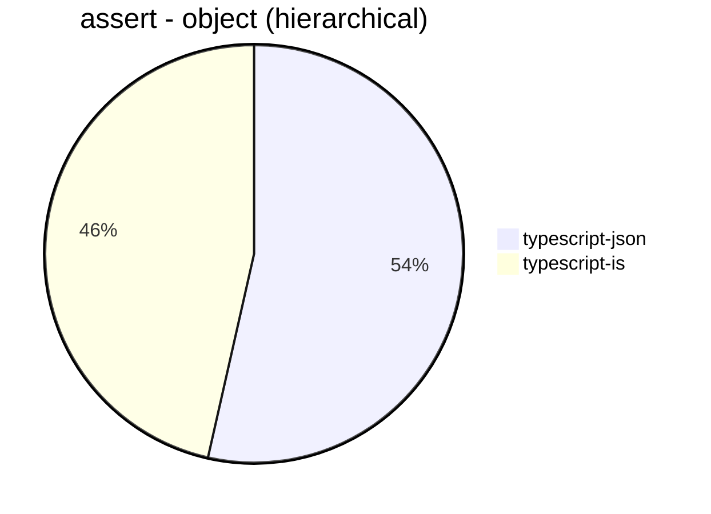
```mermaid
pie title assert - object (hierarchical)
  "typescript-json": 26326.989305782125
  "typescript-is": 22844.272612839417
```

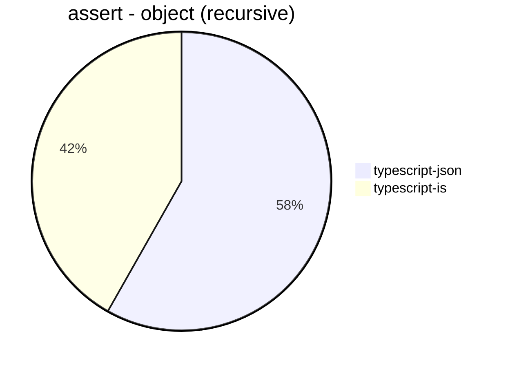
```mermaid
pie title assert - object (recursive)
  "typescript-json": 30070.360110803325
  "typescript-is": 21598.298334540188
```

```mermaid
pie title assert - object (union)
  "typescript-json": 4678.333333333333
  "typescript-is": 2178.7911690191822
```

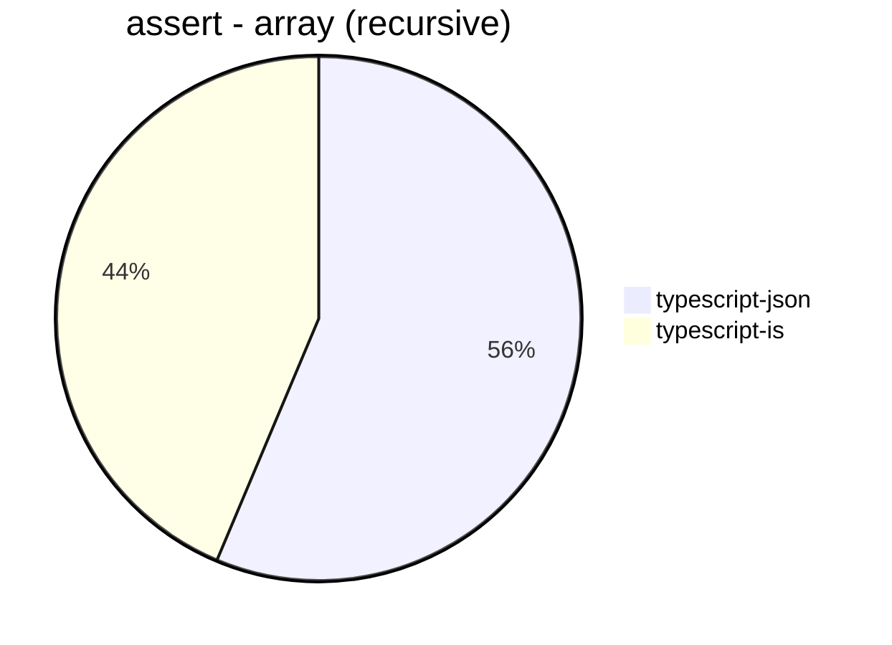
```mermaid
pie title assert - array (recursive)
  "typescript-json": 1938.689604685212
  "typescript-is": 1502.211573903428
```

```mermaid
pie title assert - array (union)
  "typescript-json": 2970.4549574043863
  "typescript-is": 219.35601902671056
```

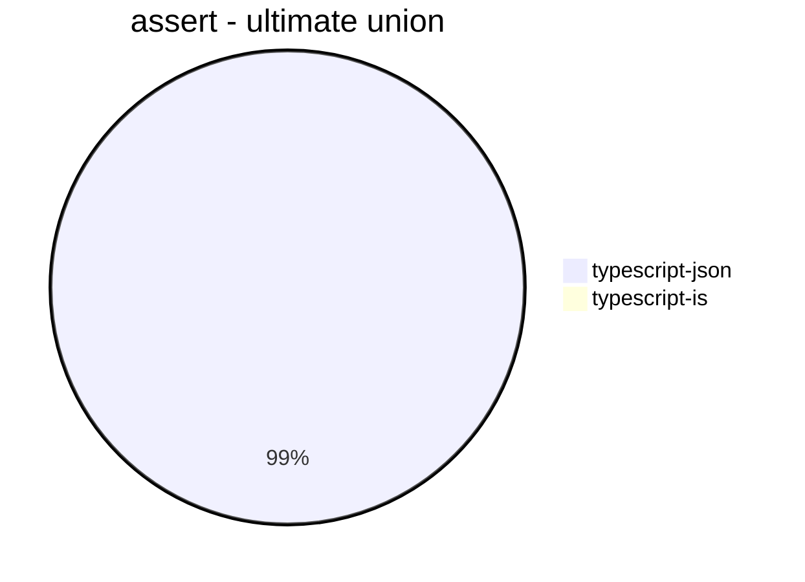
```mermaid
pie title assert - ultimate union
  "typescript-json": 4322.764976958525
  "typescript-is": 31.748878923766814
```

## is
 Components | typescript-json | typescript-is | ajv 
------------|-----------------|---------------|-----
object (hierarchical) | 91116.31814787154 | 45918.477251624885 | 56724.981738495255
object (recursive) | 65181.15807112269 | 31161.945483698553 | Failed
object (union, explicit) | 12992.69939770031 | Failed | 1370.4635285662955
object (union, implicit) | 14246.09446792869 | Failed | Failed
array (recursive) | 4358.233979135618 | 3174.7427502338637 | Failed
array (union, explicit) | 5461.253309796999 | 998.4022723238062 | Failed
array (union, implicit) | 5205.17594488922 | 1087.0264474624732 | Failed
ultimate union | 10380.880408086152 | 305.7971014492754 | Failed

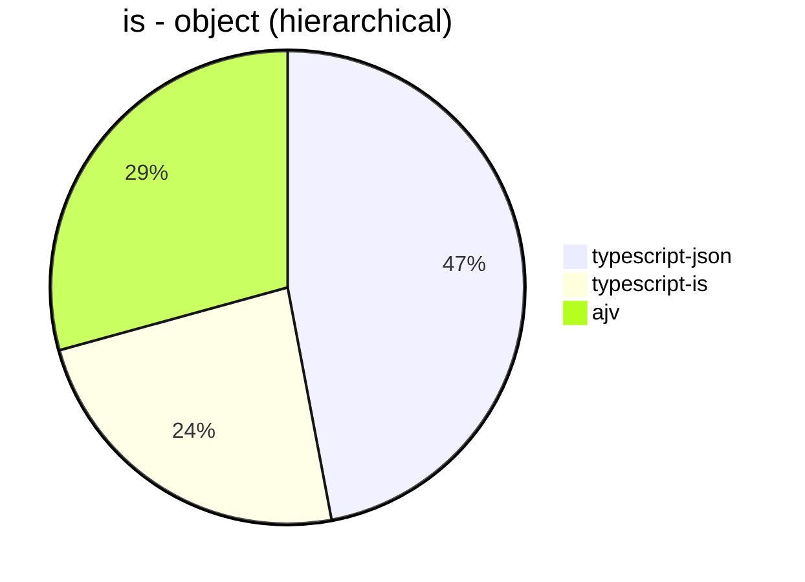
```mermaid
pie title is - object (hierarchical)
  "typescript-json": 91116.31814787154
  "typescript-is": 45918.477251624885
  "ajv": 56724.981738495255
```

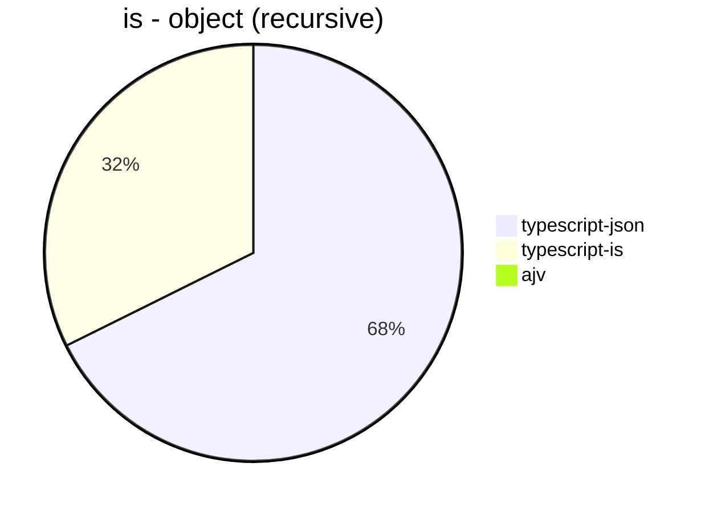
```mermaid
pie title is - object (recursive)
  "typescript-json": 65181.15807112269
  "typescript-is": 31161.945483698553
  "ajv": 0
```

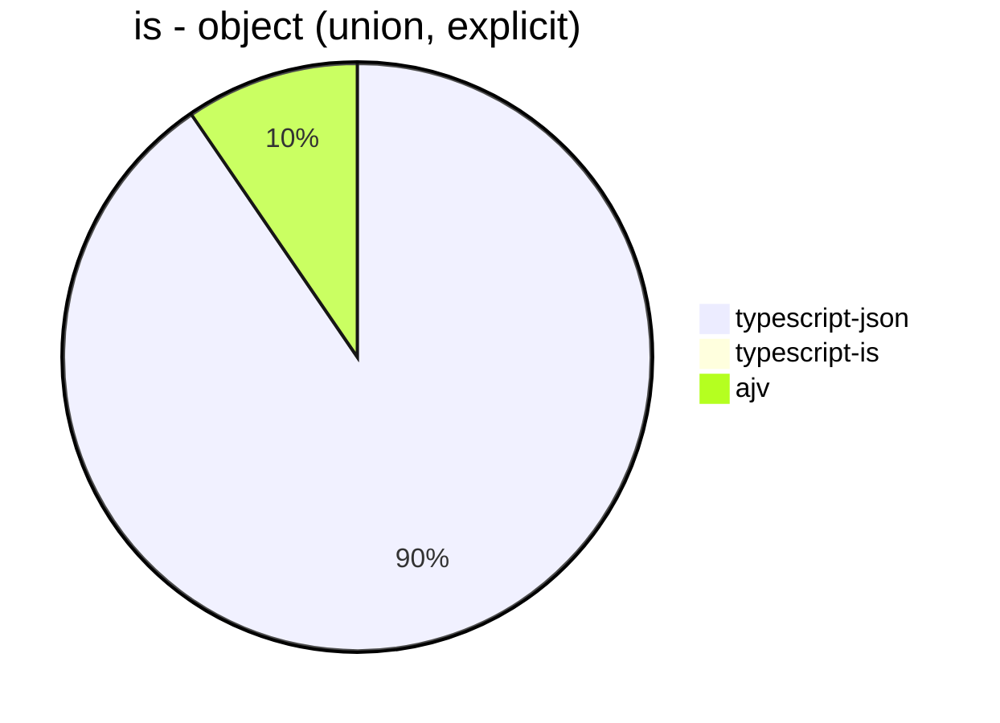
```mermaid
pie title is - object (union, explicit)
  "typescript-json": 12992.69939770031
  "typescript-is": 0
  "ajv": 1370.4635285662955
```

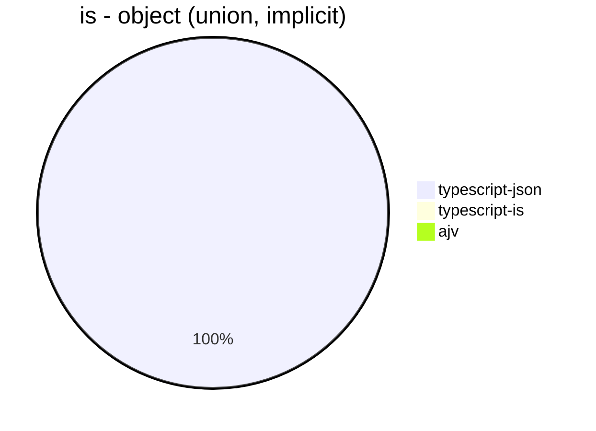
```mermaid
pie title is - object (union, implicit)
  "typescript-json": 14246.09446792869
  "typescript-is": 0
  "ajv": 0
```

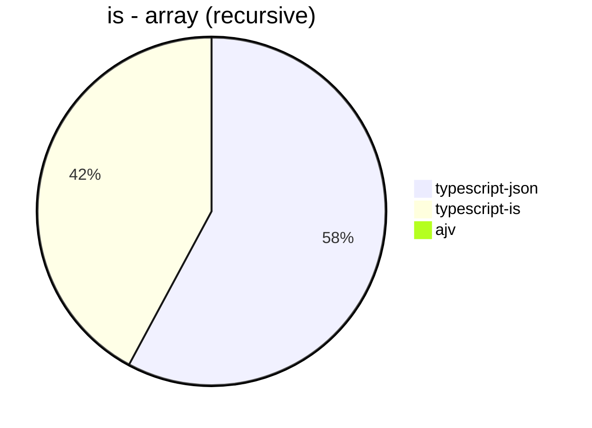
```mermaid
pie title is - array (recursive)
  "typescript-json": 4358.233979135618
  "typescript-is": 3174.7427502338637
  "ajv": 0
```

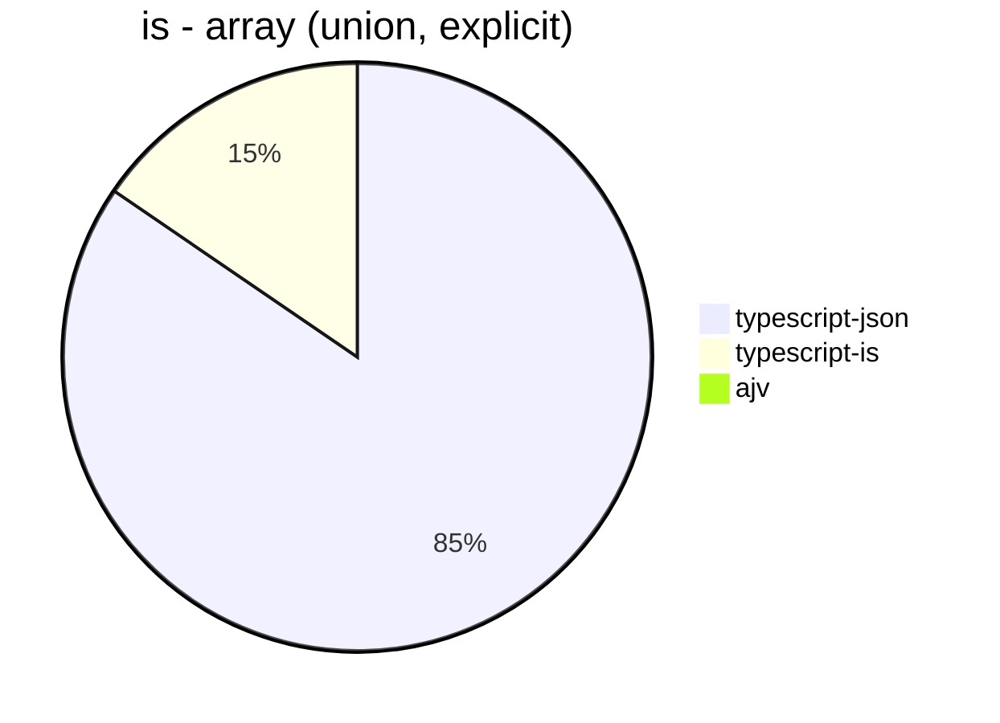
```mermaid
pie title is - array (union, explicit)
  "typescript-json": 5461.253309796999
  "typescript-is": 998.4022723238062
  "ajv": 0
```

```mermaid
pie title is - array (union, implicit)
  "typescript-json": 5205.17594488922
  "typescript-is": 1087.0264474624732
  "ajv": 0
```

```mermaid
pie title is - ultimate union
  "typescript-json": 10380.880408086152
  "typescript-is": 305.7971014492754
  "ajv": 0
```

## optimizer
 Components | typescript-json | fast-json-stringify | JSON.stringify() 
------------|-----------------|---------------------|------------------
object (simple) | 37382.573057733425 | 6.329113924050633 | 10412.5
object (hierarchical) | 5549.209302325581 | 1.6172506738544474 | 2394.562821454813
object (recursive) | 4835.084427767354 | 63.05976969475416 | 2126.5633750233337
object (union) | 2044.968268359021 | 1.0899182561307903 | 1435.9259259259259
array (hierarchical) | 103.69422092172641 | 2.767017155506364 | 81.7790530846485
array (recursive) | 253.34323922734026 | 52.272319022813 | 207.1559633027523
array (union) | 400.65323897659226 | 3.1301786043085986 | 399.88988805285373
ultimate union | 1385.1974898486526 | Failed | 325.8241758241758

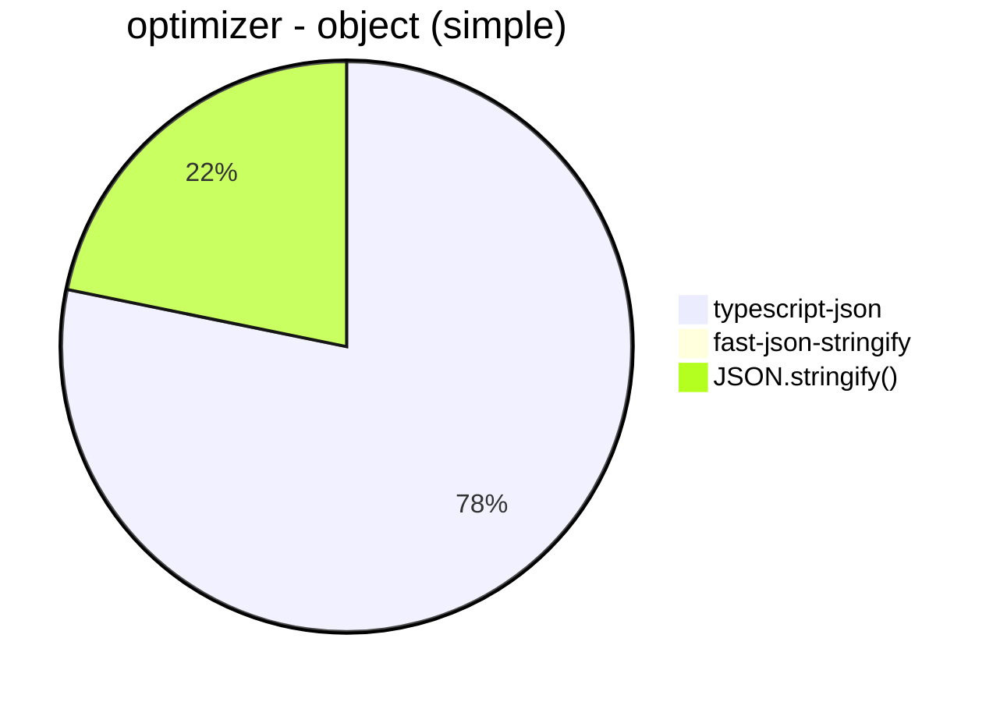
```mermaid
pie title optimizer - object (simple)
  "typescript-json": 37382.573057733425
  "fast-json-stringify": 6.329113924050633
  "JSON.stringify()": 10412.5
```

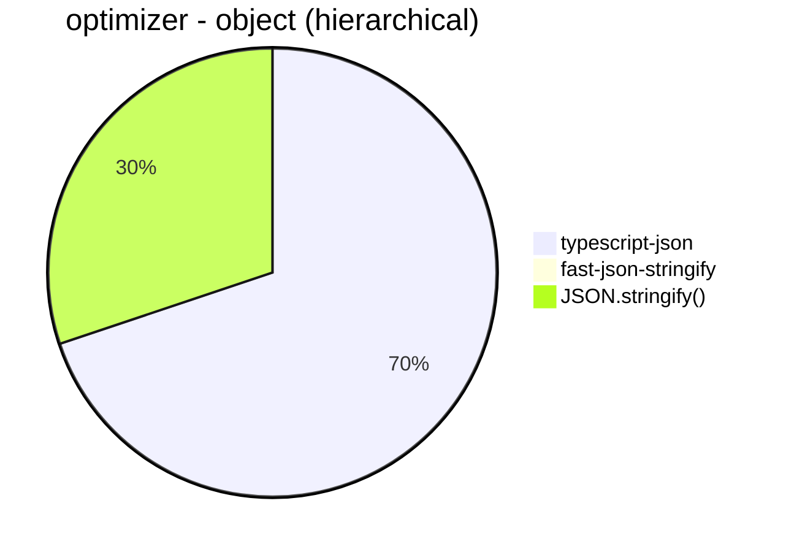
```mermaid
pie title optimizer - object (hierarchical)
  "typescript-json": 5549.209302325581
  "fast-json-stringify": 1.6172506738544474
  "JSON.stringify()": 2394.562821454813
```

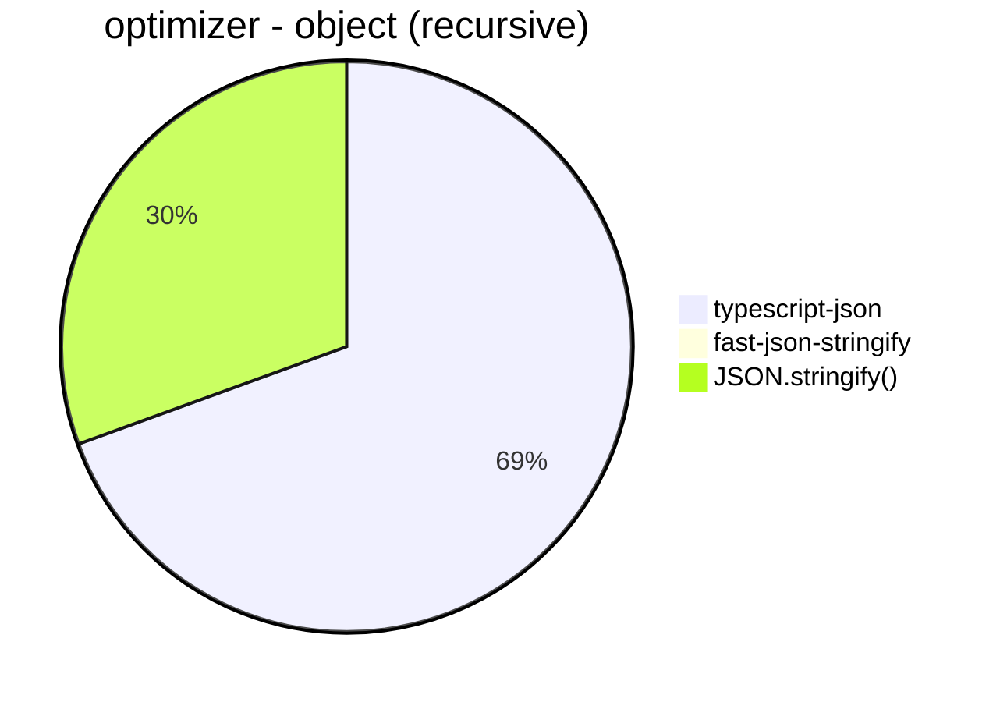
```mermaid
pie title optimizer - object (recursive)
  "typescript-json": 4835.084427767354
  "fast-json-stringify": 63.05976969475416
  "JSON.stringify()": 2126.5633750233337
```

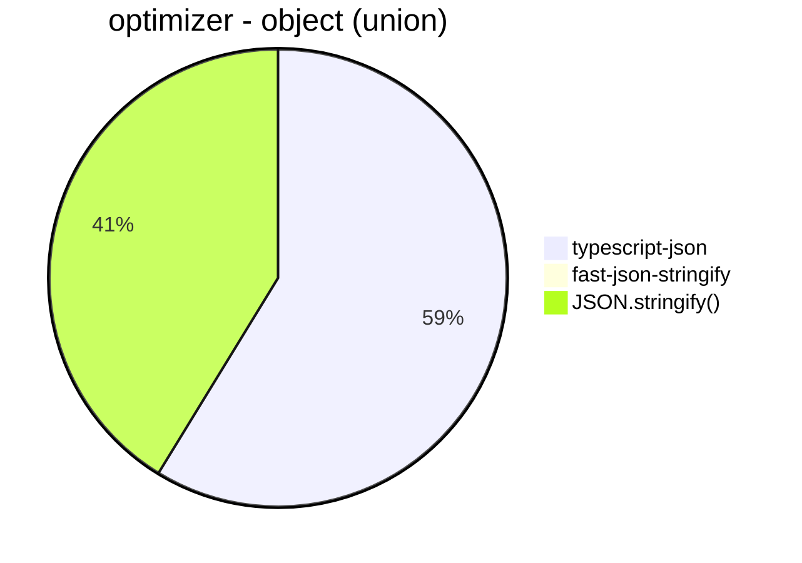
```mermaid
pie title optimizer - object (union)
  "typescript-json": 2044.968268359021
  "fast-json-stringify": 1.0899182561307903
  "JSON.stringify()": 1435.9259259259259
```

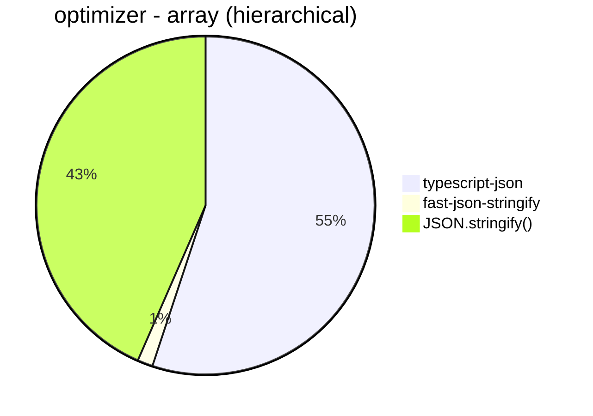
```mermaid
pie title optimizer - array (hierarchical)
  "typescript-json": 103.69422092172641
  "fast-json-stringify": 2.767017155506364
  "JSON.stringify()": 81.7790530846485
```

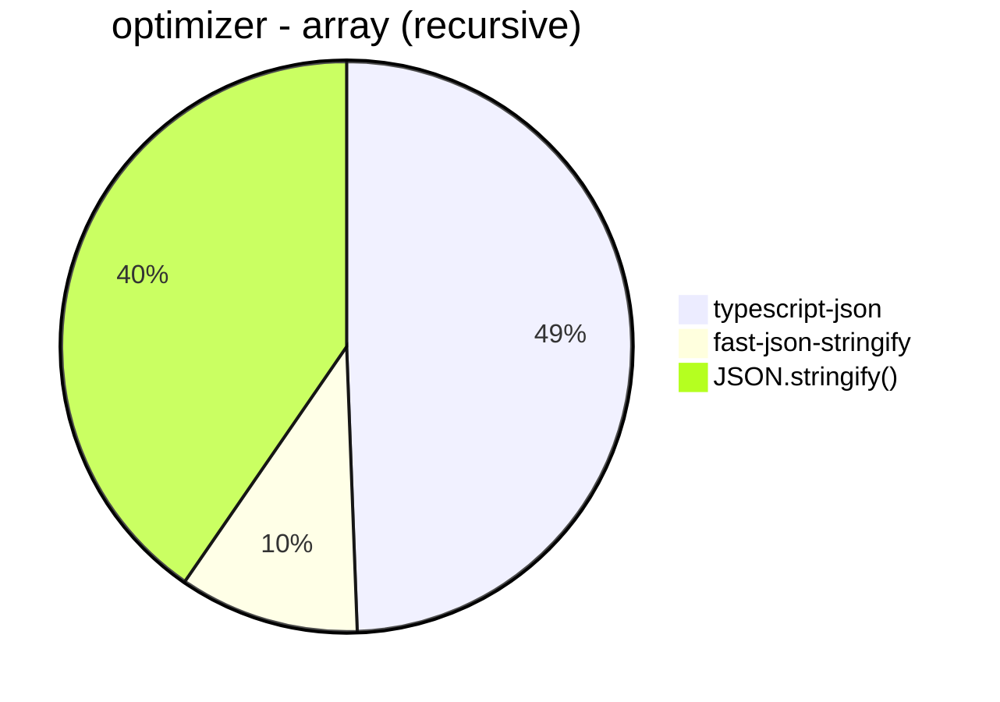
```mermaid
pie title optimizer - array (recursive)
  "typescript-json": 253.34323922734026
  "fast-json-stringify": 52.272319022813
  "JSON.stringify()": 207.1559633027523
```

```mermaid
pie title optimizer - array (union)
  "typescript-json": 400.65323897659226
  "fast-json-stringify": 3.1301786043085986
  "JSON.stringify()": 399.88988805285373
```

```mermaid
pie title optimizer - ultimate union
  "typescript-json": 1385.1974898486526
  "fast-json-stringify": 0
  "JSON.stringify()": 325.8241758241758
```

## stringify
 Components | typescript-json | fast-json-stringify | JSON.stringify() 
------------|-----------------|---------------------|------------------
object (simple) | 40660.65573770492 | 29123.851525174567 | 10140.028797696184
object (hierarchical) | 5845.637583892618 | 5143.496153157988 | 2468.3287165281627
object (recursive) | 4972.485103399929 | 2090.8755079423718 | 1981.376666058061
object (union) | 2136.181818181818 | 1579.101205699671 | 1404.705882352941
array (hierarchical) | 135.8645077238042 | 177.58498583569406 | 105.26315789473685
array (recursive) | 254.052085230377 | 212.68586485977792 | 207.83022319795097
array (union) | 392.99610894941634 | 358.5253456221198 | 408.65384615384613
ultimate union | 1382.6714801444043 | Failed | 322.44525547445255

```mermaid
pie title stringify - object (simple)
  "typescript-json": 40660.65573770492
  "fast-json-stringify": 29123.851525174567
  "JSON.stringify()": 10140.028797696184
```

```mermaid
pie title stringify - object (hierarchical)
  "typescript-json": 5845.637583892618
  "fast-json-stringify": 5143.496153157988
  "JSON.stringify()": 2468.3287165281627
```

```mermaid
pie title stringify - object (recursive)
  "typescript-json": 4972.485103399929
  "fast-json-stringify": 2090.8755079423718
  "JSON.stringify()": 1981.376666058061
```

```mermaid
pie title stringify - object (union)
  "typescript-json": 2136.181818181818
  "fast-json-stringify": 1579.101205699671
  "JSON.stringify()": 1404.705882352941
```

```mermaid
pie title stringify - array (hierarchical)
  "typescript-json": 135.8645077238042
  "fast-json-stringify": 177.58498583569406
  "JSON.stringify()": 105.26315789473685
```

```mermaid
pie title stringify - array (recursive)
  "typescript-json": 254.052085230377
  "fast-json-stringify": 212.68586485977792
  "JSON.stringify()": 207.83022319795097
```

```mermaid
pie title stringify - array (union)
  "typescript-json": 392.99610894941634
  "fast-json-stringify": 358.5253456221198
  "JSON.stringify()": 408.65384615384613
```

```mermaid
pie title stringify - ultimate union
  "typescript-json": 1382.6714801444043
  "fast-json-stringify": 0
  "JSON.stringify()": 322.44525547445255
```

