# Benchmark of `typescript-json`
> CPU: Apple M1 Pro
> Memory: 16,384 MB

## assert
 Components | typescript-json | typescript-is 
------------|-----------------|---------------
object (hierarchical) | 30499.542375983892 | 27254.499181966912
object (recursive) | 33053.629469122425 | 21018.731454005934
object (union) | 6114.985163204748 | 2914.5267791636097
array (recursive) | 1590.797661700924 | 1898.8418385812524
array (union) | 3881.35593220339 | 297.8684971098266
ultimate union | 5171.433843882635 | 46.68125455871627

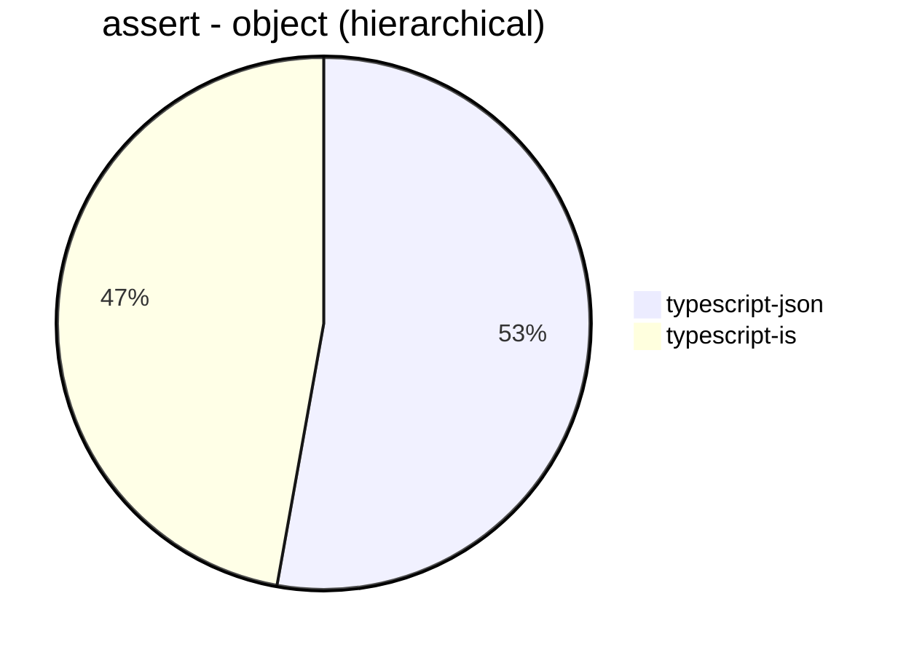
```mermaid
pie title assert - object (hierarchical)
  "typescript-json": 30499.542375983892
  "typescript-is": 27254.499181966912
```

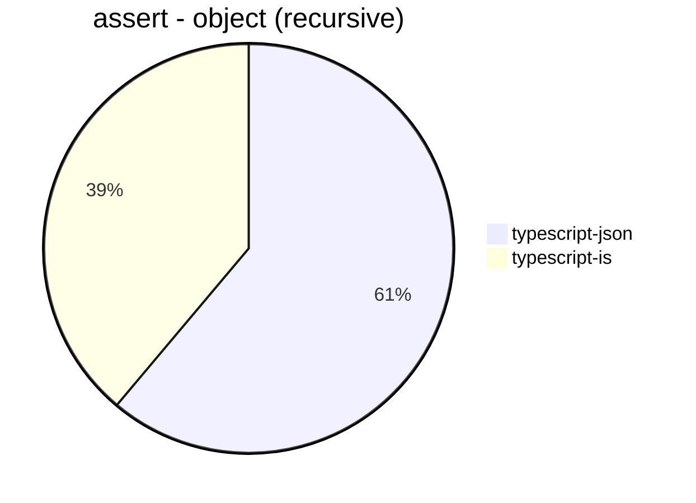
```mermaid
pie title assert - object (recursive)
  "typescript-json": 33053.629469122425
  "typescript-is": 21018.731454005934
```

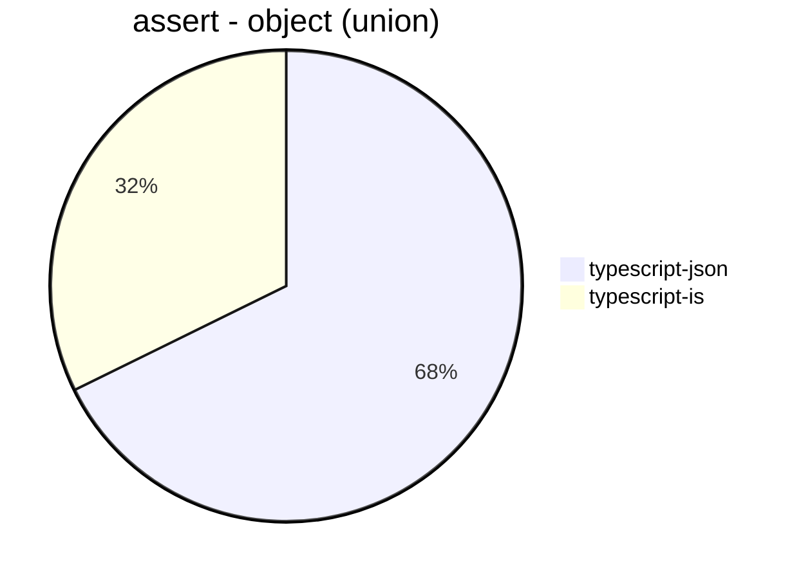
```mermaid
pie title assert - object (union)
  "typescript-json": 6114.985163204748
  "typescript-is": 2914.5267791636097
```

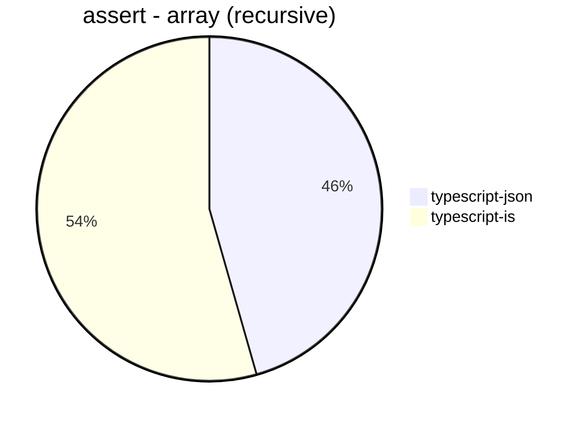
```mermaid
pie title assert - array (recursive)
  "typescript-json": 1590.797661700924
  "typescript-is": 1898.8418385812524
```

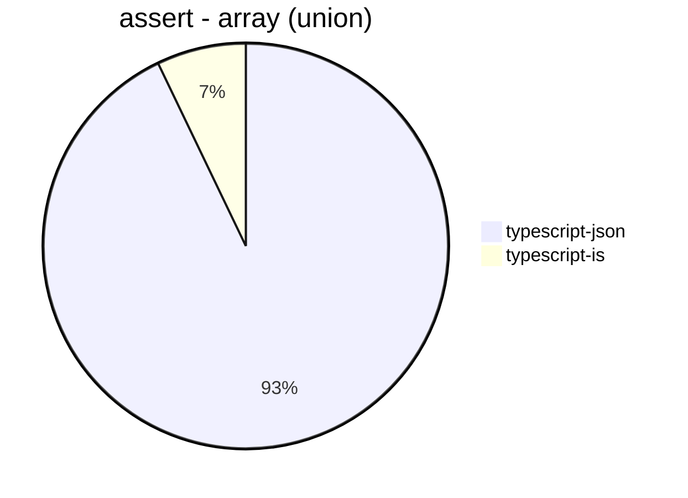
```mermaid
pie title assert - array (union)
  "typescript-json": 3881.35593220339
  "typescript-is": 297.8684971098266
```

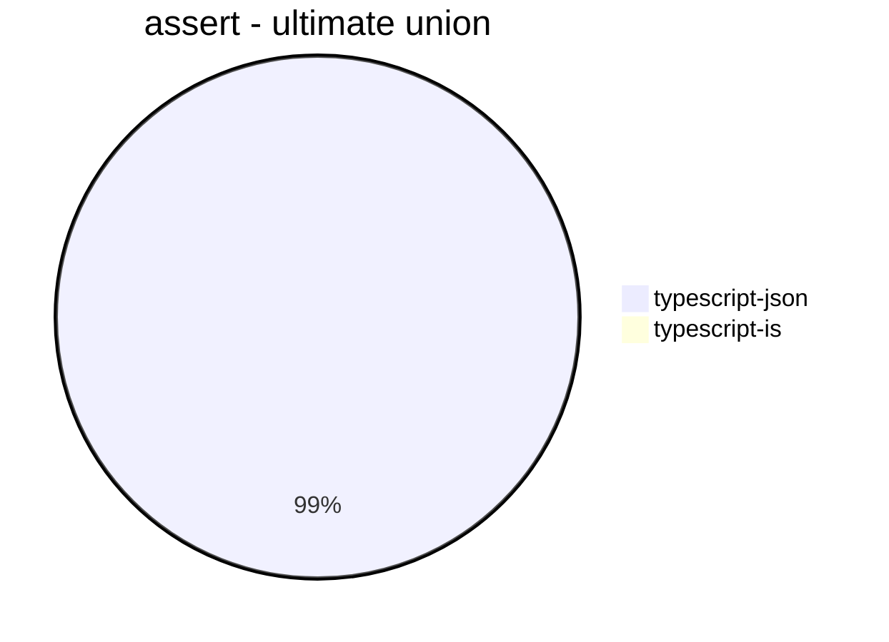
```mermaid
pie title assert - ultimate union
  "typescript-json": 5171.433843882635
  "typescript-is": 46.68125455871627
```

## is
 Components | typescript-json | typescript-is | ajv 
------------|-----------------|---------------|-----
object (hierarchical) | 112855.90933621155 | 59421.48760330579 | 96401.78239881173
object (recursive) | 67825.41720154043 | 50168.80939072107 | Failed
object (union, explicit) | 17897.411675798223 | Failed | 1465.8775661179952
object (union, implicit) | 17127.305936073062 | Failed | Failed
array (recursive) | 6059.314179796108 | 4935.747446610956 | Failed
array (union, explicit) | 6832.766439909297 | 1292.9111191075926 | Failed
array (union, implicit) | 7282.303902993559 | 1369.85559566787 | Failed
ultimate union | 11680.754716981133 | 381.14233907524937 | Failed

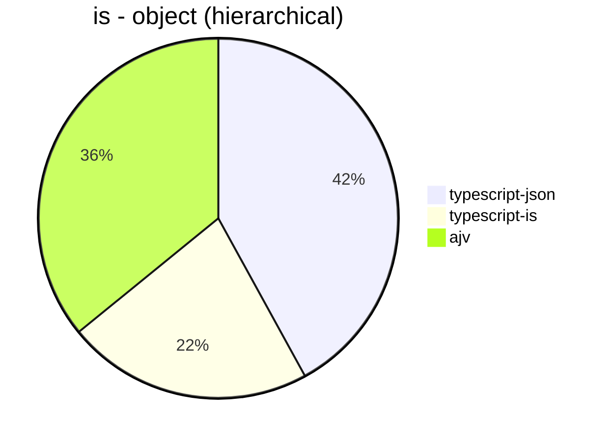
```mermaid
pie title is - object (hierarchical)
  "typescript-json": 112855.90933621155
  "typescript-is": 59421.48760330579
  "ajv": 96401.78239881173
```

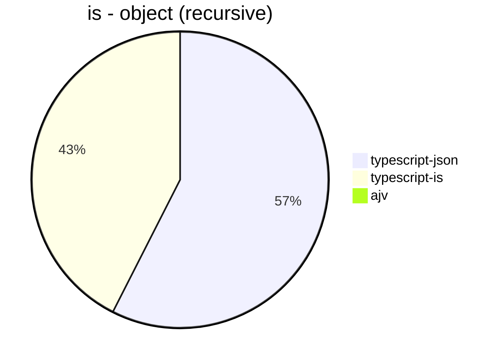
```mermaid
pie title is - object (recursive)
  "typescript-json": 67825.41720154043
  "typescript-is": 50168.80939072107
  "ajv": 0
```

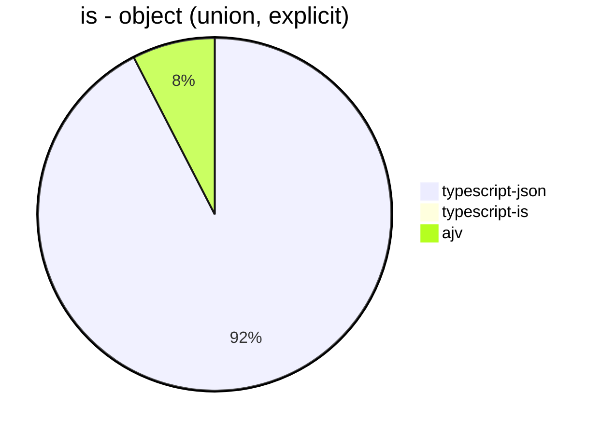
```mermaid
pie title is - object (union, explicit)
  "typescript-json": 17897.411675798223
  "typescript-is": 0
  "ajv": 1465.8775661179952
```

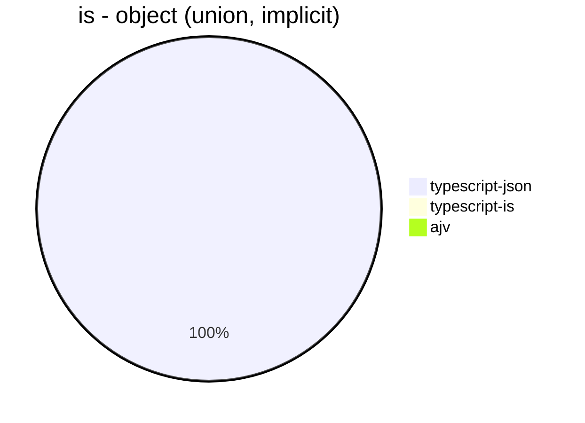
```mermaid
pie title is - object (union, implicit)
  "typescript-json": 17127.305936073062
  "typescript-is": 0
  "ajv": 0
```

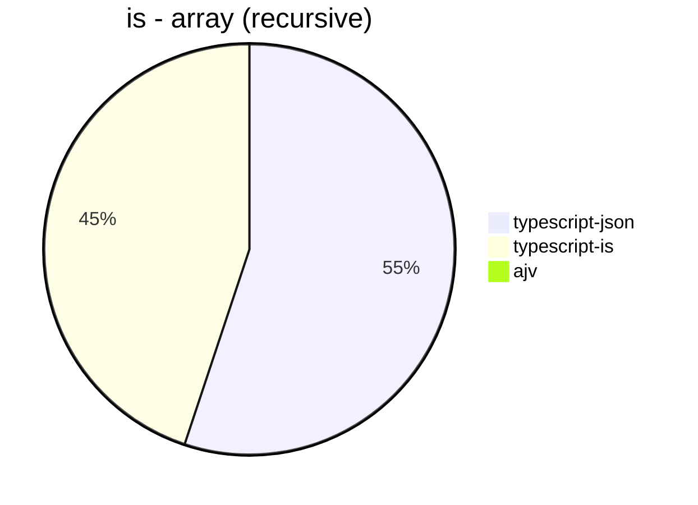
```mermaid
pie title is - array (recursive)
  "typescript-json": 6059.314179796108
  "typescript-is": 4935.747446610956
  "ajv": 0
```

```mermaid
pie title is - array (union, explicit)
  "typescript-json": 6832.766439909297
  "typescript-is": 1292.9111191075926
  "ajv": 0
```

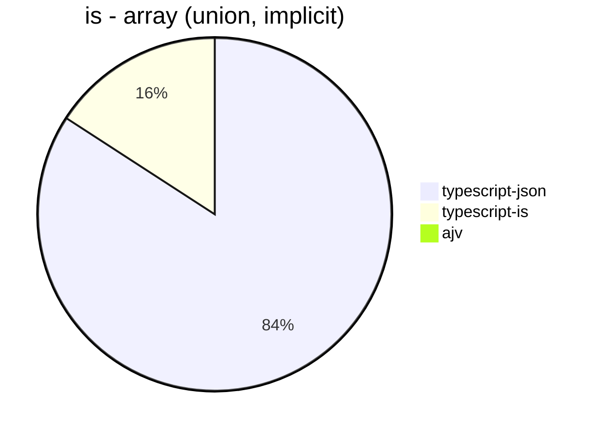
```mermaid
pie title is - array (union, implicit)
  "typescript-json": 7282.303902993559
  "typescript-is": 1369.85559566787
  "ajv": 0
```

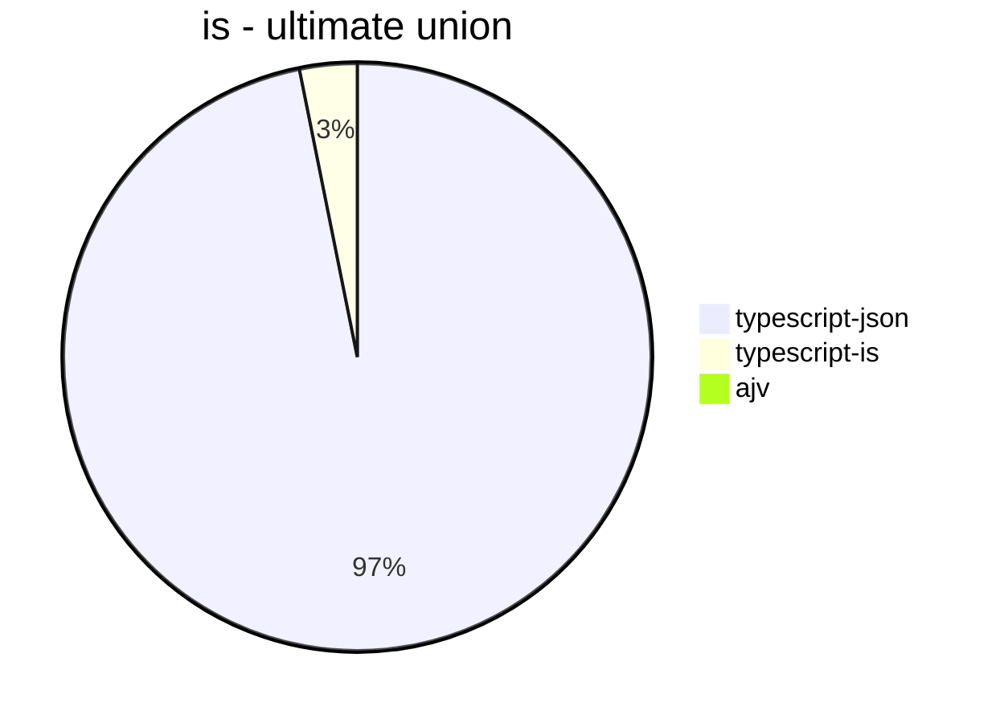
```mermaid
pie title is - ultimate union
  "typescript-json": 11680.754716981133
  "typescript-is": 381.14233907524937
  "ajv": 0
```

## optimizer
 Components | typescript-json | fast-json-stringify | JSON.stringify() 
------------|-----------------|---------------------|------------------
object (simple) | 50703.53330879647 | 9.645738337425465 | 15818.349640022154
object (hierarchical) | 6922.934762520791 | 2.1881838074398248 | 3416.963115521438
object (recursive) | 5613.948380010983 | 81.92552225249773 | 2873.275236020334
object (union) | 2741.5668202764978 | 1.6866566716641678 | 1906.6140548665915
array (hierarchical) | 138.44456701599557 | 4.15016034710432 | 119.1632424355622
array (recursive) | 320.15167930660886 | 70.18867924528303 | 273.22604242867595
array (union) | 495.08733624454146 | 2.93470286133529 | 553.1190926275992
ultimate union | 1495.1295717698954 | Failed | 400.87104715016096

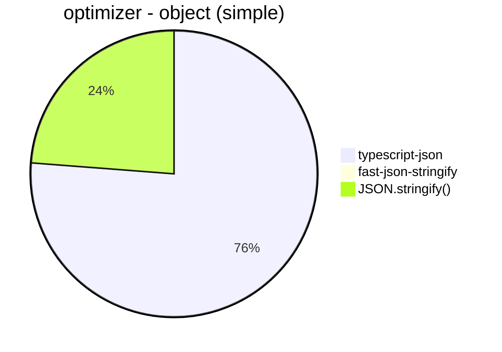
```mermaid
pie title optimizer - object (simple)
  "typescript-json": 50703.53330879647
  "fast-json-stringify": 9.645738337425465
  "JSON.stringify()": 15818.349640022154
```

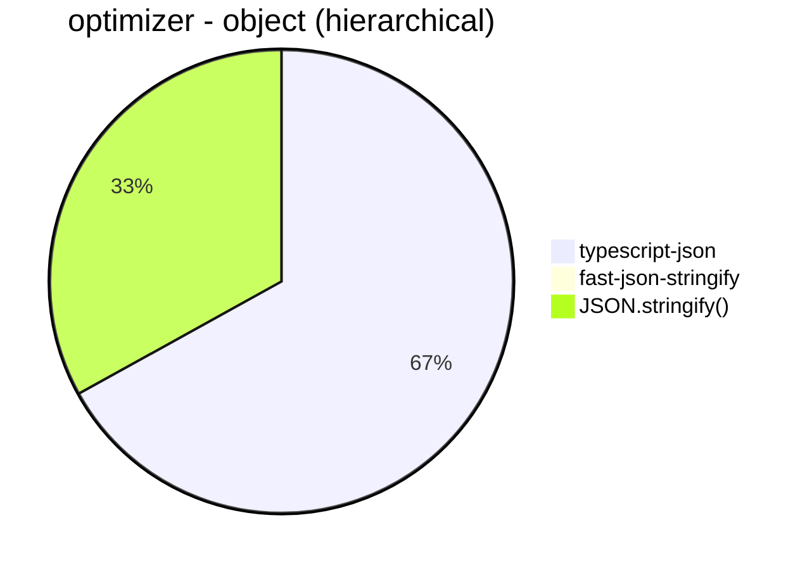
```mermaid
pie title optimizer - object (hierarchical)
  "typescript-json": 6922.934762520791
  "fast-json-stringify": 2.1881838074398248
  "JSON.stringify()": 3416.963115521438
```

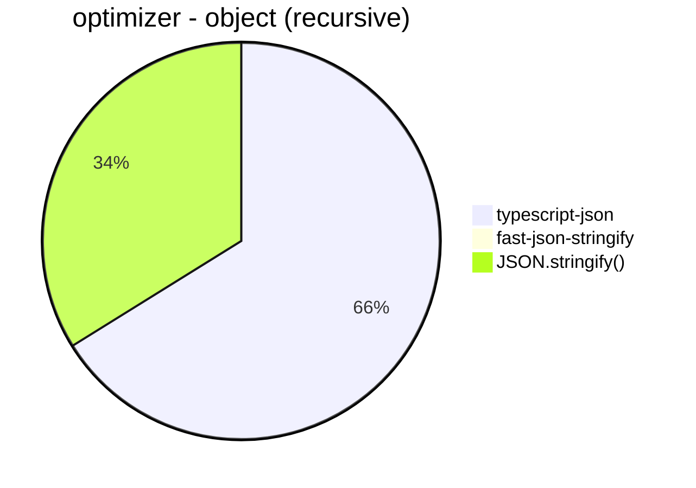
```mermaid
pie title optimizer - object (recursive)
  "typescript-json": 5613.948380010983
  "fast-json-stringify": 81.92552225249773
  "JSON.stringify()": 2873.275236020334
```

```mermaid
pie title optimizer - object (union)
  "typescript-json": 2741.5668202764978
  "fast-json-stringify": 1.6866566716641678
  "JSON.stringify()": 1906.6140548665915
```

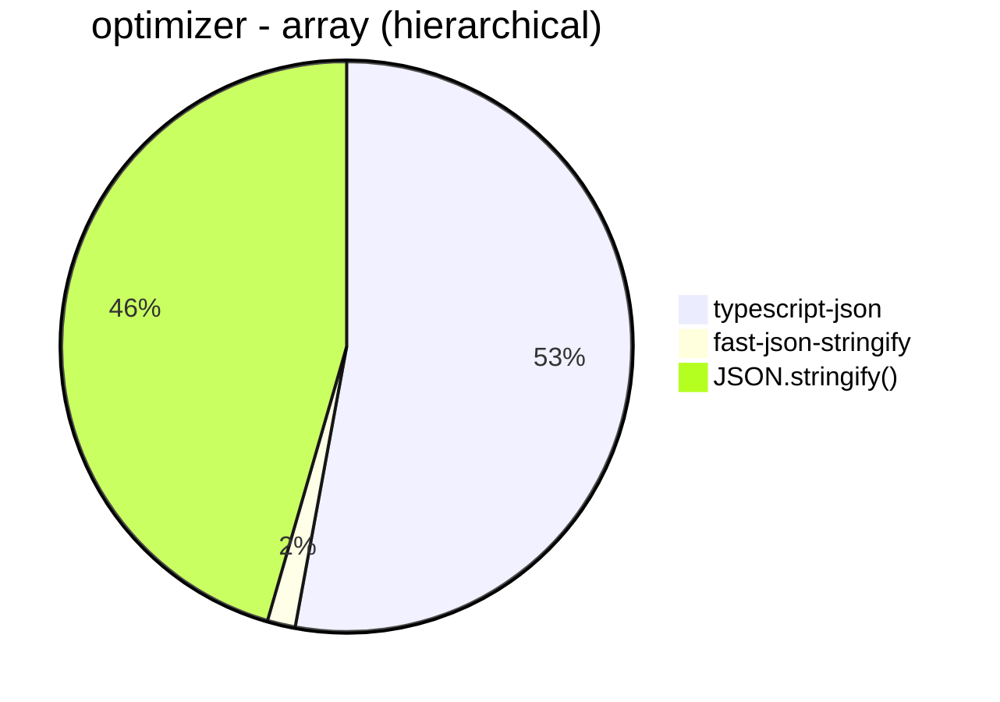
```mermaid
pie title optimizer - array (hierarchical)
  "typescript-json": 138.44456701599557
  "fast-json-stringify": 4.15016034710432
  "JSON.stringify()": 119.1632424355622
```

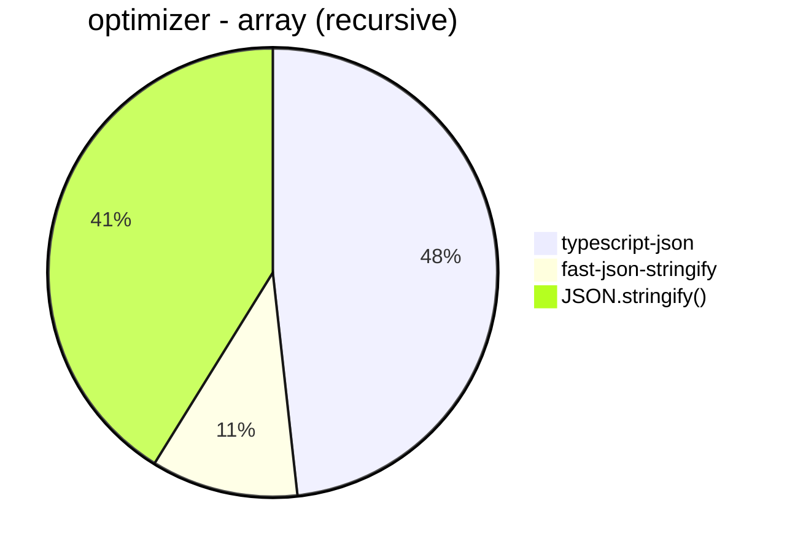
```mermaid
pie title optimizer - array (recursive)
  "typescript-json": 320.15167930660886
  "fast-json-stringify": 70.18867924528303
  "JSON.stringify()": 273.22604242867595
```

```mermaid
pie title optimizer - array (union)
  "typescript-json": 495.08733624454146
  "fast-json-stringify": 2.93470286133529
  "JSON.stringify()": 553.1190926275992
```

```mermaid
pie title optimizer - ultimate union
  "typescript-json": 1495.1295717698954
  "fast-json-stringify": 0
  "JSON.stringify()": 400.87104715016096
```

## stringify
 Components | typescript-json | fast-json-stringify | JSON.stringify() 
------------|-----------------|---------------------|------------------
object (simple) | 51601.86539868325 | 41894.29530201342 | 14885.168334849863
object (hierarchical) | 7339.7067013179885 | 7007.284647605173 | 3402.7620128641697
object (recursive) | 6316.177826969193 | 2951.2013410318496 | 2917.5201170446235
object (union) | 2794.2379182156133 | 2127.926267281106 | 1967.7538234752167
array (hierarchical) | 122.77482106808588 | 175.92420583317852 | 104.40878066777347
array (recursive) | 332.96005972377753 | 280.71495766698024 | 278.6703601108033
array (union) | 495.30516431924883 | 483.5226214857568 | 541.4911155889357
ultimate union | 1494.7792636013924 | Failed | 397.8534418948927

```mermaid
pie title stringify - object (simple)
  "typescript-json": 51601.86539868325
  "fast-json-stringify": 41894.29530201342
  "JSON.stringify()": 14885.168334849863
```

```mermaid
pie title stringify - object (hierarchical)
  "typescript-json": 7339.7067013179885
  "fast-json-stringify": 7007.284647605173
  "JSON.stringify()": 3402.7620128641697
```

```mermaid
pie title stringify - object (recursive)
  "typescript-json": 6316.177826969193
  "fast-json-stringify": 2951.2013410318496
  "JSON.stringify()": 2917.5201170446235
```

```mermaid
pie title stringify - object (union)
  "typescript-json": 2794.2379182156133
  "fast-json-stringify": 2127.926267281106
  "JSON.stringify()": 1967.7538234752167
```

```mermaid
pie title stringify - array (hierarchical)
  "typescript-json": 122.77482106808588
  "fast-json-stringify": 175.92420583317852
  "JSON.stringify()": 104.40878066777347
```

```mermaid
pie title stringify - array (recursive)
  "typescript-json": 332.96005972377753
  "fast-json-stringify": 280.71495766698024
  "JSON.stringify()": 278.6703601108033
```

```mermaid
pie title stringify - array (union)
  "typescript-json": 495.30516431924883
  "fast-json-stringify": 483.5226214857568
  "JSON.stringify()": 541.4911155889357
```

```mermaid
pie title stringify - ultimate union
  "typescript-json": 1494.7792636013924
  "fast-json-stringify": 0
  "JSON.stringify()": 397.8534418948927
```

