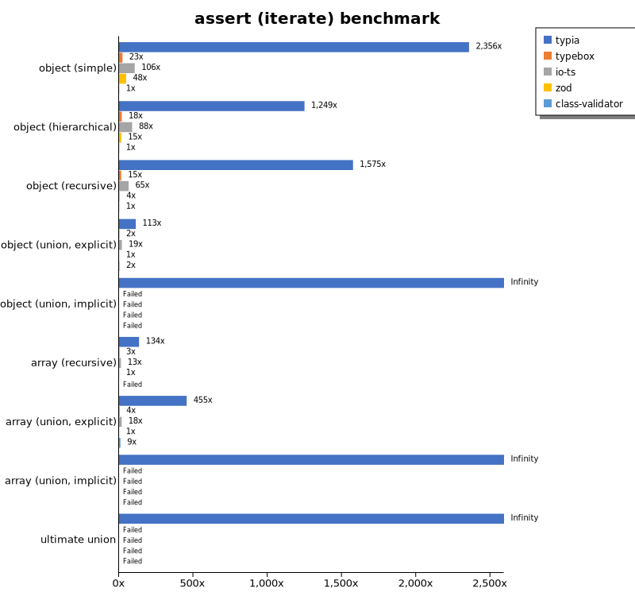
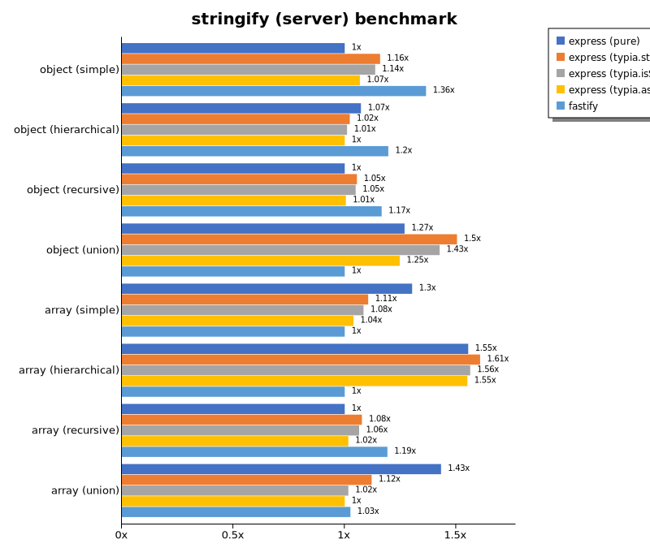

# Benchmark of `typia`
> - CPU: Apple M1 Pro
> - Memory: 16,384 MB
> - OS: darwin
> - Typia version: 3.6.7

## is

 Components | typia | typebox | ajv | io-ts | zod | class-validator 
------------|-------|---------|-----|-------|-----|-----------------
object (simple) | 210611.0010265213 | 52450.052300506315 | 62165.4135747631 | 4419.036550379728 | 984.494973039442 | 19.422245043143015
object (hierarchical) | 178239.98360693324 | 125905.5344476413 | 62134.20078845521 | 8642.698712318675 | 742.210107261666 | 44.28088803088803
object (recursive) | 114792.98828486758 | 86112.78024941208 | 45912.39504333695 | 6462.361715204236 | 150.07068246729318 | 37.135193632470674
object (union, explicit) | 28182.71006208804 | 15191.5961270872 | 11905.046954278136 | 4100.518955675726 | 77.19497510238273 | 169.9554943647541
object (union, implicit) | 29714.221151901293 | Failed | Failed | Failed | Failed | Failed
array (recursive) | 85490.57530931298 | 78375.61836946495 | 30267.617187500004 | 6572.084527114839 | 191.21451557873797 | 37.59361783364662
array (union, explicit) | 28353.348691239316 | 12253.111382014355 | 7625.010876879525 | 2962.658405563623 | 43.246565193965516 | 395.2361643424456
array (union, implicit) | 19142.47986604638 | Failed | Failed | Failed | Failed | Failed
ultimate union | 10099.86473434081 | Failed | Failed | Failed | Failed | Failed

 Unit: kilobytes/sec 

## assert (iterate)

 Components | typia | typebox | io-ts | zod | class-validator 
------------|-------|---------|-------|-----|-----------------
object (simple) | 44961.81383682823 | 439.9830876883021 | 2014.1506732554265 | 909.8080509315465 | 19.080283399891087
object (hierarchical) | 55867.77142025544 | 827.6448845756158 | 3933.9083078551266 | 681.5072426265352 | 44.74550343037271
object (recursive) | 59013.08338809826 | 543.8987476847453 | 2423.120175348177 | 152.95168983900075 | 37.460141795926
object (union, explicit) | 9012.69403499346 | 189.49562458428355 | 1505.0027254579343 | 80.04140654671477 | 171.45691143523652
object (union, implicit) | 9903.293615876162 | Failed | Failed | Failed | Failed
array (recursive) | 26026.035917954378 | 541.5604343720491 | 2438.7051196808507 | 193.53234413031268 | Failed
array (union, explicit) | 19477.178673235238 | 163.74176712902624 | 759.1942951547078 | 42.77325615134633 | 398.4334524538433
array (union, implicit) | 14015.933960731527 | Failed | Failed | Failed | Failed
ultimate union | 4916.2465044420915 | Failed | Failed | Failed | Failed

 Unit: kilobytes/sec 

## assert (throw)

 Components | typia | typebox | io-ts | zod | class-validator 
------------|-------|---------|-------|-----|-----------------
object (simple) | 10426.323805199094 | 435.3522211034095 | 1951.9892572617034 | Failed | 21.06148447743023
object (hierarchical) | 36997.2082450565 | 841.0418855042017 | 3892.4714090068296 | 691.4916325136611 | 46.309450478900615
object (recursive) | 7960.927363299353 | Failed | Failed | Failed | 159.03970743433396
object (union, explicit) | 7918.4909524033055 | 175.72890494137351 | 1516.6771685371887 | 78.79095475028164 | 178.35122898564413
object (union, implicit) | 8505.743416154848 | Failed | Failed | Failed | Failed
array (recursive) | 16516.25149138377 | 612.5678427511939 | 1898.7394207273676 | 201.8167112041576 | 133.47819948517053
array (union, explicit) | 5572.6986274203255 | 247.85204697466335 | 654.6597496841072 | 106.62171898818598 | 388.9370583294717
array (union, implicit) | 2654.4769913139903 | Failed | Failed | Failed | Failed
ultimate union | 5094.600378479333 | Failed | Failed | Failed | Failed

 Unit: kilobytes/sec 

## validate

 Components | typia | typebox | io-ts | zod | class-validator 
------------|-------|---------|-------|-----|-----------------
object (simple) | 13241.554243411976 | 431.24678572254066 | 2030.059814453125 | 896.4353463862449 | 19.4140625
object (hierarchical) | 33681.61072843508 | 858.1991994927948 | 3832.9791795514934 | 691.9666480479774 | 44.43993506493507
object (recursive) | 30549.675848122908 | 519.69443537859 | 2389.6768016314463 | 158.14920888684753 | 36.90080992769744
object (union, explicit) | 7054.634506862523 | 192.12309041007813 | 1528.250872954289 | 77.1163525538142 | 175.93910230146093
object (union, implicit) | 7964.355288638879 | 250.4595588235294 | 637.7804410925011 | 55.59974687736563 | Failed
array (recursive) | 16431.184847679364 | 581.7463653154007 | 2468.639896450411 | 207.96080033509534 | 37.80391775198188
array (union, explicit) | 14949.844051696395 | 174.48138109410434 | 772.7862720020034 | 43.01078203605366 | 399.273616745943
array (union, implicit) | 10949.71191768208 | 153.0817205255682 | 688.6069064156569 | 35.611155530117074 | Failed
ultimate union | 3728.3129050819894 | Failed | Failed | Failed | Failed

 Unit: kilobytes/sec 

## equals

 Components | typia | typebox 
------------|-------|---------
object (simple) | 19868.615910117434 | 7127.383521715913
object (hierarchical) | 42793.75072071033 | 15879.346511199356
object (recursive) | 35827.42183825259 | 12255.454095198751
object (union, explicit) | 11883.417488830977 | 4035.991429570895
object (union, implicit) | 3937.5010868809127 | 3752.9591480446925
array (recursive) | 25448.98339861966 | 10586.644359075694
array (union, explicit) | 20154.7194065746 | 4918.152763429752
array (union, implicit) | 14111.910191702165 | 4264.793410224729
ultimate union | 5717.597783667288 | Failed

 Unit: kilobytes/sec 

## assertEquals (iterate)

 Components | typia | typebox 
------------|-------|---------
object (simple) | 12773.65030803737 | 368.8364378723701
object (hierarchical) | 29587.22854275663 | 696.4325435754699
object (recursive) | 28826.034060200094 | 468.64153322843384
object (union, explicit) | 6561.454460966543 | 147.58237822349568
object (union, implicit) | 2909.686040117018 | 138.16193128185765
array (recursive) | 17955.023024614442 | 507.68651584139633
array (union, explicit) | 16463.82809577254 | 144.22044934172868
array (union, implicit) | 10460.403311965812 | 81.08750234653652
ultimate union | 3957.3840027700826 | Failed

 Unit: kilobytes/sec 

## assertEquals (throw)

 Components | typia | typebox 
------------|-------|---------
object (simple) | 6994.155107530036 | 334.0724123539232
object (hierarchical) | 24040.65505367455 | 647.2018789228355
object (recursive) | 22075.295269792652 | 460.9441545996592
object (union, explicit) | 5675.302167990395 | 137.3891657308628
object (union, implicit) | 2788.4389228303285 | 158.86951108305274
array (recursive) | 16563.009099795196 | 610.7647510641706
array (union, explicit) | 5180.344693811377 | 128.2962569406204
array (union, implicit) | 2520.929472557552 | 146.41367652453937
ultimate union | 4011.5963396587745 | Failed

 Unit: kilobytes/sec 

## validateEquals

 Components | typia | typebox 
------------|-------|---------
object (simple) | 7782.52265639125 | 348.0124735705093
object (hierarchical) | 19347.34152157807 | 692.4428104575163
object (recursive) | 18312.252331867872 | 446.73714496432495
object (union, explicit) | 4751.4124726030595 | 147.13727360239588
object (union, implicit) | 2408.0110760764783 | 145.69554870222476
array (recursive) | 11756.148793596605 | 509.1780085959885
array (union, explicit) | 13090.245072137475 | 147.5509158457072
array (union, implicit) | 9476.463667168675 | 81.3945939565628
ultimate union | 2760.0244834780456 | Failed

 Unit: kilobytes/sec 

## optimizer

 Components | typia | typebox | ajv 
------------|-------|---------|-----
object (hierarchical) | 161903.86614020896 | 183.06980129599418 | 7.189006427423675
object (recursive) | 108776.30656197567 | 1085.1114363568454 | 18.624636627906977
object (union) | 26113.887233197092 | 162.57718510754648 | 10.170977077232797
array (hierarchical) | 147591.97446463225 | 39603.59937608112 | 386.06082740514904
array (recursive) | 80670.24372178329 | 10204.009632194728 | 188.73518491056763
array (union) | 28302.743638270702 | 2021.6031983941707 | 75.89925805002765
ultimate union | 10144.106839058435 | 223.35946154911372 | 21.093177865250826

 Unit: kilobytes/sec 

## stringify

 Components | typia.stringify() | typia.assertStringify() | typia.isStringify() | fast-json-stringify | class-transformer | JSON.stringify 
------------|-------------------|-------------------------|---------------------|---------------------|-------------------|----------------
object (simple) | 6751.945885841364 | 5355.988768182655 | 5265.8153063079435 | 4743.732782369146 | 187.0199341623994 | 1919.3533529845247
object (hierarchical) | 6749.22203616496 | 6132.228065749953 | 6528.637845092026 | 7340.327489513041 | 372.46833240534517 | 2841.6350862873132
object (recursive) | 6749.389271608862 | 6086.089437626286 | 6377.772467226311 | 3176.1385068477252 | 324.94473871706225 | 3169.8485284207104
object (union) | 2405.140122086571 | 1888.1482162559766 | 2226.9815945246023 | 2592.2619047619046 | 113.74029933481154 | 1913.8772994500284
array (simple) | 2687.7359051958647 | 2434.608256646217 | 2684.8858900633268 | 3837.9334967614254 | Failed | 2679.266273717828
array (hierarchical) | 4010.4634299207087 | 3547.25193791713 | 3842.7689071488217 | 5766.47813080855 | 313.70611304780874 | 3301.8187787937195
array (recursive) | 3532.2519414929616 | 3110.356234188133 | 3382.689016265392 | 2946.453543948263 | 317.42929776751714 | 2888.102529844531
array (union) | 2750.9859918701036 | 2395.2703856310327 | 2491.789907249908 | 3384.7853535353534 | 216.19984826037089 | 3739.4656267546325

 Unit: kilobytes/sec 

## stringify (server)

 Components | express (pure) | express (typia.stringify) | express (typia.isStringify) | express (typia.assertStringify) | fastify 
------------|----------------|---------------------------|-----------------------------|---------------------------------|---------
object (simple) | 100691.40234800671 | 116674.53722359698 | 114465.62794449869 | 107536.96871310509 | 137421.65081274972
object (hierarchical) | 163728.02823056665 | 156100.5286491441 | 154223.49102339282 | 152630.12828334997 | 182478.62271234894
object (recursive) | 104912.82911539683 | 110649.2789707039 | 110060.49969206931 | 105453.91593491736 | 122294.74309276244
object (union) | 120308.93490337336 | 142628.60029421674 | 135244.39777847772 | 118255.82963445457 | 94846.09174109373
array (simple) | 159936.46816037738 | 135723.8523830621 | 133160.1802350614 | 127604.89193852336 | 122793.32407638541
array (hierarchical) | 112387.94603045176 | 116245.1328470856 | 113034.12730036021 | 112111.18099840575 | 72314.23658711366
array (recursive) | 93077.60369382659 | 100255.376546187 | 99086.74428336359 | 94584.02072458011 | 110906.63486226168
array (union) | 171814.88559292952 | 134453.4072598947 | 121908.98375112297 | 119961.16446323195 | 123031.44839750136

 Unit: megabytes/sec 

