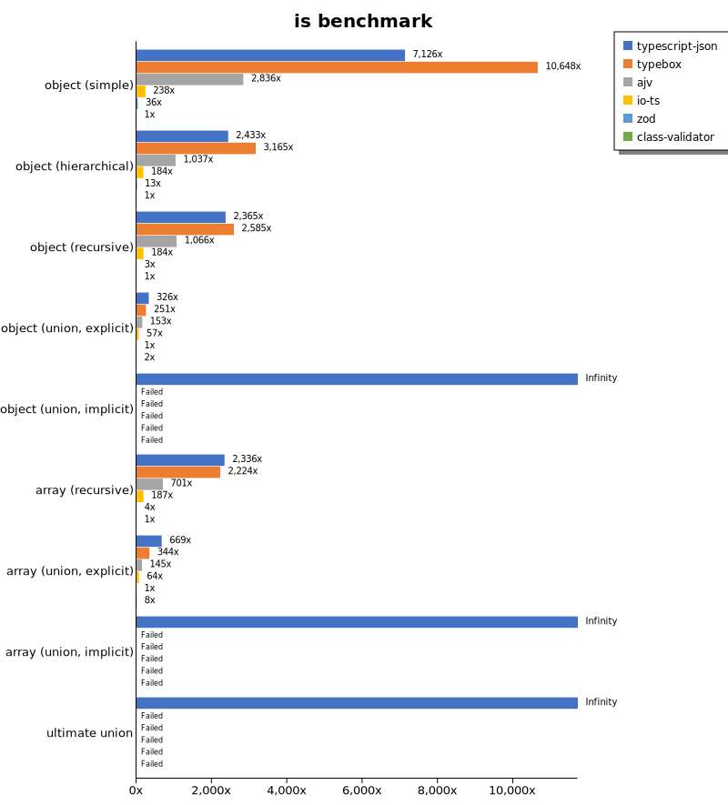
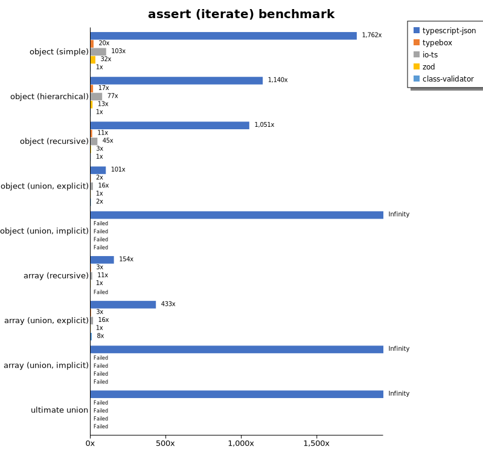
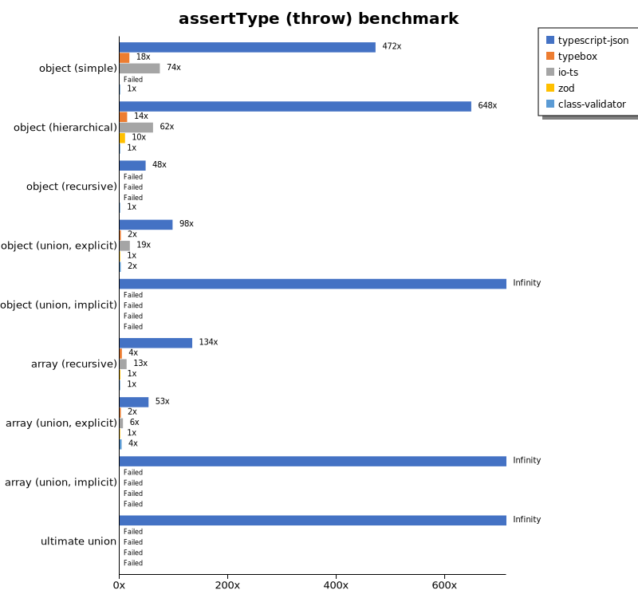
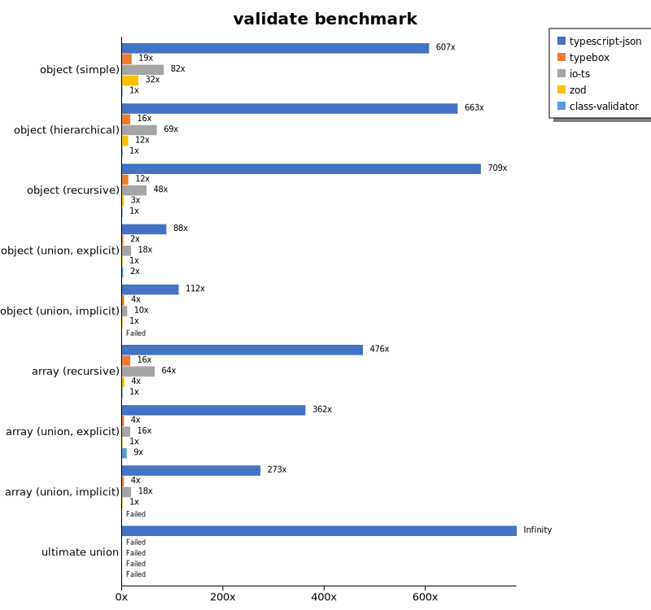
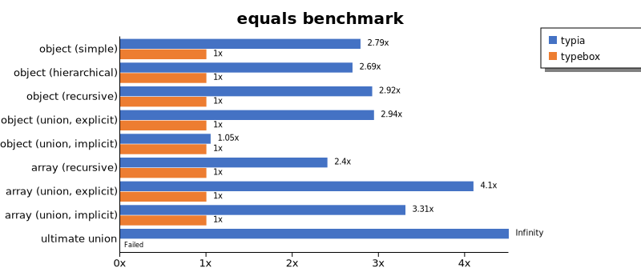
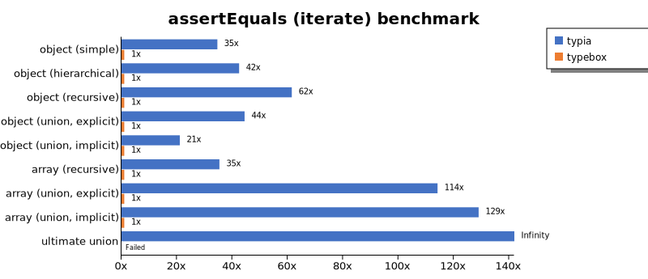
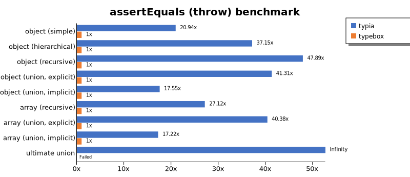
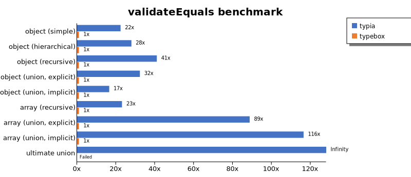
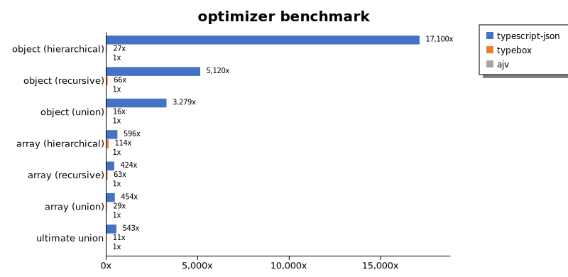
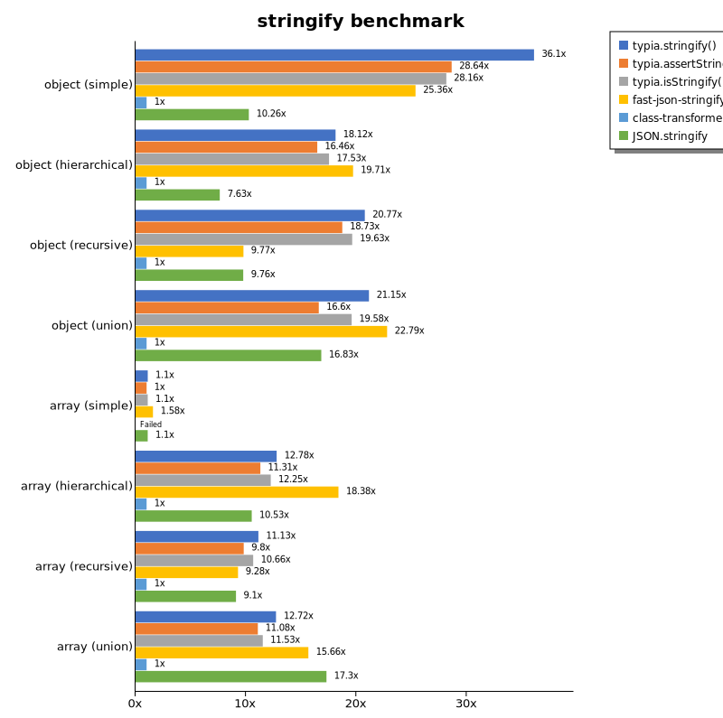

# Benchmark of `typescript-json`
> - CPU: Apple M1 Pro
> - Memory: 32,768 MB
> - OS: darwin
> - TypeScript-JSON version: 3.3.20

## is

 Components | typescript-json | typebox | ajv | io-ts | zod | class-validator 
------------|-----------------|---------|-----|-------|-----|-----------------
object (simple) | 1197568.6097031138 | 1789434.2585829073 | 476576.96506550215 | 40005.602240896354 | 5968.155197657394 | 168.0475504322767
object (hierarchical) | 144516.60790499166 | 187959.58137856371 | 61581.442915582 | 10907.590759075909 | 789.0639481000928 | 59.389454209065676
object (recursive) | 85073.23324789455 | 92989.39732142857 | 38361.423901198694 | 6634.329726755914 | 109.57882966828177 | 35.97785977859779
object (union, explicit) | 21434.894872740686 | 16476.57572906867 | 10080.327868852459 | 3773.3260153677275 | 65.75796647633082 | 144.17234395139016
object (union, implicit) | 20317.784256559764 | Failed | Failed | Failed | Failed | Failed
array (recursive) | 7840.702947845806 | 7464.080193057361 | 2352.6077097505668 | 627.2778508359947 | 14.742014742014742 | 3.3563304120827895
array (union, explicit) | 4515.033407572383 | 2320.33008252063 | 979.2833146696529 | 432.90854572713647 | 6.75295441755768 | 51.88766970429608
array (union, implicit) | 2113.2762702604264 | Failed | Failed | Failed | Failed | Failed
ultimate union | 753.068055039048 | Failed | Failed | Failed | Failed | Failed

## assert (iterate)

 Components | typescript-json | typebox | io-ts | zod | class-validator 
------------|-----------------|---------|-------|-----|-----------------
object (simple) | 315926.79355783307 | 3567.175288425754 | 18479.955456570155 | 5712.230215827338 | 179.26964219845075
object (hierarchical) | 66586.99246738931 | 965.6165616561657 | 4476.553777446967 | 757.9699523635031 | 58.41293166789126
object (recursive) | 41853.07455106113 | 429.2043566549751 | 1806.587374199451 | 133.15629742033383 | 39.83308042488619
object (union, explicit) | 7219.98883305416 | 144.92223238792315 | 1124.6542504148995 | 71.49455015702938 | 159.68732551647125
object (union, implicit) | 7038.794658967881 | Failed | Failed | Failed | Failed
array (recursive) | 2525.0836120401336 | 50.07587253414265 | 181.1926605504587 | 16.347237880496053 | Failed
array (union, explicit) | 2626.934414148858 | 20.848985725018785 | 99.54493742889647 | 6.0728744939271255 | 51.4027490114856
array (union, implicit) | 1192.4411174000365 | Failed | Failed | Failed | Failed
ultimate union | 315.1602970476363 | Failed | Failed | Failed | Failed

## assert (throw)

 Components | typescript-json | typebox | io-ts | zod | class-validator 
------------|-----------------|---------|-------|-----|-----------------
object (simple) | 87644.27625354778 | 3345.303345303345 | 13774.564330737858 | Failed | 185.7700167193015
object (hierarchical) | 47903.406963684014 | 1024.6679316888046 | 4551.463644948064 | 735.564545788893 | 73.89617587289857
object (recursive) | 5404.906843755764 | Failed | Failed | Failed | 112.76075925577899
object (union, explicit) | 7224.685883222469 | 168.00448011946983 | 1395.6997359486986 | 74.00555041628122 | 151.4864608975573
object (union, implicit) | 5713.757396449703 | Failed | Failed | Failed | Failed
array (recursive) | 1757.0093457943926 | 54.81454412570802 | 168.76054753422088 | 17.683465959328025 | 13.1250820317627
array (union, explicit) | 805.0926792735443 | 34.118048447628794 | 93.0925339787749 | 15.103458692040475 | 55.24861878453039
array (union, implicit) | 290.69767441860466 | Failed | Failed | Failed | Failed
ultimate union | 367.9852805887765 | Failed | Failed | Failed | Failed

## validate

 Components | typescript-json | typebox | io-ts | zod | class-validator 
------------|-----------------|---------|-------|-----|-----------------
object (simple) | 106910.97760786455 | 3336.7290238933133 | 14509.4124358243 | 5681.648638567698 | 176.20982637606207
object (hierarchical) | 39652.41228070175 | 972.2753346080306 | 4100.9481316229785 | 729.1514264813461 | 59.78962908285662
object (recursive) | 27779.989241527703 | 482.2857142857143 | 1894.1923774954628 | 130.97949886104786 | 39.18228279386712
object (union, explicit) | 6428.493845039826 | 179.70240366272415 | 1307.3996575993915 | 73.40485601355167 | 163.62599771949832
object (union, implicit) | 4688.223406209811 | 173.86363636363637 | 427.18998862343574 | 41.89469711266276 | Failed
array (recursive) | 1616.779629968859 | 55.14496873223422 | 218.99886234357223 | 15.225563909774436 | 3.3968673334591433
array (union, explicit) | 2212.765957446809 | 23.13334587173218 | 97.90469126645652 | 6.105457909343201 | 55.42857142857142
array (union, implicit) | 1232.8614008941877 | 15.813253012048193 | 80.78892471079082 | 4.509582863585118 | Failed
ultimate union | 246.11492591254066 | Failed | Failed | Failed | Failed

## equals

 Components | typescript-json | typebox 
------------|-----------------|---------
object (simple) | 31655.822550831792 | 62381.06530463335
object (hierarchical) | 11582.91174817313 | 18893.700055751717
object (recursive) | 8035.044516006819 | 12781.536161465145
object (union, explicit) | 3540.2107598447037 | 4131.367292225201
object (union, implicit) | 2394.2739520958085 | 2790.04252303331
array (recursive) | 677.4928774928776 | 1160.9907120743035
array (union, explicit) | 980.0930232558139 | 772.610294117647
array (union, implicit) | 513.562062151967 | 520.2280250091947
ultimate union | 425.6570483367028 | 264.9280575539568

## assertEquals (iterate)

 Components | typescript-json | typebox 
------------|-----------------|---------
object (simple) | 35373.15846209127 | 2895.225710570314
object (hierarchical) | 9705.257270693513 | 830.4709141274238
object (recursive) | 7405.968468468469 | 418.25307950727887
object (union, explicit) | 3074.83492296405 | 131.79448994787788
object (union, implicit) | 2211.7799113737074 | 102.01367781155014
array (recursive) | 607.6091010816859 | 42.87326062429485
array (union, explicit) | 601.4372581536761 | 21.078617546524875
array (union, implicit) | 362.6799557032115 | 8.953553441522104
ultimate union | 295.6302823233231 | 5.096262740656852

## assertEquals (throw)

 Components | typescript-json | typebox 
------------|-----------------|---------
object (simple) | 25292.26201521618 | 2741.2483793295055
object (hierarchical) | 8833.151581243184 | 805.0926792735443
object (recursive) | 6475.71606475716 | 415.64330247496696
object (union, explicit) | 2997.3772948669916 | 130.40238450074514
object (union, implicit) | 1923.076923076923 | 91.97939661515821
array (recursive) | 412.9129129129129 | 36.703982382088455
array (union, explicit) | 386.24241309545704 | 18.13236627379873
array (union, implicit) | 203.1769486516439 | 16.67778519012675
ultimate union | 313.9427516158818 | 15.149219815179519

## validateEquals

 Components | typescript-json | typebox 
------------|-----------------|---------
object (simple) | 22748.369565217392 | 2731.0894596988487
object (hierarchical) | 9017.381857686041 | 831.6392533727593
object (recursive) | 5682.300390843105 | 436.198409693298
object (union, explicit) | 2099.7811017876684 | 142.69406392694063
object (union, implicit) | 1507.3757057002367 | 101.62755488266467
array (recursive) | 444.58762886597935 | 43.27463469464219
array (union, explicit) | 535.7142857142857 | 20.58319039451115
array (union, implicit) | 343.8300988648847 | 8.93688326196239
ultimate union | 213.94015409424833 | 5.134055904164289

## optimizer

 Components | typescript-json | typebox | ajv 
------------|-----------------|---------|-----
object (hierarchical) | 145344.31691965938 | 233.18793166121412 | 8.499630450849963
object (recursive) | 82826.11100866679 | 1065.9503519822158 | 16.176470588235293
object (union) | 24227.412638059028 | 120.79171291157974 | 7.388252678241597
array (hierarchical) | 6589.757811055648 | 1260.381593714927 | 11.048723057417135
array (recursive) | 6996.038483305037 | 1032.9218106995884 | 16.498625114573784
array (union) | 4788.935548658024 | 310.0966092062891 | 10.551209750773149
ultimate union | 789.8124310408239 | 16.040831206707985 | 1.4545454545454546

## stringify

 Components | TSON.stringify() | TSON.assertStringify() | TSON.isStringify() | JSON.stringify() | fast-json-stringify 
------------|------------------|------------------------|--------------------|------------------|---------------------
object (simple) | 54097.72105742935 | 44567.5924222917 | 49188.17499542376 | 14250.327163955879 | 37544.85981308411
object (hierarchical) | 7544.647809206877 | 6642.477551768371 | 6983.654729109274 | 3339.444339444339 | 7033.030246799035
object (recursive) | 6058.769173905009 | 5401.894210150107 | 5870.770937326678 | 2784.783839909383 | 2779.935885347916
object (union) | 1824.1895261845386 | 1494.1520467836256 | 1740.2407880335643 | 1323.6257735711686 | 1769.882777276826
array (hierarchical) | 102.31696014828546 | 88.78170775276885 | 97.93531883793166 | 80.86053412462907 | 129.32900432900433
array (recursive) | 335.5167394468704 | 303.52504638218926 | 331.0848791455874 | 249.4326777609682 | 245.26198439241918
array (union) | 460.352422907489 | 376.9258330347546 | 402.1974063400577 | 498.78889509968326 | 451.0959661079388

