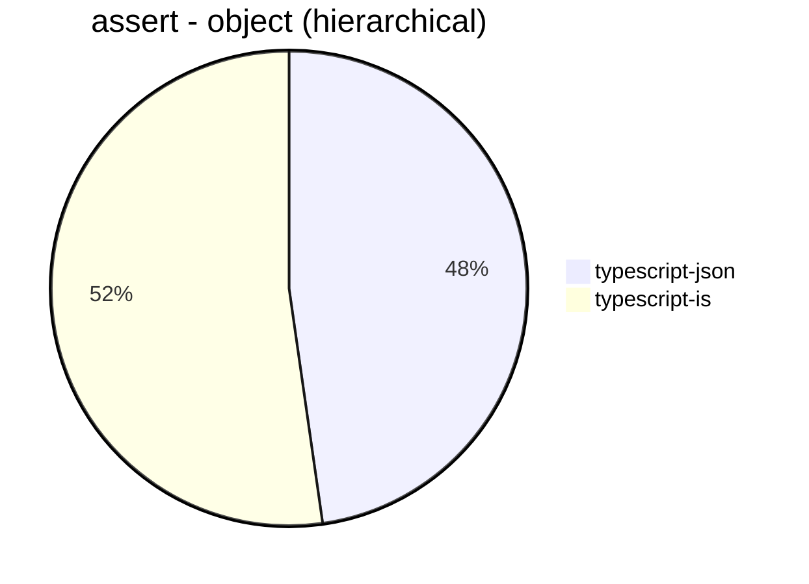
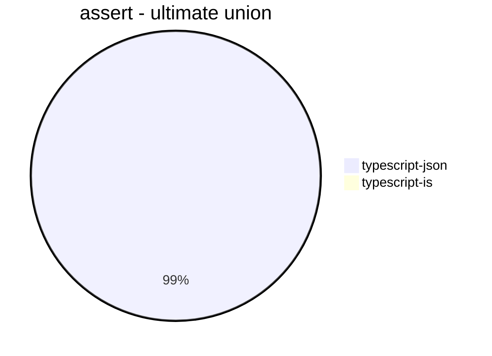
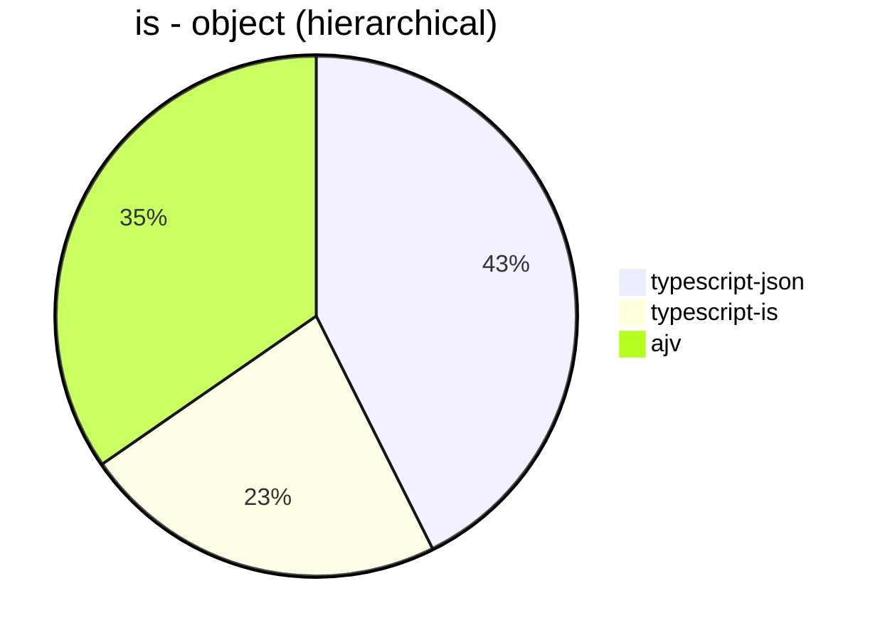
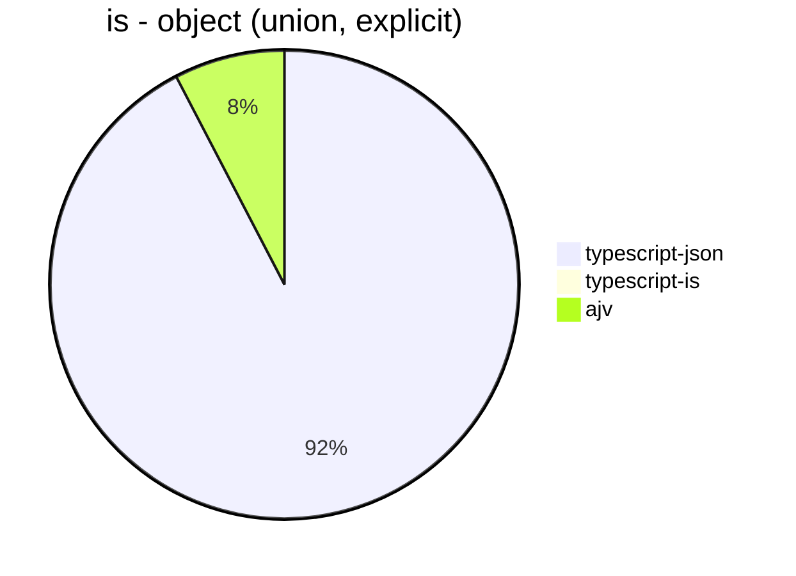
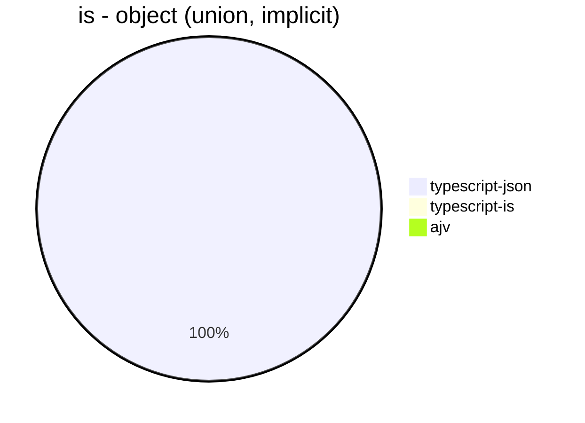
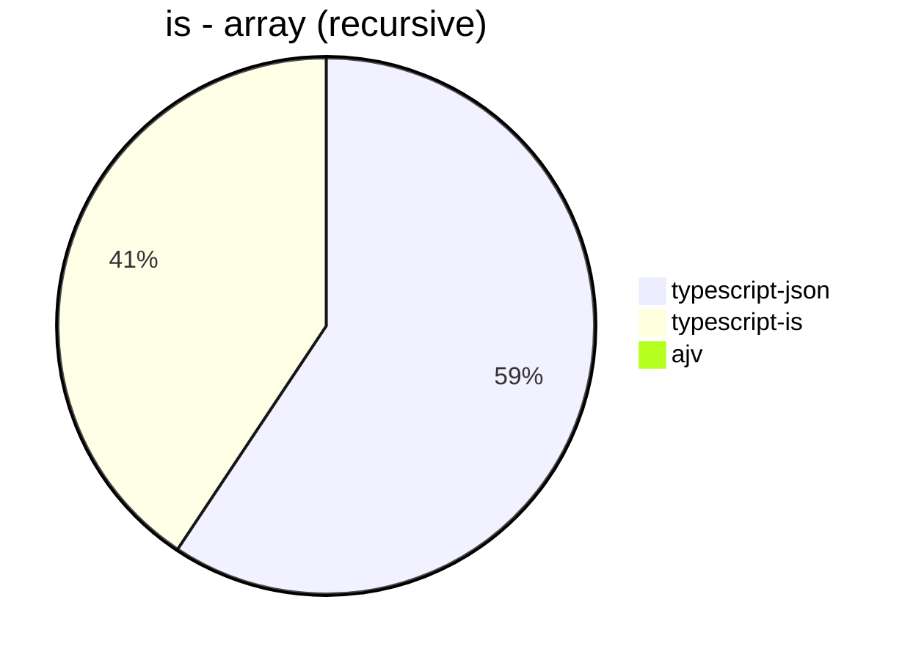
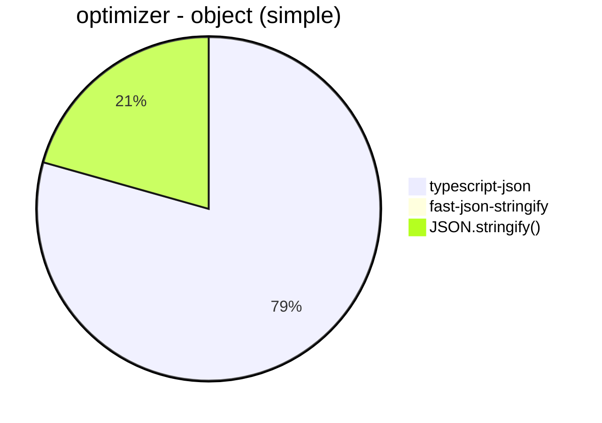
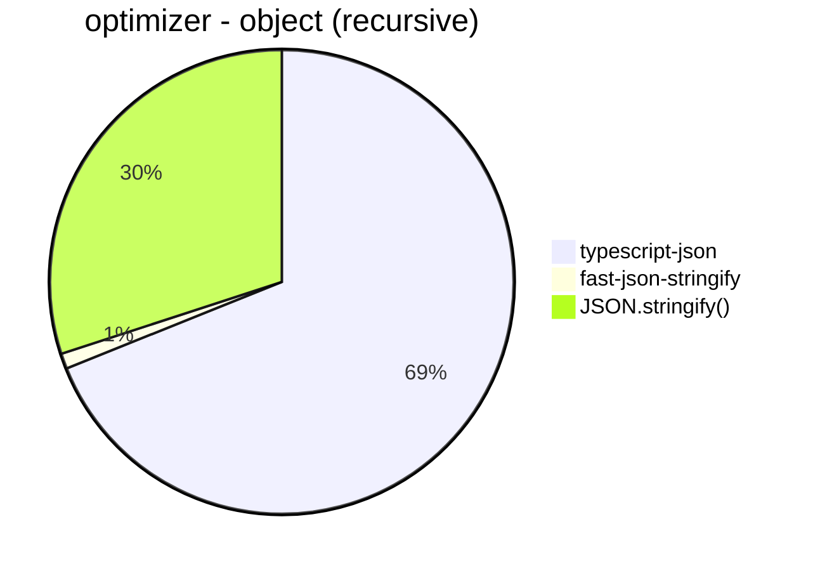

# Benchmark of `typescript-json`
> CPU: Apple M1
> Memory: 8,192 MB
> NodeJS version: v16.16.0


## assert
 Components | typescript-json | typescript-is 
------------|-----------------|---------------
object (hierarchical) | 25315.08581752484 | 27709.6241979835
object (recursive) | 31660.310995927433 | 19281.017257039057
object (union) | 5842.633928571428 | 2686.708296164139
array (recursive) | 1485.0094876660344 | 1846.265147404594
array (union) | 4158.771280532938 | 305.410447761194
ultimate union | 4633.339597819959 | 46.309963099631








## is
 Components | typescript-json | typescript-is | ajv 
------------|-----------------|---------------|-----
object (hierarchical) | 113602.70922249026 | 60623.55572120761 | 92320.73082489146
object (recursive) | 70043.35638198467 | 48482.72693862551 | Failed
object (union, explicit) | 18027.5656546843 | Failed | 1491.0135260329812
object (union, implicit) | 17203.693837684248 | Failed | Failed
array (recursive) | 7188.158372684344 | 4924.8878923766815 | Failed
array (union, explicit) | 7457.3574110495265 | 1290.9594095940959 | Failed
array (union, implicit) | 8036.165002825391 | 1359.852670349908 | Failed
ultimate union | 12338.655146506386 | 370.00184263865856 | Failed














## optimizer
 Components | typescript-json | fast-json-stringify | JSON.stringify() 
------------|-----------------|---------------------|------------------
object (simple) | 50590.060964345095 | 10.26367014687666 | 13155.702538434036
object (hierarchical) | 6759.242396649062 | 2.0032780914223274 | 3059.7235023041476
object (recursive) | 5937.042459736456 | 91.59347553324969 | 2585.570776255708
object (union) | 2755.446623093682 | 1.6423357664233575 | 1835.5263157894735
array (hierarchical) | 156.22128285241683 | 4.074828671976292 | 124.30529825861431
array (recursive) | 338.6075949367089 | 75.02799552071669 | 253.9213877099096
array (union) | 510.69182389937106 | 3.202712886209495 | 478.051491016855
ultimate union | 1677.3532152842497 | Failed | 356.99684073592266








```mermaid
pie title optimizer - array (union)
  "typescript-json": 510.69182389937106
  "fast-json-stringify": 3.202712886209495
  "JSON.stringify()": 478.051491016855
```


```mermaid
pie title optimizer - ultimate union
  "typescript-json": 1677.3532152842497
  "fast-json-stringify": 0
  "JSON.stringify()": 356.99684073592266
```


## stringify
 Components | typescript-json | fast-json-stringify | JSON.stringify() 
------------|-----------------|---------------------|------------------
object (simple) | 48511.615343057805 | 38126.126126126124 | 12982.323232323233
object (hierarchical) | 7237.165178571428 | 6884.579526384486 | 3061.680517082179
object (recursive) | 6313.534387642516 | 2624.790307548928 | 2562.9764065335753
object (union) | 2870.071348103643 | 1991.7763157894735 | 1816.3757890828072
array (hierarchical) | 125.20899126880921 | 163.29137018792193 | 97.12163416898794
array (recursive) | 339.5220588235294 | 259.90610328638496 | 255.65862708719854
array (union) | 529.9907149489322 | 440.4672192916353 | 470.27522935779814
ultimate union | 1664.474885844749 | Failed | 355.2194762080413


```mermaid
pie title stringify - object (simple)
  "typescript-json": 48511.615343057805
  "fast-json-stringify": 38126.126126126124
  "JSON.stringify()": 12982.323232323233
```


```mermaid
pie title stringify - object (hierarchical)
  "typescript-json": 7237.165178571428
  "fast-json-stringify": 6884.579526384486
  "JSON.stringify()": 3061.680517082179
```


```mermaid
pie title stringify - object (recursive)
  "typescript-json": 6313.534387642516
  "fast-json-stringify": 2624.790307548928
  "JSON.stringify()": 2562.9764065335753
```


```mermaid
pie title stringify - object (union)
  "typescript-json": 2870.071348103643
  "fast-json-stringify": 1991.7763157894735
  "JSON.stringify()": 1816.3757890828072
```


```mermaid
pie title stringify - array (hierarchical)
  "typescript-json": 125.20899126880921
  "fast-json-stringify": 163.29137018792193
  "JSON.stringify()": 97.12163416898794
```


```mermaid
pie title stringify - array (recursive)
  "typescript-json": 339.5220588235294
  "fast-json-stringify": 259.90610328638496
  "JSON.stringify()": 255.65862708719854
```


```mermaid
pie title stringify - array (union)
  "typescript-json": 529.9907149489322
  "fast-json-stringify": 440.4672192916353
  "JSON.stringify()": 470.27522935779814
```


```mermaid
pie title stringify - ultimate union
  "typescript-json": 1664.474885844749
  "fast-json-stringify": 0
  "JSON.stringify()": 355.2194762080413
```


