# Benchmark of `typescript-json`
> CPU: Apple M1
> Memory: 8,192 MB

## assert
 Components | typescript-json | typescript-is 
------------|-----------------|---------------
object (hierarchical) | 24131.09425785482 | 28101.877164206304
object (recursive) | 32381.264807727355 | 20847.71013426522
object (union) | 5790.7348242811495 | 2793.4861717612807
array (recursive) | 1501.965188096575 | 1794.75827873207
array (union) | 4181.363467951093 | 294.2852056257789
ultimate union | 4711.297852474323 | 45.61846375766318

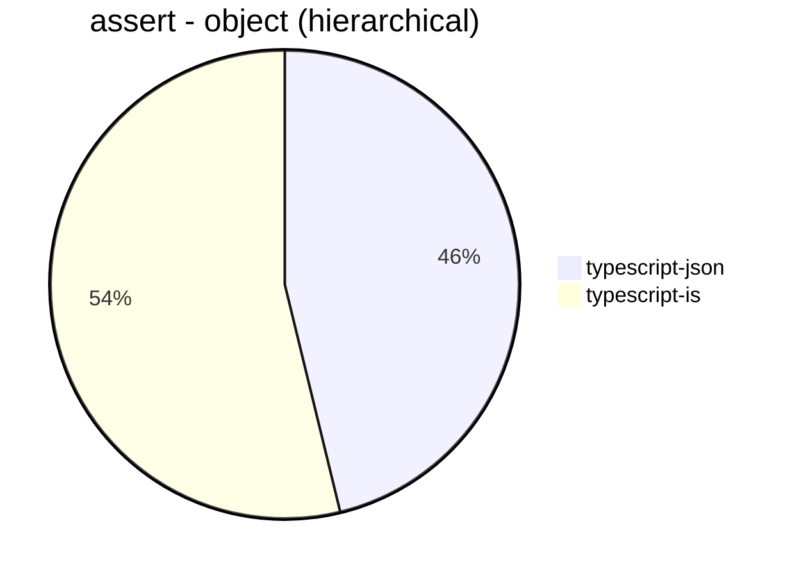
```mermaid
pie title assert - object (hierarchical)
  "typescript-json": 24131.09425785482
  "typescript-is": 28101.877164206304
```

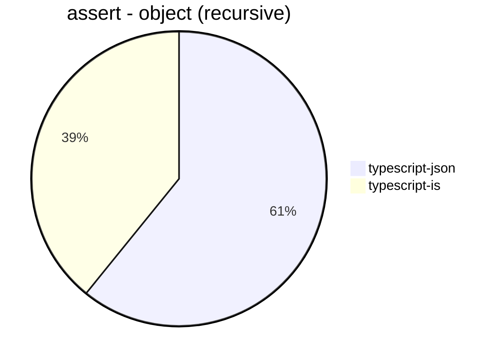
```mermaid
pie title assert - object (recursive)
  "typescript-json": 32381.264807727355
  "typescript-is": 20847.71013426522
```

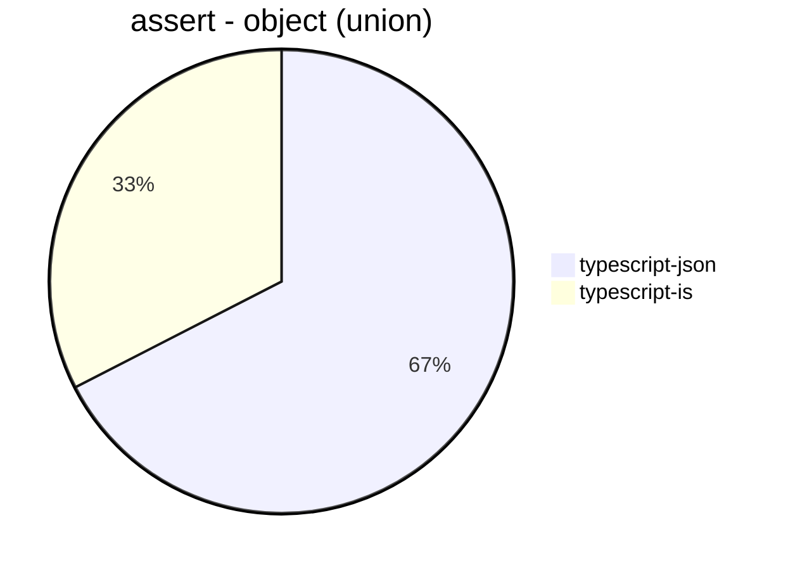
```mermaid
pie title assert - object (union)
  "typescript-json": 5790.7348242811495
  "typescript-is": 2793.4861717612807
```

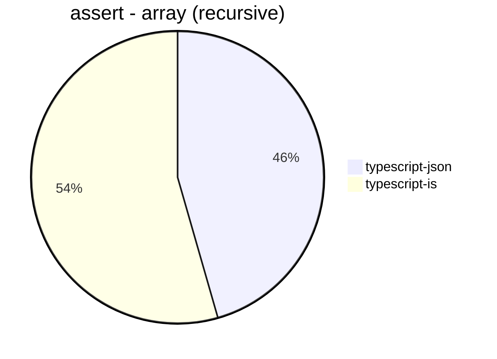
```mermaid
pie title assert - array (recursive)
  "typescript-json": 1501.965188096575
  "typescript-is": 1794.75827873207
```

```mermaid
pie title assert - array (union)
  "typescript-json": 4181.363467951093
  "typescript-is": 294.2852056257789
```

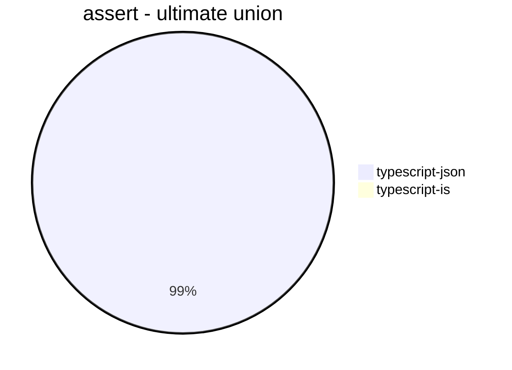
```mermaid
pie title assert - ultimate union
  "typescript-json": 4711.297852474323
  "typescript-is": 45.61846375766318
```

## is
 Components | typescript-json | typescript-is | ajv 
------------|-----------------|---------------|-----
object (hierarchical) | 110891.59369527145 | 60833.92890727854 | 89847.28610855567
object (recursive) | 68605.35055350553 | 48339.29559284529 | Failed
object (union, explicit) | 20756.552962298025 | Failed | 1483.0809497102262
object (union, implicit) | 17615.552722637043 | Failed | Failed
array (recursive) | 7159.955670483931 | 4777.777777777777 | Failed
array (union, explicit) | 7650.305612150398 | 1269.8587415153183 | Failed
array (union, implicit) | 8551.9863143889 | 1337.1094463731044 | Failed
ultimate union | 11790.645039607696 | 363.4039444850256 | Failed

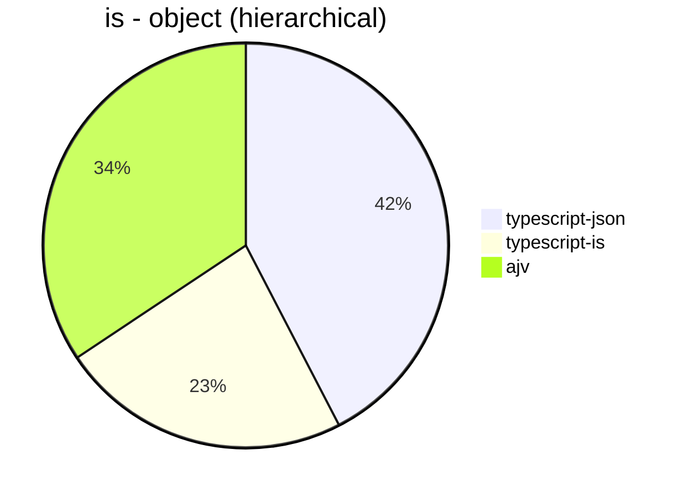
```mermaid
pie title is - object (hierarchical)
  "typescript-json": 110891.59369527145
  "typescript-is": 60833.92890727854
  "ajv": 89847.28610855567
```

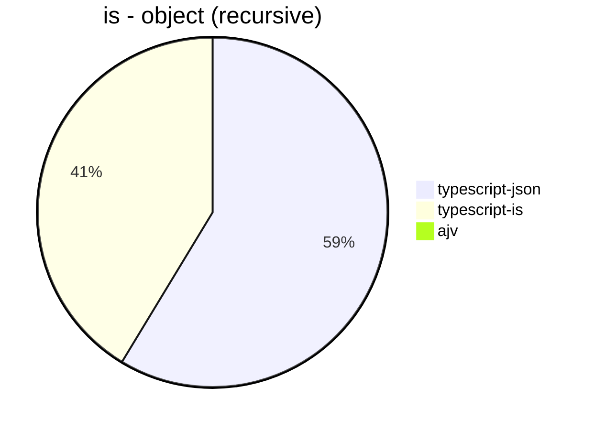
```mermaid
pie title is - object (recursive)
  "typescript-json": 68605.35055350553
  "typescript-is": 48339.29559284529
  "ajv": 0
```

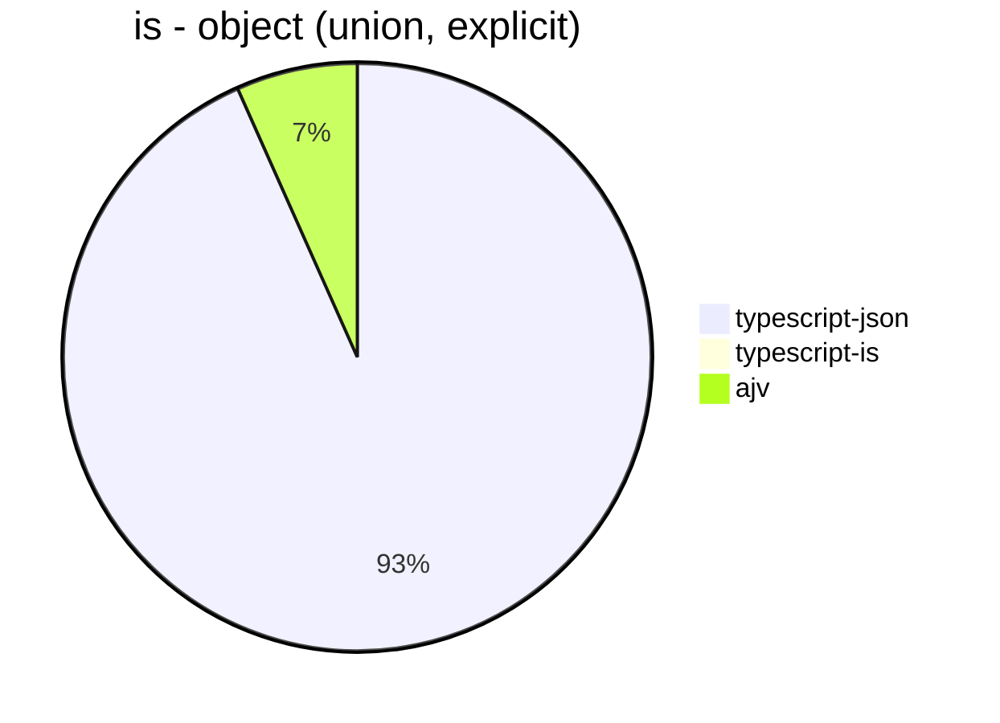
```mermaid
pie title is - object (union, explicit)
  "typescript-json": 20756.552962298025
  "typescript-is": 0
  "ajv": 1483.0809497102262
```

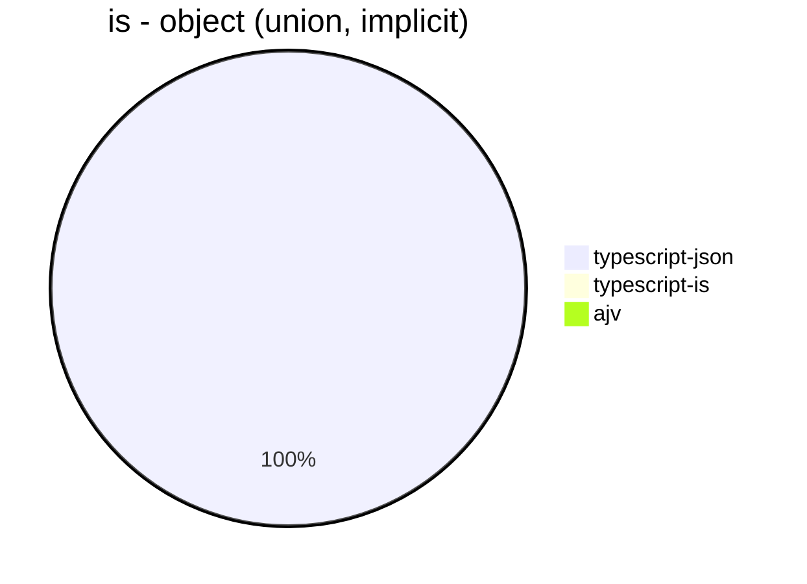
```mermaid
pie title is - object (union, implicit)
  "typescript-json": 17615.552722637043
  "typescript-is": 0
  "ajv": 0
```

```mermaid
pie title is - array (recursive)
  "typescript-json": 7159.955670483931
  "typescript-is": 4777.777777777777
  "ajv": 0
```

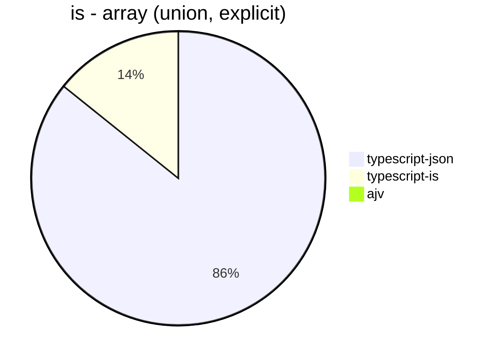
```mermaid
pie title is - array (union, explicit)
  "typescript-json": 7650.305612150398
  "typescript-is": 1269.8587415153183
  "ajv": 0
```

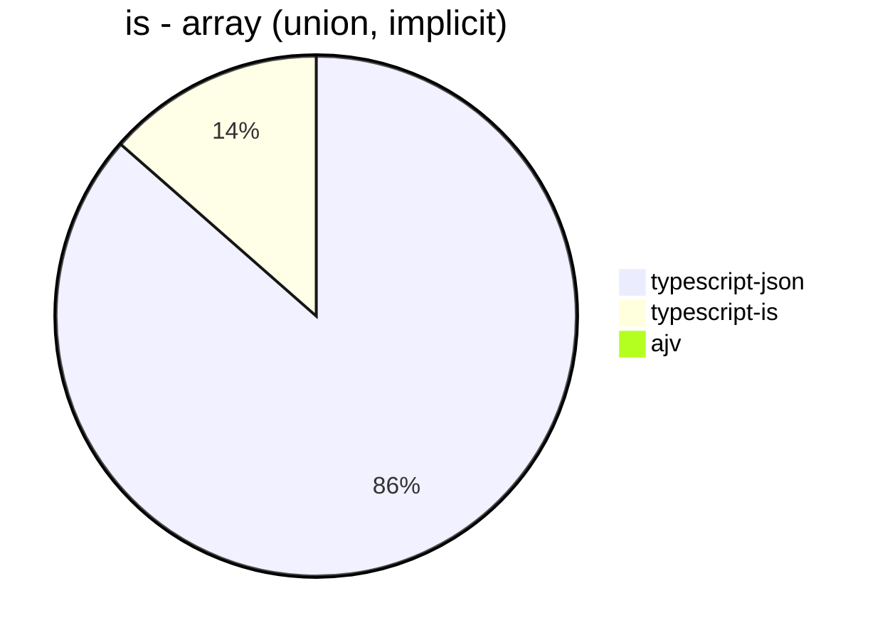
```mermaid
pie title is - array (union, implicit)
  "typescript-json": 8551.9863143889
  "typescript-is": 1337.1094463731044
  "ajv": 0
```

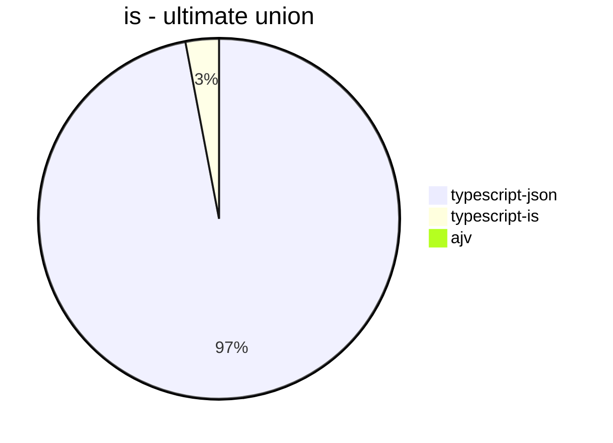
```mermaid
pie title is - ultimate union
  "typescript-json": 11790.645039607696
  "typescript-is": 363.4039444850256
  "ajv": 0
```

## optimizer
 Components | typescript-json | fast-json-stringify | JSON.stringify() 
------------|-----------------|---------------------|------------------
object (simple) | 49317.6233266092 | 9.978991596638656 | 13574.913526306207
object (hierarchical) | 6609.805361733383 | 2.175883952855848 | 3117.0348731057147
object (recursive) | 5816.45922348133 | 90.18073411589343 | 2637.2084548104954
object (union) | 2724.7393024092053 | 1.668520578420467 | 1831.6813166261454
array (hierarchical) | 178.87220798242402 | 4.302282080059857 | 141.13947465778764
array (recursive) | 336.1266294227188 | 73.10162448054402 | 255.07192917742532
array (union) | 505.5484809896307 | 3.207547169811321 | 465.95705634061295
ultimate union | 1640.6902815622161 | Failed | 383.778801843318

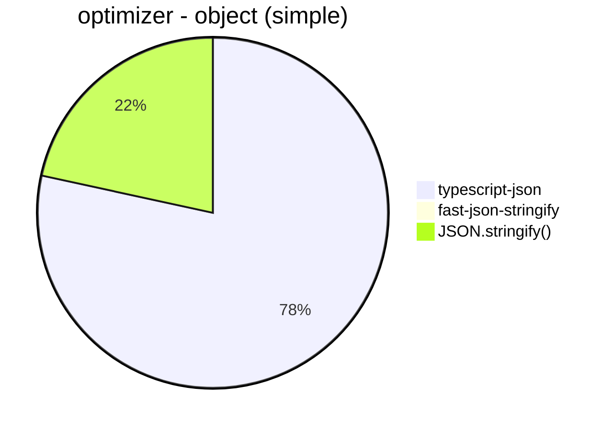
```mermaid
pie title optimizer - object (simple)
  "typescript-json": 49317.6233266092
  "fast-json-stringify": 9.978991596638656
  "JSON.stringify()": 13574.913526306207
```

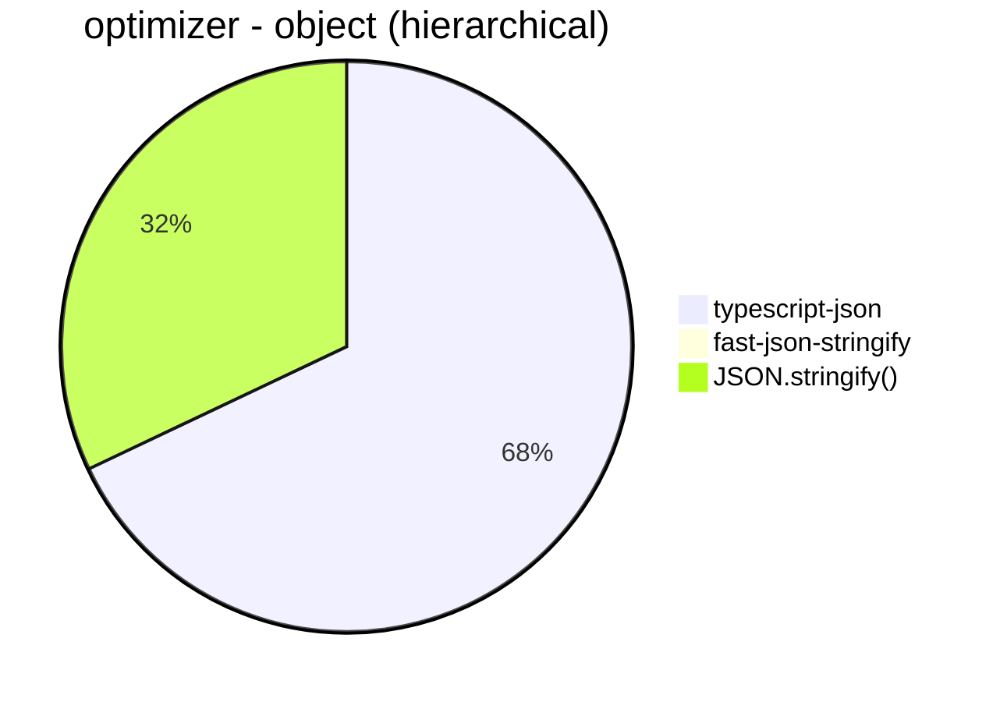
```mermaid
pie title optimizer - object (hierarchical)
  "typescript-json": 6609.805361733383
  "fast-json-stringify": 2.175883952855848
  "JSON.stringify()": 3117.0348731057147
```

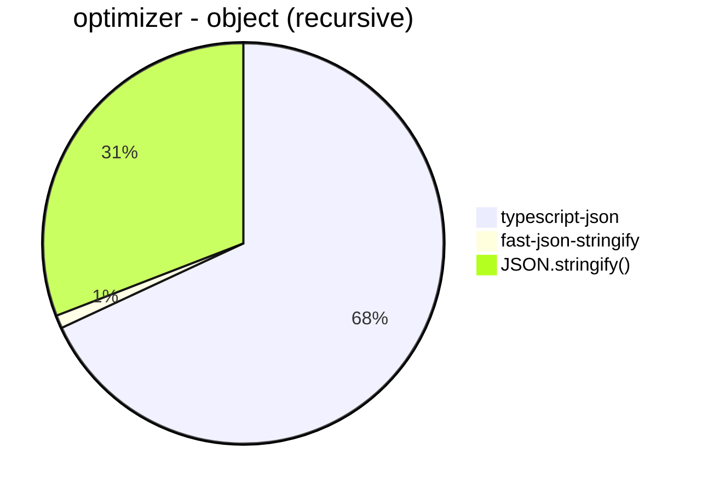
```mermaid
pie title optimizer - object (recursive)
  "typescript-json": 5816.45922348133
  "fast-json-stringify": 90.18073411589343
  "JSON.stringify()": 2637.2084548104954
```

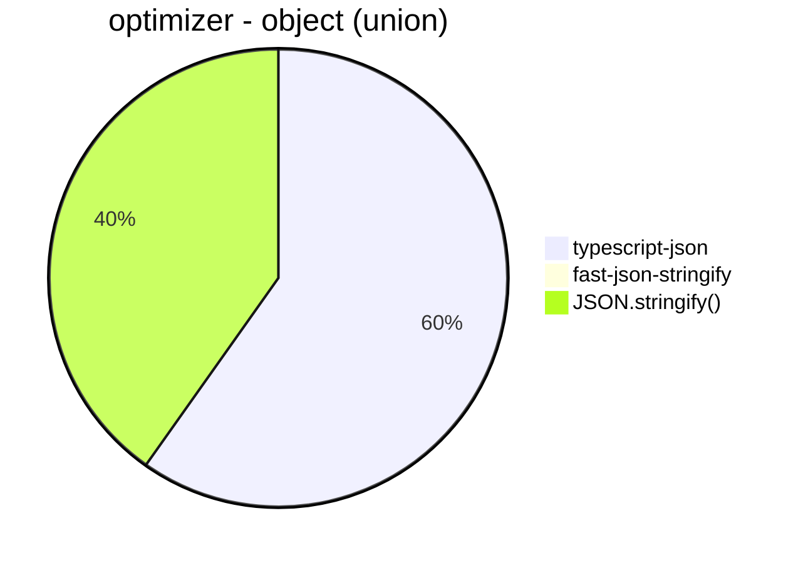
```mermaid
pie title optimizer - object (union)
  "typescript-json": 2724.7393024092053
  "fast-json-stringify": 1.668520578420467
  "JSON.stringify()": 1831.6813166261454
```

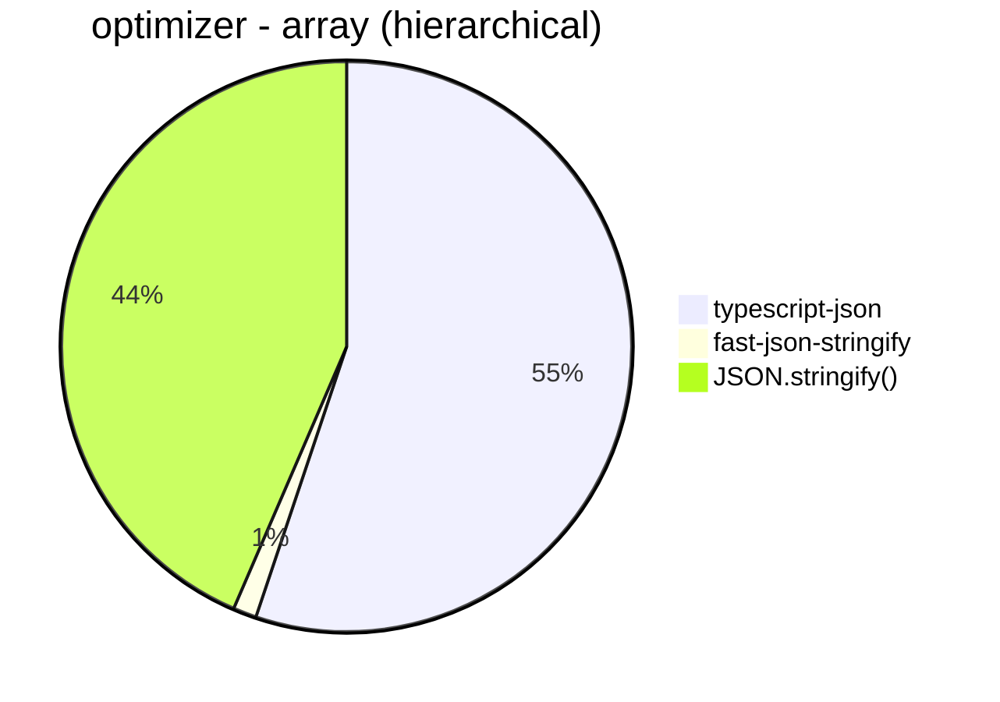
```mermaid
pie title optimizer - array (hierarchical)
  "typescript-json": 178.87220798242402
  "fast-json-stringify": 4.302282080059857
  "JSON.stringify()": 141.13947465778764
```

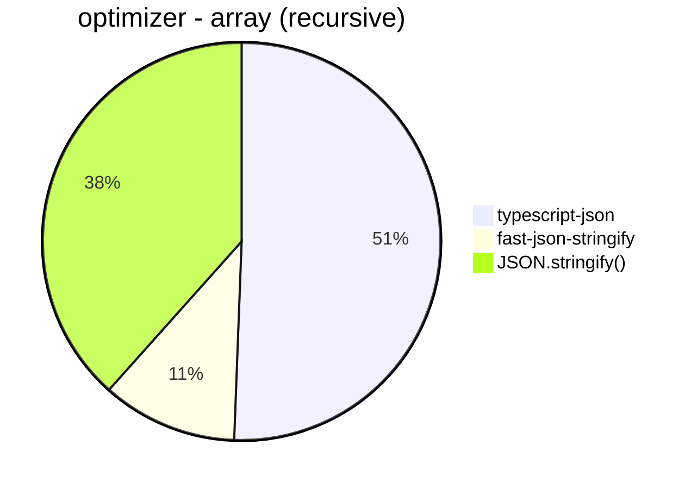
```mermaid
pie title optimizer - array (recursive)
  "typescript-json": 336.1266294227188
  "fast-json-stringify": 73.10162448054402
  "JSON.stringify()": 255.07192917742532
```

```mermaid
pie title optimizer - array (union)
  "typescript-json": 505.5484809896307
  "fast-json-stringify": 3.207547169811321
  "JSON.stringify()": 465.95705634061295
```

```mermaid
pie title optimizer - ultimate union
  "typescript-json": 1640.6902815622161
  "fast-json-stringify": 0
  "JSON.stringify()": 383.778801843318
```

## stringify
 Components | typescript-json | fast-json-stringify | JSON.stringify() 
------------|-----------------|---------------------|------------------
object (simple) | 50015.81463773446 | 38512.58793039615 | 13185.005393743257
object (hierarchical) | 6842.412096921115 | 6707.253886010363 | 3167.324685091183
object (recursive) | 6206.012541497603 | 2618.09506331437 | 2655.1274892983433
object (union) | 2829.9344501092496 | 1962.5649292495073 | 1774.8971929197212
array (hierarchical) | 179.93776313380926 | 238.4883507613282 | 141.57303370786516
array (recursive) | 334.1818181818182 | 256.71918443002784 | 255.6169429097606
array (union) | 526.8896691923859 | 432.74962742175853 | 467.0680532749498
ultimate union | 1678.5122445221875 | Failed | 386.535971888293

```mermaid
pie title stringify - object (simple)
  "typescript-json": 50015.81463773446
  "fast-json-stringify": 38512.58793039615
  "JSON.stringify()": 13185.005393743257
```

```mermaid
pie title stringify - object (hierarchical)
  "typescript-json": 6842.412096921115
  "fast-json-stringify": 6707.253886010363
  "JSON.stringify()": 3167.324685091183
```

```mermaid
pie title stringify - object (recursive)
  "typescript-json": 6206.012541497603
  "fast-json-stringify": 2618.09506331437
  "JSON.stringify()": 2655.1274892983433
```

```mermaid
pie title stringify - object (union)
  "typescript-json": 2829.9344501092496
  "fast-json-stringify": 1962.5649292495073
  "JSON.stringify()": 1774.8971929197212
```

```mermaid
pie title stringify - array (hierarchical)
  "typescript-json": 179.93776313380926
  "fast-json-stringify": 238.4883507613282
  "JSON.stringify()": 141.57303370786516
```

```mermaid
pie title stringify - array (recursive)
  "typescript-json": 334.1818181818182
  "fast-json-stringify": 256.71918443002784
  "JSON.stringify()": 255.6169429097606
```

```mermaid
pie title stringify - array (union)
  "typescript-json": 526.8896691923859
  "fast-json-stringify": 432.74962742175853
  "JSON.stringify()": 467.0680532749498
```

```mermaid
pie title stringify - ultimate union
  "typescript-json": 1678.5122445221875
  "fast-json-stringify": 0
  "JSON.stringify()": 386.535971888293
```

