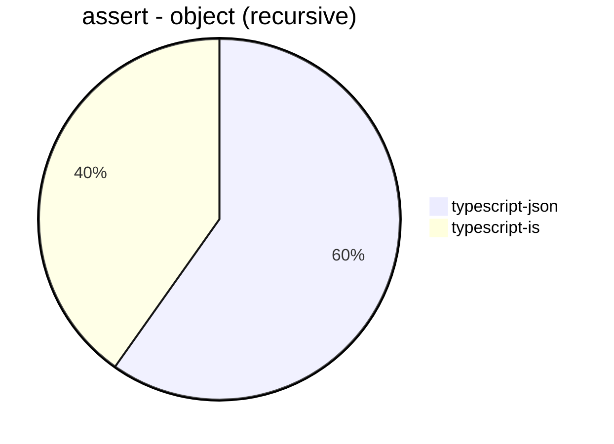
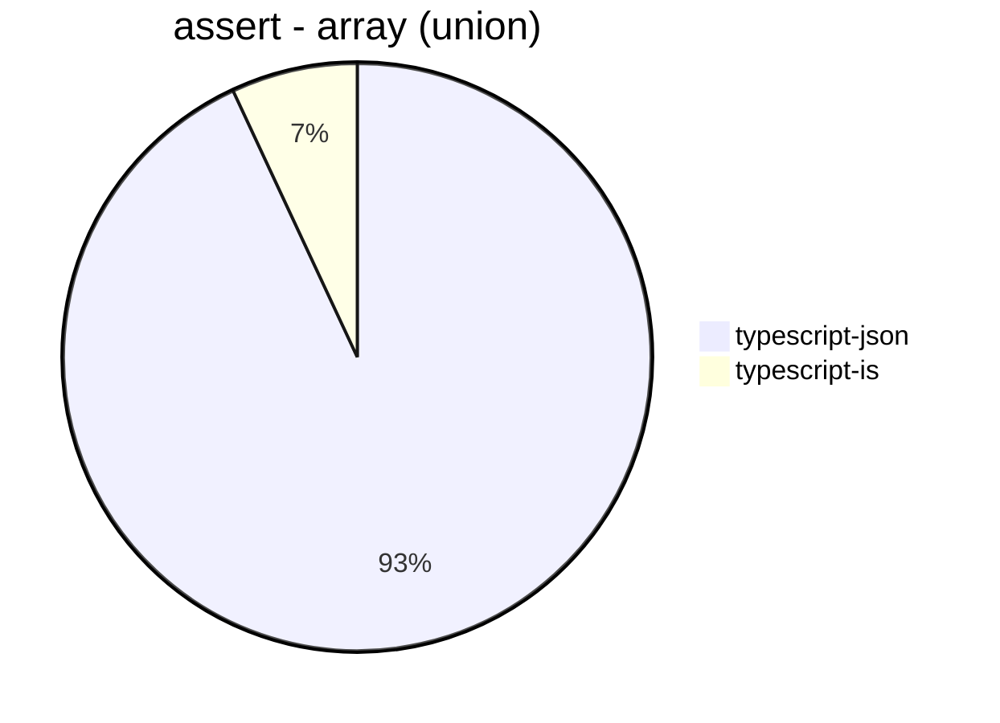
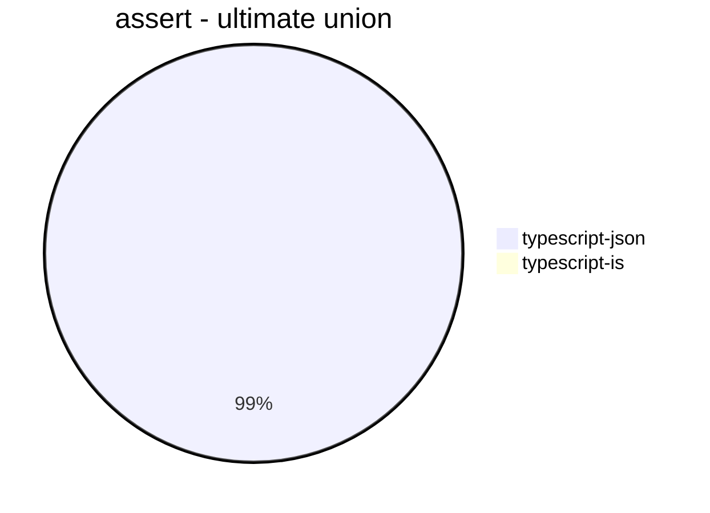
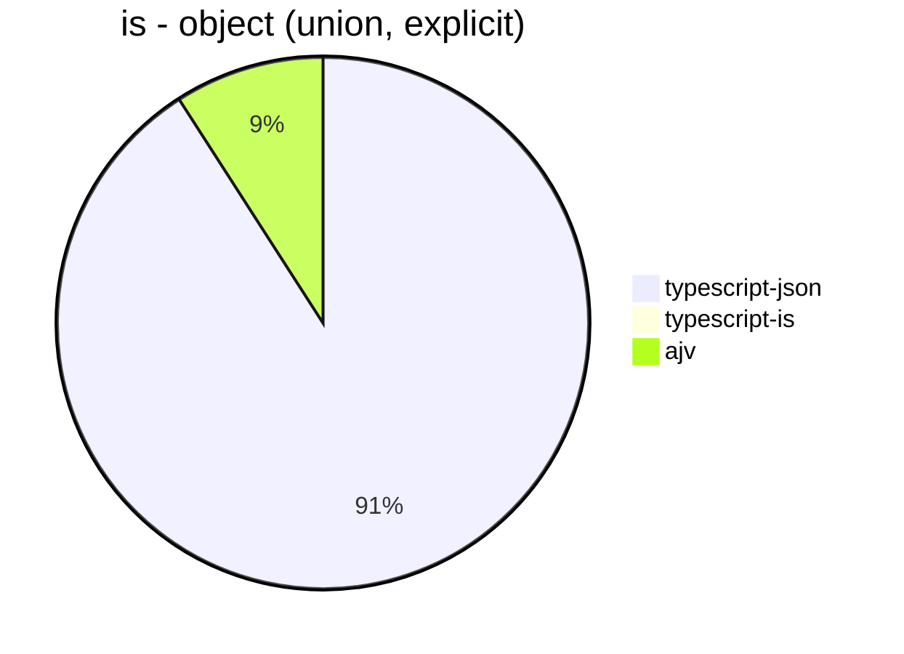
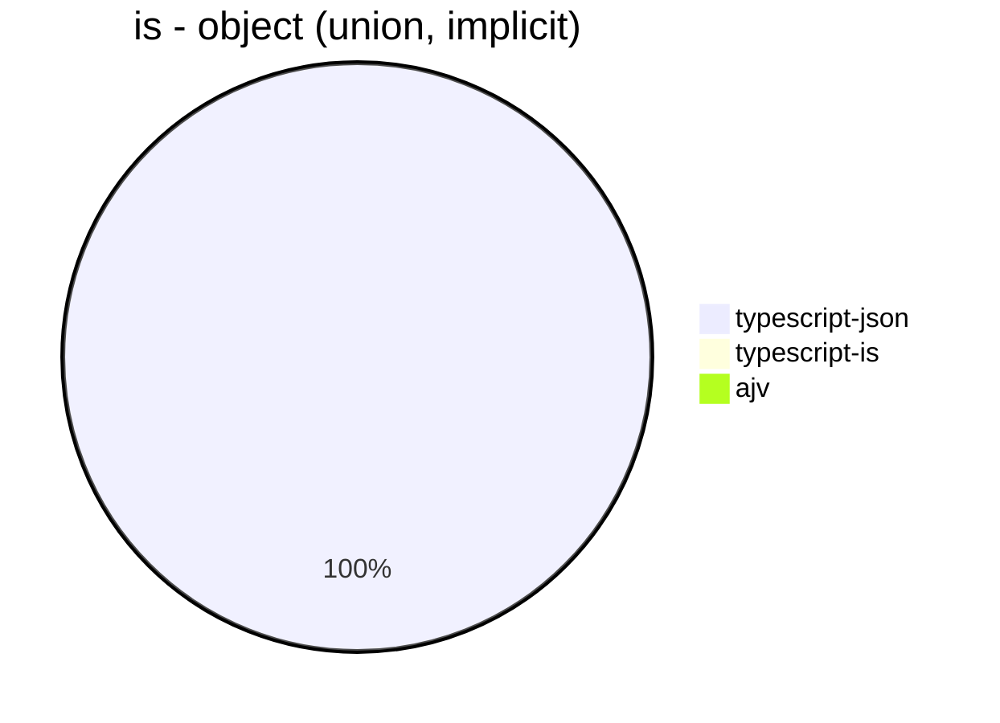
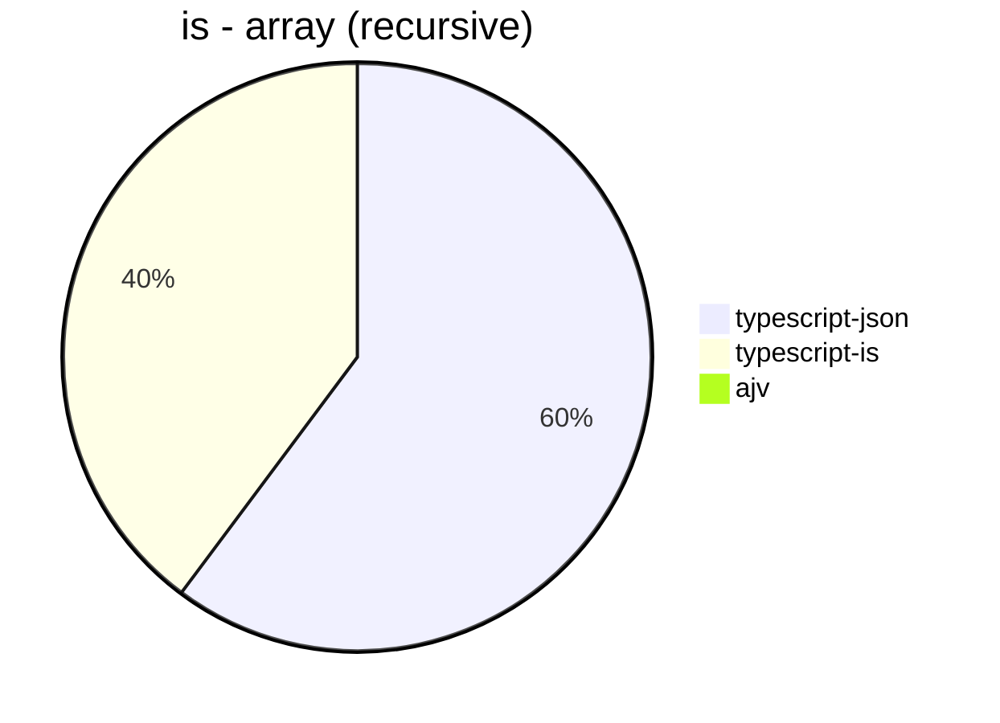
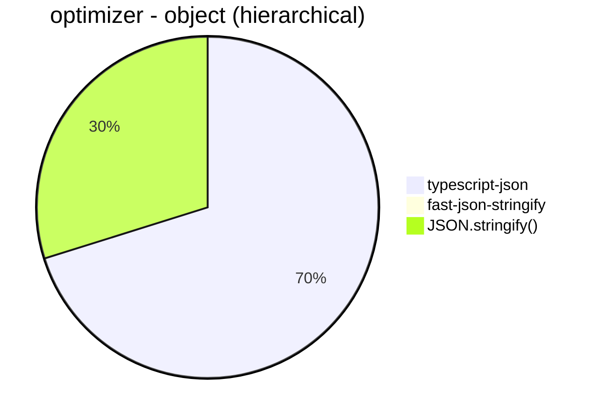
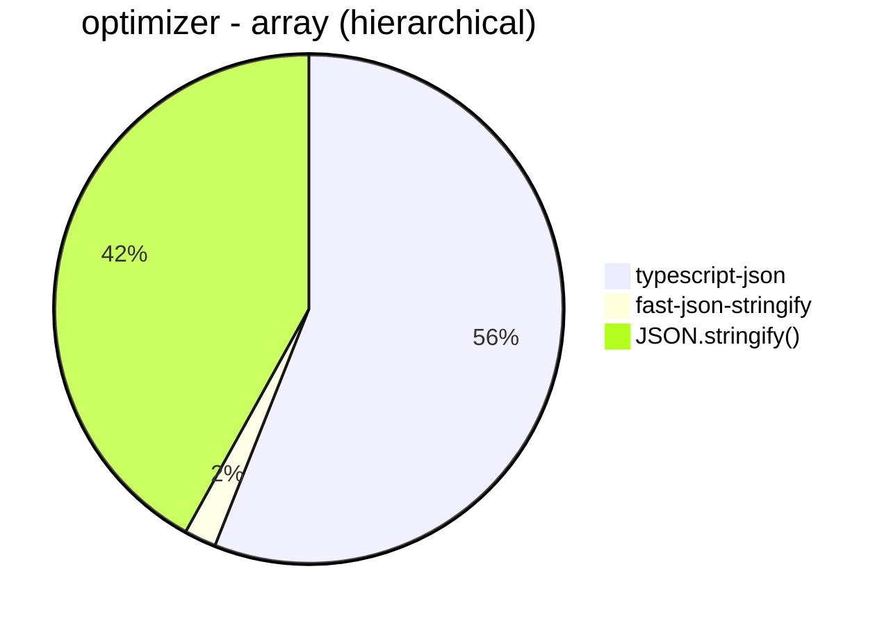

# Benchmark of `typescript-json`
> CPU: Apple M1
> Memory: 8,192 MB
> NodeJS version: v16.13.2


## assert
 Components | typescript-json | typescript-is 
------------|-----------------|---------------
object (hierarchical) | 26601.62748643761 | 28306.6814732556
object (recursive) | 34408.39135214364 | 23132.453921214314
object (union) | 6168.106551475882 | 2943.7661857195712
array (recursive) | 1428.306436653682 | 1908.2823790994996
array (union) | 4058.6325094714052 | 302.80542986425337
ultimate union | 4751.07216110386 | 45.318286016575556











## is
 Components | typescript-json | typescript-is | ajv 
------------|-----------------|---------------|-----
object (hierarchical) | 116971.91945316829 | 59204.4751682736 | 96695.14670603433
object (recursive) | 67301.59883720931 | 47386.27630375115 | Failed
object (union, explicit) | 17819.134993446918 | Failed | 1783.2564739269244
object (union, implicit) | 17830.68881836849 | Failed | Failed
array (recursive) | 6898.0024748099695 | 4559.86996568539 | Failed
array (union, explicit) | 7473.48277747403 | 1292.184889548914 | Failed
array (union, implicit) | 7444.774457026175 | 1302.1400072542617 | Failed
ultimate union | 10941.351150705272 | 352.41123476417596 | Failed











## optimizer
 Components | typescript-json | fast-json-stringify | JSON.stringify() 
------------|-----------------|---------------------|------------------
object (simple) | 48390.92753088696 | 9.286898839137645 | 12220.392989909718
object (hierarchical) | 6823.8077903167095 | 1.3271400132714002 | 2901.331387926318
object (recursive) | 5578.600676517714 | 85.96734977422716 | 2533.1594634873322
object (union) | 2727.9764098783635 | 1.6137708445400754 | 1779.9962328122056
array (hierarchical) | 105.9614685568884 | 3.8349159970781592 | 79.34762690122778
array (recursive) | 336.89739260926655 | 71.98408392114307 | 252.20823153542568
array (union) | 525.164113785558 | 3.145817912657291 | 473.1343283582089
ultimate union | 1626.4775413711584 | Failed | 372.4801183650823








```mermaid
pie title optimizer - array (union)
  "typescript-json": 525.164113785558
  "fast-json-stringify": 3.145817912657291
  "JSON.stringify()": 473.1343283582089
```


```mermaid
pie title optimizer - ultimate union
  "typescript-json": 1626.4775413711584
  "fast-json-stringify": 0
  "JSON.stringify()": 372.4801183650823
```


## stringify
 Components | typescript-json | fast-json-stringify | JSON.stringify() 
------------|-----------------|---------------------|------------------
object (simple) | 48612.07519884309 | 36983.14091991937 | 13220.456245325355
object (hierarchical) | 7053.728070175438 | 6901.32933907508 | 2954.4275657650983
object (recursive) | 6032.729932345949 | 2511.388684790595 | 2494.67499081895
object (union) | 2762.763846292621 | 1940.1909565843991 | 1720.343630049351
array (hierarchical) | 208.13484792964456 | 282.5278810408922 | 153.902394443429
array (recursive) | 329.90422135509044 | 253.05508554239518 | 242.91132382156403
array (union) | 535.1519589893812 | 422.037037037037 | 468.45686959720433
ultimate union | 1653.4870950027457 | Failed | 373.81615598885793


```mermaid
pie title stringify - object (simple)
  "typescript-json": 48612.07519884309
  "fast-json-stringify": 36983.14091991937
  "JSON.stringify()": 13220.456245325355
```


```mermaid
pie title stringify - object (hierarchical)
  "typescript-json": 7053.728070175438
  "fast-json-stringify": 6901.32933907508
  "JSON.stringify()": 2954.4275657650983
```


```mermaid
pie title stringify - object (recursive)
  "typescript-json": 6032.729932345949
  "fast-json-stringify": 2511.388684790595
  "JSON.stringify()": 2494.67499081895
```


```mermaid
pie title stringify - object (union)
  "typescript-json": 2762.763846292621
  "fast-json-stringify": 1940.1909565843991
  "JSON.stringify()": 1720.343630049351
```


```mermaid
pie title stringify - array (hierarchical)
  "typescript-json": 208.13484792964456
  "fast-json-stringify": 282.5278810408922
  "JSON.stringify()": 153.902394443429
```


```mermaid
pie title stringify - array (recursive)
  "typescript-json": 329.90422135509044
  "fast-json-stringify": 253.05508554239518
  "JSON.stringify()": 242.91132382156403
```


```mermaid
pie title stringify - array (union)
  "typescript-json": 535.1519589893812
  "fast-json-stringify": 422.037037037037
  "JSON.stringify()": 468.45686959720433
```


```mermaid
pie title stringify - ultimate union
  "typescript-json": 1653.4870950027457
  "fast-json-stringify": 0
  "JSON.stringify()": 373.81615598885793
```


