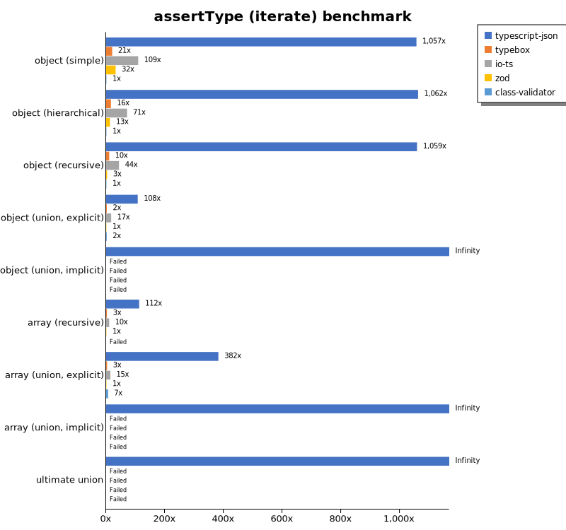
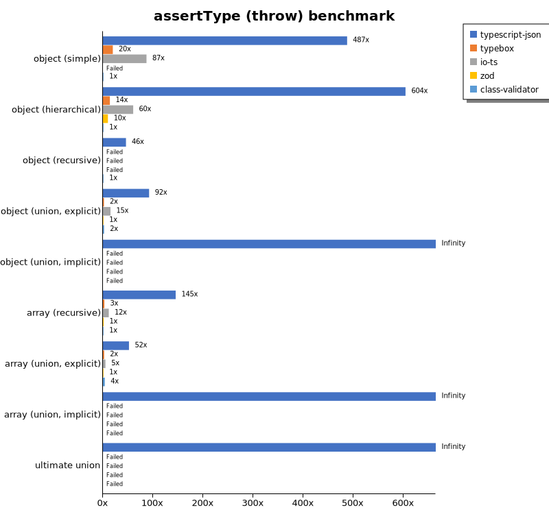

# Benchmark of `typescript-json`
> - CPU: Apple M1
> - Memory: 8,192 MB
> - OS: darwin
> - TypeScript-JSON version: 3.3.20

## is

 Components | typescript-json | typebox | ajv | io-ts | zod | class-validator 
------------|-----------------|---------|-----|-------|-----|-----------------
object (simple) | 1132189.06729208 | 1786364.296351452 | 472059.65805747546 | 38499.08958485069 | 5877.079978529254 | 169.64450174986183
object (hierarchical) | 128645.61664190191 | 185352.0942408377 | 54905.58802045288 | 10613.473219215903 | 780.6345733041576 | 57.13239333455411
object (recursive) | 88399.36990363232 | 91302.68270120259 | 40412.978802528814 | 6617.216804201051 | 107.54716981132074 | 35.0129677658392
object (union, explicit) | 20449.93498049415 | 16005.672149744754 | 9087.894736842105 | 3641.536788691555 | 67.78711484593836 | 153.53901996370234
object (union, implicit) | 20776.035834266517 | Failed | Failed | Failed | Failed | Failed
array (recursive) | 7827.657572906866 | 7268.006700167503 | 2312.0260021668473 | 613.5849056603774 | 15.168539325842698 | 3.343860300947427
array (union, explicit) | 4544.526901669759 | 2276.1726078799247 | 966.7088836620228 | 412.66617429837515 | 6.106587712805329 | 58.45629965947787
array (union, implicit) | 2121.0810810810813 | Failed | Failed | Failed | Failed | Failed
ultimate union | 739.3053016453382 | Failed | Failed | Failed | Failed | Failed

## assertType (iterate)

 Components | typescript-json | typebox | io-ts | zod | class-validator 
------------|-----------------|---------|-------|-----|-----------------
object (simple) | 199857.4910931933 | 3750.707146897982 | 19242.280734987686 | 5616.362631288004 | 170.16231989786615
object (hierarchical) | 63187.87547788094 | 933.9673425444105 | 4401.927437641723 | 754.2952152226122 | 56.95142378559464
object (recursive) | 38901.7824663514 | 389.4756008739985 | 1655.09560051977 | 129.32981927710844 | 34.489152605229
object (union, explicit) | 6634.1010401188705 | 135.45521835677278 | 1055.1062629302237 | 66.80161943319837 | 144.99361663322998
object (union, implicit) | 6695.419283339491 | Failed | Failed | Failed | Failed
array (recursive) | 2586.948915325402 | 46.786922209695604 | 185.72469045884924 | 17.032551097653293 | Failed
array (union, explicit) | 2856.1605649507524 | 22.44668911335578 | 98.51088201603665 | 6.134969325153374 | 47.87833270747278
array (union, implicit) | 1469.055374592834 | Failed | Failed | Failed | Failed
ultimate union | 318.3067619571193 | Failed | Failed | Failed | Failed

## assertType (throw)

 Components | typescript-json | typebox | io-ts | zod | class-validator 
------------|-----------------|---------|-------|-----|-----------------
object (simple) | 81823.07554279562 | 3312.244138444362 | 14595.21094640821 | Failed | 167.84781797836627
object (hierarchical) | 45002.71100668715 | 1031.3216195569137 | 4501.424501424502 | 740.8779403593259 | 74.50176941702365
object (recursive) | 5104.663973558576 | Failed | Failed | Failed | 110.98779134295229
object (union, explicit) | 6635.859519408503 | 148.69888475836433 | 1084.5175766641737 | 72.02016564638099 | 167.19301504737138
object (union, implicit) | 5584.035151958989 | Failed | Failed | Failed | Failed
array (recursive) | 1842.546063651591 | 36.78499172337686 | 147.90164540580514 | 17.699115044247787 | 12.68874508311128
array (union, explicit) | 779.0762381747356 | 36.83241252302026 | 74.79431563201196 | 14.9902563333833 | 56.04334018307492
array (union, implicit) | 293.63185905670764 | Failed | Failed | Failed | Failed
ultimate union | 314.5235892691952 | Failed | Failed | Failed | Failed

## validate

 Components | typescript-json | typebox | io-ts | zod | class-validator 
------------|-----------------|---------|-------|-----|-----------------
object (simple) | 101345.66326530612 | 3214.442413162706 | 15279.395296752518 | 5491.998511350949 | 173.59550561797752
object (hierarchical) | 38229.58057395143 | 926.669167291823 | 3861.667273389152 | 729.9256505576208 | 58.514628657164295
object (recursive) | 26717.958134410575 | 490.39010466222646 | 1825.6524153248197 | 132.35294117647058 | 38.1838905775076
object (union, explicit) | 6108.039287013459 | 178.116079923882 | 1246.8571428571427 | 71.0793531402783 | 156.04312464535656
object (union, implicit) | 4333.886124930901 | 172.51131221719456 | 426.37571157495256 | 43.26652931260536 | Failed
array (recursive) | 1425.3393665158371 | 53.844700547893446 | 218.84498480243158 | 16.574585635359117 | 3.363857222948982
array (union, explicit) | 2168.496158068057 | 21.436630312147425 | 90.63444108761328 | 6.782215523737754 | 57.888762769580026
array (union, implicit) | 1249.5452891960713 | 14.733660748016622 | 62.51183936351582 | 4.503659223118784 | Failed
ultimate union | 227.9554691641633 | Failed | Failed | Failed | Failed

## equals

 Components | typescript-json | typebox 
------------|-----------------|---------
object (simple) | 30771.874419468695 | 63630.828304991766
object (hierarchical) | 10352.500468252481 | 18514.829322887523
object (recursive) | 6631.692032229185 | 11997.237060232086
object (union, explicit) | 3049.8659517426277 | 3831.9642857142862
object (union, implicit) | 2059.261952372296 | 2764.8151588333644
array (recursive) | 595.6089322574592 | 1112.1735932328063
array (union, explicit) | 857.7617328519855 | 747.366475697653
array (union, implicit) | 578.9667896678967 | 468.6285397001666
ultimate union | 387.48191027496387 | 250.54585152838428

## assertEquals (iterate)

 Components | typescript-json | typebox 
------------|-----------------|---------
object (simple) | 30386.889918061992 | 2696.5001822821732
object (hierarchical) | 8988.455195162178 | 817.8191489361702
object (recursive) | 6909.141583054627 | 407.744874715262
object (union, explicit) | 2918.318207075384 | 126.72072411842353
object (union, implicit) | 2052.8040786598685 | 99.03244166192374
array (recursive) | 584.5546786922209 | 46.78585013313047
array (union, explicit) | 565.9441587068332 | 21.106674272675413
array (union, implicit) | 385.85562477097835 | 9.04295403165034
ultimate union | 283.34849863512284 | 5.035434539350988

## assertEquals (throw)

 Components | typescript-json | typebox 
------------|-----------------|---------
object (simple) | 23731.01148573546 | 2587.32212160414
object (hierarchical) | 8337.934842628383 | 743.4944237918215
object (recursive) | 6200.971236458722 | 375.0937734433609
object (union, explicit) | 2700.237182995804 | 129.4139397300795
object (union, implicit) | 1837.897445322551 | 92.13193292795283
array (recursive) | 391.93729003359465 | 36.19254433586681
array (union, explicit) | 374.74236462432077 | 17.995321216483713
array (union, implicit) | 184.50184501845018 | 15.905837442341339
ultimate union | 293.73967321461356 | 14.496955639315745

## validateEquals

 Components | typescript-json | typebox 
------------|-----------------|---------
object (simple) | 20745.098039215685 | 2717.8683385579934
object (hierarchical) | 8664.627363737485 | 775.3795500274373
object (recursive) | 5281.744571218255 | 422.6077011056042
object (union, explicit) | 1984.7846012832263 | 133.33333333333334
object (union, implicit) | 1406.1993151919264 | 98.91984081864696
array (recursive) | 408.35140997830797 | 45.996592844974444
array (union, explicit) | 513.7397634212921 | 20.979020979020977
array (union, implicit) | 339.41605839416053 | 8.3986562150056
ultimate union | 202.24119530416223 | 5.081874647092039

## optimizer

 Components | typescript-json | typebox | ajv 
------------|-----------------|---------|-----
object (hierarchical) | 134041.27041090972 | 222.34176080329928 | 8.223684210526315
object (recursive) | 80233.76139959054 | 1034.8988305179137 | 15.46961325966851
object (union) | 23711.726685133886 | 111.52154793315744 | 7.142857142857143
array (hierarchical) | 3191.2598281221426 | 1214.1547488082142 | 10.72881982981872
array (recursive) | 7064.935064935065 | 1030.9859154929577 | 16.353383458646615
array (union) | 4629.609144542773 | 297.7127859017623 | 10.187374931780973
ultimate union | 757.2690467427309 | 15.239477503628448 | 1.2912746725696365

## stringify

 Components | TSON.stringify() | TSON.assertStringify() | TSON.isStringify() | JSON.stringify() | fast-json-stringify 
------------|------------------|------------------------|--------------------|------------------|---------------------
object (simple) | 50153.28863924624 | 41204.71146822498 | 45893.323524002204 | 13843.230403800475 | 35206.743238236384
object (hierarchical) | 6923.3296823658275 | 6248.838505853931 | 6512.796906647026 | 3149.8329001114 | 6431.217901687454
object (recursive) | 5638.576098801307 | 5233.315048454928 | 5697.244243110607 | 2715.9452876147648 | 2598.8414192614046
object (union) | 1890.659747961453 | 1466.401014309002 | 1704.004329004329 | 1386.9614944719785 | 1818.754633061527
array (hierarchical) | 271.13755182981794 | 238.1036931818182 | 264.38653637350706 | 221.3907647380909 | 378.2729805013928
array (recursive) | 313.5546078249583 | 284.2440119760479 | 302.14497041420117 | 239.27299981262883 | 236.49526638203082
array (union) | 420.85083074675913 | 362.6016260162601 | 390.8405370608791 | 475.94278283485045 | 427.2593681116826

