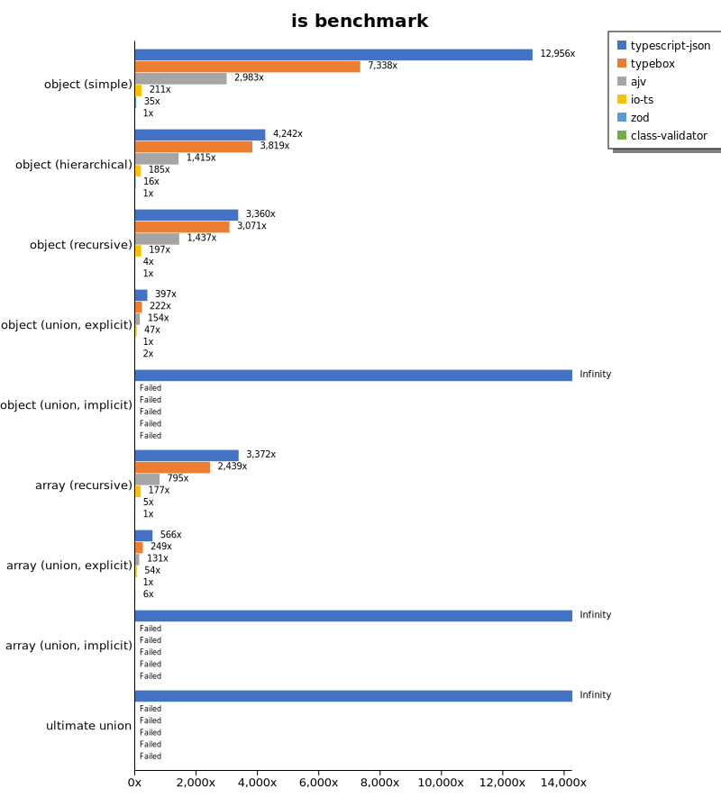
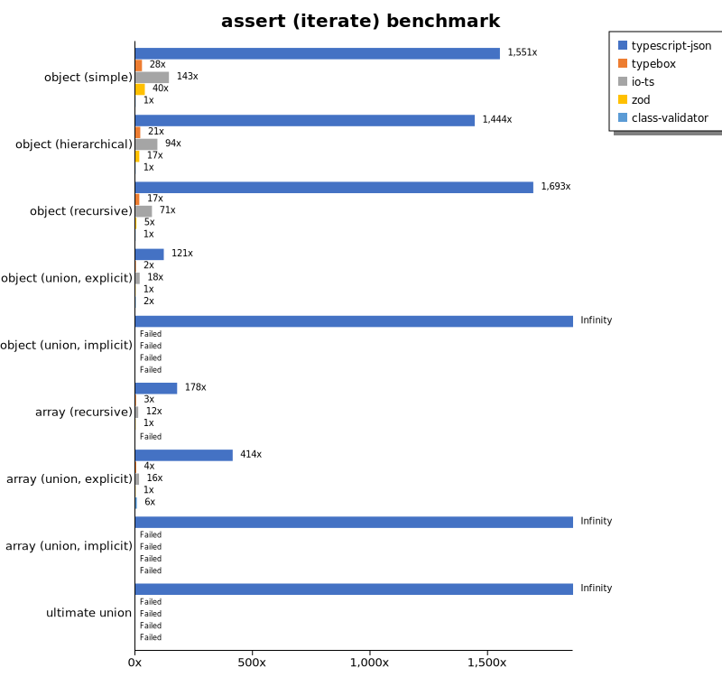
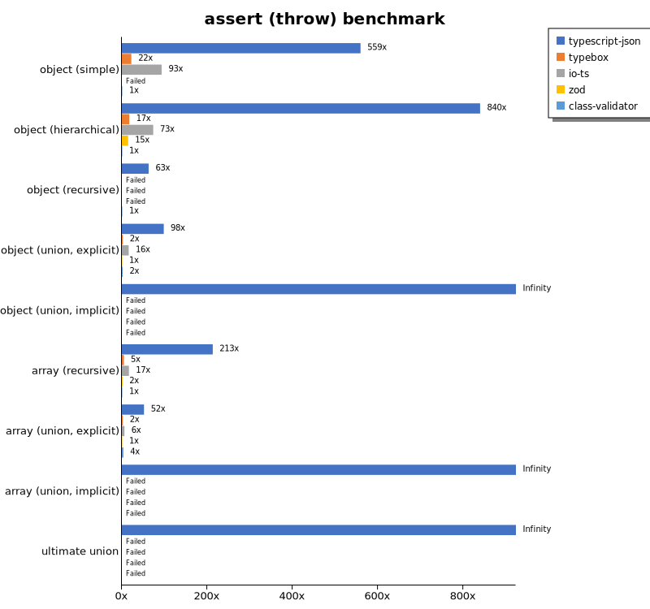
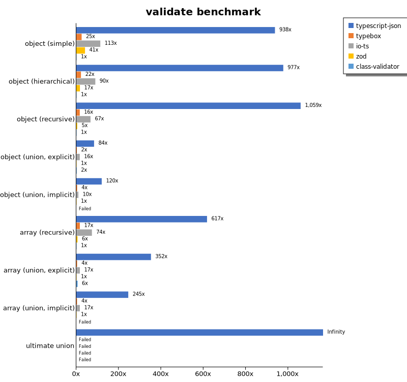
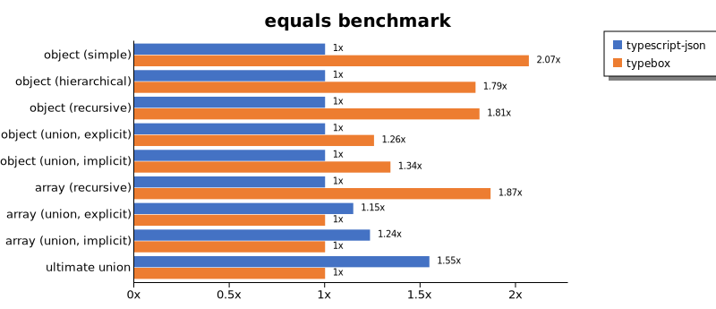
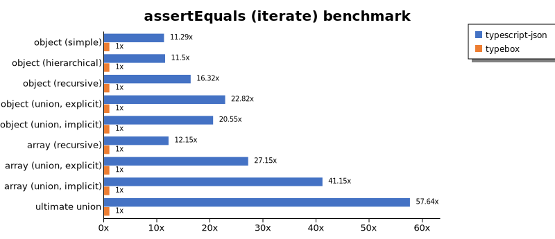
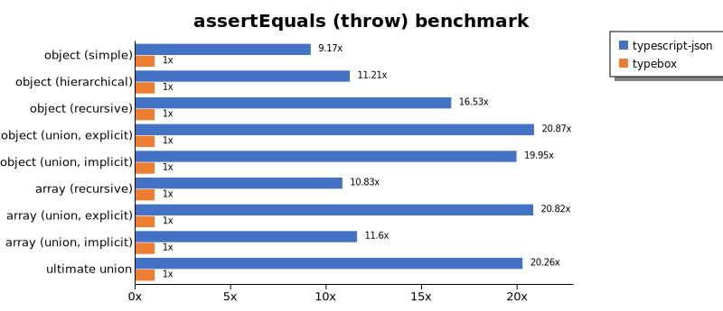
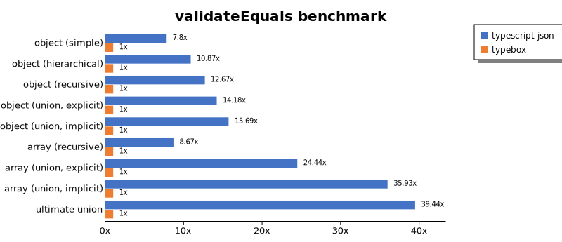
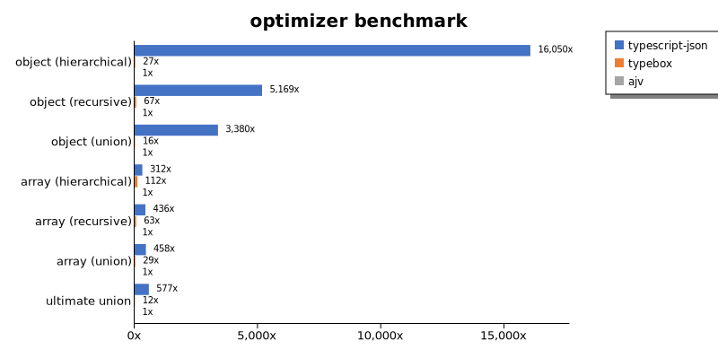
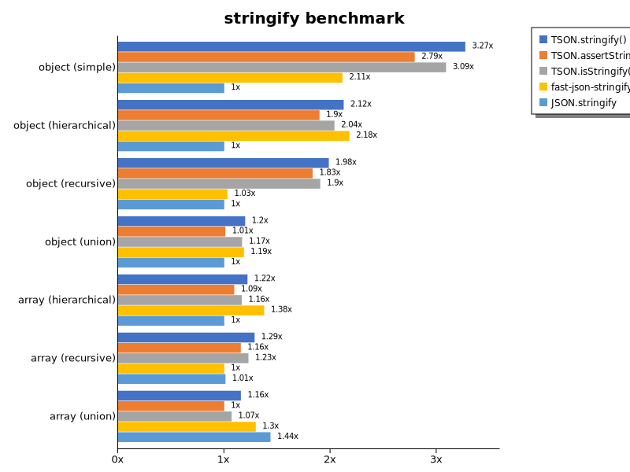

# Benchmark of `typescript-json`
> - CPU: Apple M1
> - Memory: 16,384 MB
> - OS: darwin
> - TypeScript-JSON version: 3.3.33

## is

 Components | typescript-json | typebox | ajv | io-ts | zod | class-validator 
------------|-----------------|---------|-----|-------|-----|-----------------
object (simple) | 260815.11829136277 | 147720.3164205064 | 60042.347002777264 | 4254.562096402215 | 698.8827544863861 | 20.131335578621908
object (hierarchical) | 169884.6665821501 | 152932.4445999266 | 56676.0065121232 | 7388.9505865806805 | 637.0887172931639 | 40.04533055198973
object (recursive) | 104905.62124190564 | 95873.10237167735 | 44855.19284386617 | 6145.282676833832 | 128.45426914477363 | 31.222592780649926
object (union, explicit) | 27302.462542605568 | 15283.211655549754 | 10563.35852851205 | 3218.7817161537005 | 68.76990109332732 | 119.74863598128687
object (union, implicit) | 34111.68763377071 | Failed | Failed | Failed | Failed | Failed
array (recursive) | 108578.28278676808 | 78530.3756189275 | 25593.279633279864 | 5700.392747564174 | 165.06051131030597 | 32.19616784145002
array (union, explicit) | 26015.625 | 11433.84578916103 | 6013.591209586993 | 2469.5083827343465 | 45.98721590909091 | 266.6516097240473
array (union, implicit) | 12066.32115981158 | Failed | Failed | Failed | Failed | Failed
ultimate union | 10159.764332965822 | Failed | Failed | Failed | Failed | Failed

 Unit: kilobytes/sec 

## assert (iterate)

 Components | typescript-json | typebox | io-ts | zod | class-validator 
------------|-----------------|---------|-------|-----|-----------------
object (simple) | 25591.710402945482 | 463.7657288014394 | 2356.318757425516 | 662.9317808968284 | 16.50335168986994
object (hierarchical) | 53919.221495005164 | 778.7413666213769 | 3497.9569402403235 | 624.1566629443514 | 37.34822576202718
object (recursive) | 51760.14065335753 | 513.677420499716 | 2156.393348623853 | 139.02941630269655 | 30.578444582642348
object (union, explicit) | 8714.332717293906 | 170.04453327621343 | 1319.2700190822143 | 72.08119393295561 | 125.91177555753373
object (union, implicit) | 9897.878457280678 | Failed | Failed | Failed | Failed
array (recursive) | 31222.113153377566 | 514.8993875511343 | 2120.895096341577 | 175.75075566450877 | Failed
array (union, explicit) | 17431.427148944054 | 153.29526305935218 | 656.6092620063046 | 42.10889283710492 | 266.37153746049455
array (union, implicit) | 12492.48945153768 | Failed | Failed | Failed | Failed
ultimate union | 4399.695006212038 | Failed | Failed | Failed | Failed

 Unit: kilobytes/sec 

## assert (throw)

 Components | typescript-json | typebox | io-ts | zod | class-validator 
------------|-----------------|---------|-------|-----|-----------------
object (simple) | 10340.918060791706 | 410.31813519840534 | 1722.6269182935985 | Failed | 18.490594379737477
object (hierarchical) | 38080.609423018715 | 790.33084143627 | 3332.652043610428 | 660.01554778084 | 45.35925641230797
object (recursive) | 8304.919226694916 | Failed | Failed | Failed | 132.416028414406
object (union, explicit) | 7572.551632436912 | 175.0851027754591 | 1232.2242677056136 | 77.12886674940246 | 138.12452228363122
object (union, implicit) | 8300.190669914318 | Failed | Failed | Failed | Failed
array (recursive) | 26924.22513110266 | 606.3984245653974 | 2087.3745161711627 | 197.05773768158178 | 126.41439775799586
array (union, explicit) | 5457.0720913684945 | 239.4838844922834 | 635.1335392441861 | 105.26804728453594 | 370.59990303283877
array (union, implicit) | 2562.7078329946426 | Failed | Failed | Failed | Failed
ultimate union | 4763.381946696627 | Failed | Failed | Failed | Failed

 Unit: kilobytes/sec 

## validate

 Components | typescript-json | typebox | io-ts | zod | class-validator 
------------|-----------------|---------|-------|-----|-----------------
object (simple) | 15173.284407307332 | 406.0742572593655 | 1832.7129172989376 | 664.8069759810243 | 16.17941275924256
object (hierarchical) | 36071.82053477795 | 811.2951071865587 | 3311.243279035702 | 628.9595103439327 | 36.91793078351366
object (recursive) | 32519.287766255606 | 500.76844262295083 | 2057.676274845508 | 138.20635852759278 | 30.70782636577926
object (union, explicit) | 6439.290684805937 | 180.37932445899773 | 1250.7232616231647 | 76.8452261217342 | 124.25757123806851
object (union, implicit) | 6859.063813265119 | 230.75821237585944 | 557.5297478793592 | 57.18714502082545 | Failed
array (recursive) | 19035.128157846208 | 515.3013621944392 | 2270.476598173516 | 179.57713317008853 | 30.84537436667292
array (union, explicit) | 14937.79591200821 | 166.72200767066946 | 710.0919511179828 | 42.377344337185264 | 264.8263100781543
array (union, implicit) | 9469.223884325045 | 135.459867194781 | 643.1872200247807 | 38.60208681911136 | Failed
ultimate union | 3672.0410050063433 | Failed | Failed | Failed | Failed

 Unit: kilobytes/sec 

## equals

 Components | typescript-json | typebox 
------------|-----------------|---------
object (simple) | 4233.133841131665 | 7447.789998559909
object (hierarchical) | 9561.315749044064 | 15027.718629332265
object (recursive) | 8689.328028880947 | 13636.381966523282
object (union, explicit) | 3810.169270833333 | 4112.033290417509
object (union, implicit) | 3438.185129509713 | 3727.628226902174
array (recursive) | 7821.191588785047 | 11665.16910272962
array (union, explicit) | 6845.596743261519 | 4845.934388265445
array (union, implicit) | 4569.793369520169 | 4048.139882675033
ultimate union | 5212.534498620055 | Failed

 Unit: kilobytes/sec 

## assertEquals (iterate)

 Components | typescript-json | typebox 
------------|-----------------|---------
object (simple) | 4823.9983458923 | 341.6951900558458
object (hierarchical) | 8402.854947627957 | 657.7381550105582
object (recursive) | 8166.653307072188 | 437.6892250281638
object (union, explicit) | 3190.510432634244 | 132.2435716966967
object (union, implicit) | 970.5192760243632 | 132.5759043542541
array (recursive) | 6811.740034054487 | 460.0976487896295
array (union, explicit) | 2088.0587232741436 | 139.10253758509833
array (union, implicit) | 1764.6770181373415 | 73.8441020876728
ultimate union | 3840.908766010979 | Failed

 Unit: kilobytes/sec 

## assertEquals (throw)

 Components | typescript-json | typebox 
------------|-----------------|---------
object (simple) | 3026.061491752764 | 321.0005733944954
object (hierarchical) | 7531.802267903286 | 636.71875
object (recursive) | 7503.609426872003 | 425.5390245610758
object (union, explicit) | 3206.704813238604 | 136.2291096446465
object (union, implicit) | 2943.366399333733 | 131.18102562465168
array (recursive) | 6605.982344102179 | 585.026780961675
array (union, explicit) | 2675.029417168253 | 123.26433961305761
array (union, implicit) | 1622.2123280460416 | 139.57295440821255
ultimate union | 3676.9146157117893 | Failed

 Unit: kilobytes/sec 

## validateEquals

 Components | typescript-json | typebox 
------------|-----------------|---------
object (simple) | 2918.6152068661977 | 332.47743183493
object (hierarchical) | 7668.346438017479 | 642.8295676202861
object (recursive) | 6500.457106581164 | 434.1860019509476
object (union, explicit) | 2257.386814337564 | 134.51369856919135
object (union, implicit) | 2096.220661332026 | 133.3407036163522
array (recursive) | 4972.980332861679 | 481.275644479443
array (union, explicit) | 3650.0053559186476 | 130.08960751731885
array (union, implicit) | 2970.2449672704447 | 72.98490926289237
ultimate union | 2801.4718267157746 | Failed

 Unit: kilobytes/sec 

## optimizer

 Components | typescript-json | typebox | ajv 
------------|-----------------|---------|-----
object (hierarchical) | 174191.81743421053 | 173.7640881147541 | 7.2181015653440115
object (recursive) | 108408.4752846557 | 1113.7820512820513 | 17.92962300495322
object (union) | 26531.580705599546 | 159.4674214417745 | 10.657035686481041
array (hierarchical) | 139380.9286581503 | 38763.60210769196 | 376.9355518958869
array (recursive) | 90293.47733818846 | 11175.502153294556 | 190.5990335982659
array (union) | 28313.896276595744 | 1882.634975653804 | 73.42770717270196
ultimate union | 10422.24542025862 | 215.59608612594366 | 20.97197998898476

 Unit: kilobytes/sec 

## stringify

 Components | TSON.stringify() | TSON.assertStringify() | TSON.isStringify() | fast-json-stringify | JSON.stringify 
------------|------------------|------------------------|--------------------|---------------------|----------------
object (simple) | 5672.483766233767 | 4845.539938668224 | 5357.918659109856 | 3665.9143801038526 | 1734.2905267038009
object (hierarchical) | 5553.934947945618 | 4958.5195748194365 | 5326.633130281853 | 5695.6297607195775 | 2613.7306317573975
object (recursive) | 5530.675410594698 | 5105.409608105612 | 5306.297825735159 | 2871.3907892883967 | 2786.6176357930817
object (union) | 2173.627585490642 | 1834.0232953252955 | 2120.4087146323127 | 2152.7140721714 | 1815.7551465177555
array (hierarchical) | 3667.5290412303666 | 3291.967054712091 | 3504.848813657407 | 4139.480665877209 | 3009.3105348055255
array (recursive) | 3343.7282057838943 | 3006.955673509561 | 3193.305473235784 | 2601.3587842242505 | 2631.414535319468
array (union) | 2661.663183974814 | 2301.6375409314173 | 2460.732276537565 | 2984.411162284762 | 3303.7984963801746

 Unit: KB/s 

