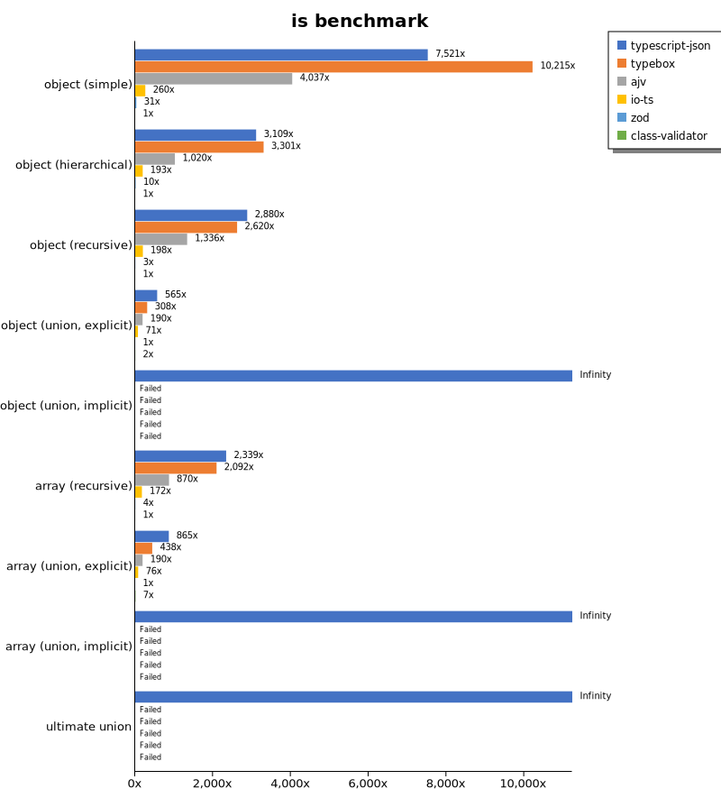
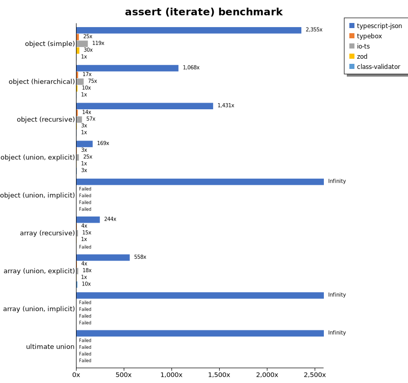
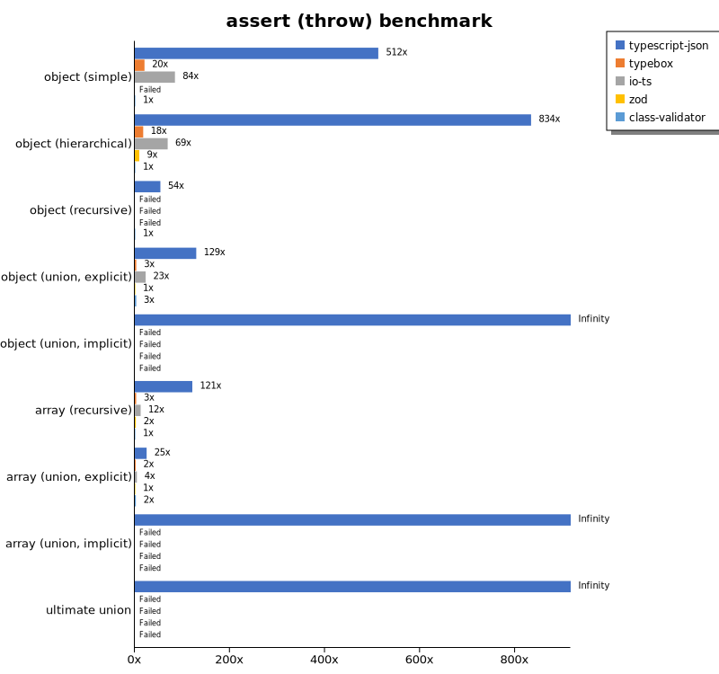
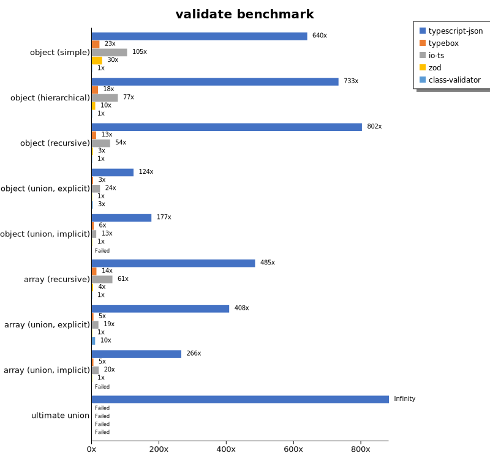
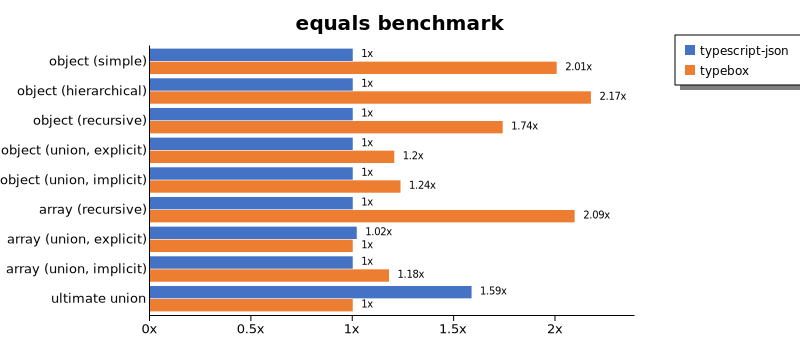
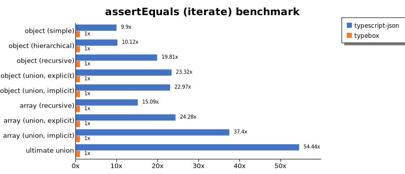
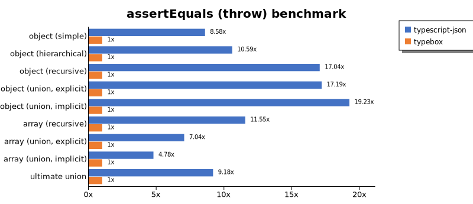
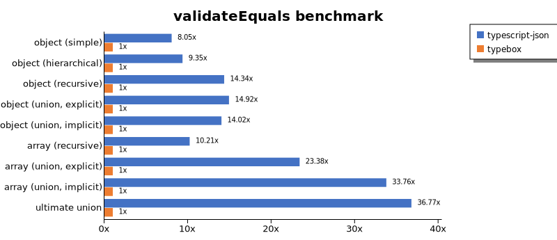
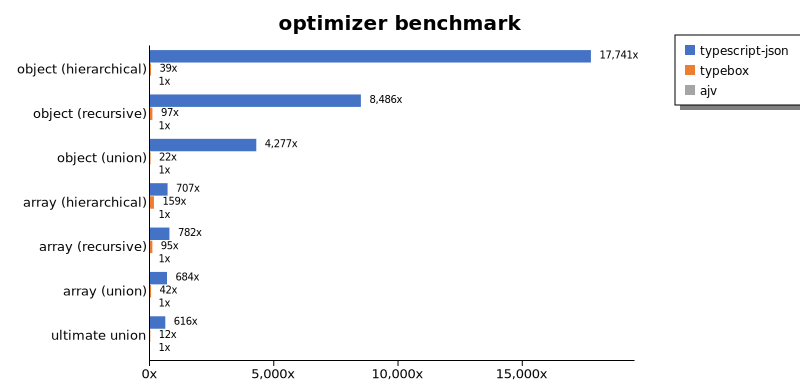
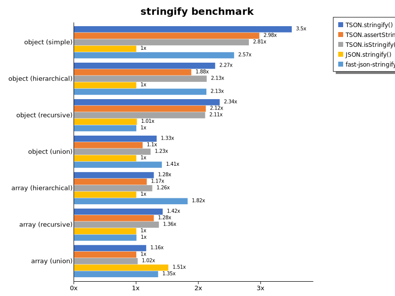

# Benchmark of `typescript-json`
> - CPU: Intel(R) Core(TM) M-5Y10c CPU @ 0.80GHz
> - Memory: 7,857 MB
> - OS: linux
> - TypeScript-JSON version: 3.3.20

## is

 Components | typescript-json | typebox | ajv | io-ts | zod | class-validator 
------------|-----------------|---------|-----|-------|-----|-----------------
object (simple) | 372598.2356184525 | 506043.18222540757 | 199978.8174617793 | 12890.390668394743 | 1542.8417460032333 | 49.53835227272728
object (hierarchical) | 48779.63362068966 | 51796.522050914304 | 16008.791208791208 | 3032.2407307898975 | 160.90146750524107 | 15.689810640216411
object (recursive) | 30344.325718496686 | 27606.14224137931 | 14075.890359873203 | 2082.0241139934233 | 30.243024302430243 | 10.536044362292053
object (union, explicit) | 8871.723368655885 | 4840.359237536656 | 2979.23875432526 | 1110.0487100847915 | 15.695471766191591 | 34.90304709141274
object (union, implicit) | 7702.108157653529 | Failed | Failed | Failed | Failed | Failed
array (recursive) | 2478.1138455758028 | 2216.833095577746 | 921.9539584503088 | 182.54691200582985 | 3.8475632099670207 | 1.0596962204168139
array (union, explicit) | 1408.9422028353326 | 713.8702054171969 | 309.5151294203427 | 124.37255995538204 | 1.6289592760180995 | 11.716669625421622
array (union, implicit) | 421.66666666666663 | Failed | Failed | Failed | Failed | Failed
ultimate union | 232.61435477872817 | Failed | Failed | Failed | Failed | Failed

## assertType (iterate)

 Components | typescript-json | typebox | io-ts | zod | class-validator 
------------|-----------------|---------|-------|-----|-----------------
object (simple) | 109839.14693656244 | 1161.236885698509 | 5539.628091713306 | 1377.245508982036 | 46.634967081199704
object (hierarchical) | 17066.058801637515 | 270.8521802062602 | 1199.0149580445093 | 160.59957173447538 | 15.980896399706099
object (recursive) | 15127.81954887218 | 143.66197183098592 | 603.4359341445955 | 31.686156167483972 | 10.571216617210682
object (union, explicit) | 2674.497847919656 | 52.54515599343186 | 391.1151405258387 | 15.798382546548806 | 42.608858157353765
object (union, implicit) | 2255.813953488372 | Failed | Failed | Failed | Failed
array (recursive) | 956.368754398311 | 14.546810891458412 | 59.610027855153206 | 3.91425908667288 | Failed
array (union, explicit) | 905.4203539823009 | 7.218212104386453 | 29.04109589041096 | 1.6236694930543027 | 15.584415584415584
array (union, implicit) | 387.1831488754016 | Failed | Failed | Failed | Failed
ultimate union | 111.59263271939327 | Failed | Failed | Failed | Failed

## assertType (throw)

 Components | typescript-json | typebox | io-ts | zod | class-validator 
------------|-----------------|---------|-------|-----|-----------------
object (simple) | 27628.904084272777 | 1098.6929342678538 | 4555.5968761621425 | Failed | 53.937432578209275
object (hierarchical) | 14908.75912408759 | 315.80902842281256 | 1236.6498032602585 | 167.4730182359509 | 17.882689556509302
object (recursive) | 1939.1083725987678 | Failed | Failed | Failed | 36.03603603603604
object (union, explicit) | 2326.820603907638 | 55.56584552694943 | 409.3784890212133 | 17.998560115190784 | 54.81454412570802
object (union, implicit) | 1948.6432343835368 | Failed | Failed | Failed | Failed
array (recursive) | 729.1082445316881 | 17.39432944859976 | 73.88252678241597 | 12.960082944530846 | 6.026274557068819
array (union, explicit) | 200.14556040756912 | 14.976785981728321 | 34.80076561684357 | 8.045699573577922 | 17.724211272598367
array (union, implicit) | 71.76175098672408 | Failed | Failed | Failed | Failed
ultimate union | 128.22861329913903 | Failed | Failed | Failed | Failed

## validate

 Components | typescript-json | typebox | io-ts | zod | class-validator 
------------|-----------------|---------|-------|-----|-----------------
object (simple) | 29775.64929084546 | 1047.2267984623832 | 4866.617808721143 | 1414.6880176697957 | 46.53284671532847
object (hierarchical) | 11799.814126394052 | 293.08153259487926 | 1243.4652725914862 | 161.60681229174378 | 16.102165463631316
object (recursive) | 8606.717226435536 | 134.43526170798899 | 580.1074273013521 | 31.16735927465055 | 10.726383138878434
object (union, explicit) | 1937.669376693767 | 54.64895635673625 | 376.983403246398 | 15.655929458340829 | 40.394973070017954
object (union, implicit) | 1584.7457627118642 | 49.90654205607477 | 116.30495269894269 | 8.956894943086397 | Failed
array (recursive) | 522.2141296431173 | 14.620431115276478 | 65.73033707865169 | 3.9429215170859937 | 1.0770059235325795
array (union, explicit) | 673.5760320501655 | 7.871064467766116 | 32.14890016920474 | 1.6510731975784263 | 15.83411875589067
array (union, implicit) | 285.7664233576642 | 4.97787610619469 | 21.963581753332083 | 1.0758472296933834 | Failed
ultimate union | 74.83612527312455 | Failed | Failed | Failed | Failed

## equals

 Components | typescript-json | typebox 
------------|-----------------|---------
object (simple) | 10690.817656919353 | 21443.780554046716
object (hierarchical) | 3370.6691109074245 | 7330.220395965633
object (recursive) | 2575.309554610978 | 4480.014803849001
object (union, explicit) | 1101.9748653500897 | 1327.6139410187668
object (union, implicit) | 731.297434044091 | 903.5577258458319
array (recursive) | 200.3257328990228 | 419.57255343082113
array (union, explicit) | 282.80254777070064 | 277.29699871110296
array (union, implicit) | 142.06576125804145 | 167.4730182359509
ultimate union | 121.22874382885354 | 76.43312101910827

## assertEquals (iterate)

 Components | typescript-json | typebox 
------------|-----------------|---------
object (simple) | 8071.187013865405 | 815.6233086776114
object (hierarchical) | 2621.8951241950326 | 258.9604053293301
object (recursive) | 2485.1872554499723 | 125.46468401486987
object (union, explicit) | 961.3170205109752 | 41.23144584936779
object (union, implicit) | 687.365010799136 | 29.920963492660896
array (recursive) | 192.6605504587156 | 12.768319763138416
array (union, explicit) | 163.2042253521127 | 6.721433905899925
array (union, implicit) | 104.28100987925356 | 2.7881040892193307
ultimate union | 89.78218523109615 | 1.6492578339747115

## assertEquals (throw)

 Components | typescript-json | typebox 
------------|-----------------|---------
object (simple) | 7494.059586912813 | 873.119078580717
object (hierarchical) | 2715.5093858210316 | 256.50421399780134
object (recursive) | 2204.553668232743 | 129.34220251293422
object (union, explicit) | 918.8902632974024 | 53.46640527535199
object (union, implicit) | 644.9301325689717 | 33.5345405767941
array (recursive) | 200.18198362147407 | 17.334026694401107
array (union, explicit) | 108.16657652785291 | 15.353907569476434
array (union, implicit) | 53.285968028419184 | 11.153245594467991
ultimate union | 89.6700143472023 | 9.773260359655982

## validateEquals

 Components | typescript-json | typebox 
------------|-----------------|---------
object (simple) | 7057.7375565610855 | 876.8382352941176
object (hierarchical) | 2358.6026200873366 | 252.21238938053094
object (recursive) | 1771.157009687443 | 123.51632047477744
object (union, explicit) | 627.8947368421052 | 42.093287827076225
object (union, implicit) | 430.43705380463166 | 30.71090047393365
array (recursive) | 138.0753138075314 | 13.526207026113092
array (union, explicit) | 143.19419237749548 | 6.125858548357156
array (union, implicit) | 93.91867578265563 | 2.7818991097922847
ultimate union | 60.79247331282794 | 1.653499908138894

## optimizer

 Components | typescript-json | typebox | ajv 
------------|-----------------|---------|-----
object (hierarchical) | 32251.189008279023 | 70.45009784735812 | 1.8178512997636793
object (recursive) | 27928.520877565465 | 318.79256396097924 | 3.291278113000548
object (union) | 7148.450244698205 | 37.244621225818115 | 1.6713091922005572
array (hierarchical) | 1701.9478133039324 | 381.75359880351465 | 2.4060707014621507
array (recursive) | 2597.3418195432423 | 315.02513498417426 | 3.3222591362126246
array (union) | 1528.3257918552035 | 94.903988183161 | 2.2354694485842024
ultimate union | 219.00610287707062 | 4.439511653718092 | 0.35568202027387513

## stringify

 Components | TSON.stringify() | TSON.assertStringify() | TSON.isStringify() | JSON.stringify() | fast-json-stringify 
------------|------------------|------------------------|--------------------|------------------|---------------------
object (simple) | 14565.67680816178 | 12396.520478434215 | 11695.943498732342 | 4166.052340582381 | 10707.01093778017
object (hierarchical) | 2241.628959276018 | 1862.616310892173 | 2107.7265973254084 | 989.3811790552911 | 2102.795145273998
object (recursive) | 1964.8995838610458 | 1777.5092936802973 | 1768.7740132727909 | 848.110599078341 | 840.1976935749587
object (union) | 508.7040618955512 | 422.12518195050944 | 471.27867686288454 | 383.4187408491947 | 540.5164737310774
array (hierarchical) | 38.113809608225495 | 34.749729924378826 | 37.37985048059807 | 29.75420439844761 | 54.26497277676951
array (recursive) | 100.55970149253731 | 90.49023221525985 | 96.25069949636263 | 70.63814090741424 | 70.79318013343217
array (union) | 121.61680911680912 | 104.96531580868931 | 107.22328078988394 | 158.91116424498804 | 141.71511627906978

