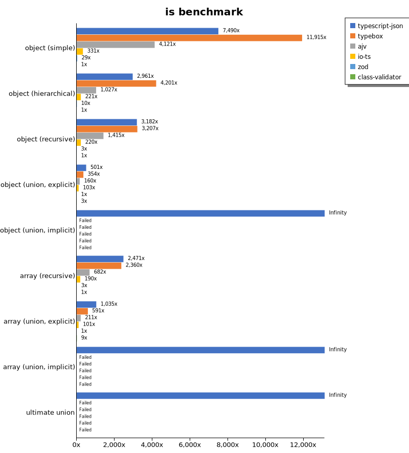
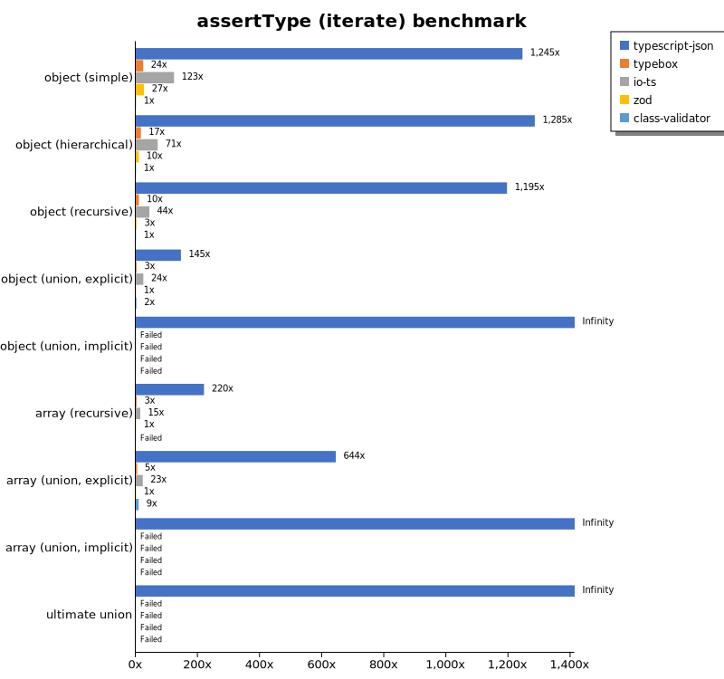
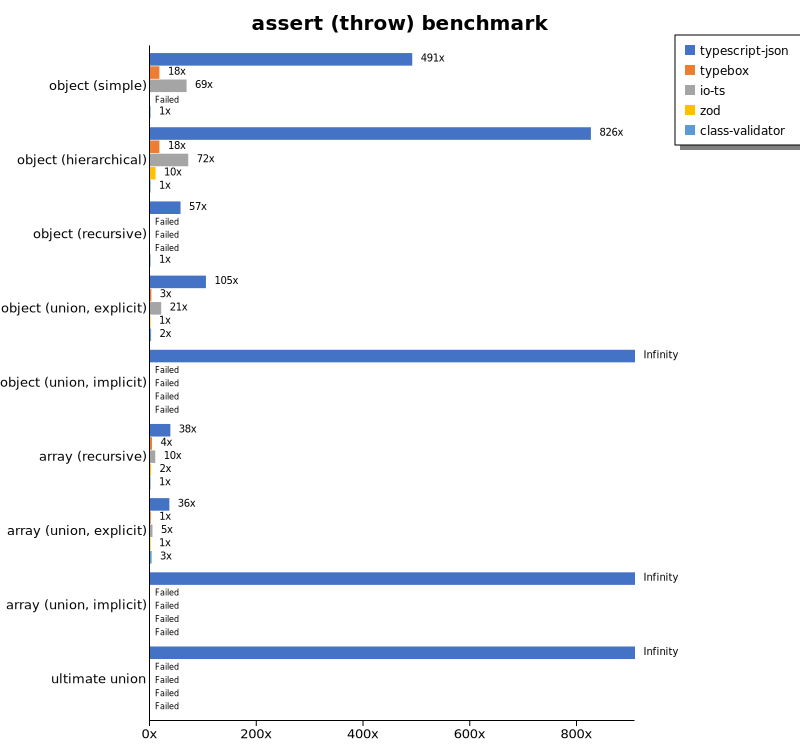
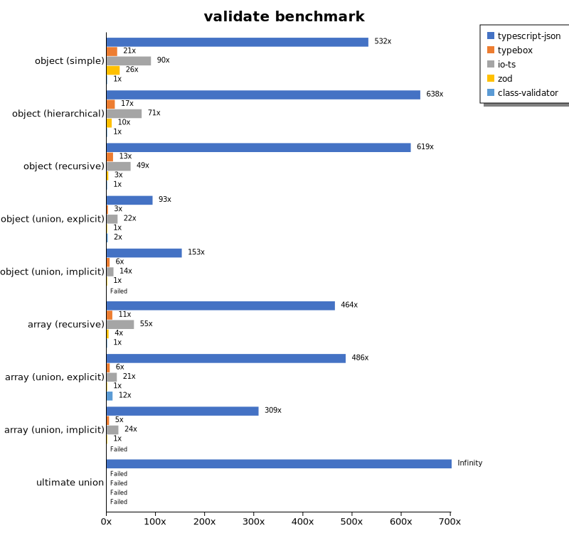
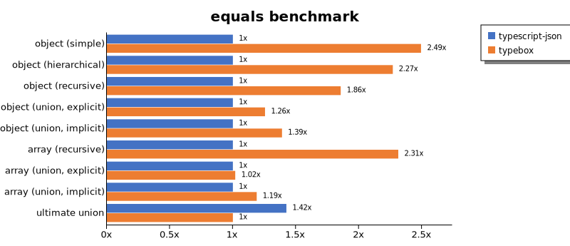
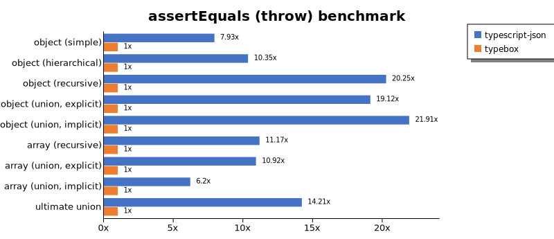
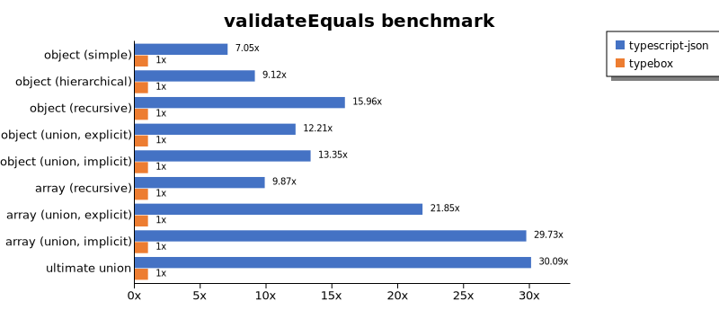
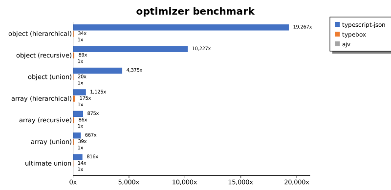
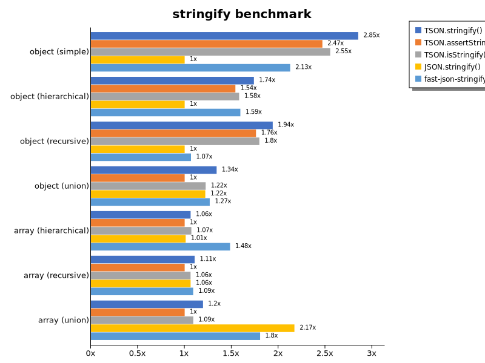

# Benchmark of `typescript-json`
> - CPU: Intel(R) Core(TM) i5-1035G4 CPU @ 1.10GHz
> - Memory: 7,509 MB
> - OS: linux
> - TypeScript-JSON version: 3.3.20

## is

 Components | typescript-json | typebox | ajv | io-ts | zod | class-validator 
------------|-----------------|---------|-----|-------|-----|-----------------
object (simple) | 822263.2620032369 | 1308092.4354243542 | 452456.81986656785 | 36292.58920402562 | 3228.1118625479803 | 109.78184377199156
object (hierarchical) | 108658.34575260803 | 154157.43280307186 | 37700.036140224074 | 8107.021618724315 | 369.71830985915494 | 36.698922767938654
object (recursive) | 67740.5504587156 | 68261.87961985216 | 30130.89295618414 | 4689.546716003701 | 63.86433339346924 | 21.288515406162464
object (union, explicit) | 13934.380257992147 | 9856.905771713075 | 4456.133897369873 | 2878.5768072289156 | 27.82324058919804 | 72.79411764705881
object (union, implicit) | 14460.560747663552 | Failed | Failed | Failed | Failed | Failed
array (recursive) | 5503.968253968254 | 5255.102040816327 | 1518.0188504897433 | 422.37865876250464 | 7.64748725418791 | 2.2271714922049
array (union, explicit) | 2865.3234358430536 | 1635.604232411361 | 585.030269675289 | 279.9177262528048 | 2.767527675276753 | 25.66009669021941
array (union, implicit) | 1503.850385038504 | Failed | Failed | Failed | Failed | Failed
ultimate union | 453.08799417015854 | Failed | Failed | Failed | Failed | Failed

## assertType (iterate)

 Components | typescript-json | typebox | io-ts | zod | class-validator 
------------|-----------------|---------|-------|-----|-----------------
object (simple) | 121929.87974098057 | 2346.5181058495823 | 12069.974083672714 | 2614.0964298859035 | 97.916282500461
object (hierarchical) | 43809.255079006776 | 565.7703488372093 | 2407.678244972578 | 334.2696629213483 | 34.09726103968698
object (recursive) | 28973.743435858967 | 244.04873477038427 | 1065.3061224489797 | 66.57814871016691 | 24.239007891770008
object (union, explicit) | 4187.770562770563 | 87.03738143946438 | 702.5175860792299 | 28.79187053067369 | 71.74151150054765
object (union, implicit) | 4363.636363636364 | Failed | Failed | Failed | Failed
array (recursive) | 1835.6720827178729 | 26.553672316384183 | 121.58341187558906 | 8.356545961002785 | Failed
array (union, explicit) | 1774.8603351955305 | 12.711864406779661 | 62.3229461756374 | 2.7548209366391183 | 25.64579074521464
array (union, implicit) | 901.6605166051661 | Failed | Failed | Failed | Failed
ultimate union | 203.0198289976351 | Failed | Failed | Failed | Failed

## assertType (throw)

 Components | typescript-json | typebox | io-ts | zod | class-validator 
------------|-----------------|---------|-------|-----|-----------------
object (simple) | 53790.546802594996 | 1926.674148896371 | 7504.200112002986 | Failed | 109.48905109489051
object (hierarchical) | 29851.86574160885 | 637.8986866791745 | 2588.1470367591896 | 372.43947858473 | 36.140224069389234
object (recursive) | 3140.680170971938 | Failed | Failed | Failed | 54.904831625183014
object (union, explicit) | 3729.820003711264 | 91.50805270863836 | 745.5731593662628 | 35.593521978999824 | 73.88252678241597
object (union, implicit) | 3124.9999999999995 | Failed | Failed | Failed | Failed
array (recursive) | 353.9493293591654 | 34.62603878116344 | 91.64222873900293 | 15.595757953836555 | 9.279881217520417
array (union, explicit) | 422.01834862385317 | 17.20282126268708 | 54.02485143165856 | 11.640088464672333 | 35.00175008750438
array (union, implicit) | 144.79638009049773 | Failed | Failed | Failed | Failed
ultimate union | 203.1769486516439 | Failed | Failed | Failed | Failed

## validate

 Components | typescript-json | typebox | io-ts | zod | class-validator 
------------|-----------------|---------|-------|-----|-----------------
object (simple) | 52139.24761370017 | 2089.205397301349 | 8821.536144578313 | 2589.2923304927754 | 97.91477787851315
object (hierarchical) | 20957.142857142855 | 542.8145941921072 | 2337.1011850501363 | 335.016835016835 | 32.83858998144713
object (recursive) | 13312.675528927168 | 277.9137638862738 | 1046.8577728776186 | 69.8329266003379 | 21.513493111907906
object (union, explicit) | 3189.6299010626603 | 87.60361718161266 | 757.0888468809073 | 34.16091095762553 | 73.79375591296122
object (union, implicit) | 2908.615717375631 | 112.64150943396227 | 262.90110714955904 | 19.033401754058595 | Failed
array (recursive) | 1015.5279503105589 | 25.08827355510128 | 121.2633953750705 | 8.370535714285714 | 2.186588921282799
array (union, explicit) | 1359.5978062157221 | 17.31198808637379 | 57.69230769230769 | 2.7953783078643313 | 33.419977720014856
array (union, implicit) | 681.9176084578928 | 10.680157391793143 | 52.534562211981566 | 2.2062879205736348 | Failed
ultimate union | 116.03339580848527 | Failed | Failed | Failed | Failed

## equals

 Components | typescript-json | typebox 
------------|-----------------|---------
object (simple) | 16586.148648648646 | 41352.079135372784
object (hierarchical) | 5362.100624311422 | 12168.239866740701
object (recursive) | 4104.887424492037 | 7617.863199547766
object (union, explicit) | 1776.9230769230767 | 2230.1659675360206
object (union, implicit) | 1181.618051733627 | 1642.2913980475223
array (recursive) | 325.14212360168716 | 751.9480519480519
array (union, explicit) | 461.6206589492431 | 470.30237580993514
array (union, implicit) | 262.43194192377496 | 312.07674943566593
ultimate union | 201.81323662737987 | 141.65446559297217

## assertEquals (iterate)

 Components | typescript-json | typebox 
------------|-----------------|---------
object (simple) | 13213.781877373847 | 1508.7209302325582
object (hierarchical) | 4378.438661710037 | 479.78042086001835
object (recursive) | 4646.171045276691 | 242.39543726235743
object (union, explicit) | 1812.0176405733184 | 75.95638514137868
object (union, implicit) | 1376.5558238900242 | 55.55555555555556
array (recursive) | 437.5233121969414 | 23.363619506768032
array (union, explicit) | 317.4136664217487 | 11.826544021024969
array (union, implicit) | 202.90635091496233 | 5.00277932184547
ultimate union | 168.2795698924731 | 3.333333333333333

## assertEquals (throw)

 Components | typescript-json | typebox 
------------|-----------------|---------
object (simple) | 13530.066815144766 | 1705.6795499909272
object (hierarchical) | 4960.787889841328 | 479.52784950202874
object (recursive) | 4491.017964071856 | 221.72949002217294
object (union, explicit) | 1755.3286763388858 | 91.79364787956673
object (union, implicit) | 1224.7838616714698 | 55.89714924538849
array (recursive) | 389.89974006683997 | 34.91010647582475
array (union, explicit) | 184.50184501845018 | 16.903313049357674
array (union, implicit) | 90.57971014492753 | 14.61560947091494
ultimate union | 163.36903249228533 | 11.499540018399264

## validateEquals

 Components | typescript-json | typebox 
------------|-----------------|---------
object (simple) | 12373.919308357352 | 1755.3191489361702
object (hierarchical) | 4605.579161278403 | 505.19750519750517
object (recursive) | 3353.6226553880106 | 210.17699115044246
object (union, explicit) | 1143.3453237410072 | 93.66183938311077
object (union, implicit) | 852.1567925541436 | 63.829787234042556
array (recursive) | 230.30191458026508 | 23.33965844402277
array (union, explicit) | 246.5753424657534 | 11.284558961820576
array (union, implicit) | 151.48305084745763 | 5.095301000188714
ultimate union | 100.40947124799715 | 3.336422613531047

## optimizer

 Components | typescript-json | typebox | ajv 
------------|-----------------|---------|-----
object (hierarchical) | 70651.53153153154 | 125.82176771365961 | 3.6670333700036672
object (recursive) | 66733.7530087021 | 577.749219753993 | 6.525285481239804
object (union) | 14450.602409638555 | 66.32198252807987 | 3.303358414387961
array (hierarchical) | 5142.326962330673 | 802.1895054737637 | 4.572891896835559
array (recursive) | 5763.279659448455 | 565.1767346175425 | 6.589785831960461
array (union) | 3094.2418070727645 | 179.8814375694702 | 4.637358560563903
ultimate union | 445.6622701096043 | 7.889908256880734 | 0.5464480874316939

## stringify

 Components | TSON.stringify() | TSON.assertStringify() | TSON.isStringify() | JSON.stringify() | fast-json-stringify 
------------|------------------|------------------------|--------------------|------------------|---------------------
object (simple) | 24930.77201884741 | 21587.481426448736 | 22315.307057745187 | 8741.59161918765 | 18582.856087197488
object (hierarchical) | 3746.8779123951535 | 3321.244477172312 | 3406.7984481803064 | 2154.9321939438973 | 3435.5253490080822
object (recursive) | 3553.5976505139497 | 3226.510067114094 | 3291.9599851796966 | 1832.1167883211679 | 1955.2126458411742
object (union) | 976.9473879903328 | 728.4994602374956 | 891.7185782337853 | 888.8472352389879 | 923.3134382347622
array (hierarchical) | 186.24489070552693 | 175.12783053323594 | 187.6240303084972 | 177.01404286770142 | 259.959610794933
array (recursive) | 165.30003727171078 | 149.37371471303047 | 158.76288659793815 | 158.82678472606528 | 162.94896030245746
array (union) | 201.0355293697554 | 168.1257816687511 | 183.55359765051395 | 364.9952696310312 | 303.4623217922607

