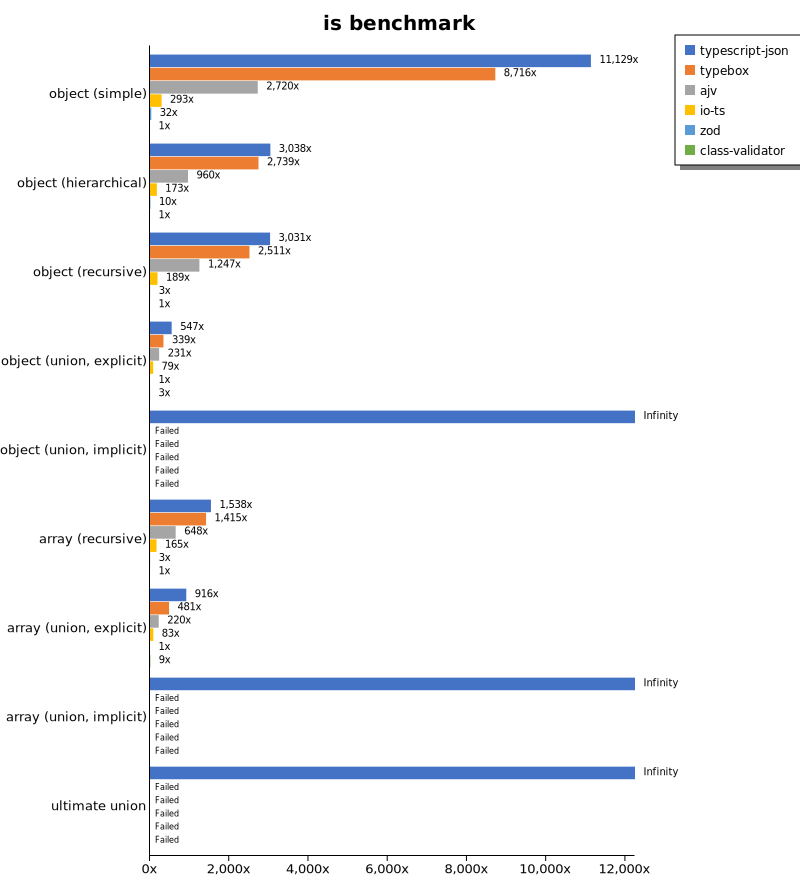
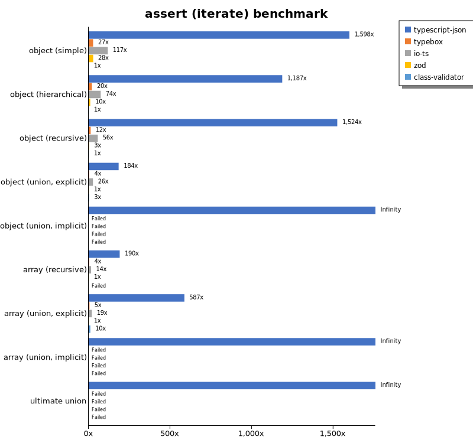
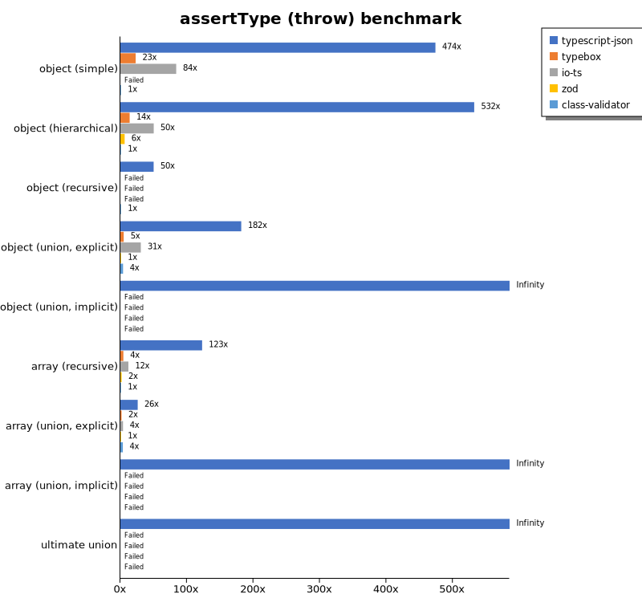
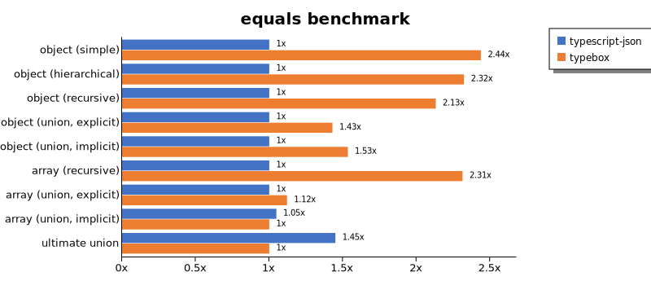
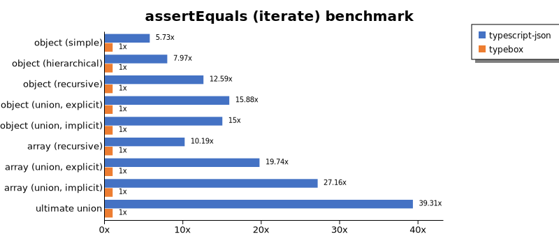
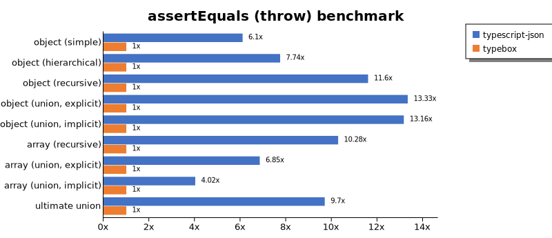
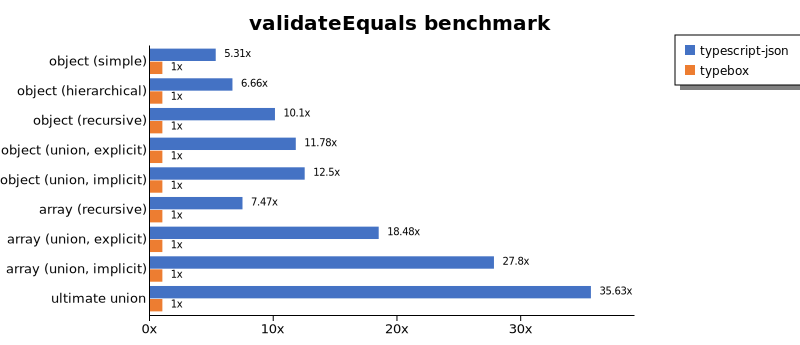
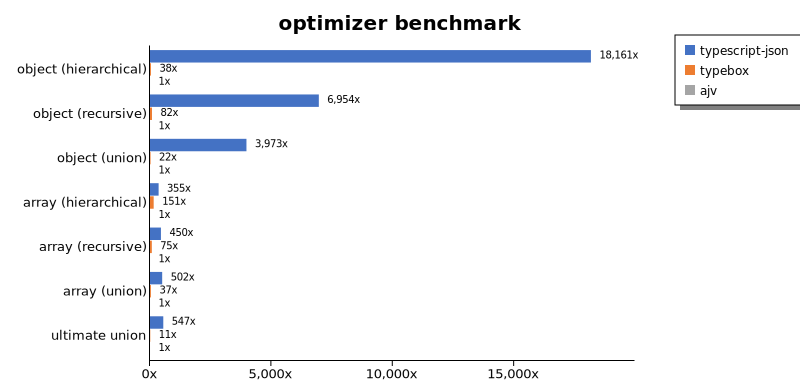
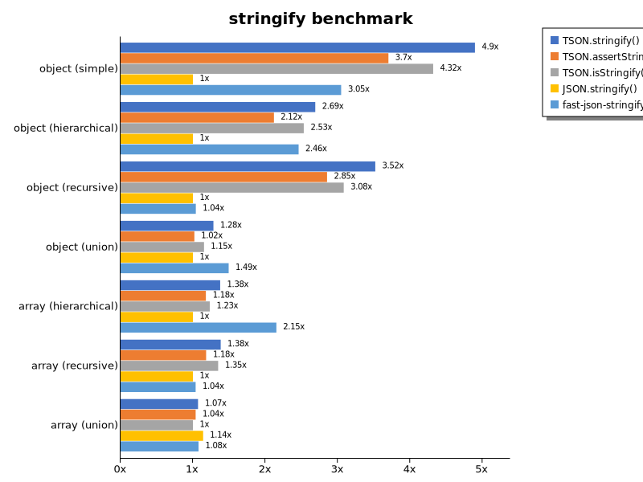

# Benchmark of `typescript-json`
> - CPU: Intel(R) Core(TM) i5-8265U CPU @ 1.60GHz
> - Memory: 15,702 MB
> - OS: linux
> - TypeScript-JSON version: 3.3.20

## is

 Components | typescript-json | typebox | ajv | io-ts | zod | class-validator 
------------|-----------------|---------|-----|-------|-----|-----------------
object (simple) | 740343.4798270894 | 579831.9004938724 | 180923.0769230769 | 19511.819887429643 | 2153.997848691287 | 66.52244456462954
object (hierarchical) | 76266.64173522813 | 68745.59287437372 | 24107.781087118394 | 4350.137488542621 | 253.34538878842676 | 25.102367811999287
object (recursive) | 45046.995945447845 | 37322.61580381472 | 18532.42891655826 | 2805.869485964273 | 49.62825278810409 | 14.862385321100916
object (union, explicit) | 11102.708803611738 | 6880.505415162455 | 4683.757553561619 | 1597.3333333333335 | 20.285087719298243 | 58.37424986361157
object (union, implicit) | 9295.09090909091 | Failed | Failed | Failed | Failed | Failed
array (recursive) | 2497.972723921858 | 2298.0349344978167 | 1051.7594488921986 | 267.81778104335046 | 5.5452865064695 | 1.6236694930543027
array (union, explicit) | 2032.2402358142963 | 1066.9247787610618 | 488.9380530973451 | 183.4793958605258 | 2.2193452931385242 | 20.327498588368154
array (union, implicit) | 960.9418800224257 | Failed | Failed | Failed | Failed | Failed
ultimate union | 291.62916291629165 | Failed | Failed | Failed | Failed | Failed

## assert (iterate)

 Components | typescript-json | typebox | io-ts | zod | class-validator 
------------|-----------------|---------|-------|-----|-----------------
object (simple) | 105964.28571428571 | 1797.8201634877387 | 7760.9783212896045 | 1828.457205160821 | 66.29834254143647
object (hierarchical) | 28285.39904376609 | 466.52150244964616 | 1753.694581280788 | 230.47375160051217 | 23.836549375709424
object (recursive) | 24118.789689951438 | 191.89765458422175 | 881.1150083071811 | 48.42342342342342 | 15.825169555388094
object (union, explicit) | 4049.775449101796 | 78.71559633027523 | 575.0088245675962 | 22.062983217046956 | 60.92237616245966
object (union, implicit) | 3394.8852952237685 | Failed | Failed | Failed | Failed
array (recursive) | 1171.5388858246001 | 22.560631697687537 | 88.70818702642765 | 6.162464985994397 | Failed
array (union, explicit) | 1309.17242667663 | 10.526315789473683 | 42.476873702095524 | 2.2313127556712535 | 22.693726937269375
array (union, implicit) | 698.1167257132201 | Failed | Failed | Failed | Failed
ultimate union | 147.63886375972498 | Failed | Failed | Failed | Failed

## assert (throw)

 Components | typescript-json | typebox | io-ts | zod | class-validator 
------------|-----------------|---------|-------|-----|-----------------
object (simple) | 35055.97014925373 | 1701.6449234259785 | 6211.412535079514 | Failed | 73.97817643795081
object (hierarchical) | 18782.192788815304 | 493.0779442442633 | 1769.7466467958272 | 226.37238256932653 | 35.29204164460914
object (recursive) | 2662.504590525156 | Failed | Failed | Failed | 53.219797764768494
object (union, explicit) | 3329.0885937784246 | 91.7094644167278 | 562.7462014631401 | 18.311664530305805 | 73.52941176470587
object (union, implicit) | 2719.8211624441133 | Failed | Failed | Failed | Failed
array (recursive) | 950.1187648456057 | 34.68007629616785 | 93.26618168252192 | 14.727540500736378 | 7.727975270479134
array (union, explicit) | 241.05321713332097 | 16.78133915086424 | 36.496350364963504 | 9.250693802035153 | 34.42933379239111
array (union, implicit) | 91.49130832570907 | Failed | Failed | Failed | Failed
ultimate union | 167.31734523145568 | Failed | Failed | Failed | Failed

## validate

 Components | typescript-json | typebox | io-ts | zod | class-validator 
------------|-----------------|---------|-------|-----|-----------------
object (simple) | 54765.83710407239 | 1647.5095785440612 | 7242.809114680613 | 1857.5297941495123 | 70.6146086306744
object (hierarchical) | 18742.826204656198 | 463.2434429257481 | 1718.2662538699692 | 225.547035720965 | 22.80501710376283
object (recursive) | 15190.399137001079 | 195.94594594594594 | 845.8224053952791 | 47.77251184834123 | 15.145848915482423
object (union, explicit) | 2834.154929577465 | 87.91832104367556 | 566.8023686158401 | 20.802098950524737 | 59.293044469783354
object (union, implicit) | 2517.657992565056 | 80.42288087596754 | 170.90770983668818 | 10.138941043935413 | Failed
array (recursive) | 750.1389146138174 | 23.007856341189676 | 86.29825889477668 | 6.180932758943623 | 1.6108824055843924
array (union, explicit) | 1012.9870129870128 | 11.271839188427577 | 45.02279635258358 | 2.181025081788441 | 22.100491122024934
array (union, implicit) | 479.59183673469386 | 7.329449351625634 | 32.68833364643998 | 1.6274864376130198 | Failed
ultimate union | 105.76923076923077 | Failed | Failed | Failed | Failed

## equals

 Components | typescript-json | typebox 
------------|-----------------|---------
object (simple) | 12093.22974472808 | 29477.375565610855
object (hierarchical) | 3504.409832989304 | 8140.969162995594
object (recursive) | 2250.8379888268155 | 4797.232472324724
object (union, explicit) | 1241.551246537396 | 1774.5864388293037
object (union, implicit) | 728.708303761533 | 1117.9856115107914
array (recursive) | 196.95321001088138 | 455.5575835006388
array (union, explicit) | 297.2826086956522 | 333.1494760066189
array (union, implicit) | 217.15100730968084 | 207.1583514099783
ultimate union | 138.43705799151346 | 95.5137481910275

## assertEquals (iterate)

 Components | typescript-json | typebox 
------------|-----------------|---------
object (simple) | 7550.099295901788 | 1316.633266533066
object (hierarchical) | 3096.1325966850827 | 388.5608856088561
object (recursive) | 2130.634774609016 | 169.28920238741185
object (union, explicit) | 973.4660033167496 | 61.2927191679049
object (union, implicit) | 728.579325594251 | 48.578422142722644
array (recursive) | 195.38745387453872 | 19.176536943034403
array (union, explicit) | 190.71699476250677 | 9.662751042061387
array (union, implicit) | 122.32905982905983 | 4.504504504504505
ultimate union | 109.87849973586898 | 2.7953783078643313

## assertEquals (throw)

 Components | typescript-json | typebox 
------------|-----------------|---------
object (simple) | 7673.0459667322475 | 1258.5600592263559
object (hierarchical) | 2840.3884918453364 | 366.90515501742806
object (recursive) | 1944.0406976744189 | 167.6602086438152
object (union, explicit) | 973.1913330885053 | 72.99270072992701
object (union, implicit) | 714.2857142857143 | 54.269175108538356
array (recursive) | 185.0481125092524 | 17.995321216483713
array (union, explicit) | 110.47689191677408 | 16.13163413453783
array (union, implicit) | 54.30847212165097 | 13.5080372821829
ultimate union | 109.60906101571062 | 11.304544426859596

## validateEquals

 Components | typescript-json | typebox 
------------|-----------------|---------
object (simple) | 7043.061396131202 | 1325.8633357825129
object (hierarchical) | 2647.914142288385 | 397.34728189800114
object (recursive) | 1820.151679306609 | 180.22598870056498
object (union, explicit) | 767.8386763185109 | 65.1681148469966
object (union, implicit) | 551.3201608672845 | 44.10101771579344
array (recursive) | 151.54807170016295 | 20.274075464614228
array (union, explicit) | 168.13070976809558 | 9.09607731665719
array (union, implicit) | 109.17638864704857 | 3.927435945389938
ultimate union | 79.91360691144709 | 2.2425714819659874

## optimizer

 Components | typescript-json | typebox | ajv 
------------|-----------------|---------|-----
object (hierarchical) | 52038.52385238524 | 108.57142857142858 | 2.865329512893983
object (recursive) | 37388.405797101455 | 439.1805377720871 | 5.376344086021505
object (union) | 9665.824612053411 | 54.284093058445244 | 2.4330900243309004
array (hierarchical) | 1249.2101839806726 | 532.2944048066091 | 3.5217794253938837
array (recursive) | 2299.324694287279 | 382.36397748592873 | 5.104934770277936
array (union) | 1946.2265900241055 | 142.64292408622305 | 3.8781163434903045
ultimate union | 293.3381088825215 | 5.918254115036064 | 0.5361930294906166

## stringify

 Components | TSON.stringify() | TSON.assertStringify() | TSON.isStringify() | JSON.stringify() | fast-json-stringify 
------------|------------------|------------------------|--------------------|------------------|---------------------
object (simple) | 26747.997086671523 | 20218.79045681524 | 23596.36767976279 | 5463.987869598181 | 16649.31801866475
object (hierarchical) | 3171.4746461207665 | 2498.2654737995254 | 2983.9372431826673 | 1179.1429096928453 | 2900.074571215511
object (recursive) | 3345.434131736527 | 2711.973514805959 | 2930.9458218549125 | 950.7652590816891 | 988.4818731117824
object (union) | 627.8567572431167 | 499.10586552217455 | 564.2367376398412 | 489.49387904257264 | 730.958230958231
array (hierarchical) | 44.20898794300329 | 37.86354490579843 | 39.58630527817404 | 32.129277566539926 | 69.15654038599
array (recursive) | 113.50758545055749 | 96.97493517718236 | 110.61285500747384 | 82.05689277899343 | 85.09036144578313
array (union) | 154.8680618744313 | 150.1010472166085 | 144.7229085774797 | 165.06646971935007 | 155.87797619047618

