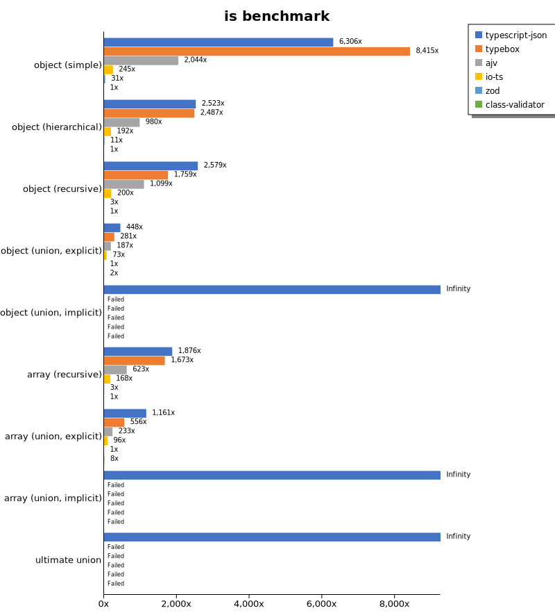
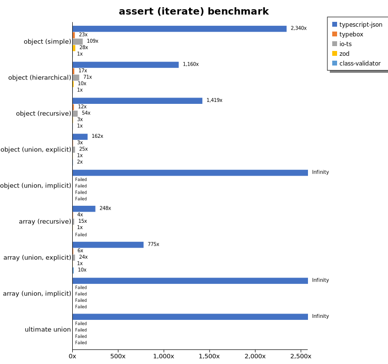
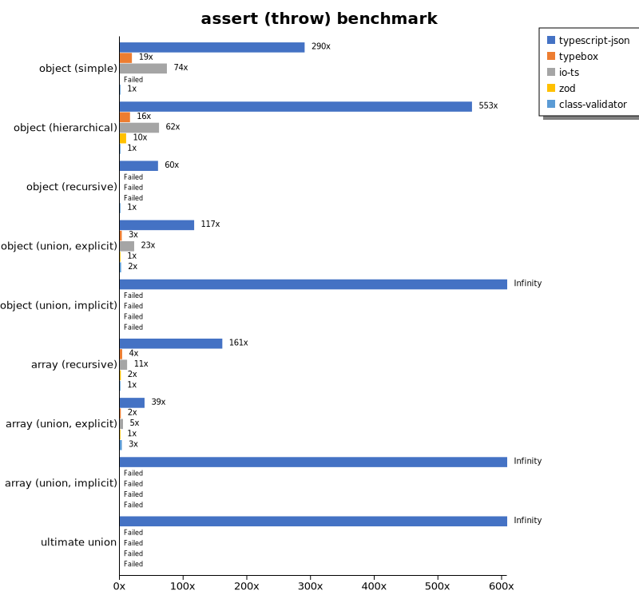
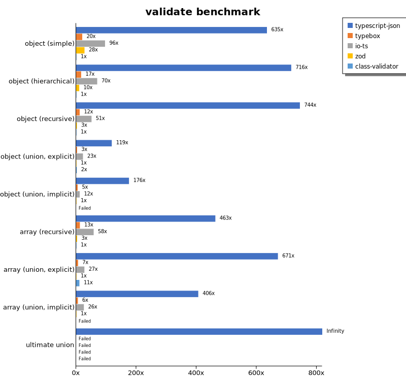
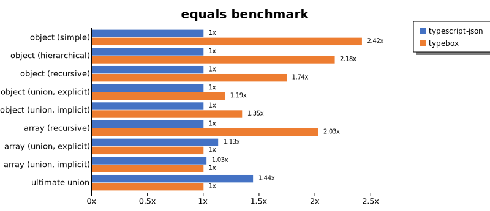
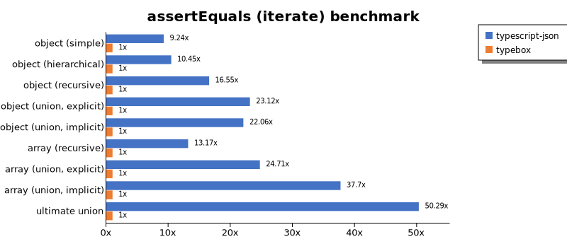
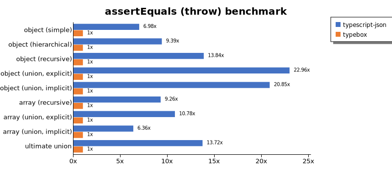
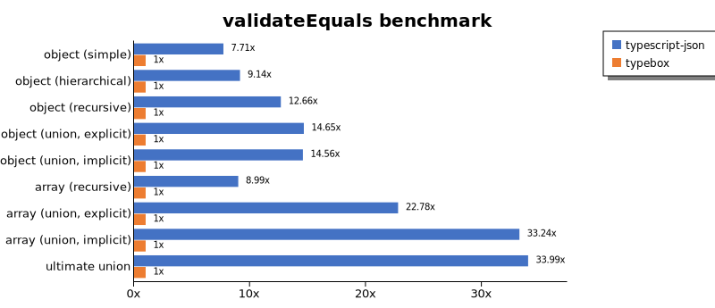
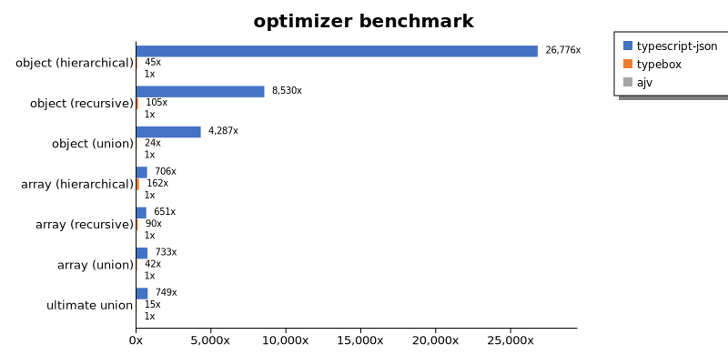
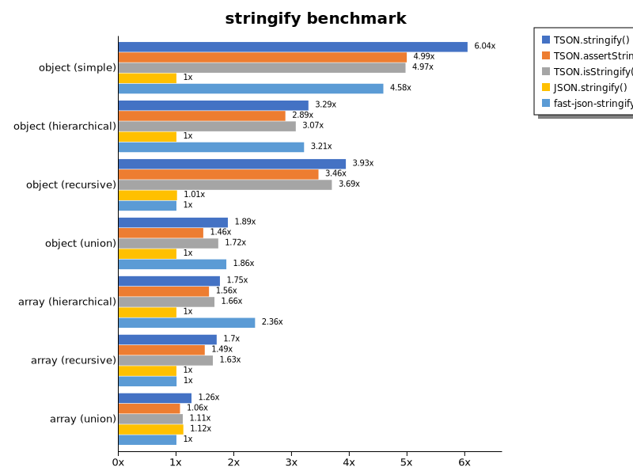

# Benchmark of `typescript-json`
> - CPU: Intel(R) Core(TM) i5-9300H CPU @ 2.40GHz
> - Memory: 24,424 MB
> - OS: win32
> - TypeScript-JSON version: 3.3.20

## is

 Components | typescript-json | typebox | ajv | io-ts | zod | class-validator 
------------|-----------------|---------|-----|-------|-----|-----------------
object (simple) | 611109.3579978237 | 815534.1137735504 | 198123.78507243717 | 23761.004001455072 | 3014.246575342466 | 96.91085613415711
object (hierarchical) | 84098.45031905196 | 82883.02583025831 | 32651.214953271032 | 6400.147792351745 | 353.28596802841923 | 33.327262793662356
object (recursive) | 54526.80021656741 | 37189.01776005799 | 23227.571939063382 | 4232.794625022699 | 53.93136008716179 | 21.1420310805927
object (union, explicit) | 13589.262248920593 | 8511.43489487274 | 5666.666666666667 | 2211.5280043501903 | 30.308596620132256 | 65.34761299691414
object (union, implicit) | 12777.091521617069 | Failed | Failed | Failed | Failed | Failed
array (recursive) | 4100.464783696818 | 3657.534246575343 | 1362.4649859943977 | 366.232375513118 | 7.310215557638239 | 2.18619056294407
array (union, explicit) | 3193.5123042505593 | 1530.6122448979593 | 639.8026315789473 | 263.12849162011173 | 2.751283932501834 | 22.934924482565727
array (union, implicit) | 1442.9046563192906 | Failed | Failed | Failed | Failed | Failed
ultimate union | 436.33369923161365 | Failed | Failed | Failed | Failed | Failed

## assertType (iterate)

 Components | typescript-json | typebox | io-ts | zod | class-validator 
------------|-----------------|---------|-------|-----|-----------------
object (simple) | 238193.9053147107 | 2328.794848206072 | 11116.794848864245 | 2840.703153316419 | 101.77883733724553
object (hierarchical) | 39398.19514946418 | 574.9185667752444 | 2411.092985318108 | 333.8080826063735 | 33.970670131798784
object (recursive) | 30525.703564727955 | 267.8371311169219 | 1158.8504936530326 | 55.17633674630262 | 21.517553793884485
object (union, explicit) | 5109.167893961709 | 96.68405365126675 | 775.7940236797594 | 31.454783748361727 | 61.2691466083151
object (union, implicit) | 4753.065774804905 | Failed | Failed | Failed | Failed
array (recursive) | 1801.0005558643693 | 27.267668336115747 | 112.64494754279403 | 7.273405445729206 | Failed
array (union, explicit) | 1733.491860252424 | 13.480621606440742 | 54.33159073935773 | 2.2367194780987885 | 22.803114571746384
array (union, implicit) | 885.0491087668242 | Failed | Failed | Failed | Failed
ultimate union | 201.18343195266272 | Failed | Failed | Failed | Failed

## assertType (throw)

 Components | typescript-json | typebox | io-ts | zod | class-validator 
------------|-----------------|---------|-------|-----|-----------------
object (simple) | 32127.54055565914 | 2102.6709604091684 | 8186.2561021404435 | Failed | 110.72153533862337
object (hierarchical) | 20046.91447131 | 580.95952023988 | 2232.142857142857 | 359.37204463779085 | 36.25815808556926
object (recursive) | 3271.796746481448 | Failed | Failed | Failed | 54.54545454545454
object (union, explicit) | 4191.835987552627 | 111.04941699056081 | 809.7928436911488 | 35.91309032142216 | 74.03294466037387
object (union, implicit) | 3299.307327743347 | Failed | Failed | Failed | Failed
array (recursive) | 1567.4566150401195 | 35.99712023038157 | 111.54489682097044 | 15.84032947885316 | 9.738994935722632
array (union, explicit) | 426.2416604892513 | 17.196904557179707 | 54.87470276202671 | 10.976948408342482 | 34.87966515521451
array (union, implicit) | 164.32353478181486 | Failed | Failed | Failed | Failed
ultimate union | 216.37216011539846 | Failed | Failed | Failed | Failed

## validate

 Components | typescript-json | typebox | io-ts | zod | class-validator 
------------|-----------------|---------|-------|-----|-----------------
object (simple) | 64844.547563805114 | 2079.7950219619324 | 9821.290678433536 | 2847.270722293696 | 102.16038081288906
object (hierarchical) | 24803.370786516854 | 579.2079207920792 | 2429.0232558139533 | 357.33132303053145 | 34.66269101751771
object (recursive) | 16536.858974358976 | 262.69901440485216 | 1138.7186629526464 | 56.83971201212581 | 22.218002278769465
object (union, explicit) | 3775.0593390542263 | 100.45146726862302 | 722.8982300884956 | 31.83627060830017 | 69.36416184971097
object (union, implicit) | 3176.3425253991295 | 93.19946959651449 | 215.19220158175463 | 18.06548739179526 | Failed
array (recursive) | 1020.4646017699115 | 27.6056338028169 | 128.4663271080928 | 7.389162561576355 | 2.2034520749173705
array (union, explicit) | 1501.086169442433 | 14.617691154422788 | 61.46841206602163 | 2.236302646291465 | 24.46425184904229
array (union, implicit) | 667.2086720867208 | 9.633547412164717 | 42.28528472091712 | 1.6423357664233578 | Failed
ultimate union | 156.1438025397961 | Failed | Failed | Failed | Failed

## equals

 Components | typescript-json | typebox 
------------|-----------------|---------
object (simple) | 16837.63027975864 | 40724.95723246531
object (hierarchical) | 5926.170798898072 | 12891.861341371514
object (recursive) | 4127.885672407476 | 7201.999629698204
object (union, explicit) | 1902.9320706610818 | 2266.784140969163
object (union, implicit) | 1213.0434782608697 | 1632.1633237822348
array (recursive) | 334.62819089900114 | 678.1526249323472
array (union, explicit) | 531.1382878645343 | 469.5939739114459
array (union, implicit) | 315.8747300215983 | 307.6782449725777
ultimate union | 214.93172548324173 | 148.8970588235294

## assertEquals (iterate)

 Components | typescript-json | typebox 
------------|-----------------|---------
object (simple) | 15956.53742110009 | 1727.4590163934427
object (hierarchical) | 5116.802552286423 | 489.5947426067909
object (recursive) | 3961.5454380555057 | 239.31780671190168
object (union, explicit) | 1763.7598284488918 | 76.29929966826391
object (union, implicit) | 1242.4075096631695 | 56.32467286174853
array (recursive) | 359.041070433005 | 27.267562961560316
array (union, explicit) | 293.44883595018945 | 11.87335092348285
array (union, implicit) | 190.66862601028657 | 5.0580741850880475
ultimate union | 165.53169198533263 | 3.2912781130005486

## assertEquals (throw)

 Components | typescript-json | typebox 
------------|-----------------|---------
object (simple) | 11149.63503649635 | 1596.6989594546108
object (hierarchical) | 4544.624931556854 | 484.171322160149
object (recursive) | 3296.5009208103133 | 238.13885326982964
object (union, explicit) | 1683.937823834197 | 73.34066740007334
object (union, implicit) | 1148.5870556061986 | 55.086301872934264
array (recursive) | 330.21463951568523 | 35.650623885918
array (union, explicit) | 185.3911753800519 | 17.20282126268708
array (union, implicit) | 89.68609865470852 | 14.110342881332016
ultimate union | 163.60661697873113 | 11.92890373374687

## validateEquals

 Components | typescript-json | typebox 
------------|-----------------|---------
object (simple) | 13043.79157427938 | 1692.3076923076924
object (hierarchical) | 4729.867296855116 | 517.5736961451247
object (recursive) | 2969.989281886388 | 234.54038997214485
object (union, explicit) | 1143.0610060649303 | 78.04785415875426
object (union, implicit) | 845.1912763675366 | 58.031481130286366
array (recursive) | 238.96663078579115 | 26.588723364133507
array (union, explicit) | 258.6206896551724 | 11.355034065102195
array (union, implicit) | 167.36621196222455 | 5.034495618124184
ultimate union | 113.92405063291139 | 3.351331223235896

## optimizer

 Components | typescript-json | typebox | ajv 
------------|-----------------|---------|-----
object (hierarchical) | 86066.6905700968 | 145.79307922009485 | 3.2142857142857144
object (recursive) | 51405.150055576145 | 632.9372447085035 | 6.026296566837107
object (union) | 12652.826855123674 | 71.2856883069649 | 2.9514849658734548
array (hierarchical) | 3127.1171007102535 | 718.0665318875207 | 4.431314623338257
array (recursive) | 4166.010129431626 | 574.6310480104614 | 6.4042192503296285
array (union) | 3137.3932417378387 | 181.22743682310468 | 4.279866021585412
ultimate union | 409.32368002825353 | 8.468335787923417 | 0.5468465184104995

## stringify

 Components | TSON.stringify() | TSON.assertStringify() | TSON.isStringify() | JSON.stringify() | fast-json-stringify 
------------|------------------|------------------------|--------------------|------------------|---------------------
object (simple) | 30515.252976190473 | 25199.482822312526 | 25090.08354522339 | 5050.103989411988 | 23149.75041597338
object (hierarchical) | 4198.204936424831 | 3688.1720430107525 | 3918.702150929639 | 1277.5651540003644 | 4101.88116967778
object (recursive) | 3992.552225249773 | 3511.5723732549595 | 3746.3860933211345 | 1025.2803649496293 | 1014.7197584449896
object (union) | 1003.8244399927154 | 777.7578475336322 | 915.6997824510515 | 530.9124767225326 | 989.9382171226831
array (hierarchical) | 57.98151839101286 | 51.73028897609704 | 54.85531688265578 | 33.07174887892376 | 78.11361981063365
array (recursive) | 186.8761552680222 | 164.15970287836583 | 179.59108491434887 | 110.11067341962108 | 110.42019973619746
array (union) | 242.92237442922377 | 204.57410408788041 | 213.82289416846652 | 215.71140816700236 | 192.62890341321713

