# Benchmark of `typescript-json`
> CPU: Intel(R) Core(TM) i7-7700 CPU @ 3.60GHz
> Memory: 16,264 MB
> NodeJS version: v14.18.1

## assert
 Components | typescript-json | typescript-is 
------------|-----------------|---------------
object (hierarchical) | 21377.99743730551 | 17353.977479113695
object (recursive) | 26541.977781824808 | 22427.06659525085
object (union) | 4163.468634686347 | 1745.0373338189765
array (recursive) | 1263.6715153747007 | 1591.3584767484438
array (union) | 3092.4700411375425 | 160.8832807570978
ultimate union | 3830.281948004394 | 21.618817018332756

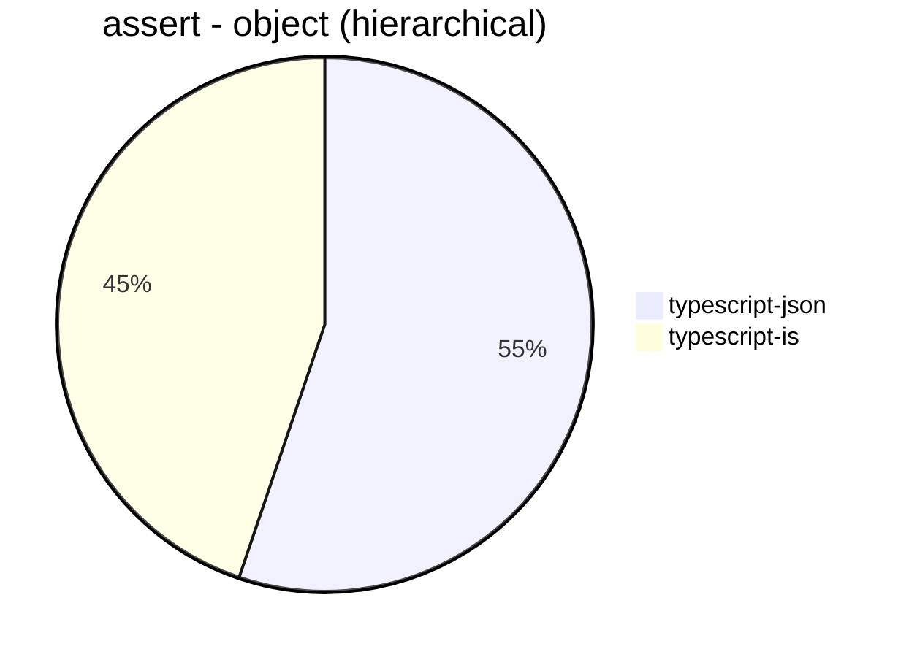
```mermaid
pie title assert - object (hierarchical)
  "typescript-json": 21377.99743730551
  "typescript-is": 17353.977479113695
```

```mermaid
pie title assert - object (recursive)
  "typescript-json": 26541.977781824808
  "typescript-is": 22427.06659525085
```

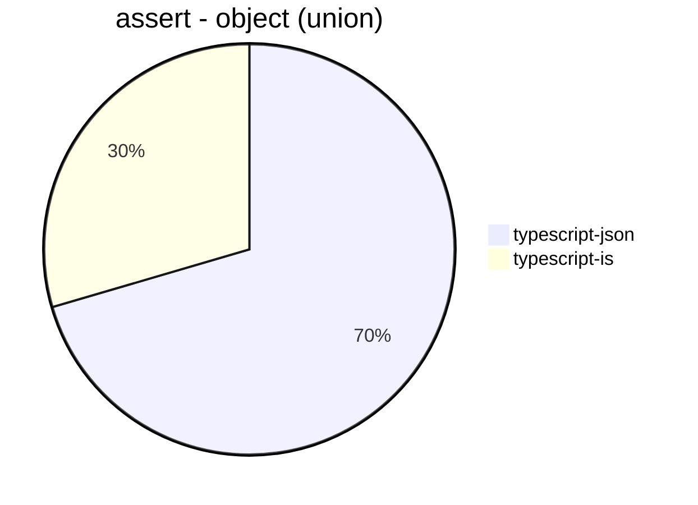
```mermaid
pie title assert - object (union)
  "typescript-json": 4163.468634686347
  "typescript-is": 1745.0373338189765
```

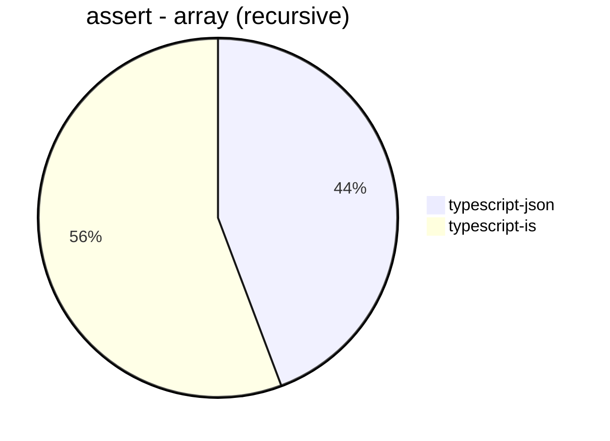
```mermaid
pie title assert - array (recursive)
  "typescript-json": 1263.6715153747007
  "typescript-is": 1591.3584767484438
```

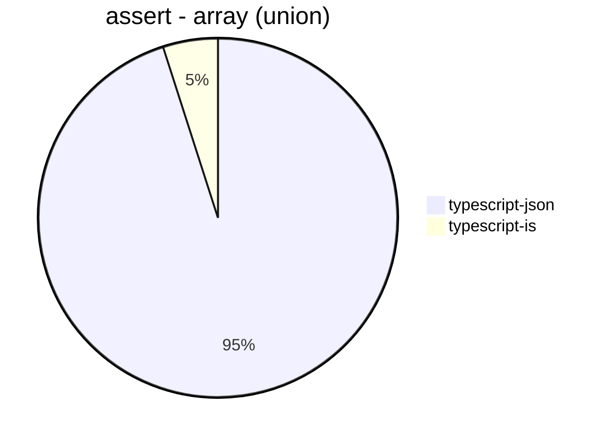
```mermaid
pie title assert - array (union)
  "typescript-json": 3092.4700411375425
  "typescript-is": 160.8832807570978
```

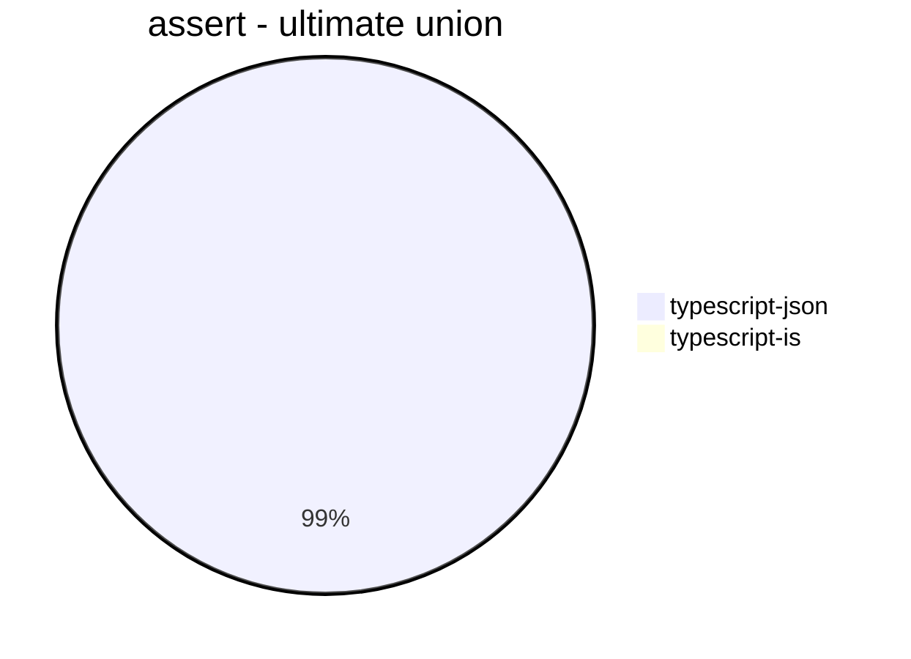
```mermaid
pie title assert - ultimate union
  "typescript-json": 3830.281948004394
  "typescript-is": 21.618817018332756
```

## is
 Components | typescript-json | typescript-is | ajv 
------------|-----------------|---------------|-----
object (hierarchical) | 79088.49557522124 | 29984.01616755466 | 53770.23742755655
object (recursive) | 64061.94362017804 | 27685.17510433678 | Failed
object (union, explicit) | 12109.87996306556 | Failed | 1009.3475073313782
object (union, implicit) | 8638.640742686986 | Failed | Failed
array (recursive) | 5455.162558056449 | 3350.4320647177788 | Failed
array (union, explicit) | 6097.348414611533 | 906.9640914036996 | Failed
array (union, implicit) | 4732.622222222222 | 976.0948905109489 | Failed
ultimate union | 6272.760986463935 | 259.8117563487835 | Failed

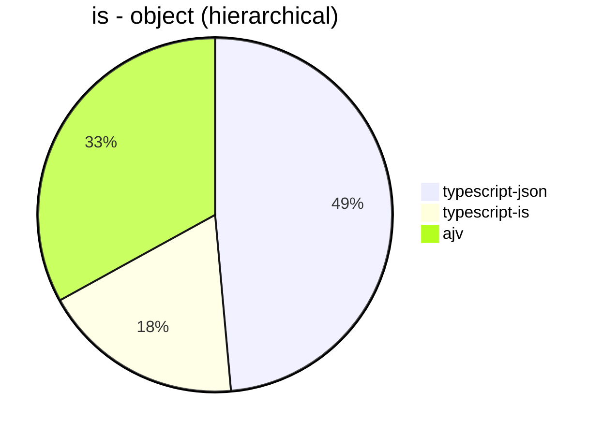
```mermaid
pie title is - object (hierarchical)
  "typescript-json": 79088.49557522124
  "typescript-is": 29984.01616755466
  "ajv": 53770.23742755655
```

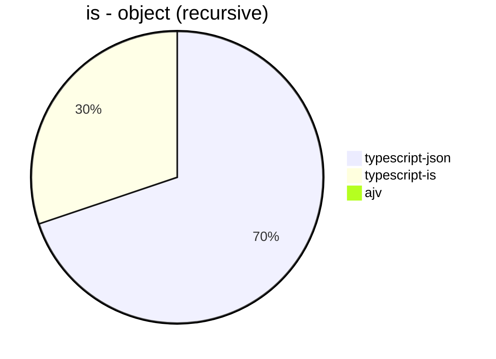
```mermaid
pie title is - object (recursive)
  "typescript-json": 64061.94362017804
  "typescript-is": 27685.17510433678
  "ajv": 0
```

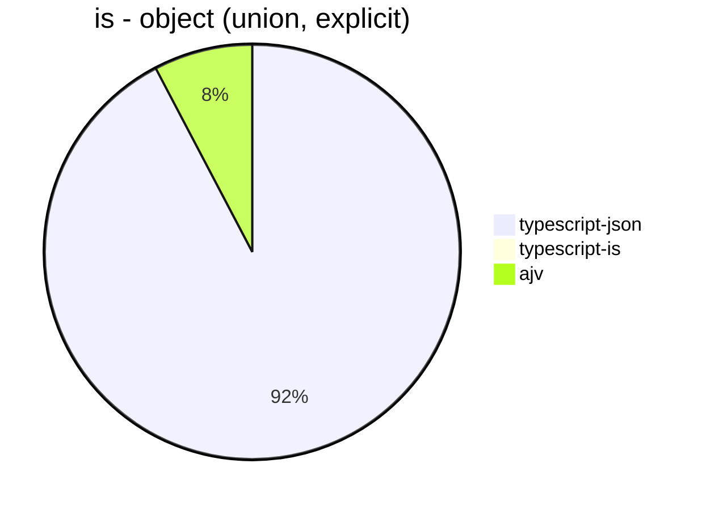
```mermaid
pie title is - object (union, explicit)
  "typescript-json": 12109.87996306556
  "typescript-is": 0
  "ajv": 1009.3475073313782
```

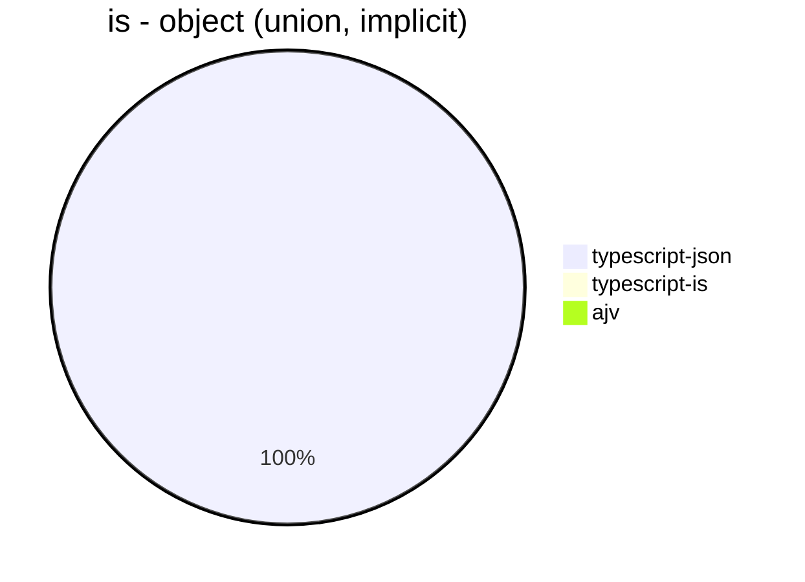
```mermaid
pie title is - object (union, implicit)
  "typescript-json": 8638.640742686986
  "typescript-is": 0
  "ajv": 0
```

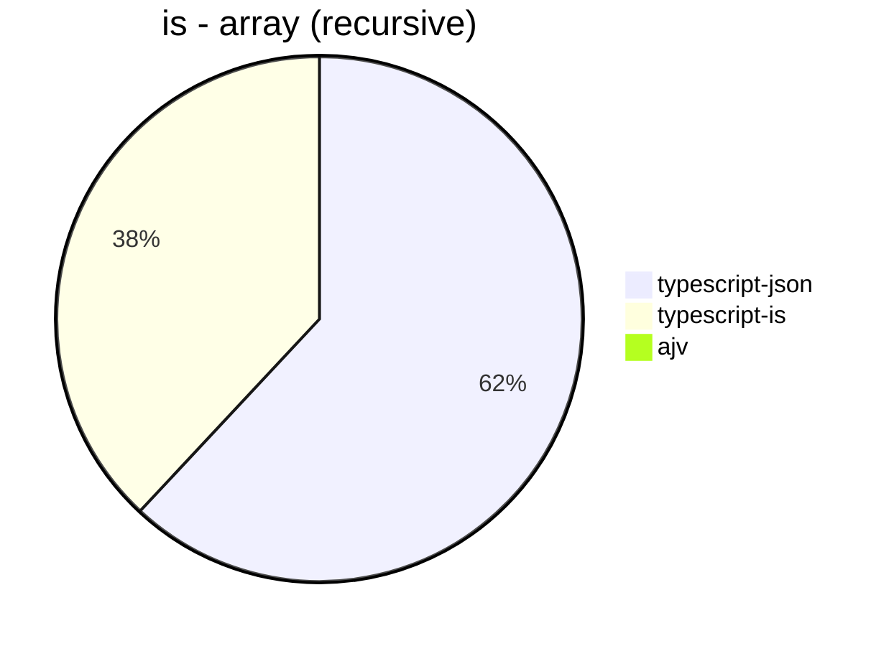
```mermaid
pie title is - array (recursive)
  "typescript-json": 5455.162558056449
  "typescript-is": 3350.4320647177788
  "ajv": 0
```

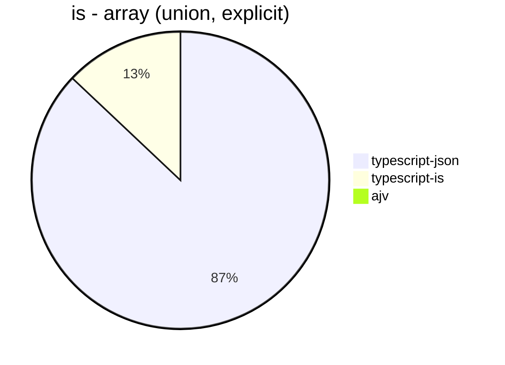
```mermaid
pie title is - array (union, explicit)
  "typescript-json": 6097.348414611533
  "typescript-is": 906.9640914036996
  "ajv": 0
```

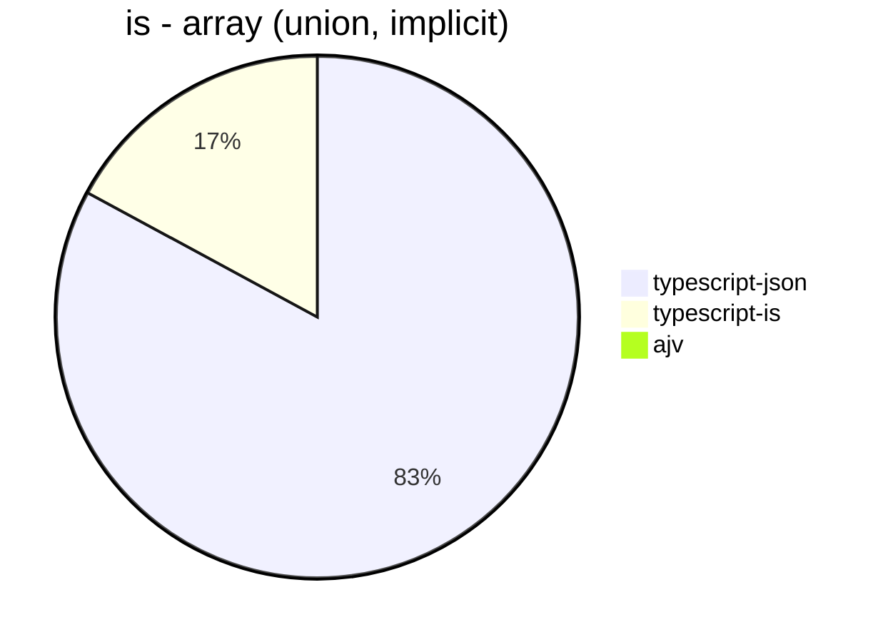
```mermaid
pie title is - array (union, implicit)
  "typescript-json": 4732.622222222222
  "typescript-is": 976.0948905109489
  "ajv": 0
```

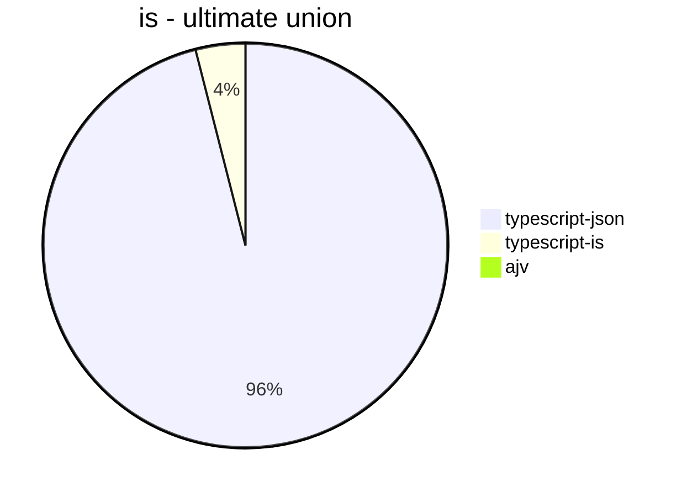
```mermaid
pie title is - ultimate union
  "typescript-json": 6272.760986463935
  "typescript-is": 259.8117563487835
  "ajv": 0
```

## optimizer
 Components | typescript-json | fast-json-stringify | JSON.stringify() 
------------|-----------------|---------------------|------------------
object (simple) | 116127.03101920236 | 4.269702899839886 | 5139.784946236559
object (hierarchical) | 3900.3496503496503 | 0.7183908045977012 | 1297.169811320755
object (recursive) | 4186.82127737898 | 37.847866419294995 | 931.9993216889943
object (union) | 1662.2807017543857 | 0.7330034817665384 | 794.791857693013
array (hierarchical) | 189.17937545388526 | 2.0106013525863644 | 92.9444967074318
array (recursive) | 217.90100483810943 | 30.786146234194614 | 111.90689346463742
array (union) | 331.86732636980025 | 1.4792899408284024 | 228.24899890789953
ultimate union | 1077.276908923643 | Failed | 169.45107398568018

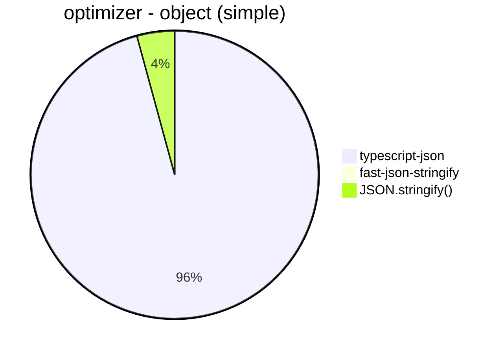
```mermaid
pie title optimizer - object (simple)
  "typescript-json": 116127.03101920236
  "fast-json-stringify": 4.269702899839886
  "JSON.stringify()": 5139.784946236559
```

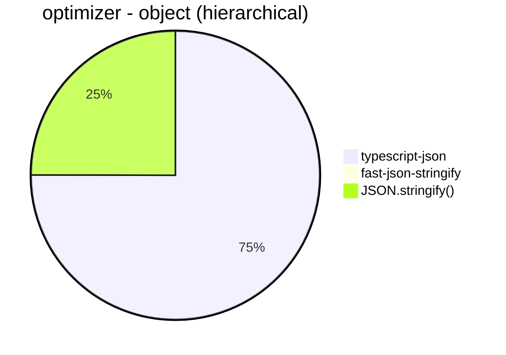
```mermaid
pie title optimizer - object (hierarchical)
  "typescript-json": 3900.3496503496503
  "fast-json-stringify": 0.7183908045977012
  "JSON.stringify()": 1297.169811320755
```

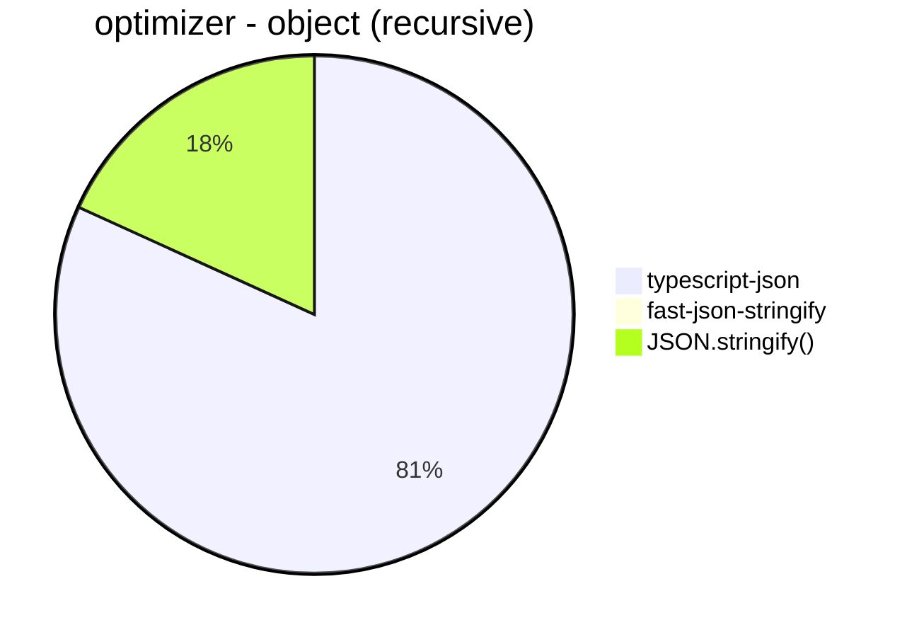
```mermaid
pie title optimizer - object (recursive)
  "typescript-json": 4186.82127737898
  "fast-json-stringify": 37.847866419294995
  "JSON.stringify()": 931.9993216889943
```

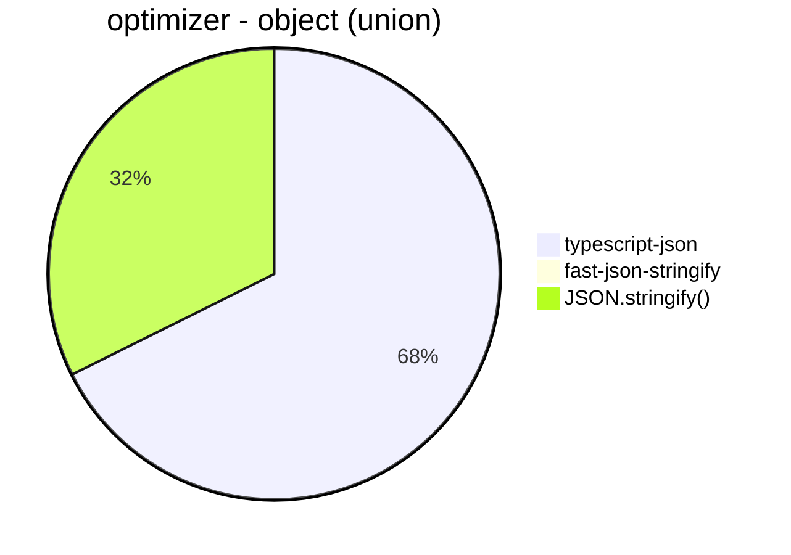
```mermaid
pie title optimizer - object (union)
  "typescript-json": 1662.2807017543857
  "fast-json-stringify": 0.7330034817665384
  "JSON.stringify()": 794.791857693013
```

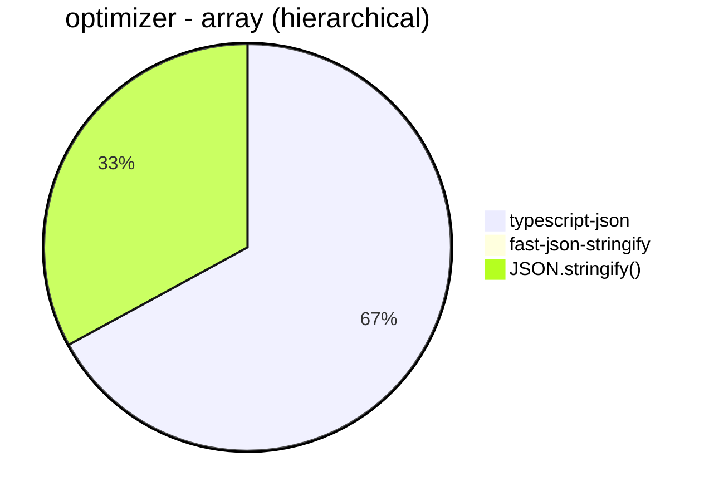
```mermaid
pie title optimizer - array (hierarchical)
  "typescript-json": 189.17937545388526
  "fast-json-stringify": 2.0106013525863644
  "JSON.stringify()": 92.9444967074318
```

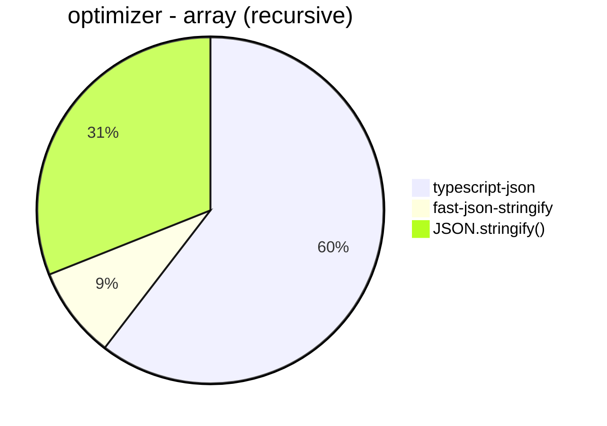
```mermaid
pie title optimizer - array (recursive)
  "typescript-json": 217.90100483810943
  "fast-json-stringify": 30.786146234194614
  "JSON.stringify()": 111.90689346463742
```

```mermaid
pie title optimizer - array (union)
  "typescript-json": 331.86732636980025
  "fast-json-stringify": 1.4792899408284024
  "JSON.stringify()": 228.24899890789953
```

```mermaid
pie title optimizer - ultimate union
  "typescript-json": 1077.276908923643
  "fast-json-stringify": 0
  "JSON.stringify()": 169.45107398568018
```

## stringify
 Components | typescript-json | fast-json-stringify | JSON.stringify() 
------------|-----------------|---------------------|------------------
object (simple) | 109219.85174471163 | 27970.674486803517 | 5136.297109403586
object (hierarchical) | 4409.797961737887 | 4288.91356653711 | 1318.2570325427469
object (recursive) | 4790.835181079084 | 1033.264423980455 | 1011.5384615384615
object (union) | 1716.6905444126076 | 1331.0481688616273 | 795.1630633931843
array (hierarchical) | 126.05356808391083 | 164.58630527817405 | 59.56813104988831
array (recursive) | 216.85008118347466 | 113.87240356083085 | 111.84090494435323
array (union) | 318.02057467186944 | 195.93744382527413 | 227.18052738336715
ultimate union | 1052.9706513958483 | Failed | 170.27176927343316

```mermaid
pie title stringify - object (simple)
  "typescript-json": 109219.85174471163
  "fast-json-stringify": 27970.674486803517
  "JSON.stringify()": 5136.297109403586
```

```mermaid
pie title stringify - object (hierarchical)
  "typescript-json": 4409.797961737887
  "fast-json-stringify": 4288.91356653711
  "JSON.stringify()": 1318.2570325427469
```

```mermaid
pie title stringify - object (recursive)
  "typescript-json": 4790.835181079084
  "fast-json-stringify": 1033.264423980455
  "JSON.stringify()": 1011.5384615384615
```

```mermaid
pie title stringify - object (union)
  "typescript-json": 1716.6905444126076
  "fast-json-stringify": 1331.0481688616273
  "JSON.stringify()": 795.1630633931843
```

```mermaid
pie title stringify - array (hierarchical)
  "typescript-json": 126.05356808391083
  "fast-json-stringify": 164.58630527817405
  "JSON.stringify()": 59.56813104988831
```

```mermaid
pie title stringify - array (recursive)
  "typescript-json": 216.85008118347466
  "fast-json-stringify": 113.87240356083085
  "JSON.stringify()": 111.84090494435323
```

```mermaid
pie title stringify - array (union)
  "typescript-json": 318.02057467186944
  "fast-json-stringify": 195.93744382527413
  "JSON.stringify()": 227.18052738336715
```

```mermaid
pie title stringify - ultimate union
  "typescript-json": 1052.9706513958483
  "fast-json-stringify": 0
  "JSON.stringify()": 170.27176927343316
```

