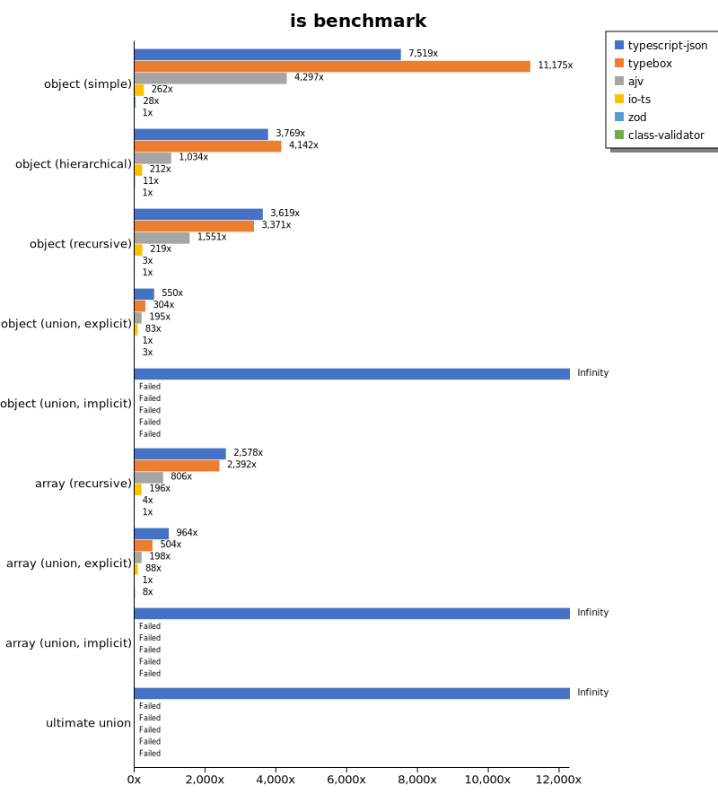
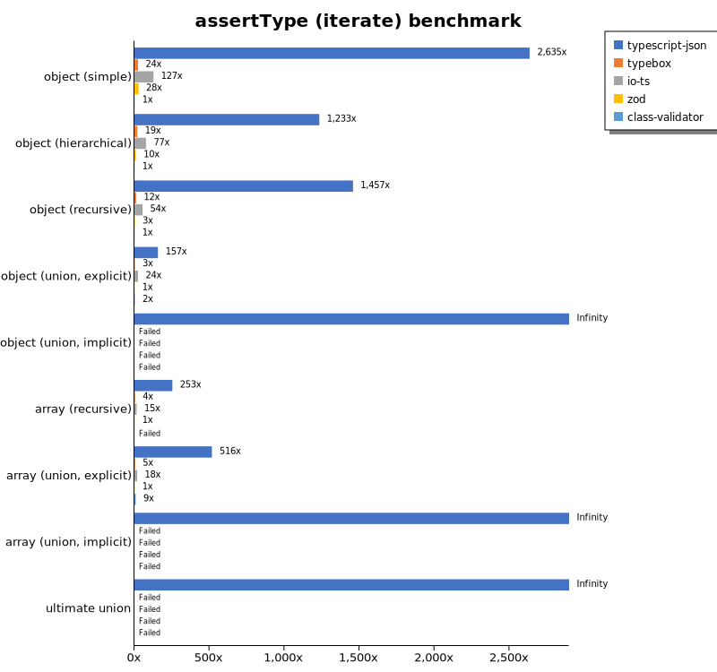
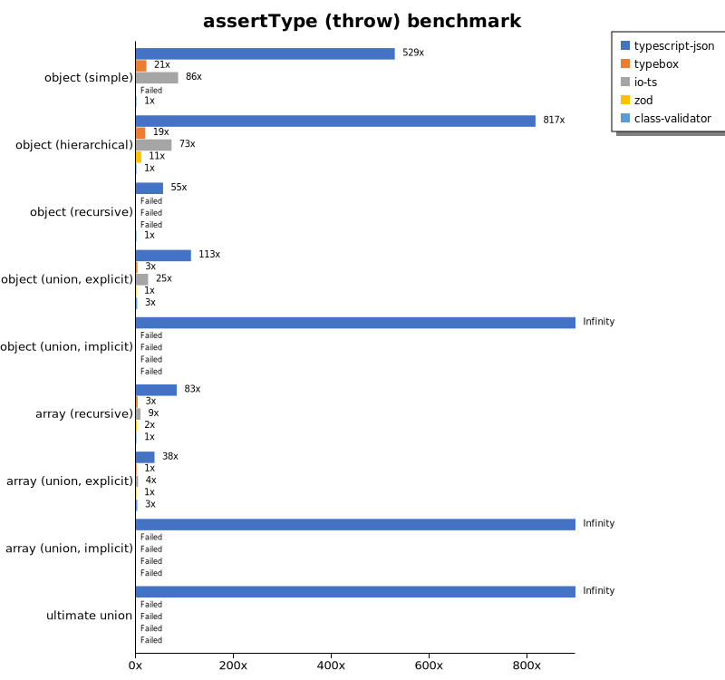
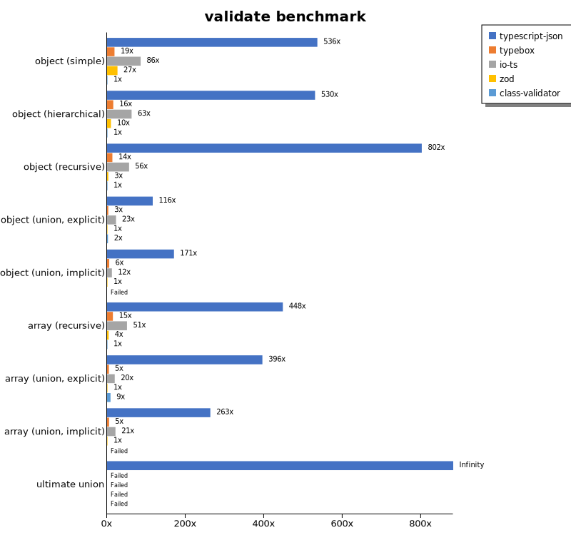
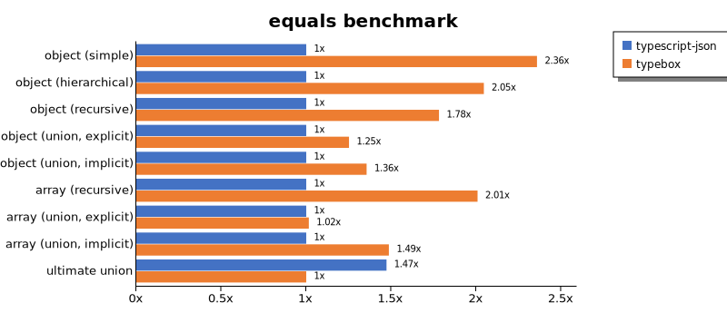
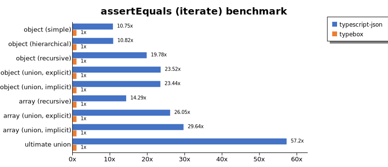
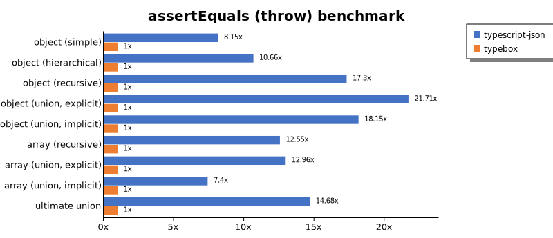
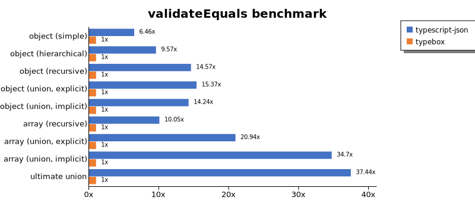
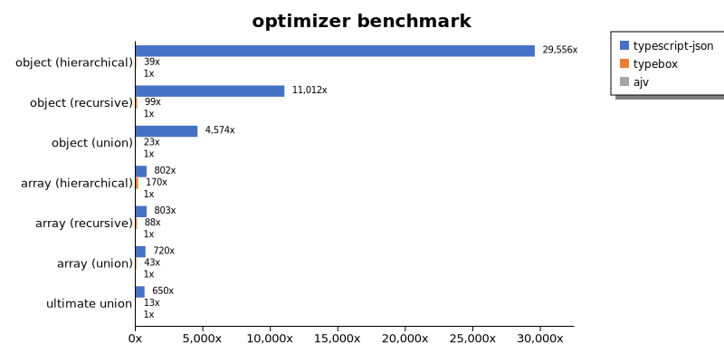

# Benchmark of `typescript-json`
> - CPU: Intel(R) Core(TM) i7-8700 CPU @ 3.20GHz
> - Memory: 25,553 MB
> - TypeScript-JSON version: 3.3.20

## is

 Components | typescript-json | typebox | ajv | io-ts | zod | class-validator 
------------|-----------------|---------|-----|-------|-----|-----------------
object (simple) | 854433.0011074196 | 1269830.3275671694 | 488287.9398826979 | 29766.154415848916 | 3214.1680395387148 | 113.63636363636363
object (hierarchical) | 129574.10779315367 | 142399.81447124307 | 35537.77612771487 | 7273.079049198453 | 389.86425339366514 | 34.37779767233661
object (recursive) | 79522.91105121293 | 74072.19299836749 | 34081.666666666664 | 4802.3022108532805 | 64.15646134161945 | 21.973997436366965
object (union, explicit) | 18026.701279436307 | 9951.19344495903 | 6392.445106066245 | 2732.3076923076924 | 32.77494537509104 | 87.88426763110307
object (union, implicit) | 15689.181666357395 | Failed | Failed | Failed | Failed | Failed
array (recursive) | 5679.090570257175 | 5270.603625490563 | 1774.8516320474778 | 430.8452250274424 | 8.341056533827619 | 2.2030475491096015
array (union, explicit) | 3196.1943469425455 | 1671.7015468607824 | 656.8047337278106 | 292.8343050592439 | 3.316138540899042 | 27.980980248719824
array (union, implicit) | 1482.6190914107044 | Failed | Failed | Failed | Failed | Failed
ultimate union | 482.18142548596114 | Failed | Failed | Failed | Failed | Failed

## assertType (iterate)

 Components | typescript-json | typebox | io-ts | zod | class-validator 
------------|-----------------|---------|-------|-----|-----------------
object (simple) | 273491.3137893594 | 2509.150208371082 | 13175.490016486538 | 2855.4808216687875 | 103.81004969630038
object (hierarchical) | 41363.1103074141 | 644.915715062534 | 2585.5725879170423 | 341.49460990316095 | 33.55583618978892
object (recursive) | 33841.69534504619 | 286.19153674832967 | 1258.136094674556 | 69.17406917406917 | 23.225075528700906
object (union, explicit) | 5217.604355716879 | 86.61703286725987 | 791.704899981648 | 33.2644239804548 | 78.06691449814126
object (union, implicit) | 4335.802926467864 | Failed | Failed | Failed | Failed
array (recursive) | 1950.2793296089385 | 31.15558912386707 | 112.81956280103742 | 7.7134986225895315 | Failed
array (union, explicit) | 1715.0715071507152 | 15.080990504561534 | 60.94182825484765 | 3.3210332103321036 | 29.061102831594635
array (union, implicit) | 612.4661246612466 | Failed | Failed | Failed | Failed
ultimate union | 236.8276115292822 | Failed | Failed | Failed | Failed

## assertType (throw)

 Components | typescript-json | typebox | io-ts | zod | class-validator 
------------|-----------------|---------|-------|-----|-----------------
object (simple) | 59006.09643450951 | 2390.438247011952 | 9617.918313570488 | Failed | 111.54489682097044
object (hierarchical) | 29687.5 | 691.588785046729 | 2645.5026455026455 | 392.30338128152437 | 36.35702599527358
object (recursive) | 3084.832904884319 | Failed | Failed | Failed | 55.637982195845694
object (union, explicit) | 4026.1153427638737 | 110.61946902654867 | 887.4622356495469 | 35.77817531305904 | 92.14891264283082
object (union, implicit) | 3757.598084361761 | Failed | Failed | Failed | Failed
array (recursive) | 848.8651042627791 | 35.448422545196735 | 93.96729937981583 | 16.074586079408455 | 10.175010175010176
array (union, explicit) | 468.07713911252574 | 16.03077909586406 | 54.073540014419606 | 12.322858903265557 | 35.59985760056959
array (union, implicit) | 165.8069270449521 | Failed | Failed | Failed | Failed
ultimate union | 218.69874248223073 | Failed | Failed | Failed | Failed

## validate

 Components | typescript-json | typebox | io-ts | zod | class-validator 
------------|-----------------|---------|-------|-----|-----------------
object (simple) | 56741.789967520745 | 2006.9042731852956 | 9055.495689655174 | 2814.1693502557305 | 105.88235294117646
object (hierarchical) | 18879.46507126518 | 563.8675893024125 | 2228.0830729645286 | 351.1893613036149 | 35.62152133580705
object (recursive) | 18153.337010479867 | 306.87022900763355 | 1270 | 71.75398633257403 | 22.637238256932655
object (union, explicit) | 4160.603855947617 | 112.01206864039223 | 815.6606851549755 | 35.754824063564136 | 82.07858979067205
object (union, implicit) | 3272.286125089863 | 105.70183746921765 | 236.79694947569112 | 19.19096895578551 | Failed
array (recursive) | 986.0678276810265 | 32.72522098927967 | 111.79775280898876 | 9.037845980041423 | 2.2014309301045683
array (union, explicit) | 1337.7265238879736 | 15.727391874180864 | 65.98984771573603 | 3.379647014645137 | 29.725609756097562
array (union, implicit) | 579.8273011207054 | 11.295180722891565 | 47.105561861521004 | 2.2034520749173705 | Failed
ultimate union | 147.27463312368974 | Failed | Failed | Failed | Failed

## equals

 Components | typescript-json | typebox 
------------|-----------------|---------
object (simple) | 21309.734513274336 | 50249.168207024035
object (hierarchical) | 6953.18282753516 | 14221.62760656948
object (recursive) | 5625.345367470989 | 10020.055197792088
object (union, explicit) | 2287.2417542587896 | 2862.8383321141187
object (union, implicit) | 1495.3185239581421 | 2026.5780730897009
array (recursive) | 432.00895355344153 | 867.590027700831
array (union, explicit) | 571.8247365501942 | 580.5356469256885
array (union, implicit) | 231.19065010956905 | 343.61471861471864
ultimate union | 241.90894130554028 | 164.2870052412796

## assertEquals (iterate)

 Components | typescript-json | typebox 
------------|-----------------|---------
object (simple) | 19686.406705539357 | 1831.3120176405732
object (hierarchical) | 5863.636363636364 | 541.7759460472087
object (recursive) | 5340.398083302617 | 269.9944331044721
object (union, explicit) | 1969.4195202343894 | 83.7465564738292
object (union, implicit) | 1499.172337686224 | 63.96344945745288
array (recursive) | 446.27649936582714 | 31.22634367903104
array (union, explicit) | 339.06501880709294 | 13.016411997736277
array (union, implicit) | 164.9616368286445 | 5.565862708719852
ultimate union | 190.18293787357362 | 3.324713705208718

## assertEquals (throw)

 Components | typescript-json | typebox 
------------|-----------------|---------
object (simple) | 15411.145398438915 | 1892.0944173847881
object (hierarchical) | 5679.146319406765 | 532.5987144168962
object (recursive) | 4864.964853866075 | 281.1621368322399
object (union, explicit) | 1982.0150486327766 | 91.30752373995618
object (union, implicit) | 1349.6490912362783 | 74.36326454731363
array (recursive) | 446.594715295869 | 35.580857498665715
array (union, explicit) | 222.55192878338278 | 17.17032967032967
array (union, implicit) | 107.2961373390558 | 14.492753623188406
ultimate union | 180.27762754642148 | 12.281994595922379

## validateEquals

 Components | typescript-json | typebox 
------------|-----------------|---------
object (simple) | 11614.103472714387 | 1798.8026124818578
object (hierarchical) | 5387.068044175276 | 562.7745241581259
object (recursive) | 3999.6324205109354 | 274.4374769457765
object (union, explicit) | 1321.880007121239 | 85.99963010911782
object (union, implicit) | 882.7956989247313 | 62.00676437429538
array (recursive) | 300.4855241862974 | 29.887218045112782
array (union, explicit) | 295.3091684434968 | 14.105698702275717
array (union, implicit) | 193.80672717565403 | 5.584512285927029
ultimate union | 124.44836716681377 | 3.32409972299169

## optimizer

 Components | typescript-json | typebox | ajv 
------------|-----------------|---------|-----
object (hierarchical) | 109465.3860094237 | 145.8370476020681 | 3.7037037037037037
object (recursive) | 73828.44875863356 | 664.1970735321356 | 6.704113063960862
object (union) | 15365.31165311653 | 76.99583806280742 | 3.35946248600224
array (hierarchical) | 3883.5728579225033 | 822.0801203686289 | 4.839910647803425
array (recursive) | 5631.289019463827 | 619.5997755750888 | 7.0155479711793705
array (union) | 3314.364640883978 | 199.4097030068253 | 4.604899613188432
ultimate union | 471.65616895146354 | 9.233088373845863 | 0.7260845888546015

## stringify

 Components | TSON.stringify() | TSON.assertStringify() | TSON.isStringify() | JSON.stringify() | fast-json-stringify 
------------|------------------|------------------------|--------------------|------------------|---------------------
object (simple) | 35218.38440111421 | 27090.404582885785 | 28647.48842180264 | 9166.919000757003 | 24093.218789983548
object (hierarchical) | 4563.653308480894 | 4020.374449339207 | 4147.797597378959 | 2262.7832927514514 | 4414.825907899663
object (recursive) | 4257.019031467872 | 3873.7122557726466 | 4251.965555971547 | 1865.6826568265683 | 1838.3233532934132
object (union) | 989.8648648648649 | 800.4707586456636 | 932.0036264732548 | 912.9123468426013 | 1078.4132841328415
array (hierarchical) | 66.8088130774698 | 62.0511876265881 | 65.30759516507307 | 60.4014598540146 | 102.31084606783452
array (recursive) | 190.60101104662047 | 168.6500557828189 | 181.8691588785047 | 166.91701088997374 | 166.1987647389107
array (union) | 233.74500544860152 | 200.39718360714932 | 212.1814567142599 | 356.32183908045977 | 306.87247335538405

