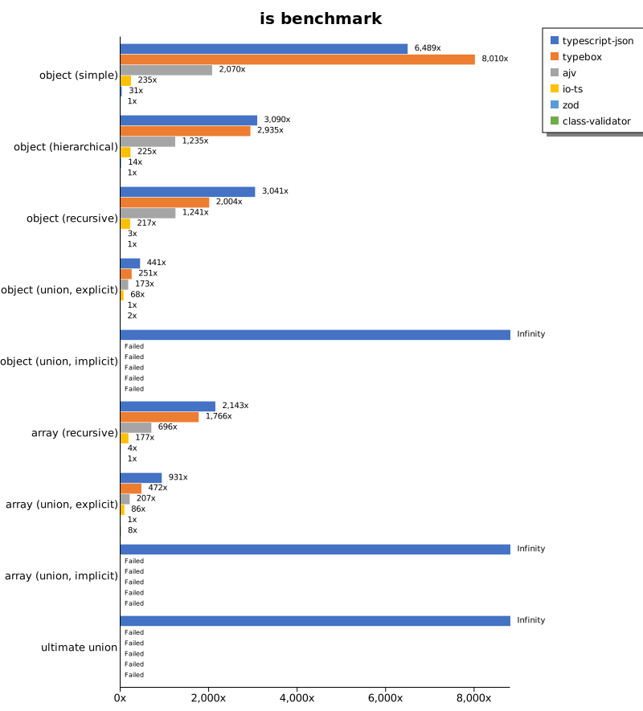
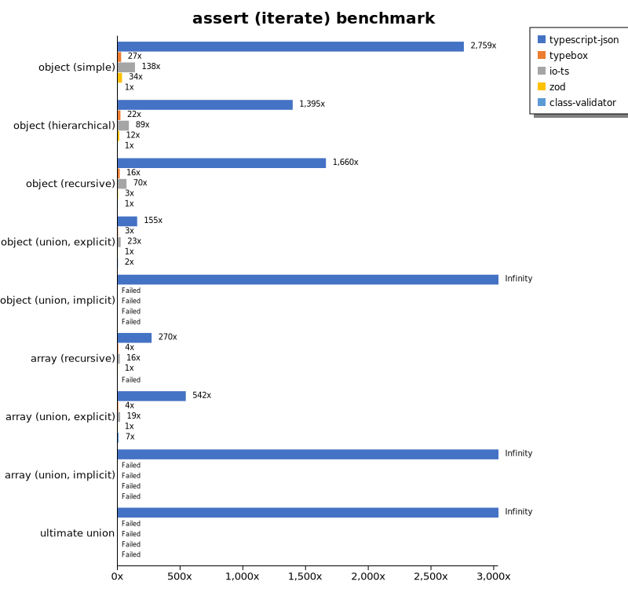
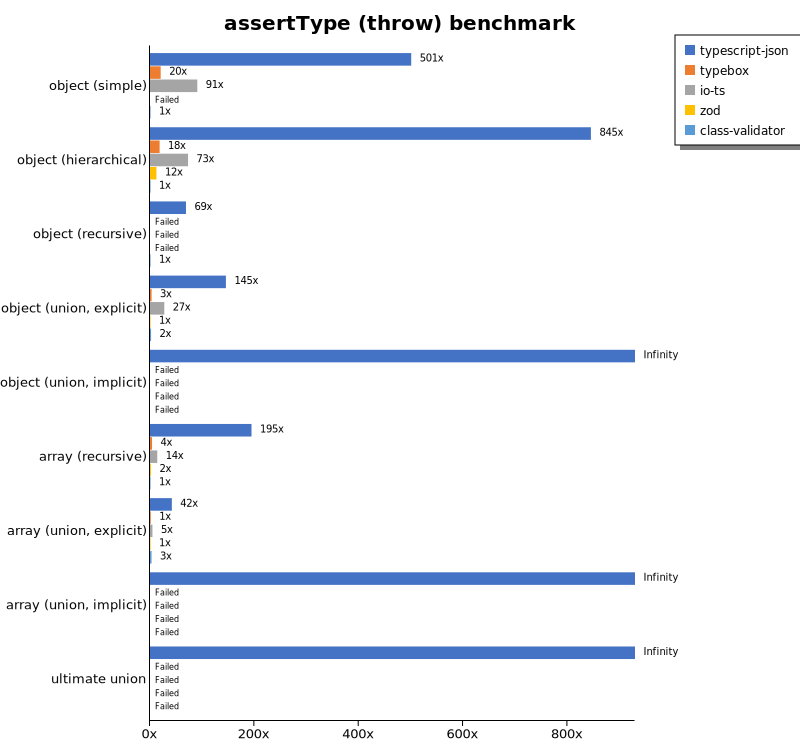
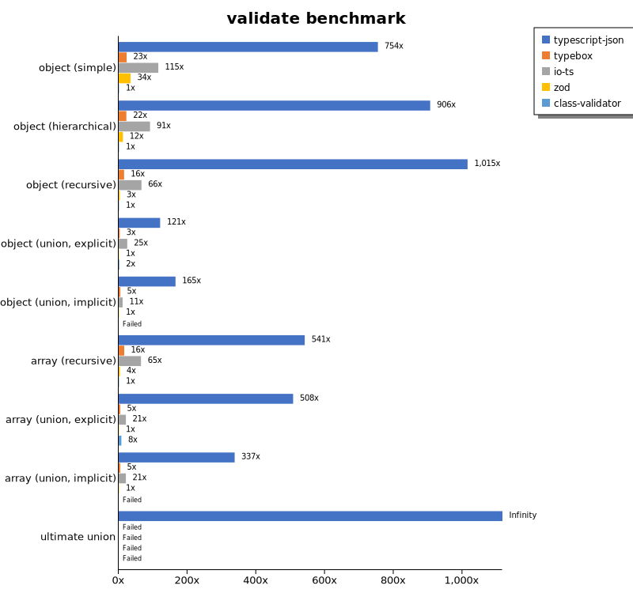
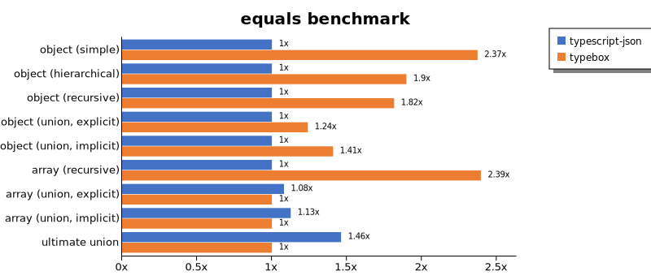
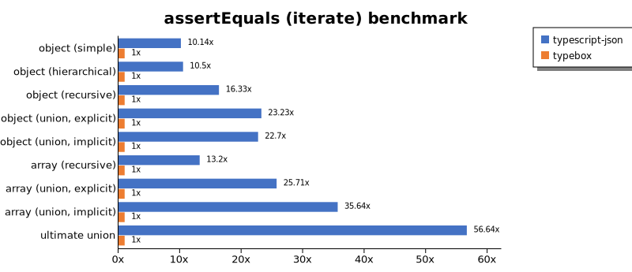
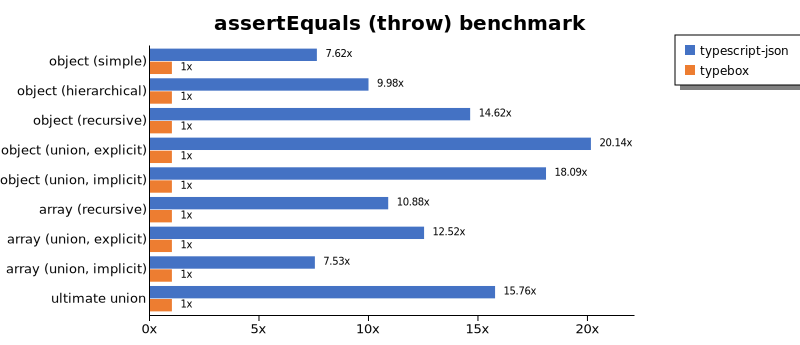
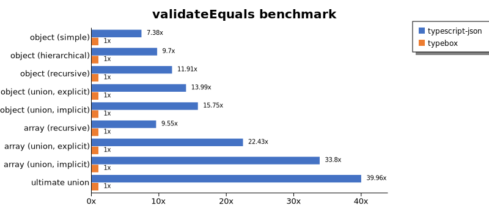
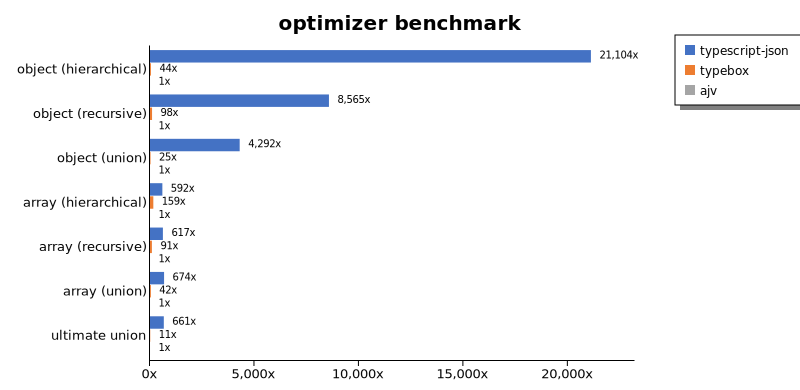

# Benchmark of `typescript-json`
> - CPU: Intel(R) Core(TM) i9-9880H CPU @ 2.30GHz
> - Memory: 16,384 MB
> - OS: darwin
> - TypeScript-JSON version: 3.3.20

## is

 Components | typescript-json | typebox | ajv | io-ts | zod | class-validator 
------------|-----------------|---------|-----|-------|-----|-----------------
object (simple) | 721164.0872645907 | 890181.2142461708 | 230049.4382022472 | 26120.23787400111 | 3467.688937568456 | 111.13080467919177
object (hierarchical) | 93214.47721179624 | 88560.17666543982 | 37270.009115770285 | 6785.145397295796 | 428.4923417604724 | 30.170049369171693
object (recursive) | 62700.66396163778 | 41322.17111315548 | 25588.55885588559 | 4474.056165147852 | 60.44252563410685 | 20.616641901931647
object (union, explicit) | 15806.070826306914 | 8992.609437180216 | 6197.985973745729 | 2443.9132033835967 | 35.819250551065394 | 71.10791883641588
object (union, implicit) | 14279.466271312083 | Failed | Failed | Failed | Failed | Failed
array (recursive) | 4780.469341408025 | 3940.2901785714284 | 1553.4156976744187 | 395.5319538546053 | 8.400224005973492 | 2.2308979364194093
array (union, explicit) | 3133.5049650606843 | 1586.9764038778126 | 694.9592290585618 | 290.2865649423149 | 3.3644859813084116 | 25.64579074521464
array (union, implicit) | 1574.2251223491028 | Failed | Failed | Failed | Failed | Failed
ultimate union | 482.0636094674556 | Failed | Failed | Failed | Failed | Failed

## assertType (iterate)

 Components | typescript-json | typebox | io-ts | zod | class-validator 
------------|-----------------|---------|-------|-----|-----------------
object (simple) | 259171.23670956912 | 2560.706787963611 | 12922.293474160695 | 3194.229035166817 | 93.93995210904401
object (hierarchical) | 42917.877094972064 | 662.2528568837294 | 2727.123587313161 | 381.4114223353947 | 30.77486719179337
object (recursive) | 34100.27548209366 | 323.01704966641955 | 1432.5842696629215 | 60.77751414491696 | 20.54794520547945
object (union, explicit) | 6002.71689911248 | 113.53711790393012 | 896.2298025134648 | 38.76116283488505 | 74.68643101482327
object (union, implicit) | 4959.0727997102495 | Failed | Failed | Failed | Failed
array (recursive) | 2107.648725212465 | 32.65080243497509 | 127.56678175540614 | 7.808142777467932 | Failed
array (union, explicit) | 1833.3032001446395 | 14.827018121911038 | 63.93910561370124 | 3.380281690140845 | 24.67556205446902
array (union, implicit) | 1081.131029384587 | Failed | Failed | Failed | Failed
ultimate union | 230.72861668426606 | Failed | Failed | Failed | Failed

## assertType (throw)

 Components | typescript-json | typebox | io-ts | zod | class-validator 
------------|-----------------|---------|-------|-----|-----------------
object (simple) | 56347.316358307384 | 2303.8156947444204 | 10206.317327003833 | Failed | 112.549240292628
object (hierarchical) | 30909.090909090908 | 673.5266604303087 | 2667.654686921082 | 450.11252813203305 | 36.5764447695684
object (recursive) | 3809.1847632609465 | Failed | Failed | Failed | 55.22827687776141
object (union, explicit) | 5340.528470413101 | 112.69722013523666 | 1005.6925996204935 | 36.710719530102786 | 74.9203970781045
object (union, implicit) | 4090.6578220011056 | Failed | Failed | Failed | Failed
array (recursive) | 1807.5588825999635 | 36.127167630057805 | 129.15129151291512 | 16.268098259313486 | 9.2910898448388
array (union, explicit) | 497.9712283290299 | 17.58705592683785 | 55.177487585065286 | 11.896264572924101 | 34.78260869565217
array (union, implicit) | 183.21729571271527 | Failed | Failed | Failed | Failed
ultimate union | 256.6923359002567 | Failed | Failed | Failed | Failed

## validate

 Components | typescript-json | typebox | io-ts | zod | class-validator 
------------|-----------------|---------|-------|-----|-----------------
object (simple) | 68328.28467153283 | 2103.5856573705178 | 10442.169341449917 | 3115.970961887477 | 90.59674502712477
object (hierarchical) | 27602.22016651249 | 679.6616403089371 | 2775.746606334841 | 375.5403458213257 | 30.456852791878173
object (recursive) | 20707.10849812934 | 321.2678169542386 | 1351.5696713787406 | 65.53951367781156 | 20.400453343407634
object (union, explicit) | 4511.458712259003 | 116.78004535147392 | 931.1710352630587 | 37.407897222747025 | 72.45575221238937
object (union, implicit) | 3752.223869532988 | 109.67986361053231 | 260.17308046400296 | 22.697181766597314 | Failed
array (recursive) | 1200.648999459167 | 35.72103572103572 | 143.91353811149034 | 7.872539831302719 | 2.2181146025878005
array (union, explicit) | 1700.9002388388758 | 15.674566150401194 | 70.28571428571428 | 3.351331223235896 | 26.027913994718975
array (union, implicit) | 753.6102692101979 | 10.650224215246636 | 46.60303200449186 | 2.233389168062535 | Failed
ultimate union | 176.9768692845616 | Failed | Failed | Failed | Failed

## equals

 Components | typescript-json | typebox 
------------|-----------------|---------
object (simple) | 19621.298405466972 | 46550.07256894049
object (hierarchical) | 6989.859154929577 | 13265.18627271059
object (recursive) | 4638.852672750978 | 8423.568649249584
object (union, explicit) | 2164.739370218822 | 2684.326306141155
object (union, implicit) | 1341.6115776308734 | 1889.152233363719
array (recursive) | 332.3386795971652 | 795.7746478873239
array (union, explicit) | 575.629479875023 | 532.6066876039165
array (union, implicit) | 381.2063258550938 | 338.63804589193194
ultimate union | 253.2080245797939 | 173.2440260680666

## assertEquals (iterate)

 Components | typescript-json | typebox 
------------|-----------------|---------
object (simple) | 19155.909172179512 | 1888.668350775893
object (hierarchical) | 6142.219743446738 | 585.0828729281768
object (recursive) | 4574.665477252453 | 280.06681514476617
object (union, explicit) | 2030.058651026393 | 87.3839432004369
object (union, implicit) | 1456.3857195436144 | 64.16808631459398
array (recursive) | 391.2806539509537 | 29.647585306731308
array (union, explicit) | 342.4124513618677 | 13.318534961154274
array (union, implicit) | 216.2065256364288 | 6.0661764705882355
ultimate union | 191.37368611815876 | 3.379012577435705

## assertEquals (throw)

 Components | typescript-json | typebox 
------------|-----------------|---------
object (simple) | 14812.754912866149 | 1943.7245464642724
object (hierarchical) | 5584.035151958989 | 559.5970900951315
object (recursive) | 4070.4070407040704 | 278.39643652561244
object (union, explicit) | 1829.4914013904133 | 90.85953116481919
object (union, implicit) | 1343.146274149034 | 74.26661715558856
array (recursive) | 386.4556496135443 | 35.52397868561279
array (union, explicit) | 218.10250817884403 | 17.424638438752396
array (union, implicit) | 108.61694424330194 | 14.425851125216388
ultimate union | 198.77123238164077 | 12.613521695257315

## validateEquals

 Components | typescript-json | typebox 
------------|-----------------|---------
object (simple) | 14573.567467652494 | 1974.4302390216785
object (hierarchical) | 5379.475363346331 | 554.3948126801154
object (recursive) | 3322.2782984859405 | 278.84795212268557
object (union, explicit) | 1260.1583113456466 | 90.07981755986319
object (union, implicit) | 968.7162891046387 | 61.51592823141707
array (recursive) | 276.8134478348255 | 28.985507246376812
array (union, explicit) | 286.2676056338029 | 12.761235435546514
array (union, implicit) | 192.0944374888213 | 5.682894487592347
ultimate union | 135.6297093649085 | 3.3943051103149164

## optimizer

 Components | typescript-json | typebox | ajv 
------------|-----------------|---------|-----
object (hierarchical) | 79508.7145969499 | 164.41521507287592 | 3.767491926803014
object (recursive) | 56629.23806051768 | 649.66584593739 | 6.611570247933884
object (union) | 14194.199706314243 | 81.13553113553114 | 3.3069998162777883
array (hierarchical) | 2857.326007326007 | 768.1053401609364 | 4.828226555246054
array (recursive) | 4202.241195304162 | 617.2979084228377 | 6.810233756672189
array (union) | 3244.731104651163 | 200.91575091575092 | 4.817491198814156
ultimate union | 479.1245171969836 | 8.220157255182272 | 0.7249003262051468

## stringify

 Components | TSON.stringify() | TSON.assertStringify() | TSON.isStringify() | JSON.stringify() | fast-json-stringify 
------------|------------------|------------------------|--------------------|------------------|---------------------
object (simple) | 35181.214246170886 | 28229.67032967033 | 29059.970566593085 | 8158.373561084292 | 24940.578158458244
object (hierarchical) | 4615.598885793872 | 4280.411613377435 | 4572.100018800526 | 2033.376599295383 | 4709.443099273608
object (recursive) | 4465.995900875722 | 4071.3237990465714 | 4332.5917686318135 | 1705.528394133133 | 1667.783361250698
object (union) | 1205.524259494821 | 923.9536954585931 | 1091.6879329201604 | 851.4107731769878 | 1159.7771387491014
array (hierarchical) | 80.2266081871345 | 76.44133357892798 | 77.00709994538504 | 66.79139382600562 | 111.58192090395481
array (recursive) | 231.24657784267202 | 210.54592882429662 | 222.0781626227079 | 159.039759939985 | 157.46723278567472
array (union) | 303.45079423041807 | 261.53293843116137 | 283.83492521174986 | 333.5820895522388 | 287.06395348837214

