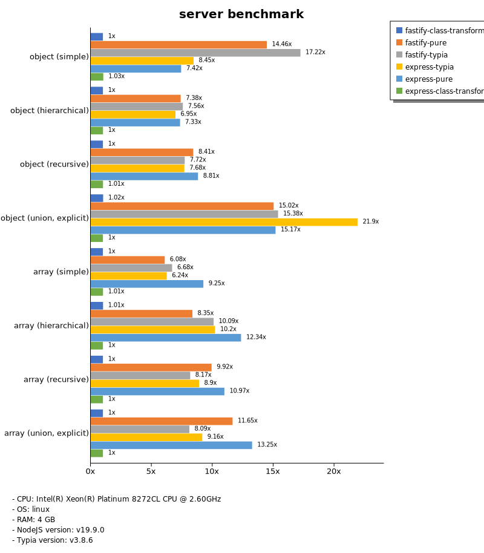

# Benchmark of `typia`
> - CPU: Intel(R) Xeon(R) Platinum 8272CL CPU @ 2.60GHz
> - Memory: 3,932 MB
> - OS: linux
> - NodeJS version: v19.9.0
> - Typia version: v3.8.6

## is

 Types | typia | typebox | ajv | io-ts | zod | class-validator 
-------|------|------|------|------|------|------
 object (simple) | 94,022 | 93,339 | 2,027 | 250 | 36 | 2.39 
 object (hierarchical) | 18,353 | 10,936 | 2,299 | 370 | 24 | 6.21 
 object (recursive) | 7,899 | 6,804 | 2,598 | 352 | 6.29 | 6.27 
 object (union, explicit) | 1,076 | 989 | 411 | 214 | 2.69 |  -  
 object (union, implicit) | 1,043 |  -  |  -  |  -  |  -  |  -  
 array (recursive) | 3,173 | 3,546 | 1,197 | 412 | 7.57 | 5.83 
 array (union, explicit) | 1,180 | 884 | 354 | 143 | 1.57 |  -  
 array (union, implicit) | 1,215 |  -  |  -  |  -  |  -  |  -  
 ultimate union | 414 |  -  |  -  |  -  |  -  |  -  

> Unit: Megabytes/sec

## assert

 Types | typia | typebox | io-ts | zod | class-validator 
-------|------|------|------|------|------
 object (simple) | 92,533 | 94,367 | 250 | 33 | 3.62 
 object (hierarchical) | 10,117 | 10,685 | 367 | 25 | 6.03 
 object (recursive) | 7,546 | 6,355 | 377 | 5.79 | 4.92 
 object (union, explicit) | 1,069 | 991 | 210 | 2.61 |  -  
 object (union, implicit) | 969 |  -  |  -  |  -  |  -  
 array (recursive) | 3,291 | 3,396 | 384 | 8.24 | 5.93 
 array (union, explicit) | 1,090 | 928 | 142 | 1.60 |  -  
 array (union, implicit) | 1,157 |  -  |  -  |  -  |  -  
 ultimate union | 415 |  -  |  -  |  -  |  -  

> Unit: Megabytes/sec

## validate

 Types | typia | typebox | io-ts | zod | class-validator 
-------|------|------|------|------|------
 object (simple) | 87,254 | 92,216 | 251 | 36 | 3.59 
 object (hierarchical) | 6,811 | 10,955 | 373 | 27 | 5.69 
 object (recursive) | 6,446 | 6,801 | 378 | 5.53 | 6.00 
 object (union, explicit) | 1,007 | 990 | 214 | 2.60 |  -  
 object (union, implicit) | 949 |  -  |  -  |  -  |  -  
 array (recursive) | 3,318 | 3,578 | 402 | 7.74 | 5.56 
 array (union, explicit) | 1,123 | 949 | 136 | 1.57 |  -  
 array (union, implicit) | 1,162 |  -  |  -  |  -  |  -  
 ultimate union | 383 |  -  |  -  |  -  |  -  

> Unit: Megabytes/sec

## assert-error

 Types | typia | typebox | io-ts | zod | class-validator 
-------|------|------|------|------|------
 object (simple) | 493 | 17 | 68 | 34 | 2.84 
 object (hierarchical) | 1,635 | 37 | 103 | 25 | 4.52 
 object (recursive) | 1,521 | 27 | 82 | 5.83 | 4.31 
 object (union, explicit) | 288 | 11 | 51 | 2.66 |  -  
 object (union, implicit) | 232 |  -  |  -  |  -  |  -  
 array (recursive) | 611 | 29 | 79 | 7.25 | 3.71 
 array (union, explicit) | 467 | 7.95 | 27 | 1.55 |  -  
 array (union, implicit) | 430 |  -  |  -  |  -  |  -  
 ultimate union | 152 |  -  |  -  |  -  |  -  

> Unit: Megabytes/sec

## validate-error

 Types | typia | typebox | io-ts | zod | class-validator 
-------|------|------|------|------|------
 object (simple) | 613 | 17 | 74 | 34 | 2.92 
 object (hierarchical) | 1,119 | 38 | 105 | 25 | 4.47 
 object (recursive) | 910 | 29 | 73 | 5.95 | 4.21 
 object (union, explicit) | 248 | 11 | 53 | 2.68 |  -  
 object (union, implicit) | 172 |  -  |  -  |  -  |  -  
 array (recursive) | 436 | 28 | 79 | 7.51 | 3.94 
 array (union, explicit) | 356 | 8.25 | 24 | 1.62 |  -  
 array (union, implicit) | 322 |  -  |  -  |  -  |  -  
 ultimate union | 111 |  -  |  -  |  -  |  -  

> Unit: Megabytes/sec

## optimizer

 Types | typia | typebox | ajv | class-validator 
-------|------|------|------|------
 object (simple) | 91,644 | 3.89 | 0.06 | 3.65 
 object (hierarchical) | 17,947 | 4.79 | 0.26 | 5.35 
 object (recursive) | 6,923 | 38 | 0.53 | 4.98 
 object (union, explicit) | 1,101 | 7.70 | 0.31 | 7.48 
 array (simple) | 4,856 | 134 | 1.30 | 15 
 array (hierarchical) | 8,095 | 426 | 7.55 | 12 
 array (recursive) | 3,829 | 367 | 5.41 | 5.05 
 array (union, explicit) | 2,238 | 78 | 2.16 | 15 

> Unit: Megabytes/sec

## stringify

 Types | typia.stringify | typia.isStringify | typia.assertStringify | fast-json-stringify | JSON.stringify | class-transformer 
-------|------|------|------|------|------|------
 object (simple) | 785 | 501 | 430 | 253 | 82 | 3.81 
 object (hierarchical) | 246 | 258 | 220 | 187 | 121 | 6.80 
 object (recursive) | 210 | 207 | 205 | 131 | 136 | 6.25 
 object (union, explicit) | 132 | 110 | 115 | 95 | 85 | 3.12 
 array (simple) | 81 | 81 | 76 | 95 | 128 | 6.69 
 array (hierarchical) | 144 | 140 | 135 | 198 | 137 | 5.14 
 array (recursive) | 125 | 116 | 118 | 135 | 121 | 5.44 
 array (union, explicit) | 94 | 95 | 91 | 147 | 159 | 5.45 

> Unit: Megabytes/sec

## server

 Types | fastify-class-transformer | fastify-pure | fastify-typia | express-typia | express-pure | express-class-transformer 
-------|------|------|------|------|------|------
 object (simple) | 3.45 | 50 | 59 | 29 | 26 | 3.56 
 object (hierarchical) | 6.62 | 49 | 50 | 46 | 49 | 6.65 
 object (recursive) | 5.98 | 50 | 46 | 46 | 53 | 6.01 
 object (union, explicit) | 2.72 | 40 | 41 | 58 | 41 | 2.67 
 array (simple) | 6.02 | 37 | 40 | 38 | 56 | 6.06 
 array (hierarchical) | 4.99 | 41 | 50 | 50 | 61 | 4.94 
 array (recursive) | 5.41 | 54 | 44 | 48 | 59 | 5.42 
 array (union, explicit) | 4.98 | 58 | 40 | 46 | 66 | 4.97 

> Unit: Megabytes/sec

Total elapsed time: 2,136,980 ms
