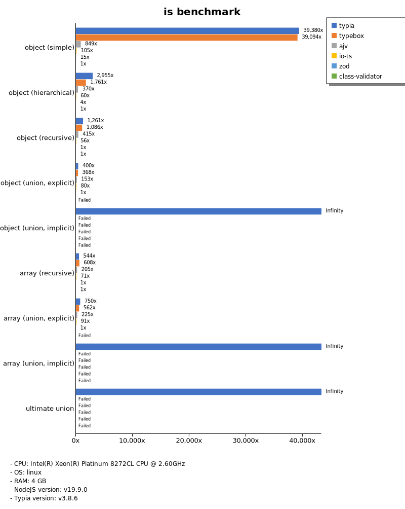
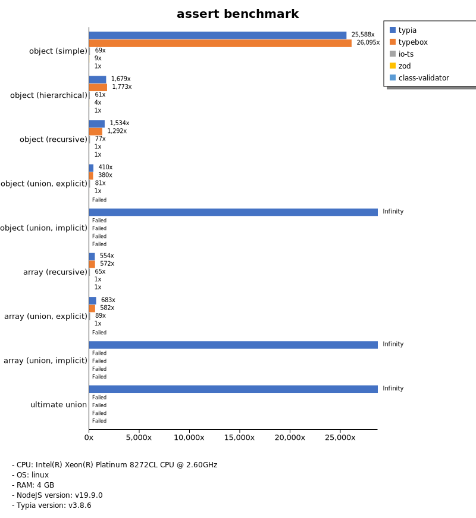
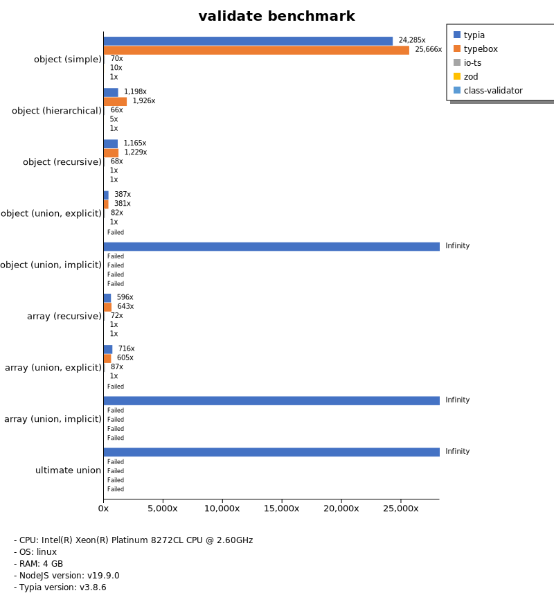
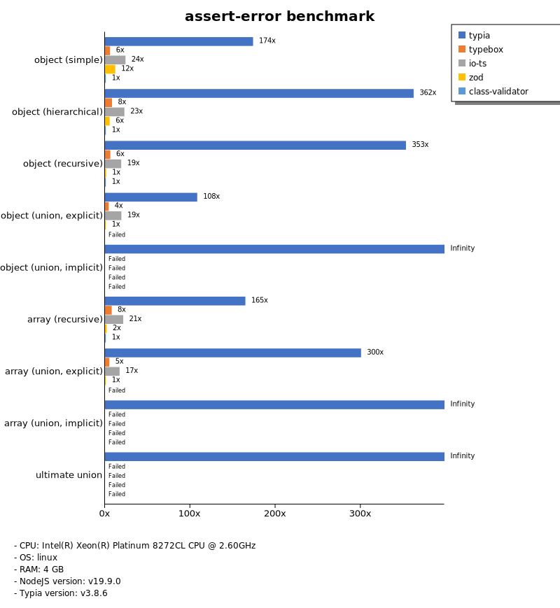
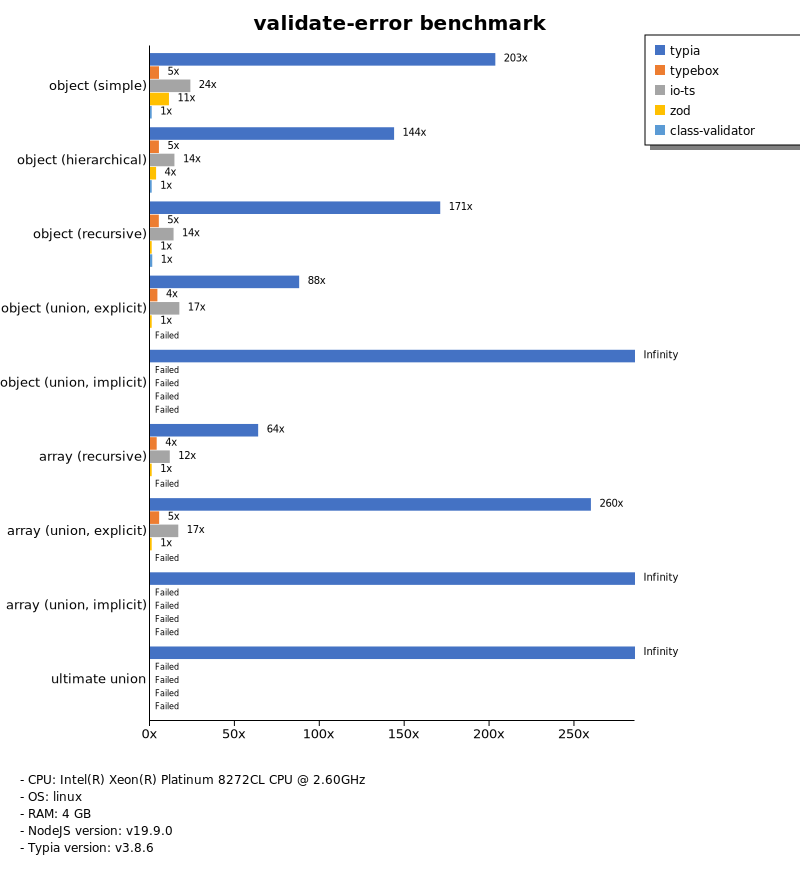
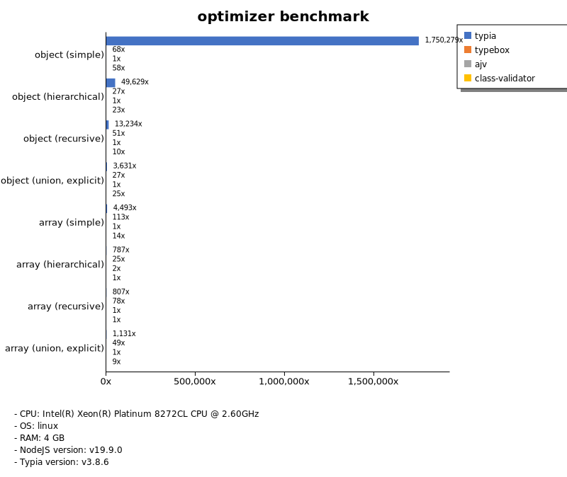
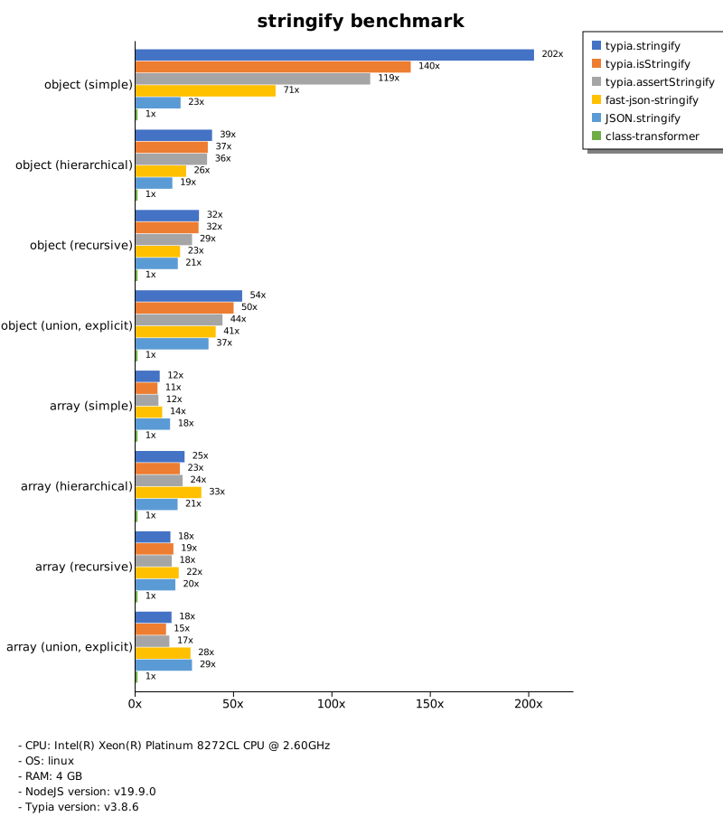

# Benchmark of `typia`
> - CPU: Intel(R) Xeon(R) Platinum 8272CL CPU @ 2.60GHz
> - Memory: 3,932 MB
> - OS: linux
> - NodeJS version: v19.9.0
> - Typia version: v3.8.6

## is

 Types | typia | typebox | ajv | io-ts | zod | class-validator 
-------|------|------|------|------|------|------
 object (simple) | 85,031 | 81,356 | 2,061 | 234 | 28 | 3.61 
 object (hierarchical) | 17,804 | 10,700 | 2,185 | 363 | 25 | 5.56 
 object (recursive) | 8,178 | 6,662 | 2,534 | 333 | 5.87 | 5.70 
 object (union, explicit) | 1,086 | 904 | 392 | 198 | 2.64 |  -  
 object (union, implicit) | 955 |  -  |  -  |  -  |  -  |  -  
 array (recursive) | 2,828 | 2,964 | 1,189 | 394 | 7.63 |  -  
 array (union, explicit) | 993 | 875 | 333 | 146 | 1.41 |  -  
 array (union, implicit) | 1,170 |  -  |  -  |  -  |  -  |  -  
 ultimate union | 377 |  -  |  -  |  -  |  -  |  -  

> Unit: Megabytes/sec

## assert

 Types | typia | typebox | io-ts | zod | class-validator 
-------|------|------|------|------|------
 object (simple) | 91,193 | 89,240 | 244 | 33 | 3.27 
 object (hierarchical) | 9,030 | 10,789 | 357 | 25 | 5.57 
 object (recursive) | 7,371 | 6,565 | 371 | 4.95 | 5.59 
 object (union, explicit) | 977 | 908 | 209 | 2.52 |  -  
 object (union, implicit) | 902 |  -  |  -  |  -  |  -  
 array (recursive) | 3,082 | 3,379 | 394 | 7.91 |  -  
 array (union, explicit) | 1,150 | 864 | 142 | 1.56 |  -  
 array (union, implicit) | 1,083 |  -  |  -  |  -  |  -  
 ultimate union | 368 |  -  |  -  |  -  |  -  

> Unit: Megabytes/sec

## validate

 Types | typia | typebox | io-ts | zod | class-validator 
-------|------|------|------|------|------
 object (simple) | 79,160 | 92,678 | 247 | 34 | 3.76 
 object (hierarchical) | 6,397 | 10,312 | 337 | 24 | 5.37 
 object (recursive) | 6,242 | 6,930 | 324 | 6.06 | 5.12 
 object (union, explicit) | 1,039 | 941 | 213 | 2.44 |  -  
 object (union, implicit) | 984 |  -  |  -  |  -  |  -  
 array (recursive) | 3,337 | 3,069 | 398 | 7.41 |  -  
 array (union, explicit) | 1,090 | 795 | 138 | 1.52 |  -  
 array (union, implicit) | 1,097 |  -  |  -  |  -  |  -  
 ultimate union | 391 |  -  |  -  |  -  |  -  

> Unit: Megabytes/sec

## assert-error

 Types | typia | typebox | io-ts | zod | class-validator 
-------|------|------|------|------|------
 object (simple) | 426 | 15 | 73 | 33 | 4.10 
 object (hierarchical) | 1,577 | 37 | 96 | 23 | 6.94 
 object (recursive) | 1,288 | 27 | 76 | 5.52 | 6.51 
 object (union, explicit) | 252 | 11 | 50 | 2.56 |  -  
 object (union, implicit) | 209 |  -  |  -  |  -  |  -  
 array (recursive) | 585 | 27 | 77 | 6.45 |  -  
 array (union, explicit) | 431 | 6.99 | 24 | 1.51 |  -  
 array (union, implicit) | 389 |  -  |  -  |  -  |  -  
 ultimate union | 146 |  -  |  -  |  -  |  -  

> Unit: Megabytes/sec

## validate-error

 Types | typia | typebox | io-ts | zod | class-validator 
-------|------|------|------|------|------
 object (simple) | 598 | 16 | 70 | 33 | 2.94 
 object (hierarchical) | 1,003 | 37 | 100 | 25 | 6.98 
 object (recursive) | 884 | 27 | 72 | 5.17 | 6.86 
 object (union, explicit) | 225 | 11 | 44 | 2.56 |  -  
 object (union, implicit) | 163 |  -  |  -  |  -  |  -  
 array (recursive) | 428 | 26 | 78 | 6.72 |  -  
 array (union, explicit) | 368 | 7.66 | 24 | 1.42 |  -  
 array (union, implicit) | 250 |  -  |  -  |  -  |  -  
 ultimate union | 110 |  -  |  -  |  -  |  -  

> Unit: Megabytes/sec

## optimizer

 Types | typia | typebox | ajv | class-validator 
-------|------|------|------|------
 object (simple) | 93,161 | 3.60 | 0.05 | 3.08 
 object (hierarchical) | 12,224 | 6.55 | 0.25 | 5.79 
 object (recursive) | 7,142 | 28 | 0.54 | 5.14 
 object (union, explicit) | 1,044 | 7.62 | 0.29 | 7.07 
 array (simple) | 4,441 | 112 | 0.99 | 14 
 array (hierarchical) | 8,363 | 266 | 16 | 11 
 array (recursive) | 3,601 | 346 | 5.24 | 4.46 
 array (union, explicit) | 1,886 | 81 | 1.67 | 16 

> Unit: Megabytes/sec

## stringify

 Types | typia.stringify | typia.isStringify | typia.assertStringify | fast-json-stringify | JSON.stringify | class-transformer 
-------|------|------|------|------|------|------
 object (simple) | 725 | 500 | 427 | 255 | 82 | 3.58 
 object (hierarchical) | 254 | 240 | 238 | 168 | 122 | 6.54 
 object (recursive) | 193 | 192 | 172 | 136 | 129 | 6.00 
 object (union, explicit) | 119 | 110 | 97 | 90 | 82 | 2.20 
 array (simple) | 81 | 73 | 76 | 89 | 115 | 6.57 
 array (hierarchical) | 140 | 127 | 135 | 188 | 120 | 5.63 
 array (recursive) | 103 | 111 | 106 | 127 | 117 | 5.79 
 array (union, explicit) | 95 | 80 | 89 | 144 | 148 | 5.18 

> Unit: Megabytes/sec

